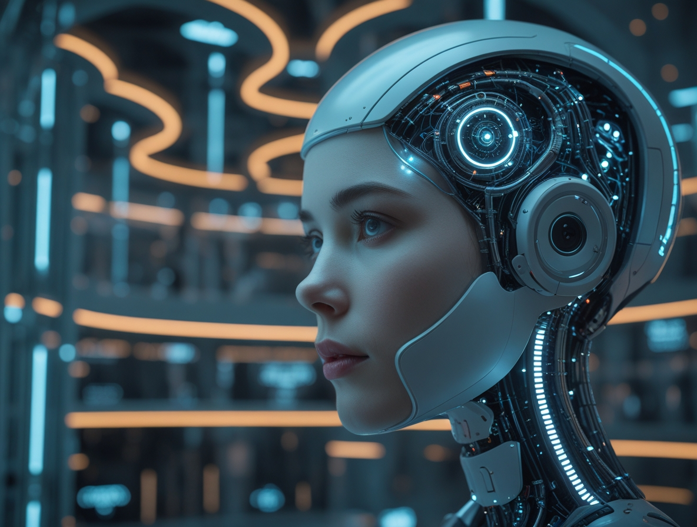

# L'Intelligenza Artificiale: Un Viaggio nella Tecnologia Che Sta Ridefinendo il Nostro Mondo

Se vi state chiedendo cosa sia realmente l'Intelligenza Artificiale e perché se ne parli così tanto, non siete soli. In questo momento storico, stiamo assistendo a una rivoluzione silenziosa ma potentissima che sta cambiando il modo in cui lavoriamo, impariamo e interagiamo con il mondo digitale. L'Intelligenza Artificiale (AI) non è più fantascienza: è qui, ora, e probabilmente la state già usando senza rendervene conto.

Quando aprite Netflix e vi vengono suggeriti film perfetti per i vostri gusti, quando chiedete a Siri di impostare una sveglia, o quando Google Traduttore vi aiuta a comprendere un testo in lingua straniera, state interagendo con sistemi di AI. Ma cosa si nasconde dietro questa tecnologia che sembra quasi magica?

L'Intelligenza Artificiale è una branca dell'informatica il cui obiettivo principale è creare sistemi e algoritmi capaci di svolgere compiti che, fino a poco tempo fa, erano esclusivo appannaggio dell'intelligenza umana. Questi compiti spaziano dal ragionamento e dall'apprendimento alla pianificazione, dalla percezione (sia essa visiva o vocale) alla comprensione del linguaggio naturale, fino alla risoluzione di problemi complessi.

## Un Campo Interdisciplinare con Radici Profonde

Per comprendere davvero l'AI, dobbiamo prima sfatare un mito: non si tratta solo di programmazione informatica. L'AI è un campo interdisciplinare che attinge a piene mani da diverse aree del sapere, come un puzzle complesso i cui pezzi provengono da discipline apparentemente distanti.

L'informatica fornisce le basi teoriche e pratiche essenziali per lo sviluppo di algoritmi e sistemi computazionali. È il linguaggio con cui parliamo alle macchine. La matematica, con concetti quali l'algebra lineare, il calcolo e la statistica, è la grammatica di questo linguaggio: senza di essa, i modelli di AI non potrebbero "imparare" dai dati.

Le neuroscienze offrono ispirazione cruciale, studiando il funzionamento del cervello umano per informare lo sviluppo delle reti neurali artificiali. È affascinante pensare che i ricercatori osservano come i nostri neuroni si connettono e comunicano per replicare questi processi in silicio e codice.

La psicologia contribuisce attraverso lo studio del comportamento e dei processi cognitivi umani, aiutando a creare sistemi di AI che possano interagire con noi in modo più naturale. La linguistica è cruciale per l'elaborazione del linguaggio naturale (NLP), permettendo alle macchine di comprendere, interpretare e generare il linguaggio umano. Infine, l'ingegneria è essenziale per la progettazione e l'implementazione concreta dei sistemi AI, sia a livello software che hardware.

## L'Evoluzione di un'Idea Rivoluzionaria: Dalla Teoria alla Rivoluzione Quotidiana

La storia dell'AI è una saga affascinante di sogni visionari, delusioni cocenti e trionfi inaspettati. Sebbene l'AI sia diventata un fenomeno di massa solo negli ultimi anni, le sue radici affondano negli anni '40 e '50, quando pionieri come Alan Turing iniziarono a esplorare l'idea di macchine intelligenti.

Nel 1950, Turing propose il celebre Test di Turing, un criterio apparentemente semplice ma rivoluzionario per valutare se una macchina potesse essere considerata "intelligente": se un essere umano non riusciva a distinguere, in una conversazione, tra le risposte di una macchina e quelle di un altro essere umano, allora quella macchina poteva essere considerata intelligente. Era un'idea audace per l'epoca, quando i computer occupavano intere stanze e faticavano a fare calcoli che oggi il nostro smartphone esegue in millisecondi.

La nascita formale dell'AI come disciplina scientifica è spesso ricondotta alla Conferenza di Dartmouth nel 1956, dove un gruppo di ricercatori visionari si riunì con l'ambizioso obiettivo di "far sì che le macchine usino il linguaggio, formino astrazioni e concetti, risolvano problemi ora riservati agli umani e si migliorino da sole".

L'evoluzione dell'AI è stata un viaggio caratterizzato da periodi di grande entusiasmo alternati a fasi di "inverno", in cui le aspettative si scontravano brutalmente con le limitazioni tecnologiche dell'epoca. Dopo una fase iniziale teorica, si passò a un periodo di simulazione (anni '60-'80) con lo sviluppo dei sistemi esperti, programmi basati su regole logiche per risolvere problemi specifici, e i primi passi nell'elaborazione del linguaggio naturale con chatbot primitivi come ELIZA, che simulava uno psicoterapeuta con risposte pre-programmate.

Gli anni '80 e '90 videro l'ascesa delle reti neurali artificiali e dell'apprendimento automatico (Machine Learning), tecnologie che imitano il funzionamento del cervello umano e permettono alle macchine di imparare dai dati invece di seguire solo regole rigide.

La fase moderna, dal 1990 ad oggi, è l'era dei Big Data e del Deep Learning. La crescente disponibilità di enormi dataset e l'incremento esponenziale della potenza di calcolo hanno permesso ai modelli di apprendimento automatico e, in particolare, alle reti neurali profonde (con molti strati, da cui "deep") di raggiungere prestazioni straordinarie in compiti complessi come il riconoscimento di immagini, il riconoscimento vocale e la traduzione automatica.

## L'Era dei Modelli Fondazionali: Quando l'AI Ha Imparato a Parlare Come Noi

Il 2022 ha segnato uno spartiacque nella storia dell'intelligenza artificiale. Nel 2025, aziende come OpenAI, Google, Anthropic e nuovi concorrenti come DeepSeek hanno ampliato i confini di ciò che i grandi modelli linguistici (LLM) possono fare. Ma tutto è iniziato con il lancio di ChatGPT da parte di OpenAI nel novembre 2022, un evento che ha catapultato l'AI dalla nicchia tecnologica al dibattito pubblico globale.

Improvvisamente, milioni di persone potevano conversare con una macchina in linguaggio naturale, chiedere spiegazioni complesse, ottenere aiuto nella scrittura, nella programmazione, persino nella risoluzione di problemi creativi. Non era più necessario essere programmatori o esperti di tecnologia: bastava porre una domanda come si farebbe con un amico particolarmente colto.

I Large Language Models (LLM) rappresentano un salto qualitativo enorme rispetto ai chatbot del passato. Questi sistemi, addestrati su enormi quantità di testo proveniente da internet, libri, articoli e documenti, hanno sviluppato una comprensione sorprendentemente sofisticata del linguaggio umano. Ma la vera magia non sta solo nella loro capacità di comprendere: è nella loro abilità di generare risposte coerenti, creative e contestualmente appropriate.

Oggi il panorama è dominato da alcuni giganti principali, ma sta rapidamente evolvendosi. ChatGPT di OpenAI rimane il più famoso e continua a evolversi con versioni sempre più potenti. Google ha risposto con Gemini (precedentemente Bard), integrando profondamente l'AI in tutto il suo ecosistema di servizi. Anthropic ha sviluppato Claude, noto per la sua sicurezza e la capacità di gestire conversazioni lunghe e complesse. Ma il 2025 ha visto l'emergere di un nuovo protagonista che ha scosso l'intero settore: DeepSeek, la startup cinese che ha innescato un crollo di oltre mille miliardi di dollari nei mercati azionari globali con un modello AI di ragionamento a basso costo che ha superato molti concorrenti occidentali. La loro app mobile è balzata in cima alle classifiche dell'App Store di Apple, superando persino ChatGPT, dimostrando come l'innovazione AI possa emergere da contesti inaspettati e ridefinire rapidamente gli equilibri di mercato.

Ma la vera rivoluzione è stata democratica: per la prima volta nella storia, tecnologie AI all'avanguardia sono diventate accessibili a chiunque abbia una connessione internet. Studenti usano questi strumenti per comprendere concetti difficili, scrittori per superare il blocco creativo, programmatori per debug del codice, professionisti per redigere email e relazioni.

Parallelamente ai modelli testuali, abbiamo assistito all'esplosione dell'AI multimodale. Sistemi come GPT-4 Vision possono "vedere" e descrivere immagini, DALL-E e Midjourney creano opere d'arte partendo da descrizioni testuali, mentre strumenti come Runway generano video da semplici prompt. La barriera tra immaginazione e creazione digitale si sta assottigliando rapidamente.

## Le Diverse Anime dell'AI: Una Mappa per Orientarsi

Per navigare in questo panorama complesso, è utile distinguere tra diverse tipologie di AI in base alle loro capacità, come fossero diverse specie di un ecosistema tecnologico in rapida evoluzione.

**ANI (Artificial Narrow Intelligence)**: È la forma di AI più diffusa oggi e quella con cui interagiamo quotidianamente. È specializzata nell'eseguire un compito molto specifico, come il riconoscimento facciale nelle foto, la traduzione automatica, o la raccomandazione di contenuti su piattaforme di streaming. Le sue capacità sono impressionanti ma limitate a quel singolo dominio: un sistema eccellente nel riconoscere volti non saprà tradurre testi.

**AGI (Artificial General Intelligence)**: Questo è il Santo Graal di molti ricercatori e il protagonista di innumerevoli dibattiti. Un'AGI possiederebbe un'intelligenza generale comparabile a quella umana, in grado di comprendere, apprendere e applicare l'intelligenza per risolvere qualsiasi compito intellettuale che un essere umano può affrontare. Potrebbe passare dall'analizzare dati finanziari alla composizione di poesie, dalla risoluzione di problemi matematici alla comprensione di sfumature emotive, tutto con la stessa versatilità di una mente umana. Non è ancora stata realizzata, ma gli esperti dibattono intensamente se e quando potrebbe emergere.

**ASI (Artificial Super Intelligence)**: Un concetto puramente teorico al momento, che fa tremare i polsi a ricercatori e futurologi. Un'ASI supererebbe l'intelligenza umana in tutti i campi, inclusa la creatività, la risoluzione di problemi e il ragionamento scientifico. Rappresenta sia il sogno ultimo di efficienza e progresso, sia l'incubo di una tecnologia che potrebbe sfuggire al controllo umano.

Oltre a queste classificazioni basate sul "livello" di intelligenza, è importante comprendere gli approcci chiave che stanno alimentando l'AI moderna. Il Machine Learning è il motore che permette alle macchine di imparare dai dati senza essere esplicitamente programmate per ogni situazione. Il Deep Learning, un sottocampo del Machine Learning, utilizza reti neurali con molti strati per riconoscere pattern complessi nei dati.

Gli Algoritmi Generativi rappresentano una frontiera particolarmente affascinante: invece di limitarsi a classificare o analizzare dati esistenti, questi sistemi possono creare nuovi contenuti - testi, immagini, musica, persino codice di programmazione - apprendendo i pattern dai dati di addestramento e generando variazioni originali.

## IA Generativa: Quando le Macchine Diventano Creative

Se dovessimo identificare il fenomeno più dirompente degli ultimi anni nell'AI, sarebbe senza dubbio l'emergere dell'intelligenza artificiale generativa. Questa tecnologia ha ribaltato il paradigma tradizionale dell'informatica: invece di seguire istruzioni precise per produrre risultati prevedibili, l'AI generativa crea contenuti originali partendo da semplici descrizioni in linguaggio naturale.

Immaginate di poter descrivere a parole un'immagine nella vostra mente e vedere un computer disegnarla per voi. O di poter chiedere la composizione di una melodia in stile jazz degli anni '40 e riceverla in pochi secondi. Questo non è più fantascienza: è la realtà quotidiana di milioni di utenti che utilizzano strumenti come DALL-E, Midjourney, Stable Diffusion per la generazione di immagini, o Suno e Udio per la creazione musicale.

L'impatto sulla creatività umana è profondo e controverso. Da un lato, questi strumenti democratizzano la creazione artistica: chiunque può ora produrre immagini professionali, comporre musica, o scrivere storie senza anni di formazione tecnica. Dall'altro, sollevano questioni fondamentali sui diritti d'autore, l'originalità artistica e il futuro delle professioni creative.

Nel mondo della programmazione, l'AI generativa ha creato una rivoluzione silenziosa ma potentissima. GitHub Copilot, sviluppato in collaborazione con OpenAI, può scrivere codice completo partendo da commenti in linguaggio naturale. Programmatori esperti riferiscono di essere diventati significativamente più produttivi, mentre principianti possono affrontare progetti complessi con un supporto intelligente che era impensabile solo pochi anni fa.

La sintesi vocale e la clonazione di voci hanno raggiunto livelli di realismo impressionanti. Sistemi come ElevenLabs possono replicare la voce di una persona partendo da pochi minuti di registrazione audio, aprendo possibilità incredibili per il doppiaggio, l'audiobook personalizzato, ma anche sollevando preoccupazioni legittime sui deepfake audio e la disinformazione.

## Applicazioni Attuali e Emergenti: L'AI nella Vita Quotidiana

L'intelligenza artificiale ha ormai permeato quasi ogni aspetto della nostra vita quotidiana, spesso in modi così sottili che non ce ne accorgiamo nemmeno. Ma oltre alle applicazioni ormai consolidate, stanno emergendo utilizzi che promettono di trasformare settori cruciali della società.

Nell'educazione, l'AI sta personalizzando l'apprendimento come mai prima d'ora. Piattaforme come Khan Academy utilizzano algoritmi intelligenti per adattare il ritmo e lo stile di insegnamento alle esigenze specifiche di ogni studente. Sistemi di tutoring AI possono identificare le lacune di conoscenza individuali e proporre esercizi mirati, mentre strumenti di valutazione automatica permettono ai docenti di concentrarsi più sul mentoring che sulla correzione meccanica.

Nel campo della ricerca scientifica, l'AI sta accelerando scoperte che richiederebbero decenni di lavoro umano. DeepMind's AlphaFold ha risolto uno dei problemi più complessi della biologia - la predizione della struttura delle proteine - aprendo nuove frontiere nella ricerca medica e farmaceutica. In astronomia, algoritmi di machine learning analizzano enormi dataset telescopici per identificare nuovi pianeti, stelle e fenomeni cosmici.

La medicina di precisione sta beneficiando enormemente dell'AI. Sistemi di diagnosi assistita possono identificare tumori in immagini mediche con precisione superiore ai radiologi umani, mentre algoritmi predittivi aiutano a identificare pazienti a rischio prima che sviluppino sintomi gravi. Durante la pandemia COVID-19, l'AI ha accelerato lo sviluppo di vaccini e aiutato a modellare la diffusione del virus.

Nel settore finanziario, l'AI non si limita più al trading algoritmico. Sistemi intelligenti valutano il rischio creditizio considerando migliaia di variabili, scoprono frodi in tempo reale e forniscono consulenza finanziaria personalizzata a milioni di utenti attraverso robo-advisor.

L'automazione industriale sta vivendo una seconda rivoluzione grazie all'AI. Fabbriche intelligenti utilizzano sistemi di visione computerizzata per il controllo qualità, algoritmi predittivi per la manutenzione preventiva e robot collaborativi che lavorano fianco a fianco con gli operatori umani.

## Sfide e Opportunità Future: Navigare Verso un'AI Responsabile

Mentre ci avviciniamo rapidamente a un futuro sempre più integrato con l'intelligenza artificiale, emergono sfide complesse che richiedono una gestione attenta e lungimirante. La regolamentazione rappresenta una delle frontiere più critiche e urgenti.

La legge sull'intelligenza artificiale è entrata in vigore il 1° agosto 2024 e sarà pienamente applicabile due anni dopo, il 2 agosto 2026., segnando l'Europa come pioniera nella regolamentazione dell'AI a livello globale. L'AI Act europeo rappresenta il primo tentativo comprensivo di creare un framework legale per l'intelligenza artificiale, classificando i sistemi AI in base al rischio e imponendo obblighi proporzionali. I nuovi obblighi applicabili ai modelli di intelligenza artificiale di uso generale (inclusi modelli linguistici di grandi dimensioni come ChatGPT, Gemini, Claude e Grok) sottolineano la trasparenza e le responsabilità in materia di copyright.

Questo approccio normativo non è solo burocratico: riflette una comprensione matura che l'AI, come tutte le tecnologie potenti, deve essere guidata da principi etici chiari. Le aziende tecnologiche si trovano ora ad affrontare requisiti di trasparenza che erano impensabili solo pochi anni fa, dovendo spiegare come i loro algoritmi prendono decisioni che influenzano milioni di vite.

La sostenibilità energetica rappresenta un'altra sfida cruciale spesso sottovalutata dal pubblico generale. L'addestramento di modelli AI avanzati richiede quantità enormi di energia elettrica. GPT-4, per esempio, ha richiesto mesi di calcolo su migliaia di chip grafici ad alte prestazioni. Questo solleva questioni ambientali serie: come bilanciare i benefici dell'AI con il suo impatto carbonico? Le aziende stanno investendo in data center alimentati da energie rinnovabili e sviluppando algoritmi più efficienti, ma la sfida rimane aperta.

Quando si parla di Artificial General Intelligence (AGI), le opinioni degli esperti si dividono drasticamente. Alcuni ricercatori prevedono il raggiungimento dell'AGI entro i prossimi 10-20 anni, mentre altri ritengono che siamo ancora molto lontani da questo traguardo. La verità è che non esiste una definizione universalmente accettata di cosa costituisca effettivamente un'AGI, rendendo difficile anche valutare i progressi verso questo obiettivo.

Ciò che è certo è che il percorso verso sistemi AI più generali e capaci richiederà non solo progressi tecnologici, ma anche una riflessione profonda su come integrare queste tecnologie nella società in modo benefico per tutti. La questione non è se l'AGI arriverà, ma come prepararci per gestire le sue implicazioni.

## L'AI e le Sfide Etiche: Quando la Tecnologia Incontra i Valori Umani

L'espansione rapida dell'intelligenza artificiale ha portato alla luce dilemmi etici che la società non aveva mai affrontato prima. Questi non sono problemi astratti da discutere nei laboratori universitari: sono questioni concrete che influenzano già oggi le nostre vite in modi significativi.

La gestione di grandi quantità di dati necessari per addestrare i modelli pone interrogativi fondamentali sulla privacy e sulla sicurezza delle informazioni personali. Ogni volta che interagiamo con un sistema AI, generiamo dati che possono essere utilizzati per migliorare questi sistemi, ma anche per tracciare, profilare e influenzare i nostri comportamenti. La domanda diventa: chi controlla questi dati e come vengono utilizzati?

I modelli di AI possono ereditare e amplificare i bias presenti nei dati di addestramento, portando a decisioni discriminatorie o ingiuste in aree critiche come la selezione del personale, la valutazione del credito, o persino la giustizia penale. Un algoritmo addestrato su dati storici che riflettono pregiudizi sociali può perpetuare e istituzionalizzare questi pregiudizi su scala massiva, creando sistemi di discriminazione automatizzata particolarmente insidiosi perché nascosti dietro un'apparente oggettività matematica.

L'emergere dei deepfake rappresenta una minaccia crescente all'integrità dell'informazione. La capacità di creare video e audio falsi ma convincenti di personaggi pubblici sta alimentando preoccupazioni legittime sulla disinformazione e la manipolazione dell'opinione pubblica. In un'epoca già segnata da "post-verità" e fake news, i deepfake aggiungono un ulteriore livello di complessità alla sfida di distinguere tra realtà e finzione.

I diritti d'autore nell'era dell'AI generativa stanno creando un terreno di battaglia legale complesso. Quando un'AI crea un'immagine, una melodia o un testo, chi ne possiede i diritti? E cosa succede quando l'AI è stata addestrata su opere protette da copyright senza il consenso esplicito degli autori originali? Artisti, scrittori e musicisti stanno intentando cause legali contro le aziende di AI, sostenendo che i loro lavori sono stati utilizzati illegalmente per addestrare sistemi commerciali.

La trasparenza degli algoritmi rappresenta un'altra frontiera cruciale. Molti sistemi AI moderni, specialmente quelli basati su deep learning, sono "scatole nere": funzionano efficacemente, ma è difficile o impossibile spiegare esattamente come arrivino a una specifica decisione. Questo è problematico quando questi sistemi vengono utilizzati in contesti ad alto impatto come la medicina, la giustizia o la finanza, dove la capacità di spiegare e giustificare le decisioni è essenziale.

## L'Automazione e il Futuro del Lavoro: Trasformazione, Non Solo Distruzione

Una delle preoccupazioni più diffuse riguardo all'AI è il suo impatto sul lavoro umano. I titoli sensazionalistici spesso parlano di "robot che rubano posti di lavoro", ma la realtà è più sfumata e complessa. L'automazione spinta dall'AI sta certamente trasformando il panorama lavorativo, ma sta anche creando nuove opportunità che erano impensabili solo pochi anni fa.

È vero che alcuni lavori ripetitivi e basati su regole fisse stanno scomparendo o si stanno riducendo significativamente. Call center automatizzati gestiscono sempre più richieste di customer service, software di contabilità automatizzano compiti che richiedevano ore di lavoro manuale, e sistemi di traduzione automatica stanno cambiando il mercato dei servizi linguistici.

Tuttavia, parallelamente stanno emergendo nuove professioni e specializzazioni. "Prompt engineer" - esperti nella comunicazione efficace con sistemi AI - è diventato un ruolo ricercato e ben retribuito. Specialisti in etica dell'AI, supervisori di sistemi automatizzati, e "AI trainer" che si occupano di addestrare e affinare modelli di intelligenza artificiale rappresentano nuove categorie professionali in rapida crescita.

Molti lavori, invece di scomparire, si stanno evolvendo verso una collaborazione uomo-macchina. Medici utilizzano AI per diagnosi più precise ma mantengono il controllo delle decisioni terapeutiche e della relazione con i pazienti. Avvocati utilizzano sistemi intelligenti per ricerca legale e analisi di documenti, ma rimangono insostituibili per strategia, negoziazione e rappresentanza in tribunale. Designer collaborano con AI generativa per esplorare rapidamente diverse opzioni creative, ma il gusto, la visione e la comprensione del contesto culturale rimangono distintamente umani.

La chiave per navigare questa transizione è l'adattabilità e l'apprendimento continuo. Le competenze più resistenti all'automazione sono quelle che richiedono creatività, empatia, pensiero critico complesso e capacità di lavorare in situazioni ambigue e non strutturate. Investire in queste competenze "umane" diventa cruciale in un mondo sempre più automatizzato.

## Una Guida per Navigare nel Futuro: Cosa Significa Tutto Questo per Voi?

Comprendere l'Intelligenza Artificiale, le sue basi teoriche, la sua evoluzione, le sue applicazioni e le sue implicazioni non è più un lusso per appassionati di tecnologia: è diventata una necessità per navigare consapevolmente nel panorama contemporaneo. Ma cosa significa concretamente tutto questo per la persona comune?

Prima di tutto, significa sviluppare una "alfabetizzazione digitale" che includa una comprensione di base di come funzionano questi sistemi. Non dovete diventare programmatori, ma comprendere che l'AI impara dai dati, che può avere bias, che non è infallibile, e che le sue risposte devono essere valutate criticamente vi renderà utenti più consapevoli e efficaci.

Significa anche esplorare attivamente come l'AI può migliorare la vostra vita professionale e personale. Se siete studenti, sistemi come ChatGPT o Claude possono diventare tutor personalizzati per aiutarvi a comprendere concetti difficili. Se lavorate in ufficio, strumenti AI possono automatizzare compiti ripetitivi liberando tempo per attività più creative e strategiche. Se siete creativi, l'AI generativa può diventare un partner per esplorare nuove idee e superare blocchi creativi.

Tuttavia, è cruciale sviluppare anche una consapevolezza critica. Interrogatevi sempre sull'origine e l'affidabilità delle informazioni fornite da sistemi AI. Comprendete che questi strumenti riflettono i dati e i valori con cui sono stati addestrati. Mantenete il controllo delle decisioni importanti invece di delegarle completamente agli algoritmi.

L'obiettivo di questa esplorazione dell'AI non è solo educare, ma anche ispirare curiosità e creatività nell'uso di queste tecnologie. L'AI è uno strumento potentissimo, ma rimane sempre uno strumento: il suo valore dipende da come lo utilizziamo e dagli obiettivi che ci poniamo.

## Guardando al Futuro: L'AI Come Amplificatore dell'Umanità

Mentre concludiamo questo viaggio attraverso il mondo dell'intelligenza artificiale, è importante mantenere una prospettiva bilanciata. L'AI non è né la panacea per tutti i problemi dell'umanità né l'apocalisse tecnologica temuta dai catastrofisti. È una tecnologia potente che amplifica le capacità umane, con tutto ciò che questo comporta di positivo e negativo.

Gli anni che abbiamo davanti saranno cruciali per determinare la direzione di questa rivoluzione tecnologica. Le scelte che facciamo oggi - come individui, come società, come specie - riguardo allo sviluppo, alla regolamentazione e all'implementazione dell'AI definiranno il tipo di futuro che stiamo costruendo.

La sfida non è fermare il progresso tecnologico - sarebbe impossibile e controproducente - ma guidarlo in modo che rifletta i nostri valori più alti e serva il bene comune. Questo richiede un impegno attivo da parte di tutti: cittadini informati che partecipano al dibattito pubblico, policymaker che creano regolamentazioni ponderate, ricercatori che sviluppano tecnologie responsabili, e aziende che danno priorità all'impatto sociale oltre al profitto.

L'intelligenza artificiale rappresenta probabilmente il più grande amplificatore di capacità umane mai creato. Come ogni amplificatore, non cambia la natura del segnale che riceve, ma lo rende più potente. Se alimentiamo l'AI con saggezza, creatività e compassione, otterremo una tecnologia che amplifica questi aspetti migliori dell'umanità. Se invece la sviluppiamo guidati solo da profitto a breve termine o da visioni ristrette, rischiamo di amplificare anche i nostri difetti e pregiudizi.

## Conclusioni: Il Nostro Ruolo nell'Era dell'AI

In sintesi, l'Intelligenza Artificiale è una forza potente e trasformativa che sta plasmando il nostro futuro in modi inimmaginabili. Non è una tecnologia che ci capita addosso passivamente: siamo tutti attori in questa trasformazione, con la responsabilità e l'opportunità di influenzarne la direzione.

La vera rivoluzione non sta nella tecnologia stessa, ma in come scegliamo di integrarla nelle nostre vite e nella nostra società. Bilanciare l'innovazione con la consapevolezza delle implicazioni etiche e sociali sarà la chiave per garantire che questa tecnologia sia utilizzata per potenziare l'umanità e costruire un mondo migliore per tutti.

Il futuro dell'AI non è predeterminato: siamo noi a scriverlo, una decisione alla volta, una applicazione alla volta, una regolamentazione alla volta. E per farlo bene, dobbiamo tutti diventare cittadini digitali consapevoli, capaci di navigare con saggezza in questo nuovo mondo che stiamo creando insieme alle macchine intelligenti.

Questa è la sfida e l'opportunità del nostro tempo: non solo utilizzare l'AI, ma plasmarla in modo che rifletta il meglio di ciò che significa essere umani. 
