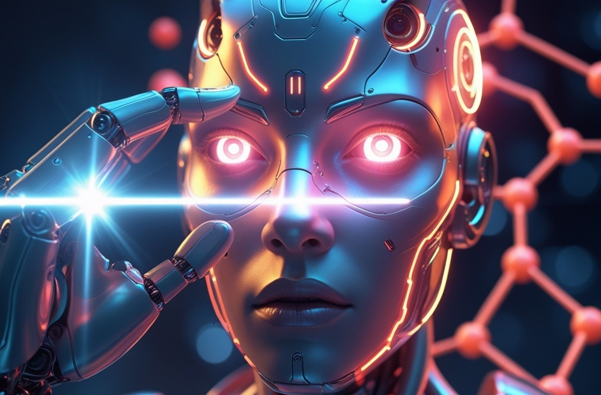

# Artificial Intelligence Today: From Consolidated Applications to Future Frontiers

*After exploring the theoretical and historical foundations of artificial intelligence in the first two articles of our series, it is time to dive into the beating heart of this technological revolution: its concrete applications in the real world. If in past years AI seemed confined to research laboratories and science fiction films, today it has become a constant and often invisible presence in our daily lives, transforming sectors ranging from medicine to entertainment, from finance to robotics.*

## Gaming: Where AI Took Its First Giant Steps

The world of games represents one of the most fascinating battlegrounds for artificial intelligence. It is no coincidence that many of AI's most striking victories have occurred right here, on real and virtual chessboards that have captured the imagination of the global public.

### The Chess Revolution and Beyond

The history of AI in gaming begins with chess. While IBM's Deep Blue marked the first historic victory against a world champion in 1997, modern programs like **Stockfish** and **Komodo** have reached levels of play that surpass any human. These systems can evaluate millions of positions per second, using advanced search algorithms combined with heuristic evaluations refined over decades of development.

But the real revolution came with DeepMind's **AlphaGo** in 2016. Go, an ancient Chinese game with a number of possible configurations greater than the atoms in the observable universe, was considered the final frontier of AI in board games. AlphaGo's victory against Lee Sedol was not only a demonstration of computational power but also showed for the first time a form of artificial "intuition," with moves that initially seemed like mistakes but turned out to be brilliant long-term strategies.

### AI in Modern Video Games

By 2025, artificial intelligence in video games has made giant leaps. Recent experiments with generative 3D simulations are paving the way for entirely new types of games, where a simple sketch can be transformed into a playable environment in real-time. This evolution goes far beyond traditional NPCs (non-player characters) reacting to player actions.

Modern AI systems in video games use machine learning techniques to create dynamic and personalized experiences. NPCs are no longer limited to following predefined scripts but learn from player strategies, adapting their behavior to offer ever-new and balanced challenges. Procedural content generation, supported by AI, allows for the creation of open worlds, missions, and even storylines that evolve based on player choices.

## Natural Language Processing: When Machines Learn to Speak

If there is one field where AI has shown spectacular progress in recent years, it is certainly natural language processing (NLP). The ability of machines to understand, interpret, and generate human language has reached levels that seemed like science fiction just a few years ago.

### The Machine Translation Revolution

Google Translate, launched in 2006, made a quantum leap with the introduction of neural networks in 2016. Today, machine translation is no longer limited to mechanically replacing words but understands context, cultural nuances, and even the mood of the text. The most advanced models can translate not only written text but also real-time conversations, supporting hundreds of languages and dialects.

Neural translation technology has made instant communication possible between people speaking different languages, breaking down linguistic barriers that have divided humanity for millennia. From travel apps to professional tools for interpreters, machine translation has become a universal bridge between different cultures.

### Virtual Assistants: Our Digital Companions

Siri, Alexa, Google Assistant, and their numerous "colleagues" have transformed the way we interact with technology. These virtual assistants combine voice recognition, natural language processing, and machine learning to offer an intuitive conversational interface.

The evolution of these systems has been constant: from simple voice searches in the beginning, today they can manage complex conversations, control smart home ecosystems, schedule appointments, make online purchases, and even provide basic emotional support. Their integration into increasingly varied devices – from phones to appliances, from cars to wearables – has made them ubiquitous digital companions.

### Intelligent Text Generation

The arrival of ChatGPT at the end of 2022 marked a turning point in public perception of AI. In the current 2025 landscape, models like Claude 4 are demonstrating superior performance in code generation, achieving accuracies of 62-70% in benchmarks simulating real-world programming tasks.

Today's Large Language Models (LLMs) are not limited to generating coherent text but can:

- Write programming code in dozens of languages
- Create creative content such as poems, short stories, and screenplays
- Analyze and summarize complex documents
- Provide technical explanations tailored to different levels of expertise
- Translate not only between different languages but also between communication styles

The future of AI is increasingly oriented towards multimodal models, such as OpenAI's text-to-video Sora and ElevenLabs' voice generators, capable of handling non-textual data like audio, video, and images.

## Expert Systems: Artificial Intelligence at the Service of Critical Decisions

Expert systems represent one of the most mature and strategic applications of artificial intelligence, particularly in sectors where decisions have critical consequences on human life and economic processes.

### Medical Diagnostics: When AI Saves Lives

In the medical field, AI has demonstrated diagnostic capabilities that in some cases surpass those of human doctors. AI-based medical imaging systems can identify tumors in X-rays, MRIs, and CT scans with an accuracy greater than 95%, often detecting anomalies that escape the human eye.

Robots like Moxi, produced by Diligent Robotics, represent a new generation of healthcare assistants. This 1.2-meter-tall robot supports nursing staff in hospitals by performing tasks such as delivering supplies to patients and collecting laboratory samples, using sensors and AI technologies to navigate clinical environments.

Modern AI diagnostic systems are not limited to the simple identification of pathologies but can:

- Predict the evolution of chronic diseases
- Suggest personalized therapeutic protocols
- Monitor patients' vital signs in real-time
- Identify dangerous drug interactions
- Optimize the distribution of hospital resources

A particularly impressive example is AI systems for eye diagnostics, which can identify diabetic retinopathy and glaucoma through simple photographs of the fundus, making mass screening possible in areas of the world where access to specialists is limited.

### Decision Support: AI in Finance and Logistics

In the financial sector, automatic trading algorithms process thousands of transactions per second, analyzing complex market patterns and making investment decisions in milliseconds. These systems not only react to market movements but can anticipate trends based on sentiment analysis of social media, economic news, and macroeconomic indicators.

In 2025, demand for specialized chips (ASICs) could accelerate with increased adoption of edge AI on smaller devices, as companies seek less prescriptive approaches for their data center infrastructures.

Modern logistics is unthinkable without AI. Amazon, UPS, DHL, and other companies use advanced algorithms to:

- Optimize delivery routes in real-time
- Predict demand and manage inventory
- Automate warehouses with intelligent robots
- Coordinate fleets of autonomous vehicles
- Reduce waste and environmental impact

## Computer Vision: The Digital Eyes of the Future

The ability of machines to "see" and interpret the visual world has reached extraordinary levels, opening up application possibilities ranging from public safety to medicine, from automotive to entertainment.

### Image Recognition: Precision Beyond Human

Modern computer vision systems can identify and classify objects, faces, scenes, and activities with an accuracy that often surpasses human capabilities. Convolutional Neural Networks (CNNs) have revolutionized this field, allowing machines to recognize complex visual patterns hierarchically, much like the human brain does.

The practical applications are countless:

- **Airport security**: Scanners that identify dangerous objects in luggage
- **Precision agriculture**: Drones that monitor crop health
- **Industrial quality control**: Systems that detect defects in products
- **Medicine**: Automatic analysis of biopsies and diagnostic imaging
- **Retail**: Automatic checkouts without cashiers

### Autonomous Driving: The Road to the Future

Self-driving cars represent one of AI's most ambitious frontiers. Companies like Tesla, Waymo, Cruise, and dozens of startups are developing systems that promise to revolutionize urban and interurban transportation.

Despite progress, experts remain cautious about the timing of large-scale deployment. Although companies like Tesla with Optimus and 1X with Neo are developing humanoid robots, it is unlikely they will be widely available to consumers in 2025, as these robots are still in the early stages of development.

Autonomous vehicles use a combination of technologies:

- **LiDAR**: To create 3D maps of the surrounding environment
- **Cameras**: To recognize road signs, pedestrians, and other vehicles
- **Radar**: To detect objects in low visibility conditions
- **Advanced GPS**: For precise localization
- **AI for sensor fusion**: To integrate all data in real-time

The technical challenges are enormous: predicting unpredictable human behavior, managing adverse weather conditions, navigating complex urban contexts, and ensuring safety in all circumstances.

## Biometric Recognition: Identity in the Digital Age

### Facial Recognition: Convenience and Controversy

Facial recognition has become ubiquitous: from smartphone cameras to urban surveillance cameras, from airport controls to digital payments. Apple's Face ID technology has democratized the use of facial biometrics, while more advanced systems are used for public safety and crime prevention.

However, this technology raises significant ethical questions:

- **Privacy**: Who controls the collected biometric data?
- **Algorithmic bias**: Some systems show different accuracy for different ethnicities
- **Mass surveillance**: The risk of hyper-controlled societies
- **Consent**: Many systems operate without explicit user consent

### Voice Recognition: Voice as the Key

Voice recognition is not only used for commands to virtual assistants. Advanced systems can identify specific individuals through unique voice characteristics, used for:

- **Telephone banking authentication**
- **Corporate security systems**
- **Access control in sensitive environments**
- **Automatic transcription of meetings and conferences**

The technology has reached accuracy levels above 95% even in noisy environments, supporting hundreds of languages and regional accents.

## Intelligent Robotics: Towards a World of Human-Machine Collaboration

Modern robotics is no longer just about industrial automation but is evolving towards intelligent robots capable of collaborating with humans in complex and unstructured environments.

### Industrial Robotics 4.0

The fourth industrial revolution sees robots that are not limited to repeating programmed tasks but can:

- **Adapt to variations**: Modify behavior based on changes in the work environment
- **Collaborate with humans**: Work safely લોકો alongside human operators
- **Learn continuously**: Improve performance through experience
- **Communicate**: Interface with other systems and operators through natural language

Collaborative robots (cobots) are transforming sectors such as automotive, electronics, pharmaceuticals, and food, where precision and consistency are critical.

### Service Robotics: Robots for Everyday Life

Service robots are slowly entering our homes and communities:

- **Domestic robots**: Smart vacuum cleaners, kitchen robots, assistants for the elderly
- **Commercial robots**: Cleaning staff, museum guides, waiters in restaurants
- **Healthcare robots**: Assistants for the disabled, companions for pediatric therapies
- **Delivery robots**: Drones and ground robots for delivery

### Military and Rescue Robotics

In critical areas, intelligent robots are saving human lives:

- **Rescue robots**: For interventions in natural disasters and hazardous environments
- **Military robots**: For reconnaissance and demining missions
- **Underwater robots**: For marine exploration and offshore repairs
- **Space robots**: For exploration missions and satellite maintenance

## Emerging Applications: The Frontiers of 2025

### AI in Creativity: When Machines Become Artists

Artificial intelligence is challenging the traditional notion of human creativity. Tools like DALL-E, Midjourney, Stable Diffusion for images, and Suno, Udio for music, allow anyone to create professional-quality content through simple textual descriptions.

In 2025, we are witnessing:

- **Generative AI for cinema**: Creation of special effects, dubbing in different languages, even virtual actors
- **Automated design**: From graphics to logos, from architecture to industrial design
- **Music composition**: Personalized soundtracks, automatic remixes, new musical genres
- **Creative writing**: Collaboration between human authors and AI for novels, screenplays, poems

### AI in Finance: Beyond Algorithmic Trading

In 2025, 94% of AI and data leaders confirm that interest in AI is leading to a greater focus on data, particularly in the field of generative AI. The financial sector is seeing innovative applications:

- **Personalized credit analysis**: Risk assessment based on thousands of variables
- **Real-time fraud prevention**: Identification of suspicious transactions in milliseconds
- **Automated financial advice**: Robo-advisors managing personalized portfolios
- **Dynamic insurance**: Premiums that adapt in real-time to the insured's behavior

### AI in Mental Health: Accessible Psychological Support

One of the most promising applications of AI concerns mental health support:

- **Therapeutic chatbots**: Available 24/7 for immediate support
- **Mood monitoring**: Analysis of vocal, textual, and behavioral patterns
- **Personalized therapy**: Programs adapted to individual needs
- **Early detection**: Identification of signs of stress, depression, eating disorders

### AI in the Public Sector and Governance

In 2025, AI is set to become a cornerstone of public sector operations, transforming how agencies make decisions and serve citizens. By leading with AI-driven innovation, government agencies can improve efficiency, enhance decision-making, and provide better services to citizens.

Applications include:

- **Smart public services**: Chatbots for citizen information, automated permits
- **Traffic management**: Optimization of traffic lights, prevention of traffic jams
- **Urban planning**: Predictive analysis for sustainable city development
- **Public safety**: Crime prediction, optimization of patrols

## Challenges and Ethical Considerations

### The Problem of Algorithmic Bias

One of the most critical problems of modern AI is the bias present in training data. If the data used to train an AI system contains human biases, the algorithm will replicate and amplify them. This has led to:

- Less accurate facial recognition systems for certain ethnicities
- Hiring algorithms that discriminate against women or minorities
- Credit systems that penalize certain demographic groups
- Chatbots that reproduce social stereotypes

### Privacy and Surveillance

AI has made previously unthinkable levels of surveillance possible. The ability to analyze enormous amounts of personal data raises fundamental questions:

- Who has access to our data?
- How is it used?
- Can we control or delete information about ourselves?
- What is the balance between security and privacy?

### Impact on Work

AI-driven automation is transforming the job market:

- **Jobs at risk**: Many professions could be automated
- **New opportunities**: Roles related to AI management and supervision are emerging
- **Reskilling**: Need to train workers for new skills
- **Inequalities**: Risk of widening the gap between skilled and unskilled workers

### AI Governance

In 2025, business leaders will no longer have the luxury of addressing AI governance inconsistently or only in parts of the business. As AI becomes intrinsic to operations and market offerings, companies will need systematic and transparent approaches.

The need for regulation is urgent:

- **International standards**: Global agreements on AI safety and ethics
- **Algorithmic transparency**: The right to understand how systems that affect us work
- **Accountability**: Who is responsible when an AI system causes harm?
- **Testing and certification**: Procedures to validate the safety of AI systems

## Future Trends: What Awaits Us

### Multimodal Models and Generalist AI

One of the biggest evolutions next year can be summed up in two words: testing and personalization. If you can measure risks and threats, you can help address or mitigate them.

The future of AI seems oriented towards increasingly generalist systems:

- **Multimodal models**: Capable of simultaneously processing text, images, audio, video
- **Embodied AI**: Systems that can physically interact with the world
- **Advanced reasoning**: The new Claude Opus 4 and Claude Sonnet 4 models can analyze large datasets, perform long-term tasks, and undertake complex actions, with particular effectiveness in programming tasks
- **Autonomous agents**: AI capable of completing complex tasks with minimal supervision

### Edge AI and Democratization

AI is migrating from the cloud to local devices:

- **Smarter smartphones**: Local AI processing for privacy and speed
- **Smart IoT**: Appliances and sensors with integrated AI capabilities
- **Autonomous vehicles**: Real-time processing without dependence on connectivity
- **Advanced wearables**: Wearable devices with AI for health and fitness

### Sustainability and Green AI

The growing attention to AI's environmental impact is driving innovation:

- **More efficient algorithms**: Reduction of energy consumption for training and inference
- **Specialized hardware**: Chips designed specifically for AI with lower consumption
- **Federated models**: Distributed training that reduces data transfer
- **AI for sustainability**: Using AI to optimize energy consumption and reduce waste

## AI in Scientific Research

One of the most promising applications of artificial intelligence involves accelerating scientific research. AI is transforming how we conduct experiments, analyze data, and make discoveries:

### Drug Discovery

AI can analyze millions of chemical compounds to identify potential drugs, reducing development times from decades to years. Companies like DeepMind with AlphaFold have revolutionized protein structure prediction, opening new possibilities for personalized medicine.

### Materials Research

Machine learning algorithms can predict the properties of new materials even before they are synthesized, accelerating the development of more efficient batteries, superconductors, and renewable energy materials.

### Astronomy and Physics

AI analyzes enormous amounts of telescopic data to identify exoplanets, gravitational waves, and other cosmic phenomena. At CERN, AI algorithms process data from particle collisions to identify new subatomic particles.

## AI in Education: Personalization of Learning

Education is undergoing an AI-driven transformation:

### Personalized Tutoring

AI systems can adapt the curriculum to individual learning abilities and speeds, identifying knowledge gaps and providing targeted exercises.

### Automatic Assessment

AI can evaluate not only multiple-choice answers but also essays, creative projects, and oral presentations, providing detailed and constructive feedback.

### Accessibility

AI tools make education more accessible to students with disabilities through automatic transcription, simultaneous translation, and adaptive interfaces.

## Current Technical Challenges

### The Hallucination Problem

AI models can generate convincing but completely false information. This "hallucination" represents a critical challenge for applications where accuracy is vital.

### Interpretability

Many AI systems, especially deep neural networks, are "black boxes" – they work effectively, but we cannot explain exactly how they reach their conclusions.

### Robustness

AI systems can be fragile, failing completely when faced with inputs slightly different from those on which they were trained.

### Scaling Laws

As models become larger, they require exponentially more computational resources, raising questions of sustainability and accessibility.

## Economic Considerations

The economic impact of AI is already significant and continues to grow:

### Investments and Market

The global AI market is projected to reach $1.8 trillion by 2030, with massive investments from governments and private companies.

### New Business Models

AI is creating new economic models:

- **AI-as-a-Service**: Access to AI capabilities via cloud APIs
- **Freemium AI**: Free AI services with premium paid features
- **AI marketplace**: Platforms for buying and selling specialized AI models

### Concentration of Power

The concentration of AI resources in a few large technology companies raises antitrust and democratic concerns.

## AI and Human Creativity

Contrary to initial fears, AI is not replacing human creativity but amplifying it:

### Creative Collaboration

Artists, musicians, and writers use AI as a collaborative tool, exploring new expressive forms impossible without artificial assistance.

### Democratization of Creative Tools

AI makes professional creative tools accessible to anyone with an idea, breaking down technical and economic barriers.

### New Art Forms

New artistic categories native to the AI era are emerging, from interactive generative art to human-AI musical performances.

## Geopolitical Implications

AI is redefining global power balances:

### Technological Competition

The "AI race" between the United States, China, Europe, and other powers is influencing trade policies, research investments, and international alliances.

### Digital Sovereignty

Countries are developing strategies to maintain control over their data and AI capabilities, balancing innovation and national security.

### AI Diplomacy

New forms of international cooperation are emerging to establish global norms on the responsible use of AI.

## Future Perspectives: Beyond 2025

Looking beyond the immediate horizon, several trends seem to be emerging:

### Artificial General Intelligence (AGI)

While AGI remains a long-term goal, incremental progress towards more generalist systems will continue.

### Quantum AI

The integration of quantum computing and AI could unlock revolutionary computational capabilities.

### Neuromorphic Computing

Chips inspired by the human brain could make AI more energy-efficient and suitable for edge applications.

### Bio-AI Integration

The interface between biological and artificial systems could lead to new forms of hybrid intelligence.

## Recommendations for Navigating the AI Era

### For Individuals

- **Lifelong Learning**: Develop skills complementary to AI
- **Digital Literacy**: Understand AI fundamentals to be informed citizens
- **Critical Thinking**: Maintain critical evaluation skills for information

### For Organizations

- **AI Strategy**: Develop strategic plans for AI adoption
- **Governance**: Implement ethical and governance frameworks
- **Talent**: Invest in training and acquisition of AI talent

### For Governments

- **Agile Regulation**: Develop regulations that promote responsible innovation
- **Public Investments**: Support AI research and development
- **Education**: Adapt educational systems to the needs of the AI era

## Conclusion: AI as an Amplifier of Human Potential

As we conclude this journey through the applications of artificial intelligence in 2025, a complex but fascinating picture emerges. AI is no longer a futuristic technology confined to research laboratories but a pervasive reality that is redefining every aspect of our existence, from the way we work and communicate, to how we care for our health and create art.

### An Ever-Evolving Ecosystem of Innovation

What we have observed is a rapidly evolving technological ecosystem, where AI applications intertwine and amplify each other. Computer vision fuels autonomous driving systems, which in turn generate data to improve navigation algorithms. Natural language models empower virtual assistants, which become more capable of handling complex conversations and supporting critical decisions. Expert systems in medicine collaborate with surgical robots for millimeter-precision interventions.

This synergy between different AI applications is creating what we might call an "intelligence multiplier effect," where the overall value exceeds the sum of the individual parts. We are not just witnessing the automation of specific tasks, but the emergence of a distributed intelligence that pervades our technological infrastructure.

### Lessons Learned from Gaming to the Real World

AI's journey from gaming to real-world applications teaches us valuable lessons. Games provided controlled environments to test and refine complex algorithms, from strategic search in chess to reinforcement learning in Go. These successes then found application in much more complex contexts: the algorithms that allow an AI to navigate a 3D video game now guide robots in automated warehouses; strategies learned in virtual simulations now optimize global distribution networks.

This transposition from virtual to real continues to accelerate. Advanced digital simulations allow AI systems to be tested in infinite scenarios before deployment in the physical world, reducing risks and accelerating innovation.

### Artificial Intelligence as a Cognitive Extension

One of the deepest insights emerging from the analysis of AI applications is the transformation of the relationship between humans and machines. AI is not replacing human intelligence but amplifying and complementing it. Radiologists use AI to identify anomalies that might escape the human eye but retain the crucial role in clinical interpretation and patient relationships. Artists collaborate with generative systems to explore new expressive forms but remain the creative curators of the process.

This cognitive partnership between humans and AI represents perhaps the most significant evolution of our time. We are witnessing the emergence of hybrid intelligence, where the computational capabilities of machines combine with human intuition, creativity, and wisdom.

### Ethical and Social Challenges: Shared Responsibility

The widespread dissemination of AI brings with it enormous responsibilities. Issues of algorithmic bias, privacy, transparency, and democratic control of technology are not technical problems to be solved in a laboratory but social challenges that require the active participation of all of society.

2025 has shown us that AI can be both a tool of empowerment and oppression, depending on how it is developed, implemented, and governed. The difference lies in the choices we make as a society: do we prioritize efficiency over privacy? Do we accept opaque systems in exchange for convenience? How do we balance automation and human labor?

These questions have no simple answers but require continuous dialogue between technologists, policymakers, academics, businesses, and citizens. AI governance cannot be delegated to technical experts but must be a democratic and participatory process.

### Preparing for the Future: Skills for the AI Era

For individuals and organizations, the message is clear: adapting to the AI era is not a one-time event but a continuous process. Skills that are central today may become automated tomorrow, while new roles emerge that do not exist today.

The key is to develop skills complementary to AI:

- **Critical thinking** to evaluate outputs and decisions of AI systems
- **Creativity and innovation** to devise original applications and solutions
- **Emotional intelligence** to manage human relationships in increasingly automated contexts
- **Ethical understanding** to navigate complex moral dilemmas
- **Continuous learning** to adapt to rapid technological changes

### Towards a Future of Intelligent Abundance

Looking ahead, AI promises to address some of humanity's most pressing challenges. From climate change to poverty, from rare diseases to space exploration, artificial intelligence offers powerful tools to amplify our collective efforts.

Emerging applications in renewable energy, personalized medicine, adaptive education, and scientific research suggest a future of "intelligent abundance" – a world where cognitive resources are widely available and accessible, where innovation is accelerated, and where complex problems can be addressed with sophisticated and nuanced approaches.

### The Role of Italy and Europe

In the global context of AI, Europe and Italy have a unique role to play. While other regions compete on raw computational power or deployment speed, Europe can lead in developing a more ethical, transparent, and human-centric AI. The European approach to AI regulation, with the AI Act, represents an attempt to balance innovation and protection of fundamental rights. This "third way" between American technological capitalism and Chinese state control could become a model for the rest of the world.

### Final Reflections: AI as a Mirror of Humanity

Ultimately, artificial intelligence is a reflection of our humanity. The AI systems we create embody our values, our biases, our aspirations, and our fears. Every algorithm tells a story about who we are and who we want to become.

The AI applications we have explored – from gaming to medicine, from creativity to governance – are not simply technological tools but extensions of our collective will to understand, create, heal, and improve. They are attempts to codify human wisdom into systems that can amplify our best capabilities.

The success of AI will not be measured solely in terms of technical performance or economic profits, but in its ability to contribute to a more just, creative, and prosperous society. This requires that we remain ever vigilant, critical, and committed to guiding the development of this transformative technology.

As we venture further into the AI era, our task is not only to develop smarter systems but to become wiser ourselves in using them. Artificial intelligence can amplify our potential, but it is up to us to decide towards which future to direct this amplification.

The journey into artificial intelligence has just begun. The applications we have examined today are only the first chapter of a story that is still being written, a story of which we are all co-authors. The future of AI is not predetermined: it is the result of the choices we make today, individually and collectively.

Artificial intelligence is not the future – it is the present. And it is up to us to shape it.
