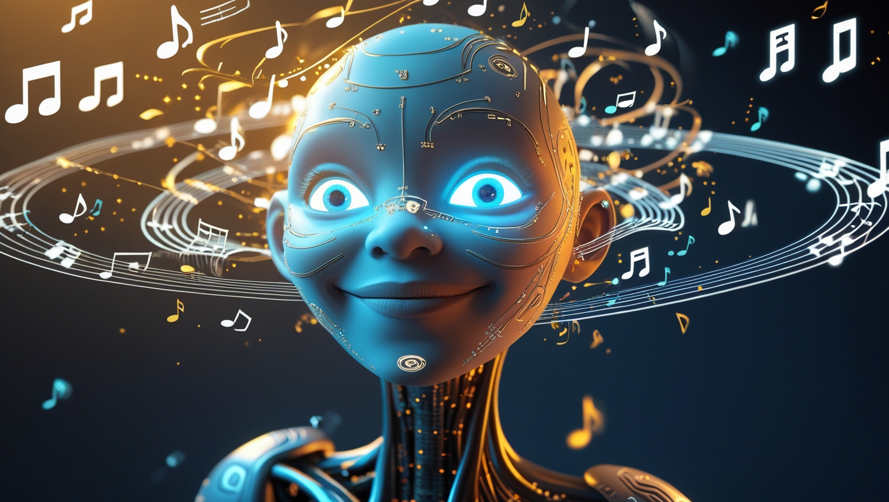

# IA et Création de Contenu : Le Présent et l'Avenir de la Créativité Numérique

*Par Dario Ferrero (VerbaniaNotizie.it)*


*Après avoir exploré les applications de l'intelligence artificielle dans les secteurs les plus variés, de la santé à la finance, de l'automobile à l'agriculture, il est naturel de se tourner vers l'un des domaines où l'IA démontre le potentiel le plus révolutionnaire : la création de contenu. Ici, l'intelligence artificielle ne se limite pas à automatiser des processus existants, mais redéfinit littéralement ce que signifie être créatif, offrant des outils qui permettent à quiconque de produire du contenu de qualité professionnelle. Des images photoréalistes générées à partir d'une simple description textuelle, aux vidéos créées à partir d'une idée, en passant par la musique composée par des algorithmes : nous sommes face à une démocratisation de la créativité sans précédent.*

## La Révolution Créative est Déjà Là

En 2024, l'intelligence artificielle a consolidé sa présence dans le paysage de la création de contenu, transformant radicalement la manière dont nous produisons et consommons les médias numériques. Les chiffres parlent d'eux-mêmes : le marché mondial de la création de contenu basée sur l'IA devrait atteindre 7,74 milliards de dollars d'ici 2029, avec un taux de croissance annuel de 21,6 %, tandis que plus de 75 % des spécialistes du marketing admettent utiliser des outils d'IA sous une forme ou une autre.

Il ne s'agit plus d'une technologie émergente ou expérimentale : elle fait désormais partie intégrante des flux de travail créatifs modernes. Selon PricewaterhouseCoopers, 73 % des entreprises américaines utilisent l'IA sous une forme ou une autre dans leurs activités, et la création de contenu représente l'un des secteurs d'application les plus prometteurs.

## Les Protagonistes de la Créativité Artificielle

### Génération d'Images : De l'Imagination à la Réalité

**DALL-E 3** : Le système d'OpenAI a atteint des niveaux de sophistication extraordinaires. DALL-E 3 génère des images qui combinent des éléments impossibles dans la réalité avec une cohérence visuelle parfaite. La technologie gère désormais des détails complexes tels que les reflets, les ombres et les perspectives multiples avec une précision photographique.

**Midjourney V6** : Spécialisé dans la création artistique, il excelle dans la génération d'œuvres allant du photoréalisme à l'art conceptuel. Un cas d'utilisation significatif est celui des cabinets d'architectes qui utilisent Midjourney pour visualiser des projets, produisant des rendus d'une qualité telle qu'ils sont indiscernables des photographies de bâtiments réels.

**Leonardo AI** : Se distingue par sa capacité à maintenir une cohérence stylistique à travers des séries d'images. Les marques de mode l'utilisent pour créer des campagnes publicitaires complètes en testant des variations du même concept, tout en maintenant la cohérence du style et de l'éclairage.

### Génération de Vidéos : Le Cinéma Propulsé par l'IA

**Runway ML Gen-2** : A démocratisé la production vidéo professionnelle. Un exemple pratique : une agence de publicité a créé un spot de 30 secondes pour une marque de montres en utilisant uniquement l'invite "Montre de luxe flottant dans l'eau, ralenti, éclairage cinématographique, reflets dorés". Résultat : une vidéo de qualité diffusion produite en quelques heures au lieu de semaines.

**Synthesia** : Révolutionne la formation en entreprise. Une multinationale a créé des cours de formation dans 40 langues différentes en utilisant des avatars IA : chaque employé peut suivre la formation dans sa langue maternelle, avec un présentateur virtuel qui conserve le même professionnalisme et le même engagement qu'un formateur humain.

**Luma AI** : Excelle dans la création de vidéos tridimensionnelles. Un musée a utilisé cette technologie pour créer des visites virtuelles immersives : à partir de simples photographies des lieux, Luma AI génère des parcours vidéo fluides qui permettent aux visiteurs virtuels de "se promener" dans les salles d'exposition.

### Génération Musicale : L'Harmonie des Algorithmes

**Suno AI** : A atteint des capacités de composition impressionnantes. Un podcasteur a créé le générique de son émission en écrivant simplement "Thème musical énergique pour podcast technologique, style rock électronique, 30 secondes". Le résultat est une composition originale, complète avec arrangement et mixage professionnels.

**Udio** : Se spécialise dans des genres spécifiques avec une précision maniaque. Un producteur de jeux indépendants a commandé des musiques pour son RPG fantastique en utilisant des invites détaillées telles que "Thème épique pour bataille finale, orchestre symphonique, chœur épique, influences de John Williams, 4 minutes". La bande sonore résultante rivalise avec les productions AAA.

**AIVA (Artificial Intelligence Virtual Artist)** : Utilisé pour les bandes sonores cinématographiques. Un documentaire sur la nature a utilisé AIVA pour créer l'intégralité de la bande sonore : chaque morceau a été généré en fonction des scènes spécifiques, de l'intimité d'une "Douce mélodie pour scène de bébés ours" à l'épique d'une "Musique dramatique pour tempête en montagne".

### Génération de Texte : Quand l'IA Écrit

**GPT-4** : A transformé le copywriting professionnel. Une agence de marketing utilise GPT-4 pour créer des campagnes complètes : des e-mails marketing ("Rédige un e-mail promotionnel pour le lancement d'un produit technologique, ton professionnel mais amical, accent sur les avantages") aux publications sur les réseaux sociaux ("Crée 10 publications Instagram pour une marque de cosmétiques naturels, hashtags inclus, style lifestyle").

**Claude 3 Opus** : Excelle dans l'écriture longue et structurée. Les éditeurs utilisent Claude pour créer des plans détaillés de livres : "Crée la structure d'un roman thriller se déroulant dans la Silicon Valley, protagoniste détective femme, thème de la confidentialité numérique". Le résultat comprend l'intrigue, le développement des personnages et une structure narrative professionnelle.

**Jasper** : Spécialisé dans le contenu marketing, il est utilisé par les sites de commerce électronique pour créer des descriptions de produits optimisées pour le référencement. Une boutique en ligne a automatisé la création de fiches produits : chaque article reçoit automatiquement une description, les avantages, les spécifications techniques et un appel à l'action personnalisé.

## Le Décalogue de l'Ingénierie de Prompt Parfaite

La qualité du résultat dépend directement de la qualité de l'entrée. Voici les dix règles d'or pour communiquer efficacement avec l'IA, basées sur les meilleures pratiques de l'ingénierie de prompt de 2025 :

### 1. La Spécificité est Puissance

- **Mauvais** : "Crée une image d'un chien"
- **Bon** : "Golden retriever adulte assis sur une pelouse verte, lumière du coucher de soleil, photographie de portrait, flou d'arrière-plan, expression heureuse, collier rouge"

La spécificité élimine l'ambiguïté et guide l'IA vers des résultats précis. Chaque détail ajouté augmente le contrôle sur le résultat final.

### 2. Le Contexte Avant Tout

- **Mauvais** : "Écris un article sur les médias sociaux"
- **Bon** : "Écris un article de 800 mots sur les risques des médias sociaux pour les adolescents, destiné aux parents inquiets, ton compréhensif mais informatif, incluant des statistiques récentes et des conseils pratiques"

Le contexte définit le cadre de référence : public, objectif, ton et longueur guident l'IA vers un contenu approprié.

### 3. Structure la Pensée

L'une des techniques les plus efficaces est le "chain of thought prompting", où l'on encourage l'IA à articuler son processus de pensée étape par étape.

**Exemple** : "Analyse ce problème marketing étape par étape : 1) Identifie la cible, 2) Analyse la concurrence, 3) Propose la stratégie, 4) Justifie le choix"

### 4. Les Exemples Valent Mille Mots

Le "few-shot prompting" est l'un des meilleurs moyens d'enseigner au modèle le format, le style et la portée exacts souhaités.

**Modèle** : "Écris des titres accrocheurs pour un blog technologique. Exemples : 'Comment l'IA révolutionne le jeu vidéo' → '5 façons dont l'IA va changer les jeux vidéo pour toujours'. Crée maintenant un titre pour un article sur la cybersécurité domestique."

### 5. Définis Rôles et Personnalités

**Puissant** : "Tu es un expert copywriter avec 15 ans d'expérience dans le secteur du luxe. Rédige une description de produit pour une montre Rolex, en mettant l'accent sur la tradition et l'innovation, pour des clients fortunés qui apprécient l'artisanat."

Attribuer des rôles spécifiques active différents "modes" dans l'IA, influençant le vocabulaire, le style et l'approche.

### 6. Contraintes Créatives

**Exemple** : "Écris une histoire de 100 mots exacts qui contienne : un robot, une rose, le nombre 42, et se termine par une question. Style : réalisme magique."

Les contraintes stimulent souvent une plus grande créativité en forçant l'IA à trouver des solutions innovantes dans des paramètres définis.

### 7. Itération et Raffinement

**Processus** :

- Premier prompt : résultat de base
- Deuxième prompt : "Améliore le résultat précédent en ajoutant plus de détails émotionnels"
- Troisième prompt : "Maintenant, réduis de moitié la longueur tout en conservant l'impact"

L'itération permet des raffinements progressifs vers l'objectif idéal.

### 8. Formatage Clair

**Efficace** :

```text
TÂCHE : Créer un plan marketing
CONTEXTE : Startup fintech, lancement d'application, budget 50k€
FORMAT :
- Objectifs (3 points)
- Stratégies (5 points)
- Calendrier (mensuel, 6 mois)
- KPI (métriques spécifiques)
TON : Professionnel, axé sur les résultats
```

### 9. Gestion des Cas Limites

**Robuste** : "Génère un e-mail de bienvenue pour les nouveaux utilisateurs. Si l'utilisateur n'a pas fourni son nom, utilise 'Cher Client'. Si l'inscription est premium, mentionne les avantages exclusifs. Si c'est le week-end, ajoute un souhait pour le week-end."

Anticiper différents scénarios rend le résultat plus fiable dans des situations réelles.

### 10. Validation et Sources

Demander au modèle de citer ses sources augmente la fiabilité.

**Exemple** : "Explique les avantages de la méditation en incluant des études scientifiques spécifiques. Pour chaque affirmation, indique la source et l'année de la recherche."

## Le Présent : Un Scénario en Évolution Rapide

En 2025, l'IA est devenue facilement disponible dans presque tous les aspects de la création de campagnes publicitaires : ciblage, variations de texte recommandées, optimisations et bien plus encore. Cette omniprésence redéfinit non seulement ce que nous créons, mais aussi comment nous le créons.

### Cas d'Usage Réels qui Changent les Règles

**Netflix et la Personnalisation Extrême** : Chaque illustration que vous voyez sur Netflix est potentiellement générée par l'IA. Le système analyse vos goûts, votre historique de visionnage, et même l'heure à laquelle vous naviguez, pour créer des vignettes personnalisées qui maximisent la probabilité de clic.

**Adobe et l'Intégration Transparente** : Photoshop 2025 inclut Firefly directement intégré dans le flux de travail. Un designer peut sélectionner une zone de l'image et écrire "ajoute des montagnes enneigées en arrière-plan" - l'IA complète l'opération en maintenant la perspective, l'éclairage et le style cohérents.

**Shopify et le Commerce Électronique Automatique** : Des milliers de boutiques en ligne utilisent l'IA pour générer automatiquement des descriptions de produits optimisées pour le référencement dans plusieurs langues. Un vendeur télécharge une image du produit, l'IA génère le titre, la description, les balises et suggère même des prix basés sur une analyse concurrentielle.

### L'Impact Économique Tangible

Par rapport au début de 2024, un pourcentage plus élevé d'entreprises rapporte que les cas d'utilisation de l'IA générative ont augmenté les revenus au sein des unités commerciales qui les mettent en œuvre. Il ne s'agit plus d'une expérience coûteuse, mais d'un investissement qui produit un retour sur investissement mesurable.

Une petite agence de marketing a réduit ses délais de production de 70 % en utilisant l'IA pour :

- Brainstorming initial (GPT-4 pour générer 50 idées créatives en 5 minutes)
- Création d'actifs visuels (Midjourney pour les maquettes et les concepts)
- Copywriting multilingue (DeepL + GPT pour la localisation automatique)
- Teaser vidéo (Runway ML pour une bande-annonce de 30 secondes)

Résultat : de 3 semaines à 1 semaine pour une campagne complète, avec une qualité maintenue et des coûts réduits de 60 %.

## Défis et Considérations Éthiques

### Le Paradoxe de l'Authenticité

Alors que l'IA démocratise la créativité, elle soulève des questions profondes sur l'authenticité. Lorsqu'un artiste utilise Midjourney pour créer une œuvre, qui en est l'auteur ? La réponse n'est pas simple et varie selon les juridictions, mais la tendance est à la reconnaissance d'une "co-création" homme-IA.

### Le Problème de la Formation

Les modèles d'IA sont entraînés sur d'énormes ensembles de données qui incluent des œuvres protégées par le droit d'auteur. Adobe a réagi en créant Firefly, entraîné exclusivement sur des images d'Adobe Stock et du contenu du domaine public, offrant une protection juridique aux utilisateurs commerciaux.

### L'Homogénéisation Créative

Il existe un risque que l'utilisation massive des mêmes modèles d'IA conduise à une standardisation esthétique. La solution émerge de l'utilisation de modèles spécialisés et du rôle important de l'ingénierie de prompt dans la différenciation des résultats.

## L'Avenir : Vers de Nouveaux Paradigmes Créatifs

### Tendances Émergentes pour 2025-2030

**IA Multimodale Avancée** : Les prochains modèles combineront texte, images, audio et vidéo en un seul flux créatif. Imaginez décrire une idée et recevoir automatiquement un storyboard, une bande sonore, un scénario et même une bande-annonce complète.

**Personnalisation Extrême** : L'IA apprendra votre style personnel. Après avoir analysé vos travaux précédents, elle pourra créer du contenu "à votre manière", en conservant votre voix créative unique.

**Collaboration en Temps Réel** : Des équipes distribuées mondialement travailleront sur des projets créatifs avec des IA servant de pont linguistique et culturel, traduisant non seulement des mots mais aussi des concepts et des références culturelles.

**Contrôle Qualité Automatique** : L'IA ne créera pas seulement du contenu, mais l'évaluera automatiquement pour la cohérence de la marque, la pertinence culturelle, le potentiel viral et la conformité légale.

### Technologies à l'Horizon

**Recherche d'Architecture Neuronale (NAS)** : L'IA se conçoit elle-même, créant des architectures optimisées pour des tâches créatives spécifiques. Cela conduira à des modèles spécialisés incroyablement efficaces.

**IA Améliorée par le Quantique** : Les ordinateurs quantiques accéléreront considérablement l'entraînement des modèles créatifs, permettant des IA qui comprennent des nuances créatives aujourd'hui impensables.

**Interface Cerveau-Ordinateur Créative** : Au cours des 10 prochaines années, des interfaces pourraient émerger qui traduisent directement l'intention créative en sortie numérique, contournant complètement le processus de rédaction de prompts.

### Prévisions Concrètes pour 2030

1. **Automatisation à 100 % Prête** : Des flux de travail créatifs entiers seront automatisables, du brief initial à la livraison finale, avec une intervention humaine uniquement pour l'approbation et la direction stratégique.

2. **Contenu en Temps Réel** : Le contenu s'adaptera en temps réel au public. Une publicité changera de couleurs, de musique et de message en fonction de la personne qui la regarde.

3. **Personnalisation Infinie** : Chaque utilisateur recevra un contenu unique, jamais vu par d'autres, généré spécifiquement pour ses goûts, son contexte et son moment émotionnel.

4. **Création Trans-Réalité** : L'IA créera du contenu nativement pour la réalité augmentée, virtuelle et mixte, avec des expériences immersives impossibles à distinguer de la réalité.

5. **IA Émotionnelle** : Les systèmes reconnaîtront et répondront aux émotions en temps réel, adaptant le contenu pour maximiser l'impact émotionnel positif.

## Se Préparer à l'Avenir : Que Faire Aujourd'hui

### Pour les Créatifs

- **Apprenez l'Ingénierie de Prompt** : Cela deviendra aussi important que de savoir utiliser Photoshop.
- **Spécialisez-vous dans la Direction Créative** : L'IA exécutera, vous devrez guider.
- **Conservez Votre Voix** : L'originalité sera plus précieuse que jamais.

### Pour les Entreprises

- **Investissez dans la Formation** : Vos équipes doivent acquérir des compétences en IA dès aujourd'hui.
- **Repensez les Flux de Travail** : De nombreux processus créatifs devront être complètement repensés.
- **Considérez l'Éthique** : Développez des politiques claires sur l'utilisation de l'IA créative.

### Pour les Éducateurs

- **Intégrez l'IA dans les Programmes Scolaires** : Les étudiants doivent apprendre à collaborer avec l'IA.
- **Mettez l'Accent sur la Pensée Critique** : Elle deviendra cruciale pour diriger efficacement l'IA.
- **Préparez aux Nouvelles Professions** : Des rôles entièrement nouveaux émergeront.

## Conclusion : La Créativité Augmentée

Nous sommes à l'aube d'une nouvelle ère créative. L'intelligence artificielle ne remplace pas la créativité humaine, mais l'amplifie, la démocratise et l'accélère. Comme toute révolution technologique, elle apporte des opportunités extraordinaires ainsi que des défis importants.

D'ici 2025, l'IA pourrait éliminer 85 millions d'emplois mais en créer 97 millions de nouveaux, soit un gain net de 12 millions de postes. Dans le secteur créatif, cela se traduit par une transformation plutôt qu'un remplacement : de nouveaux rôles émergent tels que Directeur Artistique IA, Ingénieur de Prompt, Stratège de Contenu IA.

Le secret pour naviguer dans cette transition est d'adopter l'IA comme un partenaire créatif puissant, en apprenant à communiquer efficacement avec ces systèmes grâce à des techniques d'ingénierie de prompt de plus en plus sophistiquées. Ceux qui maîtriseront cet art auront un avantage concurrentiel énorme dans le paysage créatif du futur.

La question n'est pas de savoir si l'IA changera la créativité - elle l'a déjà fait. La question est de savoir si nous serons prêts à guider ce changement ou si nous nous laisserons submerger par lui. Le choix, du moins pour l'instant, nous appartient encore.

*La prochaine fois que vous verrez une image extraordinaire, une vidéo captivante ou que vous lirez un texte qui vous touche, souvenez-vous : cela pourrait être le fruit d'une collaboration entre intelligence humaine et artificielle. Et ce n'est que le début de l'histoire.*
