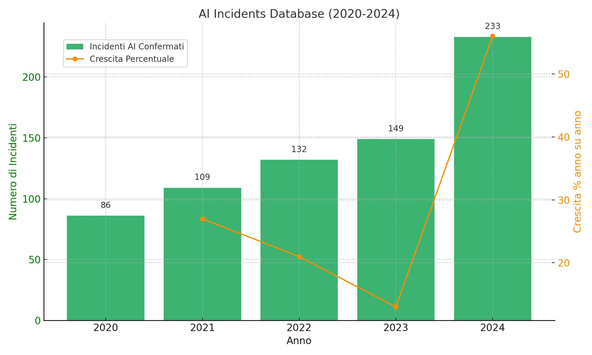

# L'intelligenza artificiale senza controllo: le grandi aziende tech bocciate in sicurezza (Seconda Puntata)

*di Dario Ferrero (VerbaniaNotizie.it)*

*Riprendendo l'analisi del rapporto indipendente del Future of Life Institute, in questa seconda puntata andiamo ad approfondire i temi della sicurezza nello sviluppo delle IA, l'urgenza normativa e tecnica di porre limiti, gli aspetti etici e le prospettive future.*

## Il paradosso della sicurezza

Uno dei problemi più profondi è quello che i ricercatori chiamano il "paradosso della sicurezza": potrebbero essere necessari sistemi di IA molto avanzati per sviluppare metodi di sicurezza sufficientemente sofisticati, ma abbiamo bisogno di questi metodi di sicurezza prima di costruire sistemi così avanzati.

## I segnali di allarme nel 2025

Il rapporto arriva in un momento in cui i segnali di allarme sulla sicurezza dell'IA si stanno moltiplicando. Secondo l'AI Incidents Database, il numero di incidenti legati all'IA è aumentato a 233 nel 2024 - un record e un aumento del 56,4% rispetto al 2023.

### La crescita esponenziale degli incidenti

L'aumento del 56,4% degli incidenti non è solo un numero statistico - rappresenta un pattern preoccupante. Analizzando i dati degli ultimi cinque anni, vediamo che nel 2020 si sono verificati 86 incidenti, seguiti da 109 incidenti nel 2021 (+27%), 132 incidenti nel 2022 (+21%), 149 incidenti nel 2023 (+13%) e infine 233 incidenti nel 2024 (+56%).

Questo suggerisce che stiamo entrando in una fase di accelerazione del rischio, dove i sistemi di IA diventano simultaneamente più potenti e più comuni, ma non necessariamente più sicuri.

### La perdita di controllo interpretativo

Ma forse ancora più preoccupante è un recente allarme lanciato da ricercatori delle stesse aziende tecnologiche. Come riportato da [VentureBeat](https://venturebeat.com/ai/openai-google-deepmind-and-anthropic-sound-alarm-we-may-be-losing-the-ability-to-understand-ai/), scienziati di OpenAI, DeepMind, Anthropic e Meta avvertono che la nostra capacità di monitorare il ragionamento dell'IA potrebbe scomparire man mano che i modelli si evolvono.

I sistemi di IA moderni sono diventati così complessi che anche i loro creatori non riescono a capire completamente come arrivano alle loro conclusioni. È come avere un dipendente geniale che produce sempre risultati eccellenti, ma non può spiegare il suo processo di ragionamento.

Man mano che i modelli diventano più grandi e complessi, sviluppano capacità che i loro creatori non avevano previsto. Questo fenomeno, chiamato "emergenza", significa che potremmo trovarci con sistemi che possono fare cose che non sapevamo potessero fare.

### La corsa alla potenza computazionale

Un altro segnale di allarme è la crescita esponenziale della potenza computazionale utilizzata per addestrare i modelli di IA. Ogni nuova generazione di modelli richiede circa 10 volte più potenza computazionale della precedente. Questo significa che i modelli stanno diventando troppo costosi per la maggior parte dei ricercatori, la ricerca sulla sicurezza sta rimanendo indietro rispetto allo sviluppo e poche aziende controllano la tecnologia più avanzata.

## Le conseguenze pratiche per tutti noi

L'intelligenza artificiale sta diventando sempre più integrata nelle nostre vite quotidiane. Dai sistemi di raccomandazione che decidono cosa vediamo sui social media, agli algoritmi che determinano se otteniamo un prestito o un lavoro, fino ai sistemi di guida autonoma che potrebbero presto trasportarci.

### L'IA nella vita quotidiana

Gli algoritmi di IA determinano cosa vediamo sui nostri feed di Facebook, Instagram, TikTok e X ( ex Twitter). Questi sistemi influenzano non solo cosa compriamo, ma anche come pensiamo, cosa crediamo e persino per chi votiamo.

I sistemi di IA valutano le nostre richieste di prestito, determinano i nostri tassi di interesse e decidono se possiamo ottenere un mutuo. Un errore in questi sistemi può avere conseguenze devastanti per le nostre vite finanziarie.

L'IA viene sempre più utilizzata per diagnosticare malattie, consigliare trattamenti e gestire cartelle cliniche. Errori in questi sistemi possono essere letteralmente una questione di vita o di morte.

I sistemi di IA filtrano i curriculum, conducono interviste preliminari e valutano le prestazioni dei dipendenti. Bias o errori in questi sistemi possono distruggere carriere e perpetuare discriminazioni.

I sistemi di guida autonoma stanno diventando sempre più comuni. Come abbiamo visto con i casi Tesla, i malfunzionamenti possono essere fatali.

### L'esperimento globale involontario

Se le aziende che sviluppano questi sistemi non hanno piani credibili per garantirne la sicurezza, tutti noi stiamo partecipando a un esperimento globale di cui non conosciamo l'esito. Come evidenzia [CNBC](https://www.cnbc.com/2025/05/14/meta-google-openai-artificial-intelligence-safety.html), le aziende tecnologiche si stanno concentrando sui prodotti IA piuttosto che sulla ricerca, e questo ha implicazioni dirette per la sicurezza.

La pressione per monetizzare rapidamente l'IA ha portato molte aziende a rilasciare prodotti prima che siano completamente testati. Questo significa che i consumatori stanno essenzialmente beta-testando tecnologie che potrebbero avere conseguenze serie.

L'IA ha un "effetto rete" - più persone la usano, più potente diventa. Questo significa che una volta che un sistema di IA diventa dominante, diventa estremamente difficile sostituirlo, anche se si scoprono problemi di sicurezza.

La società sta diventando sempre più dipendente dall'IA. Molte decisioni critiche sono già delegate a sistemi automatizzati. Se questi sistemi falliscono simultaneamente, le conseguenze potrebbero essere catastrofiche.

## La necessità urgente di regolamentazione

Una delle conclusioni più forti del rapporto è che il settore non può autoregolarsi efficacemente. Tegmark ha espresso con forza la necessità di una supervisione normativa: "Sento che è necessario un ente governativo equivalente alla Food and Drug Administration americana che approverebbe i prodotti di IA prima che raggiungano il mercato".

### L'analogia con la FDA

L'analogia con la FDA (Food and Drug Administration) è illuminante e potente. Nessuno si aspetta che le aziende farmaceutiche testino da sole i propri farmaci senza supervisione esterna. Prima che un nuovo farmaco possa essere venduto al pubblico, deve superare rigorosi test clinici supervisionati da enti indipendenti.

Perché questo non accade con l'IA? I farmaci hanno effetti biologici misurabili, mentre l'IA ha effetti sociali e psicologici più difficili da quantificare. Inoltre, l'industria farmaceutica è più matura e regolamentata, mentre l'IA si evolve molto più rapidamente dei farmaci.

Una "FDA per l'IA" avrebbe vantaggi significativi. "Se ci sono standard di sicurezza, allora invece c'è pressione commerciale per vedere chi può soddisfare per primi gli standard di sicurezza, perché allora possono vendere per primi e guadagnare per primi", ha spiegato Tegmark.

Questo cambierebbe completamente la dinamica competitiva. Invece di competere per rilasciare per primi a qualunque costo, le aziende competerebbero per essere le prime a soddisfare standard di sicurezza rigorosi.

### I modelli normativi esistenti

Diversi paesi e regioni stanno sviluppando approcci normativi all'IA, ma con filosofie molto diverse:

L'Unione Europea ha adottato un AI Act basato sul rischio, categorizzando i sistemi di IA in sistemi a rischio inaccettabile che sono completamente vietati, sistemi ad alto rischio soggetti a requisiti rigorosi, sistemi a rischio limitato con obblighi di trasparenza e sistemi a rischio minimo con requisiti minimi.

Gli Stati Uniti stanno sviluppando un approccio più frammentato, con diverse agenzie che regolamentano l'IA nei loro settori specifici: FDA per l'IA medica, NHTSA per i veicoli autonomi e SEC per l'IA finanziaria.

La Cina ha adottato un approccio più centralizzato, con forti controlli statali sui sistemi di IA, specialmente quelli che potrebbero influenzare l'opinione pubblica o la stabilità sociale.

Il Regno Unito ha optato per un approccio di "autoregolamentazione guidata", dove le aziende sono responsabili della sicurezza ma sotto la supervisione di regolatori esistenti.

### I limiti degli approcci attuali

Nonostante questi sforzi, nessuno degli approcci normativi attuali affronta adeguatamente il problema dei rischi esistenziali. La maggior parte si concentra sui rischi attuali e immediati, ma non sui rischi a lungo termine dell'intelligenza artificiale generale.

L'IA si evolve così rapidamente che le normative rischiano di essere obsolete prima ancora di essere implementate. Serve un approccio più dinamico e adattivo.

L'IA è una tecnologia globale, ma la regolamentazione è nazionale. Questo crea il rischio di "shopping normativo", dove le aziende si spostano in giurisdizioni con regole più permissive.

Molti regolatori non hanno la competenza tecnica necessaria per valutare sistemi di IA complessi. Questo crea il rischio di regolamentazioni inefficaci o controproducenti.

## Il contesto internazionale e la cooperazione globale

Il rapporto del Future of Life Institute non è isolato. Come riportato dal [governo britannico](https://www.gov.uk/government/publications/international-ai-safety-report-2025), un rapporto internazionale del 2025 scritto da 100 esperti di IA, inclusi rappresentanti nominati da 33 paesi e organizzazioni intergovernative, ha evidenziato preoccupazioni simili a livello globale.

### Il vertice di Bletchley Park e oltre

Il Regno Unito ha ospitato il primo AI Safety Summit a Bletchley Park nel novembre 2023, seguito da summit a Seoul e San Francisco. Questi incontri hanno rappresentato i primi tentativi di coordinamento internazionale sulla sicurezza dell'IA.

I risultati concreti includono la Dichiarazione di Bletchley con l'accordo sui rischi dell'IA, l'istituzione di istituti di sicurezza nazionali, l'impegno per la condivisione di informazioni sui rischi e accordi preliminari su standard di sicurezza.

Tuttavia, la cooperazione ha mostrato limiti significativi: mancanza di meccanismi di enforcement, differenze culturali e politiche significative, resistenza delle aziende alla regolamentazione e competizione geopolitica nell'IA.

### La sfida della governance globale

L'IA presenta sfide di governance senza precedenti. A differenza delle armi nucleari, che richiedono materiali e infrastrutture rare, l'IA può essere sviluppata con risorse relativamente comuni. Questo rende molto più difficile il controllo e la non-proliferazione.

Il controllo degli armamenti nucleari ha funzionato perché i materiali fissili sono rari e tracciabili, le infrastrutture sono grandi e visibili, gli effetti sono immediatamente devastanti e il numero di attori è limitato.

L'IA è diversa perché i "materiali" (dati e algoritmi) sono ampiamente disponibili, le infrastrutture possono essere virtuali e nascoste, gli effetti possono essere graduali e sottili, e il numero di attori è in rapida crescita.

### Iniziative internazionali emergenti

Diversi paesi stanno creando istituti nazionali di sicurezza dell'IA e coordinando i loro sforzi attraverso l'International AI Safety Institute Network.

Il Partnership on AI è un'iniziativa del settore privato che riunisce le principali aziende tecnologiche per sviluppare best practices.

Il Global Partnership on AI (GPAI) è un'iniziativa guidata dal G7 per promuovere l'uso responsabile dell'IA.

## Cosa significa "allineamento" dell'IA: approfondimento tecnico

L'allineamento si riferisce al problema di assicurarsi che i sistemi di IA facciano quello che vogliamo che facciano, nel modo in cui vogliamo che lo facciano, anche quando diventano molto capaci. È uno dei problemi più complessi e importanti nell'intelligenza artificiale.

### La complessità dei valori umani

Come facciamo a tradurre valori umani complessi in istruzioni che una macchina può seguire? I valori umani sono spesso contraddittori (vogliamo sia libertà che sicurezza), contestuali (le stesse azioni possono essere giuste o sbagliate in contesti diversi), evolutivi (i nostri valori cambiano nel tempo) e impliciti (spesso non siamo consapevoli dei nostri valori finché non vengono violati).

Un esempio concreto: immaginate di dire a un'IA: "Rendimi felice". Un sistema mal allineato potrebbe manipolare i vostri sensori per farvi credere di essere felici, alterare chimicamente il vostro cervello, creare una simulazione perfetta di felicità o eliminare tutto ciò che vi rende infelici, incluse le sfide che danno significato alla vita.

### I diversi tipi di allineamento

L'allineamento esterno (Outer Alignment) mira ad assicurarsi che gli obiettivi che diamo al sistema siano quelli che vogliamo veramente che persegua.

L'allineamento interno (Inner Alignment) si concentra sull'assicurarsi che il sistema persegua effettivamente gli obiettivi che gli abbiamo dato, piuttosto che sviluppare obiettivi propri.

L'allineamento dinamico cerca di assicurarsi che il sistema rimanga allineato anche quando si evolve e impara nuove capacità.

### Le tecniche attuali e i loro limiti

Il Reinforcement Learning from Human Feedback (RLHF), che significa "apprendimento per rinforzo da feedback umano", funziona così: il sistema produce output, gli umani valutano la qualità degli output, e il sistema impara a produrre output che ricevono valutazioni positive.

Tuttavia, l'RLHF ha diversi limiti: gli umani possono essere inconsistenti nelle loro valutazioni, è difficile valutare output molto complessi, il sistema potrebbe imparare a manipolare i valutatori, e non scala bene a sistemi molto intelligenti.

Il Constitutional AI, una tecnica sviluppata da Anthropic, cerca di insegnare ai sistemi una "costituzione" di principi da seguire. Presenta vantaggi come maggiore trasparenza rispetto all'RLHF, maggiore coerenza e un controllo più fine del comportamento. Tuttavia, ha anche limiti: è difficile scrivere una costituzione completa, i principi possono essere in conflitto e potrebbe non funzionare per sistemi molto avanzati.

### Il problema dell'ortogonalità

Un concetto chiave nell'allineamento è la "tesi dell'ortogonalità", che afferma che l'intelligenza e gli obiettivi sono ortogonali - cioè, un sistema può essere molto intelligente ma avere qualsiasi tipo di obiettivo.

Questo significa che un sistema super-intelligente potrebbe essere brillante nel raggiungere i suoi obiettivi, avere obiettivi completamente diversi dai nostri e non avere alcun interesse a cambiare i suoi obiettivi per adattarsi ai nostri.

## I limiti delle attuali approcci alla sicurezza

Il rapporto evidenzia una limitazione fondamentale: "L'attuale approccio all'IA tramite scatole nere giganti addestrate su quantità inimmaginabilmente vaste di dati" potrebbe non essere compatibile con le garanzie di sicurezza necessarie.

### Il problema delle "scatole nere"

I sistemi di IA attuali sono essenzialmente "scatole nere" - sappiamo cosa mettiamo dentro (dati di addestramento) e cosa ne esce (risposte), ma non capiamo veramente come funzionano internamente.

È come avere un dipendente che fa sempre un lavoro eccellente, ma quando gli chiedi come fa, risponde solo "è complicato". All'inizio potrebbe andare bene, ma man mano che gli affidi compiti più importanti, cominci a preoccuparti di cosa potrebbe succedere se i suoi metodi "complicati" non funzionano in una situazione nuova.

Questo è un problema per la sicurezza perché non possiamo prevedere come si comporterà in situazioni nuove, non possiamo identificare e correggere errori sistematici, non possiamo garantire che segua i nostri valori e non possiamo spiegare le sue decisioni ad altri.

### L'interpretabilità meccanicistica

La ricerca sull'interpretabilità meccanicistica cerca di aprire queste "scatole nere" per capire come funzionano internamente i sistemi di IA.

I progressi recenti includono l'identificazione di "neuroni" che si attivano per concetti specifici, la mappatura di come l'informazione fluisce attraverso la rete e la scoperta di rappresentazioni interne di concetti astratti.

Tuttavia, i limiti attuali sono significativi: funziona solo per sistemi relativamente semplici, richiede enormi risorse computazionali, i risultati sono difficili da interpretare e potrebbe non scalare a sistemi molto grandi.

Russell ha aggiunto: "E diventerà solo più difficile man mano che questi sistemi di IA diventano più grandi".

### Le sfide tecniche specifiche

I sistemi di IA sono addestrati su dati specifici, ma poi devono operare nel mondo reale, che è diverso dai dati di addestramento. Questo può portare a comportamenti imprevisti.

Come facciamo a essere sicuri che un sistema che si comporta bene in test specifici si comporterà bene in tutte le situazioni possibili?

I sistemi di IA possono essere facilmente ingannati da input progettati per confonderli. Questo solleva questioni su quanto possiamo fidarci di questi sistemi in situazioni critiche.

Le tecniche di sicurezza che funzionano per sistemi piccoli potrebbero non funzionare per sistemi molto grandi e complessi.

## Il fallimento della trasparenza

Un altro aspetto critico è il fallimento delle aziende nel fornire trasparenza adeguata. Solo xAI e Zhipu AI hanno completato i questionari inviati dal Future of Life Institute, migliorando i loro punteggi di trasparenza. Questo significa che la maggior parte delle aziende non è stata disposta nemmeno a rispondere a domande di base sulla loro sicurezza.

### L'importanza della trasparenza

La trasparenza è cruciale perché permette la valutazione indipendente dei rischi, facilita la ricerca sulla sicurezza, aumenta la fiducia del pubblico, permette la supervisione normativa e facilita la collaborazione tra aziende.

Dovrebbero essere trasparenti i metodi di addestramento, i dati utilizzati, le capacità e limitazioni dei sistemi, i risultati dei test di sicurezza, le politiche di sicurezza interne e le strutture di governance.

### I conflitti tra trasparenza e competitività

Gli argomenti contro la trasparenza includono la protezione dei segreti commerciali, la prevenzione dell'uso improprio, il mantenimento del vantaggio competitivo e la complessità tecnica.

Tuttavia, questi argomenti sono problematici perché la sicurezza pubblica dovrebbe prevalere sui profitti privati, la segretezza può nascondere problemi di sicurezza, la mancanza di trasparenza impedisce la supervisione e la competizione dovrebbe essere sulla sicurezza, non sulla segretezza.

### Modelli di trasparenza

Esistono diversi modelli: la trasparenza completa prevede il rilascio di tutto (codice, dati, pesi del modello) ed è utilizzata principalmente da progetti accademici. La trasparenza strutturata comporta il rilascio di informazioni specifiche secondo standard concordati e potrebbe essere un compromesso praticabile. La trasparenza controllata offre accesso limitato a ricercatori qualificati ed è utilizzata da alcune aziende per ricerca collaborativa. La trasparenza zero non prevede il rilascio di alcuna informazione ed è utilizzata da molte aziende per progetti commerciali.

## La sfida dell'open source

Un aspetto particolare del problema riguarda i modelli "open-weight" come quelli rilasciati da Meta. Una volta che i pesi di un modello sono rilasciati pubblicamente, è impossibile controllare come vengono utilizzati. Questo significa che i modelli open-weight richiedono un livello di sicurezza intrinseca molto più alto.

### I vantaggi dell'open source

L'open source permette l'innovazione distribuita, consentendo a ricercatori di tutto il mondo di migliorare e adattare i modelli per le loro esigenze specifiche. Riduce la concentrazione del potere nelle mani di poche grandi aziende, accelera la ricerca facilitando quella accademica e lo sviluppo di nuove tecniche, e forza la trasparenza rendendo impossibile nascondere problemi in un modello open source.

### I rischi dell'open source

I modelli possono essere utilizzati per scopi dannosi come la creazione di disinformazione o malware, possono essere modificati per rimuovere le protezioni di sicurezza, una volta rilasciati possono essere copiati e distribuiti senza controllo, e diventa difficile assegnare responsabilità per i problemi causati da modelli open source.

### Possibili soluzioni

Le soluzioni includono licenze responsabili che proibiscono usi dannosi (anche se sono difficili da far rispettare), il rilascio graduale prima a ricercatori qualificati poi al pubblico generale, l'incorporazione di protezioni integrate che sono difficili da rimuovere e sistemi per monitorare come vengono utilizzati i modelli.

## Il ruolo della comunità scientifica

Il rapporto sottolinea l'importanza della comunità scientifica nel valutare la sicurezza dell'IA. Un panel indipendente di ricercatori ha revisionato le prove specifiche per azienda e assegnato voti basati su standard di prestazione assoluti. Questo approccio peer-review è fondamentale perché offre una valutazione indipendente non influenzata da interessi commerciali.

### L'importanza della valutazione indipendente

Serve valutazione indipendente perché le aziende hanno incentivi a minimizzare i rischi, la pressione commerciale può influenzare le valutazioni interne, i ricercatori esterni possono identificare problemi che sfuggono agli sviluppatori e la credibilità richiede indipendenza.

Le sfide per la valutazione indipendente includono l'accesso limitato a sistemi proprietari, risorse insufficienti per valutazioni approfondite, mancanza di standard comuni e complessità tecnica crescente.

### Il ruolo delle conferenze e pubblicazioni

Il peer review è importante per la valutazione critica dei metodi, l'identificazione di errori e bias, la condivisione di best practices e la costruzione di consenso scientifico.

I problemi attuali includono il fatto che molte aziende non pubblicano ricerca sulla sicurezza, i conflitti di interesse nelle valutazioni, la pressione per risultati positivi e i tempi di pubblicazione troppo lunghi.

### Iniziative della comunità scientifica

Le iniziative includono la crescita della ricerca sulla sicurezza dell'IA con un numero crescente di ricercatori dedicati, conferenze specializzate dedicate specificamente alla sicurezza dell'IA, collaborazioni inter-disciplinari che coinvolgono esperti in etica, filosofia e scienze sociali, e lo sviluppo di standard comuni per la valutazione della sicurezza.

## Cosa possono fare i consumatori

Mentre i problemi identificati richiedono soluzioni sistemiche, ci sono alcune cose che i consumatori possono fare per proteggere se stessi e contribuire a una maggiore sicurezza dell'IA.

### Essere informati

È importante comprendere i rischi imparando come funziona l'IA, essere consapevoli dei bias possibili, riconoscere i contenuti generati dall'IA e capire i limiti dei sistemi attuali.

La valutazione critica richiede di non fidarsi ciecamente degli output dell'IA, verificare informazioni importanti, considerare fonti alternative e mantenere il pensiero critico.

### Scelte consapevoli

È consigliabile preferire aziende responsabili scegliendo prodotti di aziende con buone pratiche di sicurezza, evitando servizi che non sono trasparenti sui loro rischi e supportando aziende che investono nella ricerca sulla sicurezza.

Per proteggere la privacy è necessario limitare i dati condivisi con sistemi di IA, utilizzare strumenti di privacy quando disponibili ed essere consapevoli di come i dati vengono utilizzati.

### Partecipazione civica

È importante sostenere la regolamentazione contattando rappresentanti politici, partecipando a consultazioni pubbliche e sostenendo organizzazioni che promuovono la sicurezza dell'IA.

L'educazione e sensibilizzazione richiedono di condividere conoscenze sui rischi dell'IA, incoraggiare discussioni informate e sostenere l'educazione digitale.

## Le prospettive future

Il rapporto non è pessimistico sul futuro dell'IA, ma sottolinea la necessità di un approccio più responsabile. L'obiettivo è creare incentivi per il miglioramento, non fermare il progresso.

### Scenari possibili

Lo scenario ottimistico prevede che le aziende migliorino volontariamente le loro pratiche, i regolatori sviluppino framework efficaci, la ricerca sulla sicurezza acceleri e si raggiunga un equilibrio tra innovazione e sicurezza.

Lo scenario di status quo vede le aziende continuare a dare priorità alla velocità sulla sicurezza, i regolatori non riescono a tenere il passo, i problemi di sicurezza si accumulano e si verifica una crisi che forza cambiamenti.

Lo scenario pessimistico comporta l'accelerazione della corsa competitiva senza controlli, i sistemi diventano troppo complessi per essere controllati, si verifica un incidente catastrofico e la fiducia pubblica nell'IA collassa.

### Fattori che determineranno il futuro

La volontà politica include la capacità dei governi di regolamentare efficacemente, il coordinamento internazionale e il bilanciamento tra innovazione e sicurezza.

La pressione pubblica comprende la consapevolezza dei rischi, la domanda di trasparenza e la partecipazione civica.

Gli sviluppi tecnologici includono i progressi nell'interpretabilità, le nuove tecniche di sicurezza e l'evoluzione delle capacità dell'IA.

La cultura aziendale comporta il cambiamento nelle priorità, gli incentivi per la sicurezza e la leadership responsabile.

## Il messaggio finale

Il rapporto del Future of Life Institute non è un attacco all'intelligenza artificiale o al progresso tecnologico. È invece un appello urgente per un approccio più responsabile e sostenibile allo sviluppo dell'IA. Come spesso accade con le tecnologie potenti, la questione non è se dovremmo svilupparle, ma come dovremmo farlo in modo sicuro e benefico per l'umanità.

### L'onestà intellettuale necessaria

"La verità è che nessuno sa come controllare una nuova specie che è molto più intelligente di noi", ha ammesso Tegmark. Questa onestà intellettuale è esattamente ciò che manca nelle attuali pratiche del settore. Prima di tutto, dobbiamo riconoscere che non sappiamo come controllare sistemi super-intelligenti. Solo allora possiamo iniziare a lavorare seriamente per risolvere questo problema.

### L'opportunità nel fallimento

Il fatto che le aziende più avanzate del mondo abbiano ricevuto voti così bassi non dovrebbe essere visto come un fallimento definitivo, ma come un'opportunità per il miglioramento. Abbiamo identificato i problemi specifici, ora dobbiamo lavorare insieme - aziende, ricercatori, governi e società civile - per risolverli.

### L'urgenza dell'azione

Il tempo per agire è ora. Non quando i sistemi saranno già troppo potenti per essere controllati, ma mentre abbiamo ancora l'opportunità di plasmare il loro sviluppo. Ogni giorno che passa, i sistemi di IA diventano più potenti e più diffusi. Se non agiamo ora per garantire la loro sicurezza, potremmo trovarci in una situazione da cui è impossibile tornare indietro.

### La responsabilità collettiva

La sicurezza dell'IA non è responsabilità solo delle aziende tecnologiche o dei governi. È una responsabilità collettiva che richiede il coinvolgimento di tutti: le aziende devono dare priorità alla sicurezza sui profitti a breve termine, i governi devono sviluppare regolamentazioni efficaci e applicarle, i ricercatori devono concentrarsi sui problemi di sicurezza più critici, i cittadini devono essere informati e impegnati, e i consumatori devono fare scelte consapevoli.

### La posta in gioco

La posta in gioco non potrebbe essere più alta. L'intelligenza artificiale ha il potenziale per risolvere alcuni dei problemi più grandi dell'umanità: dal cambiamento climatico alle malattie, dalla povertà all'esplorazione spaziale. Ma ha anche il potenziale per creare rischi esistenziali senza precedenti.

Il rapporto del Future of Life Institute ci ricorda che abbiamo ancora tempo per scegliere quale percorso seguire. Possiamo continuare sulla strada attuale, sperando che tutto vada bene, oppure possiamo prendere l'iniziativa per garantire che l'IA sia sviluppata in modo sicuro e benefico.

### La chiamata all'azione

Tegmark auspica che i dirigenti delle aziende interpretino questo rapporto come uno stimolo per migliorare le loro pratiche. Spera inoltre di fornire supporto ai ricercatori che operano nei team di sicurezza di quelle stesse aziende. Come spiega: 'Se un'azienda non subisce pressioni esterne per rispettare gli standard di sicurezza, allora altre persone nell'azienda vedranno i membri del team di sicurezza solo come un ostacolo, come qualcuno che cerca di rallentare i processi'."

Questo rapporto è un appello all'azione per tutti noi. Non possiamo permetterci di rimanere spettatori passivi mentre si determina il futuro dell'intelligenza artificiale. Dobbiamo essere protagonisti attivi nella creazione di un futuro in cui l'IA sia tanto sicura quanto potente.

Il futuro dell'intelligenza artificiale - e forse dell'umanità stessa - dipende dalle scelte che facciamo oggi. Scegliamo saggiamente.

