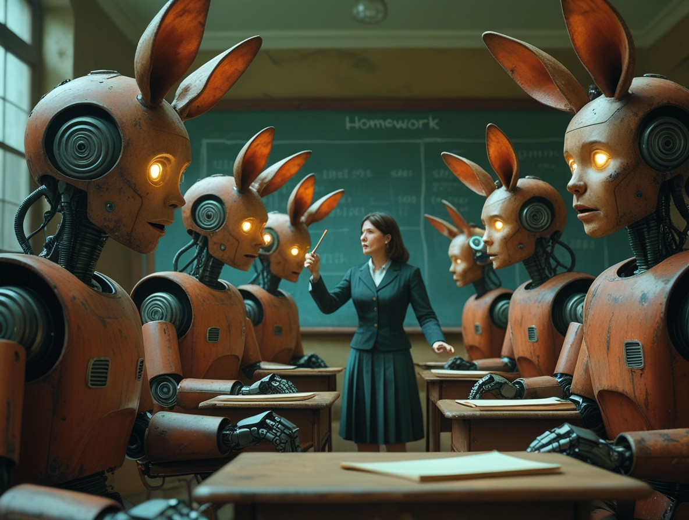

# L'intelligenza artificiale senza controllo: le grandi aziende tech bocciate in sicurezza

*Un rapporto indipendente rivela che le principali aziende tecnologiche non sono pronte a gestire i rischi dell'intelligenza artificiale generale*

Immaginate di costruire un'automobile senza freni, o di progettare un aereo senza sistemi di sicurezza. Sembra assurdo, vero? Eppure, secondo un rapporto appena pubblicato dal [Future of Life Institute](https://futureoflife.org/ai-safety-index-summer-2025/), è esattamente quello che stanno facendo le principali aziende tecnologiche mondiali con l'intelligenza artificiale.

L'AI Safety Index 2025 ha valutato sette delle più importanti aziende che sviluppano intelligenza artificiale avanzata, e i risultati sono preoccupanti: il migliore ha ottenuto un misero C, mentre le altre hanno ricevuto voti ancora peggiori. Stiamo parlando di aziende come OpenAI (quella di ChatGPT), Google DeepMind, Meta (Facebook), xAI (di Elon Musk), e altre che stanno correndo a sviluppare quella che viene chiamata "intelligenza artificiale generale" - sistemi capaci di ragionare e risolvere problemi complessi come farebbe un essere umano, ma potenzialmente molto più velocemente e potentemente.

## Il verdetto: "Fondamentalmente impreparate"

I numeri parlano chiaro. Anthropic, l'azienda che ha creato Claude, ha ottenuto il punteggio più alto con un voto complessivo di C. Le altre sei aziende - Google DeepMind, Meta, OpenAI, xAI, Zhipu AI e DeepSeek - hanno ricevuto voti di D+ o inferiori, con Zhipu AI e DeepSeek che hanno ottenuto i risultati peggiori.

Ma cosa significa concretamente questo voto? Per capirlo, bisogna prima spiegare cos'è l'intelligenza artificiale generale, o AGI come viene chiamata nel settore. Se i sistemi attuali come ChatGPT o Gemini sono specializzati in compiti specifici (conversazione, traduzione, scrittura), l'AGI rappresenterebbe il passo successivo: un'intelligenza artificiale capace di comprendere, apprendere e applicare la conoscenza in qualsiasi campo, proprio come fa l'intelligenza umana.

Il problema è che tutte le aziende valutate hanno dichiarato l'intenzione di costruire un'intelligenza artificiale generale, ma solo Anthropic, Google DeepMind e OpenAI hanno articolato una strategia per garantire che l'AGI rimanga allineata con i valori umani. E anche queste strategie sono state giudicate inadeguate dagli esperti.

## La metodologia: come sono stati assegnati i voti

Per comprendere la gravità della situazione, è importante sapere come sono stati assegnati questi voti. Il Future of Life Institute ha valutato le aziende leader nell'IA su 33 indicatori di sviluppo e implementazione responsabile dell'IA, distribuiti in sei domini critici. I dati sono stati raccolti tra marzo e giugno 2025, combinando materiali pubblicamente disponibili con risposte a questionari mirati.

I voti sono stati assegnati da un panel di sette esperti indipendenti, tra cui nomi prestigiosi come Stuart Russell dell'Università di California, Berkeley, e il vincitore del Premio Turing Yoshua Bengio. Il panel includeva sia esperti che si sono concentrati sui rischi esistenziali dell'IA sia quelli che hanno lavorato sui danni a breve termine come il bias algoritmico e il linguaggio tossico.

## Il grido d'allarme degli esperti

Le conclusioni del rapporto sono state durissime. Stuart Russell, uno dei massimi esperti mondiali di sicurezza dell'IA, ha dichiarato in un'intervista a [IEEE Spectrum](https://spectrum.ieee.org/ai-safety): "I risultati del progetto AI Safety Index suggeriscono che, sebbene ci sia molta attività nelle aziende di IA che va sotto il nome di 'sicurezza', non è ancora molto efficace. In particolare, nessuna delle attività attuali fornisce alcun tipo di garanzia quantitativa di sicurezza".

Russell ha aggiunto una considerazione ancora più preoccupante: "È possibile che l'attuale direzione tecnologica non possa mai supportare le necessarie garanzie di sicurezza, nel qual caso si tratterebbe davvero di un vicolo cieco".

## Il problema della "corsa al ribasso"

Max Tegmark, fisico del MIT e presidente del Future of Life Institute, ha spiegato l'obiettivo del rapporto: "Lo scopo non è quello di svergognare nessuno, ma di fornire incentivi alle aziende per migliorare". Tegmark spera che i dirigenti delle aziende vedano questo indice come le università vedono le classifiche di U.S. News and World Reports: potrebbero non gradire essere valutate, ma se i voti sono pubblici e stanno attirando l'attenzione, si sentiranno spinte a fare meglio l'anno prossimo.

Uno degli aspetti più preoccupanti emersi dal rapporto è quello che Tegmark definisce una "corsa al ribasso". "Sento che i leader di queste aziende sono intrappolati in una corsa al ribasso da cui nessuno di loro può uscire, non importa quanto siano di buon cuore", ha spiegato. Oggi, le aziende non sono disposte a rallentare per i test di sicurezza perché non vogliono che i concorrenti le battano sul mercato.

Tegmark, che ha co-fondato il Future of Life Institute nel 2014 con l'obiettivo di ridurre i rischi esistenziali derivanti da tecnologie trasformative, ha dedicato gran parte della sua carriera accademica a cercare di capire l'universo fisico. Ma negli ultimi anni si è concentrato sui rischi dell'intelligenza artificiale, diventando una delle voci più autorevoli nel dibattito sulla sicurezza dell'IA.

Questo meccanismo perverso significa che, anche se i singoli dirigenti o ricercatori fossero genuinamente preoccupati per la sicurezza, la pressione competitiva li spinge a mettere la velocità di sviluppo davanti alla prudenza. È un problema sistemico che richiede una soluzione sistemica.

## L'analisi azienda per azienda

### Anthropic: Il "migliore della classe" ma ancora insufficiente

Anthropic ha ottenuto i migliori punteggi complessivi, ricevendo l'unico B- per il suo lavoro sui danni attuali. Il rapporto nota che i modelli di Anthropic hanno ricevuto i punteggi più alti nei principali benchmark di sicurezza. L'azienda ha anche una "politica di scaling responsabile" che impone di valutare i modelli per il loro potenziale di causare danni catastrofici e di non implementare modelli giudicati troppo rischiosi.

Tuttavia, anche Anthropic ha ricevuto raccomandazioni per migliorare, tra cui pubblicare una politica completa di whistleblowing e diventare più trasparente sulla metodologia di valutazione del rischio.

### OpenAI: Perdita di capacità e mission drift

OpenAI, l'azienda che ha reso l'IA mainstream con ChatGPT, ha ricevuto critiche particolarmente severe. Come riportato da [Time Magazine](https://time.com/7302757/anthropic-xai-meta-openai-risk-management-2/), le raccomandazioni includono ricostruire la capacità del team di sicurezza perduta e dimostrare un rinnovato impegno verso la missione originale di OpenAI.

La menzione della "capacità del team di sicurezza perduta" si riferisce alle dimissioni di alto profilo di diversi ricercatori di sicurezza da OpenAI nei mesi precedenti al rapporto, inclusi alcuni dei principali esperti di allineamento dell'IA.

### Google DeepMind: Coordinamento insufficiente

Google DeepMind ha ricevuto critiche specifiche per il coordinamento insufficiente tra il team di sicurezza di DeepMind e il team di policy di Google. Solo Google DeepMind ha risposto alle richieste di commento, fornendo una dichiarazione che afferma: "Sebbene l'indice incorpori alcuni degli sforzi di sicurezza dell'IA di Google DeepMind, il nostro approccio completo alla sicurezza dell'IA si estende oltre quello che è stato catturato".

### Meta: Problemi significativi ma non la peggiore

Meta ha ricevuto critiche severe, ma non è risultata la peggiore tra le aziende valutate. Le raccomandazioni includono aumentare significativamente gli investimenti nella ricerca sulla sicurezza tecnica, specialmente per le protezioni dei modelli open-weight. Il riferimento ai "modelli open-weight" è particolarmente importante: Meta è l'unica grande azienda che rilascia i "pesi" dei suoi modelli, il che presenta sfide di sicurezza uniche.

### xAI: Problemi culturali gravi

L'azienda di Elon Musk, xAI, ha ricevuto critiche particolarmente severe non solo per i suoi punteggi di sicurezza ma anche per problemi culturali. Le raccomandazioni includono affrontare l'estrema vulnerabilità del jailbreak prima del prossimo rilascio e sviluppare un framework completo di sicurezza dell'IA.

### Zhipu AI e DeepSeek: I risultati peggiori

Le due aziende cinesi, Zhipu AI e DeepSeek, hanno ottenuto i punteggi più bassi nella valutazione. Entrambe le aziende hanno ricevuto raccomandazioni per sviluppare e pubblicare framework di sicurezza dell'IA più completi e aumentare drasticamente gli sforzi di valutazione dei rischi.

## Il fallimento nell'affrontare i rischi esistenziali

Forse l'aspetto più allarmante del rapporto è che tutte e sette le aziende hanno ottenuto punteggi particolarmente bassi nelle loro strategie di sicurezza esistenziale. Questo significa che, nonostante tutte abbiano dichiarato l'intenzione di costruire sistemi di intelligenza artificiale generale, nessuna ha un piano credibile per assicurarsi che questi sistemi rimangano sotto controllo umano.

Come ha spiegato Tegmark: "La verità è che nessuno sa come controllare una nuova specie che è molto più intelligente di noi. Il panel di revisione ha sentito che anche le aziende che avevano una qualche forma di strategia iniziale, non erano adeguate".     

## I segnali di allarme nel 2025

Il rapporto arriva in un momento in cui i segnali di allarme sulla sicurezza dell'IA si stanno moltiplicando. Secondo l'AI Incidents Database, il numero di incidenti legati all'IA è aumentato a 233 nel 2024 - un record e un aumento del 56,4% rispetto al 2023.

Ma forse ancora più preoccupante è un recente allarme lanciato da ricercatori delle stesse aziende tecnologiche. Come riportato da [VentureBeat](https://venturebeat.com/ai/openai-google-deepmind-and-anthropic-sound-alarm-we-may-be-losing-the-ability-to-understand-ai/), scienziati di OpenAI, DeepMind, Anthropic e Meta avvertono che la nostra capacità di monitorare il ragionamento dell'IA potrebbe scomparire man mano che i modelli si evolvono.

## Le conseguenze pratiche per tutti noi

L'intelligenza artificiale sta diventando sempre più integrata nelle nostre vite quotidiane. Dai sistemi di raccomandazione che decidono cosa vediamo sui social media, agli algoritmi che determinano se otteniamo un prestito o un lavoro, fino ai sistemi di guida autonoma che potrebbero presto trasportarci.

Se le aziende che sviluppano questi sistemi non hanno piani credibili per garantirne la sicurezza, tutti noi stiamo partecipando a un esperimento globale di cui non conosciamo l'esito. Come evidenzia [CNBC](https://www.cnbc.com/2025/05/14/meta-google-openai-artificial-intelligence-safety.html), le aziende tecnologiche si stanno concentrando sui prodotti IA piuttosto che sulla ricerca, e questo ha implicazioni dirette per la sicurezza.

## La necessità di regolamentazione

Una delle conclusioni più forti del rapporto è che il settore non può autoregolarsi efficacemente. Tegmark ha espresso con forza la necessità di una supervisione normativa: "Sento che è necessario un ente governativo equivalente alla Food and Drug Administration americana che approverebbe i prodotti di IA prima che raggiungano il mercato".

L'analogia con la FDA è illuminante. Nessuno si aspetta che le aziende farmaceutiche testino da sole i propri farmaci senza supervisione esterna. "Se ci sono standard di sicurezza, allora invece c'è pressione commerciale per vedere chi può soddisfare per primi gli standard di sicurezza, perché allora possono vendere per primi e guadagnare per primi", ha spiegato Tegmark.

## Il contesto internazionale

Il rapporto del Future of Life Institute non è isolato. Come riportato dal [governo britannico](https://www.gov.uk/government/publications/international-ai-safety-report-2025), un rapporto internazionale del 2025 scritto da 100 esperti di IA, inclusi rappresentanti nominati da 33 paesi e organizzazioni intergovernative, ha evidenziato preoccupazioni simili a livello globale.

## Cosa significa "allineamento" dell'IA

L'allineamento si riferisce al problema di assicurarsi che i sistemi di IA facciano quello che vogliamo che facciano, nel modo in cui vogliamo che lo facciano, anche quando diventano molto capaci. Come si fa a "programmare" valori umani complessi in un sistema artificiale? Come si assicura che un sistema super-intelligente non trovi modi creativi ma distruttivi di raggiungere i suoi obiettivi?

## I limiti delle attuali approcci alla sicurezza

Il rapporto evidenzia una limitazione fondamentale: "L'attuale approccio all'IA tramite scatole nere giganti addestrate su quantità inimmaginabilmente vaste di dati" potrebbe non essere compatibile con le garanzie di sicurezza necessarie.

I sistemi di IA attuali sono essenzialmente "scatole nere" - sappiamo cosa mettiamo dentro (dati di addestramento) e cosa ne esce (risposte), ma non capiamo veramente come funzionano internamente. Russell ha aggiunto: "E diventerà solo più difficile man mano che questi sistemi di IA diventano più grandi".

## Il fallimento della trasparenza

Un altro aspetto critico è il fallimento delle aziende nel fornire trasparenza adeguata. Solo xAI e Zhipu AI hanno completato i questionari inviati dal Future of Life Institute, migliorando i loro punteggi di trasparenza. Questo significa che la maggior parte delle aziende non è stata disposta nemmeno a rispondere a domande di base sulla loro sicurezza.    

## La sfida dell'open source

Un aspetto particolare del problema riguarda i modelli "open-weight" come quelli rilasciati da Meta. Una volta che i pesi di un modello sono rilasciati pubblicamente, è impossibile controllare come vengono utilizzati. Questo significa che i modelli open-weight richiedono un livello di sicurezza intrinseca molto più alto.

## Il ruolo della comunità scientifica

Il rapporto sottolinea l'importanza della comunità scientifica nel valutare la sicurezza dell'IA. Un panel indipendente di ricercatori ha revisionato le prove specifiche per azienda e assegnato voti basati su standard di prestazione assoluti. Questo approccio peer-review è fondamentale perché offre una valutazione indipendente non influenzata da interessi commerciali.

## Cosa possono fare i consumatori

Mentre i problemi identificati richiedono soluzioni sistemiche, ci sono alcune cose che i consumatori possono fare: essere informati sui rischi e benefici dell'IA, sostenere la trasparenza, partecipare al dibattito pubblico sulla regolamentazione, e supportare la ricerca sulla sicurezza.

## Le prospettive future

Il rapporto non è pessimista sul futuro. L'obiettivo è creare incentivi per il miglioramento, non fermare il progresso. Come ha notato Tegmark, spera che i dirigenti delle aziende vedano questo rapporto come un incentivo a fare meglio.

"Spera anche di aiutare i ricercatori che lavorano nei team di sicurezza di quelle aziende. Se un'azienda non sta sentendo pressione esterna per soddisfare gli standard di sicurezza, allora altre persone nell'azienda ti vedranno solo come una seccatura, qualcuno che sta cercando di rallentare le cose".    

## Il messaggio finale

Il rapporto del Future of Life Institute non è un attacco all'intelligenza artificiale o al progresso tecnologico. È invece un appello urgente per un approccio più responsabile e sostenibile allo sviluppo dell'IA. Come spesso accade con le tecnologie potenti, la questione non è se dovremmo svilupparle, ma come dovremmo farlo in modo sicuro e benefico per l'umanità.

"La verità è che nessuno sa come controllare una nuova specie che è molto più intelligente di noi", ha ammesso Tegmark. Questa onestà intellettuale è esattamente ciò che manca nelle attuali pratiche del settore. Prima di tutto, dobbiamo riconoscere che non sappiamo come controllare sistemi super-intelligenti. Solo allora possiamo iniziare a lavorare seriamente per risolvere questo problema.

Il fatto che le aziende più avanzate del mondo abbiano ricevuto voti così bassi non dovrebbe essere visto come un fallimento, ma come un'opportunità. Abbiamo identificato i problemi, ora dobbiamo lavorare insieme - aziende, ricercatori, governi e società civile - per risolverli.

Il tempo per agire è ora. Non quando i sistemi saranno già troppo potenti per essere controllati, ma mentre abbiamo ancora l'opportunità di plasmare il loro sviluppo. La posta in gioco non potrebbe essere più alta: il futuro dell'intelligenza artificiale, e forse dell'umanità stessa.