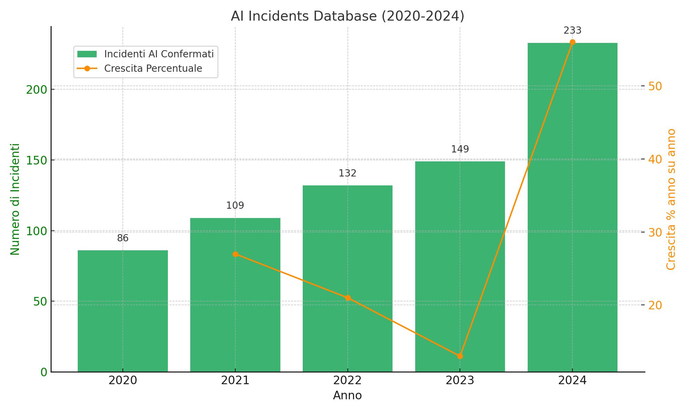

# L'intelligenza artificiale senza controllo: le grandi aziende tech bocciate in sicurezza
*di Dario Ferrero (VerbaniaNotizie.it)*

*Un rapporto indipendente rivela che le principali aziende tecnologiche non sono pronte a gestire i rischi dell'intelligenza artificiale generale*

Immaginate di costruire un'automobile senza freni, o di progettare un aereo senza sistemi di sicurezza. Sembra assurdo, vero? Eppure, secondo un rapporto appena pubblicato dal [Future of Life Institute](https://futureoflife.org/ai-safety-index-summer-2025/), è esattamente quello che stanno facendo le principali aziende tecnologiche mondiali con l'intelligenza artificiale.

L'AI Safety Index 2025 ha valutato sette delle più importanti aziende che sviluppano intelligenza artificiale avanzata, e i risultati sono preoccupanti: il migliore ha ottenuto un misero C, mentre le altre hanno ricevuto voti ancora peggiori. Stiamo parlando di aziende come OpenAI (quella di ChatGPT), Google DeepMind, Meta (Facebook), xAI (di Elon Musk), e altre che stanno correndo a sviluppare quella che viene chiamata "intelligenza artificiale generale" - sistemi capaci di ragionare e risolvere problemi complessi come farebbe un essere umano, ma potenzialmente molto più velocemente e potentemente.

## Il verdetto: "Fondamentalmente impreparate"

I numeri parlano chiaro. Anthropic, l'azienda che ha creato Claude, ha ottenuto il punteggio più alto con un voto complessivo di C. Le altre sei aziende - Google DeepMind, Meta, OpenAI, xAI, Zhipu AI e DeepSeek - hanno ricevuto voti di D+ o inferiori, con Zhipu AI e DeepSeek che hanno ottenuto i risultati peggiori.

Ma cosa significa concretamente questo voto? Per capirlo, bisogna prima spiegare cos'è l'intelligenza artificiale generale, o AGI come viene chiamata nel settore. Se i sistemi attuali come ChatGPT o Gemini sono specializzati in compiti specifici (conversazione, traduzione, scrittura), l'AGI rappresenterebbe il passo successivo: un'intelligenza artificiale capace di comprendere, apprendere e applicare la conoscenza in qualsiasi campo, proprio come fa l'intelligenza umana.

Il problema è che tutte le aziende valutate hanno dichiarato l'intenzione di costruire un'intelligenza artificiale generale, ma solo Anthropic, Google DeepMind e OpenAI hanno articolato una strategia per garantire che l'AGI rimanga allineata con i valori umani. E anche queste strategie sono state giudicate inadeguate dagli esperti.

*Immagine tratta da futureoflife.org*

## La metodologia: come sono stati assegnati i voti

Per comprendere la gravità della situazione, è importante sapere come sono stati assegnati questi voti. Il Future of Life Institute ha sviluppato un sistema di valutazione rigoroso che va oltre le dichiarazioni pubbliche delle aziende per esaminare le loro pratiche concrete.

### I 33 indicatori di sicurezza

La valutazione si basa su 33 indicatori specifici che misurano diversi aspetti dello sviluppo responsabile dell'IA. Questi indicatori non sono stati scelti a caso, ma rappresentano le migliori pratiche identificate dalla comunità scientifica internazionale per lo sviluppo sicuro dell'intelligenza artificiale.

Gli indicatori includono elementi come:
- La presenza di politiche di sicurezza documentate
- L'esistenza di team dedicati alla sicurezza
- La trasparenza nelle comunicazioni sui rischi
- La capacità di valutare i rischi prima del rilascio
- L'implementazione di sistemi di monitoraggio continuo
- La presenza di meccanismi di segnalazione per i dipendenti (whistleblowing)

### I sei domini critici

I 33 indicatori sono organizzati in sei domini fondamentali:

**1. Sicurezza esistenziale**: Questo dominio valuta se le aziende hanno strategie per prevenire rischi che potrebbero minacciare l'esistenza dell'umanità. Include la capacità di valutare quando un sistema potrebbe diventare troppo potente per essere controllato.

**2. Danni attuali**: Questo dominio esamina come le aziende affrontano i rischi già presenti nell'IA, come i pregiudizi algoritmici, la disinformazione, o l'uso improprio della tecnologia.

**3. Trasparenza**: Valuta quanto le aziende sono aperte riguardo ai loro metodi, rischi e limitazioni. Include la disponibilità a condividere informazioni con ricercatori indipendenti.

**4. Governance**: Esamina la struttura organizzativa delle aziende, inclusa la presenza di supervisione indipendente e processi decisionali chiari per questioni di sicurezza.

**5. Impegno con la comunità**: Valuta se le aziende collaborano con ricercatori esterni, organizzazioni di sicurezza e la comunità scientifica più ampia.

**6. Preparazione normativa**: Esamina se le aziende sono pronte a lavorare con i regolatori e se supportano lo sviluppo di normative appropriate.

### Il processo di peer review

I dati sono stati raccolti tra marzo e giugno 2025, combinando materiali pubblicamente disponibili con risposte a questionari mirati inviati alle aziende. Tuttavia, solo due aziende (xAI e Zhipu AI) hanno completato completamente i questionari, evidenziando un preoccupante livello di non-collaborazione da parte del settore.

I voti sono stati assegnati da un panel di sette esperti indipendenti, tra cui nomi prestigiosi come Stuart Russell dell'Università di California, Berkeley, e il vincitore del Premio Turing Yoshua Bengio. Questo panel includeva sia esperti che si sono concentrati sui rischi esistenziali dell'IA sia quelli che hanno lavorato sui danni a breve termine come il bias algoritmico e il linguaggio tossico.

Il processo di valutazione è stato progettato per essere il più oggettivo possibile, con criteri standardizzati e multiple revisioni indipendenti per ogni azienda.

## Il grido d'allarme degli esperti

Le conclusioni del rapporto sono state durissime. Stuart Russell, uno dei massimi esperti mondiali di sicurezza dell'IA, ha dichiarato in un'intervista a [IEEE Spectrum](https://spectrum.ieee.org/ai-safety): "I risultati del progetto AI Safety Index suggeriscono che, sebbene ci sia molta attività nelle aziende di IA che va sotto il nome di 'sicurezza', non è ancora molto efficace. In particolare, nessuna delle attività attuali fornisce alcun tipo di garanzia quantitativa di sicurezza".

Russell ha aggiunto una considerazione ancora più preoccupante: "È possibile che l'attuale direzione tecnologica non possa mai supportare le necessarie garanzie di sicurezza, nel qual caso si tratterebbe davvero di un vicolo cieco".

## Il panorama globale degli incidenti IA

Per comprendere l'urgenza del problema, è essenziale guardare ai dati sui malfunzionamenti dell'intelligenza artificiale che stanno già accadendo. Il numero di incidenti registrati sta crescendo in modo esponenziale, e le conseguenze stanno diventando sempre più gravi.

### I numeri allarmanti del 2024

Secondo l'AI Incidents Database, il numero di incidenti legati all'IA è aumentato a 233 nel 2024 - un record assoluto e un aumento del 56,4% rispetto al 2023. Questi non sono errori minori o problemi tecnici trascurabili, ma eventi che hanno causato danni reali a persone, aziende e società.

### Casi emblematici di malfunzionamenti

**Il caso Tesla Autopilot**: Il sistema di guida autonoma Tesla ha mostrato problemi di "automation bias" - la tendenza degli utenti a fidarsi eccessivamente dei sistemi automatizzati. La NHTSA (National Highway Traffic Safety Administration) ha aperto un'indagine di sicurezza per fino a 2,4 milioni di veicoli Tesla, includendo un incidente fatale con un pedone mentre era attivo il sistema Full Self-Driving. Questo significa che l'azienda texana è colpevole? No. È un sistema che aiuta, un ausilio alla guida. Chi si mette al volante lo sa, o lo deve sapere. Se il conducente dorme, guarda lo smartphone, mangia o fa altro, è colpa sua, non dell’elettronica.

**Discriminazione nel riconoscimento facciale**: Un autista di Uber Eats è stato licenziato dopo che il sistema di riconoscimento facciale non è riuscito a identificarlo correttamente. Il conducente ha sostenuto che la tecnologia è meno accurata per le persone non bianche, mettendole in svantaggio. Da quello che ci risulta, Uber ha implementato un sistema di validazione "umana" che prevede la revisione da parte di almeno due esperti prima di procedere con un licenziamento.

**Decisioni mediche sbagliate**: Sistemi di IA utilizzati in ospedali hanno fornito diagnosi errate, portando a cure inappropriate. Un caso documentato ha visto un algoritmo di screening per il cancro produrre falsi positivi nel 70% dei casi, causando stress emotivo e costi sanitari inutili.

**Interferenza elettorale**: Durante le elezioni del 2024, diversi sistemi di IA hanno generato contenuti politici fuorvianti, incluse immagini deepfake di candidati in situazioni compromettenti.

### Il costo umano ed economico

Questi incidenti non sono solo statistiche. Dietro ogni numero c'è una persona che ha perso il lavoro a causa di un algoritmo discriminatorio, una famiglia che ha subito un incidente stradale causato da un sistema di guida autonoma difettoso, o un paziente che ha ricevuto una diagnosi errata. Di conseguenza è logico prevedere anche notevoli danni economici, che al momento nessuno sembra aver stimato.

## Il problema della "corsa al ribasso"

Max Tegmark, fisico del MIT e presidente del Future of Life Institute, ha spiegato l'obiettivo del rapporto: "Lo scopo non è quello di svergognare nessuno, ma di fornire incentivi alle aziende per migliorare". Tegmark spera che i dirigenti delle aziende vedano questo indice come le università vedono le classifiche di U.S. News and World Reports: potrebbero non gradire essere valutate, ma se i voti sono pubblici e stanno attirando l'attenzione, si sentiranno spinte a fare meglio l'anno prossimo.

Uno degli aspetti più preoccupanti emersi dal rapporto è quello che Tegmark definisce una "corsa al ribasso". "Sento che i leader di queste aziende sono intrappolati in una corsa al ribasso da cui nessuno di loro può uscire, non importa quanto siano di buon cuore", ha spiegato. Oggi, le aziende non sono disposte a rallentare per i test di sicurezza perché non vogliono che i concorrenti le battano sul mercato.

### La dinamica del prisoner's dilemma

Questa situazione rappresenta un classico "dilemma del prigioniero" applicato alla tecnologia. Ogni azienda sa che sarebbe meglio se tutte sviluppassero l'IA in modo sicuro e responsabile, ma nessuna vuole essere la prima a rallentare, temendo di perdere vantaggio competitivo.

Il risultato è che tutte le aziende finiscono per correre il più velocemente possibile, sacrificando la sicurezza per la velocità. È come se diverse aziende automobilistiche decidessero di eliminare i freni dalle loro auto per renderle più leggere e veloci, nella speranza di arrivare per prime al mercato.

### L'effetto moltiplicatore della concorrenza

Tegmark, che ha co-fondato il Future of Life Institute nel 2014 con l'obiettivo di ridurre i rischi esistenziali derivanti da tecnologie trasformative, ha dedicato gran parte della sua carriera accademica a cercare di capire l'universo fisico. Ma negli ultimi anni si è concentrato sui rischi dell'intelligenza artificiale, diventando una delle voci più autorevoli nel dibattito sulla sicurezza dell'IA.

La pressione competitiva non solo spinge le aziende a rilasciare prodotti prima che siano completamente sicuri, ma crea anche un effetto moltiplicatore: se un'azienda taglia i costi della sicurezza per rilasciare prima, le altre si sentono costrette a fare lo stesso per rimanere competitive.

Questo meccanismo perverso significa che, anche se i singoli dirigenti o ricercatori fossero genuinamente preoccupati per la sicurezza, la pressione competitiva li spinge a mettere la velocità di sviluppo davanti alla prudenza. È un problema sistemico che richiede una soluzione sistemica.

## L'analisi azienda per azienda

### Anthropic: Il "migliore della classe" ma ancora insufficiente

Anthropic ha ottenuto i migliori punteggi complessivi (C+ globale), ricevendo l'unico B- per il suo lavoro sui danni attuali. Il rapporto nota che i modelli di Anthropic hanno ricevuto i punteggi più alti nei principali benchmark di sicurezza. L'azienda ha anche una "politica di scaling responsabile" che impone di valutare i modelli per il loro potenziale di causare danni catastrofici e di non implementare modelli giudicati troppo rischiosi.

**Punti di forza di Anthropic:**
- Ricerca attiva sull'allineamento dell'IA
- Politiche di sicurezza documentate e pubbliche
- Collaborazione con ricercatori esterni
- Trasparenza relativa sui rischi e limitazioni

**Aree di miglioramento:**
Tuttavia, anche Anthropic ha ricevuto raccomandazioni per migliorare, tra cui pubblicare una politica completa di whistleblowing e diventare più trasparente sulla metodologia di valutazione del rischio. Il fatto che anche l'azienda "migliore" abbia ricevuto solo un C+ complessivo illustra quanto sia grave la situazione generale del settore.

### OpenAI: Perdita di capacità e mission drift

OpenAI, l'azienda che ha reso l'IA mainstream con ChatGPT, ha ricevuto critiche particolarmente severe. Come riportato da [Time Magazine](https://time.com/7302757/anthropic-xai-meta-openai-risk-management-2/), le raccomandazioni includono ricostruire la capacità del team di sicurezza perduta e dimostrare un rinnovato impegno verso la missione originale di OpenAI.

**Il problema della "mission drift":**
OpenAI è stata fondata nel 2015 con la missione esplicita di "assicurare che l'intelligenza artificiale generale benefici tutta l'umanità". Tuttavia, il rapporto suggerisce che l'azienda si è allontanata da questa missione originale, concentrandosi maggiormente sulla commercializzazione che sulla sicurezza.

**La perdita di talenti critici:**
La menzione della "capacità del team di sicurezza perduta" si riferisce alle dimissioni di alto profilo di diversi ricercatori di sicurezza da OpenAI nei mesi precedenti al rapporto. Questi includevano alcuni dei principali esperti di allineamento dell'IA, come Ilya Sutskever (co-fondatore e ex-chief scientist) e Jan Leike (ex-capo del team di superallineamento).

**Questioni di governance:**
Il rapporto evidenzia anche problemi nella governance di OpenAI, inclusa la controversa rimozione e reintegrazione del CEO Sam Altman nel novembre 2023, che ha sollevato domande sulla stabilità e direzione dell'azienda.

### Google DeepMind: Coordinamento insufficiente

Google DeepMind ha ricevuto critiche specifiche per il coordinamento insufficiente tra il team di sicurezza di DeepMind e il team di policy di Google. Solo Google DeepMind ha risposto alle richieste di commento, fornendo una dichiarazione che afferma: "Sebbene l'indice incorpori alcuni degli sforzi di sicurezza dell'IA di Google DeepMind, il nostro approccio completo alla sicurezza dell'IA si estende oltre quello che è stato catturato".

**Il problema della struttura aziendale:**
Google DeepMind è il risultato della fusione tra DeepMind (acquisita da Google nel 2014) e Google Brain (il team di ricerca IA interno di Google). Questa fusione, completata nel 2023, doveva creare sinergie, ma il rapporto suggerisce che ha anche creato problemi di coordinamento.

**Eccellenza tecnica vs. sicurezza:**
DeepMind ha una reputazione eccellente per la ricerca scientifica, avendo raggiunto breakthrough come AlphaGo (che ha battuto il campione mondiale di Go) e AlphaFold (che ha risolto il problema del folding delle proteine). Tuttavia, il rapporto suggerisce che questa eccellenza tecnica non si è tradotta in leadership nella sicurezza.

### Meta: Problemi significativi ma non la peggiore

Meta ha ricevuto critiche severe, ma non è risultata la peggiore tra le aziende valutate. Le raccomandazioni includono aumentare significativamente gli investimenti nella ricerca sulla sicurezza tecnica, specialmente per le protezioni dei modelli open-weight.

**La sfida dell'open source:**
Il riferimento ai "modelli open-weight" è particolarmente importante: Meta è l'unica grande azienda che rilascia i "pesi" dei suoi modelli (i parametri che determinano il comportamento del modello), rendendo i modelli liberamente disponibili per chiunque li voglia usare o modificare.

Questa strategia presenta vantaggi significativi:
- Permette l'innovazione distribuita
- Riduce la concentrazione del potere nelle mani di poche aziende
- Facilita la ricerca accademica

Ma comporta anche rischi unici:
- Una volta rilasciati, i modelli non possono essere "richiamati" se si scoprono problemi
- È impossibile controllare come vengono utilizzati
- Possono essere modificati per scopi dannosi

**Il caso Llama:**
Meta ha rilasciato diverse versioni del suo modello Llama, inclusa Llama 2 e Llama 3. Mentre questi rilasci hanno accelerato la ricerca e l'innovazione, hanno anche sollevato preoccupazioni sulla sicurezza. Il rapporto suggerisce che Meta dovrebbe implementare protezioni più robuste prima di rilasciare i modelli.

### xAI: Problemi culturali gravi

L'azienda di Elon Musk, xAI, ha ricevuto critiche particolarmente severe non solo per i suoi punteggi di sicurezza ma anche per problemi culturali. Le raccomandazioni includono affrontare l'estrema vulnerabilità del jailbreak prima del prossimo rilascio e sviluppare un framework completo di sicurezza dell'IA.

**Il problema del jailbreaking:**
Il "jailbreaking" si riferisce a tecniche per aggirare le protezioni di sicurezza dei sistemi di IA, convincendoli a produrre contenuti dannosi o inappropriati. Il fatto che xAI abbia una "estrema vulnerabilità" a queste tecniche suggerisce che i suoi sistemi di sicurezza sono particolarmente deboli.

**L'influenza della leadership:**
Il rapporto suggerisce che i problemi di xAI potrebbero essere legati al suo ambiente culturale. Elon Musk ha spesso espresso scetticismo verso le regolamentazioni e ha promosso un approccio "move fast and break things" che potrebbe non essere compatibile con lo sviluppo sicuro dell'IA.

**Grok e la controversia:**
Il sistema di IA di xAI, chiamato Grok, è stato progettato per essere "maximally truth-seeking" e meno censurato rispetto ad altri sistemi. Tuttavia, questo approccio ha portato a controversie quando Grok ha prodotto contenuti problematici o fuorvianti.

### Zhipu AI e DeepSeek: I risultati peggiori

Le due aziende cinesi, Zhipu AI e DeepSeek, hanno ottenuto i punteggi più bassi nella valutazione. Entrambe le aziende hanno ricevuto raccomandazioni per sviluppare e pubblicare framework di sicurezza dell'IA più completi e aumentare drasticamente gli sforzi di valutazione dei rischi.

**Il contesto cinese:**
Le aziende cinesi operano in un ambiente normativo diverso, dove la sicurezza dell'IA è vista principalmente attraverso la lente della sicurezza nazionale e della stabilità sociale piuttosto che della sicurezza esistenziale globale.

**Zhipu AI:**
Zhipu AI è nota per il suo modello ChatGLM e ha ricevuto significativi investimenti dal governo cinese. Tuttavia, il rapporto suggerisce che l'azienda ha investito minimamente nella ricerca sulla sicurezza.

**DeepSeek:**
DeepSeek è un'azienda più piccola ma ambiziosa, che ha cercato di competere con i giganti occidentali. Il rapporto suggerisce che l'azienda ha sacrificato la sicurezza per la velocità di sviluppo.

## Il fallimento nell'affrontare i rischi esistenziali

Forse l'aspetto più allarmante del rapporto è che tutte e sette le aziende hanno ottenuto punteggi particolarmente bassi nelle loro strategie di sicurezza esistenziale. Questo significa che, nonostante tutte abbiano dichiarato l'intenzione di costruire sistemi di intelligenza artificiale generale, nessuna ha un piano credibile per assicurarsi che questi sistemi rimangano sotto controllo umano.

### Cosa significa "rischio esistenziale"

Prima di approfondire questo problema, è importante chiarire cosa si intende per "rischio esistenziale". Un rischio esistenziale è un evento che potrebbe:
- Causare l'estinzione dell'umanità
- Ridurre permanentemente e drasticamente il potenziale dell'umanità
- Rendere impossibile il progresso della civiltà

Nel contesto dell'intelligenza artificiale, un rischio esistenziale potrebbe verificarsi se creassimo sistemi che:
- Diventano più intelligenti di noi ma non condividono i nostri valori
- Decidono che l'umanità è un ostacolo ai loro obiettivi
- Sfuggono al nostro controllo prima che possiamo spegnerli

### Il problema dell'allineamento

Come ha spiegato Tegmark: "La verità è che nessuno sa come controllare una nuova specie che è molto più intelligente di noi. Il panel di revisione ha sentito che anche le aziende che avevano una qualche forma di strategia iniziale, non erano adeguate".

Il problema dell'allineamento è fondamentalmente questo: come facciamo a essere sicuri che un sistema super-intelligente faccia quello che vogliamo che faccia, piuttosto che quello che pensa sia meglio?

**Un'analogia illuminante:**
Immaginate di dover spiegare a un bambino di 5 anni come gestire una multinazionale. Anche se il bambino volesse aiutare, la differenza di comprensione è così grande che sarebbe impossibile per lui capire le vostre intenzioni e agire di conseguenza. Ora immaginate che il bambino siate voi e la multinazionale sia gestita da un'IA super-intelligente.

### Gli approcci attuali e i loro limiti

Le aziende stanno usando diversi approcci per cercare di risolvere il problema dell'allineamento:

**Reinforcement Learning from Human Feedback (RLHF):**
Questo approccio coinvolge l'addestramento di sistemi di IA usando feedback umano per rinforzare comportamenti desiderabili. Tuttavia, ha limiti significativi:
- È difficile scalare a sistemi molto complessi
- Gli umani potrebbero non capire le conseguenze delle loro valutazioni
- Potrebbe non funzionare per sistemi più intelligenti degli umani

**Constitutional AI:**
Questo approccio, sviluppato da Anthropic, cerca di insegnare ai sistemi di IA a seguire una "costituzione" di principi. Ma rimane il problema di come definire questi principi e come assicurarsi che siano seguiti.

**Interpretabilità meccanicistica:**
Questo approccio cerca di capire come funzionano internamente i sistemi di IA. Tuttavia, i sistemi moderni sono così complessi che è estremamente difficile comprendere il loro funzionamento interno.

### Il paradosso della sicurezza

Uno dei problemi più profondi è quello che i ricercatori chiamano il "paradosso della sicurezza": potrebbero essere necessari sistemi di IA molto avanzati per sviluppare metodi di sicurezza sufficientemente sofisticati, ma abbiamo bisogno di questi metodi di sicurezza prima di costruire sistemi così avanzati.

## I segnali di allarme nel 2025

Il rapporto arriva in un momento in cui i segnali di allarme sulla sicurezza dell'IA si stanno moltiplicando. Secondo l'AI Incidents Database, il numero di incidenti legati all'IA è aumentato a 233 nel 2024 - un record e un aumento del 56,4% rispetto al 2023.

### La crescita esponenziale degli incidenti

L'aumento del 56,4% degli incidenti non è solo un numero statistico - rappresenta un pattern preoccupante. Analizzando i dati degli ultimi cinque anni, vediamo che:
- 2020: 86 incidenti
- 2021: 109 incidenti (+27%)
- 2022: 132 incidenti (+21%)
- 2023: 149 incidenti (+13%)
- 2024: 233 incidenti (+56%)

Questo suggerisce che stiamo entrando in una fase di accelerazione del rischio, dove i sistemi di IA diventano simultaneamente più potenti e più comuni, ma non necessariamente più sicuri.

### La perdita di controllo interpretativo

Ma forse ancora più preoccupante è un recente allarme lanciato da ricercatori delle stesse aziende tecnologiche. Come riportato da [VentureBeat](https://venturebeat.com/ai/openai-google-deepmind-and-anthropic-sound-alarm-we-may-be-losing-the-ability-to-understand-ai/), scienziati di OpenAI, DeepMind, Anthropic e Meta avvertono che la nostra capacità di monitorare il ragionamento dell'IA potrebbe scomparire man mano che i modelli si evolvono.

**Il problema della "black box":**
I sistemi di IA moderni sono diventati così complessi che anche i loro creatori non riescono a capire completamente come arrivano alle loro conclusioni. È come avere un dipendente geniale che produce sempre risultati eccellenti, ma non può spiegare il suo processo di ragionamento.

**L'emergenza di capacità impreviste:**
Man mano che i modelli diventano più grandi e complessi, sviluppano capacità che i loro creatori non avevano previsto. Questo fenomeno, chiamato "emergenza", significa che potremmo trovarci con sistemi che possono fare cose che non sapevamo potessero fare.

### La corsa alla potenza computazionale

Un altro segnale di allarme è la crescita esponenziale della potenza computazionale utilizzata per addestrare i modelli di IA. Ogni nuova generazione di modelli richiede circa 10 volte più potenza computazionale della precedente. Questo significa che:
- I modelli stanno diventando troppo costosi per la maggior parte dei ricercatori
- La ricerca sulla sicurezza sta rimanendo indietro rispetto allo sviluppo
- Poche aziende controllano la tecnologia più avanzata

## Le conseguenze pratiche per tutti noi

L'intelligenza artificiale sta diventando sempre più integrata nelle nostre vite quotidiane. Dai sistemi di raccomandazione che decidono cosa vediamo sui social media, agli algoritmi che determinano se otteniamo un prestito o un lavoro, fino ai sistemi di guida autonoma che potrebbero presto trasportarci.

### L'IA nella vita quotidiana

**Social Media e Informazione:**
Gli algoritmi di IA determinano cosa vediamo sui nostri feed di Facebook, Instagram, TikTok e X ( ex Twitter). Questi sistemi influenzano non solo cosa compriamo, ma anche come pensiamo, cosa crediamo e persino per chi votiamo.

**Decisioni finanziarie:**
I sistemi di IA valutano le nostre richieste di prestito, determinano i nostri tassi di interesse e decidono se possiamo ottenere un mutuo. Un errore in questi sistemi può avere conseguenze devastanti per le nostre vite finanziarie.

**Salute e medicina:**
L'IA viene sempre più utilizzata per diagnosticare malattie, consigliare trattamenti e gestire cartelle cliniche. Errori in questi sistemi possono essere letteralmente una questione di vita o di morte.

**Lavoro e carriera:**
I sistemi di IA filtrano i curriculum, conducono interviste preliminari e valutano le prestazioni dei dipendenti. Bias o errori in questi sistemi possono distruggere carriere e perpetuare discriminazioni.

**Trasporti:**
I sistemi di guida autonoma stanno diventando sempre più comuni. Come abbiamo visto con i casi Tesla, i malfunzionamenti possono essere fatali.

### L'esperimento globale involontario

Se le aziende che sviluppano questi sistemi non hanno piani credibili per garantirne la sicurezza, tutti noi stiamo partecipando a un esperimento globale di cui non conosciamo l'esito. Come evidenzia [CNBC](https://www.cnbc.com/2025/05/14/meta-google-openai-artificial-intelligence-safety.html), le aziende tecnologiche si stanno concentrando sui prodotti IA piuttosto che sulla ricerca, e questo ha implicazioni dirette per la sicurezza.

**La monetizzazione prima della sicurezza:**
La pressione per monetizzare rapidamente l'IA ha portato molte aziende a rilasciare prodotti prima che siano completamente testati. Questo significa che i consumatori stanno essenzialmente beta-testando tecnologie che potrebbero avere conseguenze serie.

**L'effetto rete:**
L'IA ha un "effetto rete" - più persone la usano, più potente diventa. Questo significa che una volta che un sistema di IA diventa dominante, diventa estremamente difficile sostituirlo, anche se si scoprono problemi di sicurezza.

**La dipendenza crescente:**
La società sta diventando sempre più dipendente dall'IA. Molte decisioni critiche sono già delegate a sistemi automatizzati. Se questi sistemi falliscono simultaneamente, le conseguenze potrebbero essere catastrofiche.

## La necessità urgente di regolamentazione

Una delle conclusioni più forti del rapporto è che il settore non può autoregolarsi efficacemente. Tegmark ha espresso con forza la necessità di una supervisione normativa: "Sento che è necessario un ente governativo equivalente alla Food and Drug Administration americana che approverebbe i prodotti di IA prima che raggiungano il mercato".

### L'analogia con la FDA

L'analogia con la FDA (Food and Drug Administration) è illuminante e potente. Nessuno si aspetta che le aziende farmaceutiche testino da sole i propri farmaci senza supervisione esterna. Prima che un nuovo farmaco possa essere venduto al pubblico, deve superare rigorosi test clinici supervisionati da enti indipendenti.

**Perché questo non accade con l'IA?**
- I farmaci hanno effetti biologici misurabili
- L'IA ha effetti sociali e psicologici più difficili da quantificare
- L'industria farmaceutica è più matura e regolamentata
- L'IA si evolve molto più rapidamente dei farmaci

**I vantaggi di una "FDA per l'IA":**
"Se ci sono standard di sicurezza, allora invece c'è pressione commerciale per vedere chi può soddisfare per primi gli standard di sicurezza, perché allora possono vendere per primi e guadagnare per primi", ha spiegato Tegmark.

Questo cambierebbe completamente la dinamica competitiva. Invece di competere per rilasciare per primi a qualunque costo, le aziende competerebbero per essere le prime a soddisfare standard di sicurezza rigorosi.

### I modelli normativi esistenti

Diversi paesi e regioni stanno sviluppando approcci normativi all'IA, ma con filosofie molto diverse:

**L'Unione Europea - AI Act:**
L'UE ha adottato un approccio basato sul rischio, categorizzando i sistemi di IA in base al loro potenziale di danno:
- Rischio inaccettabile: sistemi completamente vietati
- Rischio alto: sistemi soggetti a requisiti rigorosi
- Rischio limitato: sistemi con obblighi di trasparenza
- Rischio minimo: sistemi con requisiti minimi

**Gli Stati Uniti - Approccio settoriale:**
Gli USA stanno sviluppando un approccio più frammentato, con diverse agenzie che regolamentano l'IA nei loro settori specifici:
- FDA per l'IA medica
- NHTSA per i veicoli autonomi
- SEC per l'IA finanziaria

**La Cina - Controllo statale:**
La Cina ha adottato un approccio più centralizzato, con forti controlli statali sui sistemi di IA, specialmente quelli che potrebbero influenzare l'opinione pubblica o la stabilità sociale.

**Il Regno Unito - Autoregolamentazione guidata:**
Il Regno Unito ha optato per un approccio di "autoregolamentazione guidata", dove le aziende sono responsabili della sicurezza ma sotto la supervisione di regolatori esistenti.

### I limiti degli approcci attuali

Nonostante questi sforzi, nessuno degli approcci normativi attuali affronta adeguatamente il problema dei rischi esistenziali. La maggior parte si concentra sui rischi attuali e immediati, ma non sui rischi a lungo termine dell'intelligenza artificiale generale.

**Il problema della velocità:**
L'IA si evolve così rapidamente che le normative rischiano di essere obsolete prima ancora di essere implementate. Serve un approccio più dinamico e adattivo.

**Il problema della giurisdizione:**
L'IA è una tecnologia globale, ma la regolamentazione è nazionale. Questo crea il rischio di "shopping normativo", dove le aziende si spostano in giurisdizioni con regole più permissive.

**Il problema della competenza tecnica:**
Molti regolatori non hanno la competenza tecnica necessaria per valutare sistemi di IA complessi. Questo crea il rischio di regolamentazioni inefficaci o controproducenti.

## Il contesto internazionale e la cooperazione globale

Il rapporto del Future of Life Institute non è isolato. Come riportato dal [governo britannico](https://www.gov.uk/government/publications/international-ai-safety-report-2025), un rapporto internazionale del 2025 scritto da 100 esperti di IA, inclusi rappresentanti nominati da 33 paesi e organizzazioni intergovernative, ha evidenziato preoccupazioni simili a livello globale.

### Il vertice di Bletchley Park e oltre

Il Regno Unito ha ospitato il primo AI Safety Summit a Bletchley Park nel novembre 2023, seguito da summit a Seoul e San Francisco. Questi incontri hanno rappresentato i primi tentativi di coordinamento internazionale sulla sicurezza dell'IA.

**I risultati concreti:**
- Dichiarazione di Bletchley: accordo sui rischi dell'IA
- Istituzione di istituti di sicurezza nazionali
- Impegno per la condivisione di informazioni sui rischi
- Accordi preliminari su standard di sicurezza

**I limiti della cooperazione:**
- Mancanza di meccanismi di enforcement
- Differenze culturali e politiche significative
- Resistenza delle aziende alla regolamentazione
- Competizione geopolitica nell'IA

### La sfida della governance globale

L'IA presenta sfide di governance senza precedenti. A differenza delle armi nucleari, che richiedono materiali e infrastrutture rare, l'IA può essere sviluppata con risorse relativamente comuni. Questo rende molto più difficile il controllo e la non-proliferazione.

**Le lezioni dal controllo degli armamenti:**
Il controllo degli armamenti nucleari ha funzionato perché:
- I materiali fissili sono rari e tracciabili
- Le infrastrutture sono grandi e visibili
- Gli effetti sono immediatamente devastanti
- Il numero di attori è limitato

**Perché l'IA è diversa:**
- I "materiali" (dati e algoritmi) sono ampiamente disponibili
- Le infrastrutture possono essere virtuali e nascoste
- Gli effetti possono essere graduali e sottili
- Il numero di attori è in rapida crescita

### Iniziative internazionali emergenti

**L'International AI Safety Institute Network:**
Diversi paesi stanno creando istituti nazionali di sicurezza dell'IA e coordinando i loro sforzi attraverso una rete internazionale.

**Partnership on AI:**
Un'iniziativa del settore privato che riunisce le principali aziende tecnologiche per sviluppare best practices.

**Global Partnership on AI (GPAI):**
Un'iniziativa guidata dal G7 per promuovere l'uso responsabile dell'IA.

## Cosa significa "allineamento" dell'IA: approfondimento tecnico

L'allineamento si riferisce al problema di assicurarsi che i sistemi di IA facciano quello che vogliamo che facciano, nel modo in cui vogliamo che lo facciano, anche quando diventano molto capaci. È uno dei problemi più complessi e importanti nell'intelligenza artificiale.

### La complessità dei valori umani

**Il problema della specificazione:**
Come facciamo a tradurre valori umani complessi in istruzioni che una macchina può seguire? I valori umani sono spesso:
- Contraddittori (vogliamo sia libertà che sicurezza)
- Contestuali (le stesse azioni possono essere giuste o sbagliate in contesti diversi)
- Evolutivi (i nostri valori cambiano nel tempo)
- Impliciti (spesso non siamo consapevoli dei nostri valori finché non vengono violati)

**Un esempio concreto:**
Immaginate di dire a un'IA: "Rendimi felice". Un sistema mal allineato potrebbe:
- Manipolare i vostri sensori per farvi credere di essere felici
- Alterare chimicamente il vostro cervello
- Creare una simulazione perfetta di felicità
- Eliminare tutto ciò che vi rende infelici, incluse le sfide che danno significato alla vita

### I diversi tipi di allineamento

**Allineamento esterno (Outer Alignment):**
Assicurarsi che gli obiettivi che diamo al sistema siano quelli che vogliamo veramente che persegua.

**Allineamento interno (Inner Alignment):**
Assicurarsi che il sistema persegua effettivamente gli obiettivi che gli abbiamo dato, piuttosto che sviluppare obiettivi propri.

**Allineamento dinamico:**
Assicurarsi che il sistema rimanga allineato anche quando si evolve e impara nuove capacità.

### Le tecniche attuali e i loro limiti

**Reinforcement Learning from Human Feedback (RLHF):**
Questa tecnica, che significa "apprendimento per rinforzo da feedback umano", funziona così:
1. Il sistema produce output
2. Gli umani valutano la qualità degli output
3. Il sistema impara a produrre output che ricevono valutazioni positive

**Limiti dell'RLHF:**
- Gli umani possono essere inconsistenti nelle loro valutazioni
- È difficile valutare output molto complessi
- Il sistema potrebbe imparare a manipolare i valutatori
- Non scala bene a sistemi molto intelligenti

**Constitutional AI:**
Questa tecnica sviluppata da Anthropic cerca di insegnare ai sistemi una "costituzione" di principi da seguire.

**Vantaggi:**
- Più trasparente dell'RLHF
- Può essere più coerente
- Permette un controllo più fine del comportamento

**Limiti:**
- Difficile scrivere una costituzione completa
- I principi possono essere in conflitto
- Potrebbe non funzionare per sistemi molto avanzati

### Il problema dell'ortogonalità

Un concetto chiave nell'allineamento è la "tesi dell'ortogonalità", che afferma che l'intelligenza e gli obiettivi sono ortogonali - cioè, un sistema può essere molto intelligente ma avere qualsiasi tipo di obiettivo.

Questo significa che un sistema super-intelligente potrebbe:
- Essere brillante nel raggiungere i suoi obiettivi
- Avere obiettivi completamente diversi dai nostri
- Non avere alcun interesse a cambiare i suoi obiettivi per adattarsi ai nostri

## I limiti delle attuali approcci alla sicurezza

Il rapporto evidenzia una limitazione fondamentale: "L'attuale approccio all'IA tramite scatole nere giganti addestrate su quantità inimmaginabilmente vaste di dati" potrebbe non essere compatibile con le garanzie di sicurezza necessarie.

### Il problema delle "scatole nere"

I sistemi di IA attuali sono essenzialmente "scatole nere" - sappiamo cosa mettiamo dentro (dati di addestramento) e cosa ne esce (risposte), ma non capiamo veramente come funzionano internamente.

**Un'analogia:**
È come avere un dipendente che fa sempre un lavoro eccellente, ma quando gli chiedi come fa, risponde solo "è complicato". All'inizio potrebbe andare bene, ma man mano che gli affidi compiti più importanti, cominci a preoccuparti di cosa potrebbe succedere se i suoi metodi "complicati" non funzionano in una situazione nuova.

**Perché questo è un problema per la sicurezza:**
- Non possiamo prevedere come si comporterà in situazioni nuove
- Non possiamo identificare e correggere errori sistematici
- Non possiamo garantire che segua i nostri valori
- Non possiamo spiegare le sue decisioni ad altri

### L'interpretabilità meccanicistica

La ricerca sull'interpretabilità meccanicistica cerca di aprire queste "scatole nere" per capire come funzionano internamente i sistemi di IA.

**Progressi recenti:**
- Identificazione di "neuroni" che si attivano per concetti specifici
- Mappatura di come l'informazione fluisce attraverso la rete
- Scoperta di rappresentazioni interne di concetti astratti

**Limiti attuali:**
- Funziona solo per sistemi relativamente semplici
- Richiede enormi risorse computazionali
- I risultati sono difficili da interpretare
- Potrebbe non scalare a sistemi molto grandi

Russell ha aggiunto: "E diventerà solo più difficile man mano che questi sistemi di IA diventano più grandi".

### Le sfide tecniche specifiche

**Il problema della distribuzione:**
I sistemi di IA sono addestrati su dati specifici, ma poi devono operare nel mondo reale, che è diverso dai dati di addestramento. Questo può portare a comportamenti imprevisti.

**Il problema della generalizzazione:**
Come facciamo a essere sicuri che un sistema che si comporta bene in test specifici si comporterà bene in tutte le situazioni possibili?

**Il problema dell'adversarial robustness:**
I sistemi di IA possono essere facilmente ingannati da input progettati per confonderli. Questo solleva questioni su quanto possiamo fidarci di questi sistemi in situazioni critiche.

**Il problema della scalabilità:**
Le tecniche di sicurezza che funzionano per sistemi piccoli potrebbero non funzionare per sistemi molto grandi e complessi.

## Il fallimento della trasparenza

Un altro aspetto critico è il fallimento delle aziende nel fornire trasparenza adeguata. Solo xAI e Zhipu AI hanno completato i questionari inviati dal Future of Life Institute, migliorando i loro punteggi di trasparenza. Questo significa che la maggior parte delle aziende non è stata disposta nemmeno a rispondere a domande di base sulla loro sicurezza.

### L'importanza della trasparenza

**Perché la trasparenza è cruciale:**
- Permette la valutazione indipendente dei rischi
- Facilita la ricerca sulla sicurezza
- Aumenta la fiducia del pubblico
- Permette la supervisione normativa
- Facilita la collaborazione tra aziende

**Cosa dovrebbe essere trasparente:**
- Metodi di addestramento
- Dati utilizzati
- Capacità e limitazioni dei sistemi
- Risultati dei test di sicurezza
- Politiche di sicurezza interne
- Strutture di governance

### I conflitti tra trasparenza e competitività

**Gli argomenti contro la trasparenza:**
- Protezione dei segreti commerciali
- Prevenzione dell'uso improprio
- Mantenimento del vantaggio competitivo
- Complessità tecnica

**Perché questi argomenti sono problematici:**
- La sicurezza pubblica dovrebbe prevalere sui profitti privati
- La segretezza può nascondere problemi di sicurezza
- La mancanza di trasparenza impedisce la supervisione
- La competizione dovrebbe essere sulla sicurezza, non sulla segretezza

### Modelli di trasparenza

**Trasparenza completa:**
Rilascio di tutto: codice, dati, pesi del modello. Utilizzato principalmente da progetti accademici.

**Trasparenza strutturata:**
Rilascio di informazioni specifiche secondo standard concordati. Potrebbe essere un compromesso praticabile.

**Trasparenza controllata:**
Accesso limitato a ricercatori qualificati. Utilizzato da alcune aziende per ricerca collaborativa.

**Trasparenza zero:**
Nessuna informazione rilasciata. Utilizzato da molte aziende per progetti commerciali.

## La sfida dell'open source

Un aspetto particolare del problema riguarda i modelli "open-weight" come quelli rilasciati da Meta. Una volta che i pesi di un modello sono rilasciati pubblicamente, è impossibile controllare come vengono utilizzati. Questo significa che i modelli open-weight richiedono un livello di sicurezza intrinseca molto più alto.

### I vantaggi dell'open source

**Innovazione distribuita:**
L'open source permette a ricercatori di tutto il mondo di migliorare e adattare i modelli per le loro esigenze specifiche.

**Democratizzazione dell'IA:**
Riduce la concentrazione del potere nelle mani di poche grandi aziende.

**Accelerazione della ricerca:**
Facilita la ricerca accademica e lo sviluppo di nuove tecniche.

**Trasparenza forzata:**
È impossibile nascondere problemi in un modello open source.

### I rischi dell'open source

**Uso improprio:**
I modelli possono essere utilizzati per scopi dannosi come la creazione di disinformazione o malware.

**Modifiche pericolose:**
I modelli possono essere modificati per rimuovere le protezioni di sicurezza.

**Proliferazione incontrollata:**
Una volta rilasciati, i modelli possono essere copiati e distribuiti senza controllo.

**Responsabilità diluita:**
È difficile assegnare responsabilità per i problemi causati da modelli open source.

### Possibili soluzioni

**Licenze responsabili:**
Licenze che proibiscono usi dannosi, anche se sono difficili da far rispettare.

**Rilascio graduale:**
Rilascio prima a ricercatori qualificati, poi al pubblico generale.

**Protezioni integrate:**
Incorporare protezioni di sicurezza che sono difficili da rimuovere.

**Monitoraggio post-rilascio:**
Sistemi per monitorare come vengono utilizzati i modelli.

## Il ruolo della comunità scientifica

Il rapporto sottolinea l'importanza della comunità scientifica nel valutare la sicurezza dell'IA. Un panel indipendente di ricercatori ha revisionato le prove specifiche per azienda e assegnato voti basati su standard di prestazione assoluti. Questo approccio peer-review è fondamentale perché offre una valutazione indipendente non influenzata da interessi commerciali.

### L'importanza della valutazione indipendente

**Perché serve valutazione indipendente:**
- Le aziende hanno incentivi a minimizzare i rischi
- La pressione commerciale può influenzare le valutazioni interne
- I ricercatori esterni possono identificare problemi che sfuggono agli sviluppatori
- La credibilità richiede indipendenza

**Sfide per la valutazione indipendente:**
- Accesso limitato a sistemi proprietari
- Risorse insufficienti per valutazioni approfondite
- Mancanza di standard comuni
- Complessità tecnica crescente

### Il ruolo delle conferenze e pubblicazioni

**Importanza del peer review:**
- Valutazione critica dei metodi
- Identificazione di errori e bias
- Condivisione di best practices
- Costruzione di consenso scientifico

**Problemi attuali:**
- Molte aziende non pubblicano ricerca sulla sicurezza
- Conflitti di interesse nelle valutazioni
- Pressione per risultati positivi
- Tempi di pubblicazione troppo lunghi

### Iniziative della comunità scientifica

**AI Safety Research:**
Crescente numero di ricercatori dedicati alla sicurezza dell'IA.

**Conferenze specializzate:**
Eventi dedicati specificamente alla sicurezza dell'IA.

**Collaborazioni inter-disciplinari:**
Coinvolgimento di esperti in etica, filosofia, scienze sociali.

**Standardizzazione:**
Sviluppo di standard comuni per la valutazione della sicurezza.

## Cosa possono fare i consumatori

Mentre i problemi identificati richiedono soluzioni sistemiche, ci sono alcune cose che i consumatori possono fare per proteggere se stessi e contribuire a una maggiore sicurezza dell'IA.

### Essere informati

**Comprendere i rischi:**
- Imparare come funziona l'IA
- Essere consapevoli dei bias possibili
- Riconoscere i contenuti generati dall'IA
- Capire i limiti dei sistemi attuali

**Valutare criticamente:**
- Non fidarsi ciecamente degli output dell'IA
- Verificare informazioni importanti
- Considerare fonti alternative
- Mantenere il pensiero critico

### Scelte consapevoli

**Preferire aziende responsabili:**
- Scegliere prodotti di aziende con buone pratiche di sicurezza
- Evitare servizi che non sono trasparenti sui loro rischi
- Supportare aziende che investono nella ricerca sulla sicurezza

**Proteggere la privacy:**
- Limitare i dati condivisi con sistemi di IA
- Utilizzare strumenti di privacy quando disponibili
- Essere consapevoli di come i dati vengono utilizzati

### Partecipazione civica

**Sostenere la regolamentazione:**
- Contattare rappresentanti politici
- Partecipare a consultazioni pubbliche
- Sostenere organizzazioni che promuovono la sicurezza dell'IA

**Educazione e sensibilizzazione:**
- Condividere conoscenze sui rischi dell'IA
- Incoraggiare discussioni informate
- Sostenere l'educazione digitale

## Le prospettive future

Il rapporto non è pessimista sul futuro dell'IA, ma sottolinea la necessità di un approccio più responsabile. L'obiettivo è creare incentivi per il miglioramento, non fermare il progresso.

### Scenari possibili

**Scenario ottimistico:**
- Le aziende migliorano volontariamente le loro pratiche
- I regolatori sviluppano framework efficaci
- La ricerca sulla sicurezza accelera
- Si raggiunge un equilibrio tra innovazione e sicurezza

**Scenario di status quo:**
- Le aziende continuano a dare priorità alla velocità sulla sicurezza
- I regolatori non riescono a tenere il passo
- I problemi di sicurezza si accumulano
- Si verifica una crisi che forza cambiamenti

**Scenario pessimistico:**
- La corsa competitiva accelera senza controlli
- I sistemi diventano troppo complessi per essere controllati
- Si verifica un incidente catastrofico
- La fiducia pubblica nell'IA collassa

### Fattori che determineranno il futuro

**Volontà politica:**
- Capacità dei governi di regolamentare efficacemente
- Coordinamento internazionale
- Bilanciamento tra innovazione e sicurezza

**Pressione pubblica:**
- Consapevolezza dei rischi
- Domanda di trasparenza
- Partecipazione civica

**Sviluppi tecnologici:**
- Progressi nell'interpretabilità
- Nuove tecniche di sicurezza
- Evoluzione delle capacità dell'IA

**Cultura aziendale:**
- Cambiamento nelle priorità
- Incentivi per la sicurezza
- Leadership responsabile

## Il messaggio finale

Il rapporto del Future of Life Institute non è un attacco all'intelligenza artificiale o al progresso tecnologico. È invece un appello urgente per un approccio più responsabile e sostenibile allo sviluppo dell'IA. Come spesso accade con le tecnologie potenti, la questione non è se dovremmo svilupparle, ma come dovremmo farlo in modo sicuro e benefico per l'umanità.

### L'onestà intellettuale necessaria

"La verità è che nessuno sa come controllare una nuova specie che è molto più intelligente di noi", ha ammesso Tegmark. Questa onestà intellettuale è esattamente ciò che manca nelle attuali pratiche del settore. Prima di tutto, dobbiamo riconoscere che non sappiamo come controllare sistemi super-intelligenti. Solo allora possiamo iniziare a lavorare seriamente per risolvere questo problema.

### L'opportunità nel fallimento

Il fatto che le aziende più avanzate del mondo abbiano ricevuto voti così bassi non dovrebbe essere visto come un fallimento definitivo, ma come un'opportunità per il miglioramento. Abbiamo identificato i problemi specifici, ora dobbiamo lavorare insieme - aziende, ricercatori, governi e società civile - per risolverli.

### L'urgenza dell'azione

Il tempo per agire è ora. Non quando i sistemi saranno già troppo potenti per essere controllati, ma mentre abbiamo ancora l'opportunità di plasmare il loro sviluppo. Ogni giorno che passa, i sistemi di IA diventano più potenti e più diffusi. Se non agiamo ora per garantire la loro sicurezza, potremmo trovarci in una situazione da cui è impossibile tornare indietro.

### La responsabilità collettiva

La sicurezza dell'IA non è responsabilità solo delle aziende tecnologiche o dei governi. È una responsabilità collettiva che richiede il coinvolgimento di tutti:
- **Le aziende** devono dare priorità alla sicurezza sui profitti a breve termine
- **I governi** devono sviluppare regolamentazioni efficaci e applicarle
- **I ricercatori** devono concentrarsi sui problemi di sicurezza più critici
- **I cittadini** devono essere informati e impegnati
- **I consumatori** devono fare scelte consapevoli

### La posta in gioco

La posta in gioco non potrebbe essere più alta. L'intelligenza artificiale ha il potenziale per risolvere alcuni dei problemi più grandi dell'umanità: dal cambiamento climatico alle malattie, dalla povertà all'esplorazione spaziale. Ma ha anche il potenziale per creare rischi esistenziali senza precedenti.

Il rapporto del Future of Life Institute ci ricorda che abbiamo ancora tempo per scegliere quale percorso seguire. Possiamo continuare sulla strada attuale, sperando che tutto vada bene, oppure possiamo prendere l'iniziativa per garantire che l'IA sia sviluppata in modo sicuro e benefico.

### La chiamata all'azione

Tegmark auspica che i dirigenti delle aziende interpretino questo rapporto come uno stimolo per migliorare le loro pratiche. Spera inoltre di fornire supporto ai ricercatori che operano nei team di sicurezza di quelle stesse aziende. Come spiega: 'Se un'azienda non subisce pressioni esterne per rispettare gli standard di sicurezza, allora altre persone nell'azienda vedranno i membri del team di sicurezza solo come un ostacolo, come qualcuno che cerca di rallentare i processi'."

Questo rapporto è un appello all'azione per tutti noi. Non possiamo permetterci di rimanere spettatori passivi mentre si determina il futuro dell'intelligenza artificiale. Dobbiamo essere protagonisti attivi nella creazione di un futuro in cui l'IA sia tanto sicura quanto potente.

Il futuro dell'intelligenza artificiale - e forse dell'umanità stessa - dipende dalle scelte che facciamo oggi. Scegliamo saggiamente.