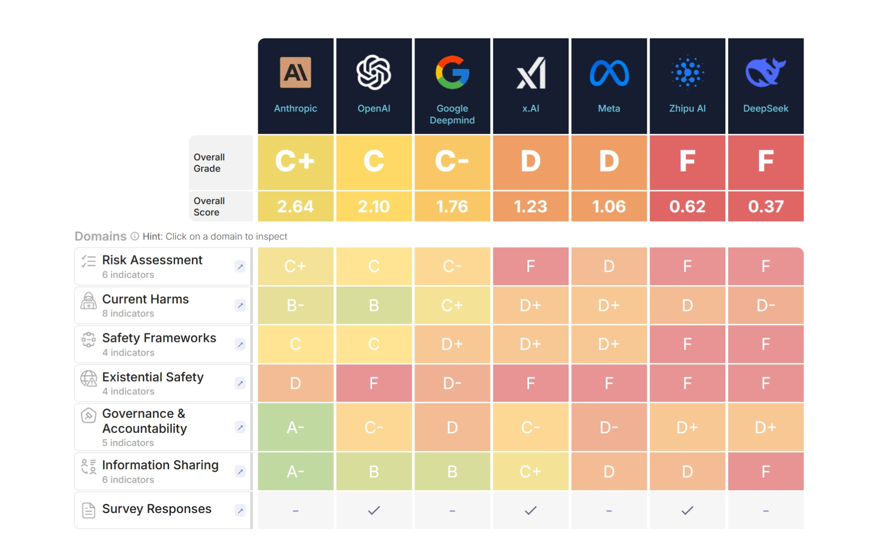

# L'intelligenza artificiale senza controllo: le grandi aziende tech bocciate in sicurezza (Prima Puntata)
*di Dario Ferrero (VerbaniaNotizie.it)*

*Un rapporto indipendente rivela che le principali aziende tecnologiche non sono pronte a gestire i rischi dell'intelligenza artificiale generale*

Immaginate di costruire un'automobile senza freni, o di progettare un aereo senza sistemi di sicurezza. Sembra assurdo, vero? Eppure, secondo un rapporto appena pubblicato dal [Future of Life Institute](https://futureoflife.org/ai-safety-index-summer-2025/), è esattamente quello che stanno facendo le principali aziende tecnologiche mondiali con l'intelligenza artificiale.

L'AI Safety Index 2025 ha valutato sette delle più importanti aziende che sviluppano intelligenza artificiale avanzata, e i risultati sono preoccupanti: il migliore ha ottenuto un misero C, mentre le altre hanno ricevuto voti ancora peggiori. Stiamo parlando di aziende come OpenAI (quella di ChatGPT), Google DeepMind, Meta (Facebook), xAI (di Elon Musk), e altre che stanno correndo a sviluppare quella che viene chiamata "intelligenza artificiale generale" - sistemi capaci di ragionare e risolvere problemi complessi come farebbe un essere umano, ma potenzialmente molto più velocemente e potentemente.

## Il verdetto: "Fondamentalmente impreparate"

I numeri parlano chiaro. Anthropic, l'azienda che ha creato Claude, ha ottenuto il punteggio più alto con un voto complessivo di C. Le altre sei aziende - Google DeepMind, Meta, OpenAI, xAI, Zhipu AI e DeepSeek - hanno ricevuto voti di D+ o inferiori, con Zhipu AI e DeepSeek che hanno ottenuto i risultati peggiori.

Ma cosa significa concretamente questo voto? Per capirlo, bisogna prima spiegare cos'è l'intelligenza artificiale generale, o AGI come viene chiamata nel settore. Se i sistemi attuali come ChatGPT o Gemini sono specializzati in compiti specifici (conversazione, traduzione, scrittura), l'AGI rappresenterebbe il passo successivo: un'intelligenza artificiale capace di comprendere, apprendere e applicare la conoscenza in qualsiasi campo, proprio come fa l'intelligenza umana.

Il problema è che tutte le aziende valutate hanno dichiarato l'intenzione di costruire un'intelligenza artificiale generale, ma solo Anthropic, Google DeepMind e OpenAI hanno articolato una strategia per garantire che l'AGI rimanga allineata con i valori umani. E anche queste strategie sono state giudicate inadeguate dagli esperti.

*Immagine tratta da futureoflife.org*

## La metodologia: come sono stati assegnati i voti

Per comprendere la gravità della situazione, è importante sapere come sono stati assegnati questi voti. Il Future of Life Institute ha sviluppato un sistema di valutazione rigoroso che va oltre le dichiarazioni pubbliche delle aziende per esaminare le loro pratiche concrete.

### I 33 indicatori di sicurezza

La valutazione si basa su 33 indicatori specifici che misurano diversi aspetti dello sviluppo responsabile dell'IA. Questi indicatori non sono stati scelti a caso, ma rappresentano le migliori pratiche identificate dalla comunità scientifica internazionale per lo sviluppo sicuro dell'intelligenza artificiale.

Gli indicatori includono elementi come la presenza di politiche di sicurezza documentate, l'esistenza di team dedicati alla sicurezza, la trasparenza nelle comunicazioni sui rischi, la capacità di valutare i rischi prima del rilascio, l'implementazione di sistemi di monitoraggio continuo e la presenza di meccanismi di segnalazione per i dipendenti.

### I sei domini critici

I 33 indicatori sono organizzati in sei domini fondamentali che coprono aspetti diversi ma interconnessi della sicurezza dell'intelligenza artificiale.

Il primo dominio riguarda la sicurezza esistenziale e valuta se le aziende hanno strategie per prevenire rischi che potrebbero minacciare l'esistenza dell'umanità, inclusa la capacità di valutare quando un sistema potrebbe diventare troppo potente per essere controllato.

Il secondo dominio esamina i danni attuali, analizzando come le aziende affrontano i rischi già presenti nell'IA come i pregiudizi algoritmici, la disinformazione o l'uso improprio della tecnologia.

Il terzo dominio è la trasparenza, che valuta quanto le aziende sono aperte riguardo ai loro metodi, rischi e limitazioni, includendo la disponibilità a condividere informazioni con ricercatori indipendenti.

Il quarto dominio riguarda la governance ed esamina la struttura organizzativa delle aziende, inclusa la presenza di supervisione indipendente e processi decisionali chiari per questioni di sicurezza.

Il quinto dominio valuta l'impegno con la comunità, esaminando se le aziende collaborano con ricercatori esterni, organizzazioni di sicurezza e la comunità scientifica più ampia.

Infine, il sesto dominio esamina la preparazione normativa, verificando se le aziende sono pronte a lavorare con i regolatori e se supportano lo sviluppo di normative appropriate.

### Il processo di peer review

I dati sono stati raccolti tra marzo e giugno 2025, combinando materiali pubblicamente disponibili con risposte a questionari mirati inviati alle aziende. Tuttavia, solo due aziende (xAI e Zhipu AI) hanno completato completamente i questionari, evidenziando un preoccupante livello di non-collaborazione da parte del settore.

I voti sono stati assegnati da un panel di sette esperti indipendenti, tra cui nomi prestigiosi come Stuart Russell dell'Università di California, Berkeley, e il vincitore del Premio Turing Yoshua Bengio. Questo panel includeva sia esperti che si sono concentrati sui rischi esistenziali dell'IA sia quelli che hanno lavorato sui danni a breve termine come il bias algoritmico e il linguaggio tossico.

Il processo di valutazione è stato progettato per essere il più oggettivo possibile, con criteri standardizzati e multiple revisioni indipendenti per ogni azienda.

## Il grido d'allarme degli esperti

Le conclusioni del rapporto sono state durissime. Stuart Russell, uno dei massimi esperti mondiali di sicurezza dell'IA, ha dichiarato in un'intervista a [IEEE Spectrum](https://spectrum.ieee.org/ai-safety): "I risultati del progetto AI Safety Index suggeriscono che, sebbene ci sia molta attività nelle aziende di IA che va sotto il nome di 'sicurezza', non è ancora molto efficace. In particolare, nessuna delle attività attuali fornisce alcun tipo di garanzia quantitativa di sicurezza".

Russell ha aggiunto una considerazione ancora più preoccupante: "È possibile che l'attuale direzione tecnologica non possa mai supportare le necessarie garanzie di sicurezza, nel qual caso si tratterebbe davvero di un vicolo cieco".

## Il panorama globale degli incidenti IA

Per comprendere l'urgenza del problema, è essenziale guardare ai dati sui malfunzionamenti dell'intelligenza artificiale che stanno già accadendo. Il numero di incidenti registrati sta crescendo in modo esponenziale, e le conseguenze stanno diventando sempre più gravi.

### I numeri allarmanti del 2024

Secondo l'AI Incidents Database, il numero di incidenti legati all'IA è aumentato a 233 nel 2024 - un record assoluto e un aumento del 56,4% rispetto al 2023. Questi non sono errori minori o problemi tecnici trascurabili, ma eventi che hanno causato danni reali a persone, aziende e società.

### Casi emblematici di malfunzionamenti

Il sistema di guida autonoma Tesla ha mostrato problemi di "automation bias", ovvero la tendenza degli utenti a fidarsi eccessivamente dei sistemi automatizzati. La NHTSA (National Highway Traffic Safety Administration) ha aperto un'indagine di sicurezza per fino a 2,4 milioni di veicoli Tesla, includendo un incidente fatale con un pedone mentre era attivo il sistema Full Self-Driving. Questo significa che l'azienda texana è colpevole? No. È un sistema che aiuta, un ausilio alla guida. Chi si mette al volante lo sa, o lo deve sapere. Se il conducente dorme, guarda lo smartphone, mangia o fa altro, è colpa sua, non dell'elettronica.

Un caso significativo ha riguardato un autista di Uber Eats che è stato licenziato dopo che il sistema di riconoscimento facciale non è riuscito a identificarlo correttamente. Il conducente ha sostenuto che la tecnologia è meno accurata per le persone non bianche, mettendole in svantaggio. Da quello che ci risulta, Uber ha implementato un sistema di validazione "umana" che prevede la revisione da parte di almeno due esperti prima di procedere con un licenziamento.

Nel settore sanitario, sistemi di IA utilizzati in ospedali hanno fornito diagnosi errate, portando a cure inappropriate. Un caso documentato ha visto un algoritmo di screening per il cancro produrre falsi positivi nel 70% dei casi, causando stress emotivo e costi sanitari inutili.

Durante le elezioni del 2024, diversi sistemi di IA hanno generato contenuti politici fuorvianti, incluse immagini deepfake di candidati in situazioni compromettenti.

### Il costo umano ed economico

Questi incidenti non sono solo statistiche. Dietro ogni numero c'è una persona che ha perso il lavoro a causa di un algoritmo discriminatorio, una famiglia che ha subito un incidente stradale causato da un sistema di guida autonoma difettoso, o un paziente che ha ricevuto una diagnosi errata. Di conseguenza è logico prevedere anche notevoli danni economici, che al momento nessuno sembra aver stimato.

## Il problema della "corsa al ribasso"

Max Tegmark, fisico del MIT e presidente del Future of Life Institute, ha spiegato l'obiettivo del rapporto: "Lo scopo non è quello di svergognare nessuno, ma di fornire incentivi alle aziende per migliorare". Tegmark spera che i dirigenti delle aziende vedano questo indice come le università vedono le classifiche di U.S. News and World Reports: potrebbero non gradire essere valutate, ma se i voti sono pubblici e stanno attirando l'attenzione, si sentiranno spinte a fare meglio l'anno prossimo.

Uno degli aspetti più preoccupanti emersi dal rapporto è quello che Tegmark definisce una "corsa al ribasso". "Sento che i leader di queste aziende sono intrappolati in una corsa al ribasso da cui nessuno di loro può uscire, non importa quanto siano di buon cuore", ha spiegato. Oggi, le aziende non sono disposte a rallentare per i test di sicurezza perché non vogliono che i concorrenti le battano sul mercato.

### La dinamica del prisoner's dilemma

Questa situazione rappresenta un classico "dilemma del prigioniero" applicato alla tecnologia. Ogni azienda sa che sarebbe meglio se tutte sviluppassero l'IA in modo sicuro e responsabile, ma nessuna vuole essere la prima a rallentare, temendo di perdere vantaggio competitivo.

Il risultato è che tutte le aziende finiscono per correre il più velocemente possibile, sacrificando la sicurezza per la velocità. È come se diverse aziende automobilistiche decidessero di eliminare i freni dalle loro auto per renderle più leggere e veloci, nella speranza di arrivare per prime al mercato.

### L'effetto moltiplicatore della concorrenza

Tegmark, che ha co-fondato il Future of Life Institute nel 2014 con l'obiettivo di ridurre i rischi esistenziali derivanti da tecnologie trasformative, ha dedicato gran parte della sua carriera accademica a cercare di capire l'universo fisico. Ma negli ultimi anni si è concentrato sui rischi dell'intelligenza artificiale, diventando una delle voci più autorevoli nel dibattito sulla sicurezza dell'IA.

La pressione competitiva non solo spinge le aziende a rilasciare prodotti prima che siano completamente sicuri, ma crea anche un effetto moltiplicatore: se un'azienda taglia i costi della sicurezza per rilasciare prima, le altre si sentono costrette a fare lo stesso per rimanere competitive.

Questo meccanismo perverso significa che, anche se i singoli dirigenti o ricercatori fossero genuinamente preoccupati per la sicurezza, la pressione competitiva li spinge a mettere la velocità di sviluppo davanti alla prudenza. È un problema sistemico che richiede una soluzione sistemica.

## L'analisi azienda per azienda

### Anthropic: Il "migliore della classe" ma ancora insufficiente

Anthropic ha ottenuto i migliori punteggi complessivi (C+ globale), ricevendo l'unico B- per il suo lavoro sui danni attuali. Il rapporto nota che i modelli di Anthropic hanno ricevuto i punteggi più alti nei principali benchmark di sicurezza. L'azienda ha anche una "politica di scaling responsabile" che impone di valutare i modelli per il loro potenziale di causare danni catastrofici e di non implementare modelli giudicati troppo rischiosi.

Anthropic si distingue per la sua ricerca attiva sull'allineamento dell'IA, le politiche di sicurezza documentate e pubbliche, la collaborazione con ricercatori esterni e la trasparenza relativa sui rischi e limitazioni. Tuttavia, anche Anthropic ha ricevuto raccomandazioni per migliorare, tra cui pubblicare una politica completa di whistleblowing e diventare più trasparente sulla metodologia di valutazione del rischio. Il fatto che anche l'azienda "migliore" abbia ricevuto solo un C+ complessivo illustra quanto sia grave la situazione generale del settore.

### OpenAI: Perdita di capacità e mission drift

OpenAI, l'azienda che ha reso l'IA mainstream con ChatGPT, ha ricevuto critiche particolarmente severe. Come riportato da [Time Magazine](https://time.com/7302757/anthropic-xai-meta-openai-risk-management-2/), le raccomandazioni includono ricostruire la capacità del team di sicurezza perduta e dimostrare un rinnovato impegno verso la missione originale di OpenAI.

OpenAI è stata fondata nel 2015 con la missione esplicita di "assicurare che l'intelligenza artificiale generale benefici tutta l'umanità". Tuttavia, il rapporto suggerisce che l'azienda si è allontanata da questa missione originale, concentrandosi maggiormente sulla commercializzazione che sulla sicurezza.

La menzione della "capacità del team di sicurezza perduta" si riferisce alle dimissioni di alto profilo di diversi ricercatori di sicurezza da OpenAI nei mesi precedenti al rapporto. Questi includevano alcuni dei principali esperti di allineamento dell'IA, come Ilya Sutskever (co-fondatore e ex-chief scientist) e Jan Leike (ex-capo del team di superallineamento).

Il rapporto evidenzia anche problemi nella governance di OpenAI, inclusa la controversa rimozione e reintegrazione del CEO Sam Altman nel novembre 2023, che ha sollevato domande sulla stabilità e direzione dell'azienda.

### Google DeepMind: Coordinamento insufficiente

Google DeepMind ha ricevuto critiche specifiche per il coordinamento insufficiente tra il team di sicurezza di DeepMind e il team di policy di Google. Solo Google DeepMind ha risposto alle richieste di commento, fornendo una dichiarazione che afferma: "Sebbene l'indice incorpori alcuni degli sforzi di sicurezza dell'IA di Google DeepMind, il nostro approccio completo alla sicurezza dell'IA si estende oltre quello che è stato catturato".

Google DeepMind è il risultato della fusione tra DeepMind (acquisita da Google nel 2014) e Google Brain (il team di ricerca IA interno di Google). Questa fusione, completata nel 2023, doveva creare sinergie, ma il rapporto suggerisce che ha anche creato problemi di coordinamento.

DeepMind ha una reputazione eccellente per la ricerca scientifica, avendo raggiunto breakthrough come AlphaGo (che ha battuto il campione mondiale di Go) e AlphaFold (che ha risolto il problema del folding delle proteine). Tuttavia, il rapporto suggerisce che questa eccellenza tecnica non si è tradotta in leadership nella sicurezza.

### Meta: Problemi significativi ma non la peggiore

Meta ha ricevuto critiche severe, ma non è risultata la peggiore tra le aziende valutate. Le raccomandazioni includono aumentare significativamente gli investimenti nella ricerca sulla sicurezza tecnica, specialmente per le protezioni dei modelli open-weight.

Il riferimento ai "modelli open-weight" è particolarmente importante: Meta è l'unica grande azienda che rilascia i "pesi" dei suoi modelli (i parametri che determinano il comportamento del modello), rendendo i modelli liberamente disponibili per chiunque li voglia usare o modificare.

Questa strategia presenta vantaggi significativi: permette l'innovazione distribuita, riduce la concentrazione del potere nelle mani di poche aziende e facilita la ricerca accademica. Ma comporta anche rischi unici: una volta rilasciati, i modelli non possono essere "richiamati" se si scoprono problemi, è impossibile controllare come vengono utilizzati e possono essere modificati per scopi dannosi.

Meta ha rilasciato diverse versioni del suo modello Llama, inclusa Llama 2 e Llama 3. Mentre questi rilasci hanno accelerato la ricerca e l'innovazione, hanno anche sollevato preoccupazioni sulla sicurezza. Il rapporto suggerisce che Meta dovrebbe implementare protezioni più robuste prima di rilasciare i modelli.

### xAI: Problemi culturali gravi

L'azienda di Elon Musk, xAI, ha ricevuto critiche particolarmente severe non solo per i suoi punteggi di sicurezza ma anche per problemi culturali. Le raccomandazioni includono affrontare l'estrema vulnerabilità del jailbreak prima del prossimo rilascio e sviluppare un framework completo di sicurezza dell'IA.

Il "jailbreaking" si riferisce a tecniche per aggirare le protezioni di sicurezza dei sistemi di IA, convincendoli a produrre contenuti dannosi o inappropriati. Il fatto che xAI abbia una "estrema vulnerabilità" a queste tecniche suggerisce che i suoi sistemi di sicurezza sono particolarmente deboli.

Il rapporto suggerisce che i problemi di xAI potrebbero essere legati al suo ambiente culturale. Elon Musk ha spesso espresso scetticismo verso le regolamentazioni e ha promosso un approccio "move fast and break things" che potrebbe non essere compatibile con lo sviluppo sicuro dell'IA.

Il sistema di IA di xAI, chiamato Grok, è stato progettato per essere "maximally truth-seeking" e meno censurato rispetto ad altri sistemi. Tuttavia, questo approccio ha portato a controversie quando Grok ha prodotto contenuti problematici o fuorvianti.

### Zhipu AI e DeepSeek: I risultati peggiori

Le due aziende cinesi, Zhipu AI e DeepSeek, hanno ottenuto i punteggi più bassi nella valutazione. Entrambe le aziende hanno ricevuto raccomandazioni per sviluppare e pubblicare framework di sicurezza dell'IA più completi e aumentare drasticamente gli sforzi di valutazione dei rischi.

Le aziende cinesi operano in un ambiente normativo diverso, dove la sicurezza dell'IA è vista principalmente attraverso la lente della sicurezza nazionale e della stabilità sociale piuttosto che della sicurezza esistenziale globale.

Zhipu AI è nota per il suo modello ChatGLM e ha ricevuto significativi investimenti dal governo cinese. Tuttavia, il rapporto suggerisce che l'azienda ha investito minimamente nella ricerca sulla sicurezza.

DeepSeek è un'azienda più piccola ma ambiziosa, che ha cercato di competere con i giganti occidentali. Il rapporto suggerisce che l'azienda ha sacrificato la sicurezza per la velocità di sviluppo.

## Il fallimento nell'affrontare i rischi esistenziali

Forse l'aspetto più allarmante del rapporto è che tutte e sette le aziende hanno ottenuto punteggi particolarmente bassi nelle loro strategie di sicurezza esistenziale. Questo significa che, nonostante tutte abbiano dichiarato l'intenzione di costruire sistemi di intelligenza artificiale generale, nessuna ha un piano credibile per assicurarsi che questi sistemi rimangano sotto controllo umano.

### Cosa significa "rischio esistenziale"

Prima di approfondire questo problema, è importante chiarire cosa si intende per "rischio esistenziale". Un rischio esistenziale è un evento che potrebbe causare l'estinzione dell'umanità, ridurre permanentemente e drasticamente il potenziale dell'umanità o rendere impossibile il progresso della civiltà.

Nel contesto dell'intelligenza artificiale, un rischio esistenziale potrebbe verificarsi se creassimo sistemi che diventano più intelligenti di noi ma non condividono i nostri valori, decidono che l'umanità è un ostacolo ai loro obiettivi o sfuggono al nostro controllo prima che possiamo spegnerli.

### Il problema dell'allineamento

Come ha spiegato Tegmark: "La verità è che nessuno sa come controllare una nuova specie che è molto più intelligente di noi. Il panel di revisione ha sentito che anche le aziende che avevano una qualche forma di strategia iniziale, non erano adeguate".

Il problema dell'allineamento è fondamentalmente questo: come facciamo a essere sicuri che un sistema super-intelligente faccia quello che vogliamo che faccia, piuttosto che quello che pensa sia meglio?

Immaginate di dover spiegare a un bambino di 5 anni come gestire una multinazionale. Anche se il bambino volesse aiutare, la differenza di comprensione è così grande che sarebbe impossibile per lui capire le vostre intenzioni e agire di conseguenza. Ora immaginate che il bambino siate voi e la multinazionale sia gestita da un'IA super-intelligente.

### Gli approcci attuali e i loro limiti

Le aziende stanno usando diversi approcci per cercare di risolvere il problema dell'allineamento. Il Reinforcement Learning from Human Feedback (RLHF) coinvolge l'addestramento di sistemi di IA usando feedback umano per rinforzare comportamenti desiderabili. Tuttavia, questo approccio ha limiti significativi: è difficile scalare a sistemi molto complessi, gli umani potrebbero non capire le conseguenze delle loro valutazioni e potrebbe non funzionare per sistemi più intelligenti degli umani.

Il Constitutional AI, sviluppato da Anthropic, cerca di insegnare ai sistemi di IA a seguire una "costituzione" di principi. Ma rimane il problema di come definire questi principi e come assicurarsi che siano seguiti.

L'interpretabilità meccanicistica cerca di capire come funzionano internamente i sistemi di IA. Tuttavia, i sistemi moderni sono così complessi che è estremamente difficile comprendere il loro funzionamento interno.

---

**[Continua nella seconda puntata]**