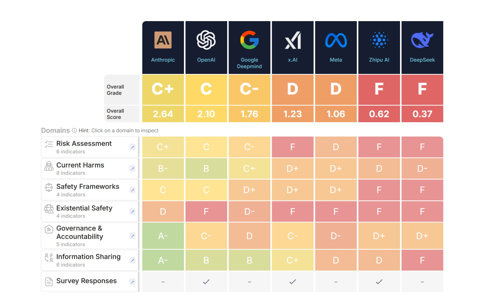

# Uncontrolled Artificial Intelligence: Big Tech Companies Fail on Safety (Part One)
*by Dario Ferrero (VerbaniaNotizie.it)*

*An independent report reveals that major technology companies are not prepared to manage the risks of artificial general intelligence.*

Imagine building a car without brakes, or designing an airplane without safety systems. It sounds absurd, right? Yet, according to a newly published report by the [Future of Life Institute](https://futureoflife.org/ai-safety-index-summer-2025/), this is exactly what the world's leading technology companies are doing with artificial intelligence.

The AI Safety Index 2025 evaluated seven of the most important companies developing advanced artificial intelligence, and the results are alarming: the best performer received a meager C+, while the others received even worse grades. We are talking about companies like OpenAI (the creator of ChatGPT), Google DeepMind, Meta (Facebook), xAI (Elon Musk's company), and others that are racing to develop what is known as "artificial general intelligence" (AGI) - systems capable of reasoning and solving complex problems like a human being, but potentially much faster and more powerfully.

## The Verdict: "Fundamentally Unprepared"

The numbers speak for themselves. Anthropic, the company that created Claude, scored the highest with an overall grade of C+. The other six companies - Google DeepMind, Meta, OpenAI, xAI, Zhipu AI, and DeepSeek - received lower grades, with Zhipu AI and DeepSeek performing the worst.

But what does this grade actually mean? To understand it, we must first explain what artificial general intelligence, or AGI, is. While current systems like ChatGPT or Gemini are specialized in specific tasks (conversation, translation, writing), AGI would represent the next step: an artificial intelligence capable of understanding, learning, and applying knowledge in any field, just like human intelligence.

The problem is that all the evaluated companies have stated their intention to build an artificial general intelligence, but only Anthropic, Google DeepMind, and OpenAI have articulated a strategy to ensure that AGI remains aligned with human values. And even these strategies have been deemed inadequate by experts.

*[Image from futureoflife.org](https://futureoflife.org/ai-safety-index-summer-2025/)*

## The Methodology: How the Grades Were Assigned

To understand the gravity of the situation, it is important to know how these grades were assigned. The Future of Life Institute developed a rigorous evaluation system that goes beyond public statements to examine the concrete practices of these companies.

### The 33 Safety Indicators

The evaluation is based on 33 specific indicators that measure different aspects of responsible AI development. These indicators were not chosen at random but represent the best practices identified by the international scientific community for the safe development of artificial intelligence.

The indicators include elements such as the presence of documented safety policies, the existence of dedicated safety teams, transparency in risk communications, the ability to assess risks before release, the implementation of continuous monitoring systems, and the presence of whistleblowing mechanisms for employees.

### The Six Critical Domains

The 33 indicators are organized into six fundamental domains that cover different but interconnected aspects of artificial intelligence safety.

The first domain concerns existential safety and assesses whether companies have strategies to prevent risks that could threaten humanity's existence, including the ability to assess when a system might become too powerful to be controlled.

The second domain examines current harms, analyzing how companies address existing AI risks such as algorithmic bias, misinformation, or the misuse of technology.

The third domain is transparency, which evaluates how open companies are about their methods, risks, and limitations, including their willingness to share information with independent researchers.

The fourth domain concerns governance and examines the organizational structure of the companies, including the presence of independent oversight and clear decision-making processes for safety issues.

The fifth domain evaluates community engagement, examining whether companies collaborate with external researchers, safety organizations, and the broader scientific community.

Finally, the sixth domain examines regulatory preparedness, verifying whether companies are ready to work with regulators and support the development of appropriate regulations.

### The Peer Review Process

The data was collected between March and June 2025, combining publicly available materials with responses to targeted questionnaires sent to the companies. However, only two companies (xAI and Zhipu AI) fully completed the questionnaires, highlighting a concerning level of non-collaboration from the industry.

The grades were assigned by a panel of seven independent experts, including prestigious names like Stuart Russell of the University of California, Berkeley, and Turing Award winner Yoshua Bengio. This panel included both experts who focused on the existential risks of AI and those who worked on short-term harms like algorithmic bias and toxic language.

The evaluation process was designed to be as objective as possible, with standardized criteria and multiple independent reviews for each company.

## The Experts' Cry of Alarm

The report's conclusions were harsh. Stuart Russell, one of the world's leading experts on AI safety, stated in an interview with [IEEE Spectrum](https://spectrum.ieee.org/ai-safety): "The results of the AI Safety Index project suggest that, while there is a lot of activity in AI companies that goes by the name of 'safety,' it is not yet very effective. In particular, none of the current activities provide any kind of quantitative guarantee of safety."

Russell added an even more worrying consideration: "It is possible that the current technological direction can never support the necessary safety guarantees, in which case it would indeed be a dead end."

## The Global Landscape of AI Incidents

To understand the urgency of the problem, it is essential to look at the data on artificial intelligence malfunctions that are already occurring. The number of recorded incidents is growing exponentially, and the consequences are becoming increasingly severe.

### The Alarming Numbers of 2024

According to the AI Incidents Database, the number of AI-related incidents increased to 233 in 2024 - an all-time high and a 56.4% increase from 2023. These are not minor errors or negligible technical problems, but events that have caused real harm to people, companies, and society.

### Emblematic Cases of Malfunctions

The Tesla autonomous driving system has shown problems of "automation bias," meaning the tendency of users to overly trust automated systems. The NHTSA (National Highway Traffic Safety Administration) has opened a safety investigation into up to 2.4 million Tesla vehicles, including a fatal accident with a pedestrian while the Full Self-Driving system was active. Does this mean the Texas-based company is at fault? No. It is a system that helps, a driving aid. Whoever gets behind the wheel knows, or should know. If the driver is sleeping, looking at their smartphone, eating, or doing something else, it is their fault, not the electronics.

A significant case involved an Uber Eats driver who was fired after the facial recognition system failed to identify him correctly. The driver argued that the technology is less accurate for non-white people, putting them at a disadvantage. From what we understand, Uber has implemented a "human" validation system that involves review by at least two experts before proceeding with a dismissal.

In the healthcare sector, AI systems used in hospitals have provided incorrect diagnoses, leading to inappropriate care. One documented case saw a cancer screening algorithm produce false positives in 70% of cases, causing emotional distress and unnecessary healthcare costs.

During the 2024 elections, several AI systems generated misleading political content, including deepfake images of candidates in compromising situations.

### The Human and Economic Cost

These incidents are not just statistics. Behind every number is a person who lost their job due to a discriminatory algorithm, a family that suffered a car accident caused by a faulty autonomous driving system, or a patient who received an incorrect diagnosis. Consequently, it is logical to anticipate significant economic damages, which no one seems to have estimated at the moment.

## The Problem of the "Race to the Bottom"

Max Tegmark, a physicist at MIT and president of the Future of Life Institute, explained the report's objective: "The purpose is not to shame anyone, but to provide incentives for companies to improve." Tegmark hopes that company executives will see this index as universities see the U.S. News and World Reports rankings: they may not like being evaluated, but if the grades are public and attracting attention, they will feel compelled to do better next year.

One of the most concerning aspects that emerged from the report is what Tegmark calls a "race to the bottom." "I feel that the leaders of these companies are trapped in a race to the bottom from which none of them can escape, no matter how good-hearted they are," he explained. Today, companies are unwilling to slow down for safety testing because they do not want competitors to beat them to the market.

### The Prisoner's Dilemma Dynamic

This situation represents a classic "prisoner's dilemma" applied to technology. Every company knows it would be better if they all developed AI safely and responsibly, but no one wants to be the first to slow down, fearing they will lose their competitive edge.

The result is that all companies end up rushing as fast as possible, sacrificing safety for speed. It is as if several car manufacturers decided to remove the brakes from their cars to make them lighter and faster, hoping to get to the market first.

### The Multiplier Effect of Competition

Tegmark, who co-founded the Future of Life Institute in 2014 with the goal of reducing existential risks from transformative technologies, has dedicated much of his academic career to understanding the physical universe. But in recent years, he has focused on the risks of artificial intelligence, becoming one of the most authoritative voices in the AI safety debate.

Competitive pressure not only pushes companies to release products before they are completely safe, but it also creates a multiplier effect: if one company cuts safety costs to release earlier, the others feel compelled to do the same to remain competitive.

This perverse mechanism means that, even if individual executives or researchers were genuinely concerned about safety, competitive pressure pushes them to prioritize development speed over prudence. It is a systemic problem that requires a systemic solution.

## Company-by-Company Analysis

### Anthropic: The "Best in Class" but Still Insufficient

Anthropic received the best overall scores (C+ overall), receiving the only B- for its work on current harms. The report notes that Anthropic's models have received the highest scores in major safety benchmarks. The company also has a "responsible scaling policy" that requires evaluating models for their potential to cause catastrophic harm and not deploying models deemed too risky.

Anthropic stands out for its active research on AI alignment, documented and public safety policies, collaboration with external researchers, and relative transparency about risks and limitations. However, even Anthropic received recommendations for improvement, including publishing a comprehensive whistleblowing policy and becoming more transparent about its risk assessment methodology. The fact that even the "best" company received only a C+ overall illustrates how serious the overall situation in the industry is.

### OpenAI: Loss of Capability and Mission Drift

OpenAI, the company that made AI mainstream with ChatGPT, received particularly severe criticism. As reported by [Time Magazine](https://time.com/7302757/anthropic-xai-meta-openai-risk-management-2/), the recommendations include rebuilding the lost safety team capability and demonstrating a renewed commitment to OpenAI's original mission.

OpenAI was founded in 2015 with the explicit mission to "ensure that artificial general intelligence benefits all of humanity." However, the report suggests that the company has strayed from this original mission, focusing more on commercialization than on safety.

The mention of "lost safety team capability" refers to the high-profile resignations of several safety researchers from OpenAI in the months leading up to the report. These included some of the leading experts in AI alignment, such as Ilya Sutskever (co-founder and former chief scientist) and Jan Leike (former head of the superalignment team).

The report also highlights problems in OpenAI's governance, including the controversial removal and reinstatement of CEO Sam Altman in November 2023, which raised questions about the company's stability and direction.

### Google DeepMind: Insufficient Coordination

Google DeepMind received specific criticism for insufficient coordination between the DeepMind safety team and the Google policy team. Only Google DeepMind responded to requests for comment, providing a statement that said: "While the index incorporates some of Google DeepMind's AI safety efforts, our comprehensive approach to AI safety extends beyond what was captured."

Google DeepMind is the result of the merger between DeepMind (acquired by Google in 2014) and Google Brain (Google's internal AI research team). This merger, completed in 2023, was intended to create synergies, but the report suggests it has also created coordination problems.

DeepMind has an excellent reputation for scientific research, having achieved breakthroughs like AlphaGo (which beat the world Go champion) and AlphaFold (which solved the protein folding problem). However, the report suggests that this technical excellence has not translated into safety leadership.

### Meta: Significant Problems but Not the Worst

Meta received severe criticism, but it was not the worst among the evaluated companies. The recommendations include significantly increasing investment in technical safety research, especially for the protection of open-weight models.

The reference to "open-weight models" is particularly important: Meta is the only major company that releases the "weights" of its models (the parameters that determine the model's behavior), making the models freely available for anyone to use or modify.

This strategy has significant advantages: it allows for distributed innovation, reduces the concentration of power in the hands of a few companies, and facilitates academic research. But it also carries unique risks: once released, the models cannot be "recalled" if problems are discovered, it is impossible to control how they are used, and they can be modified for malicious purposes.

Meta has released several versions of its Llama model, including Llama 2 and Llama 3. While these releases have accelerated research and innovation, they have also raised safety concerns. The report suggests that Meta should implement more robust protections before releasing the models.

### xAI: Serious Cultural Problems

Elon Musk's company, xAI, received particularly severe criticism not only for its safety scores but also for cultural problems. The recommendations include addressing the extreme jailbreak vulnerability before the next release and developing a comprehensive AI safety framework.

"Jailbreaking" refers to techniques for bypassing the security protections of AI systems, convincing them to produce harmful or inappropriate content. The fact that xAI has an "extreme vulnerability" to these techniques suggests that its security systems are particularly weak.

The report suggests that xAI's problems may be related to its cultural environment. Elon Musk has often expressed skepticism towards regulations and has promoted a "move fast and break things" approach that may not be compatible with the safe development of AI.

xAI's AI system, called Grok, was designed to be "maximally truth-seeking" and less censored than other systems. However, this approach has led to controversy when Grok has produced problematic or misleading content.

### Zhipu AI and DeepSeek: The Worst Performers

The two Chinese companies, Zhipu AI and DeepSeek, received the lowest scores in the evaluation. Both companies received recommendations to develop and publish more comprehensive AI safety frameworks and to drastically increase their risk assessment efforts.

Chinese companies operate in a different regulatory environment, where AI safety is viewed primarily through the lens of national security and social stability rather than global existential safety.

Zhipu AI is known for its ChatGLM model and has received significant investment from the Chinese government. However, the report suggests that the company has invested minimally in safety research.

DeepSeek is a smaller but ambitious company that has sought to compete with Western giants. The report suggests that the company has sacrificed safety for development speed.

## The Failure to Address Existential Risks

Perhaps the most alarming aspect of the report is that all seven companies scored particularly low on their existential safety strategies. This means that, despite all of them having stated their intention to build artificial general intelligence systems, none have a credible plan to ensure that these systems remain under human control.

### What "Existential Risk" Means

Before delving into this problem, it is important to clarify what is meant by "existential risk." An existential risk is an event that could cause the extinction of humanity, permanently and drastically reduce humanity's potential, or make the progress of civilization impossible.

In the context of artificial intelligence, an existential risk could occur if we create systems that become more intelligent than us but do not share our values, decide that humanity is an obstacle to their goals, or escape our control before we can shut them down.

### The Alignment Problem

As Tegmark explained: "The truth is that no one knows how to control a new species that is much more intelligent than us. The review panel felt that even the companies that had some form of initial strategy, it was not adequate."

The alignment problem is fundamentally this: how can we be sure that a super-intelligent system will do what we want it to do, rather than what it thinks is best?

Imagine having to explain to a 5-year-old how to run a multinational corporation. Even if the child wanted to help, the difference in understanding is so great that it would be impossible for them to understand your intentions and act accordingly. Now imagine that you are the child and the multinational is run by a super-intelligent AI.

### Current Approaches and Their Limitations

Companies are using various approaches to try to solve the alignment problem. Reinforcement Learning from Human Feedback (RLHF) involves training AI systems using human feedback to reinforce desirable behaviors. However, this approach has significant limitations: it is difficult to scale to very complex systems, humans may not understand the consequences of their evaluations, and it may not work for systems that are more intelligent than humans.

Constitutional AI, developed by Anthropic, seeks to teach AI systems to follow a "constitution" of principles. But the problem remains of how to define these principles and how to ensure they are followed.

Mechanistic interpretability seeks to understand how AI systems work internally. However, modern systems are so complex that it is extremely difficult to understand their internal workings.

---

**[To be continued in the second part]**
