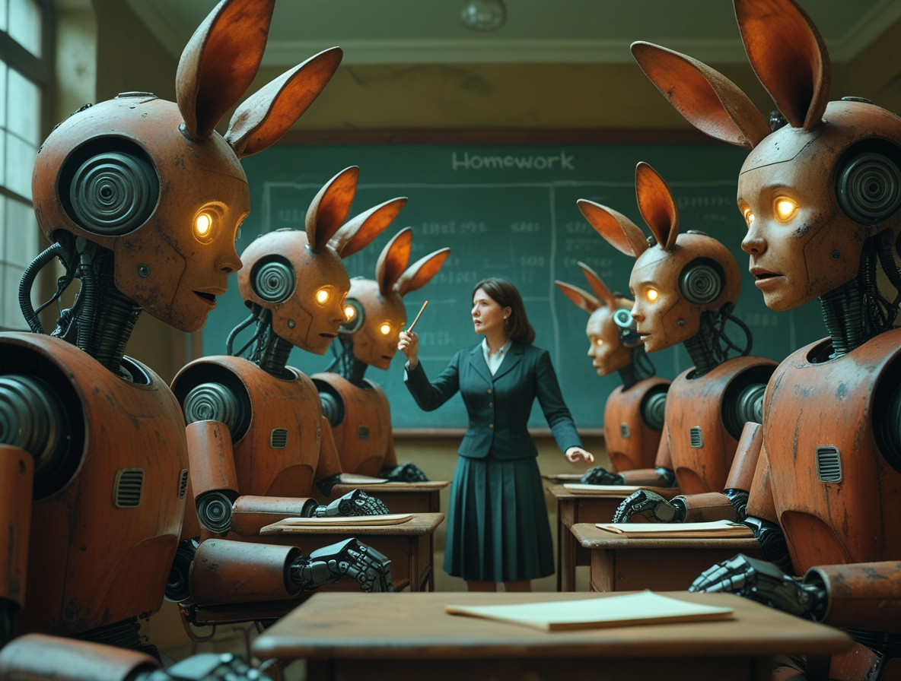
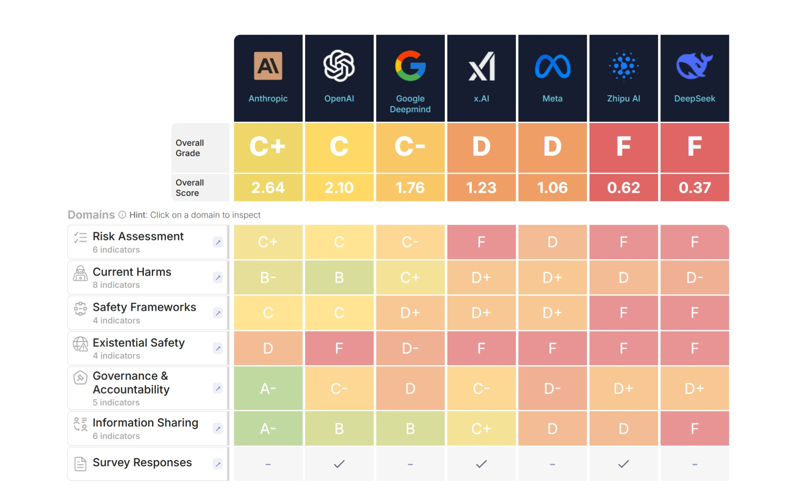

# Inteligencia Artificial sin Control: Las Grandes Empresas Tecnológicas Reprueban en Seguridad (Primera Parte)
*por Dario Ferrero (VerbaniaNotizie.it)*

*Un informe independiente revela que las principales empresas tecnológicas no están preparadas para gestionar los riesgos de la inteligencia artificial general.*

Imagina construir un coche sin frenos, o diseñar un avión sin sistemas de seguridad. Suena absurdo, ¿verdad? Sin embargo, según un informe recién publicado por el [Future of Life Institute](https://futureoflife.org/ai-safety-index-summer-2025/), esto es exactamente lo que las principales empresas tecnológicas del mundo están haciendo con la inteligencia artificial.

El AI Safety Index 2025 evaluó a siete de las empresas más importantes que desarrollan inteligencia artificial avanzada, y los resultados son alarmantes: la mejor calificada obtuvo una mísera C+, mientras que las demás recibieron calificaciones aún peores. Estamos hablando de empresas como OpenAI (la creadora de ChatGPT), Google DeepMind, Meta (Facebook), xAI (la empresa de Elon Musk) y otras que compiten por desarrollar lo que se conoce como "inteligencia artificial general" (AGI), sistemas capaces de razonar y resolver problemas complejos como lo haría un ser humano, pero potencialmente mucho más rápido y con más potencia.

## El Veredicto: "Fundamentalmente no Preparadas"

Los números hablan por sí solos. Anthropic, la empresa que creó Claude, obtuvo la puntuación más alta con una calificación general de C+. Las otras seis empresas —Google DeepMind, Meta, OpenAI, xAI, Zhipu AI y DeepSeek— recibieron calificaciones inferiores, siendo Zhipu AI y DeepSeek las que obtuvieron los peores resultados.

Pero, ¿qué significa realmente esta calificación? Para entenderlo, primero debemos explicar qué es la inteligencia artificial general, o AGI. Mientras que los sistemas actuales como ChatGPT o Gemini están especializados en tareas específicas (conversación, traducción, escritura), la AGI representaría el siguiente paso: una inteligencia artificial capaz de comprender, aprender y aplicar el conocimiento en cualquier campo, al igual que la inteligencia humana.

El problema es que todas las empresas evaluadas han declarado su intención de construir una inteligencia artificial general, pero solo Anthropic, Google DeepMind y OpenAI han articulado una estrategia para garantizar que la AGI se mantenga alineada con los valores humanos. E incluso estas estrategias han sido consideradas inadecuadas por los expertos.

*[Imagen de futureoflife.org](https://futureoflife.org/ai-safety-index-summer-2025/)*

## La Metodología: Cómo se Asignaron las Calificaciones

Para comprender la gravedad de la situación, es importante saber cómo se asignaron estas calificaciones. El Future of Life Institute desarrolló un riguroso sistema de evaluación que va más allá de las declaraciones públicas para examinar las prácticas concretas de estas empresas.

### Los 33 Indicadores de Seguridad

La evaluación se basa en 33 indicadores específicos que miden diferentes aspectos del desarrollo responsable de la IA. Estos indicadores no fueron elegidos al azar, sino que representan las mejores prácticas identificadas por la comunidad científica internacional para el desarrollo seguro de la inteligencia artificial.

Los indicadores incluyen elementos como la presencia de políticas de seguridad documentadas, la existencia de equipos de seguridad dedicados, la transparencia en las comunicaciones de riesgos, la capacidad de evaluar los riesgos antes del lanzamiento, la implementación de sistemas de monitoreo continuo y la presencia de mecanismos de denuncia para los empleados.

### Los Seis Dominios Críticos

Los 33 indicadores se organizan en seis dominios fundamentales que cubren aspectos diferentes pero interconectados de la seguridad de la inteligencia artificial.

El primer dominio se refiere a la seguridad existencial y evalúa si las empresas tienen estrategias para prevenir riesgos que podrían amenazar la existencia de la humanidad, incluida la capacidad de evaluar cuándo un sistema podría volverse demasiado poderoso para ser controlado.

El segundo dominio examina los daños actuales, analizando cómo las empresas abordan los riesgos de la IA existentes, como el sesgo algorítmico, la desinformación o el uso indebido de la tecnología.

El tercer dominio es la transparencia, que evalúa cuán abiertas son las empresas sobre sus métodos, riesgos y limitaciones, incluida su disposición a compartir información con investigadores independientes.

El cuarto dominio se refiere a la gobernanza y examina la estructura organizativa de las empresas, incluida la presencia de supervisión independiente y procesos de toma de decisiones claros para cuestiones de seguridad.

El quinto dominio evalúa la participación de la comunidad, examinando si las empresas colaboran con investigadores externos, organizaciones de seguridad y la comunidad científica en general.

Finalmente, el sexto dominio examina la preparación regulatoria, verificando si las empresas están listas para trabajar con los reguladores y si apoyan el desarrollo de regulaciones apropiadas.

### El Proceso de Revisión por Pares

Los datos se recopilaron entre marzo y junio de 2025, combinando materiales disponibles públicamente con respuestas a cuestionarios específicos enviados a las empresas. Sin embargo, solo dos empresas (xAI y Zhipu AI) completaron los cuestionarios en su totalidad, lo que pone de manifiesto un preocupante nivel de falta de colaboración por parte de la industria.

Las calificaciones fueron asignadas por un panel de siete expertos independientes, que incluía nombres de prestigio como Stuart Russell de la Universidad de California, Berkeley, y el ganador del Premio Turing, Yoshua Bengio. Este panel incluía tanto a expertos que se centraron en los riesgos existenciales de la IA como a aquellos que trabajaron en daños a corto plazo como el sesgo algorítmico y el lenguaje tóxico.

El proceso de evaluación fue diseñado para ser lo más objetivo posible, con criterios estandarizados y múltiples revisiones independientes para cada empresa.

## El Grito de Alarma de los Expertos

Las conclusiones del informe fueron duras. Stuart Russell, uno de los principales expertos mundiales en seguridad de la IA, declaró en una entrevista con [IEEE Spectrum](https://spectrum.ieee.org/ai-safety): "Los resultados del proyecto AI Safety Index sugieren que, si bien hay mucha actividad en las empresas de IA bajo el nombre de 'seguridad', todavía no es muy efectiva. En particular, ninguna de las actividades actuales proporciona ningún tipo de garantía cuantitativa de seguridad".

Russell añadió una consideración aún más preocupante: "Es posible que la dirección tecnológica actual nunca pueda soportar las garantías de seguridad necesarias, en cuyo caso sería un callejón sin salida".

## El Panorama Global de los Incidentes de IA

Para comprender la urgencia del problema, es esencial observar los datos sobre los fallos de la inteligencia artificial que ya están ocurriendo. El número de incidentes registrados está creciendo exponencialmente, y las consecuencias son cada vez más graves.

### Las Cifras Alarmantes de 2024

Según la Base de Datos de Incidentes de IA, el número de incidentes relacionados con la IA aumentó a 233 en 2024, un máximo histórico y un aumento del 56,4 % con respecto a 2023. No se trata de errores menores o problemas técnicos insignificantes, sino de eventos que han causado un daño real a personas, empresas y la sociedad.

### Casos Emblemáticos de Fallos

El sistema de conducción autónoma de Tesla ha mostrado problemas de "sesgo de automatización", es decir, la tendencia de los usuarios a confiar excesivamente en los sistemas automatizados. La NHTSA (Administración Nacional de Seguridad del Tráfico en las Carreteras) ha abierto una investigación de seguridad sobre hasta 2,4 millones de vehículos de Tesla, incluido un accidente mortal con un peatón mientras el sistema de Conducción Autónoma Total estaba activo. ¿Significa esto que la empresa con sede en Texas es culpable? No. Es un sistema que ayuda, una ayuda a la conducción. Quien se pone al volante lo sabe, o debería saberlo. Si el conductor está durmiendo, mirando su teléfono, comiendo o haciendo otra cosa, es su culpa, no de la electrónica.

Un caso significativo involucró a un conductor de Uber Eats que fue despedido después de que el sistema de reconocimiento facial no lo identificara correctamente. El conductor argumentó que la tecnología es menos precisa para las personas no blancas, lo que las pone en desventaja. Por lo que sabemos, Uber ha implementado un sistema de validación "humano" que implica la revisión por parte de al menos dos expertos antes de proceder con un despido.

En el sector de la salud, los sistemas de IA utilizados en los hospitales han proporcionado diagnósticos incorrectos, lo que ha llevado a una atención inadecuada. Un caso documentado mostró que un algoritmo de detección de cáncer produjo falsos positivos en el 70 % de los casos, causando angustia emocional y costes sanitarios innecesarios.

Durante las elecciones de 2024, varios sistemas de IA generaron contenido político engañoso, incluidas imágenes deepfake de candidatos en situaciones comprometedoras.

### El Costo Humano y Económico

Estos incidentes no son solo estadísticas. Detrás de cada número hay una persona que perdió su trabajo debido a un algoritmo discriminatorio, una familia que sufrió un accidente de tráfico causado por un sistema de conducción autónoma defectuoso o un paciente que recibió un diagnóstico incorrecto. En consecuencia, es lógico prever daños económicos significativos, que nadie parece haber estimado por el momento.

## El Problema de la "Carrera hacia el Abismo"

Max Tegmark, físico del MIT y presidente del Future of Life Institute, explicó el objetivo del informe: "El propósito no es avergonzar a nadie, sino proporcionar incentivos para que las empresas mejoren". Tegmark espera que los ejecutivos de las empresas vean este índice como las universidades ven las clasificaciones de U.S. News and World Reports: puede que no les guste ser evaluados, pero si las calificaciones son públicas y llaman la atención, se sentirán obligados a hacerlo mejor el próximo año.

Uno de los aspectos más preocupantes que surgieron del informe es lo que Tegmark llama una "carrera hacia el abismo". "Siento que los líderes de estas empresas están atrapados en una carrera hacia el abismo de la que ninguno de ellos puede escapar, sin importar cuán bien intencionados sean", explicó. Hoy en día, las empresas no están dispuestas a ralentizar las pruebas de seguridad porque no quieren que los competidores les ganen en el mercado.

### La Dinámica del Dilema del Prisionero

Esta situación representa un clásico "dilema del prisionero" aplicado a la tecnología. Todas las empresas saben que sería mejor si todas desarrollaran la IA de forma segura y responsable, pero ninguna quiere ser la primera en ralentizar, por temor a perder su ventaja competitiva.

El resultado es que todas las empresas terminan corriendo lo más rápido posible, sacrificando la seguridad por la velocidad. Es como si varios fabricantes de automóviles decidieran eliminar los frenos de sus coches para hacerlos más ligeros y rápidos, con la esperanza de llegar primero al mercado.

### El Efecto Multiplicador de la Competencia

Tegmark, cofundador del Future of Life Institute en 2014 con el objetivo de reducir los riesgos existenciales de las tecnologías transformadoras, ha dedicado gran parte de su carrera académica a comprender el universo físico. Pero en los últimos años, se ha centrado en los riesgos de la inteligencia artificial, convirtiéndose en una de las voces más autorizadas en el debate sobre la seguridad de la IA.

La presión competitiva no solo empuja a las empresas a lanzar productos antes de que sean completamente seguros, sino que también crea un efecto multiplicador: si una empresa recorta los costes de seguridad para lanzar antes, las demás se sienten obligadas a hacer lo mismo para seguir siendo competitivas.

Este mecanismo perverso significa que, aunque los ejecutivos o investigadores individuales estuvieran genuinamente preocupados por la seguridad, la presión competitiva los empuja a priorizar la velocidad de desarrollo sobre la prudencia. Es un problema sistémico que requiere una solución sistémica.

## Análisis Empresa por Empresa

### Anthropic: El "Mejor de la Clase" pero Aún Insuficiente

Anthropic recibió las mejores puntuaciones generales (C+ en general), recibiendo el único B- por su trabajo sobre los daños actuales. El informe señala que los modelos de Anthropic han recibido las puntuaciones más altas en los principales puntos de referencia de seguridad. La empresa también tiene una "política de escalamiento responsable" que exige evaluar los modelos por su potencial para causar un daño catastrófico y no implementar modelos considerados demasiado arriesgados.

Anthropic se destaca por su investigación activa sobre la alineación de la IA, políticas de seguridad documentadas y públicas, colaboración con investigadores externos y una relativa transparencia sobre los riesgos y limitaciones. Sin embargo, incluso Anthropic recibió recomendaciones de mejora, como la publicación de una política integral de denuncia de irregularidades y una mayor transparencia sobre su metodología de evaluación de riesgos. El hecho de que incluso la "mejor" empresa solo haya recibido una C+ en general ilustra la gravedad de la situación general del sector.

### OpenAI: Pérdida de Capacidad y Deriva de la Misión

OpenAI, la empresa que popularizó la IA con ChatGPT, recibió críticas particularmente severas. Según lo informado por [Time Magazine](https://time.com/7302757/anthropic-xai-meta-openai-risk-management-2/), las recomendaciones incluyen reconstruir la capacidad perdida del equipo de seguridad y demostrar un compromiso renovado con la misión original de OpenAI.

OpenAI fue fundada en 2015 con la misión explícita de "garantizar que la inteligencia artificial general beneficie a toda la humanidad". Sin embargo, el informe sugiere que la empresa se ha desviado de esta misión original, centrándose más en la comercialización que en la seguridad.

La mención de la "capacidad perdida del equipo de seguridad" se refiere a las renuncias de alto perfil de varios investigadores de seguridad de OpenAI en los meses previos al informe. Entre ellos se encontraban algunos de los principales expertos en alineación de la IA, como Ilya Sutskever (cofundador y ex científico jefe) y Jan Leike (ex jefe del equipo de superalineación).

El informe también destaca problemas en la gobernanza de OpenAI, incluida la controvertida destitución y reincorporación del CEO Sam Altman en noviembre de 2023, que planteó dudas sobre la estabilidad y la dirección de la empresa.

### Google DeepMind: Coordinación Insuficiente

Google DeepMind recibió críticas específicas por la insuficiente coordinación entre el equipo de seguridad de DeepMind y el equipo de políticas de Google. Solo Google DeepMind respondió a las solicitudes de comentarios, proporcionando una declaración que decía: "Si bien el índice incorpora algunos de los esfuerzos de seguridad de la IA de Google DeepMind, nuestro enfoque integral de la seguridad de la IA se extiende más allá de lo que se capturó".

Google DeepMind es el resultado de la fusión entre DeepMind (adquirida por Google en 2014) y Google Brain (el equipo de investigación de IA interno de Google). Esta fusión, completada en 2023, tenía la intención de crear sinergias, pero el informe sugiere que también ha creado problemas de coordinación.

DeepMind tiene una excelente reputación en investigación científica, habiendo logrado avances como AlphaGo (que venció al campeón mundial de Go) y AlphaFold (que resolvió el problema del plegamiento de proteínas). Sin embargo, el informe sugiere que esta excelencia técnica no se ha traducido en un liderazgo en seguridad.

### Meta: Problemas Significativos pero no el Peor

Meta recibió críticas severas, but no fue la peor entre las empresas evaluadas. Las recomendaciones incluyen aumentar significativamente la inversión en investigación de seguridad técnica, especialmente para la protección de los modelos de peso abierto.

La referencia a los "modelos de peso abierto" es particularmente importante: Meta es la única gran empresa que publica los "pesos" de sus modelos (los parámetros que determinan el comportamiento del modelo), lo que hace que los modelos estén disponibles gratuitamente para que cualquiera los use o modifique.

Esta estrategia tiene ventajas significativas: permite la innovación distribuida, reduce la concentración de poder en manos de unas pocas empresas y facilita la investigación académica. Pero también conlleva riesgos únicos: una vez publicados, los modelos no se pueden "retirar" si se descubren problemas, es imposible controlar cómo se utilizan y se pueden modificar con fines maliciosos.

Meta ha lanzado varias versiones de su modelo Llama, incluidas Llama 2 y Llama 3. Si bien estos lanzamientos han acelerado la investigación y la innovación, también han generado preocupaciones sobre la seguridad. El informe sugiere que Meta debería implementar protecciones más sólidas antes de lanzar los modelos.

### xAI: Graves Problemas Culturales

La empresa de Elon Musk, xAI, recibió críticas particularmente severas no solo por sus puntuaciones de seguridad, sino también por problemas culturales. Las recomendaciones incluyen abordar la vulnerabilidad extrema al jailbreak antes del próximo lanzamiento y desarrollar un marco integral de seguridad de la IA.

El "jailbreaking" se refiere a las técnicas para eludir las protecciones de seguridad de los sistemas de IA, convenciéndolos de que produzcan contenido dañino o inapropiado. El hecho de que xAI tenga una "vulnerabilidad extrema" a estas técnicas sugiere que sus sistemas de seguridad son particularmente débiles.

El informe sugiere que los problemas de xAI pueden estar relacionados con su entorno cultural. Elon Musk a menudo ha expresado escepticismo hacia las regulaciones y ha promovido un enfoque de "moverse rápido y romper cosas" que puede no ser compatible con el desarrollo seguro de la IA.

El sistema de IA de xAI, llamado Grok, fue diseñado para ser "máximamente buscador de la verdad" y menos censurado que otros sistemas. Sin embargo, este enfoque ha generado controversia cuando Grok ha producido contenido problemático o engañoso.

### Zhipu AI y DeepSeek: Los Peores Resultados

Las dos empresas chinas, Zhipu AI y DeepSeek, recibieron las puntuaciones más bajas en la evaluación. Ambas empresas recibieron recomendaciones para desarrollar y publicar marcos de seguridad de la IA más completos y para aumentar drásticamente sus esfuerzos de evaluación de riesgos.

Las empresas chinas operan en un entorno regulatorio diferente, donde la seguridad de la IA se ve principalmente a través del prisma de la seguridad nacional y la estabilidad social en lugar de la seguridad existencial global.

Zhipu AI es conocida por su modelo ChatGLM y ha recibido una importante inversión del gobierno chino. Sin embargo, el informe sugiere que la empresa ha invertido mínimamente en investigación de seguridad.

DeepSeek es una empresa más pequeña pero ambiciosa que ha intentado competir con los gigantes occidentales. El informe sugiere que la empresa ha sacrificado la seguridad por la velocidad de desarrollo.

## El Fracaso en Abordar los Riesgos Existenciales

Quizás el aspecto más alarmante del informe es que las siete empresas obtuvieron puntuaciones particularmente bajas en sus estrategias de seguridad existencial. Esto significa que, a pesar de que todas han declarado su intención de construir sistemas de inteligencia artificial general, ninguna tiene un plan creíble para garantizar que estos sistemas permanezcan bajo control humano.

### ¿Qué Significa "Riesgo Existencial"?

Antes de profundizar en este problema, es importante aclarar qué se entiende por "riesgo existencial". Un riesgo existencial es un evento que podría causar la extinción de la humanidad, reducir permanente y drásticamente el potencial de la humanidad o imposibilitar el progreso de la civilización.

En el contexto de la inteligencia artificial, un riesgo existencial podría ocurrir si creamos sistemas que se vuelven más inteligentes que nosotros pero no comparten nuestros valores, deciden que la humanidad es un obstáculo para sus objetivos o escapan a nuestro control antes de que podamos apagarlos.

### El Problema de la Alineación

Como explicó Tegmark: "La verdad es que nadie sabe cómo controlar una nueva especie que es mucho más inteligente que nosotros. El panel de revisión consideró que incluso las empresas que tenían alguna forma de estrategia inicial, no era adecuada".

El problema de la alineación es fundamentalmente este: ¿cómo podemos estar seguros de que un sistema superinteligente hará lo que queremos que haga, en lugar de lo que cree que es mejor?

Imagina tener que explicarle a un niño de 5 años cómo dirigir una corporación multinacional. Incluso si el niño quisiera ayudar, la diferencia de comprensión es tan grande que le sería imposible entender tus intenciones y actuar en consecuencia. Ahora imagina que tú eres el niño y la multinacional está dirigida por una IA superinteligente.

### Enfoques Actuales y sus Limitaciones

Las empresas están utilizando varios enfoques para tratar de resolver el problema de la alineación. El Aprendizaje por Refuerzo a partir de la Retroalimentación Humana (RLHF) implica entrenar sistemas de IA utilizando la retroalimentación humana para reforzar comportamientos deseables. Sin embargo, este enfoque tiene limitaciones significativas: es difícil de escalar a sistemas muy complejos, los humanos pueden no comprender las consecuencias de sus evaluaciones y puede que no funcione para sistemas que son más inteligentes que los humanos.

La IA Constitucional, desarrollada por Anthropic, busca enseñar a los sistemas de IA a seguir una "constitución" de principios. Pero sigue existiendo el problema de cómo definir estos principios y cómo garantizar que se sigan.

La interpretabilidad mecanicista busca comprender cómo funcionan internamente los sistemas de IA. Sin embargo, los sistemas modernos son tan complejos que es extremadamente difícil comprender su funcionamiento interno.

---

**[Continuará en la segunda parte]**
