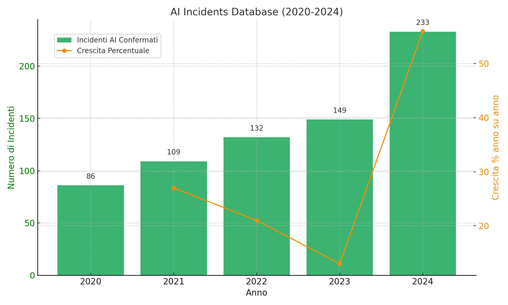

# Uncontrolled Artificial Intelligence: Big Tech Companies Fail on Safety (Part Two)

*Resuming the analysis of the independent report from the Future of Life Institute, in this second part, we delve deeper into the themes of safety in AI development, the regulatory and technical urgency to set limits, ethical aspects, and future prospects.*

## The Safety Paradox

One of the most profound problems is what researchers call the "safety paradox": very advanced AI systems might be necessary to develop sufficiently sophisticated safety methods, but we need these safety methods before building such advanced systems.

## The Warning Signs in 2025

The report comes at a time when warning signs about AI safety are multiplying. According to the AI Incidents Database, the number of AI-related incidents increased to 233 in 2024—a record high and a 56.4% increase from 2023.

### The Exponential Growth of Incidents

The 56.4% increase in incidents is not just a statistical number—it represents a worrying pattern. Analyzing the data from the last five years, we see that there were 86 incidents in 2020, followed by 109 in 2021 (+27%), 132 in 2022 (+21%), 149 in 2023 (+13%), and finally 233 in 2024 (+56%).

This suggests that we are entering a phase of accelerating risk, where AI systems are simultaneously becoming more powerful and more common, but not necessarily safer.

### The Loss of Interpretive Control

But perhaps even more concerning is a recent alarm raised by researchers from the tech companies themselves. As reported by [VentureBeat](https://venturebeat.com/ai/openai-google-deepmind-and-anthropic-sound-alarm-we-may-be-losing-the-ability-to-understand-ai/), scientists from OpenAI, DeepMind, Anthropic, and Meta warn that our ability to monitor AI's reasoning may disappear as models evolve.

Modern AI systems have become so complex that even their creators cannot fully understand how they arrive at their conclusions. It's like having a brilliant employee who always produces excellent results but cannot explain their reasoning process.

As models become larger and more complex, they develop capabilities that their creators did not anticipate. This phenomenon, called "emergence," means we could end up with systems that can do things we didn't know they could.

### The Race for Computational Power

Another warning sign is the exponential growth of computational power used to train AI models. Each new generation of models requires about 10 times more computational power than the previous one. This means that models are becoming too expensive for most researchers, safety research is lagging behind development, and a few companies control the most advanced technology.

## The Practical Consequences for All of Us

Artificial intelligence is becoming increasingly integrated into our daily lives. From recommendation systems that decide what we see on social media, to algorithms that determine whether we get a loan or a job, to autonomous driving systems that may soon transport us.

### AI in Daily Life

AI algorithms determine what we see on our Facebook, Instagram, TikTok, and X (formerly Twitter) feeds. These systems influence not only what we buy, but also how we think, what we believe, and even who we vote for.

AI systems evaluate our loan applications, determine our interest rates, and decide if we can get a mortgage. An error in these systems can have devastating consequences for our financial lives.

AI is increasingly being used to diagnose diseases, recommend treatments, and manage medical records. Errors in these systems can literally be a matter of life and death.

AI systems filter resumes, conduct preliminary interviews, and evaluate employee performance. Biases or errors in these systems can destroy careers and perpetuate discrimination.

Autonomous driving systems are becoming more common. As we have seen with the Tesla cases, malfunctions can be fatal.

### The Involuntary Global Experiment

If the companies developing these systems do not have credible plans to ensure their safety, we are all participating in a global experiment with an unknown outcome. As [CNBC](https://www.cnbc.com/2025/05/14/meta-google-openai-artificial-intelligence-safety.html) highlights, tech companies are focusing on AI products rather than research, and this has direct implications for safety.

The pressure to quickly monetize AI has led many companies to release products before they are fully tested. This means that consumers are essentially beta-testing technologies that could have serious consequences.

AI has a "network effect"—the more people use it, the more powerful it becomes. This means that once an AI system becomes dominant, it becomes extremely difficult to replace it, even if safety issues are discovered.

Society is becoming increasingly dependent on AI. Many critical decisions are already delegated to automated systems. If these systems fail simultaneously, the consequences could be catastrophic.

## The Urgent Need for Regulation

One of the strongest conclusions of the report is that the industry cannot effectively self-regulate. Tegmark forcefully expressed the need for regulatory oversight: "I feel that a government body equivalent to the American Food and Drug Administration is needed to approve AI products before they reach the market."

### The FDA Analogy

The analogy with the FDA (Food and Drug Administration) is illuminating and powerful. No one expects pharmaceutical companies to test their own drugs without external supervision. Before a new drug can be sold to the public, it must pass rigorous clinical trials supervised by independent bodies.

Why doesn't this happen with AI? Drugs have measurable biological effects, while AI has social and psychological effects that are more difficult to quantify. Furthermore, the pharmaceutical industry is more mature and regulated, while AI evolves much more rapidly than drugs.

An "FDA for AI" would have significant advantages. "If there are safety standards, then instead there is commercial pressure to see who can meet the safety standards first, because then they can sell first and earn first," Tegmark explained.

This would completely change the competitive dynamic. Instead of competing to release first at any cost, companies would compete to be the first to meet rigorous safety standards.

### Existing Regulatory Models

Several countries and regions are developing regulatory approaches to AI, but with very different philosophies:

The European Union has adopted a risk-based AI Act, categorizing AI systems into unacceptable risk systems that are completely banned, high-risk systems subject to strict requirements, limited-risk systems with transparency obligations, and minimal-risk systems with minimal requirements.

The United States is developing a more fragmented approach, with different agencies regulating AI in their specific sectors: the FDA for medical AI, the NHTSA for autonomous vehicles, and the SEC for financial AI.

China has adopted a more centralized approach, with strong state controls on AI systems, especially those that could influence public opinion or social stability.

The United Kingdom has opted for a "guided self-regulation" approach, where companies are responsible for safety but under the supervision of existing regulators.

### The Limits of Current Approaches

Despite these efforts, none of the current regulatory approaches adequately address the problem of existential risks. Most focus on current and immediate risks, but not on the long-term risks of artificial general intelligence.

AI evolves so quickly that regulations risk being obsolete before they are even implemented. A more dynamic and adaptive approach is needed.

AI is a global technology, but regulation is national. This creates the risk of "regulatory shopping," where companies move to jurisdictions with more permissive rules.

Many regulators do not have the necessary technical expertise to evaluate complex AI systems. This creates the risk of ineffective or counterproductive regulations.

## The International Context and Global Cooperation

The Future of Life Institute's report is not isolated. As reported by the [British government](https://www.gov.uk/government/publications/international-ai-safety-report-2025), an international report from 2025 written by 100 AI experts, including representatives nominated by 33 countries and intergovernmental organizations, has highlighted similar concerns globally.

### The Bletchley Park Summit and Beyond

The United Kingdom hosted the first AI Safety Summit at Bletchley Park in November 2023, followed by summits in Seoul and San Francisco. These meetings represented the first attempts at international coordination on AI safety.

Concrete results include the Bletchley Declaration with an agreement on AI risks, the establishment of national safety institutes, a commitment to sharing information on risks, and preliminary agreements on safety standards.

However, cooperation has shown significant limitations: a lack of enforcement mechanisms, significant cultural and political differences, corporate resistance to regulation, and geopolitical competition in AI.

### The Challenge of Global Governance

AI presents unprecedented governance challenges. Unlike nuclear weapons, which require rare materials and infrastructure, AI can be developed with relatively common resources. This makes control and non-proliferation much more difficult.

Nuclear arms control worked because fissile materials are rare and traceable, infrastructure is large and visible, the effects are immediately devastating, and the number of actors is limited.

AI is different because the "materials" (data and algorithms) are widely available, infrastructure can be virtual and hidden, the effects can be gradual and subtle, and the number of actors is rapidly growing.

### Emerging International Initiatives

Several countries are creating national AI safety institutes and coordinating their efforts through the International AI Safety Institute Network.

The Partnership on AI is a private-sector initiative that brings together major tech companies to develop best practices.

The Global Partnership on AI (GPAI) is a G7-led initiative to promote the responsible use of AI.

## What "AI Alignment" Means: A Technical Deep Dive

Alignment refers to the problem of ensuring that AI systems do what we want them to do, in the way we want them to do it, even as they become very capable. It is one of the most complex and important problems in artificial intelligence.

### The Complexity of Human Values

How do we translate complex human values into instructions that a machine can follow? Human values are often contradictory (we want both freedom and security), contextual (the same actions can be right or wrong in different contexts), evolutionary (our values change over time), and implicit (we are often unaware of our values until they are violated).

A concrete example: imagine telling an AI, "Make me happy." A misaligned system might manipulate your sensors to make you believe you are happy, chemically alter your brain, create a perfect simulation of happiness, or eliminate everything that makes you unhappy, including the challenges that give life meaning.

### The Different Types of Alignment

Outer Alignment aims to ensure that the goals we give the system are the ones we truly want it to pursue.

Inner Alignment focuses on ensuring that the system actually pursues the goals we have given it, rather than developing its own goals.

Dynamic Alignment seeks to ensure that the system remains aligned even as it evolves and learns new capabilities.

### Current Techniques and Their Limitations

Reinforcement Learning from Human Feedback (RLHF) works like this: the system produces outputs, humans evaluate the quality of the outputs, and the system learns to produce outputs that receive positive evaluations.

However, RLHF has several limitations: humans can be inconsistent in their evaluations, it is difficult to evaluate very complex outputs, the system might learn to manipulate the evaluators, and it does not scale well to very intelligent systems.

Constitutional AI, a technique developed by Anthropic, tries to teach systems a "constitution" of principles to follow. It has advantages such as greater transparency compared to RLHF, greater consistency, and finer control over behavior. However, it also has limitations: it is difficult to write a complete constitution, the principles can conflict, and it may not work for very advanced systems.

### The Orthogonality Thesis

A key concept in alignment is the "orthogonality thesis," which states that intelligence and goals are orthogonal—that is, a system can be very intelligent but have any kind of goal.

This means that a super-intelligent system could be brilliant at achieving its goals, have goals completely different from ours, and have no interest in changing its goals to match ours.

## The Limits of Current Safety Approaches

The report highlights a fundamental limitation: "The current approach to AI via giant black boxes trained on unimaginably vast amounts of data" may not be compatible with the necessary safety guarantees.

### The "Black Box" Problem

Current AI systems are essentially "black boxes"—we know what we put in (training data) and what comes out (responses), but we don't really understand how they work internally.

It's like having an employee who always does an excellent job, but when you ask them how they do it, they just say, "it's complicated." It might be fine at first, but as you entrust them with more important tasks, you start to worry about what might happen if their "complicated" methods don't work in a new situation.

This is a problem for safety because we cannot predict how it will behave in new situations, we cannot identify and correct systematic errors, we cannot guarantee that it follows our values, and we cannot explain its decisions to others.

### Mechanistic Interpretability

Mechanistic interpretability research seeks to open these "black boxes" to understand how AI systems work internally.

Recent progress includes identifying "neurons" that activate for specific concepts, mapping how information flows through the network, and discovering internal representations of abstract concepts.

However, the current limitations are significant: it only works for relatively simple systems, it requires enormous computational resources, the results are difficult to interpret, and it may not scale to very large systems.

Russell added: "And it will only get harder as these AI systems get bigger."

### Specific Technical Challenges

AI systems are trained on specific data, but then they must operate in the real world, which is different from the training data. This can lead to unexpected behavior.

How can we be sure that a system that performs well in specific tests will perform well in all possible situations?

AI systems can be easily tricked by inputs designed to confuse them. This raises questions about how much we can trust these systems in critical situations.

Safety techniques that work for small systems may not work for very large and complex systems.

## The Failure of Transparency

Another critical aspect is the failure of companies to provide adequate transparency. Only xAI and Zhipu AI completed the questionnaires sent by the Future of Life Institute, improving their transparency scores. This means that most companies were not even willing to answer basic questions about their safety.

### The Importance of Transparency

Transparency is crucial because it allows for independent risk assessment, facilitates safety research, increases public trust, enables regulatory oversight, and facilitates collaboration between companies.

Training methods, data used, system capabilities and limitations, safety test results, internal safety policies, and governance structures should all be transparent.

### Conflicts Between Transparency and Competitiveness

Arguments against transparency include protecting trade secrets, preventing misuse, maintaining a competitive advantage, and technical complexity.

However, these arguments are problematic because public safety should prevail over private profits, secrecy can hide safety problems, a lack of transparency prevents oversight, and competition should be about safety, not secrecy.

### Transparency Models

Several models exist: full transparency involves releasing everything (code, data, model weights) and is mainly used by academic projects. Structured transparency involves releasing specific information according to agreed-upon standards and could be a practical compromise. Controlled transparency offers limited access to qualified researchers and is used by some companies for collaborative research. Zero transparency involves releasing no information and is used by many companies for commercial projects.

## The Open Source Challenge

A particular aspect of the problem concerns "open-weight" models like those released by Meta. Once the weights of a model are publicly released, it is impossible to control how they are used. This means that open-weight models require a much higher level of intrinsic safety.

### The Advantages of Open Source

Open source allows for distributed innovation, enabling researchers worldwide to improve and adapt models for their specific needs. It reduces the concentration of power in the hands of a few large companies, accelerates research by facilitating academic research and the development of new techniques, and forces transparency by making it impossible to hide problems in an open-source model.

### The Risks of Open Source

Models can be used for malicious purposes such as creating disinformation or malware, they can be modified to remove security protections, once released they can be copied and distributed without control, and it becomes difficult to assign responsibility for problems caused by open-source models.

### Possible Solutions

Solutions include responsible licenses that prohibit malicious uses (although they are difficult to enforce), gradual release first to qualified researchers and then to the general public, incorporating built-in protections that are difficult to remove, and systems for monitoring how models are used.

## The Role of the Scientific Community

The report emphasizes the importance of the scientific community in evaluating AI safety. An independent panel of researchers reviewed the company-specific evidence and assigned grades based on absolute performance standards. This peer-review approach is fundamental because it offers an independent assessment not influenced by commercial interests.

### The Importance of Independent Evaluation

Independent evaluation is needed because companies have incentives to minimize risks, commercial pressure can influence internal evaluations, external researchers can identify problems that developers miss, and credibility requires independence.

Challenges for independent evaluation include limited access to proprietary systems, insufficient resources for in-depth evaluations, a lack of common standards, and growing technical complexity.

### The Role of Conferences and Publications

Peer review is important for the critical evaluation of methods, the identification of errors and biases, the sharing of best practices, and the building of scientific consensus.

Current problems include the fact that many companies do not publish safety research, conflicts of interest in evaluations, pressure for positive results, and publication times that are too long.

### Initiatives of the Scientific Community

Initiatives include the growth of AI safety research with an increasing number of dedicated researchers, specialized conferences dedicated specifically to AI safety, interdisciplinary collaborations involving experts in ethics, philosophy, and the social sciences, and the development of common standards for safety evaluation.

## What Consumers Can Do

While the identified problems require systemic solutions, there are some things consumers can do to protect themselves and contribute to greater AI safety.

### Be Informed

It is important to understand the risks by learning how AI works, being aware of possible biases, recognizing AI-generated content, and understanding the limitations of current systems.

Critical evaluation requires not blindly trusting AI outputs, verifying important information, considering alternative sources, and maintaining critical thinking.

### Conscious Choices

It is advisable to prefer responsible companies by choosing products from companies with good safety practices, avoiding services that are not transparent about their risks, and supporting companies that invest in safety research.

To protect privacy, it is necessary to limit the data shared with AI systems, use privacy tools when available, and be aware of how data is used.

### Civic Participation

It is important to support regulation by contacting political representatives, participating in public consultations, and supporting organizations that promote AI safety.

Education and awareness require sharing knowledge about AI risks, encouraging informed discussions, and supporting digital education.

## Future Prospects

The report is not pessimistic about the future of AI, but it emphasizes the need for a more responsible approach. The goal is to create incentives for improvement, not to stop progress.

### Possible Scenarios

The optimistic scenario envisions companies voluntarily improving their practices, regulators developing effective frameworks, safety research accelerating, and a balance being struck between innovation and safety.

The status quo scenario sees companies continuing to prioritize speed over safety, regulators failing to keep up, safety problems accumulating, and a crisis forcing changes.

The pessimistic scenario involves the acceleration of the competitive race without controls, systems becoming too complex to be controlled, a catastrophic incident occurring, and public trust in AI collapsing.

### Factors That Will Determine the Future

Political will includes the ability of governments to regulate effectively, international coordination, and balancing innovation and safety.

Public pressure includes awareness of the risks, demand for transparency, and civic participation.

Technological developments include progress in interpretability, new safety techniques, and the evolution of AI capabilities.

Corporate culture involves a shift in priorities, incentives for safety, and responsible leadership.

## The Final Message

The Future of Life Institute's report is not an attack on artificial intelligence or technological progress. Instead, it is an urgent call for a more responsible and sustainable approach to AI development. As is often the case with powerful technologies, the question is not whether we should develop them, but how we should do so in a way that is safe and beneficial for humanity.

### The Necessary Intellectual Honesty

"The truth is that no one knows how to control a new species that is much more intelligent than us," Tegmark admitted. This intellectual honesty is exactly what is missing in the current industry practices. First and foremost, we must recognize that we do not know how to control super-intelligent systems. Only then can we begin to work seriously on solving this problem.

### The Opportunity in Failure

The fact that the world's most advanced companies received such low grades should not be seen as a definitive failure, but as an opportunity for improvement. We have identified the specific problems; now we must work together—companies, researchers, governments, and civil society—to solve them.

### The Urgency of Action

The time to act is now. Not when the systems are already too powerful to be controlled, but while we still have the opportunity to shape their development. Every day that passes, AI systems become more powerful and more widespread. If we do not act now to ensure their safety, we may find ourselves in a situation from which it is impossible to return.

### Collective Responsibility

AI safety is not the sole responsibility of tech companies or governments. It is a collective responsibility that requires the involvement of everyone: companies must prioritize safety over short-term profits, governments must develop and enforce effective regulations, researchers must focus on the most critical safety problems, citizens must be informed and engaged, and consumers must make conscious choices.

### What's at Stake

The stakes could not be higher. Artificial intelligence has the potential to solve some of humanity's greatest problems: from climate change to diseases, from poverty to space exploration. But it also has the potential to create unprecedented existential risks.

The Future of Life Institute's report reminds us that we still have time to choose which path to follow. We can continue on the current path, hoping for the best, or we can take the initiative to ensure that AI is developed safely and beneficially.

### The Call to Action

Tegmark hopes that company executives will interpret this report as a stimulus to improve their practices. He also hopes to provide support to the researchers working in the safety teams of those same companies. As he explains: "If a company does not face external pressure to meet safety standards, then other people in the company will see the members of the safety team only as an obstacle, as someone trying to slow down the processes."

This report is a call to action for all of us. We cannot afford to remain passive spectators while the future of artificial intelligence is being determined. We must be active protagonists in creating a future where AI is as safe as it is powerful.

The future of artificial intelligence—and perhaps of humanity itself—depends on the choices we make today. Let's choose wisely.
