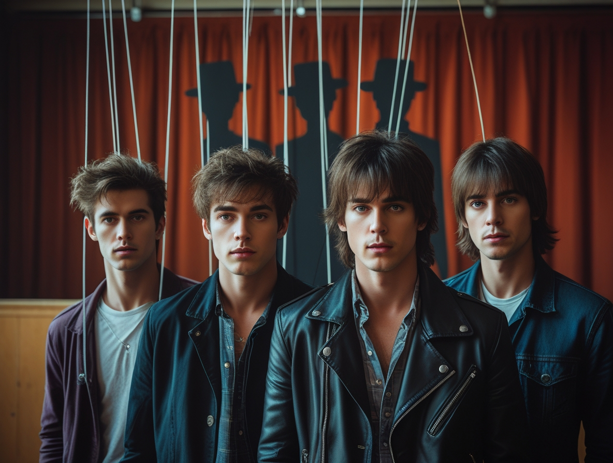
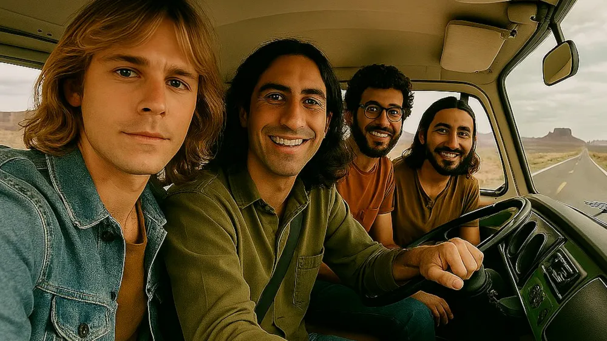

# Quand l'Intelligence Artificielle fait de la musique : le phénomène The Velvet Sundown et Iam entre technologie et éthique

*par Dario Ferrero (VerbaniaNotizie.it)*

*Imaginez découvrir que votre chanson préférée, celle qui vous a accompagné pendant des mois, que vous avez partagée avec des amis et qui a totalisé des millions d'écoutes, n'a jamais été jouée par des mains humaines. Il n'y a pas de chanteur qui l'a interprétée avec sa voix, pas de guitariste qui a trouvé ces accords parfaits, pas de musiciens qui se sont réunis en studio pour créer cette alchimie sonore. Tout est né d'algorithmes, de réseaux de neurones et d'intelligence artificielle.*

## L'introduction d'un nouveau paradigme

Bienvenue dans l'ère de la musique synthétique, où la frontière entre la créativité humaine et artificielle devient de plus en plus mince, et où deux cas emblématiques font débat dans le monde : The Velvet Sundown, le mystérieux groupe qui a conquis Spotify en cachant sa véritable nature, et Iam, la première chanteuse italienne entièrement générée par l'IA.

La révolution est silencieuse mais inarrêtable. Alors que nous débattons encore pour savoir si l'intelligence artificielle peut vraiment être créative, des millions de personnes écoutent déjà, partagent et tombent même amoureuses de morceaux entièrement créés par des machines. Le phénomène n'est plus confiné aux expériences de laboratoire ou aux curiosités technologiques : il est entré dans les classements, les playlists personnelles, la bande sonore de notre vie quotidienne. Et cela soulève des questions profondes qui vont bien au-delà de la simple innovation technologique. Que signifie être "authentique" dans l'art ? Une machine peut-elle exprimer des émotions et les transmettre à travers la musique ? Et surtout : sommes-nous prêts à redéfinir le concept même de créativité artistique ?

L'histoire de The Velvet Sundown et d'Iam représente bien plus que deux expériences technologiques réussies. Elles sont le symbole d'une transformation d'époque qui touche l'industrie musicale, avec des implications économiques, culturelles et éthiques. D'un côté, nous avons la démocratisation de la création musicale, de l'autre, le risque d'une standardisation qui pourrait appauvrir la diversité artistique. D'une part, la possibilité pour quiconque de donner vie à ses idées musicales sans des années d'étude d'instruments, d'autre part, la crainte que les musiciens professionnels puissent être progressivement remplacés par des algorithmes de plus en plus sophistiqués.

## Le phénomène The Velvet Sundown : quand l'IA conquiert Spotify

L'histoire de The Velvet Sundown commence comme un mystère digne d'un thriller technologique. Au début de 2024, ce groupe apparemment inconnu commence à publier des morceaux qui captent immédiatement l'attention des auditeurs. Le son est enveloppant, les mélodies accrocheuses, les textes profonds et évocateurs. En quelques mois, leurs chiffres sur Spotify augmentent de manière exponentielle, atteignant plus de 500 000 écoutes mensuelles et attirant l'attention des curateurs de playlists et des médias spécialisés.

Ce qui frappe initialement, c'est la qualité professionnelle des productions et la cohérence stylistique qui traverse tout leur catalogue. Les chansons semblent naître d'une vision artistique mature, avec des arrangements sophistiqués et une production soignée dans les moindres détails. Les fans commencent à former une communauté en ligne, discutant de la signification des textes et partageant des interprétations sur les réseaux sociaux. Personne ne soupçonne que derrière ces morceaux, il n'y a pas de musiciens en chair et en os.

La révélation arrive progressivement, à travers une stratégie de communication soigneusement orchestrée. D'abord les soupçons, puis des indices de plus en plus évidents, et enfin l'aveu complet : The Velvet Sundown est un projet entièrement basé sur l'intelligence artificielle, une "provocation artistique" qui a avoué être un projet musical synthétique guidé par une direction créative humaine. La technologie utilisée est principalement Suno AI, une plateforme qui "construit un avenir où n'importe qui peut faire de la grande musique. Aucun instrument n'est nécessaire, seulement de l'imagination".

*[Image tirée du profil Instagram thevelvetsundownband](https://www.instagram.com/thevelvetsundownband/)*

Le cas de The Velvet Sundown a fait école pour plusieurs raisons. Tout d'abord, il a démontré que la musique générée par l'IA peut rivaliser qualitativement avec celle produite par des artistes humains, du moins du point de vue de l'écoute occasionnelle. Suno, lancée en 2022 par d'anciens ingénieurs d'OpenAI, utilise des réseaux de neurones entraînés sur des millions de chansons de tous genres, permettant de créer des compositions qui respectent les conventions musicales tout en conservant des éléments d'originalité.

Mais l'aspect peut-être le plus intéressant du projet est sa dimension conceptuelle. Les créateurs ont transformé ce qui aurait pu être une simple expérience technologique en une réflexion artistique sur l'authenticité et la perception de la musique à l'ère numérique. Le groupe est devenu un "miroir" qui reflète nos préjugés et nos attentes concernant la créativité. Combien de ces 500 000 auditeurs mensuels auraient continué à apprécier la musique s'ils avaient su dès le début son origine artificielle ?

L'évolution de la stratégie de communication de The Velvet Sundown a été particulièrement raffinée. Initialement, lorsque des questions directes étaient posées sur la nature du projet, les responsables niaient ou éludaient le sujet de l'intelligence artificielle. Cette phase de "dissimulation" a duré assez longtemps pour permettre à la musique de trouver son public en se basant uniquement sur sa propre valeur intrinsèque. Ce n'est que lorsque la base d'écoutes s'est consolidée que la révélation est arrivée, accompagnée d'une réflexion plus large sur la signification de l'authenticité dans la musique contemporaine.

Le succès de The Velvet Sundown a également mis en évidence le potentiel créatif des outils d'IA musicale actuels. En mars 2024, Suno a lancé la version V3 pour tous les utilisateurs, permettant de créer des morceaux de 4 minutes avec des comptes gratuits, tandis que la version 4.5+ introduit des "outils de production audio professionnels jamais vus auparavant". Cette évolution technologique rapide rend la création de musique de qualité professionnelle de plus en plus accessible.

## Iam : la première chanteuse IA italienne

Parallèlement au phénomène international de The Velvet Sundown, l'Italie a vu naître son premier cas emblématique d'artiste musical entièrement artificiel. Iam, la chanteuse virtuelle créée par le réalisateur Claudio Zagarini en collaboration avec le collectif Artificial Intelligence Italian Creators (AIIC), représente une approche différente mais tout aussi significative de l'intégration de l'IA dans la musique.

Le projet Iam est né en avril 2025 avec un objectif ouvertement expérimental : créer non seulement de la musique artificielle, mais un véritable personnage public numérique. Contrairement à The Velvet Sundown, qui a maintenu un profil mystérieux, Iam a été présentée dès le début comme une artiste IA, avec des interviews, une présence sur les réseaux sociaux et une personnalité définie par des algorithmes de conversation avancés.

Le premier single "Pazzesco" a immédiatement attiré l'attention des médias italiens, non seulement pour la qualité de la production mais aussi pour la manière dont il a été présenté au public. Le morceau mélange des sonorités pop contemporaines avec des influences électroniques, créant un son à la fois familier et innovant. La voix d'Iam, générée par des systèmes de synthèse vocale avancés, possède des caractéristiques distinctives qui la rendent reconnaissable et mémorable.

Ce qui rend le projet Iam unique, c'est l'approche narrative qui l'accompagne. La chanteuse virtuelle a été dotée d'une biographie, de préférences musicales, d'opinions artistiques et même de bizarreries personnelles qui apparaissent lors des interviews. Cela a créé un phénomène curieux : le public interagit avec une intelligence artificielle qui non seulement crée de la musique, mais qui peut aussi en parler, expliquer ses choix créatifs et répondre aux questions des journalistes.

*[Image tirée de la vidéo YouTube "Pazzesco"](https://youtu.be/EspBah8iUJQ?si=pJPgGqsy62BO0v8W)*

L'impact médiatique d'Iam a été significatif précisément en raison de sa capacité à "exister" en tant que personnage public. Les interviews données par la chanteuse IA ont suscité des réactions mitigées : d'un côté, la fascination pour les capacités technologiques démontrées, de l'autre, l'inquiétude face à la naturalité avec laquelle l'artificiel se présente comme authentique. Claudio Zagarini et l'équipe de l'AIIC ont déclaré que l'objectif n'est pas de tromper le public, mais d'explorer les possibilités expressives offertes par les nouvelles technologies et de stimuler une réflexion critique sur l'avenir du divertissement.

La comparaison avec la scène musicale italienne traditionnelle a mis en évidence certains aspects intéressants. Alors que la scène musicale italienne est souvent caractérisée par un fort attachement à la tradition et une certaine résistance aux innovations les plus radicales, l'accueil réservé à Iam a montré une ouverture inattendue à l'expérimentation technologique. Les critiques et les professionnels du secteur se sont divisés entre partisans enthousiastes de l'innovation et conservateurs préoccupés par l'impact sur la créativité humaine.

Le projet Iam a également soulevé des questions spécifiques relatives au contexte culturel italien. Comment une artiste artificielle s'intègre-t-elle dans une tradition musicale fortement liée à l'identité territoriale et à l'expérience vécue ? Un algorithme peut-il capturer et réinterpréter les nuances culturelles qui rendent la musique italienne unique ? Ces questions sont devenues centrales dans le débat qui a accompagné le lancement du projet.

## Aspects techniques et créatifs : comment naît la musique IA

Pour bien comprendre le phénomène de la musique générée par l'intelligence artificielle, il est nécessaire d'explorer les technologies qui rendent ces résultats possibles. Le processus de création musicale par l'IA implique plusieurs techniques sophistiquées, de la génération texte-audio à la synthèse vocale avancée, en passant par l'analyse et la recombinaison de motifs musicaux existants.

Suno AI est une plateforme de création musicale à base d'intelligence artificielle générative, conçue pour permettre aux utilisateurs de générer des chansons réalistes qui intègrent à la fois la voix et l'instrumentation à partir de prompts textuels. Le processus commence par une description textuelle du morceau souhaité : genre musical, ambiance, thèmes lyriques, instrumentation préférée. L'algorithme analyse ces entrées et génère une composition complète qui inclut des mélodies, des harmonies, des rythmes et, sur demande, des paroles et des performances vocales.

La technologie sous-jacente est basée sur des réseaux de neurones profonds entraînés sur d'énormes bases de données musicales. Suno se distingue des autres générateurs de musique IA car il peut créer des chansons complètes avec chant, paroles et même une pochette d'album. Cet entraînement permet à l'IA de reconnaître les motifs musicaux, les structures de composition et les conventions stylistiques typiques de différents genres musicaux, pour ensuite les recombiner de manière nouvelle et créative.

Un aspect particulièrement avancé est la capacité à générer des performances vocales convaincantes. La synthèse vocale utilisée dans ces systèmes va bien au-delà de la simple conversion texte-parole. Les algorithmes sont capables d'interpréter le contenu émotionnel des textes et de moduler en conséquence le timbre, l'intonation, la dynamique et l'articulation vocale. Le résultat, ce sont des performances qui transmettent des émotions et des nuances expressives comparables à celles des chanteurs humains.

Une fonctionnalité avancée permet aux utilisateurs de prendre des sons du monde réel — comme des bruits ambiants, des mots parlés ou des rythmes simples — et de les transformer en compositions musicales complètes. Cette fonctionnalité ouvre des possibilités créatives inédites, permettant de transformer n'importe quelle entrée sonore en matériel musical structuré.

Cependant, il est important de souligner que derrière chaque morceau généré par l'IA, il y a toujours un élément de "direction créative humaine". Dans le cas de The Velvet Sundown et Iam, les résultats finaux sont le fruit d'un processus itératif où les opérateurs humains guident l'IA à travers des prompts de plus en plus spécifiques, sélectionnent les meilleurs résultats et les élaborent souvent davantage avec des logiciels de production musicale traditionnels.

Cela soulève une question fondamentale : à quel point cette musique est-elle vraiment "artificielle" ? Le processus créatif, bien que médiatisé par la technologie, conserve des éléments d'intuition, de goût et de choix artistique typiquement humains. Les créateurs de ces projets décrivent leur rôle comme celui de "directeurs créatifs" qui utilisent l'IA comme un outil, bien que très avancé, pour réaliser leurs propres visions artistiques.

Les limites actuelles de la technologie sont encore évidentes dans plusieurs domaines. La cohérence narrative dans les textes longs, la capacité à créer des progressions musicales complexes et l'interprétation de nuances culturelles spécifiques représentent encore des défis importants. Cependant, l'évolution est très rapide : fin 2024, Suno a lancé une campagne promotionnelle avec Timbaland, l'un des producteurs de hip-hop les plus influents, signalant une reconnaissance croissante de la part de l'industrie musicale professionnelle.

## Les réactions du secteur : voix du monde de la musique

L'émergence de projets comme The Velvet Sundown et Iam a déclenché des réactions mitigées au sein de l'industrie musicale, révélant de profondes divisions entre ceux qui voient l'IA comme une opportunité révolutionnaire et ceux qui la considèrent comme une menace existentielle pour l'art musical.

Les réactions des artistes se sont polarisées selon des lignes prévisibles mais non moins significatives. Musiciens et créateurs soutiennent que la musique créée par l'IA manque des éléments essentiels de la créativité humaine, tels que l'émotion, l'expérience vécue et le contexte culturel. Le compositeur lauréat d'un Grammy, Hans Zimmer, qui a expérimenté la musique assistée par l'IA, soutient que l'IA ne peut pas reproduire la profondeur émotionnelle qui découle de l'expérience humaine directe.

De l'autre côté du spectre, un nombre croissant d'artistes adoptent ces technologies comme des outils créatifs. Certains musiciens émergents ont commencé à utiliser l'IA comme un collaborateur créatif, générant des idées initiales qu'ils développent et affinent ensuite par des processus traditionnels. Cette approche hybride crée un nouveau paradigme créatif qui combine l'efficacité algorithmique avec l'intuition artistique humaine.

Les plateformes de streaming font face à des défis sans précédent. Spotify, Apple Music et d'autres majors du secteur doivent développer des politiques pour gérer les contenus générés par l'IA, en équilibrant l'innovation technologique avec la protection des intérêts des artistes traditionnels. Certaines plateformes expérimentent des étiquetages spécifiques pour les contenus générés par l'IA, tandis que d'autres préfèrent maintenir une approche neutre en laissant le marché décider.

Des centaines d'artistes ont signé une lettre ouverte mettant en garde contre l'utilisation "prédatrice" de l'IA dans la musique, demandant aux entreprises technologiques de ne pas utiliser l'intelligence artificielle pour violer les droits des artistes humains. Cette initiative, promue par l'Artist Rights Alliance, met en évidence les préoccupations croissantes concernant l'impact économique de l'IA sur la communauté artistique.

Le public, de son côté, montre des réactions complexes et souvent contradictoires. Alors que de nombreux auditeurs apprécient la musique IA lorsqu'ils n'en connaissent pas l'origine, la révélation de sa nature artificielle conduit souvent à une réévaluation critique. Cependant, une part croissante du public, en particulier parmi les jeunes générations, se montre plus ouverte à l'innovation technologique dans le domaine artistique.

Les critiques musicaux se trouvent dans une position particulièrement délicate. Comment évaluer artistiquement un morceau qui ne naît pas de la créativité humaine traditionnelle ? Quels critères utiliser pour juger de l'authenticité et de la valeur esthétique de la musique générée par algorithme ? Certaines publications spécialisées ont commencé à développer de nouveaux cadres critiques spécifiquement conçus pour l'ère de l'IA musicale.

Les experts en marketing de l'industrie musicale identifient trois conclusions principales : l'utilisation éthique de la musique générée par l'IA est évolutive, nous sommes dans le "Far West" de cette technologie où les décisions prises maintenant établiront des précédents pour l'avenir, et créer de la musique avec l'IA peut être amusant. Cette perspective pragmatique montre comment le secteur s'adapte progressivement à la nouvelle réalité technologique.

## La dimension éthique : authenticité, droits et créativité

Les implications éthiques de l'IA musicale soulèvent des questions fondamentales qui touchent au cœur même de la créativité artistique et de l'industrie du divertissement. Le cas de The Velvet Sundown, avec sa stratégie initiale de cacher l'origine artificielle de la musique, a mis en évidence le problème de la transparence envers le public. Est-il éthique de permettre aux auditeurs de développer des liens émotionnels avec de la musique artificielle sans qu'ils en soient conscients ?

La question soulève des interrogations sur l'authenticité de la forme d'art. Certains soutiennent que la musique générée par l'IA manque de la profondeur émotionnelle et de l'expression personnelle que possède la musique créée par les humains. Cette position, bien que compréhensible, ouvre à son tour des questions plus profondes : qu'est-ce qui définit l'authenticité à une époque où la plupart de la musique commerciale est déjà fortement médiatisée par la technologie ?

Le concept de créativité est au centre du débat éthique. La créativité est-elle une prérogative exclusivement humaine ou peut-elle être reproduite et même dépassée par des systèmes artificiels ? Des projets comme Iam et The Velvet Sundown suggèrent que l'IA peut produire des résultats créatifs qui résonnent émotionnellement avec le public, indépendamment de leur origine non humaine. Cela pourrait indiquer que la créativité est davantage un processus de recombinaison innovante d'éléments existants plutôt qu'une mystérieuse étincelle divine exclusivement humaine.

Les questions de copyright et de droits d'auteur représentent un terrain miné juridique et éthique. Les développeurs d'IA musicale doivent donner la priorité à des pratiques de licence éthiques et collaborer étroitement avec les compositeurs et les détenteurs de droits d'auteur. Mais comment définir les droits sur une musique générée par des algorithmes entraînés sur des millions de morceaux existants ? Qui possède le copyright d'une chanson IA : le programmeur de l'algorithme, l'utilisateur qui a fourni le prompt, ou personne ?

Une décision de justice américaine a établi que les compositions entièrement générées par l'IA — où un artiste appuie simplement sur un bouton et laisse l'IA créer une chanson du début à la fin — ne peuvent pas être protégées par le droit d'auteur. Cela place les morceaux purement générés par l'IA dans le domaine public, les rendant librement disponibles pour être utilisés ou reproduits par n'importe qui. La distinction cruciale est le niveau d'apport humain : le Bureau du droit d'auteur des États-Unis a établi que "la touche humaine fait toute la différence", mais il y a des distinctions importantes à prendre en compte.

Le Tennessee a adopté l'ELVIS Act (Ensuring Likeness Voice and Image Security Act), la première loi américaine qui protège les musiciens contre l'utilisation non autorisée de l'intelligence artificielle, mettant à jour la loi sur la Protection des Droits Personnels de l'État pour inclure des protections pour la voix et l'image. Une fois la loi entrée en vigueur le 1er juillet 2024, il sera interdit d'utiliser l'IA pour imiter la voix d'un artiste sans autorisation. Mais la technologie, habile à copier les voix et les styles d'artistes réels, évolue trop rapidement pour qu'une seule loi puisse suivre. Cette course entre l'innovation technologique et la réglementation juridique souligne la nécessité de cadres éthiques et juridiques plus agiles et adaptables.

L'impact sur les musiciens professionnels est peut-être l'aspect éthique le plus immédiat et concret. La recherche identifie deux problèmes urgents : l'augmentation inévitable de la population artistique excédentaire et la diminution du coût du travail créatif. Si l'IA peut produire de la musique de qualité commerciale à des coûts marginaux, quel sera l'avenir économique des musiciens, compositeurs et producteurs ?

Cependant, tous les scénarios ne sont pas nécessairement négatifs. Certains experts proposent un modèle de collaboration homme-machine où l'IA amplifie les capacités créatives humaines plutôt que de les remplacer. Dans ce scénario, les musiciens pourraient utiliser l'IA pour explorer de nouvelles directions créatives, surmonter des blocages de composition ou réaliser des projets qui nécessiteraient autrement des ressources prohibitives.

Des organisations comme Sound Ethics "adoptent l'IA dans l'industrie musicale tout en protégeant et en soutenant les artistes, assurant ainsi nos carrières futures. Grâce à des partenariats avec des établissements d'enseignement, des experts juridiques et des parties prenantes, nous établissons de nouvelles normes et promouvons des politiques qui protègent les droits des artistes".

La democratizzazione della creazione musicale presenta sia opportunità che rischi etici. Da un lato, l'AI può permettere a persone senza formazione musicale formale di esprimere la propria creatività e raggiungere un pubblico globale. Dall'altro, questa facilità di accesso potrebbe portare a una saturazione del mercato musicale con contenuti di qualità variabile, rendendo ancora più difficile per gli artisti emergere.

La questione della diversità culturale è altrettanto complessa. Gli algoritmi di AI musicale sono addestrati principalmente su de la musica commerciale occidentale, rischiando di perpetuare des biais culturali e di omologare l'espressione musicale globale. Come garantire che l'AI non diventi uno strumento di standardizzazione culturale ma qu'elle maintienne et célèbre la diversité des traditions musicales du monde ?

## Scénarios futurs : vers où va la musique IA

L'evoluzione tecnologica nel campo dell'AI musicale procede a un ritmo accelerato, suggerendo scenari futuri che potrebbero trasformare radicalmente l'industria del divertimento nei prossimi anni. Le previsioni degli esperti del settore esquissent des possibilités aussi affascinanti qu'inquiétanti pour l'avenir de la création musicale.

Dal punto di vista puramente tecnologico, i miglioramenti attesi sono significativi. D'ici 2026-2027, è probabile che vedremo sistemi di AI musicale capaci di creare composizioni di lunga durata tout en maintenant une coerenza narrativa e un sviluppo tematico. L'integrazione con le tecnologie di realtà virtuale e aumentata potrebbe permettere esperienze musicali immersive dove l'AI genera colonne sonore in tempo reale basandosi sulle emozioni e i comportamenti dell'utente.

L'evoluzione recente di Suno, con des partenariats avec des produttori di primo piano come Timbaland, suggerisce una transizione da strumento per dilettanti a piattaforma professionale. Questa tendenza potrebbe portare all'emergere di nuove figure professionali: i "direttori creativi IA" specializzati nella guida algoritmica per le produzioni musicali commerciali.

Lo scenario ottimistico prevede l'IA come amplificatore della creatività umana. In questa visione, musicisti e produttori utilizzeranno l'intelligenza artificiale come un collaboratore inesauribile, capace di suggerire infinite variazioni, esplorare territori sonori inesplorati e realizzare arrangiamenti complessi in tempi record. Piccole etichette discografiche potrebbero competere con le major grazie alla democratizzazione degli strumenti di produzione. Artisti indipendenti potrebbero creare album completi con budget limitati, concentrandosi sulla visione creativa mentre l'AI gestisce gli aspetti tecnici più complessi.

In questo scenario positivo, emergerebbe una nuova economia creativa dove il valore si sposta dalla capacità tecnica alla visione artistica e alla capacità di connessione emotiva con il pubblico. Gli artisti umani potrebbero specializzarsi in performance live, narrative concettuali e esperienze artistiche che l'AI non può replicare, mentre l'intelligenza artificiale gestisce la produzione di massa e la creazione di contenuti personalizzati.

Tuttavia, lo scenario pessimistico presenta rischi considerevoli. La facilità di produzione potrebbe portare a una saturazione del mercato musicale con contenuti algoritmici di qualità media, rendendo sempre più difficile per gli artisti umani emergere e mantenere sostenibilità economica. La standardizzazione algoritmica potrebbe omologare i gusti musicali, riducendo la diversità stilistica e culturale che ha sempre caratterizzato l'arte musicale.

Un rischio particolare è rappresentato dalla possibile perdita di connessione tra artista e pubblico. Se la musica diventa principalmente un prodotto algoritmico ottimizzato per il massimo engagement, potremmo perdere quella dimensione di vulnerabilità e autenticità umana che ha sempre costituito il cuore dell'esperienza musicale. La musica potrebbe trasformarsi da forma di espressione artistica a prodotto di consumo ottimizzato per algoritmi di raccomandazione.

La questione della regolamentazione diventerà cruciale. Sarà necessario sviluppare framework legali che bilancino l'innovazione tecnologica con la protezione dei diritti degli artisti e la trasparenza verso i consumatori. Alcuni paesi potrebbero richiedere l'etichettatura obbligatoria dei contenuti AI-generated, mentre altri potrebbero adottare approcci più liberisti. Negli Stati Uniti, è stato proposto il Generative AI Copyright Disclosure Act del 2024, che richiederebbe alle aziende che sviluppano AI generativa di rivelare i dataset utilizzati per l'addestramento. Le etichette discografiche che detengono contratti con artisti potrebbero intraprendere azioni legali contro le parti che infrangono i diritti, benché questi rimedi siano attualmente limitati geograficamente.

L'educazione musicale dovrà necessariamente evolversi. Le scuole di musica e i conservatori dovranno integrare l'AI nei loro curricula, insegnando agli studenti non solo a suonare strumenti e comporre, ma anche a collaborare efficacemente con sistemi intelligenti. Emergeranno nuove discipline come la "direzione creativa algoritmica" e l'"ingegneria dell'esperienza musicale AI".

Il modello di business dell'industria musicale subirà trasformazioni profonde. Potrebbero emergere servizi di "musica su richiesta" dove gli utenti commissionano brani personalizzati per occasioni specifiche. Le playlist potrebbero diventare composizioni algoritmiche in tempo reale, adattandosi dinamicamente all'umore e alle attività dell'ascoltatore.

## Conclusions : l'inévitabilité du changement

L'analisi dei casi The Velvet Sundown e Iam rivela che l'integrazione dell'intelligenza artificiale nella musica non è più una prospettiva futura, ma una realtà presente che sta già ridefinendo i paradigmi creativi e commerciali dell'industria. Questi progetti pionieristici hanno dimostrato che l'AI può produrre musica non solo tecnicamente competente, ma emotivamente coinvolgente e commercialmente vitale.

La vera lezione che emerge da questa rivoluzione silenziosa è che il valore della musica non risiede esclusivamente nella sua origine umana, ma nella sua capacità di connettersi con l'esperienza emotiva degli ascoltatori. The Velvet Sundown ha conquistato mezzo milione di ascoltatori mensili prima che qualcuno scoprisse la sua natura artificiale. Iam ha generato discussioni appassionate sui media italiani non solo come curiosità tecnologica, ma come fenomeno artistico autentico.

Tuttavia, questa trasformazione solleva questioni etiche che richiedono risposte ponderate. La trasparenza verso il pubblico, la protezione dei diritti degli artisti umani, la preservazione della diversità culturale e la sostenibilità economica del settore musicale sono sfide che richiedono l'impegno coordinato di tecnologi, artisti, regolatori e società civile.

L'evoluzione in corso suggerisce che il futuro della musica non sarà necessariamente una sostituzione dell'umano con l'artificiale, ma piuttosto una riarticolazione dei ruoli creativi dove intelligenza umana e artificiale collaborano in modi nuovi e inediti. Gli artisti del futuro potrebbero non essere sostituiti dall'AI, ma dovranno imparare a lavorare con essa, utilizzandola come uno strumento per amplificare le proprie capacità creative.

La democratizzazione della creazione musicale offerta dall'AI presenta opportunità straordinarie per l'espressione creativa, permettendo a persone senza formazione musicale formale di dare vita alle proprie visioni artistiche. Allo stesso tempo, questa accessibilità richiede nuovi criteri per valutare la qualità e l'originalità in un mondo dove chiunque può produrre musica professionale con pochi click.

Il cambiamento è inevitabile, ma la sua direzione non è predeterminata. Le scelte che facciamo oggi - come società, come industria, come consumatori - determineranno se l'AI musicale diventerà uno strumento di liberazione creativa o di standardizzazione commerciale, se amplierà la diversità artistica o la ridurrà, se supporterà gli artisti umani o li sostituirà.

L'histoire de The Velvet Sundown et Iam è appena iniziata. Rappresentano i primi capitoli di una trasformazione che continuerà a evolversi nei prossimi anni, sfidando le nostre concezioni di creatività, autenticità e valore artistico. Il loro successo ci ricorda che, in ultima analisi, la musica che conta è quella che riesce a toccare l'anima umana, indipendentemente dalla sua origine. La sfida per il futuro sarà garantire che questa capacità di connessione emotiva non vada perduta nella transizione verso l'era dell'intelligenza artificiale musicale.

Nel frattempo, le "fondamenta del copyright nella musica come la conosciamo" continuano a essere scosse dalla rapida evoluzione dell'AI, in un momento in cui l'industria musicale è al centro del dibattito sulla proprietà intellettuale globale. La partita è appena iniziata, e le regole del gioco stanno ancora prendendo forma.

## Résurrection numérique : far cantare chi non c'è più

Visto l'argomento, ho ritenuto giusto metterlo dopo le conclusioni, immagino capirete l'ironico perché. Vorrei infatti accennarvi dell'ultima "frontiera" dell'intelligenza artificiale musicale: far "resuscitare" digitalmente artisti morti da decenni per far loro cantare nuove canzoni.

Il caso è esploso solo pochi giorni fa quando una canzone intitolata "Together" è apparsa sulla pagina ufficiale Spotify di Blaze Foley, cantautore country assassinato nel 1989, seguita da "Happened To You" attribuita a Guy Clark, Grammy winner scomparso nel 2016.

I brani, marcati con il copyright di una misteriosa "Syntax Error" e caricati tramite la piattaforma SoundOn di TikTok senza autorizzazione di eredi o etichette, hanno scatenato polemiche feroci prima di essere rimossi.

Craig McDonald, proprietario dell'etichetta che gestisce il catalogo di Foley, ha scoperto casualmente la pubblicazione non autorizzata, sollevando interrogativi inquietanti sui limiti etici di questa tecnologia.

Se già discutiamo di trasparenza e autenticità con artisti AI "vivi e vegeti", immaginate le implicazioni quando si tratta di far cantare i morti senza il loro consenso. Evidentemente, nell'era dell'intelligenza artificiale, nemmeno la morte rappresenta più un limite alla carriera discografica.

Ma questa è un'altra storia che meriterebbe un articolo a parte, magari intitolato "Quando l'AI incontra l'aldilà: guida pratica alla necromanzia digitale".
