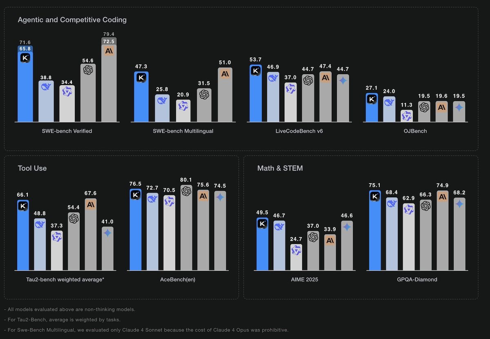

# Kimi K2: The Chinese Artificial Intelligence That Challenges the Giants of Coding
*by Dario Ferrero (VerbaniaNotizie.it)*

*If artificial intelligence were a Netflix series, we would say that we have reached the moment when the undisputed protagonist finds himself facing a new rival that no one expected. After years of American dominance in the AI sector, with OpenAI and Anthropic reigning supreme, a challenger arrives from the East that promises to reshuffle the cards: Kimi K2, the latest creation of Moonshot AI.*

## The Chinese David against the Goliaths of Silicon Valley

To understand the importance of this news, we need to take a step back. Moonshot AI is not exactly a garage startup: founded in 2023 by former Tsinghua University researcher Yang Zhilin, the company has already demonstrated its credentials in the Chinese market. Their previous chatbot Kimi managed to conquer the third place among the most used in China, according to [data from Counterpoint Research](https://www.nature.com/articles/d41586-025-02275-6), positioning itself just behind the giants Baidu and ByteDance. Not bad for such a young company, especially considering that it has the strategic support of Alibaba behind it.

But Kimi K2 is not simply an update of the previous model: it is a quantum leap that aims straight at the heart of the global market. As reported by [VentureBeat](https://venturebeat.com/ai/moonshot-ais-kimi-k2-outperforms-gpt-4-in-key-benchmarks-and-its-free/), this new model uses an architecture called "mixture-of-experts" (MoE), a technology that we can imagine as a team of highly qualified specialists. Instead of having a single "brain" that tries to do everything, Kimi K2 has a total of 1 trillion parameters, of which 32 billion are activated based on the specific task. It is like having a newsroom where each journalist is an expert in a different sector, and for each article only those who really know what they are talking about are called upon.

## The numbers that make the competition tremble

The performance of Kimi K2 tells an interesting story, especially when it comes to programming. In the SWE-bench Verified benchmark, considered one of the most difficult tests to evaluate the coding skills of AI, the Chinese model achieved 65.8% accuracy on the first try, rising to 71.6% with multiple attempts. To put these numbers in perspective, we are talking about a model that is able to solve real programming problems taken directly from GitHub, surpassing GPT-4.1 and competing with Anthropic's Claude 4 Opus.

*[Image taken from the Moonshot AI website](https://moonshotai.github.io/Kimi-K2/)*

But it is in the direct comparison with the most celebrated models that Kimi K2 shows its muscles. As highlighted by several comparative analyzes published on [CNBC](https://www.cnbc.com/2025/07/14/alibaba-backed-moonshot-releases-kimi-k2-ai-rivaling-chatgpt-claude.html) and specialized platforms, in mathematics the Chinese model reaches 97.4% against 92.4% of GPT-4.1, while in coding it stands at 53.7% surpassing the 44.7% of the OpenAI model. Even in comparison with Claude 4 Sonnet, traditionally considered one of the best for programming, Kimi K2 demonstrates superior performance in agentic coding benchmarks, while maintaining a lower output speed (34.1 tokens per second against 91.3 of Claude).

## The secret weapon: free and open source

If the technical performance is impressive, it is the commercial strategy that makes Kimi K2 potentially revolutionary. While GPT-4 and Claude require expensive subscriptions, Kimi K2 is completely free and available via app and browser. It is a bit as if Netflix suddenly decided to make its entire catalog free: it would completely change the rules of the game.

The open source approach of Moonshot AI is not just a commercial move, but a real philosophy. As underlined by the [company's official website](https://moonshotai.github.io/Kimi-K2/), the goal is to democratize access to advanced artificial intelligence, allowing researchers, developers and companies from all over the world to experiment with cutting-edge technologies without economic barriers. It is a strategy reminiscent of Google's with Android: offering an excellent technology for free to conquer market shares and create an ecosystem.

## The revolution of assisted coding

What makes Kimi K2 particularly interesting is its specialization in "tool calling" and multi-step execution, fundamental characteristics for what experts call "agentic coding". In simple terms, while traditional chatbots are limited to answering questions, Kimi K2 can actually "do" things: execute code, interact with external tools, and carry out complex projects autonomously.

This ability has attracted the attention of the international community of developers. As documented in several technical blogs, some programmers are already experimenting with the integration of Kimi K2 with tools like Anthropic's Claude Code, creating hybrid combinations that exploit the strengths of both systems. It is a pragmatic approach that shows how, in the real world, the competition between AI can turn into collaboration.

## The geopolitical implications of AI

The emergence of Kimi K2 is not just a technical issue, but also has significant geopolitical implications. After years in which China seemed to be chasing the United States in the field of artificial intelligence, models like Kimi K2 show that the gap is rapidly closing. It is no coincidence that the model excels precisely in crucial areas such as mathematics and programming, fundamental skills for the technological innovation of the future.

The strategy of making the model freely accessible can also be read in this key: conquering global users, collecting feedback, improving rapidly and creating technological dependence. It is the same playbook that allowed TikTok to conquer the world, but applied to a much more strategic technology.

## The future that awaits us

As I write this article, Kimi K2 is already demonstrating its potential in real applications. The developers who are testing it report impressive results in solving complex programming problems, especially when it comes to debugging and code optimization. The model's ability to "think" in a structured way and to use external tools makes it particularly suitable for projects that require a methodical and patient approach.

However, not everything is perfect. The lower response speed compared to competitors can be a limitation in real-time applications, and questions remain about the economic sustainability of such an advanced model offered for free. As with any emerging technology, time will tell if Kimi K2 will be able to keep its initial promises.

## Conclusions: a new era for AI

Kimi K2 represents much more than just a new model of artificial intelligence: it is the symbol of an epochal change in the tech sector. For the first time, a non-American company not only competes on equal terms with the world leaders, but in some areas surpasses them, offering everything for free.

As in any good science fiction story worthy of the name, the future that awaits us will probably be different from what we imagine today. What is certain is that the global competition in AI has just become much more interesting, and we developers and end users can only benefit from it. After all, as a certain Spider-Man said, "with great power comes great responsibility" - and Kimi K2 seems ready to take on his.
