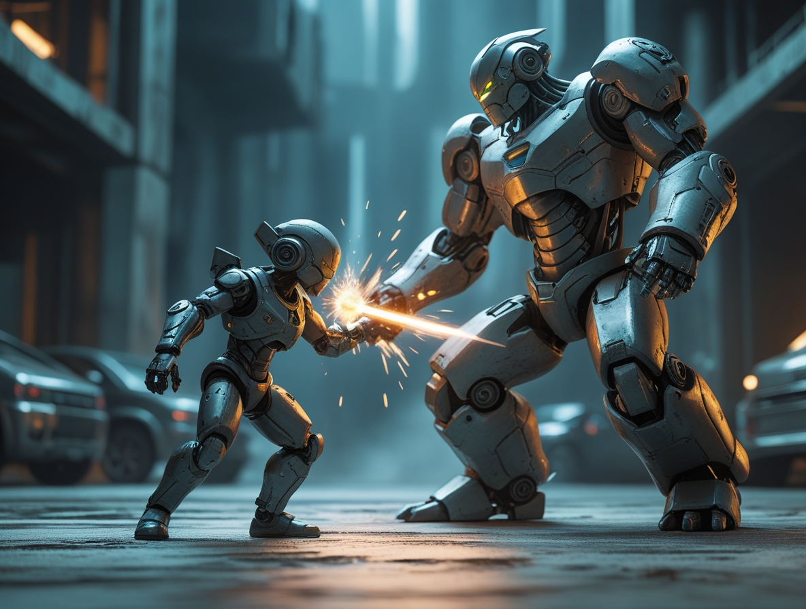
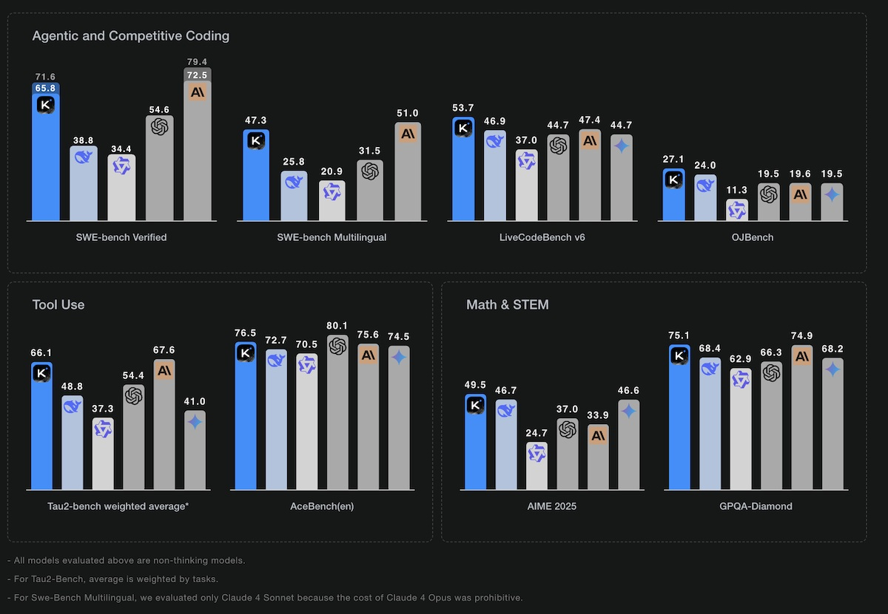

# Kimi K2: La Inteligencia Artificial China que Desafía a los Gigantes de la Codificación
*por Dario Ferrero (VerbaniaNotizie.it)*

*Si la inteligencia artificial fuera una serie de Netflix, diríamos que hemos llegado al momento en que el protagonista indiscutible se encuentra frente a un nuevo rival que nadie esperaba. Después de años de dominio estadounidense en el sector de la IA, con OpenAI y Anthropic a la cabeza, llega desde Oriente un retador que promete barajar de nuevo las cartas: Kimi K2, la última creación de Moonshot AI.*

## El David chino contra los Goliats de Silicon Valley

Para comprender la importancia de esta novedad, es necesario dar un paso atrás. Moonshot AI no es exactamente una startup de garaje: fundada en 2023 por el ex investigador de la Universidad de Tsinghua, Yang Zhilin, la empresa ya ha demostrado sus credenciales en el mercado chino. Su anterior chatbot Kimi logró conquistar el tercer puesto entre los más utilizados en China, según [datos de Counterpoint Research](https://www.nature.com/articles/d41586-025-02275-6), situándose justo por detrás de los gigantes Baidu y ByteDance. No está mal para una empresa tan joven, sobre todo si se tiene en cuenta que cuenta con el apoyo estratégico de Alibaba.

Pero Kimi K2 no es simplemente una actualización del modelo anterior: es un salto cuántico que apunta directamente al corazón del mercado global. Como informa [VentureBeat](https://venturebeat.com/ai/moonshot-ais-kimi-k2-outperforms-gpt-4-in-key-benchmarks-and-its-free/), este nuevo modelo utiliza una arquitectura denominada "mezcla de expertos" (MoE), una tecnología que podemos imaginar como un equipo de especialistas altamente cualificados. En lugar de tener un único "cerebro" que intenta hacerlo todo, Kimi K2 dispone de un total de 1 billón de parámetros, de los cuales 32.000 millones se activan en función de la tarea específica. Es como tener una redacción en la que cada periodista es experto en un sector diferente, y para cada artículo solo se recurre a quien realmente sabe de lo que habla.

## Las cifras que hacen temblar a la competencia

El rendimiento de Kimi K2 cuenta una historia interesante, especialmente cuando se trata de programación. En el benchmark SWE-bench Verified, considerado una de las pruebas más difíciles para evaluar las capacidades de codificación de la IA, el modelo chino alcanzó una precisión del 65,8% en el primer intento, que ascendió al 71,6% con múltiples intentos. Para poner estas cifras en perspectiva, estamos hablando de un modelo que es capaz de resolver problemas reales de programación tomados directamente de GitHub, superando a GPT-4.1 y llegando a competir con Claude 4 Opus de Anthropic.

*[Imagen tomada de la web de Moonshot AI](https://moonshotai.github.io/Kimi-K2/)*

Pero es en la comparación directa con los modelos más célebres donde Kimi K2 muestra sus músculos. Como destacan varios análisis comparativos publicados en [CNBC](https://www.cnbc.com/2025/07/14/alibaba-backed-moonshot-releases-kimi-k2-ai-rivaling-chatgpt-claude.html) y plataformas especializadas, en matemáticas el modelo chino alcanza el 97,4% frente al 92,4% de GPT-4.1, mientras que en codificación se sitúa en el 53,7% superando el 44,7% del modelo de OpenAI. Incluso en comparación con Claude 4 Sonnet, tradicionalmente considerado uno de los mejores para la programación, Kimi K2 demuestra un rendimiento superior en los benchmarks de codificación agéntica, aunque mantiene una velocidad de salida inferior (34,1 tokens por segundo frente a los 91,3 de Claude).

## El arma secreta: gratuito y de código abierto

Si el rendimiento técnico impresiona, es la estrategia comercial la que hace que Kimi K2 sea potencialmente revolucionario. Mientras que GPT-4 y Claude requieren costosas suscripciones, Kimi K2 es completamente gratuito y está disponible a través de una aplicación y un navegador. Es un poco como si Netflix decidiera de repente hacer gratuito todo su catálogo: cambiaría por completo las reglas del juego.

El enfoque de código abierto de Moonshot AI no es solo un movimiento comercial, sino una verdadera filosofía. Como subraya el [sitio web oficial de la empresa](https://moonshotai.github.io/Kimi-K2/), el objetivo es democratizar el acceso a la inteligencia artificial avanzada, permitiendo a investigadores, desarrolladores y empresas de todo el mundo experimentar con tecnologías de vanguardia sin barreras económicas. Es una estrategia que recuerda a la de Google con Android: ofrecer gratuitamente una tecnología excelente para conquistar cuota de mercado y crear un ecosistema.

## La revolución de la codificación asistida

Lo que hace que Kimi K2 sea particularmente interesante es su especialización en la "llamada a herramientas" y la ejecución de varios pasos, características fundamentales para lo que los expertos llaman "codificación agéntica". En pocas palabras, mientras que los chatbots tradicionales se limitan a responder preguntas, Kimi K2 puede realmente "hacer" cosas: ejecutar código, interactuar con herramientas externas y llevar a cabo proyectos complejos de forma autónoma.

Esta capacidad ha atraído la atención de la comunidad internacional de desarrolladores. Como se documenta en varios blogs técnicos, algunos programadores ya están experimentando con la integración de Kimi K2 con herramientas como Claude Code de Anthropic, creando combinaciones híbridas que aprovechan los puntos fuertes de ambos sistemas. Es un enfoque pragmático que demuestra cómo, en el mundo real, la competencia entre IA puede transformarse en colaboración.

## Las implicaciones geopolíticas de la IA

La aparición de Kimi K2 no es solo una cuestión técnica, sino que también tiene importantes implicaciones geopolíticas. Después de años en los que China parecía ir a la zaga de Estados Unidos en el campo de la inteligencia artificial, modelos como Kimi K2 demuestran que la brecha se está cerrando rápidamente. No es casualidad que el modelo destaque precisamente en áreas cruciales como las matemáticas y la programación, competencias fundamentales para la innovación tecnológica del futuro.

La estrategia de hacer el modelo accesible gratuitamente también puede leerse en esta clave: conquistar usuarios globales, recoger feedback, mejorar rápidamente y crear dependencia tecnológica. Es el mismo libro de jugadas que permitió a TikTok conquistar el mundo, pero aplicado a una tecnología mucho más estratégica.

## El futuro que nos espera

Mientras escribo este artículo, Kimi K2 ya está demostrando su potencial en aplicaciones reales. Los desarrolladores que lo están probando informan de resultados impresionantes en la resolución de problemas complejos de programación, especialmente cuando se trata de depuración y optimización de código. La capacidad del modelo para "pensar" de forma estructurada y utilizar herramientas externas lo hace especialmente adecuado para proyectos que requieren un enfoque metódico y paciente.

Sin embargo, no todo es perfecto. La menor velocidad de respuesta en comparación con la competencia puede ser una limitación en aplicaciones en tiempo real, y siguen existiendo dudas sobre la sostenibilidad económica de un modelo tan avanzado que se ofrece de forma gratuita. Como con cualquier tecnología emergente, el tiempo dirá si Kimi K2 logrará mantener sus promesas iniciales.

## Conclusiones: una nueva era para la IA

Kimi K2 representa mucho más que un simple nuevo modelo de inteligencia artificial: es el símbolo de un cambio de época en el sector tecnológico. Por primera vez, una empresa no estadounidense no solo compite en igualdad de condiciones con los líderes mundiales, sino que en algunos ámbitos los supera, ofreciéndolo todo gratis.

Como en toda buena historia de ciencia ficción que se precie, el futuro que nos espera será probablemente diferente de lo que imaginamos hoy. Lo que es seguro es que la competencia global en IA se ha vuelto mucho más interesante, y nosotros, los desarrolladores y usuarios finales, no podemos sino beneficiarnos de ello. Después de todo, como dijo un tal Spider-Man, "un gran poder conlleva una gran responsabilidad", y Kimi K2 parece dispuesto a asumir la suya.
