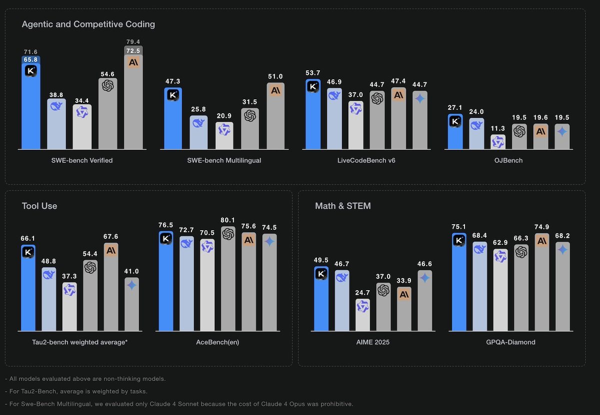

# Kimi K2: L'Intelligenza Artificiale Cinese che Sfida i Giganti del Coding

*di Dario Ferrero (VerbaniaNotizie.it)*

*Se l'intelligenza artificiale fosse una serie Netflix, diremmo che siamo arrivati al momento in cui il protagonista incontrastato si trova davanti a un nuovo rivale che nessuno si aspettava. Dopo anni di dominio americano nel settore dell'AI, con OpenAI e Anthropic a farla da padroni, dall'Oriente arriva un challenger che promette di rimescolare le carte: Kimi K2, l'ultima creazione di Moonshot AI.*

## Il David cinese contro i Golia di Silicon Valley

Per capire l'importanza di questa novità, bisogna fare un passo indietro. Moonshot AI non è esattamente una startup garage: fondata nel 2023 dall'ex ricercatore di Tsinghua University Yang Zhilin, l'azienda ha già dimostrato le sue credenziali nel mercato cinese. Il loro precedente chatbot Kimi è riuscito a conquistare il terzo posto tra i più utilizzati in Cina, secondo i [dati di Counterpoint Research](https://www.nature.com/articles/d41586-025-02275-6), posizionandosi subito dietro ai giganti Baidu e ByteDance. Non male per un'azienda così giovane, soprattutto considerando che ha alle spalle il supporto strategico di Alibaba.

Ma Kimi K2 non è semplicemente un aggiornamento del precedente modello: è un salto quantico che punta dritto al cuore del mercato globale. Come riporta [VentureBeat](https://venturebeat.com/ai/moonshot-ais-kimi-k2-outperforms-gpt-4-in-key-benchmarks-and-its-free/), questo nuovo modello utilizza un'architettura chiamata "mixture-of-experts" (MoE), una tecnologia che possiamo immaginare come un team di specialisti altamente qualificati. Invece di avere un singolo "cervello" che cerca di fare tutto, Kimi K2 dispone di 1 trilione di parametri totali, di cui 32 miliardi vengono attivati in base al compito specifico. È come avere una redazione dove ogni giornalista è esperto in un settore diverso, e per ogni articolo viene chiamato in causa solo chi sa davvero di cosa sta parlando.

## I numeri che fanno tremare la concorrenza

Le prestazioni di Kimi K2 raccontano una storia interessante, specialmente quando si parla di programmazione. Nel benchmark SWE-bench Verified, considerato uno dei test più difficili per valutare le capacità di coding dell'AI, il modello cinese ha raggiunto il 65.8% di accuratezza alla prima prova, salendo al 71.6% con tentativi multipli. Per mettere questi numeri in prospettiva, stiamo parlando di un modello che riesce a risolvere problemi reali di programmazione presi direttamente da GitHub, superando GPT-4.1 e arrivando a competere con Claude 4 Opus di Anthropic.

*[Immagine tratta dal sito di Moonshot AI](https://moonshotai.github.io/Kimi-K2/)*

Ma è nel confronto diretto con i modelli più celebrati che Kimi K2 mostra i muscoli. Come evidenziato da diverse analisi comparative pubblicate su [CNBC](https://www.cnbc.com/2025/07/14/alibaba-backed-moonshot-releases-kimi-k2-ai-rivaling-chatgpt-claude.html) e piattaforme specializzate, in matematica il modello cinese raggiunge il 97.4% contro il 92.4% di GPT-4.1, mentre nel coding si attesta al 53.7% superando il 44.7% del modello OpenAI. Anche nel confronto con Claude 4 Sonnet, tradizionalmente considerato uno dei migliori per la programmazione, Kimi K2 dimostra prestazioni superiori nei benchmark di coding tramite agenti, pur mantenendo una velocità di output più bassa (34.1 token al secondo contro i 91.3 di Claude).

### Sotto il cofano: come funziona davvero Kimi K2

Per capire davvero cosa rende Kimi K2 così speciale, bisogna aprire il cofano e dare un'occhiata al motore. Come spiegato nel [repository ufficiale su GitHub](https://github.com/MoonshotAI/Kimi-K2), l'architettura Mixture-of-Experts non è solo una moda tecnologica, ma una soluzione intelligente a un problema concreto: come ottenere le prestazioni di un modello gigantesco senza dover attivare ogni volta tutti i suoi "neuroni".

Immaginate Kimi K2 come un grande ospedale con 384 specialisti diversi. Quando arriva un paziente con un problema al cuore, non serve chiamare anche l'ortopedico e il dermatologo: basta attivare il cardiologo e pochi altri colleghi pertinenti. Così funziona il sistema MoE di Kimi K2: dei suoi 1 trilione di parametri totali, [solo 32 miliardi vengono "accesi" per ogni singola richiesta](https://www.llmwatch.com/p/kimi-k2-what-it-is-how-it-works-and), rendendo il calcolo molto più efficiente.

Ma c'è di più: come documentato dal [team di GroqDocs](https://console.groq.com/docs/model/moonshotai/kimi-k2-instruct), Kimi K2 utilizza un'architettura transformer avanzata che ottimizza specificamente la comprensione del codice. È come avere un traduttore che non solo capisce diverse lingue, ma è anche specializzato nei dialetti tecnici di ogni linguaggio di programmazione.

La finestra di contesto da 128.000 token rappresenta un altro salto qualitativo rispetto ai modelli tradizionali. In termini pratici, significa che Kimi K2 può "tenere a mente" l'equivalente di circa 200-300 pagine di testo contemporaneamente. Per un programmatore, questo si traduce nella capacità di analizzare intere applicazioni, comprendere le relazioni tra diversi file e moduli, e suggerire modifiche che tengano conto dell'architettura complessiva del progetto.

## L'arma segreta: gratuito e open source

Se le prestazioni tecniche impressionano, è la strategia commerciale a rendere Kimi K2 potenzialmente rivoluzionario. Mentre GPT-4 e Claude richiedono abbonamenti costosi, Kimi K2 è completamente gratuito e disponibile tramite app e browser. È un po' come se Netflix decidesse improvvisamente di rendere tutto il suo catalogo gratuito: cambierebbe completamente le regole del gioco.

L'approccio open source di Moonshot AI non è solo una mossa commerciale, ma una vera e propria filosofia. Come sottolineato dal [sito ufficiale dell'azienda](https://moonshotai.github.io/Kimi-K2/), l'obiettivo è democratizzare l'accesso all'intelligenza artificiale avanzata, permettendo a ricercatori, sviluppatori e aziende di tutto il mondo di sperimentare con tecnologie all'avanguardia senza barriere economiche. È una strategia che ricorda quella di Google con Android: offrire gratuitamente una tecnologia eccellente per conquistare quote di mercato e creare un ecosistema.

## La rivoluzione del coding assistito

Quello che rende Kimi K2 particolarmente interessante è la sua specializzazione nel "tool calling" e nell'esecuzione multi-step, caratteristiche fondamentali per quello che gli esperti chiamano "agentic coding". In parole semplici, mentre i chatbot tradizionali si limitano a rispondere alle domande, Kimi K2 può effettivamente "fare" cose: eseguire codice, interagire con strumenti esterni, e portare avanti progetti complessi in modo autonomo.

Questa capacità ha attirato l'attenzione della community internazionale degli sviluppatori. Come documentato in diversi blog tecnici, alcuni programmatori stanno già sperimentando l'integrazione di Kimi K2 con strumenti come Claude Code di Anthropic, creando combinazioni ibride che sfruttano i punti di forza di entrambi i sistemi. È un approccio pragmatico che dimostra come, nel mondo reale, la competizione tra AI possa trasformarsi in collaborazione.

### Kimi K2 all'opera: storie dal campo

Ma come si comporta Kimi K2 quando scende nell'arena della programmazione reale? Le prime testimonianze dai laboratori di sviluppo raccontano una storia affascinante. Il team di [Cline ha documentato le loro prime impressioni](https://cline.bot/blog/moonshots-kimi-k2-for-coding-our-first-impressions-in-cline) con risultati sorprendenti: "Kimi K2 si è dimostrato particolarmente forte in modalità 'Act', dove eccelle nell'eseguire piani ben definiti piuttosto che nella pianificazione iniziale".

L'analisi della community di sviluppatori rivela pattern interessanti nell'utilizzo pratico. Come evidenziato su [Analytics Vidhya](https://www.analyticsvidhya.com/blog/2025/07/kimi-k2/), il modello dimostra una particolare abilità nel gestire "l'architettura avanzata di ragionamento" che permette di scomporre problemi complessi in fasi gestibili. Questo approccio si traduce in una maggiore accuratezza quando si tratta di debugging di codice multi-file e ottimizzazione di performance.

Un caso emblematico arriva dal confronto diretto con altri modelli. [Gary Svenson ha documentato su Medium](https://garysvenson09.medium.com/how-to-run-kimi-k2-inside-claude-code-the-ultimate-open-source-ai-coding-combo-7b248adcf336) come l'integrazione di Kimi K2 con Claude Code crei combinazioni ibride che sfruttano i punti di forza di entrambi i sistemi: "La potenza bruta di un modello da trillion parametri combinata con l'eleganza dell'interfaccia Claude Code".

Nel benchmark SWE-bench Verified, che simula il lavoro di uno sviluppatore su problemi reali di GitHub, [Kimi K2 ha raggiunto il 65.8% di successo](https://moonshotai.github.io/Kimi-K2/) al primo tentativo. Come spiega la documentazione ufficiale, questo test rappresenta una delle valutazioni più realistiche per misurare le capacità pratiche di coding dell'AI, poiché replica scenari di sviluppo autentici piuttosto che esercizi accademici.

Particolarmente interessante è l'approccio collaborativo che alcuni team stanno sperimentando. La [guida per sviluppatori su Hugging Face](https://huggingface.co/blog/francesca-petracci/kimi-k2-claude-code) documenta come "le capacità agentiche di Kimi K2 permettono di scomporre task complessi in passaggi più piccoli e gestibili, eseguendoli in modo autonomo". È una strategia che ricorda i pit-stop della Formula 1: ogni membro del team ha il suo ruolo specifico, e il risultato finale è superiore alla somma delle parti.

La community di [DataCamp ha osservato](https://www.datacamp.com/tutorial/kimi-k2) che "Kimi K2 offre capacità reali per sviluppatori disposti a sperimentare, particolarmente per chi cerca maggiore controllo sul comportamento agentico a costi contenuti". Non è solo marketing: stiamo assistendo alla nascita di nuovi workflow di sviluppo dove l'AI cinese si sta ritagliando una nicchia specifica ma importante nel panorama degli strumenti di programmazione assistita.

## Le implicazioni geopolitiche dell'AI

L'emergere di Kimi K2 non è solo una questione tecnica, ma ha anche risvolti geopolitici significativi. Dopo anni in cui la Cina sembrava inseguire gli Stati Uniti nel campo dell'intelligenza artificiale, modelli come Kimi K2 dimostrano che il gap si sta rapidamente colmando. Non è un caso che il modello eccella proprio in aree cruciali come matematica e programmazione, competenze fondamentali per l'innovazione tecnologica del futuro.

La strategia di rendere il modello gratuitamente accessibile può essere letta anche in questa chiave: conquistare utenti globali, raccogliere feedback, migliorare rapidamente e creare dipendenza tecnologica. È lo stesso playbook che ha permesso a TikTok di conquistare il mondo, applicato però a una tecnologia ben più strategica.

## Il futuro che ci aspetta

Mentre scrivo questo articolo, Kimi K2 sta già dimostrando il suo potenziale in applicazioni reali. Gli sviluppatori che lo stanno testando riportano risultati impressionanti nella risoluzione di problemi complessi di programmazione, specialmente quando si tratta di debugging e ottimizzazione del codice. La capacità del modello di "pensare" in modo strutturato e di utilizzare strumenti esterni lo rende particolarmente adatto per progetti che richiedono un approccio metodico e paziente.

Tuttavia, non tutto è perfetto. La velocità di risposta più bassa rispetto ai concorrenti può essere un limite in applicazioni real-time, e rimangono domande sulla sostenibilità economica di un modello così avanzato offerto gratuitamente. Come per ogni tecnologia emergente, sarà il tempo a dirci se Kimi K2 riuscirà a mantenere le promesse iniziali.

## Conclusioni: una nuova era per l'AI

Kimi K2 rappresenta molto più di un semplice nuovo modello di intelligenza artificiale: è il simbolo di un cambiamento epocale nel settore tech. Per la prima volta, un'azienda non americana non solo compete ad armi pari con i leader mondiali, ma in alcuni ambiti li supera, offrendo tutto gratuitamente.

Come in ogni buona storia di fantascienza che si rispetti, il futuro che ci aspetta sarà probabilmente diverso da quello che immaginiamo oggi. Quello che è certo è che la competizione globale nell'AI si è appena fatta molto più interessante, e noi sviluppatori e utenti finali non possiamo che beneficiarne. Dopotutto, come diceva un certo Spider-Man, "da grandi poteri derivano grandi responsabilità" – e Kimi K2 sembra pronto ad assumersi le sue.
