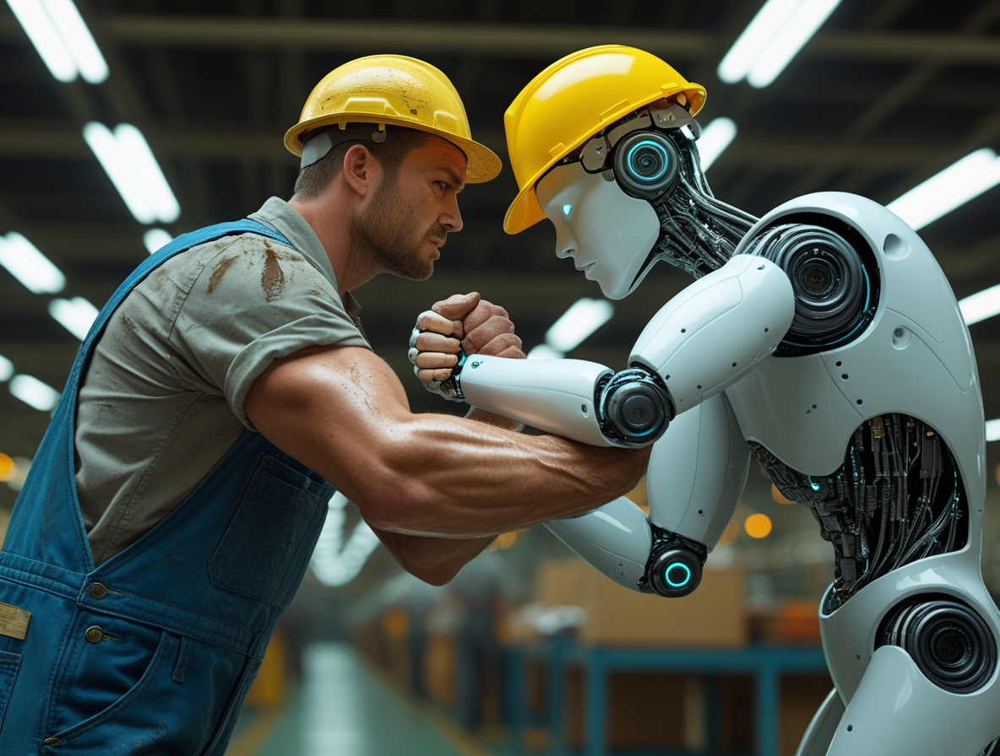
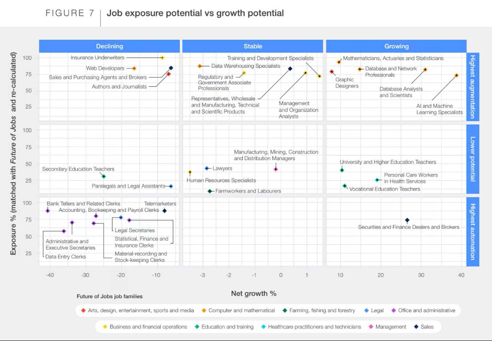

# Inteligencia Artificial y el Futuro del Trabajo
*por Dario Ferrero (VerbaniaNotizie.it)*

*Como en Matrix, nos enfrentamos a una elección: ¿píldora roja o azul? La inteligencia artificial está llegando al mundo laboral y ya no podemos ignorarla.*

## La gran transformación: entre empleos perdidos y nuevas oportunidades profesionales

La pregunta que desvela a directivos, sindicalistas y trabajadores de todo el mundo es siempre la misma: ¿la IA nos robará el trabajo o creará otros nuevos? La respuesta, como suele ocurrir con las grandes transformaciones tecnológicas, es más compleja de lo que parece y merece ser analizada con datos concretos, dejando de lado tanto a los apocalípticos como a los soñadores.

El debate sobre el empleo y la inteligencia artificial ha llegado a un punto de inflexión gracias a investigaciones científicas que finalmente nos permiten ir más allá de las especulaciones. Ya no hablamos de predicciones vagas o escenarios de ciencia ficción, sino de análisis basados en el uso real que millones de personas hacen a diario de estas herramientas. Las cifras que surgen de estos estudios pintan un cuadro sorprendente, que da la vuelta a muchos de nuestros prejuicios sobre la tecnología y el futuro del trabajo.

## Los números de la transformación

El [Informe sobre el Futuro de los Empleos 2023 del Foro Económico Mundial](https://www.weforum.org/publications/the-future-of-jobs-report-2023/) analizó 673 millones de empleos a nivel mundial, proporcionando la fotografía más completa jamás realizada sobre el impacto de la inteligencia artificial en el mundo laboral. Los resultados son tan esclarecedores como inesperados: mientras que 83 millones de empleos están destinados a ser eliminados en los próximos cinco años debido a la automatización y la IA, nada menos que 69 millones de nuevos puestos nacerán precisamente gracias a estas tecnologías. El saldo neto sigue siendo ligeramente negativo, pero se trata de una contracción mucho más contenida de lo que muchos preveían.

Aún más interesante es el enfoque adoptado por los investigadores de Microsoft en el estudio ["Working with AI: Measuring the Occupational Implications of Generative AI"](https://www.microsoft.com/en-us/research/publication/working-with-ai-measuring-the-occupational-implications-of-generative-ai/), dirigido por Kiran Tomlinson. Por primera vez, en lugar de basarse en predicciones teóricas, los investigadores analizaron 200.000 conversaciones anónimas entre usuarios reales y Microsoft Bing Copilot. Este enfoque revolucionario ha permitido crear un coeficiente científico llamado "AI Applicability Score" que mide hasta qué punto la inteligencia artificial puede ayudar o sustituir eficazmente actividades laborales específicas.

La rigurosa metodología adoptada por Microsoft representa un punto de inflexión en la investigación sobre el impacto de la IA. En lugar de basarse en especulaciones o modelos teóricos, los investigadores han observado lo que la gente hace realmente cuando interactúa con la inteligencia artificial con fines laborales. Los resultados de este análisis empírico son sorprendentes y a menudo contraintuitivos en comparación con las predicciones tradicionales.

La diferencia fundamental entre estos estudios y las previsiones anteriores radica en la concreción del enfoque. Ya no hablamos de lo que la IA podría hacer en teoría, sino de lo que ya está haciendo en la práctica diaria de millones de trabajadores. Este cambio de perspectiva ha producido resultados que desafían muchas de nuestras certezas consolidadas.

## Quiénes corren más riesgo

Los resultados del [estudio de Microsoft](https://www.microsoft.com/en-us/research/publication/working-with-ai-measuring-the-occupational-implications-of-generative-ai/) revelan una paradoja que habría hecho sonreír incluso a Isaac Asimov: los trabajos más expuestos a la inteligencia artificial no son los manuales que imaginábamos, sino las profesiones relacionadas con la informática y las matemáticas, el apoyo administrativo y las ventas que implican proporcionar y comunicar información. Es como si Data de Star Trek hubiera resultado más vulnerable que Scotty, el ingeniero que jugueteaba con las manos en los conductos de la nave Enterprise.

El análisis de las conversaciones reales ha demostrado que las actividades más comunes para las que la gente solicita ayuda a la IA son la recopilación de información y la redacción, mientras que la inteligencia artificial destaca precisamente en proporcionar información, escribir, enseñar y aconsejar. Esta superposición casi perfecta explica por qué algunos trabajos "intelectuales" están más expuestos de lo que esperábamos.

La cuestión de la escolarización se presenta como especialmente compleja. Contrariamente a lo que se podría pensar, la IA no afecta solo a los trabajos menos cualificados, sino que atraviesa transversalmente todos los niveles de formación. Muchos profesionales con titulaciones superiores especializadas se encuentran paradójicamente más expuestos que los trabajadores con competencias técnicas y manuales específicas. Esto da un vuelco total al paradigma tradicional según el cual la tecnología siempre habría favorecido a los más formados.

Los trabajos más seguros son los que requieren presencia física, habilidades manuales específicas e interacción directa con el entorno. Fontaneros, electricistas, mecánicos, pero también cirujanos, enfermeros y educadores infantiles mantienen una ventaja competitiva significativa frente a la inteligencia artificial. La clave reside en la combinación de habilidades motoras finas, capacidad de adaptación a situaciones imprevistas e interacción emocional con las personas.

Un aspecto especialmente interesante que se desprende de la investigación es que el nivel salarial no está necesariamente correlacionado con la seguridad del puesto. Algunos trabajos muy bien remunerados, especialmente en el sector financiero y de la consultoría, muestran puntuaciones de aplicabilidad de la IA sorprendentemente altas. Por el contrario, algunas profesiones con salarios medios o bajos, pero que requieren presencia física y resolución de problemas contextuales, resultan estar mucho más protegidas.

*[Imagen extraída del sitio web del Foro Económico Mundial](https://www.weforum.org/stories/2023/09/jobs-ai-will-create/)*

## Las nuevas oportunidades

Mientras algunos sectores se contraen, otros explotan literalmente. Las profesiones emergentes identificadas por el [Foro Económico Mundial](https://www.weforum.org/stories/2023/09/jobs-ai-will-create/) van mucho más allá de los clásicos desarrolladores de software. Estamos viendo nacer especialistas en aprendizaje automático, ingenieros de IA, consultores para la implantación de la inteligencia artificial, pero también figuras híbridas que combinan competencias tradicionales con la capacidad de colaborar eficazmente con los sistemas inteligentes.

Los sectores con mayor crecimiento del empleo en el periodo 2023-2027, según el [Informe sobre el Futuro de los Empleos 2023](https://www.weforum.org/stories/2023/05/jobs-ai-cant-replace/), son la agricultura de precisión, el transporte inteligente y la educación personalizada. En estos ámbitos, la inteligencia artificial no sustituye al trabajador humano, sino que amplifica enormemente sus capacidades. Un agrónomo puede hoy supervisar miles de hectáreas mediante drones y sensores de IA, un operario de logística puede optimizar rutas para cientos de vehículos en tiempo real, un profesor puede personalizar el aprendizaje para decenas de alumnos simultáneamente.

La investigación de Microsoft ha demostrado que las competencias del futuro no son solo técnicas, sino que incluyen sobre todo la capacidad de colaborar eficazmente con los sistemas de IA. Las interacciones más exitosas entre humanos e inteligencia artificial demuestran que los mejores resultados se obtienen cuando las personas saben cómo formular peticiones precisas, cómo verificar y refinar las respuestas de la IA, y cómo integrar el resultado artificial con el juicio y la creatividad humanos.

Surge una figura profesional completamente nueva: el "ingeniero de prompts" o "susurrador de IA", alguien que sabe cómo comunicarse eficazmente con la inteligencia artificial para obtener resultados óptimos. No se necesita una licenciatura en informática para convertirse en un experto en este campo, sino más bien una combinación de curiosidad, creatividad y capacidad de pensamiento crítico.

Otro sector en fuerte crecimiento es el de la supervisión ética de la IA. Con la creciente difusión de estas herramientas, aumenta la demanda de profesionales que puedan garantizar que la inteligencia artificial se utilice de forma responsable, transparente y respetuosa con los derechos humanos. Estos "Oficiales de Ética de la IA" representan una profesión completamente nueva que aúna competencias técnicas, filosóficas y legales.

*[Imagen extraída del sitio web del Foro Económico Mundial](https://www.weforum.org/stories/2023/09/jobs-ai-will-create/)*

## El saldo final y las implicaciones sociales

Matemáticamente hablando, las cifras son, en conjunto, alentadoras. El Foro Económico Mundial prevé que la creación neta de empleo conseguirá compensar gran parte de las pérdidas, aunque con un saldo ligeramente negativo. Sin embargo, el verdadero reto no reside en las cifras agregadas, sino en la complejidad de la transición y en la distribución geográfica y social de estos cambios.

El principal problema es que los nuevos empleos podrían no ir a parar a las mismas personas que pierden los tradicionales. Un contable de mediana edad que ve cómo su puesto se automatiza difícilmente se convertirá en un especialista en aprendizaje automático de la noche a la mañana. Esta asimetría temporal y cualitativa representa el verdadero reto social de la era de la IA.

La cuestión territorial añade un nivel más de complejidad. Los nuevos empleos relacionados con la inteligencia artificial tienden a concentrarse en áreas metropolitanas específicas con ecosistemas tecnológicos desarrollados, mientras que los puestos eliminados por la automatización suelen estar distribuidos de forma más uniforme por el territorio. Esto amenaza con acentuar las brechas geográficas y económicas existentes, creando una nueva forma de desigualdad digital.

La importancia de la formación continua se perfila como un factor crucial para gestionar esta transición. Como en los "Tiempos modernos" de Chaplin, toda revolución industrial ha creado inicialmente desorientación y temor, pero al final ha conducido a una mejora general del nivel de vida. La diferencia hoy reside en la velocidad del cambio, que requiere sistemas educativos y de formación mucho más ágiles y adaptables.

El reskilling y el upskilling ya no son opciones, sino necesidades para cualquiera que quiera seguir siendo competitivo en el mercado laboral. Las empresas más previsoras ya están invirtiendo masivamente en la recualificación de sus empleados, reconociendo que es más rentable formar al personal existente que sustituirlo por completo.

## Prepararse para el cambio

Las estrategias individuales para navegar esta transición requieren, ante todo, un cambio de mentalidad. La adaptabilidad se convierte en la competencia más importante, más valiosa que el conocimiento específico de cualquier sector. Quien consiga aprender continuamente, reinventarse profesionalmente y ver las tecnologías emergentes como aliadas en lugar de enemigas siempre tendrá una ventaja competitiva.

El papel de las instituciones es fundamental para facilitar este cambio. Gobiernos y empresas deben colaborar para crear programas de formación eficaces, redes de seguridad social adecuadas y políticas que favorezcan una transición lo más justa e inclusiva posible. La inversión en educación digital y formación continua representa la clave para transformar una crisis potencial en una oportunidad de crecimiento colectivo.

La capacidad de aprender continuamente se convierte realmente en el superpoder del siglo XXI. En un mundo en el que la inteligencia artificial evoluciona a un ritmo exponencial, la diferencia la marcará quien sepa evolucionar con ella, manteniendo siempre esas características únicamente humanas que ninguna máquina podrá replicar jamás: la empatía, la creatividad, el pensamiento crítico y la capacidad de dar sentido a las experiencias.

## Conclusiones

La inteligencia artificial no es ni la salvadora ni la destructora del trabajo humano que muchos pintan. Es una herramienta potentísima que, como todas las grandes tecnologías de la historia, redefinirá profundamente nuestra forma de trabajar, pero no necesariamente la cantidad de trabajo disponible. Los datos científicos muestran un panorama complejo pero sustancialmente optimista, en el que las oportunidades creadas pueden equilibrar los empleos eliminados.

El verdadero reto no es tecnológico, sino social: cómo gestionar una transición que será inevitablemente traumática para muchos, cómo garantizar que los beneficios de la IA se distribuyan equitativamente, cómo preparar a las generaciones futuras para un mundo laboral en continua evolución. Si conseguimos afrontar estos retos con inteligencia, colaboración y previsión, la inteligencia artificial podrá convertirse realmente en el catalizador de una nueva era de prosperidad compartida.

El futuro del trabajo será el que decidamos construir. La inteligencia artificial nos ofrece las herramientas, pero a nosotros nos corresponde elegir cómo utilizarlas. La píldora roja o azul de Matrix, al final, la elegimos nosotros.
