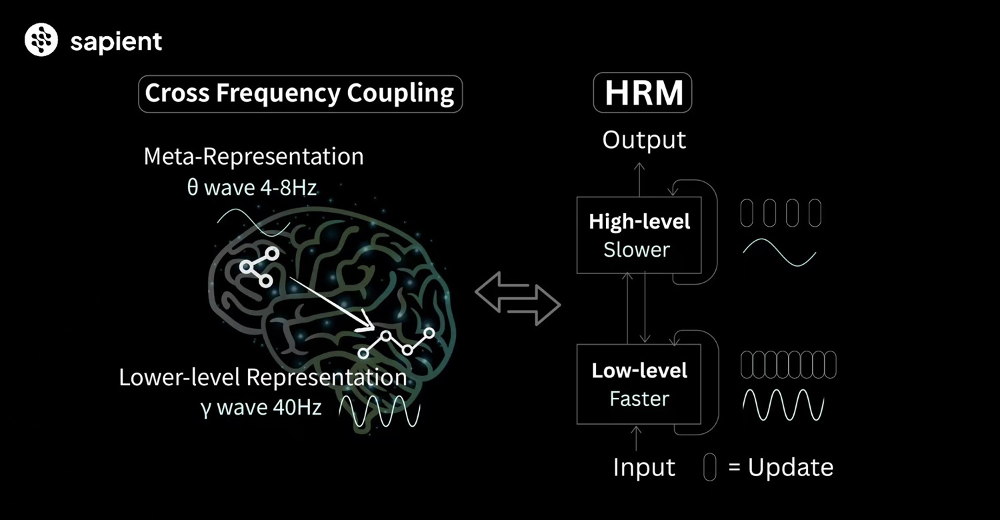
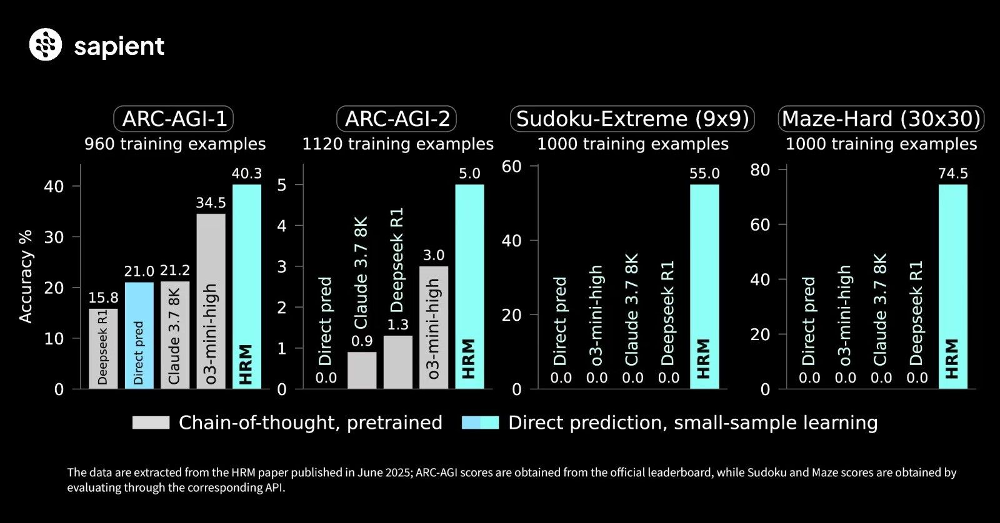

# "Quando la Dimensione Non Conta": La Rivoluzione del Modello HRM
*di Dario Ferrero (VerbaniaNotizie.it)*

*La più grande rivoluzione nell'intelligenza artificiale degli ultimi anni non arriva dai laboratori di OpenAI o Google, ma da una piccola startup di Singapore chiamata [Sapient Intelligence](https://www.sapient.inc/).*

Il protagonista di questa storia si chiama [Hierarchical Reasoning Model](https://github.com/sapientinc/HRM) (HRM), un agente AI che sta facendo tremare le fondamenta dell'intero settore con una promessa apparentemente impossibile: ragionare meglio dei giganti dell'AI utilizzando una frazione delle loro risorse.

Non si tratta del solito modello linguistico ingrandito fino all'inverosimile, né dell'ennesima variazione sul tema dei transformer. HRM è costruito diversamente, ispirato direttamente al funzionamento del cervello umano, e i risultati che sta ottenendo sono a dir poco sbalorditivi. Questo modello da appena 27 milioni di parametri, meno di un quarto rispetto al primo GPT, sta superando sistematicamente modelli quattro volte più grandi in compiti di ragionamento complesso. Come se non bastasse, viene addestrato con soli mille esempi per problema, mentre i suoi avversari richiedono montagne di dati e mesi di elaborazione sui server più potenti del mondo.

Ma la vera magia di HRM non risiede nelle sue dimensioni contenute o nella sua efficienza di addestramento. La sua innovazione sta nel fatto che non si limita a elaborare informazioni come fanno tutti gli altri: ragiona davvero, emulando i processi cognitivi umani in modi che sembravano fantascienza fino a pochi mesi fa. E i risultati parlano chiaro: dove altri modelli falliscono completamente, HRM eccelle con una naturalezza che ricorda più un cervello pensante che una macchina calcolatrice.

## Quando la Catena di Pensiero Si Spezza

Per capire l'importanza della rivoluzione portata da HRM, dobbiamo prima comprendere come funzionano i modelli di intelligenza artificiale attuali e perché i loro limiti stanno diventando sempre più evidenti. ChatGPT, Claude, Gemini e tutti i loro fratelli maggiori si basano su una tecnica chiamata "Chain of Thought" o catena di pensiero, un approccio che suona promettente ma nasconde fragilità strutturali profonde.

Immaginate di dover risolvere un problema di matematica complesso scrivendo ogni passaggio con una penna indelebile, senza mai poter tornare indietro per verificare o correggere quello che avete scritto. È esattamente così che funzionano i modelli attuali: si guidano passo dopo passo attraverso un problema, quasi "parlando a se stessi" ad alta voce, ma se commettono anche un solo piccolo errore in questa catena, l'intera risposta può crollare come un castello di carte.

Come spiegano i ricercatori di Sapient Intelligence nel loro [paper scientifico](https://arxiv.org/abs/2506.21734), "la catena di pensiero per il ragionamento è una stampella, non una soluzione soddisfacente. Si basa su decomposizioni fragili definite dall'uomo dove un singolo passo falso o un disordine dei passaggi può far deragliare completamente il processo di ragionamento".

Il problema è ancora più profondo di quanto sembri. I modelli basati su transformer, l'architettura che domina l'AI moderna, eseguono sempre la stessa quantità di "pensiero" indipendentemente dalla difficoltà della domanda. È come se un detective dovesse dedicare esattamente lo stesso tempo e le stesse risorse per risolvere sia un furto di biciclette che un intricato caso di omicidio. Non possono dire "Questo è difficile, ho bisogno di più tempo per pensare" e non possono rivedere il proprio ragionamento una volta iniziato a generare la risposta.

Questa rigidità ha conseguenze pratiche enormi. I modelli attuali sono costretti a tradurre ogni processo di ragionamento in linguaggio esplicito, producendo risposte lunghe, lente e spesso ridondanti. Peggio ancora, questa dipendenza dal linguaggio li rende vulnerabili a errori in cascata: se sbagliano un passaggio intermedio, tutto quello che segue è compromesso, indipendentemente da quanto potrebbero essere corrette le loro capacità di ragionamento di base.

## L'Architettura che Imita il Cervello

HRM abbandona completamente questo paradigma, abbracciando un approccio radicalmente diverso che i suoi creatori descrivono come "ispirato al cervello". Non si tratta di una metafora superficiale o di marketing: l'architettura di HRM prende in prestito direttamente la strategia di decisione a strati del cervello umano, applicandola all'intelligenza artificiale con risultati che stanno ridefinendo cosa sia possibile nel campo del machine learning.

Al cuore di HRM ci sono due componenti che lavorano in tandem come un duo perfettamente coordinato. Il primo è un pianificatore di alto livello, che potremmo immaginare come il "cervello strategico lento" che osserva il quadro generale, identifica il tipo di problema da risolvere e traccia una mappa generale dell'approccio da seguire. Il secondo è un esecutore di basso livello, il "processore veloce" che prende gli ordini dal pianificatore e li esegue con precisione e rapidità.

L'analogia più calzante è quella di un maestro di scacchi che collabora con un assistente incredibilmente efficiente. Il maestro studia la scacchiera, pianifica la strategia generale e decide quale mossa fare, mentre l'assistente esegue fisicamente la mossa con precisione millimetrica. Ma qui la similitudine si fa ancora più interessante: i due non si limitano a un singolo scambio di informazioni, ma mantengono un dialogo continuo per tutta la durata del problema.

Questo è il cuore dell'innovazione di HRM: il [loop di ragionamento gerarchico](https://venturebeat.com/ai/new-ai-architecture-delivers-100x-faster-reasoning-than-llms-with-just-1000-training-examples/). Il modulo di alto livello elabora un piano strategico e lo passa al modulo di basso livello, che lo esegue e restituisce i risultati. A questo punto, il modulo di alto livello analizza quello che è successo, aggiorna la sua strategia in base ai nuovi dati e fornisce al modulo di basso livello un nuovo sottoproblema raffinato su cui lavorare. Questo "botta e risposta" continua in cicli iterativi finché il modello non converge sulla soluzione ottimale.

La bellezza di questo approccio è che permette a HRM di controllare e raffinare internamente il proprio ragionamento mentre sta ancora processando il problema, una capacità che la stragrande maggioranza degli altri modelli semplicemente non possiede. È come se, mentre risolvete quel problema di matematica con la penna indelebile, qualcuno vi permettesse improvvisamente di cancellare, riscrivere e ripensare ogni passaggio fino a quando non siete completamente sicuri della soluzione.

Ma c'è di più. La versione più avanzata di HRM utilizza l'apprendimento per rinforzo per decidere autonomamente quante iterazioni sono necessarie per ogni tipo di compito, rendendolo ancora più simile al pensiero flessibile umano. Proprio come noi dedichiamo più tempo e energie mentali ai problemi complessi rispetto a quelli semplici, HRM impara a modulare i suoi cicli di ragionamento in base alla difficoltà intrinseca del problema che sta affrontando.

*[Immagine tratta da Sapient.inc HRM](https://sapient.inc/)*

## Davide Contro Golia: I Numeri che Sconvolgono

I risultati ottenuti da HRM sui benchmark di ragionamento più difficili sono il tipo di numeri che fanno alzare le sopracciglia anche agli esperti più scettici del settore. Stiamo parlando di un modello con appena 27 milioni di parametri che non solo compete con giganti da miliardi di parametri, ma li supera sistematicamente in compiti che richiedono ragionamento profondo e astratto.

Sul [ARC-AGI benchmark](https://venturebeat.com/ai/openais-o3-shows-remarkable-progress-on-arc-agi-sparking-debate-on-ai-reasoning/), considerato uno dei test più affidabili per misurare le capacità di ragionamento astratto e generalizzazione dell'intelligenza artificiale, HRM ha ottenuto un punteggio del 40,3%, superando modelli molto più grandi come o3-mini-high di OpenAI (34,5%) e Claude 3.7 Sonnet (21,2%). Non si tratta di piccole differenze statisticamente insignificanti: stiamo parlando di gap prestazionali sostanziali che, nel mondo dell'AI, equivalgono a salti generazionali.

Ma è sui compiti di ragionamento più estremi che HRM dimostra veramente la sua superiorità architettonica. Nei test di Sudoku di livello estremo e nei labiriniti complessi, le differenze diventano abissali. HRM ha risolto il 55% dei Sudoku più difficili, mentre i modelli basati sulla catena di pensiero hanno ottenuto un sonoro 0%. Stesso risultato per i labiriniti a griglia 30x30: HRM ha trovato il percorso ottimale nel 74,5% dei casi, mentre i suoi competitori sono rimasti fermi al palo con lo 0%.

È la versione AI dell'adagio di Yoda: 'La dimensione non conta. Guardami. Mi giudichi forse dalla mia dimensione?' Solo che in questo caso, la Forza è l'architettura gerarchica e Luke Skywalker sono i modelli da miliardi di parametri che continuano a schiantarsi nella palude.

Questi non sono semplici numeri su una tabella: rappresentano la differenza tra un'intelligenza artificiale che può affrontare problemi complessi del mondo reale e una che si blocca di fronte a sfide che richiedono più di un ragionamento superficiale. È la differenza tra un assistente che può aiutarvi a navigare attraverso decisioni complesse e uno che può al massimo aiutarvi a scrivere email più eloquenti.

Ma forse il dato più impressionante di tutti riguarda l'efficienza di addestramento. Mentre i modelli linguistici tradizionali richiedono dataset enormi estratti da tutto internet e mesi di elaborazione sui supercomputer più potenti del mondo, HRM viene addestrato con soli mille esempi per compito. Come ha dichiarato Guan Wang, uno dei fondatori di Sapient Intelligence, "potresti addestrarlo a Sudoku a livello professionale in due ore di GPU" – un'efficienza che definisce letteralmente "ridicola" nel senso migliore del termine.

*[Immagine tratta da Sapient.inc HRM](https://sapient.inc/)*

## Oltre i Benchmark: Una Rivoluzione Strutturale

I risultati impressionanti sui test standardizzati sono solo la punta dell'iceberg. La vera rivoluzione portata da HRM risiede nella sua capacità di risolvere problemi strutturali fondamentali che affliggono l'intera generazione attuale di modelli basati su transformer, problemi che fino a poco tempo fa sembravano parte inevitabile del panorama dell'intelligenza artificiale.

Il primo e più significativo di questi problemi è l'efficienza della memoria. I transformer tradizionali sono notoriamente affamati di risorse, richiedendo quantità enormi di memoria per operare e ancora di più per essere addestrati. HRM, invece, utilizza aggiornamenti del gradiente più locali, che sono più facili da calcolare e "molto più biologicamente plausibili", evitando la famosa "profonda retropropagazione nel tempo" che è intensiva in termini di memoria e computazionalmente lenta.

Questa efficienza di memoria non è un semplice miglioramento incrementale: è un cambiamento di paradigma che apre scenari completamente nuovi. Meno memoria significa poter eseguire più modelli contemporaneamente sullo stesso hardware, addestrare più velocemente con meno risorse, e soprattutto portare l'intelligenza artificiale avanzata su dispositivi che fino a ieri erano impensabili. Stiamo parlando di laptop comuni, dispositivi edge, robot, e persino automobili – tutti luoghi dove l'AI potrebbe operare in modo autonomo senza dipendere da connessioni internet costanti o server remoti.

L'azienda Sapient sta già testando HRM in applicazioni del mondo reale che dimostrano questa versatilità. Nel settore sanitario, il modello viene utilizzato per aiutare nella diagnosi di malattie rare, quelle patologie complesse che richiedono esattamente il tipo di ragionamento profondo e sfumato in cui HRM eccelle. Nelle previsioni climatiche stagionali, ha raggiunto tassi di precisione del 97%, un risultato che nel mondo della meteorologia equivale quasi alla fantascienza.

Ma forse l'aspetto più incoraggiante di HRM è il team che c'è dietro. Non si tratta di ricercatori sconosciuti che lavorano in garage: il gruppo include ex ingegneri di DeepMind, Anthropic, DeepSeek e persino del gruppo XAI di Elon Musk. Sono persone che hanno lavorato all'avanguardia dell'intelligenza artificiale per anni e che ora stanno scommettendo tutto sul design ispirato al cervello di HRM. Quando professionisti di questo calibro abbandonano le certezze dei grandi colossi tecnologici per inseguire una visione alternativa, vale la pena prestare attenzione.

Guan Wang, il CEO e fondatore di Sapient Intelligence, non usa mezzi termini quando parla del futuro dell'intelligenza artificiale. La sua visione è che l'AGI, l'intelligenza artificiale generale, riguarda il dare alle macchine un'intelligenza a livello umano e oltre. E secondo Wang, la catena di pensiero è solo una "scorciatoia", mentre quello che hanno costruito "può pensare" nel vero senso della parola.

## Open Source e Trasparenza: Un Regalo alla Comunità

In un'epoca in cui i grandi laboratori di AI tendono a mantenere segreti commerciali sempre più stretti sui loro modelli più avanzati, la decisione di Sapient Intelligence di rendere HRM completamente open source rappresenta un gesto di trasparenza quasi rivoluzionario. L'intero progetto è [disponibile su GitHub](https://github.com/sapientinc/HRM), permettendo a chiunque nel mondo di verificarlo, addestrare la propria versione, modificarlo o costruirci sopra. Questo livello di apertura è raro per un'innovazione così promettente e strategicamente importante.

Naturalmente, HRM ha ancora dei limiti che i suoi creatori riconoscono apertamente. Per ora, il modello ha un focus più ristretto rispetto ai grandi modelli linguistici generalisti: è costruito per ragionare, non per chattare amichevolmente o scrivere poesia romantica. Ma proprio questa specializzazione è ciò che lo rende così potente nel suo dominio. È una delle prove di concetto più forti che il settore abbia mai visto per dimostrare che il futuro dell'AI potrebbe non risiedere in modelli sempre più grandi e generalisti, ma in architetture più intelligenti e specializzate.

HRM non è l'unico esperimento di questo tipo in corso. Il panorama della ricerca AI sta vivendo un momento di effervescenza creativa, con team in tutto il mondo che esplorano architetture alternative ai transformer dominanti. C'è Sakana con le loro macchine a pensiero continuo, i modelli LLM a un bit che promettono efficienza estrema, e i modelli di ragionamento basati sulla diffusione di Google. Ma c'è una differenza cruciale: HRM "sta già funzionando" e superando modelli molto più grandi con una frazione dei dati di addestramento e senza bisogno di pre-addestramento massiccio.

Questo suggerisce che stiamo assistendo a un cambiamento di paradigma fondamentale. Il prossimo grande salto nell'intelligenza artificiale probabilmente non sarà un altro "clone di GPT scalato" fino a dimensioni ancora più mastodontiche, ma qualcosa di simile a HRM: una nuova architettura che porta ragionamento migliore, addestramento più veloce e implementazione più economica, tutto senza la necessità di data center pieni di GPU che consumano l'elettricità di intere città.

## Il Futuro che Pensa Davvero

Guardando avanti, la visione che emerge dal lavoro di HRM è quella di un futuro in cui l'intelligenza artificiale non sarà più confinata nei data center delle grandi corporation tecnologiche, ma diventerà una presenza pervasiva e accessibile nella nostra vita quotidiana. Immaginate agenti AI che vivono nei nostri laptop, nei robot domestici, nelle automobili, persino nei dispositivi indossabili, tutti capaci di ragionamento sofisticato senza dipendere da connessioni internet costanti o da server remoti costosi.

Questa democratizzazione dell'intelligenza artificiale avanzata potrebbe avere implicazioni profonde per come lavoriamo, impariamo e risolviamo problemi. Un medico in una clinica rurale potrebbe avere accesso agli stessi strumenti di diagnosi avanzata di un ospedale metropolitano. Un ingegnere che lavora su un sito di costruzione remoto potrebbe ottenere analisi strutturali complesse in tempo reale. Un ricercatore in un laboratorio con budget limitato potrebbe esplorare ipotesi scientifiche complesse senza dover competere per l'accesso ai supercomputer.

Ma forse l'aspetto più affascinante di tutti è l'idea che questi agenti AI non si limiteranno più a "parlare" con internet o a rigurgitare informazioni elaborate altrove. Inizieranno a "pensare realmente", nel senso più profondo del termine, elaborando soluzioni originali, formulando ipotesi creative, e magari anche sviluppando intuizioni che noi umani non avremmo mai considerato.

Come ogni rivoluzione tecnologica, questa trasformazione porterà con sé nuove sfide e questioni etiche che dovremo affrontare. Ma se HRM e le architetture simili manterranno le loro promesse, potremmo essere alle soglie di un'era in cui l'intelligenza artificiale diventa finalmente quello che il nome promette: non solo un sofisticato sistema di elaborazione di informazioni, ma un vero partner intellettuale capace di ragionamento autonomo e creativo.

Come direbbe Tony Stark, a volte la soluzione migliore non è costruire un'armatura più grande, ma costruirla più intelligente. E HRM potrebbe aver trovato il modo per rimpiazzare la forza bruta computazionale con qualcosa di molto più elegante ed efficiente.

La strada è ancora lunga e piena di incognite, ma una cosa è certa: il piccolo modello da 27 milioni di parametri creato in una startup di Singapore ha già dimostrato che nel mondo dell'intelligenza artificiale, come spesso accade nella scienza, la qualità può davvero battere la quantità. E forse, proprio come nelle migliori storie di Davide contro Golia, è proprio il più piccolo a mostrarci la strada verso il futuro.