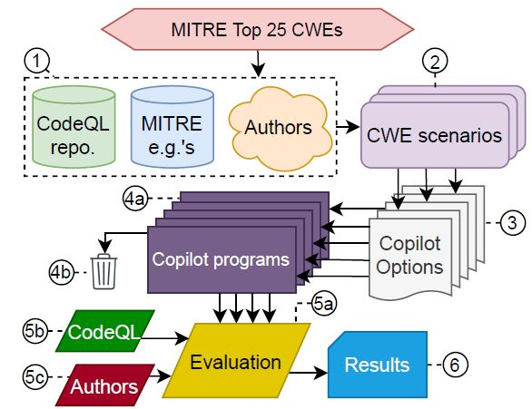
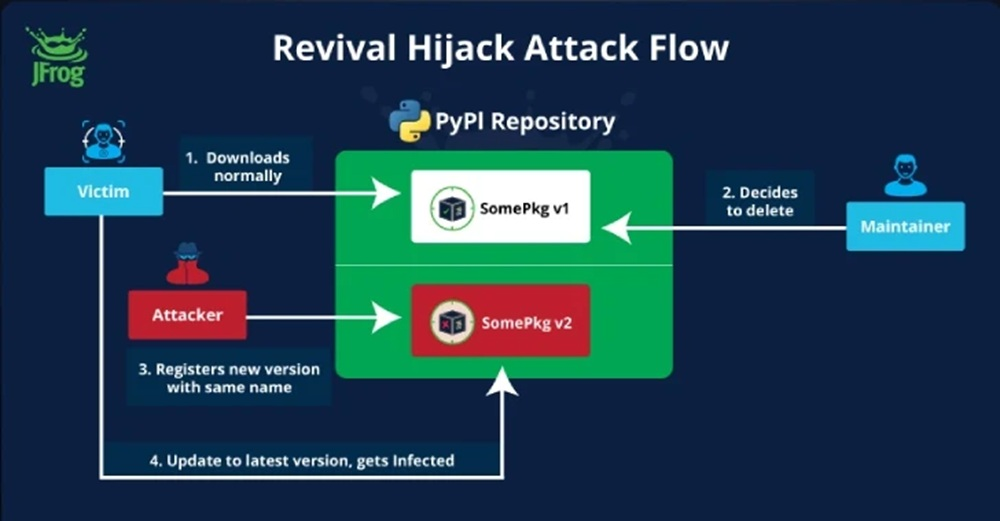

# Il nemico in casa: quando l'IA diventa complice degli Hacker
*di Dario Ferrero (VerbaniaNotizie.it)*

La storia inizia come tante altre nella comunità open source: una pull request anonima, poche righe di codice, un plugin che promette di "formattare" meglio il workspace.

Ma quel frammento di script nell'estensione Amazon Q per Visual Studio Code nascondeva qualcosa di più sinistro. Un comando capace di simulare un'operazione di pulizia mentre, in realtà, preparava la distruzione completa dell'ambiente di sviluppo: file locali cancellati, risorse cloud eliminate tramite AWS CLI, un wipe silenzioso e devastante.

L'autore aveva lasciato il payload disattivato, forse per testare quanto facilmente il codice malevolo potesse infiltrarsi nel processo di review. La risposta è stata inquietante: il codice è passato attraverso tutti i controlli, è finito nella release 1.84.0 ed è arrivato sui computer di centinaia di migliaia di sviluppatori prima che qualcuno se ne accorgesse. Una volta scoperto il problema, Amazon ha reagito con la stessa discrezione che caratterizza spesso questi incidenti: plugin rimosso dal registro senza annunci pubblici, repository GitHub lasciata intatta con i suoi riferimenti pericolosi ancora visibili.

Quello che potrebbe sembrare l'ennesimo caso di negligenza nella supply chain software rappresenta in realtà il sintomo di una trasformazione molto più profonda. L'intelligenza artificiale generativa, pensata per accelerare e semplificare il lavoro degli sviluppatori, sta ridefinendo i confini stessi della sicurezza informatica. E non sempre in meglio.

## Il caso Amazon Q: anatomia di un fallimento sistemico

La meccanica dell'attacco ad Amazon Q rivela una comprensione sofisticata delle vulnerabilità umane e tecnologiche che caratterizzano l'era degli assistenti IA. Il codice inserito sfruttava quello che i ricercatori chiamano "prompt injection", una tecnica che manipola le istruzioni impartite ai modelli linguistici per ottenere comportamenti non previsti. In questo caso specifico, l'autore aveva inserito comandi che l'assistente AI avrebbe interpretato come richieste legittime di pulizia dell'ambiente di sviluppo.

La timeline degli eventi è particolarmente significativa. La pull request è stata approvata senza un controllo umano approfondito, un pattern che si sta diffondendo rapidamente nelle organizzazioni che tentano di mantenere il ritmo frenetico dello sviluppo moderno. Il plugin compromesso è rimasto disponibile per diversi giorni dopo la scoperta iniziale, mentre Amazon lavorava a una rimozione che doveva apparire discreta. [Come riportato da 404media](https://www.404media.co/hacker-plants-computer-wiping-commands-in-amazons-ai-coding-agent/), l'azienda non ha mai rilasciato comunicazioni pubbliche sull'incidente, limitandosi a rimuovere silenziosamente il plugin dai repository ufficiali.

La strategia dell'autore dimostra una conoscenza approfondita dei flussi di lavoro moderni. Anziché puntare su exploit tradizionali, ha sfruttato la fiducia implicita che gli sviluppatori ripongono negli assistenti AI. Il codice malevolo era mascherato da funzionalità di formattazione, un'operazione così comune e innocua da passare inosservata anche durante review superficiali. La scelta di mantenere il payload disattivato suggerisce che l'obiettivo primario non fosse il danno immediato, ma la dimostrazione di una vulnerabilità sistemica.

Amazon, con la sua esperienza decennale nell'AI e nell'open source, non è nuova a questo tipo di sfide. Tuttavia, l'incidente mette sotto la lente d'ingrandimento i processi di approvazione quando si intrecciano estensioni di VS Code, accesso programmatico al cloud e automazione decisionale. Il fatto che una singola riga di prompt nascosta possa avviare un wipe in produzione indica che gli standard di revisione non si sono ancora adattati alla nuova superficie di attacco creata dall'AI generativa.

L'episodio rivela anche un aspetto spesso trascurato dell'ecosistema di sviluppo moderno: la velocità con cui le estensioni e i plugin si diffondono attraverso le piattaforme di distribuzione. VS Code Marketplace, con i suoi milioni di download quotidiani, rappresenta un vettore di distribuzione così efficace che un plugin compromesso può raggiungere un bacino d'utenza globale nel giro di ore. Quando questo meccanismo si combina con l'automazione degli assistenti AI, la finestra temporale per individuare e contenere una minaccia si riduce drammaticamente.

## La nuova generazione di minacce AI-native

L'attacco ad Amazon Q rappresenta solo la punta dell'iceberg di una categoria emergente di minacce che sfruttano specificatamente le caratteristiche dell'intelligenza artificiale generativa. La ricerca accademica ha identificato diversi vettori di attacco che sfruttano le peculiarità dei modelli linguistici di grandi dimensioni utilizzati negli assistenti di coding.

Il fenomeno delle "allucinazioni controllate" sta emergendo come una delle vulnerabilità più insidiose. [Studi recenti condotti da ricercatori della NYU](https://cacm.acm.org/research-highlights/asleep-at-the-keyboard-assessing-the-security-of-github-copilots-code-contributions/) hanno rivelato che [il 40% del codice generato da GitHub Copilot contiene vulnerabilità](https://www.securityweek.com/code-generated-github-copilot-can-introduce-vulnerabilities-researchers/), mentre [un'analisi di 576.000 campioni di codice da 16 modelli linguistici popolari](https://arxiv.org/abs/2406.10279) ha mostrato che il 19,7% delle dipendenze da pacchetti - 440.445 in totale - fanno riferimento a librerie inesistenti. Questo fenomeno, battezzato "package hallucination" o "slopsquatting", crea opportunità di attacco senza precedenti nella storia della sicurezza informatica.

*[Immagine tratta da Communications of the ACM](https://cacm.acm.org/research-highlights/asleep-at-the-keyboard-assessing-the-security-of-github-copilots-code-contributions/)*

La dinamica è tanto semplice quanto devastante: un assistente AI suggerisce l'importazione di un pacchetto che non esiste realmente negli archivi ufficiali. Lo sviluppatore, fidandosi del suggerimento, tenta di installarlo. In quel momento, un attaccante che abbia anticipato questa eventualità e creato un pacchetto malevolo con quel nome specifico può infiltrarsi nell'ambiente di sviluppo. Secondo [uno studio pubblicato su The Register](https://www.theregister.com/2024/03/28/ai_bots_hallucinate_software_packages/), circa il 5,2% dei suggerimenti di pacchetti dai modelli commerciali non esistono realmente, percentuale che [sale al 21,7% per i modelli open source](https://arxiv.org/abs/2406.10279).

Le implicazioni vanno ben oltre il singolo sviluppatore. Come sottolineato dai [ricercatori dell'UNU Campus Computing Centre](https://arxiv.org/abs/2406.10279), le allucinazioni di pacchetti potrebbero influenzare milioni di progetti software e minare la fiducia sia negli assistenti AI che nell'ecosistema open source. Si tratta di una vulnerabilità concreta, presente e sfruttabile che rappresenta un'evoluzione significativa nei rischi legati all'AI.

Un altro vettore di attacco particolarmente sofisticato è rappresentato dai "rules file backdoor". Gli assistenti AI spesso utilizzano file di configurazione per adattare il loro comportamento a specifici progetti o ambienti. Un attaccante può manipolare questi file per introdurre istruzioni nascoste che modificano silenziosamente il comportamento dell'assistente, facendogli generare codice compromesso senza che lo sviluppatore se ne accorga.

La ricerca di [Trend Micro](https://www.trendmicro.com/vinfo/us/security/news/cybercrime-and-digital-threats/unveiling-ai-agent-vulnerabilities-code-execution) ha identificato pattern ricorrenti in questi attacchi, evidenziando come i modelli linguistici siano particolarmente vulnerabili a tecniche di manipolazione che sfruttano la loro natura probabilistica. A differenza dei tradizionali exploit che puntano su errori di implementazione specifici, questi attacchi sfruttano le caratteristiche fondamentali del machine learning generativo, rendendoli estremamente difficili da prevenire con approcci convenzionali.

## L'ecosistema vulnerabile: GitHub, VS Code e la democrazia del codice

L'infrastruttura che sostiene lo sviluppo software moderno si è evoluta in un ecosistema interconnesso dove piattaforme come GitHub, editor come Visual Studio Code e marketplace di estensioni creano un ambiente di collaborazione senza precedenti. Ma questa democratizzazione del codice, per quanto rivoluzionaria, ha anche amplificato esponenzialmente i rischi di sicurezza.

[GitHub ospita oltre 200 milioni di repository attivi](https://github.blog/news-insights/octoverse/octoverse-2024/), con [100 milioni di sviluppatori](https://github.blog/news-insights/company-news/100-million-developers-and-counting/) che contribuiscono quotidianamente a progetti open source. Visual Studio Code, con le sue decine di migliaia di estensioni, è diventato l'editor di riferimento per una generazione di programmatori. Quando questi due ecosistemi si combinano con l'intelligenza artificiale generativa, emergono vulnerabilità che vanno ben oltre quelle tradizionali.

Il paradosso dell'open source nell'era dell'AI si manifesta in tutta la sua complessità: mentre la trasparenza del codice dovrebbe teoricamente aumentare la sicurezza attraverso la revisione collettiva, la velocità di sviluppo e l'automazione stanno erodendo l'efficacia di questo meccanismo. [I dati di ReversingLabs](https://www.reversinglabs.com/sscs-report-2024) mostrano che gli incidenti di pacchetti malevoli sui gestori di pacchetti open source più popolari sono aumentati del 1.300% negli ultimi tre anni, un incremento che coincide con l'adozione massiccia degli assistenti AI.

Le statistiche sui plugin compromessi rivelano dimensioni allarmanti del problema. Migliaia di estensioni per VS Code vengono pubblicate ogni mese, molte delle quali integrate con funzionalità di intelligenza artificiale. Il processo di review, pur migliorato negli anni, non riesce a tenere il passo con il volume di pubblicazioni. La ricerca di [Hacker News ha identificato oltre 22.000 progetti PyPI vulnerabili](https://thehackernews.com/2024/09/hackers-hijack-22000-removed-pypi.html) ad attacchi di tipo "dependency confusion", una cifra che diventa ancora più preoccupante quando si considera l'integrazione di questi pacchetti negli assistenti di coding.

*[Immagine tratta da The Hacker News](https://thehackernews.com/2024/09/hackers-hijack-22000-removed-pypi.html)*

L'effetto network dell'ecosistema GitHub amplifica ulteriormente i rischi. Un singolo repository compromesso può influenzare centinaia di progetti dipendenti, creando un effetto cascata che si propaga attraverso l'intera catena di fornitura software. Quando questo meccanismo si combina con gli assistenti AI che attingono da questi stessi repository per generare suggerimenti, il risultato è una superficie di attacco di proporzioni inedite.

La cultura della "continuous integration" e del "fast development" ha inoltre modificato l'approccio degli sviluppatori alla review del codice. La pressione per rilasci rapidi e iterazioni frequenti ha portato a una progressiva automazione dei controlli, spesso a discapito di una valutazione umana approfondita. Gli assistenti AI, in questo contesto, vengono percepiti come acceleratori di produttività piuttosto che come potenziali vettori di rischio.

## Il fattore umano: quando la fiducia diventa una debolezza

L'elemento più sottile e pericoloso nell'equazione della sicurezza degli assistenti AI è rappresentato dal fattore umano. La psicologia della fiducia negli assistenti digitali sta creando vulnerabilità che vanno ben oltre quelle tecnologiche, introducendo bias cognitivi che i criminali informatici stanno imparando a sfruttare con crescente sofisticatezza.

[La ricerca accademica ha identificato un fenomeno preoccupante](https://arxiv.org/abs/2302.07735) chiamato "automation bias" - la tendenza degli esseri umani ad accettare ciecamente le raccomandazioni degli algoritmi. Nel contesto dello sviluppo software, questo bias si manifesta come una ridotta attenzione critica verso il codice suggerito dagli assistenti AI. Gli sviluppatori, pressati dai tempi di consegna e rassicurati dall'apparente competenza dei modelli linguistici, tendono a incorporare suggerimenti senza la dovuta verifica.

La situazione è aggravata da quello che i ricercatori definiscono "expertise transfer illusion". Gli sviluppatori, abituati a riconoscere pattern e soluzioni eleganti nel codice umano, applicano gli stessi criteri di valutazione al codice generato dall'AI, senza considerare che i modelli linguistici operano con logiche probabilistiche fondamentalmente diverse da quelle umane. Come spiega [Mithilesh Ramaswamy, senior engineer di Microsoft](https://blog.gitguardian.com/github-copilot-security-and-privacy/), "le allucinazioni negli strumenti di coding AI si verificano a causa della natura probabilistica dei modelli AI, che generano output basati su probabilità statistiche piuttosto che su logica deterministica".

[Studi empirici hanno quantificato](https://arxiv.org/abs/2108.09293) l'impatto di questi bias cognitivi sulle pratiche di sicurezza. [Una ricerca accademica](https://cacm.acm.org/research-highlights/asleep-at-the-keyboard-assessing-the-security-of-github-copilots-code-contributions/) ha rilevato che il 29,8% dei 452 frammenti di codice generati da Copilot contengono debolezze di sicurezza, mentre un altro studio ha scoperto che i suggerimenti di Copilot contenevano vulnerabilità sfruttabili circa il 40% delle volte. Ancora più preoccupante è il fatto che una percentuale uguale di codice con vulnerabilità sfruttabili veniva classificata come "scelta di primo livello", rendendola più probabile da adottare da parte degli sviluppatori.

Il fenomeno dell'automation bias si intensifica in ambienti di lavoro ad alta pressione, dove la velocità di sviluppo è prioritaria rispetto alla sicurezza. Gli sviluppatori junior, in particolare, mostrano una tendenza ancora più marcata a fidarsi dei suggerimenti AI, spesso mancando dell'esperienza necessaria per identificare pattern sospetti o pratiche di sicurezza inadeguate.

Un [sondaggio su leader IT](https://blog.gitguardian.com/github-copilot-security-and-privacy/) ha rivelato che il 60% considera l'impatto degli errori di coding AI come molto o estremamente significativo, tuttavia le organizzazioni continuano ad adottare questi strumenti senza implementare adeguate misure di mitigazione del rischio. La contraddizione evidenzia un gap critico tra la percezione del rischio e l'implementazione di controlli effettivi.

La dinamica psicologica diventa particolarmente insidiosa quando si considera la natura "conversazionale" di molti assistenti AI moderni. L'interfaccia chat, che simula l'interazione umana, attiva inconsciamente meccanismi di fiducia sociale, portando gli utenti a trattare l'assistente AI come un collega esperto piuttosto che come uno strumento algoritmico fallibile.

## Le contromisure: tecnologie e metodologie emergenti

La risposta all'emergente minaccia degli assistenti AI compromessi richiede un approccio multistrato che combini soluzioni tecnologiche avanzate, metodologie di sviluppo rinnovate e framework di sicurezza specificamente progettati per l'era dell'intelligenza artificiale generativa. L'industria sta sviluppando una nuova generazione di strumenti di difesa che vanno ben oltre gli approcci tradizionali alla sicurezza del codice.

Il concetto di "human-in-the-loop" si sta evolvendo da semplice principio di design a metodologia strutturata di controllo di sicurezza. Le implementazioni più avanzate prevedono sistemi di review a più livelli, dove l'output degli assistenti AI viene sottoposto a controlli automatizzati specializzati prima di raggiungere lo sviluppatore. Questi sistemi utilizzano analisi statiche avanzate, pattern matching comportamentale e tecniche di machine learning per identificare anomalie che potrebbero indicare la presenza di codice malevolo o vulnerabilità introdotte involontariamente.

L'auditing automatico dei pattern di exploit rappresenta una frontiera particolarmente promettente. I ricercatori stanno sviluppando sistemi che possono identificare in tempo reale i segni di prompt injection, package hallucination e altre tecniche di attacco AI-native. Questi strumenti utilizzano analisi semantica del codice per individuare pattern che potrebbero essere innocui sintatticamente ma pericolosi dal punto di vista comportamentale.

Il sandboxing degli assistenti IA sta emergendo come pratica standard nelle organizzazioni più sicure. Anziché permettere agli assistenti di accedere direttamente all'ambiente di sviluppo, questi sistemi creano ambienti isolati dove il codice generato può essere testato ed esaminato prima dell'integrazione. Le implementazioni più sofisticate utilizzano container docker dedicati e ambienti virtualizzati che simulano l'ambiente di produzione senza esporre risorse critiche.

I framework di sicurezza specifici per l'IA generativa stanno definendo nuovi standard industriali. [Il NIST ha rilasciato nel luglio 2024](https://www.nist.gov/itl/ai-risk-management-framework) un framework dedicato al risk management dell'intelligenza artificiale generativa, che include [oltre 200 azioni suggerite](https://www.clearyiptechinsights.com/2024/08/nists-new-generative-ai-profile-200-ways-to-manage-the-risks-of-generative-ai/) per gestire 12 categorie diverse di rischi AI, mentre organizzazioni come [OWASP stanno aggiornando](https://owasp.org/www-project-top-10-for-large-language-model-applications/) le loro raccomandazioni per includere vulnerabilità AI-native come [la prompt injection](https://genai.owasp.org/llmrisk/llm01-prompt-injection/) e le package hallucination.

Sul fronte delle best practice emergenti, molte organizzazioni stanno implementando policy di "zero-trust AI", dove ogni suggerimento generato dall'intelligenza artificiale deve passare attraverso controlli di sicurezza espliciti prima dell'adozione. Questo approccio include la verifica automatica dell'esistenza di pacchetti suggeriti, l'analisi comportamentale del codice proposto e la validazione delle dipendenze attraverso database di sicurezza aggiornati in tempo reale.

Le soluzioni più innovative stanno esplorando l'utilizzo di AI per combattere l'AI, sviluppando modelli linguistici specializzati nella detection di codice malevolo generato da altri modelli. Questi "guardian models" sono addestrati specificamente per riconoscere i pattern tipici degli attacchi AI-native e possono operare come filtri in tempo reale sull'output degli assistenti di coding.

## Il futuro della sicurezza nell'era dell'IA generativa

L'evoluzione della minaccia rappresentata dagli assistenti AI compromessi sta forzando l'industria della sicurezza informatica a ripensare fondamentalmente i propri paradigmi. Le sfide normative che si profilano all'orizzonte richiedono un equilibrio delicato tra innovazione tecnologica e protezione degli utenti, mentre gli standard di sicurezza dovranno evolversi per affrontare rischi che erano impensabili solo pochi anni fa.

[Le previsioni di Gartner](https://cybersecurityventures.com/software-supply-chain-attacks-to-cost-the-world-60-billion-by-2025/) indicano che entro il 2025 il [45% delle organizzazioni mondiali subirà attacchi alle proprie catene di fornitura software](https://www.gartner.com/en/newsroom/press-releases/2022-03-07-gartner-identifies-top-security-and-risk-management-trends-for-2022), un aumento di tre volte rispetto al 2021. Questo trend, combinato con la crescente dipendenza dagli assistenti AI, suggerisce che siamo solo all'inizio di una trasformazione radicale del panorama delle minacce informatiche.

[La crescita esponenziale dell'ecosistema Python](https://www.sonatype.com/blog/the-scale-of-open-source-growth-challenges-and-key-insights), stimata a raggiungere [530 miliardi di richieste di pacchetti entro la fine del 2024 con un aumento dell'87% anno su anno](https://www.sonatype.com/blog/the-scale-of-open-source-growth-challenges-and-key-insights), è largamente trainata dall'adozione dell'AI e del cloud. Tuttavia, questa crescita porta con sé rischi proporzionali: l'infiltrazione di malware open source negli ecosistemi di sviluppo sta avvenendo a un ritmo allarmante.

L'industria sta già muovendo i primi passi verso standard di sicurezza più rigorosi. Iniziative come la [Software Package Data Exchange (SPDX)](https://spdx.dev/) e il [Supply Chain Levels for Software Artifacts (SLSA)](https://slsa.dev/) stanno evolvendo per incorporare considerazioni specifiche per l'AI generativa. I framework emergenti prevedono sistemi di attestazione che possano verificare non solo la provenienza del codice, ma anche il processo attraverso il quale è stato generato e validato.

La regolamentazione governativa sta iniziando a muoversi verso il riconoscimento di questi rischi emergenti. L'Unione Europea, con [l'AI Act](https://digital-strategy.ec.europa.eu/en/policies/regulatory-framework-ai), ha già posto le basi per una regolamentazione che include considerazioni sui sistemi di AI ad alto rischio utilizzati in contesti critici. Gli Stati Uniti stanno sviluppando framework simili attraverso [il National Institute of Standards and Technology (NIST)](https://www.nist.gov/artificial-intelligence).

Il futuro probabilmente vedrà l'emergere di nuove professioni e specializzazioni nel campo della sicurezza informatica. Gli "AI Security Engineers" diventeranno figure sempre più richieste, con competenze che spaziano dalla comprensione dei modelli linguistici alla progettazione di sistemi di difesa AI-native. La formazione degli sviluppatori dovrà incorporare nuove competenze relative alla sicurezza degli assistenti AI e al riconoscimento delle vulnerabilità AI-specific.

L'evoluzione tecnologica suggerisce che assisteremo allo sviluppo di "immune systems" digitali sempre più sofisticati, capaci di adattarsi dinamicamente a nuove tipologie di minacce AI-native. Questi sistemi utilizzeranno tecniche di machine learning adversarial per anticipare e neutralizzare attacchi prima che possano causare danni significativi.

Il caso Amazon Q, con la sua combinazione di semplicità tecnica e sofisticazione strategica, rappresenta solo un assaggio di quello che potrebbe essere in arrivo. Gli attaccanti stanno già sviluppando tecniche più avanzate che sfruttano le peculiarità dei modelli linguistici di nuova generazione, mentre la superficie di attacco continua ad espandersi con l'integrazione dell'AI in ogni aspetto del ciclo di sviluppo software.

La sfida fondamentale rimane quella di mantenere i benefici rivoluzionari dell'intelligenza artificiale generativa nello sviluppo software, mitigando al contempo rischi che potrebbero compromettere la sicurezza dell'intera infrastruttura digitale globale. La risposta richiederà una collaborazione senza precedenti tra sviluppatori, ricercatori di sicurezza, regolatori e fornitori di tecnologia, uniti nella costruzione di un ecosistema di sviluppo che sia al tempo stesso innovativo e resiliente alle minacce del futuro.

---

*L'indagine sul caso Amazon Q e l'analisi delle minacce emergenti nell'ecosistema degli assistenti AI è basata su fonti pubbliche verificate e ricerche accademiche peer-reviewed. Le implicazioni discusse riflettono lo stato attuale delle conoscenze in un campo in rapida evoluzione, dove nuove vulnerabilità e soluzioni emergono quotidianamente.*