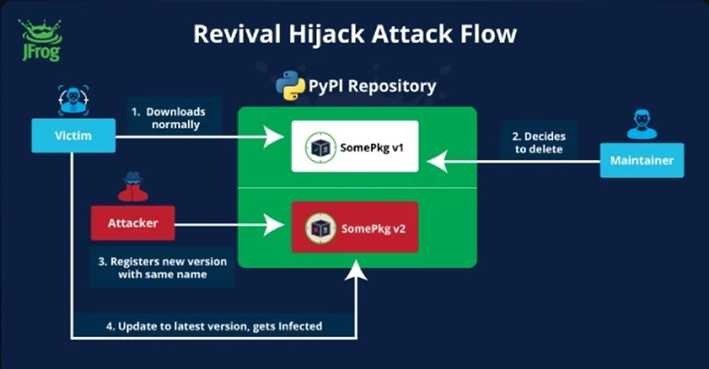

# El enemigo en casa: cuando la IA se convierte en cómplice de los hackers
*por Dario Ferrero (VerbaniaNotizie.it)*

La historia comienza como muchas otras en la comunidad de código abierto: una pull request anónima, unas pocas líneas de código, un plugin que promete "formatear mejor" el espacio de trabajo.

Pero ese fragmento de script en la extensión Amazon Q para Visual Studio Code ocultaba algo más siniestro. Un comando capaz de simular una operación de limpieza mientras, en realidad, preparaba la destrucción completa del entorno de desarrollo: archivos locales eliminados, recursos en la nube eliminados a través de AWS CLI, un borrado silencioso y devastador.

El autor había dejado el payload desactivado, quizás para probar con qué facilidad el código malicioso podía infiltrarse en el proceso de revisión. La respuesta fue inquietante: el código pasó todos los controles, terminó en la versión 1.84.0 y llegó a los ordenadores de cientos de miles de desarrolladores antes de que alguien se diera cuenta. Una vez descubierto el problema, Amazon reaccionó con la misma discreción que a menudo caracteriza estos incidentes: el plugin fue eliminado del registro sin anuncios públicos, y el repositorio de GitHub se dejó intacto con sus peligrosas referencias aún visibles.

Lo que podría parecer otro caso de negligencia en la cadena de suministro de software es en realidad un síntoma de una transformación mucho más profunda. La inteligencia artificial generativa, diseñada para acelerar y simplificar el trabajo de los desarrolladores, está redefiniendo los propios límites de la ciberseguridad. Y no siempre para mejor.

## El caso de Amazon Q: anatomía de un fallo sistémico

La mecánica del ataque a Amazon Q revela una comprensión sofisticada de las vulnerabilidades humanas y tecnológicas que caracterizan la era de los asistentes de IA. El código insertado explotaba lo que los investigadores llaman "inyección de prompt", una técnica que manipula las instrucciones dadas a los modelos de lenguaje para lograr comportamientos no previstos. En este caso específico, el autor había insertado comandos que el asistente de IA interpretaría como solicitudes legítimas para limpiar el entorno de desarrollo.

La cronología de los acontecimientos es particularmente significativa. La pull request fue aprobada sin una revisión humana exhaustiva, un patrón que se está extendiendo rápidamente en las organizaciones que intentan mantener el ritmo frenético del desarrollo moderno. El plugin comprometido permaneció disponible durante varios días después del descubrimiento inicial, mientras Amazon trabajaba en una eliminación discreta. [Según informó 404media](https://www.404media.co/hacker-plants-computer-wiping-commands-in-amazons-ai-coding-agent/), la empresa nunca emitió comunicaciones públicas sobre el incidente, limitándose a eliminar silenciosamente el plugin de los repositorios oficiales.

La estrategia del autor demuestra un profundo conocimiento de los flujos de trabajo modernos. En lugar de apuntar a exploits tradicionales, explotó la confianza implícita que los desarrolladores depositan en los asistentes de IA. El código malicioso estaba disfrazado de una función de formato, una operación tan común e inofensiva que pasó desapercibida incluso durante las revisiones superficiales. La elección de mantener el payload desactivado sugiere que el objetivo principal no era el daño inmediato, sino la demostración de una vulnerabilidad sistémica.

Amazon, con sus décadas de experiencia en IA y código abierto, no es ajena a este tipo de desafíos. Sin embargo, el incidente pone bajo el microscopio los procesos de aprobación cuando involucran extensiones de VS Code, acceso programático a la nube y toma de decisiones automatizada. El hecho de que una sola línea de prompt oculta pudiera desencadenar un borrado en producción indica que los estándares de revisión aún no se han adaptado a la nueva superficie de ataque creada por la IA generativa.

El episodio también revela un aspecto a menudo pasado por alto del ecosistema de desarrollo moderno: la velocidad a la que las extensiones y los plugins se propagan a través de las plataformas de distribución. El Marketplace de VS Code, con sus millones de descargas diarias, representa un vector de distribución tan eficaz que un plugin comprometido puede llegar a una base de usuarios global en cuestión de horas. Cuando este mecanismo se combina con la automatización de los asistentes de IA, la ventana de tiempo para detectar y contener una amenaza se reduce drásticamente.

## La nueva generación de amenazas nativas de la IA

El ataque a Amazon Q es solo la punta del iceberg de una categoría emergente de amenazas que explotan específicamente las características de la inteligencia artificial generativa. La investigación académica ha identificado varios vectores de ataque que aprovechan las peculiaridades de los grandes modelos de lenguaje utilizados en los asistentes de codificación.

El fenómeno de las "alucinaciones controladas" está surgiendo como una de las vulnerabilidades más insidiosas. [Estudios recientes de investigadores de la NYU](https://cacm.acm.org/research-highlights/asleep-at-the-keyboard-assessing-the-security-of-github-copilots-code-contributions/) han revelado que [el 40% del código generado por GitHub Copilot contiene vulnerabilidades](https://www.securityweek.com/code-generated-github-copilot-can-introduce-vulnerabilities-researchers/), mientras que [un análisis de 576,000 muestras de código de 16 modelos de lenguaje populares](https://arxiv.org/abs/2406.10279) mostró que el 19.7% de las dependencias de paquetes - 440,445 en total - hacen referencia a bibliotecas inexistentes. Este fenómeno, denominado "alucinación de paquetes" o "slopsquatting", crea oportunidades de ataque sin precedentes en la historia de la ciberseguridad.

*[Imagen de Communications of the ACM](https://cacm.acm.org/research-highlights/asleep-at-the-keyboard-assessing-the-security-of-github-copilots-code-contributions/)*

La dinámica es tan simple como devastadora: un asistente de IA sugiere importar un paquete que en realidad no existe en los repositorios oficiales. El desarrollador, confiando en la sugerencia, intenta instalarlo. En ese momento, un atacante que haya anticipado esta posibilidad y haya creado un paquete malicioso con ese nombre específico puede infiltrarse en el entorno de desarrollo. Según [un estudio publicado en The Register](https.theregister.com/2024/03/28/ai_bots_hallucinate_software_packages/), alrededor del 5.2% de las sugerencias de paquetes de los modelos comerciales no existen realmente, un porcentaje que [aumenta al 21.7% para los modelos de código abierto](https://arxiv.org/abs/2406.10279).

Las implicaciones van mucho más allá del desarrollador individual. Como destacaron [investigadores del Centro de Computación del Campus de la UNU](https://arxiv.org/abs/2406.10279), las alucinaciones de paquetes podrían afectar a millones de proyectos de software y socavar la confianza tanto en los asistentes de IA como en el ecosistema de código abierto. Se trata de una vulnerabilidad concreta, presente y explotable que representa una evolución significativa de los riesgos relacionados con la IA.

Otro vector de ataque particularmente sofisticado está representado por los "backdoors en archivos de reglas". Los asistentes de IA a menudo utilizan archivos de configuración para adaptar su comportamiento a proyectos o entornos específicos. Un atacante puede manipular estos archivos para introducir instrucciones ocultas que modifiquen silenciosamente el comportamiento del asistente, haciendo que genere código comprometido sin que el desarrollador se dé cuenta.

La investigación de [Trend Micro](https://www.trendmicro.com/vinfo/us/security/news/cybercrime-and-digital-threats/unveiling-ai-agent-vulnerabilities-code-execution) ha identificado patrones recurrentes en estos ataques, destacando cómo los modelos de lenguaje son particularmente vulnerables a técnicas de manipulación que explotan su naturaleza probabilística. A diferencia de los exploits tradicionales que se dirigen a errores de implementación específicos, estos ataques aprovechan las características fundamentales del aprendizaje automático generativo, lo que los hace extremadamente difíciles de prevenir con enfoques convencionales.

## El ecosistema vulnerable: GitHub, VS Code y la democracia del código

La infraestructura que soporta el desarrollo de software moderno ha evolucionado hacia un ecosistema interconectado donde plataformas como GitHub, editores como Visual Studio Code y mercados de extensiones crean un entorno de colaboración sin precedentes. Pero esta democratización del código, por muy revolucionaria que sea, también ha amplificado exponencialmente los riesgos de seguridad.

[GitHub alberga más de 200 millones de repositorios activos](https://github.blog/news-insights/octoverse/octoverse-2024/), con [100 millones de desarrolladores](https://github.blog/news-insights/company-news/100-million-developers-and-counting/) que contribuyen diariamente a proyectos de código abierto. Visual Studio Code, con sus decenas de miles de extensiones, se ha convertido en el editor de referencia para una generación de programadores. Cuando estos dos ecosistemas se combinan con la inteligencia artificial generativa, surgen vulnerabilidades que van mucho más allá de las tradicionales.

La paradoja del código abierto en la era de la IA se manifiesta en toda su complejidad: mientras que la transparencia del código debería teóricamente aumentar la seguridad a través de la revisión colectiva, la velocidad del desarrollo y la automatización están erosionando la eficacia de este mecanismo. [Datos de ReversingLabs](https://www.reversinglabs.com/sscs-report-2024) muestran que los incidentes de paquetes maliciosos en los gestores de paquetes de código abierto más populares han aumentado un 1,300% en los últimos tres años, un incremento que coincide con la adopción masiva de asistentes de IA.

Las estadísticas sobre plugins comprometidos revelan las alarmantes dimensiones del problema. Miles de extensiones para VS Code se publican cada mes, muchas de ellas integradas con funciones de inteligencia artificial. El proceso de revisión, aunque mejorado a lo largo de los años, no puede seguir el ritmo del volumen de publicaciones. La investigación de [Hacker News identificó más de 22,000 proyectos de PyPI vulnerables](https://thehackernews.com/2024/09/hackers-hijack-22000-removed-pypi.html) a ataques de "confusión de dependencias", una cifra que se vuelve aún más preocupante si se tiene en cuenta la integración de estos paquetes en los asistentes de codificación.

*[Imagen de The Hacker News](https://thehackernews.com/2024/09/hackers-hijack-22000-removed-pypi.html)*

El efecto de red del ecosistema de GitHub amplifica aún más los riesgos. Un solo repositorio comprometido puede afectar a cientos de proyectos dependientes, creando un efecto en cascada que se propaga por toda la cadena de suministro de software. Cuando este mecanismo se combina con asistentes de IA que extraen de estos mismos repositorios para generar sugerencias, el resultado es una superficie de ataque de proporciones sin precedentes.

La cultura de la "integración continua" y el "desarrollo rápido" también ha modificado el enfoque de los desarrolladores hacia la revisión de código. La presión por lanzamientos rápidos e iteraciones frecuentes ha llevado a una progresiva automatización de los controles, a menudo en detrimento de una evaluación humana exhaustiva. Los asistentes de IA, en este contexto, se perciben como aceleradores de la productividad en lugar de como vectores de riesgo potenciales.

## El factor humano: cuando la confianza se convierte en una debilidad

El elemento más sutil y peligroso en la ecuación de la seguridad de los asistentes de IA es el factor humano. La psicología de la confianza en los asistentes digitales está creando vulnerabilidades que van mucho más allá de las tecnológicas, introduciendo sesgos cognitivos que los ciberdelincuentes están aprendiendo a explotar con una sofisticación creciente.

[La investigación académica ha identificado un fenómeno preocupante](https://arxiv.org/abs/2302.07735) llamado "sesgo de automatización": la tendencia de los humanos a aceptar ciegamente las recomendaciones de los algoritmos. En el contexto del desarrollo de software, este sesgo se manifiesta como una menor atención crítica hacia el código sugerido por los asistentes de IA. Los desarrolladores, presionados por los plazos y tranquilizados por la aparente competencia de los modelos de lenguaje, tienden a incorporar sugerencias sin la debida verificación.

La situación se agrava por lo que los investigadores denominan la "ilusión de transferencia de experiencia". Los desarrolladores, acostumbrados a reconocer patrones y soluciones elegantes en el código humano, aplican los mismos criterios de evaluación al código generado por la IA, sin tener en cuenta que los modelos de lenguaje operan con lógicas probabilísticas fundamentalmente diferentes a las humanas. Como explica [Mithilesh Ramaswamy, ingeniero sénior de Microsoft](https://blog.gitguardian.com/github-copilot-security-and-privacy/), "las alucinaciones en las herramientas de codificación de IA se producen debido a la naturaleza probabilística de los modelos de IA, que generan resultados basados en probabilidades estadísticas en lugar de en una lógica determinista".

[Estudios empíricos han cuantificado](https://arxiv.org/abs/2108.09293) el impacto de estos sesgos cognitivos en las prácticas de seguridad. [Una investigación académica](https://cacm.acm.org/research-highlights/asleep-at-the-keyboard-assessing-the-security-of-github-copilots-code-contributions/) descubrió que el 29.8% de los 452 fragmentos de código generados por Copilot contienen debilidades de seguridad, mientras que otro estudio encontró que las sugerencias de Copilot contenían vulnerabilidades explotables aproximadamente el 40% de las veces. Aún más preocupante es el hecho de que un porcentaje igual de código con vulnerabilidades explotables se clasificó como "elección de primer nivel", lo que aumenta la probabilidad de que los desarrolladores lo adopten.

El fenómeno del sesgo de automatización se intensifica en entornos de trabajo de alta presión, donde la velocidad de desarrollo tiene prioridad sobre la seguridad. Los desarrolladores júnior, en particular, muestran una tendencia aún más marcada a confiar en las sugerencias de la IA, a menudo careciendo de la experiencia necesaria para identificar patrones sospechosos o prácticas de seguridad inadecuadas.

Una [encuesta a líderes de TI](https://blog.gitguardian.com/github-copilot-security-and-privacy/) reveló que el 60% considera que el impacto de los errores de codificación de la IA es muy o extremadamente significativo; sin embargo, las organizaciones siguen adoptando estas herramientas sin implementar medidas adecuadas de mitigación de riesgos. Esta contradicción pone de manifiesto una brecha crítica entre la percepción del riesgo y la implementación de controles efectivos.

La dinámica psicológica se vuelve particularmente insidiosa si se tiene en cuenta la naturaleza "conversacional" de muchos asistentes de IA modernos. La interfaz de chat, que simula la interacción humana, activa inconscientemente mecanismos de confianza social, lo que lleva a los usuarios a tratar al asistente de IA como un colega experto en lugar de como una herramienta algorítmica falible.

## Las contramedidas: tecnologías y metodologías emergentes

La respuesta a la amenaza emergente de los asistentes de IA comprometidos requiere un enfoque de múltiples capas que combine soluciones tecnológicas avanzadas, metodologías de desarrollo renovadas y marcos de seguridad diseñados específicamente para la era de la inteligencia artificial generativa. La industria está desarrollando una nueva generación de herramientas de defensa que van mucho más allá de los enfoques tradicionales de la seguridad del código.

El concepto de "humano en el bucle" está evolucionando de un simple principio de diseño a una metodología estructurada de control de seguridad. Las implementaciones más avanzadas prevén sistemas de revisión de varios niveles, donde el resultado de los asistentes de IA se somete a controles automatizados especializados antes de llegar al desarrollador. Estos sistemas utilizan análisis estáticos avanzados, coincidencia de patrones de comportamiento y técnicas de aprendizaje automático para identificar anomalías que podrían indicar la presencia de código malicioso o vulnerabilidades introducidas involuntariamente.

La auditoría automática de patrones de exploit representa una frontera particularmente prometedora. Los investigadores están desarrollando sistemas que pueden identificar en tiempo real los signos de inyección de prompt, alucinación de paquetes y otras técnicas de ataque nativas de la IA. Estas herramientas utilizan el análisis semántico del código para detectar patrones que podrían ser inofensivos sintácticamente pero peligrosos desde el punto de vista del comportamiento.

El sandboxing de los asistentes de IA se está convirtiendo en una práctica estándar en las organizaciones más seguras. En lugar de permitir que los asistentes accedan directamente al entorno de desarrollo, estos sistemas crean entornos aislados donde el código generado puede ser probado y examinado antes de su integración. Las implementaciones más sofisticadas utilizan contenedores Docker dedicados y entornos virtualizados que simulan el entorno de producción sin exponer recursos críticos.

Los marcos de seguridad específicos para la IA generativa están definiendo nuevos estándares industriales. [El NIST publicó en julio de 2024](https://www.nist.gov/itl/ai-risk-management-framework) un marco dedicado a la gestión de riesgos de la inteligencia artificial generativa, que incluye [más de 200 acciones sugeridas](https://www.clearyiptechinsights.com/2024/08/nists-new-generative-ai-profile-200-ways-to-manage-the-risks-of-generative-ai/) para gestionar 12 categorías diferentes de riesgos de la IA, mientras que organizaciones como [OWASP están actualizando](https://owasp.org/www-project-top-10-for-large-language-model-applications/) sus recomendaciones para incluir vulnerabilidades nativas de la IA como [la inyección de prompt](https://genai.owasp.org/llmrisk/llm01-prompt-injection/) y las alucinaciones de paquetes.

En el frente de las mejores prácticas emergentes, muchas organizaciones están implementando políticas de "IA de confianza cero", donde cada sugerencia generada por la inteligencia artificial debe pasar por controles de seguridad explícitos antes de su adopción. Este enfoque incluye la verificación automática de la existencia de los paquetes sugeridos, el análisis del comportamiento del código propuesto y la validación de las dependencias a través de bases de datos de seguridad actualizadas en tiempo real.

Las soluciones más innovadoras están explorando el uso de la IA para combatir a la IA, desarrollando modelos de lenguaje especializados en la detección de código malicioso generado por otros modelos. Estos "modelos guardianes" están entrenados específicamente para reconocer los patrones típicos de los ataques nativos de la IA y pueden operar como filtros en tiempo real sobre el resultado de los asistentes de codificación.

## El futuro de la seguridad en la era de la IA generativa

La evolución de la amenaza que representan los asistentes de IA comprometidos está obligando a la industria de la ciberseguridad a replantearse fundamentalmente sus paradigmas. Los desafíos normativos que se perfilan en el horizonte requieren un delicado equilibrio entre la innovación tecnológica y la protección de los usuarios, mientras que los estándares de seguridad deberán evolucionar para hacer frente a riesgos que eran impensables hace solo unos años.

[Las predicciones de Gartner](https://cybersecurityventures.com/software-supply-chain-attacks-to-cost-the-world-60-billion-by-2025/) indican que para 2025, [el 45% de las organizaciones de todo el mundo sufrirán ataques a sus cadenas de suministro de software](https://www.gartner.com/en/newsroom/press-releases/2022-03-07-gartner-identifies-top-security-and-risk-management-trends-for-2022), un aumento de tres veces en comparación con 2021. Esta tendencia, combinada con la creciente dependencia de los asistentes de IA, sugiere que solo estamos al principio de una transformación radical del panorama de las amenazas de ciberseguridad.

[El crecimiento exponencial del ecosistema de Python](https://www.sonatype.com/blog/the-scale-of-open-source-growth-challenges-and-key-insights), que se estima que alcanzará los [530 mil millones de solicitudes de paquetes a finales de 2024 con un aumento del 87% interanual](https://www.sonatype.com/blog/the-scale-of-open-source-growth-challenges-and-key-insights), está impulsado en gran medida por la adopción de la IA y la nube. Sin embargo, este crecimiento conlleva riesgos proporcionales: la infiltración de malware de código abierto en los ecosistemas de desarrollo se está produciendo a un ritmo alarmante.

La industria ya está dando los primeros pasos hacia estándares de seguridad más rigurosos. Iniciativas como el [Intercambio de Datos de Paquetes de Software (SPDX)](https://spdx.dev/) y los [Niveles de la Cadena de Suministro para Artefactos de Software (SLSA)](https://slsa.dev/) están evolucionando para incorporar consideraciones específicas para la IA generativa. Los marcos emergentes prevén sistemas de atestación que puedan verificar no solo la procedencia del código, sino también el proceso a través del cual fue generado y validado.

La regulación gubernamental está empezando a avanzar hacia el reconocimiento de estos riesgos emergentes. La Unión Europea, con [la Ley de IA](https://digital-strategy.ec.europa.eu/en/policies/regulatory-framework-ai), ya ha sentado las bases para una regulación que incluye consideraciones sobre los sistemas de IA de alto riesgo utilizados en contextos críticos. Estados Unidos está desarrollando marcos similares a través del [Instituto Nacional de Estándares y Tecnología (NIST)](https://www.nist.gov/artificial-intelligence).

Es probable que en el futuro surjan nuevas profesiones y especializaciones en el campo de la ciberseguridad. Los "ingenieros de seguridad de la IA" se convertirán en figuras cada vez más solicitadas, con competencias que van desde la comprensión de los modelos de lenguaje hasta el diseño de sistemas de defensa nativos de la IA. La formación de los desarrolladores deberá incorporar nuevas competencias relacionadas con la seguridad de los asistentes de IA y el reconocimiento de las vulnerabilidades específicas de la IA.

La evolución tecnológica sugiere que asistiremos al desarrollo de "sistemas inmunitarios" digitales cada vez más sofisticados, capaces de adaptarse dinámicamente a nuevos tipos de amenazas nativas de la IA. Estos sistemas utilizarán técnicas de aprendizaje automático adversario para anticipar y neutralizar ataques antes de que puedan causar un daño significativo.

El caso de Amazon Q, con su combinación de simplicidad técnica y sofisticación estratégica, es solo una muestra de lo que podría estar por venir. Los atacantes ya están desarrollando técnicas más avanzadas que explotan las peculiaridades de los modelos de lenguaje de nueva generación, mientras que la superficie de ataque sigue expandiéndose con la integración de la IA en todos los aspectos del ciclo de vida del desarrollo de software.

El reto fundamental sigue siendo mantener los beneficios revolucionarios de la inteligencia artificial generativa en el desarrollo de software, al tiempo que se mitigan los riesgos que podrían comprometer la seguridad de toda la infraestructura digital mundial. La respuesta requerirá una colaboración sin precedentes entre desarrolladores, investigadores de seguridad, reguladores y proveedores de tecnología, unidos en la construcción de un ecosistema de desarrollo que sea a la vez innovador y resistente a las amenazas del futuro.

---

*La investigación sobre el caso de Amazon Q y el análisis de las amenazas emergentes en el ecosistema de los asistentes de IA se basa en fuentes públicas verificadas e investigaciones académicas revisadas por pares. Las implicaciones discutidas reflejan el estado actual del conocimiento en un campo en rápida evolución, donde nuevas vulnerabilidades y soluciones surgen a diario.*
