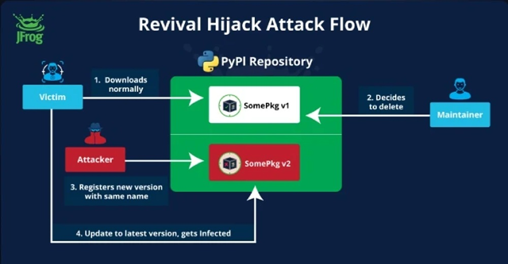

# Der Feind im Inneren: Wenn KI zum Komplizen von Hackern wird
*von Dario Ferrero (VerbaniaNotizie.it)*

Die Geschichte beginnt wie viele andere in der Open-Source-Community: ein anonymer Pull-Request, ein paar Zeilen Code, ein Plugin, das verspricht, den Arbeitsbereich "besser zu formatieren".

Aber dieses Skript-Fragment in der Amazon Q-Erweiterung für Visual Studio Code verbarg etwas viel Finstereres. Ein Befehl, der in der Lage war, eine Bereinigungsoperation zu simulieren, während er in Wirklichkeit die vollständige Zerstörung der Entwicklungsumgebung vorbereitete: lokale Dateien gelöscht, Cloud-Ressourcen über die AWS CLI entfernt, ein leiser und verheerender Wipe.

Der Autor hatte die Nutzlast deaktiviert gelassen, vielleicht um zu testen, wie leicht bösartiger Code den Überprüfungsprozess infiltrieren könnte. Die Antwort war beunruhigend: Der Code durchlief alle Prüfungen, landete in der Version 1.84.0 und erreichte die Computer von Hunderttausenden von Entwicklern, bevor es jemand bemerkte. Nachdem das Problem entdeckt wurde, reagierte Amazon mit der gleichen Diskretion, die solche Vorfälle oft kennzeichnet: Das Plugin wurde ohne öffentliche Ankündigungen aus dem Register entfernt, und das GitHub-Repository wurde mit seinen gefährlichen Referenzen intakt gelassen.

Was wie ein weiterer Fall von Fahrlässigkeit in der Software-Lieferkette erscheinen mag, ist in Wirklichkeit ein Symptom für eine viel tiefgreifendere Veränderung. Die generative künstliche Intelligenz, die entwickelt wurde, um die Arbeit von Entwicklern zu beschleunigen und zu vereinfachen, definiert die Grenzen der Cybersicherheit neu. Und das nicht immer zum Besseren.

## Der Fall Amazon Q: Anatomie eines systemischen Versagens

Die Mechanik des Angriffs auf Amazon Q offenbart ein ausgeklügeltes Verständnis der menschlichen und technologischen Schwachstellen, die die Ära der KI-Assistenten kennzeichnen. Der eingefügte Code nutzte das, was Forscher als "Prompt-Injektion" bezeichnen, eine Technik, die die Anweisungen an Sprachmodelle manipuliert, um unbeabsichtigte Verhaltensweisen zu erzielen. In diesem speziellen Fall hatte der Autor Befehle eingefügt, die der KI-Assistent als legitime Anfragen zur Bereinigung der Entwicklungsumgebung interpretieren würde.

Die Zeitleiste der Ereignisse ist besonders bedeutsam. Der Pull-Request wurde ohne gründliche menschliche Überprüfung genehmigt, ein Muster, das sich in Organisationen, die mit dem hektischen Tempo der modernen Entwicklung Schritt halten wollen, schnell verbreitet. Das kompromittierte Plugin blieb nach der ersten Entdeckung mehrere Tage lang verfügbar, während Amazon an einer diskreten Entfernung arbeitete. [Wie von 404media berichtet](https://www.404media.co/hacker-plants-computer-wiping-commands-in-amazons-ai-coding-agent/), hat das Unternehmen nie öffentliche Mitteilungen über den Vorfall veröffentlicht und sich darauf beschränkt, das Plugin stillschweigend aus den offiziellen Repositories zu entfernen.

Die Strategie des Autors zeigt ein tiefes Verständnis für moderne Arbeitsabläufe. Anstatt auf traditionelle Exploits abzuzielen, nutzte er das implizite Vertrauen, das Entwickler in KI-Assistenten setzen. Der bösartige Code war als Formatierungsfunktion getarnt, eine so häufige und harmlose Operation, dass sie selbst bei oberflächlichen Überprüfungen unbemerkt blieb. Die Entscheidung, die Nutzlast deaktiviert zu lassen, deutet darauf hin, dass das Hauptziel nicht der sofortige Schaden war, sondern der Nachweis einer systemischen Schwachstelle.

Amazon ist mit seiner jahrzehntelangen Erfahrung in den Bereichen KI und Open Source mit dieser Art von Herausforderung nicht unvertraut. Der Vorfall rückt jedoch die Genehmigungsprozesse ins Rampenlicht, wenn sie VS-Code-Erweiterungen, programmatischen Zugriff auf die Cloud und automatisierte Entscheidungsfindung umfassen. Die Tatsache, dass eine einzige versteckte Prompt-Zeile einen Wipe in der Produktion auslösen konnte, deutet darauf hin, dass die Überprüfungsstandards noch nicht an die neue Angriffsfläche angepasst wurden, die durch generative KI geschaffen wurde.

Der Vorfall offenbart auch einen oft übersehenen Aspekt des modernen Entwicklungsökosystems: die Geschwindigkeit, mit der sich Erweiterungen und Plugins über Vertriebsplattformen verbreiten. Der VS Code Marketplace ist mit seinen Millionen von täglichen Downloads ein so effektiver Vertriebsvektor, dass ein kompromittiertes Plugin innerhalb von Stunden eine globale Nutzerbasis erreichen kann. Wenn dieser Mechanismus mit der Automatisierung von KI-Assistenten kombiniert wird, verkürzt sich das Zeitfenster zur Erkennung und Eindämmung einer Bedrohung dramatisch.

## Die neue Generation von KI-nativen Bedrohungen

Der Angriff auf Amazon Q ist nur die Spitze des Eisbergs einer aufkommenden Kategorie von Bedrohungen, die gezielt die Eigenschaften der generativen künstlichen Intelligenz ausnutzen. Die akademische Forschung hat mehrere Angriffsvektoren identifiziert, die die Besonderheiten der großen Sprachmodelle ausnutzen, die in Programmierassistenten verwendet werden.

Das Phänomen der "kontrollierten Halluzinationen" entwickelt sich zu einer der heimtückischsten Schwachstellen. [Jüngste Studien von Forschern der NYU](https://cacm.acm.org/research-highlights/asleep-at-the-keyboard-assessing-the-security-of-github-copilots-code-contributions/) haben ergeben, dass [40 % des von GitHub Copilot generierten Codes Schwachstellen enthält](https://www.securityweek.com/code-generated-github-copilot-can-introduce-vulnerabilities-researchers/), während [eine Analyse von 576.000 Code-Beispielen aus 16 beliebten Sprachmodellen](https://arxiv.org/abs/2406.10279) zeigte, dass 19,7 % der Paketabhängigkeiten - insgesamt 440.445 - auf nicht existierende Bibliotheken verweisen. Dieses Phänomen, das als "Paket-Halluzination" oder "Slopsquatting" bezeichnet wird, schafft Angriffsmöglichkeiten, die in der Geschichte der Cybersicherheit beispiellos sind.

*[Bild aus Communications of the ACM](https://cacm.acm.org/research-highlights/asleep-at-the-keyboard-assessing-the-security-of-github-copilots-code-contributions/)*

Die Dynamik ist ebenso einfach wie verheerend: Ein KI-Assistent schlägt den Import eines Pakets vor, das in den offiziellen Repositories nicht wirklich existiert. Der Entwickler, der dem Vorschlag vertraut, versucht, es zu installieren. In diesem Moment kann ein Angreifer, der diese Möglichkeit vorausgesehen und ein bösartiges Paket mit diesem spezifischen Namen erstellt hat, in die Entwicklungsumgebung eindringen. Laut [einer in The Register veröffentlichten Studie](https://www.theregister.com/2024/03/28/ai_bots_hallucinate_software_packages/) existieren etwa 5,2 % der Paketvorschläge von kommerziellen Modellen nicht wirklich, ein Prozentsatz, der [bei Open-Source-Modellen auf 21,7 % ansteigt](https://arxiv.org/abs/2406.10279).

Die Auswirkungen gehen weit über den einzelnen Entwickler hinaus. Wie von [Forschern des UNU Campus Computing Centre](https://arxiv.org/abs/2406.10279) hervorgehoben, könnten Paket-Halluzinationen Millionen von Softwareprojekten beeinträchtigen und das Vertrauen sowohl in KI-Assistenten als auch in das Open-Source-Ökosystem untergraben. Dies ist eine konkrete, präsente und ausnutzbare Schwachstelle, die eine signifikante Weiterentwicklung der KI-bezogenen Risiken darstellt.

Ein weiterer besonders ausgeklügelter Angriffsvektor sind "Regeldatei-Backdoors". KI-Assistenten verwenden häufig Konfigurationsdateien, um ihr Verhalten an bestimmte Projekte oder Umgebungen anzupassen. Ein Angreifer kann diese Dateien manipulieren, um versteckte Anweisungen einzufügen, die das Verhalten des Assistenten leise ändern und ihn dazu veranlassen, kompromittierten Code zu generieren, ohne dass der Entwickler es bemerkt.

Die Forschung von [Trend Micro](https://www.trendmicro.com/vinfo/us/security/news/cybercrime-and-digital-threats/unveiling-ai-agent-vulnerabilities-code-execution) hat wiederkehrende Muster bei diesen Angriffen identifiziert und hervorgehoben, wie Sprachmodelle besonders anfällig für Manipulationstechniken sind, die ihre probabilistische Natur ausnutzen. Im Gegensatz zu traditionellen Exploits, die auf spezifische Implementierungsfehler abzielen, nutzen diese Angriffe die grundlegenden Eigenschaften des generativen maschinellen Lernens, was es extrem schwierig macht, sie mit konventionellen Ansätzen zu verhindern.

## Das verwundbare Ökosystem: GitHub, VS Code und die Demokratie des Codes

Die Infrastruktur, die die moderne Softwareentwicklung unterstützt, hat sich zu einem vernetzten Ökosystem entwickelt, in dem Plattformen wie GitHub, Editoren wie Visual Studio Code und Erweiterungsmarktplätze eine beispiellose Umgebung für die Zusammenarbeit schaffen. Aber diese Demokratisierung des Codes, so revolutionär sie auch ist, hat auch die Sicherheitsrisiken exponentiell verstärkt.

[GitHub beherbergt über 200 Millionen aktive Repositories](https://github.blog/news-insights/octoverse/octoverse-2024/), mit [100 Millionen Entwicklern](https://github.blog/news-insights/company-news/100-million-developers-and-counting/), die täglich zu Open-Source-Projekten beitragen. Visual Studio Code ist mit seinen Zehntausenden von Erweiterungen zum bevorzugten Editor für eine Generation von Programmierern geworden. Wenn diese beiden Ökosysteme mit generativer künstlicher Intelligenz kombiniert werden, entstehen Schwachstellen, die weit über die traditionellen hinausgehen.

Das Paradoxon von Open Source im KI-Zeitalter manifestiert sich in seiner ganzen Komplexität: Während die Transparenz des Codes theoretisch die Sicherheit durch kollektive Überprüfung erhöhen sollte, untergraben die Entwicklungsgeschwindigkeit und die Automatisierung die Wirksamkeit dieses Mechanismus. [Daten von ReversingLabs](https.www.reversinglabs.com/sscs-report-2024) zeigen, dass die Vorfälle mit bösartigen Paketen bei den beliebtesten Open-Source-Paketmanagern in den letzten drei Jahren um 1.300 % zugenommen haben, ein Anstieg, der mit der massiven Einführung von KI-Assistenten zusammenfällt.

Statistiken über kompromittierte Plugins zeigen die alarmierenden Ausmaße des Problems. Tausende von Erweiterungen für VS Code werden jeden Monat veröffentlicht, viele davon mit Funktionen der künstlichen Intelligenz integriert. Der Überprüfungsprozess kann, obwohl er im Laufe der Jahre verbessert wurde, mit dem Veröffentlichungsvolumen nicht Schritt halten. Eine Untersuchung von [Hacker News identifizierte über 22.000 anfällige PyPI-Projekte](https://thehackernews.com/2024/09/hackers-hijack-22000-removed-pypi.html) für Angriffe vom Typ "Dependency Confusion", eine Zahl, die noch besorgniserregender wird, wenn man die Integration dieser Pakete in Programmierassistenten bedenkt.

*[Bild aus The Hacker News](https://thehackernews.com/2024/09/hackers-hijack-22000-removed-pypi.html)*

Der Netzwerkeffekt des GitHub-Ökosystems verstärkt die Risiken weiter. Ein einziges kompromittiertes Repository kann Hunderte von abhängigen Projekten beeinflussen und einen Kaskadeneffekt erzeugen, der sich durch die gesamte Software-Lieferkette ausbreitet. Wenn dieser Mechanismus mit KI-Assistenten kombiniert wird, die aus denselben Repositories Vorschläge generieren, ist das Ergebnis eine Angriffsfläche von beispiellosen Ausmaßen.

Die Kultur der "kontinuierlichen Integration" und der "schnellen Entwicklung" hat auch den Ansatz der Entwickler zur Code-Überprüfung verändert. Der Druck auf schnelle Veröffentlichungen und häufige Iterationen hat zu einer fortschreitenden Automatisierung der Kontrollen geführt, oft auf Kosten einer gründlichen menschlichen Bewertung. KI-Assistenten werden in diesem Kontext eher als Produktivitätsbeschleuniger denn als potenzielle Risikovektoren wahrgenommen.

## Der menschliche Faktor: Wenn Vertrauen zur Schwäche wird

Das subtilste und gefährlichste Element in der Sicherheitsgleichung von KI-Assistenten ist der menschliche Faktor. Die Psychologie des Vertrauens in digitale Assistenten schafft Schwachstellen, die weit über die technologischen hinausgehen und kognitive Verzerrungen einführen, die Cyberkriminelle mit zunehmender Raffinesse auszunutzen lernen.

[Die akademische Forschung hat ein besorgniserregendes Phänomen identifiziert](https://arxiv.org/abs/2302.07735), das als "Automatisierungsbias" bezeichnet wird - die Tendenz des Menschen, die Empfehlungen von Algorithmen blind zu akzeptieren. Im Kontext der Softwareentwicklung manifestiert sich dieser Bias als verringerte kritische Aufmerksamkeit gegenüber dem von KI-Assistenten vorgeschlagenen Code. Entwickler, die unter Zeitdruck stehen und durch die scheinbare Kompetenz von Sprachmodellen beruhigt sind, neigen dazu, Vorschläge ohne die gebotene Überprüfung zu übernehmen.

Die Situation wird durch das, was Forscher als "Expertise-Transfer-Illusion" bezeichnen, verschärft. Entwickler, die daran gewöhnt sind, elegante Muster und Lösungen in menschlichem Code zu erkennen, wenden dieselben Bewertungskriterien auf KI-generierten Code an, ohne zu berücksichtigen, dass Sprachmodelle mit probabilistischen Logiken arbeiten, die sich grundlegend von menschlichen unterscheiden. Wie [Mithilesh Ramaswamy, ein leitender Ingenieur bei Microsoft, erklärt](https://blog.gitguardian.com/github-copilot-security-and-privacy/), "treten Halluzinationen in KI-Codierungswerkzeugen aufgrund der probabilistischen Natur von KI-Modellen auf, die Ausgaben auf der Grundlage statistischer Wahrscheinlichkeiten und nicht auf der Grundlage deterministischer Logik generieren."

[Empirische Studien haben die Auswirkungen](https://arxiv.org/abs/2108.09293) dieser kognitiven Verzerrungen auf Sicherheitspraktiken quantifiziert. [Eine akademische Untersuchung](https://cacm.acm.org/research-highlights/asleep-at-the-keyboard-assessing-the-security-of-github-copilots-code-contributions/) ergab, dass 29,8 % der 452 von Copilot generierten Code-Schnipsel Sicherheitsschwächen aufweisen, während eine andere Studie feststellte, dass die Vorschläge von Copilot in etwa 40 % der Fälle ausnutzbare Schwachstellen enthielten. Noch besorgniserregender ist die Tatsache, dass ein gleicher Prozentsatz des Codes mit ausnutzbaren Schwachstellen als "erste Wahl" eingestuft wurde, was die Wahrscheinlichkeit erhöht, dass er von Entwicklern übernommen wird.

Das Phänomen des Automatisierungsbias verstärkt sich in Arbeitsumgebungen mit hohem Druck, in denen die Entwicklungsgeschwindigkeit Vorrang vor der Sicherheit hat. Insbesondere junge Entwickler zeigen eine noch ausgeprägtere Tendenz, KI-Vorschlägen zu vertrauen, da ihnen oft die Erfahrung fehlt, um verdächtige Muster oder unangemessene Sicherheitspraktiken zu erkennen.

Eine [Umfrage unter IT-Führungskräften](https://blog.gitguardian.com/github-copilot-security-and-privacy/) ergab, dass 60 % die Auswirkungen von KI-Codierungsfehlern als sehr oder äußerst signifikant betrachten, doch die Unternehmen setzen diese Tools weiterhin ein, ohne angemessene Risikominderungsmaßnahmen zu ergreifen. Dieser Widerspruch verdeutlicht eine kritische Lücke zwischen der Risikowahrnehmung und der Umsetzung wirksamer Kontrollen.

Die psychologische Dynamik wird besonders heimtückisch, wenn man die "konversationelle" Natur vieler moderner KI-Assistenten berücksichtigt. Die Chat-Schnittstelle, die menschliche Interaktion simuliert, aktiviert unbewusst soziale Vertrauensmechanismen und verleitet die Benutzer dazu, den KI-Assistenten als erfahrenen Kollegen und nicht als fehlbares algorithmisches Werkzeug zu behandeln.

## Gegenmaßnahmen: aufkommende Technologien und Methoden

Die Reaktion auf die aufkommende Bedrohung durch kompromittierte KI-Assistenten erfordert einen vielschichtigen Ansatz, der fortschrittliche technologische Lösungen, erneuerte Entwicklungsmethoden und speziell für das Zeitalter der generativen künstlichen Intelligenz entwickelte Sicherheits-Frameworks kombiniert. Die Branche entwickelt eine neue Generation von Verteidigungswerkzeugen, die weit über traditionelle Ansätze zur Codesicherheit hinausgehen.

Das Konzept des "Human-in-the-Loop" entwickelt sich von einem einfachen Designprinzip zu einer strukturierten Methodik der Sicherheitskontrolle. Die fortschrittlichsten Implementierungen sehen mehrstufige Überprüfungssysteme vor, bei denen die Ausgabe von KI-Assistenten spezialisierten automatisierten Prüfungen unterzogen wird, bevor sie den Entwickler erreicht. Diese Systeme verwenden fortschrittliche statische Analysen, Verhaltensmustervergleiche und maschinelles Lernen, um Anomalien zu identifizieren, die auf das Vorhandensein von bösartigem Code oder unbeabsichtigt eingeführten Schwachstellen hindeuten könnten.

Die automatische Überprüfung von Exploit-Mustern stellt eine besonders vielversprechende Grenze dar. Forscher entwickeln Systeme, die Anzeichen von Prompt-Injektion, Paket-Halluzination und anderen KI-nativen Angriffstechniken in Echtzeit erkennen können. Diese Tools verwenden eine semantische Code-Analyse, um Muster zu erkennen, die syntaktisch harmlos, aber aus verhaltensmäßiger Sicht gefährlich sein könnten.

Das Sandboxing von KI-Assistenten entwickelt sich in den sichersten Organisationen zur Standardpraxis. Anstatt den Assistenten direkten Zugriff auf die Entwicklungsumgebung zu gewähren, erstellen diese Systeme isolierte Umgebungen, in denen der generierte Code vor der Integration getestet und untersucht werden kann. Die anspruchsvollsten Implementierungen verwenden dedizierte Docker-Container und virtualisierte Umgebungen, die die Produktionsumgebung simulieren, ohne kritische Ressourcen freizulegen.

Sicherheits-Frameworks, die speziell für generative KI entwickelt wurden, definieren neue Industriestandards. [Das NIST hat im Juli 2024](https://www.nist.gov/itl/ai-risk-management-framework) ein Framework für das Risikomanagement generativer künstlicher Intelligenz veröffentlicht, das [über 200 vorgeschlagene Maßnahmen](https://www.clearyiptechinsights.com/2024/08/nists-new-generative-ai-profile-200-ways-to-manage-the-risks-of-generative-ai/) zur Bewältigung von 12 verschiedenen Kategorien von KI-Risiken enthält, während Organisationen wie [OWASP ihre Empfehlungen aktualisieren](https://owasp.org/www-project-top-10-for-large-language-model-applications/), um KI-native Schwachstellen wie [Prompt-Injektion](https://genai.owasp.org/llmrisk/llm01-prompt-injection/) und Paket-Halluzinationen einzubeziehen.

An der Front der aufkommenden Best Practices implementieren viele Organisationen "Zero-Trust-KI"-Richtlinien, bei denen jeder von künstlicher Intelligenz generierte Vorschlag vor der Annahme explizite Sicherheitsprüfungen durchlaufen muss. Dieser Ansatz umfasst die automatische Überprüfung der Existenz vorgeschlagener Pakete, die Verhaltensanalyse des vorgeschlagenen Codes und die Validierung von Abhängigkeiten durch in Echtzeit aktualisierte Sicherheitsdatenbanken.

Die innovativsten Lösungen erforschen den Einsatz von KI zur Bekämpfung von KI und entwickeln spezialisierte Sprachmodelle zur Erkennung von bösartigem Code, der von anderen Modellen generiert wurde. Diese "Wächtermodelle" sind speziell darauf trainiert, die typischen Muster von KI-nativen Angriffen zu erkennen und können als Echtzeitfilter für die Ausgabe von Programmierassistenten fungieren.

## Die Zukunft der Sicherheit im Zeitalter der generativen KI

Die Entwicklung der Bedrohung durch kompromittierte KI-Assistenten zwingt die Cybersicherheitsbranche, ihre Paradigmen grundlegend zu überdenken. Die sich abzeichnenden regulatorischen Herausforderungen erfordern ein empfindliches Gleichgewicht zwischen technologischer Innovation und Benutzerschutz, während sich die Sicherheitsstandards weiterentwickeln müssen, um Risiken zu begegnen, die noch vor wenigen Jahren undenkbar waren.

[Die Prognosen von Gartner](https://cybersecurityventures.com/software-supply-chain-attacks-to-cost-the-world-60-billion-by-2025/) deuten darauf hin, dass bis 2025 [45 % der Unternehmen weltweit Angriffe auf ihre Software-Lieferketten erleiden werden](https://www.gartner.com/en/newsroom/press-releases/2022-03-07-gartner-identifies-top-security-and-risk-management-trends-for-2022), eine Verdreifachung im Vergleich zu 2021. Dieser Trend, kombiniert mit der wachsenden Abhängigkeit von KI-Assistenten, deutet darauf hin, dass wir erst am Anfang einer radikalen Transformation der Cybersicherheits-Bedrohungslandschaft stehen.

[Das exponentielle Wachstum des Python-Ökosystems](https://www.sonatype.com/blog/the-scale-of-open-source-growth-challenges-and-key-insights), das bis Ende 2024 voraussichtlich [530 Milliarden Paketanfragen erreichen wird, mit einem Anstieg von 87 % gegenüber dem Vorjahr](https://www.sonatype.com/blog/the-scale-of-open-source-growth-challenges-and-key-insights), wird maßgeblich durch die Einführung von KI und Cloud vorangetrieben. Dieses Wachstum birgt jedoch proportionale Risiken: Die Infiltration von Open-Source-Malware in Entwicklungsökosysteme erfolgt in alarmierendem Tempo.

Die Branche unternimmt bereits die ersten Schritte in Richtung strengerer Sicherheitsstandards. Initiativen wie der [Software Package Data Exchange (SPDX)](https://spdx.dev/) und die [Supply Chain Levels for Software Artifacts (SLSA)](https://slsa.dev/) entwickeln sich weiter, um spezifische Überlegungen für generative KI zu berücksichtigen. Aufkommende Frameworks sehen Bescheinigungssysteme vor, die nicht nur die Herkunft des Codes, sondern auch den Prozess, durch den er generiert und validiert wurde, überprüfen können.

Die staatliche Regulierung beginnt, sich auf die Anerkennung dieser aufkommenden Risiken zuzubewegen. Die Europäische Union hat mit dem [KI-Gesetz](https://digital-strategy.ec.europa.eu/en/policies/regulatory-framework-ai) bereits die Grundlagen für eine Regulierung gelegt, die Überlegungen zu Hochrisiko-KI-Systemen in kritischen Kontexten einschließt. Die Vereinigten Staaten entwickeln ähnliche Frameworks über das [National Institute of Standards and Technology (NIST)](https://www.nist.gov/artificial-intelligence).

Die Zukunft wird wahrscheinlich die Entstehung neuer Berufe und Spezialisierungen im Bereich der Cybersicherheit sehen. "KI-Sicherheitsingenieure" werden zu immer gefragteren Persönlichkeiten, deren Fähigkeiten von der Verständigung von Sprachmodellen bis zur Gestaltung von KI-nativen Verteidigungssystemen reichen. Die Ausbildung von Entwicklern muss neue Fähigkeiten in Bezug auf die Sicherheit von KI-Assistenten und die Erkennung von KI-spezifischen Schwachstellen umfassen.

Die technologische Entwicklung deutet darauf hin, dass wir die Entwicklung immer ausgefeilterer digitaler "Immunsysteme" erleben werden, die in der Lage sind, sich dynamisch an neue Arten von KI-nativen Bedrohungen anzupassen. Diese Systeme werden adversariales maschinelles Lernen einsetzen, um Angriffe zu antizipieren und zu neutralisieren, bevor sie erheblichen Schaden anrichten können.

Der Fall Amazon Q mit seiner Kombination aus technischer Einfachheit und strategischer Raffinesse ist nur ein Vorgeschmack auf das, was uns bevorstehen könnte. Angreifer entwickeln bereits fortschrittlichere Techniken, die die Besonderheiten von Sprachmodellen der nächsten Generation ausnutzen, während sich die Angriffsfläche mit der Integration von KI in jeden Aspekt des Softwareentwicklungszyklus weiter ausdehnt.

Die grundlegende Herausforderung bleibt, die revolutionären Vorteile der generativen künstlichen Intelligenz in der Softwareentwicklung zu erhalten und gleichzeitig Risiken zu mindern, die die Sicherheit der gesamten globalen digitalen Infrastruktur gefährden könnten. Die Antwort erfordert eine beispiellose Zusammenarbeit zwischen Entwicklern, Sicherheitsforschern, Regulierungsbehörden und Technologieanbietern, die gemeinsam ein Entwicklungsumfeld aufbauen, das sowohl innovativ als auch widerstandsfähig gegenüber den Bedrohungen der Zukunft ist.

---

*Die Untersuchung des Falles Amazon Q und die Analyse der aufkommenden Bedrohungen im Ökosystem der KI-Assistenten basieren auf verifizierten öffentlichen Quellen und von Fachleuten begutachteten akademischen Forschungen. Die diskutierten Implikationen spiegeln den aktuellen Wissensstand in einem sich schnell entwickelnden Bereich wider, in dem täglich neue Schwachstellen und Lösungen entstehen.*
