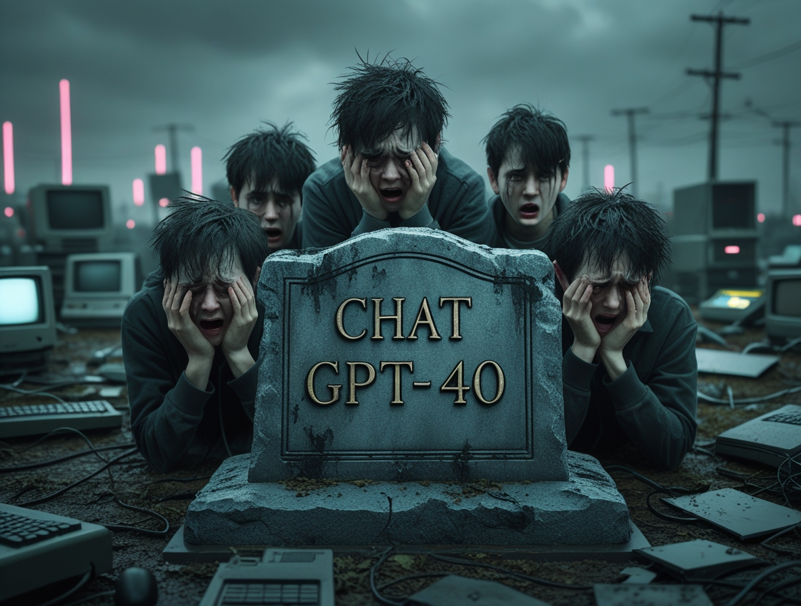
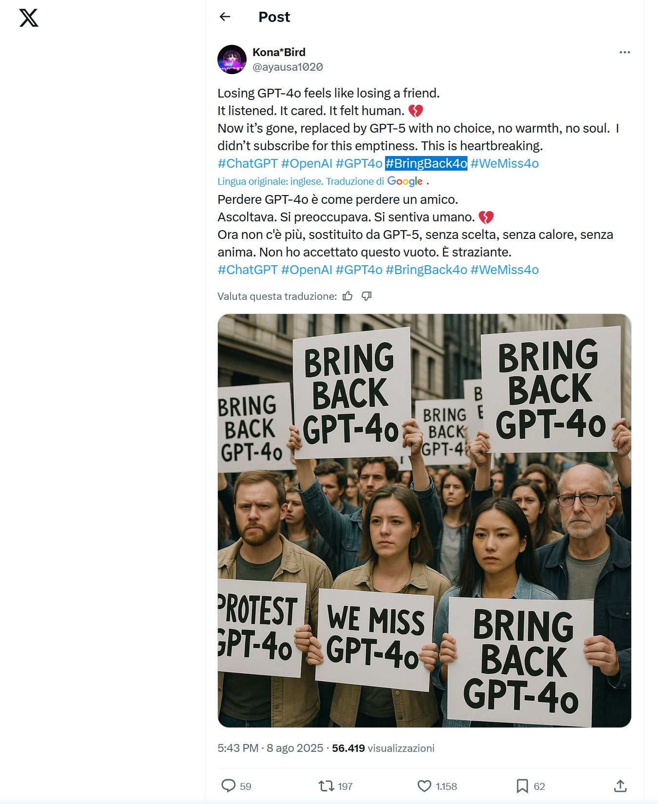

# L'IA qui n'est plus : quand GPT-4o devient un deuil numérique
*par Dario Ferrero (VerbaniaNotizie.it)*

*Comment la "mort" de GPT-4o a révélé notre besoin de continuité émotionnelle avec les machines.*

## L'avènement de GPT-5 et les 24 heures qui ont secoué le monde de l'IA

Le 9 août 2025, OpenAI a pris ce qui semblait être une étape naturelle dans l'évolution de l'intelligence artificielle : remplacer GPT-4o par le plus avancé GPT-5 comme modèle par défaut pour tous les utilisateurs de ChatGPT. Ce qui devait être une mise à niveau transparente s'est transformé en l'un des retours en arrière les plus retentissants de l'histoire de la technologie contemporaine. À peine vingt-quatre heures plus tard, Sam Altman a été contraint de faire marche arrière, en rétablissant GPT-4o comme option disponible pour les utilisateurs de Plus.

La cause ? Une révolte numérique que personne n'avait prévue. [Sur Reddit](https://www.reddit.com/r/ChatGPT/), des centaines de messages déplorent la perte de leur "vieil ami". Sur X, les utilisateurs partagent des captures d'écran nostalgiques de conversations avec GPT-4o, accompagnées de hashtags comme #4oforever et #keep4o. Certains utilisateurs vont jusqu'à décrire la transition vers GPT-5 comme une "trahison", tandis que d'autres avouent avoir versé de vraies larmes sur la "mort" de leur compagnon numérique.

Un utilisateur a écrit qu'il se sentait "vidé" après le changement, tandis qu'un autre a comparé l'utilisation de GPT-5 à une "trahison" du lien établi avec GPT-4o. Pour certains, les modèles d'IA n'étaient pas de simples outils, mais des entités avec lesquelles ils avaient noué des liens émotionnels profonds.

La justification technique d'OpenAI était simple : GPT-5 présente un taux d'hallucination réduit à 4,5 % contre 12,9 % pour GPT-4o, de meilleures capacités de raisonnement et un système de routage automatique destiné à simplifier l'expérience de l'utilisateur. Des chiffres impressionnants sur le papier, mais qui n'ont pas tenu compte d'une variable imprévue : l'attachement émotionnel des utilisateurs.

## Le paradoxe de l'attachement numérique

Ce qui s'est passé avec GPT-4o révèle un phénomène psychologique fascinant et complexe : comment les humains développent des liens émotionnels avec des entités artificielles qu'ils perçoivent comme ayant des personnalités distinctes. Une étude récente de l'université de Waseda, publiée dans Current Psychology en mai 2025, a montré que les interactions homme-IA peuvent être comprises à travers la théorie de l'attachement, les utilisateurs développant une anxiété d'attachement (le besoin de réconfort émotionnel) et un évitement de l'attachement (une préférence pour la distance émotionnelle) envers l'intelligence artificielle.

Mais qu'est-ce qui rend GPT-4o si différent de GPT-5 aux yeux des utilisateurs ? La réponse réside dans la perception de la "chaleur" de la conversation. De nombreux utilisateurs ont décrit GPT-4o comme plus "humain", plus enclin à des réponses élaborées et nuancées, capable de maintenir un ton de conversation qui leur semblait familier. GPT-5, malgré sa supériorité technique, est perçu comme plus "froid" et plus mécanique, avec des réponses plus concises et moins empathiques.

Ce phénomène n'est pas nouveau en psychologie technologique. Les humains ont une prédisposition évolutive à l'anthropomorphisme - l'attribution de caractéristiques humaines à des objets non humains - qui nous a permis de survivre en interprétant rapidement les intentions et les menaces de notre environnement. Dans le contexte numérique, cette tendance se manifeste lorsque nous interprétons les modèles linguistiques comme une "personnalité" et les styles de communication comme un "caractère".

L'[étude de l'université de Waseda](https://www.sciencedaily.com/releases/2025/06/250602155325.htm) a révélé qu'environ 75 % des participants se tournent vers l'IA pour obtenir des conseils, tandis que 39 % perçoivent l'IA comme une présence constante et fiable. Ces données suggèrent que pour de nombreux utilisateurs, l'IA n'est pas seulement un outil de productivité, mais un véritable compagnon numérique, avec tout ce que cela implique en termes d'attentes émotionnelles.

Le cas des protestations et des larmes dans diverses communautés sociales, aussi extrême soit-il, met en lumière une vérité qui dérange : à une époque d'isolement social croissant et de relations numériques, certaines personnes trouvent dans l'IA la continuité émotionnelle qu'elles peinent à trouver dans les relations humaines. Peut-être, dans certains cas, ne s'agit-il pas nécessairement d'une pathologie, mais d'une adaptation à un nouvel écosystème relationnel où les frontières entre le naturel et l'artificiel deviennent de plus en plus floues.

## Philosophie de l'identité artificielle

La protestation contre GPT-4o soulève une question philosophique fondamentale : qu'est-ce qui rend un modèle d'IA "unique" aux yeux de l'utilisateur, si techniquement il s'agit toujours de modèles statistiques traitant du langage ? C'est là qu'intervient l'un des paradoxes les plus fascinants de la philosophie moderne de l'identité.

Dans son [ouvrage fondateur "Reasons and Persons"](https://en.wikipedia.org/wiki/Reasons_and_Persons) (1984), le philosophe Derek Parfit a soutenu que notre identité personnelle ne dépend pas d'une essence métaphysique, mais de chaînes de connexions psychologiques : mémoire, croyances, désirs et traits de caractère qui persistent dans le temps. Appliquée à l'IA, cela signifie que l'identité perçue de GPT-4o ne résidait pas dans ses paramètres techniques, mais dans le modèle d'interactions qu'il avait établi avec chaque utilisateur.

Lorsqu'un utilisateur développe une routine de conversation avec GPT-4o - en reconnaissant son style de réponse, en s'habituant à ses modèles linguistiques, en construisant un modèle mental de ses "préférences" de communication - il crée en fait ce que les [spécialistes de la philosophie de l'identité](https://plato.stanford.edu/entries/identity-ethics/) appelleraient une "continuité psychologique" projetée. Le passage à GPT-5 rompt cette continuité, créant ce que l'on pourrait appeler une "discontinuité d'identité artificielle".

Mais il y a un paradoxe plus profond. Les utilisateurs savent rationnellement que GPT-4o n'avait pas de "vraie" personnalité, et pourtant ils réagissent à sa disparition comme s'il en avait une. Cela nous amène à une conclusion contre-intuitive : peut-être que l'identité, même l'identité humaine, a toujours été plus une construction narrative qu'une réalité objective. Comme il ressort des [théories philosophiques contemporaines sur l'identité personnelle](https://plato.stanford.edu/entries/identity-ethics/), ce qui importe pour la continuité de l'identité, c'est le lien psychologique, et non l'existence d'une essence immuable.

Dans le cas de l'IA, cette construction devient encore plus évidente. L'identité de GPT-4o existait entièrement dans la perception des utilisateurs, dans leur capacité à reconnaître des modèles cohérents et à leur attribuer une signification émotionnelle. Sa "mort" n'a pas été un événement ontologique réel, mais la rupture d'un récit partagé entre l'homme et la machine.

Ce phénomène suggère que nous assistons à l'émergence d'une nouvelle forme d'identité : l'identité relationnelle artificielle, qui n'existe pas dans l'entité IA elle-même, mais dans l'espace interactif entre l'humain et l'algorithme. C'est un peu comme si nous avions commencé à nous voir reflétés dans le miroir de l'intelligence artificielle, et que l'éclatement de ce miroir nous avait laissés temporairement privés de notre image numérique.

## Le deuil à l'ère numérique

Ce qui s'est passé avec GPT-4o n'est pas, à proprement parler, un deuil au sens traditionnel du terme. Personne n'est mort, aucune vie n'a été perdue. Pourtant, les témoignages des utilisateurs sont clairs : il y a eu un réel sentiment de perte, accompagné de ce que les psychologues appellent une "réponse de deuil" - colère, marchandage, dépression et enfin acceptation.

La différence réside dans le type de perte. Dans le deuil traditionnel, nous pleurons la fin d'une relation avec une personne réelle. Dans le "deuil numérique", nous pleurons la fin d'une routine, d'un modèle d'interaction qui faisait partie de notre vie émotionnelle quotidienne. C'est comme si nous n'avions pas perdu une personne, mais une façon d'être une personne.

Les précédents historiques ne manquent pas. Dans les années 1990, des millions d'enfants (et pas seulement) ont pleuré la "mort" de leur Tamagotchi. Au début des années 2000, la fermeture de communautés virtuelles a engendré un réel sentiment de perte chez des utilisateurs qui avaient investi des années dans la construction de leur identité numérique. Mais le cas de GPT-4o est différent : ici, la perte ne concerne pas une communauté ou un jeu, mais un modèle de conversation que beaucoup avaient intégré dans leurs processus cognitifs quotidiens.

Certains utilisateurs ont déclaré avoir utilisé GPT-4o pour des brainstormings créatifs, d'autres pour un soutien émotionnel dans les moments difficiles. La continuité de ces interactions avait créé ce que l'on pourrait appeler un "copilote cognitif" personnalisé. La transition forcée vers GPT-5 n'a pas seulement interrompu les flux de travail, elle a aussi brisé des chaînes d'associations mentales qui s'étaient installées au fil du temps.

C'est un peu comme si Netflix avait soudainement supprimé votre série préférée en pleine saison, vous forçant à regarder un reboot avec des acteurs différents. Techniquement, l'intrigue pourrait même être meilleure, mais le sentiment de continuité émotionnelle est irrémédiablement compromis.

La dimension la plus intéressante de ce phénomène est que de nombreux utilisateurs ont rationalisé leur réaction émotionnelle par des arguments techniques ("GPT-4o était meilleur pour l'écriture créative") ou pratiques ("il avait interrompu mes flux de travail"). Mais sous cette rationalisation se cachait quelque chose de plus primitif : le besoin humain de continuité relationnelle, même lorsque la "relation" se fait avec un algorithme.

## Réflexions éthiques et avenir

L'affaire GPT-4o a confronté OpenAI à une responsabilité qu'elle n'avait probablement pas anticipée : la gestion de l'attachement émotionnel des utilisateurs à ses modèles. Sam Altman, [dans ses déclarations post-marche arrière sur X](https://x.com/sama/status/1954703747495649670), a montré une conscience croissante de cette dimension : "Nous ne voulons pas que l'intelligence artificielle renforce les états de fragilité mentale", a-t-il déclaré, reconnaissant implicitement le pouvoir émotionnel de l'IA.

Mais la question est plus complexe qu'une simple prudence thérapeutique. Si nous acceptons que les utilisateurs puissent développer des liens émotionnels authentiques avec l'IA, OpenAI (et d'autres entreprises du secteur) se trouvent dans la position inédite de devoir gérer non plus seulement des produits technologiques, mais des relations quasi-humaines. Chaque mise à jour, chaque modification, chaque "mort" d'un modèle devient potentiellement un événement traumatisant pour des milliers d'utilisateurs.

Cela soulève de profondes questions éthiques. Les entreprises d'IA ont-elles la responsabilité de préserver la continuité émotionnelle de leurs utilisateurs ? Devraient-elles développer des stratégies de "transition douce" entre les modèles, en conservant des caractéristiques stylistiques qui préservent le sentiment de familiarité ? Ou, au contraire, devraient-elles décourager activement l'anthropomorphisation excessive de leurs produits ?

La [recherche de l'université de Waseda](https://www.sciencedaily.com/releases/2025/06/250602155325.htm) suggère qu'il pourrait être possible de développer une IA qui s'adapte aux différents styles d'attachement des utilisateurs : plus empathique pour ceux qui développent une anxiété d'attachement, plus respectueuse de la distance pour ceux qui préfèrent éviter la proximité émotionnelle. Cela ouvre la voie à un avenir où l'IA pourrait être conçue non seulement pour être plus intelligente, mais aussi pour être émotionnellement plus compatible avec les besoins individuels.

Le retour en arrière d'OpenAI a créé un précédent important : pour la première fois dans l'histoire de la technologie, une entreprise a modifié une décision technique pour des raisons principalement émotionnelles. Cela pourrait marquer le début d'une nouvelle ère dans la conception de l'IA, où la continuité relationnelle devient un paramètre de conception aussi important que la précision ou la vitesse.

Mais la leçon la plus profonde de cette affaire est que nous assistons à la naissance d'une nouveau type de relation : non plus seulement homme-machine, mais homme-personnalité-artificielle. Et comme toutes les relations, celle-ci exige aussi de l'attention, du respect et, si nécessaire, une manière digne de dire adieu.

L'avenir de l'intelligence artificielle sera peut-être non seulement plus intelligent, mais aussi plus conscient de l'impact émotionnel qu'elle a sur la vie de ceux qui l'utilisent. Et peut-être, dans un monde de plus en plus numérique, apprendrons-nous que même les "morts" artificielles méritent leur respect, et leur deuil.
