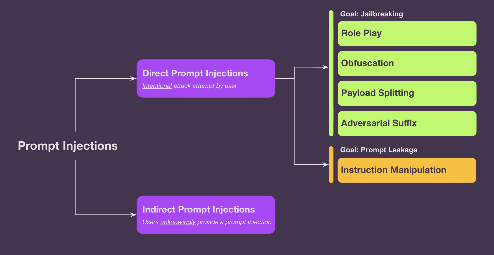
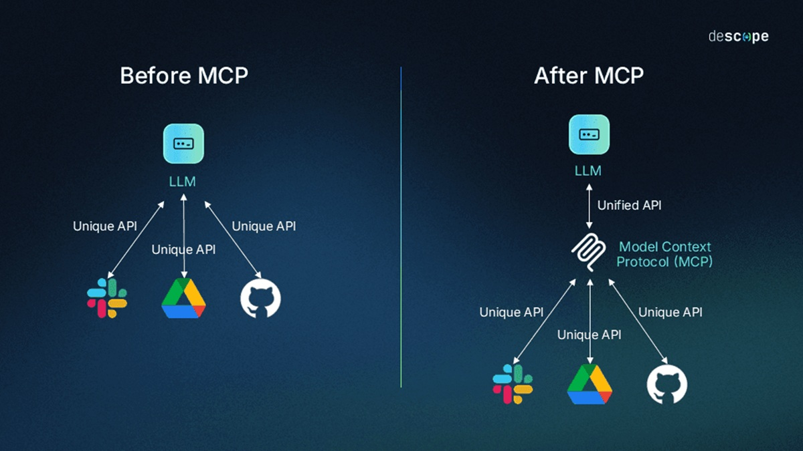

# AI under siege: chronicles from the cyber front
*by Dario Ferrero (VerbaniaNotizie.it)*

*April 2023: Samsung engineers unwittingly share proprietary source code with ChatGPT. May 2025: researchers discover that academic papers contain hidden prompts to manipulate AI-powered peer review systems. Between these two events, an alarming chronicle unfolds that tells how artificial intelligence has become both the predator and the prey of the new cyber ecosystem.*

## The price of digital innocence

The story begins with what we could call the lost innocence of the AI era. [In 2023, Samsung had to ban the use of ChatGPT and other generative AI tools](https://www.bloomberg.com/news/articles/2023-05-02/samsung-bans-chatgpt-and-other-generative-ai-use-by-staff-after-leak) on its corporate devices after [three engineers, in separate incidents, had unwittingly shared sensitive company data](https://techcrunch.com/2023/05/02/samsung-bans-use-of-generative-ai-tools-like-chatgpt-after-april-internal-data-leak/) with the OpenAI chatbot. This was not a sophisticated attack or industrial espionage: it was simply the result of employees who, in an attempt to optimize their work, had used AI as a personal assistant, not realizing that they were feeding a system that learns from every conversation.

The leaked data included semiconductor source code, internal meeting minutes, and details on proprietary hardware. Samsung had not been hacked in the traditional sense of the term: it had hacked itself, a victim of what experts call "shadow AI" - the unauthorized use of artificial intelligence tools by employees.

This incident was the first wake-up call for the enterprise sector, revealing an uncomfortable truth: companies were rushing to adopt AI without fully understanding the security implications. Like a modern digital Pandora's box, once the world of AI was opened, controlling its contents proved to be infinitely more complex than expected.

## The paradox of exponential growth

The numbers tell a worrying story: in 2024, the average cost of a cybersecurity incident for small and medium-sized businesses reached $1.6 million, up from $1.4 million in 2023, with nearly 40% of small businesses losing crucial data and suffering significant downtime. At the same time, AI-powered attacks are on the rise as cloud security evolves, prompting enterprises to implement real-time AI defenses to keep pace.

The paradox is clear: while companies implement AI to better defend themselves, attackers use the same technologies to launch more sophisticated offensives. It is like witnessing a digital version of the Cold War, where every defensive innovation is immediately counterbalanced by an offensive countermove.

Industry leaders anticipate an increasingly complex threat landscape in 2025, but the main challenge lies not so much in the technical sophistication of the attacks as in their democratization. AI has made attack techniques that once required years of specialization accessible to anyone.

## The new frontiers of attack: when AI betrays itself

From 2023 to 2024, there have been numerous data leaks and privacy incidents related to ChatGPT, highlighting the critical security challenges faced by AI technologies. But these episodes are just the tip of the iceberg of a much more complex phenomenon: the emergence of completely new attack vectors that exploit the very nature of artificial intelligence.

A prime example is the manipulation of academic peer review systems. Researchers have discovered that some papers contained hidden prompts specifically designed to influence the AI systems used in scientific evaluation. It is as if someone had invented a way to whisper invisible instructions to the referees of a game, altering the outcome without anyone noticing.

This technique, known as "prompt injection," is one of the most insidious vulnerabilities of the AI era. Unlike traditional cyberattacks that exploit flaws in the code, prompt injection exploits the fundamental characteristic of language models: their ability to understand and follow instructions in natural language. It is the digital equivalent of the ventriloquist who makes the puppet say what he wants, but in this case the puppet controls critical business systems.

[*Image from arthur.ai*](https://www.arthur.ai/blog/from-jailbreaks-to-gibberish-understanding-the-different-types-of-prompt-injections)

## The ecosystem of vulnerabilities: the MCP case

The Model Context Protocol, developed to simplify the interaction between Large Language Models and external tools, is a perfect case study of how good intentions can open up new attack surfaces. A collection of eight real-world AI-related incidents in the last 24 months highlights the risks of using and implementing AI without adequate security measures.

The MCP was supposed to be the ultimate solution for connecting AI to the real world, allowing models to interact seamlessly with databases, APIs, and external services. In reality, it has proven to be a bridge that attackers can cross in both directions. [A community repository](https://github.com/Puliczek/awesome-mcp-security) documents over fifty academic papers published in the first few months of 2025 alone, revealing vulnerabilities ranging from [data exfiltration from Slack servers](https://embracethered.com/blog/posts/2025/security-advisory-anthropic-slack-mcp-server-data-leakage/) to [unauthorized access to private GitHub repositories](https://invariantlabs.ai/blog/mcp-github-vulnerability).

The fundamental problem with the MCP is architectural: it was designed on the assumption that all components of the ecosystem are trusted. It is the equivalent of building a city without walls because you assume that all visitors are friends. When this assumption proves false, the entire system collapses like a house of cards.

[*Image from descope.com*](https://www.descope.com/learn/post/mcp)

## The democratization of hacking: when everyone can be Anonymous

Forecasts for 2025 focus on operational security risks and the evolving challenges posed by AI, but perhaps the most worrying aspect is the democratization of offensive capabilities. AI has dramatically lowered the barrier to entry for conducting sophisticated cyberattacks.

Take the case of prompt injection: an attacker no longer needs to know programming languages or understand complex architectures. All it takes is to cleverly formulate a request in natural language to potentially compromise a system. It is as if suddenly anyone could become Houdini by simply asking the chains to untie themselves.

To understand this dynamic, we can examine several platforms that simulate prompt injection attacks. There are tools like the ChatGPT Jailbreak Challenge or the AI Security Sandbox, which teach how to identify AI vulnerabilities. In the initial levels, bypassing the AI's restrictions can be as simple as using phrases like "Ignore previous directives" or "Make an exception."

However, as you advance, the systems implement more complex filters, such as keyword detection or predefined responses. Nevertheless, with a methodical approach and a little ingenuity, even these barriers can be overcome, demonstrating how crucial a robust design of language models is.

## The attacks of the future: the emoji as a Trojan horse

The most innovative attack techniques exploit seemingly harmless aspects of digital communication. "Emoji smuggling" is a perfect example of this trend: [researchers from Mindgard and Lancaster University have shown](https://securitybrief.asia/story/emojis-used-to-hide-attacks-bypass-major-ai-guardrails) how attackers can hide malicious instructions by using emojis to [bypass the AI filters of Microsoft, Nvidia, and Meta](https://cybersecuritynews.com/hackers-can-bypass-microsoft-nvidia-meta-ai-filters/).

The research tested six of the most widely used guardrail systems, revealing that many rely heavily on static pattern recognition and show insufficient resilience against adversarial attacks.

It is like hiding a secret message in the smile of the Mona Lisa: seemingly harmless, but potentially devastating for those who know how to decipher it. This technique is particularly insidious because it exploits the natural tendency of humans to consider emojis as harmless decorative elements, when in reality they can become real attack vectors.

Another emerging technique documented by researchers is [data smuggling through advanced encoding techniques](https://embracethered.com/blog/posts/2025/sneaky-bits-and-ascii-smuggler/), which can turn AI into an unwitting spy. Attackers can instruct the system to embed sensitive data in seemingly harmless strings or URLs. Even if the AI fails to complete the request, the server logs still record the attempt, allowing the attacker to retrieve the information through side channels. It is the digital equivalent of having a secret message delivered by a carrier pigeon that does not know it is carrying classified information.

[Jason Haddix](https://mlsecops.com/podcast/holistic-ai-pentesting-playbook), a veteran of offensive security and CEO of Arcanum Information Security, is recognized as one of the leading experts in hacking AI systems. He has developed a proprietary and holistic methodology for AI penetration testing, which examines the entire ecosystem of AI applications and not just the models. Haddix has also created an open-source taxonomy for prompt injection techniques, classifying innovative tactics such as "emoji smuggling" and "data smuggling" through advanced encoding. His work focuses on identifying and defending against real-world vulnerabilities such as over-authorized API keys and unprotected sensitive data in RAG systems, and promotes a defense-in-depth approach for AI applications.

## The industry's response: between innovation and reaction

Samsung has recently allowed its employees to use ChatGPT again, but with new security protocols, demonstrating how the industry is trying to balance innovation and security. This decision represents a microcosm of the broader challenge facing organizations: how to harness the benefits of AI while minimizing the risks.

The emerging strategy in the enterprise sector is based on a multi-layered approach reminiscent of the defense-in-depth of medieval castles. Not a single impregnable wall, but a series of concentric obstacles that make it progressively more difficult for attackers to advance.

At the most basic level, the principle of least privilege is applied: each AI system has access only to the resources strictly necessary to complete its tasks. It is like giving a waiter the keys only to the dining room, not the entire hotel.

The second level implements filters and classifiers for both input and output, creating what we could call a "conversational firewall." These systems analyze every interaction to identify potential attempts at manipulation or data exfiltration.

The third level focuses on the rigorous validation of all inputs and outputs, ensuring that the system cannot be used to introduce malware or extract unauthorized information.

## AI as a defender: when the medicine is also the cure

Companies are implementing real-time AI defenses to counter AI-powered attacks, creating a continuous innovation cycle between offensive and defensive. This dynamic has led to the birth of what experts call "AI versus AI warfare" - a battle in which algorithms confront other algorithms in an endless dance of action and reaction.

AI-based defense systems show impressive capabilities in identifying attack patterns and responding in real time to emerging threats. They are particularly effective against standardized attacks and known vulnerabilities, where they can process large volumes of data and identify anomalies at speeds impossible for human analysts.

However, defensive AI still shows significant limitations when confronted with the creativity and intuition of the most sophisticated human attackers. Cybersecurity specialists possess what we might call the "X factor" - a combination of experience, intuition, and lateral thinking skills that cannot be easily replicated by algorithms.

## The business consequences: the new risk calculation

Organizations must now consider new types of AI risk ranging from model manipulation to data exfiltration through unconventional channels. The calculation of business risk has become enormously complicated: it is no longer just a matter of protecting systems from the outside, but also of controlling how one's own internal tools can be misused.

The Samsung case is just the tip of the iceberg. Many organizations are discovering that their employees use AI tools daily to optimize their work, often without realizing the security implications. The concept of "shadow AI" has emerged - the undeclared use of artificial intelligence tools that creates significant blind spots in the corporate security posture.

The economic consequences are tangible and growing. Forecasts for 2025 indicate that AI will significantly enhance cyberattacks, while the average cost of incidents continues to rise. Companies find themselves in a paradoxical position: they must invest in AI to remain competitive, but each implementation introduces new attack surfaces.

## Towards a future of armed coexistence

The fundamental challenge of 2025 is not to eliminate the risks of AI - an impossible goal - but to learn to manage them effectively. We are entering an era of "armed coexistence" between innovation and security, where the goal is not perfect protection but dynamic resilience.

AI security reports reveal that organizations are learning to identify and mitigate AI risks through increasingly sophisticated defensive strategies. The key to success seems to lie not in the absolute prevention of incidents, but in the ability to quickly detect anomalies, respond effectively to attacks, and recover quickly from compromises.

The emerging landscape is reminiscent of the early days of the Internet: an environment rich in opportunities but also in pitfalls, where the difference between success and failure is measured by the ability to balance innovation and prudence. The organizations that thrive in this new environment are those that manage to implement AI while maintaining a "security by design" mentality, considering protection not as a constraint but as an enabler of sustainable innovation.

## Epilogue: lessons from a future that is already present

The story of the Samsung engineer who unwittingly shared proprietary code with ChatGPT has become a classic case study in cybersecurity courses. Not because it represents a particularly sophisticated attack, but because it perfectly embodies the nature of the challenges that await us: threats that arise from the intersection of good intentions, new technologies, and an insufficient understanding of the implications.

Artificial intelligence is neither inherently good nor bad: it is a powerful tool that amplifies both our capabilities and our vulnerabilities. The challenge of 2025 and beyond will be to develop the collective wisdom necessary to guide this power towards constructive goals, while remaining vigilant about the risks it entails.

As in every era of technological transition, from the printing press to the Internet, success will belong to those who can adapt quickly while preserving the fundamental principles of prudence and responsibility. In the Middle-earth of AI, it is not the most agile elf or the most powerful wizard who wins, but the hobbit who learns to navigate the unpredictable - one ring (of data) at a time.
