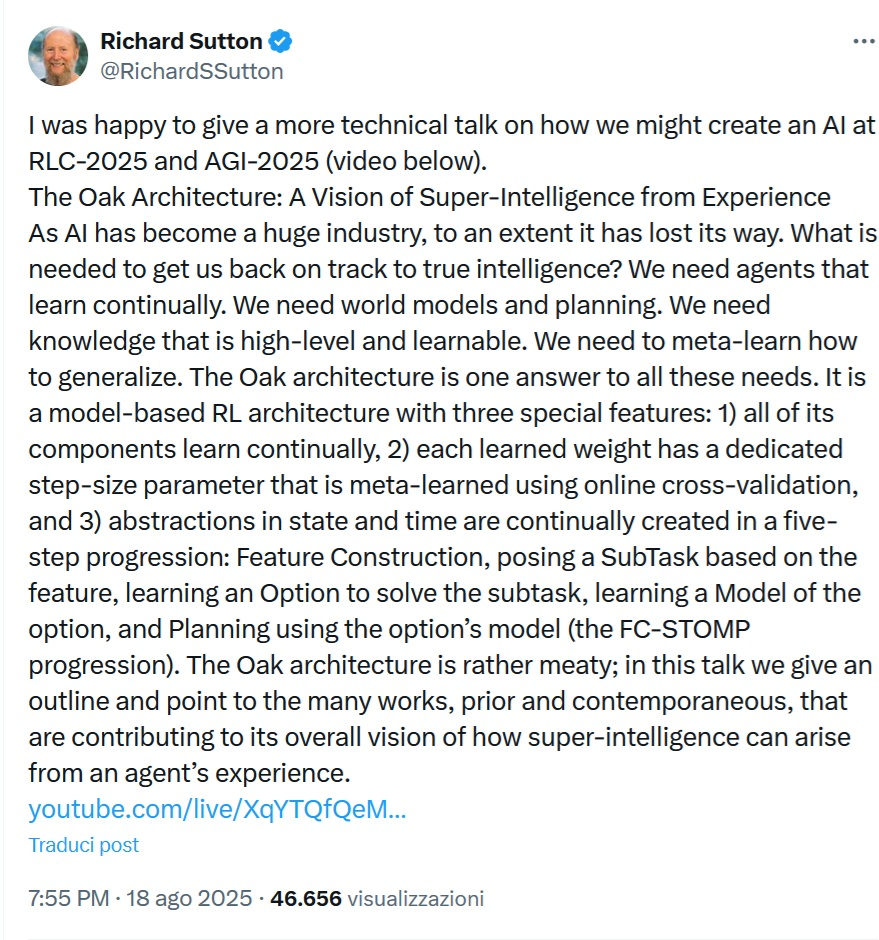
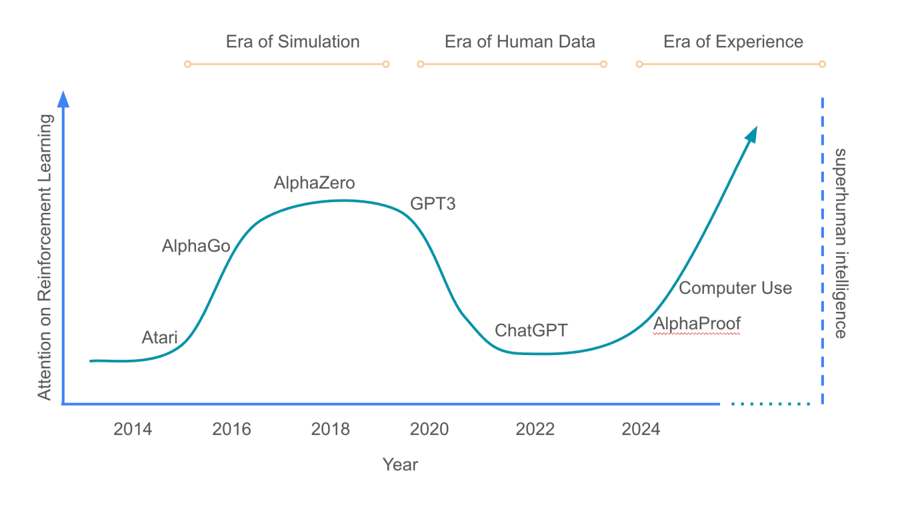

# The "Nobel" for computer science: "AI Producers, You Have Lost Your Way"

*Imagine a Michelin-starred chef who, after inventing the perfect risotto recipe, discovers that all the restaurants in the world are serving customers only raw rice with a sprinkling of Parmesan cheese on top. This is more or less what Richard Sutton must feel when observing the current landscape of artificial intelligence. The [co-winner of the 2024 Turing Award](https://awards.acm.org/turing) - which in the computer world is equivalent to the Nobel Prize - has launched a j'accuse that sounds like an alarm bell for an industry that, in his opinion, has completely lost its way towards true intelligence.*

## The Anatomy of a Betrayed Revolution

Sutton, a leading figure in reinforcement learning and a Turing Award winner, says the AI industry has lost its way, and this is not a criticism from some grumpy academic relegated to a corner of the university. We are talking about one of the [founding fathers of computational reinforcement learning](https://www.ualberta.ca/en/computing-science/news-and-events/news/2025/march/rich-sutton-receives-the-2024-acm-am-turing-award.html), the one who together with Andrew Barto laid the conceptual and algorithmic foundations of what today allows robots to learn to walk and autonomous cars to navigate in traffic.

But what exactly does Sutton mean when he says the industry "has lost its way"? His criticism is not aimed at the commercial results - those are undeniable - but at the fact that the current dominant approach in AI is building sandcastles instead of solid foundations for the intelligence of the future. [As he writes on X](https://x.com/RichardSSutton/status/1957501548214513897), "As AI has become a huge industry, to some extent it has lost its way," arguing that recent progress has ignored the fundamental principles necessary for true intelligence.

The heart of the matter is as philosophical as it is technical. The current Large Language Models, the giant ones that devour terabytes of text to give us seemingly intelligent answers, according to Sutton do exactly the opposite of what a true artificial intelligence should do: they have their knowledge "programmed" at the time of design, rather than discovered through experiential learning.

## The Great Misunderstanding: Scaling vs Learning

To understand the depth of Sutton's criticism, one must take a step back and consider what he himself called the ["Bitter Lesson"](http://www.incompleteideas.net/IncIdeas/BitterLesson.html) in 2019 - an essay that has become a kind of manifesto in AI research. The bitter lesson is this: in the long run, scalable and general methods always win over systems built by incorporating domain-specific knowledge. It's like the difference between teaching someone to fish and giving them a fish every day: the first approach scales indefinitely, the second forces you to keep fishing for them.

And yet, looking at the industry today, it seems that everyone has decided to fish for their AIs instead of teaching them how. Contemporary language models are fed with astronomical amounts of human text, passively absorbing patterns and correlations. It is an approach that works - and the results are there for all to see - but which according to Sutton represents an evolutionary dead end.

The criticism becomes even more pungent when you consider that Sutton worked at Google DeepMind, one of the companies that has contributed most to the success of language models. So this is not the classic outsider who shoots at the system, but someone who knows the internal mechanisms of the industry intimately and has decided to raise his voice from within.

## The Oak Architecture: A Manifesto for the Future

Sutton does not just diagnose the problem - he also proposes a radical solution called the Oak (Options and Knowledge) architecture. It is a framework that could seem to have come straight out of an episode of Black Mirror, if Black Mirror were written by optimistic engineers instead of pessimistic screenwriters.

Oak is based on three fundamental principles: the agent must be general-purpose, starting with no specific knowledge of any particular world; learning is entirely guided by experience, with the agent acquiring knowledge exclusively through direct interaction with its environment; and the reward hypothesis is applied, according to which any goal can be reduced to the maximization of a simple scalar reward signal.

The heart of Oak is a self-reinforcing loop that sounds almost mystical in its simplicity: the agent creates increasingly higher-level abstractions through feedback, where the features that help in planning and problem solving become the basis for the next generation of knowledge, even more abstract. This process is open-ended, limited only by the available computing power, and according to Sutton could eventually pave the way for superintelligence.

It sounds like science fiction, but there is a very earthly problem that prevents this vision from being realized: Oak depends on algorithms that can learn continuously and stably without forgetting what they have already learned. It is the famous problem of "catastrophic forgetting" - when a neural network learns something new, it tends to "overwrite" what it knew before, like a hard disk that keeps deleting old files to make room for new ones.

## The Paradox of Continuous Learning

Here we come to the technical heart of the matter, what separates dreams from implementable reality. Sutton identifies the main problem of current systems in the fact that they cannot learn continuously: they struggle with catastrophic forgetting, where new information overwrites what they have already learned, losing the ability to continue learning over time.

It's a bit as if every time we learn a new language we have to forget all the ones we knew before. For humans this does not happen - or at least not so drastically - because our brains have developed sophisticated mechanisms to integrate new knowledge without erasing the previous ones. But our deep learning algorithms are still primitive in this sense: good at learning from scratch on huge datasets, but unable to continue learning without losing stability.

This is not just a technical detail - it is the difference between building an intelligence that grows and evolves continuously and one that remains frozen at the time of its last training session. And it is here that Sutton's criticism becomes more relevant than ever: the industry is investing trillions in systems that, however impressive, essentially represent static snapshots of knowledge rather than dynamic and adaptive intelligences.

[*Image from medium.com*](https://medium.com)

## The Dissident Voice in the Age of Scaling

Sutton joins other leading researchers in criticizing the industry's fixation on scaling large language models, but his position is particularly interesting because it comes from someone who cannot be accused of being out of the loop. The [Turing Award he received in 2024](https://www.nsf.gov/news/ai-pioneers-andrew-barto-richard-sutton-win-2024-turing) along with Andrew Barto came with a one-million-dollar check sponsored by Google, the company that has most pushed the approach based on large language models.

His criticism thus takes on the contours of a real intellectual dissidence from within the system. When one of the winners of the "Nobel Prize in computer science" who has worked for one of the most influential Big Tech companies in the AI sector says that the industry has lost its way, perhaps it is worth paying attention.

But Sutton is not alone in his skepticism. Together with David Silver, a professor at University College London, known among other things for having led the development of AlphaGo, the system that in 2016 defeated the world Go champion Lee Sedol, he recently [published a paper](https://storage.googleapis.com/deepmind-media/Era-of-Experience%20/The%20Era%20of%20Experience%20Paper.pdf) which argues that AI should learn by doing, not just by absorbing huge amounts of text written by humans. It is a position that resonates with growing force in a part of the research community that sees LLMs as a path to commercial success but not necessarily to general intelligence.

## The Implications of a Failed Revolution

If Sutton is right - and his scientific credibility suggests that it is worth taking his arguments seriously - what does this mean for the future of AI? First, we could find ourselves in what biologists call an "evolutionary dead end": a path that leads to localized successes but has no outlets to higher levels of complexity.

Current AI systems, however impressive in their linguistic and reasoning abilities, could represent a kind of technological plateau - systems that excel at specific tasks but cannot evolve into more general and adaptive forms of intelligence. It is as if we had perfected the typewriter just when we were about to invent the computer.

Second, there is a deeper issue of sustainability and efficiency. Current approaches require increasing amounts of data and computational power, following a curve that may not be sustainable in the long term. The approach proposed by Sutton, based on agents that learn through direct interaction with the environment, could represent a more efficient path towards general artificial intelligence.

## Towards an Uncertain but Fascinating Future

Sutton's vision for the future of AI is not just technical - it is almost philosophical in its scope. He imagines systems that not only process information but that really "understand" the world through direct experience, that build increasingly sophisticated models of reality through continuous interaction and feedback.

It is a vision that requires a revolution not only in algorithms but also in infrastructure. As Sutton explains, "what we need to get back on the right track towards true intelligence are agents that learn continuously, models of the world and planning, high-level and learnable knowledge, and the meta-ability to learn how to generalize."

Of course, there is a risk that this is the classic "next big thing" that always remains "next" without ever becoming "current". Stable continuous learning remains one of the most difficult problems in AI, and it is not clear when - or if - we will be able to solve it. But if there is one lesson that the history of technology has taught us, it is that revolutions often come from the most unexpected places, proposed by voices that initially sound like dissidents.

Richard Sutton, with his track record of innovations that have defined the field and his unique position as a critical insider, could be exactly the kind of voice the AI industry needs to hear. Even if - and perhaps especially if - what he says calls into question everything we have built so far.

Meanwhile, as the industry continues to push the limits of what large language models can do, from Alberta a Turing laureate who has seen DeepMind born and grow from within continues to dream of agents that learn like curious children, exploring the world one step at a time. It's a bit as if Willy Wonka, after inventing the most advanced chocolate factory in the world, decided to leave it to remind us that the best taste does not come from the most sophisticated machines, but from the simplest recipe: that of direct experience.

Sutton today observes the industry he helped to shape with the eyes of someone who has seen the future and knows that we are going in the wrong direction. His voice, amplified by the weight of a career that has defined entire generations of researchers, resonates as a warning that we cannot afford to ignore. Because experience teaches us that the greatest changes often begin with someone who has the courage to say that the emperor is naked - even when that emperor has trillions of parameters and knows how to answer any question.
