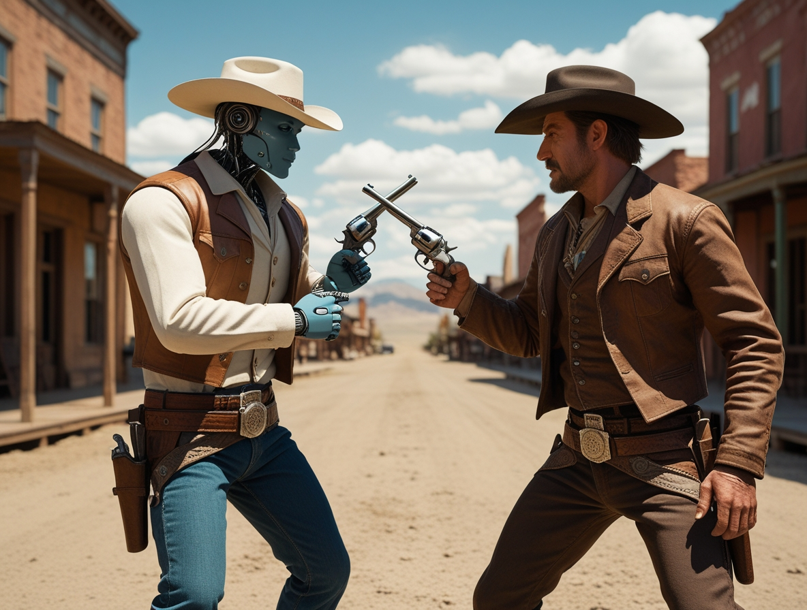
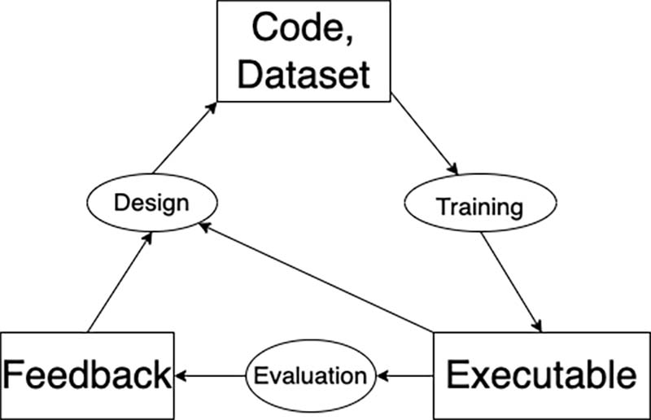

# Il Duello dell'Era Digitale: L'AI ucciderà i Programmatori?
*di Dario Ferrero*

*Tra le profezie apocalittiche di Eric Schmidt e il realismo pragmatico degli esperti del settore, dove finisce l'hype e inizia la realtà?*

Se l'industria tecnologica fosse un film di fantascienza, ora staremmo vivendo quella scena cruciale in cui i robot iniziano a sostituire gli umani. Ma a differenza di "Blade Runner" o "I, Robot", qui non c'è Harrison Ford né Will Smith a salvare la situazione. Ci sono solo Eric Schmidt, ex CEO di Google, che profetizza la fine dei programmatori entro un anno, e dall'altra parte esperti come Salvatore Sanfilippo che alzano le mani urlando "Un momento, fermi tutti!". 

La battaglia è iniziata, e i proiettili sono dichiarazioni al vetriolo, ricerche accademiche e tanta, tantissima confusione. In questa guerra di bit e algoritmi, però, la verità è decisamente più complessa di quanto i titoli sensazionalistici vogliano farci credere. Andiamo con ordine, perché quando si parla del futuro di milioni di sviluppatori in tutto il mondo, ogni parola conta.

## Il Profeta dell'Apocalisse: Le Visioni di Eric Schmidt

Eric Schmidt non è uno qualunque che parla dal bar dello sport. È l'uomo che ha guidato Google per un decennio, trasformando un motore di ricerca universitario nel colosso tecnologico che domina il web. Quando parla, il settore ascolta. E quello che ha detto di recente ha fatto drizzare i capelli sulla testa a più di un programmatore.

"Noi, come settore, crediamo che nel prossimo anno la stragrande maggioranza dei programmatori sarà sostituita da programmatori AI", ha dichiarato Schmidt con la sicurezza di chi ha visto nascere e crescere l'era digitale. Non si è fermato qui: ha previsto matematici di livello universitario creati dall'intelligenza artificiale e un futuro in cui chiedersi "in che linguaggio programmi?" diventa una domanda obsoleta quanto "quanti giri fa il tuo disco in vinile?".

La sua visione del mondo è quella di un futuro dominato da "agenti" AI che gestiscono tutto, dall'acquisto di una casa alle cause legali contro l'appaltatore inadempiente. Schmidt descrive questo scenario con la naturalezza di chi ordina un caffè: "Voglio comprare un'altra casa. Dico: 'Trovami una casa nell'area metropolitana di DC. Guarda i regolamenti edilizi'. Questo è un agente. 'Esamina tutte le norme. Scopri quanto grande posso costruire una casa'. Questo è un altro agente". Il processo continua fino alla battuta finale che suona come una punchline da sitcom: "alla fine fai causa all'appaltatore per inadempienza".

Il cuore della sua argomentazione risiede in quello che chiama "recursive self-improvement" - auto-miglioramento ricorsivo. Secondo Schmidt, già oggi circa il 10-20% del codice che i laboratori di ricerca di OpenAI e Anthropic sviluppano è generato automaticamente dai loro stessi sistemi. È un po' come se HAL 9000 di "2001: Odissea nello spazio" avesse imparato non solo a parlare, ma anche a riprogrammarsi da solo.

Ma Schmidt, con una battuta che tradisce forse più verità di quanto intenda, definisce tutto questo "il consenso di San Francisco perché tutti quelli che ci credono sono a San Francisco. Forse è l'acqua". Una frase che fa sorridere ma nasconde una domanda inquietante: stiamo davvero assistendo a una rivoluzione globale o siamo in una bolla tecnologica che distorce la percezione della realtà?

[*Immagine tratta da medium.com*](https://jacobbuckman.com/2022-09-07-recursively-self-improving-ai-is-already-here/)

## La Voce del Dissenso: Sanfilippo e il Realismo Tecnico

Dall'altra parte del ring intellettuale, Salvatore Sanfilippo - creatore di Redis e una delle voci più autorevoli nel mondo dello sviluppo software - contrattacca con argomenti che affondano le radici nell'esperienza diretta del codice. Nel suo [intervento video](https://www.youtube.com/watch?v=Kq3K7VzWC44), Sanfilippo smonta pezzo per pezzo le previsioni apocalittiche, portando come testimone d'eccezione Matt Garman, CEO di Amazon Web Services.

La tesi di Sanfilippo è semplice quanto devastante per i profeti del doom tecnologico: programmare non è solo scrivere codice. È capire problemi complessi, tradurli in soluzioni eleganti, gestire team, comunicare con clienti che spesso non sanno nemmeno cosa vogliono davvero. È come la differenza tra saper suonare il pianoforte e comporre una sinfonia: tecnicamente si usano gli stessi tasti, ma l'universo creativo e intellettuale che separa le due attività è abissale.

Garman, che guida la più grande piattaforma cloud al mondo, mantiene un approccio pragmatico che fa da contraltare alle visioni schmidtiane. Pur riconoscendo che l'AI cambierà il modo di programmare, non parla di sostituzione totale ma di evoluzione del ruolo. È un po' come quando i word processor hanno sostituito le macchine da scrivere: i giornalisti non sono scomparsi, hanno solo cambiato strumenti di lavoro.

L'argomento di Sanfilippo tocca il cuore del problema: l'AI attuale eccelle nel generare codice quando il problema è ben definito, ma il lavoro del programmatore inizia molto prima di aprire l'editor di testo. Inizia quando il cliente dice "voglio un'app come Facebook ma per i gatti" e il developer deve trasformare questa richiesta surreale in specifiche tecniche concrete.

## Il Coro degli Esperti: Voci dal Fronte Tecnologico

Il dibattito si arricchisce di altre voci autorevoli, creando un coro che spazia dal catastrofismo all'ottimismo prudente. Emad Mostaque, ex CEO di Stability AI, si unisce al campo pessimista con una previsione ancora più drastica: [secondo le sue dichiarazioni](https://www.redhotcyber.com/post/tra-5-anni-non-ci-saranno-piu-programmatori-umani-la-previsione-di-emad-mostaque-ceo-di-stability-ai/), entro cinque anni non esisteranno più programmatori umani. Mostaque cita un dato che fa riflettere: il 41% del codice su GitHub è già generato dall'intelligenza artificiale.

Tuttavia da buon Sherlock Holmes tecnologico, non ho ritrovato il dato specifico del 41% citato da Mostaque. La piattaforma di GitHub parla invece di metriche diverse: [il 55% di velocità aumentata nel completamento dei task](https://resources.github.com/learn/pathways/copilot/essentials/measuring-the-impact-of-github-copilot/) e miglioramenti qualitativi lungo otto dimensioni diverse del codice. Ma il punto non è tanto l'esattezza del numero quanto il concetto che sta dietro. Come spesso accade nel mondo tech, i numeri precisi diventano meno importanti della direzione del trend, e quella direzione è inequivocabile come una scena di inseguimento in un film d'azione: l'AI sta guadagnando terreno a velocità impressionante.

Ma questi numeri, apparentemente schiaccianti, meritano un'analisi più attenta. È come dire che il 41% delle parole di questo articolo sono state suggerite dal correttore automatico del computer: tecnicamente potrebbe essere vero, ma sostanzialmente irrilevante per il processo creativo e intellettuale alla base della scrittura. Il codice generato dall'AI è spesso boilerplate, funzioni standard, snippet ripetitivi - la parte meccanica del lavoro, non quella che richiede ingegno e creatività.

Jensen Huang di Nvidia, dal canto suo, aggiunge un tassello interessante al puzzle sostenendo che [l'AI potrebbe eliminare la necessità di studiare programmazione](https://www.tomshw.it/hardware/studiare-programmazione-non-serve-piu-tanto-ce-lia-dice-il-capo-di-nvidia) in senso tradizionale. Ma anche qui, come spesso accade nelle dichiarazioni dei CEO delle big tech, c'è una semplificazione che puzza di marketing. È un po' come dire che siccome esistono i navigatori GPS non serve più saper leggere una mappa: vero fino a quando il satellite non perde il segnale.

Le voci più moderate del settore, [come riportato da diverse analisi specializzate](https://www.itpro.com/software/development/aws-ceo-matt-garman-just-said-what-everyone-is-thinking-about-ai-replacing-software-developers), parlano di collaborazione uomo-macchina piuttosto che di sostituzione completa. È interessante notare un pattern: più gli esperti sono vicini al codice quotidianamente, più tendono a essere scettici sulle previsioni apocalittiche. È come se chi ha le mani nella pasta sappia distinguere tra la farina e il pane finito.

## La Realtà dei Numeri: Decifrare il Codice dei Dati

Quando si parla di rivoluzioni tecnologiche, i numeri possono essere alleati preziosi o nemici insidiosi, a seconda di come li si interpreta. Il famoso dato citato da Mostaque - il 41% del codice su GitHub generato dall'AI - merita un'analisi forense degna di "CSI: Cyber".

Questo numero, impressionante a prima vista, racconta solo una parte della storia. È vero che l'AI eccelle nel generare codice standardizzato, funzioni comuni, pattern ripetitivi. Ma è un po' come dire che un'orchestra è stata sostituita perché il 41% delle note suonate sono Do, Re, Mi. Le note sono importanti, ma la sinfonia nasce dall'arrangiamento, dall'interpretazione, dalla creatività che le collega.

Il concetto di "recursive self-improvement" che Schmidt pone come chiave di volta del futuro merita un approfondimento tecnico più serio. L'idea che l'AI possa migliorare se stessa ricorsivamente fino a raggiungere una superintelligenza è affascinante quanto controversa. È il Santo Graal dell'intelligenza artificiale, ma anche il suo Frankenstein. Gli esperti di AI alignment sono divisi: alcuni vedono questo scenario come inevitabile e imminente, altri lo considerano un miraggio lontano anni luce dalla realtà attuale.

La verità, come spesso accade nella scienza, sta probabilmente in una zona grigia. L'AI attuale è bravissima in compiti specifici e ben definiti, ma fatica ancora con la comprensione contestuale, la creatività genuina, la gestione dell'ambiguità - tutte competenze che sono pane quotidiano per un programmatore esperto.

## Il Paradosso dell'Automazione: Quando i Robot Hanno Bisogno degli Umani

C'è un paradosso affascinante nella storia della tecnologia che merita di essere raccontato: più automatizziamo i processi, più abbiamo bisogno di persone qualificate per gestire l'automazione. È come in "Matrix" - qualcuno deve pur programmare la Matrix, no? E quel qualcuno, per ora, siamo ancora noi umani.

Ogni rivoluzione tecnologica della storia ha seguito questo pattern: ha distrutto alcuni lavori, ne ha trasformati altri, ne ha creati di completamente nuovi. I tessitori del XIX secolo temevano che i telai meccanici li avrebbero mandati tutti al lastrico, eppure l'industria tessile moderna impiega milioni di persone in tutto il mondo. Ruoli diversi, competenze diverse, ma sempre persone.

Nel caso della programmazione, stiamo assistendo a una trasformazione simile. I programmatori di domani potrebbero non scrivere codice riga per riga come facevano i loro colleghi degli anni '80. Potrebbero diventare "AI whisperers", specialisti nel comunicare con l'intelligenza artificiale, nel definire architetture complesse, nel gestire l'interazione tra sistemi automatizzati e bisogni umani reali.

È un po' come l'evoluzione dai primi computer giganteschi che occupavano intere stanze ai moderni smartphone. La tecnologia è cambiata radicalmente, ma il bisogno di persone che capiscano come usarla, come ottimizzarla, come risolvere i problemi quando si inceppa, è rimasto intatto. Anzi, è aumentato.

La programmazione del futuro sarà probabilmente più simile alla regia cinematografica: il regista non gira personalmente ogni inquadratura, non muove ogni singola telecamera, non registra ogni battuta. Ma ha la visione complessiva, coordina specialisti, prende decisioni creative e tecniche che nessuna macchina può prendere al suo posto. Spielberg usa effetti speciali computerizzati, ma "E.T." continua a commuovere il pubblico per ragioni che vanno ben oltre la tecnologia usata per crearlo.

## Oltre la Profezia: Scenari Realistici per il Futuro

Proviamo a immaginare scenari più realistici, meno hollywoodiani delle previsioni apocalittiche ma anche meno conservatori del "non cambierà mai nulla". Nel prossimo decennio, probabilmente assisteremo a una stratificazione del mercato del lavoro nella programmazione.

Al livello base, molti compiti ripetitivi saranno effettivamente automatizzati. Come gli sportelli bancari automatici hanno ridotto il numero di cassieri ma non hanno eliminato le banche, l'AI ridurrà la domanda per certi tipi di programmazione di routine. Gli sviluppatori junior che si limitavano a implementare specifiche dettagliate potrebbero trovarsi in difficoltà.

Al livello intermedio, emergeranno nuove figure professionali: prompt engineers, AI trainers, hybrid developers che sapranno orchestrare sistemi di intelligenza artificiale per creare soluzioni complesse. È come quando sono nati i web designer negli anni '90 - una professione che non esisteva prima ma che è diventata essenziale con l'evolversi della tecnologia.

Al livello alto, i system architects, i tech leads, i CTO continueranno a essere fondamentali. Potrebbero cambiare gli strumenti, ma la necessità di persone che capiscano i sistemi complessi, che sappiano tradurre bisogni aziendali in soluzioni tecniche, che gestiscano team e progetti, rimarrà intatta. È come dire che l'esistenza dei GPS non ha eliminato il bisogno di ingegneri civili per progettare le strade.

## La Lezione della Storia: Dalle Macchine a Vapore all'AI

La storia della tecnologia ci offre lezioni preziose per interpretare il momento attuale. Quando arrivarono le prime macchine fotografiche, i pittori temettero per il loro futuro. Risultato? La pittura non è scomparsa, si è evoluta. Sono nati l'impressionismo, l'espressionismo, l'arte astratta. I pittori hanno smesso di limitarsi a riprodurre la realtà e hanno iniziato a interpretarla.

Quando i computer hanno iniziato a fare calcoli complessi, molti matematici hanno temuto di diventare obsoleti. Risultato? La matematica è diventata più potente, più creativa, più ambiziosa. I matematici hanno smesso di sprecare tempo in calcoli ripetitivi e hanno iniziato a esplorare teoremi più complessi, a sviluppare nuove branche della scienza.

La programmazione potrebbe seguire una traiettoria simile. Gli sviluppatori del futuro potrebbero smettere di preoccuparsi della sintassi e concentrarsi sull'architettura, sull'user experience, sull'innovazione. Potrebbero diventare più simili a compositori che a copisti, più simili a chef che a cuochi.

## Conclusioni: Neo, Non C'è il Cucchiaio

Alla fine di questo viaggio tra profezie tecnologiche e realtà quotidiana, emerge una verità tanto semplice quanto profonda: non c'è il cucchiaio. Come direbbe Neo in "Matrix", il problema non è piegare il cucchiaio, è capire che il cucchiaio non esiste. Non esiste una sostituzione netta, totale, immediata. Esiste un'evoluzione continua, complessa, piena di sfumature.

Eric Schmidt ha ragione quando parla di trasformazione radicale. L'AI cambierà il modo di programmare più profondamente di quanto molti immaginino. Ma sbaglia sui tempi e sulle modalità. La rivoluzione non sarà un'esplosione, sarà un'evoluzione. Non sarà un "game over" per i programmatori, sarà un "level up" per l'intero settore.

Salvatore Sanfilippo ha ragione quando sottolinea la complessità del lavoro di sviluppo. Programmare è molto più che scrivere codice, e questa complessità proteggerà molti professionisti dalla sostituzione automatica. Ma forse sottovaluta la velocità del cambiamento tecnologico e la capacità dell'AI di imparare anche compiti complessi.

La verità, come sempre quando si tratta di futuro, sta nel mezzo. I programmatori di domani saranno diversi da quelli di oggi, useranno strumenti diversi, affronteranno sfide diverse. Ma continueranno a esistere, perché dietro ogni sistema automatizzato c'è sempre bisogno di intelligenza umana per progettarlo, gestirlo, migliorarlo.

Come tutte le evoluzioni biologiche e tecnologiche, sopravvivranno i più adattabili, non i più forti. Chi saprà cavalcare l'onda dell'AI invece di subirla, chi imparerà a collaborare con le macchine invece di competere contro di esse, chi manterrà la curiosità e la capacità di apprendere continuo, avrà un futuro radioso davanti.

Il grande duello tra programmatori e intelligenza artificiale, alla fine, potrebbe rivelarsi quello che è sempre stato: non una guerra, ma una danza. E nelle migliori danze, partner diversi si muovono insieme, ognuno con i propri punti di forza, creando qualcosa di più bello di quello che potrebbero creare da soli.