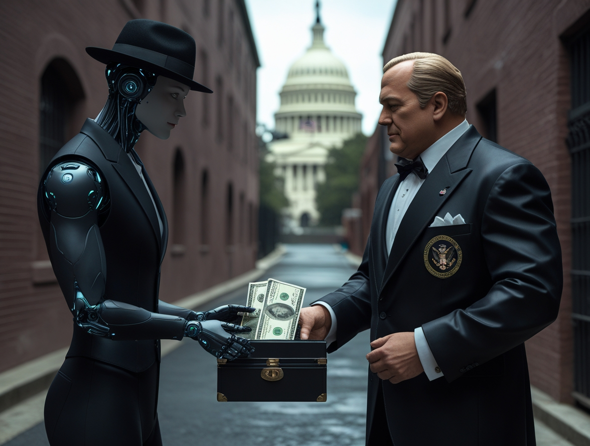
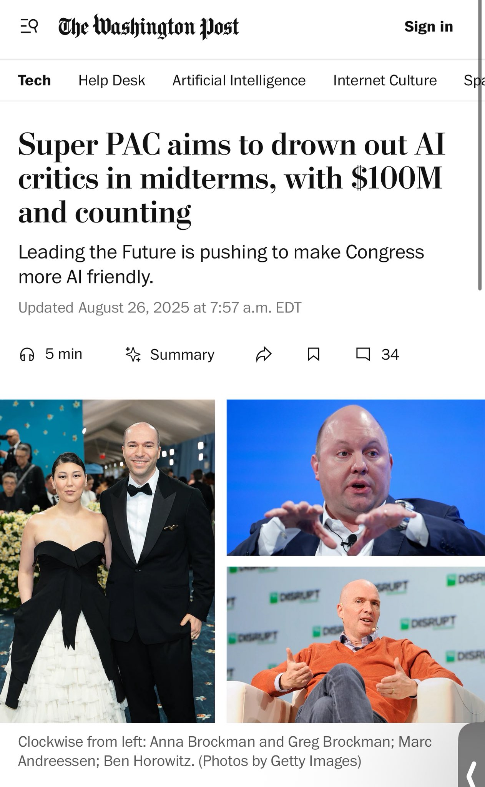

# Silicon Valley : 100 millions de dollars contre la réglementation de l'IA
*par Dario Ferrero*

*Alors que Washington se prépare à l'une des batailles réglementaires les plus importantes du XXIe siècle, la Silicon Valley a décidé de jouer ses meilleures cartes. Comme dans une partie de poker où chaque mouvement peut déterminer l'avenir de toute une industrie, les géants de la technologie ont mis sur la table un chiffre qui ferait pâlir même l'oncle Picsou : plus de 100 millions de dollars destinés à influencer les élections de mi-mandat de 2026.*

La stratégie n'est certes pas nouvelle dans le paysage politique américain, mais la portée et la précision chirurgicale de cette opération rappellent davantage les tactiques de House of Cards que les campagnes électorales traditionnelles. Au centre de cette manœuvre se trouve [Leading the Future](https://www.washingtonpost.com/technology/2025/08/26/silicon-valley-ai-super-pac/), un super-PAC lancé ce mois-ci qui représente la tentative de lobbying technologique la plus ambitieuse jamais vue en Amérique.

## Les parrains de l'innovation

À la tête de cette croisade anti-réglementation, on trouve des noms qui pourraient tout à fait sortir d'un épisode de Silicon Valley de Mike Judge : [Andreessen Horowitz](https://fortune.com/2025/08/26/openai-president-greg-brockman-andreessen-horowitz-super-pac-ai-pro-innovation/), le fonds de capital-risque qui a transformé plus de startups en licornes que Donjons & Dragons n'en a créées, et Greg Brockman, président d'OpenAI et l'un des cerveaux derrière ChatGPT. Ils ne sont pas seuls dans cette bataille : [Ron Conway de SV Angel, Joe Lonsdale de 8VC Management, et même Perplexity AI](https://siliconangle.com/2025/08/25/silicon-valley-ai-leaders-launch-100m-leading-future-super-pac/) ont uni leurs forces dans ce qui semble être la Justice League de la technologie.

La structure organisationnelle de Leading the Future est aussi sophistiquée qu'un algorithme d'apprentissage automatique. Le super-PAC s'appuie sur un réseau qui comprend [des dons directs, des PAC au niveau des États, une branche 501(c)(4) et des campagnes publicitaires numériques](https://techcrunch.com/2025/08/25/silicon-valley-is-pouring-millions-into-pro-ai-pacs-to-sway-midterms/) pour soutenir les candidats favorables à l'IA et faire obstacle à ceux qu'ils considèrent comme des freins à l'innovation. C'est une approche à plusieurs niveaux qui touche à la fois la politique fédérale et celle des États, reconnaissant que l'avenir de l'intelligence artificielle se décide autant à Washington que dans les États individuels.

Le choix des protagonistes n'est pas anodin. Andreessen Horowitz n'est pas seulement l'un des fonds de capital-risque les plus influents de la Valley, mais il a aussi une longue histoire d'investissements stratégiques dans des entreprises d'IA. La présence de Brockman, figure centrale de l'écosystème OpenAI, confère à la coalition une crédibilité technique qui va au-delà du simple poids financier. C'est comme si les producteurs et les réalisateurs d'un grand studio hollywoodien s'unissaient pour influencer les règles du cinéma.

## La stratégie du "diviser pour mieux régner"

L'aspect le plus intéressant de cette opération est sa nature bipartite. [Leading the Future soutiendra aussi bien les démocrates que les républicains](https://www.inc.com/sam-blum/why-andreessen-horowitz-and-this-openai-co-founder-are-launching-ai-focused-super-pacs/91230947), pourvu qu'ils partagent une vision "favorable à l'innovation" de la réglementation de l'IA. C'est une démarche astucieuse qui rappelle les tactiques de l'industrie pharmaceutique dans les années 90 : au lieu de se ranger du côté d'un parti, on mise sur des individus spécifiques capables d'influencer les décisions clés.

Les cibles géographiques sont tout aussi stratégiques. [La Californie, New York, l'Illinois et l'Ohio](https://www.cryptopolitan.com/silicon-valley-over-100m-in-2026-elections/) ne représentent pas seulement certains des marchés les plus importants pour la technologie, mais aussi des États dont les législateurs sont particulièrement actifs sur le front de la réglementation de l'IA. C'est comme jouer à Risk, mais avec des conséquences réelles pour des milliards de dollars d'investissements et des milliers d'emplois.

La Californie, en particulier, représente un champ de bataille crucial. L'État a déjà adopté [plus de 18 lois liées à l'IA rien qu'en 2024](https://www.foley.com/insights/publications/2024/10/decoding-california-recent-ai-laws/), créant l'un des cadres réglementaires les plus complexes au monde. La récente bataille autour de [la SB 1047, le projet de loi controversé sur la sécurité de l'IA finalement rejeté par le gouverneur Newsom](https://www.morganlewis.com/pubs/2024/10/california-governor-vetoes-ai-safety-bill-sb-1047-signs-ab-2013-requiring-generative-ai-transparency), a montré à quel point l'équilibre entre innovation et réglementation est délicat.

Le veto de Newsom a représenté une victoire temporaire pour l'industrie, mais la prolifération des propositions de loi montre que la pression réglementaire est loin d'avoir diminué. [Le projet de loi 2885 de l'Assemblée, qui vise à unifier la définition de l'"Intelligence Artificielle" dans les différentes lois californiennes](https://www.whitecase.com/insight-alert/raft-california-ai-legislation-adds-growing-patchwork-us-regulation), n'est qu'un exemple de la manière dont les législateurs tentent de créer un cadre réglementaire cohérent pour un secteur en évolution rapide.

## Meta joue sa propre partie

Parallèlement à la création de Leading the Future, [Meta a lancé son propre super-PAC axé sur la Californie](https://lgmcorp.com/2025/08/26/meta-launches-california-super-pac-to-support-pro-ai-policy-candidates-amid-regulatory-concerns/), l'État qui abrite le siège de l'entreprise de Zuckerberg. Cette démarche suggère une stratégie encore plus sophistiquée : tandis que Leading the Future opère au niveau national, Meta se concentre sur son propre pré carré, [en soutenant des candidats qui favorisent une réglementation "légère" de l'IA au-delà des clivages partisans](https://www.cryptopolitan.com/meta-super-pac-ai-regulation-california/).

Le choix de Meta d'opérer séparément de Leading the Future pourrait refléter des différences stratégiques ou simplement le désir de maintenir un contrôle direct sur les messages et les candidats soutenus. Comme une partie d'échecs où chaque pièce a son rôle spécifique, cette double stratégie maximise les chances de succès sur plusieurs fronts.

L'approche de Meta est particulièrement intéressante compte tenu de la position unique de l'entreprise dans l'écosystème de l'IA. Contrairement aux "pure-players" comme OpenAI, Meta doit équilibrer les intérêts de l'IA avec ceux de ses activités principales dans les médias sociaux, déjà soumises à une intense pression réglementaire. C'est une partie multidimensionnelle qui rappelle les équilibres géopolitiques complexes de Game of Thrones.

## Le modèle crypto : leçons du passé

Selon certains analystes, [l'industrie de l'IA suit le manuel développé par le secteur des cryptomonnaies](https://readsludge.com/2025/08/26/ai-industry-picks-up-cryptos-big-money-playbook/), qui a massivement investi ces dernières années dans le lobbying politique pour éviter des réglementations strictes. La stratégie crypto a montré que des investissements ciblés peuvent être extrêmement efficaces pour façonner l'agenda politique, surtout lorsqu'il s'agit de technologies que les législateurs peinent à comprendre pleinement.

Cependant, l'IA présente des défis uniques par rapport aux cryptomonnaies. Alors que les cryptos sont restées largement confinées au monde financier et technologique, l'intelligence artificielle envahit tous les aspects de la société, de la santé à l'éducation, de la sécurité nationale au travail quotidien. Cela rend la bataille réglementaire plus complexe et les conséquences plus profondes.

Le secteur de la crypto a investi plus de 200 millions de dollars dans les élections de 2024, obtenant des résultats significatifs dans l'élection de candidats favorables. L'industrie de l'IA, avec des budgets encore plus importants, applique des leçons similaires mais à une échelle sans précédent. C'est l'évolution naturelle d'une stratégie qui a déjà prouvé son efficacité, optimisée pour un secteur aux intérêts encore plus larges et diversifiés.

## La guerre réglementaire : États contre Fédéral

La bataille de l'IA se déroule simultanément sur plusieurs fronts, créant une complexité qui rappelle la structure narrative de Westworld. D'un côté, les États accélèrent leurs efforts réglementaires. [Les républicains au Congrès poussent pour bloquer l'application des réglementations étatiques sur l'IA](https://calmatters.org/economy/technology/2025/05/state-ai-regulation-ban/), mettant en péril les protections de la Californie sur l'intelligence artificielle dans les soins de santé, l'embauche, et plus encore. De l'autre, l'administration fédérale cherche à équilibrer innovation et sécurité par des décrets présidentiels et des directives des agences fédérales.

Cette tension entre le fédéral et les États n'est pas nouvelle dans l'histoire américaine, mais elle prend des contours particuliers lorsqu'elle est appliquée à l'IA. [Les réglementations étatiques ont tendance à être plus spécifiques et agressives](https://www.ncsl.org/technology-and-communication/artificial-intelligence-2025-legislation), tandis que l'approche fédérale privilégie les principes généraux et la collaboration volontaire avec l'industrie. C'est une dichotomie qui pourrait déterminer non seulement l'avenir de l'IA américaine, mais aussi la compétitivité mondiale du secteur.

La Californie, avec [la SB 243 visant à réglementer l'utilisation des chatbots pour le soutien psychologique](https://www.axios.com/local/san-francisco/2025/06/03/california-ai-regulation-senate-chatbots-rights), représente l'avant-garde de cette approche granulaire. La loi exige que les chatbots notifient clairement aux utilisateurs qu'ils ne sont pas humains et interdit les pratiques conçues pour créer une dépendance. C'est un niveau de détail réglementaire qui serait impensable au niveau fédéral, mais qui pourrait devenir le modèle pour d'autres États.

## L'enjeu : la compétition mondiale

Les préoccupations qui poussent la Silicon Valley à cette mobilisation sans précédent sont concrètes et immédiates. [L'objectif déclaré est de s'opposer aux politiques qui "étouffent l'innovation" et favorisent la Chine dans la course mondiale à l'IA](https://fortune.com/2025/08/26/openai-president-greg-brockman-andreessen-horowitz-super-pac-ai-pro-innovation/). C'est un argument qui résonne particulièrement fort dans une Amérique de plus en plus préoccupée par la compétition technologique avec Pékin.

Le récit de la "compétition mondiale" n'est pas anodin. Tout comme dans les années 60, la course à l'espace est devenue un symbole de la suprématie technologique américaine, aujourd'hui l'IA représente le nouveau champ de bataille pour la domination économique et stratégique. [Les partisans de Leading the Future soutiennent que des réglementations excessives pourraient handicaper les entreprises américaines](https://www.webpronews.com/silicon-valley-launches-100m-super-pac-for-light-ai-regulations-in-2026-midterms/) par rapport à leurs concurrents chinois, qui opèrent dans un environnement réglementaire plus permissif.

La comparaison avec l'Europe est tout aussi instructive. [L'AI Act européen représente le cadre réglementaire le plus complet au monde](https://digital-strategy.ec.europa.eu/en/policies/regulatory-framework-ai), mais selon les critiques américains, il pourrait étouffer l'innovation. [Des études montrent comment l'UE et les États-Unis divergent considérablement dans leur approche de la gouvernance de l'IA](https://www.brookings.edu/articles/the-eu-and-us-diverge-on-ai-regulation-a-transatlantic-comparison-and-steps-to-alignment/), l'Europe privilégiant l'éthique et la sécurité et les États-Unis se concentrant sur la compétitivité.

[L'Europe a choisi de se concentrer sur l'éthique et la réglementation, en privilégiant des modèles d'IA "centrés sur l'humain" et "dignes de confiance"](https://carnegieendowment.org/research/2025/05/the-eus-ai-power-play-between-deregulation-and-innovation?lang=en), tandis que les États-Unis et la Chine avancent à grands pas dans les applications civiles et militaires. Cette divergence crée ce que certains experts appellent un "trilemme" mondial de l'IA : sécurité, innovation et compétitivité semblent être des objectifs de plus en plus difficiles à poursuivre simultanément.

[*Image tirée du Washington Post*](https://www.washingtonpost.com/)

## Critiques et contre-arguments : l'autre face de la médaille

Les voix critiques ne manquent pas à l'égard de cette opération de lobbying massive. De nombreux experts en éthique technologique et décideurs politiques démocrates voient dans cette démarche [une tentative de "dépassement des prérogatives des entreprises" qui privilégie les profits à la sécurité](https://www.webpronews.com/silicon-valley-launches-100m-super-pac-for-light-ai-regulations-in-2026-midterms/). L'argument est que l'IA, contrairement aux technologies précédentes, présente des risques existentiels qui nécessitent une réglementation proactive plutôt que réactive.

Les préoccupations vont de la confidentialité des données à la sécurité nationale, du déplacement d'emplois aux risques de biais algorithmique. Comme dans Minority Report, où la technologie prédictive soulève des questions éthiques complexes, l'IA moderne présente des dilemmes qui vont bien au-delà de l'efficacité du marché. Les critiques soutiennent que la pression de l'industrie pour des réglementations "légères" ignore délibérément les risques systémiques que l'IA peut comporter.

Les critiques émanant de groupes de défense des droits civiques et d'organisations à but non lucratif axées sur la technologie éthique sont particulièrement virulentes. Ces organisations soutiennent que l'approche bipartisane de Leading the Future est en réalité une tentative de neutraliser l'opposition politique par la cooptation plutôt que par la confrontation directe sur le bien-fondé des politiques proposées.

Un autre aspect controversé concerne la transparence. Alors que les super-PAC doivent divulguer leurs donateurs, la structure complexe de Leading the Future, qui comprend des organisations 501(c)(4) — c'est-à-dire des organisations de prévoyance sociale et de bien-être à but non lucratif exonérées d'impôts fédéraux aux États-Unis, qui opèrent principalement pour promouvoir le bien commun et le bien-être général de la communauté — ne sont pas soumises aux mêmes obligations de divulgation. Cela soulève des questions sur la transparence réelle des flux d'argent. C'est une critique qui rappelle les controverses autour des "groupes d'argent opaque" qui ont caractérisé les élections américaines des dernières décennies.

## Le timing parfait : anatomie d'une stratégie

Le choix de 2026 comme année cible n'est pas anodin. Les élections de mi-mandat connaissent historiquement une plus faible participation électorale, ce qui rend les investissements ciblés plus efficaces pour déterminer les résultats. De plus, 2026 serarobe l'année où de nombreuses questions réglementaires les plus pressantes sur l'IA arriveront à une décision définitive, tant au niveau fédéral qu'étatique.

[Le super-PAC utilisera une combinaison de dons traditionnels et de campagnes publicitaires numériques](https://www.eweek.com/news/silicon-valley-pacs-ai-state-regulations-elections/) pour maximiser l'impact de ses investissements. À une époque où l'attention du public est fragmentée entre mille canaux différents, cette stratégie multicanal représente l'évolution naturelle de la publicité politique.

L'approche stratégique de Leading the Future reflète une compréhension sophistiquée du paysage politique américain. Au lieu de tout miser sur une poignée de courses fédérales très médiatisées, la stratégie se concentre sur les élections étatiques et locales où l'impact marginal des investissements publicitaires peut être plus significatif. C'est la différence entre bombarder de publicité télévisée pendant le Super Bowl et investir dans un ciblage précis sur les réseaux sociaux.

Le calendrier législatif joue également un rôle crucial. De nombreuses lois les plus importantes sur l'IA sont actuellement en cours de discussion ou de mise en œuvre, et 2026 représente un point de passage critique. Les élections détermineront non seulement qui rédigera les prochaines lois, mais aussi qui supervisera la mise en œuvre et l'application de celles qui existent déjà.

## L'écosystème des partisans : au-delà des grands noms

Alors que les noms les plus connus comme Andreessen Horowitz et Greg Brockman attirent l'attention des médias, l'écosystème de soutien à Leading the Future est beaucoup plus large et diversifié. Il comprend des fonds de capital-risque de deuxième et troisième niveaux, des startups d'IA en quête de protection réglementaire, et même des universitaires et des chercheurs préoccupés par le fait que des réglementations excessives pourraient limiter la recherche scientifique.

Cette diversité reflète la nature envahissante de l'IA dans l'économie moderne. Contrairement à des secteurs plus concentrés comme l'énergie ou les télécommunications, l'IA touche pratiquement tous les aspects de l'activité économique, des services financiers à la santé, de l'éducation au divertissement. Cette ampleur d'intérêts crée une coalition naturellement plus large mais aussi potentiellement plus fragile.

Un aspect particulièrement intéressant est l'implication d'entreprises qui pourraient sembler être des concurrents directs. Le fait que des entités comme Perplexity AI, qui concurrence directement les services de recherche de Google, et des fonds de capital-risque qui ont investi dans des startups concurrentes d'OpenAI participent à la même coalition montre à quel point le risque réglementaire est perçu comme existentiel.

## La dimension internationale : regarder au-delà des frontières

La bataille réglementaire américaine ne se déroule pas dans le vide, mais s'inscrit dans un contexte mondial où différents modèles de gouvernance de l'IA émergent. [La comparaison entre l'approche américaine et l'approche européenne](https://www.hertie-school.org/en/digital-governance/research/blog/detail/content/ai-governance-eu-and-us-converge-on-risk-based-approach-amid-stark-differences) met en évidence des philosophies fondamentalement différentes : alors que l'Europe privilégie une approche de précaution fondée sur les droits, les États-Unis misent sur un modèle qui favorise l'innovation et la compétitivité.

Cette divergence a des implications profondes pour les entreprises mondiales qui doivent naviguer dans des cadres réglementaires de plus en plus complexes. L'AI Act européen, avec ses exigences strictes en matière d'audit et de transparence, influence déjà les pratiques des entreprises bien au-delà des frontières de l'UE. C'est l'effet Bruxelles appliqué à l'intelligence artificielle, où les réglementations européennes deviennent de facto des normes mondiales.

La Chine représente le troisième modèle, caractérisé par un contrôle étatique plus direct mais aussi par une plus grande flexibilité dans la mise en œuvre lorsqu'il s'agit de soutenir des champions nationaux. Ce trilatéralisme normatif crée un paysage de plus en plus fragmenté, où les entreprises doivent développer des stratégies de conformité spécifiques à chaque marché.

Les implications géopolitiques sont évidentes. Dans un monde où l'IA est de plus en plus considérée comme une technologie stratégique, les choix réglementaires nationaux deviennent des instruments de soft power. La capacité des États-Unis à maintenir leur leadership dans l'IA dépendra non seulement de la qualité de la recherche et des investissements, mais aussi de la sagesse des choix réglementaires.

## L'impact sur les startups

L'une des dimensions les moins discutées de la bataille réglementaire concerne l'impact différentiel sur les entreprises de différentes tailles. Alors que des géants comme Google, Microsoft et Meta ont les ressources pour naviguer dans des cadres réglementaires complexes, les startups d'IA pourraient se trouver considérablement désavantagées par des réglementations onéreuses.

Cela crée un paradoxe intéressant : alors que Leading the Future se présente comme un défenseur de l'innovation en général, il pourrait finir par protéger surtout les intérêts des grands acteurs qui ont les ressources pour soutenir l'opération. C'est une dynamique qui rappelle la réglementation du secteur pharmaceutique, où les coûts de conformité ont progressivement élevé les barrières à l'entrée, consolidant le pouvoir des grandes entreprises.

D'un autre côté, de nombreuses startups voient dans des réglementations prévisibles et claires un avantage concurrentiel. Au lieu de la jungle réglementaire actuelle, où chaque État pourrait développer des règles différentes, un cadre fédéral cohérent pourrait réduire les coûts de conformité et créer des conditions de concurrence plus équitables.

La tension est palpable dans les entretiens avec les fondateurs de startups d'IA : beaucoup soutiennent l'idée de réglementations sensées mais craignent que le processus politique ne produise des règles écrites par et pour les géants de l'industrie. C'est une préoccupation légitime dans un secteur où l'accès au capital et aux compétences juridiques peut déterminer la survie d'une entreprise.

## Vers l'avenir : scénarios et implications

En regardant vers 2026 et au-delà, plusieurs scénarios possibles émergent pour l'évolution de la réglementation de l'IA aux États-Unis. Dans le meilleur des cas pour l'industrie, Leading the Future et des initiatives similaires parviennent à élire une masse critique de législateurs favorables, créant un environnement réglementaire stable qui favorise l'innovation sans compromettre excessivement la sécurité.

Le pire scénario verrait une fragmentation encore plus grande, avec des États développant des réglementations incompatibles entre eux et un gouvernement fédéral paralysé par l'opposition politique. Cela créerait non seulement de l'incertitude pour les entreprises, mais aussi des opportunités pour les concurrents internationaux d'exploiter la confusion américaine.

Le scénario le plus probable est un juste milieu : une mosaïque de réglementations qui reflète la complexité politique américaine, avec certains États adoptant des approches plus restrictives et d'autres plus permissives, tandis qu'au niveau fédéral émerge progressivement un cadre minimal commun.

Indépendamment du résultat spécifique, l'investissement massif de Leading the Future marque un tournant dans la maturité politique de l'industrie de l'IA. Il ne s'agit plus de technologues cherchant à éviter la politique, mais d'un secteur qui a appris à jouer le jeu du pouvoir avec les règles de Washington.

## Conclusions : le futur, c'est maintenant

Comme dans toute bonne saga de science-fiction, le véritable conflit ne concerne pas la technologie elle-même, mais qui contrôle cette technologie. La bataille qui se prépare pour 2026 déterminera non seulement l'avenir de l'IA américaine, mais potentiellement le rôle des États-Unis dans l'économie mondiale du XXIe siècle.

Leading the Future et les initiatives parallèles comme le super-PAC de Meta représentent une expérience sans précédent dans la politique américaine : jamais auparavant un seul secteur industriel n'avait investi des sommes aussi massives avec des objectifs aussi spécifiques. Le succès ou l'échec de cette stratégie pourrait redéfinir la relation entre la technologie et la politique pour les générations à venir.

Les 100 millions de dollars ne sont que l'apéritif de ce qui pourrait devenir un investissement beaucoup plus important si la stratégie s'avère efficace. D'autres secteurs technologiques observent déjà avec intérêt l'approche de Leading the Future, évaluant s'il faut la reproduire pour leurs propres batailles réglementaires.

Mais une question plus profonde est soulevée par cette mobilisation : dans une démocratie, quelle est la relation appropriée entre le pouvoir économique et l'influence politique ? La Silicon Valley, avec sa concentration sans précédent de richesse et de talent technologique, est en train de redéfinir les frontières traditionnelles de cet équilibre.

En fin de compte, alors que les 100 millions de dollars font la une des journaux, l'enjeu réel est beaucoup plus élevé : le contrôle du récit autour de l'intelligence artificielle et, par conséquent, le pouvoir de façonner un avenir où l'IA ne sera plus de la science-fiction, mais une réalité quotidienne pour des milliards de personnes. Que cet avenir soit caractérisé par l'innovation libre ou par le contrôle démocratique dépendra, en grande partie, de ce qui se passera lors des élections de 2026. Et la Silicon Valley a décidé qu'elle ne laisserait rien au hasard.
