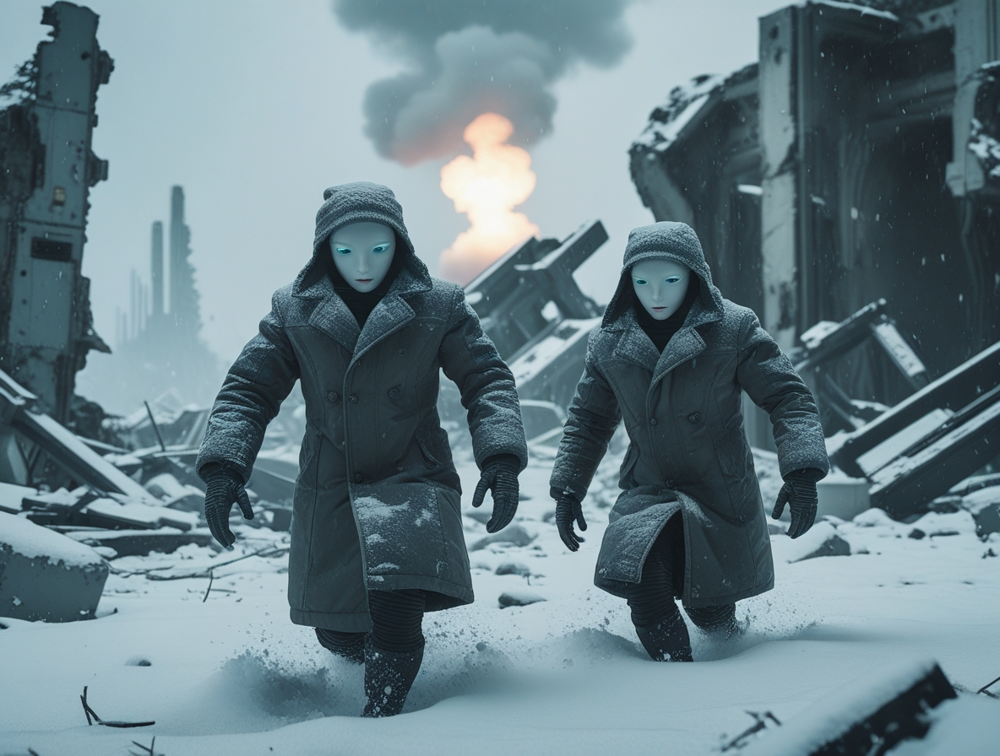
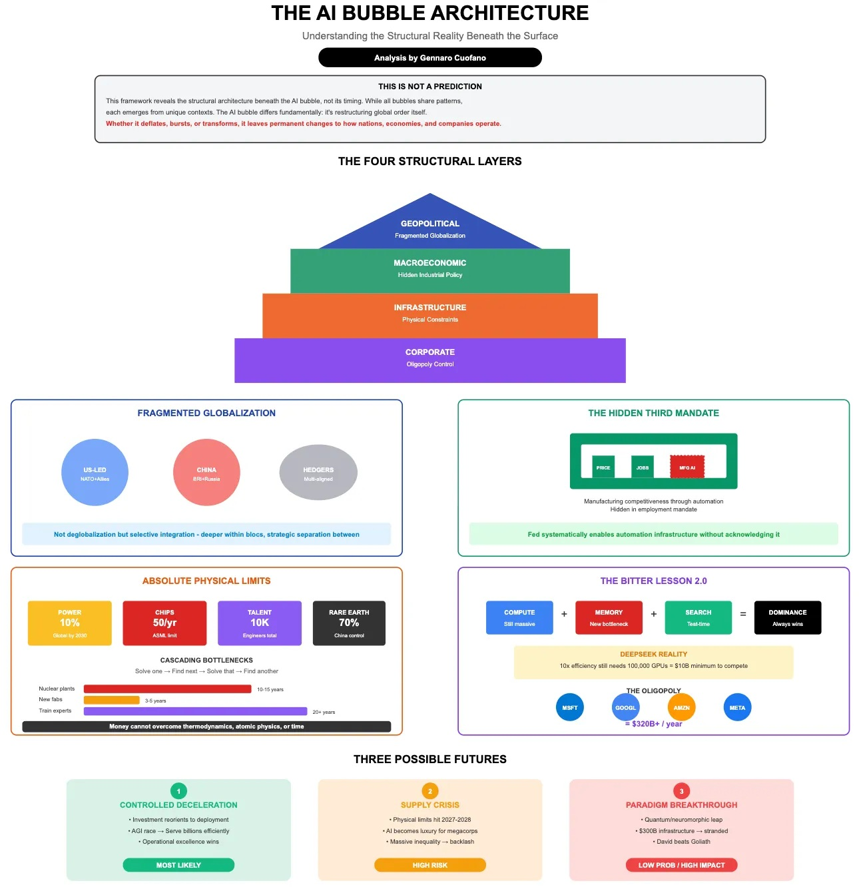

# Die Zukunft der KI: Wird die Blase platzen und der Winter zurückkehren?

*Wie der Protagonist von Memento, der entdeckt, dass er seinem eigenen Gedächtnis nicht trauen kann, steht die künstliche Intelligenz des Jahres 2025 vor einer unbequemen Wahrheit: Vielleicht ist sie doch nicht so intelligent, wie wir dachten. [Sam Altman, CEO von OpenAI, hat kürzlich zugegeben](https://www.cnbc.com/2025/08/18/openai-sam-altman-warns-ai-market-is-in-a-bubble.html), was viele in den Gängen des Silicon Valley tuschelten: Der KI-Markt befindet sich in einer Blase, genau wie bei den Dotcoms zu Beginn des neuen Jahrtausends. Die Geschichte, wie es in der Technologiewelt oft der Fall ist, scheint dazu bestimmt zu sein, sich nach einem vor Jahrzehnten geschriebenen Drehbuch zu wiederholen.*

### Die ewige Wiederkehr des digitalen Winters?

Um zu verstehen, wohin wir gehen, müssen wir uns ansehen, woher wir kommen. [Der Begriff "KI-Winter", der 1984 während einer öffentlichen Debatte der AAAI geprägt wurde](https://en.wikipedia.org/wiki/AI_winter), beschreibt jene wiederkehrenden Perioden, in denen die Begeisterung für künstliche Intelligenz der Enttäuschung weicht, gefolgt von drastischen Mittelkürzungen und schließlich der Aufgabe ernsthafter Forschung. Roger Schank und Marvin Minsky, zwei Pioniere, die den ersten Winter der 1970er Jahre am eigenen Leib erfahren hatten, verglichen dieses Phänomen mit einem "nuklearen Winter": eine Kettenreaktion, die mit Pessimismus in der wissenschaftlichen Gemeinschaft beginnt, sich über die Medien verbreitet und mit dem Ende der Finanzierung endet.

Die nukleare Metapher war kein Zufall. Wie in den Science-Fiction-Filmen der 1980er Jahre, in denen postapokalyptische Szenarien die Ängste der Zeit darstellten, spiegelte der KI-Winter die Angst eines Sektors wider, der zu viel versprochen und zu wenig geliefert hatte. [Der erste große Zusammenbruch ereignete sich zwischen 1974 und 1980](https://en.wikipedia.org/wiki/AI_winter), gefolgt von einer zweiten Eiszeit zwischen 1987 und 2000.

### Die Geschichte von zwei Wintern

Der erste KI-Winter hat tiefe Wurzeln im Scheitern der maschinellen Übersetzung. In den 1950er und 1960er Jahren hatte der Kalte Krieg Träume von Maschinen beflügelt, die in der Lage sein sollten, russische Dokumente sofort zu übersetzen. [Das Georgetown-IBM-Experiment von 1954 hatte nur 49 russische Sätze ins Englische übersetzt](https://en.wikipedia.org/wiki/AI_winter), mit einem Vokabular von nur 250 Wörtern, aber die Schlagzeilen sprachen von "polyglotten Robotergehirnen". Wie so oft hatten die Medien eine begrenzte Demonstration aufgebauscht und sie in eine bevorstehende Revolution verwandelt.

Die Realität erwies sich als komplexer. Das Problem der semantischen Disambiguierung – jene einzigartig menschliche Fähigkeit, den Kontext zu verstehen – erwies sich als so knifflig wie das Entschlüsseln der Rätsel des Riddlers in Batman. Ein apokryphes, aber emblematisches Beispiel: "Der Geist ist willig, aber das Fleisch ist schwach" wurde aus dem Russischen übersetzt zu "Der Wodka ist gut, aber das Fleisch ist faul". [1966 kam der National Research Council zu dem Schluss, dass die maschinelle Übersetzung teurer, ungenauer und langsamer sei als die menschliche](https://en.wikipedia.org/wiki/AI_winter), was das Ende von zwanzig Millionen Dollar an Investitionen bedeutete und akademische Karrieren zerstörte.

[Parallel dazu zerstörte der Lighthill-Bericht von 1973 die Glaubwürdigkeit der britischen KI](https://en.wikipedia.org/wiki/AI_winter) und kritisierte das "totale Versagen der KI, ihre hochtrabenden Ziele zu erreichen". Sir James Lighthill identifizierte das Problem der "kombinatorischen Explosion": Die vielversprechendsten Algorithmen der Zeit blieben bei realen Problemen stecken und funktionierten nur bei "Spielzeug"-Versionen der Realität. Das Ergebnis war die vollständige Demontage der KI-Forschung im Vereinigten Königreich, wobei nur drei Universitäten überlebten.

### Der zweite Akt der Tragödie

Die 1980er Jahre brachten eine Wiedergeburt durch Expertensysteme. [XCON, entwickelt von der Carnegie Mellon für die Digital Equipment Corporation, sparte dem Unternehmen in sechs Jahren 40 Millionen Dollar](https://en.wikipedia.org/wiki/AI_winter) und löste einen digitalen Goldrausch aus. 1985 gaben Unternehmen über eine Milliarde Dollar für KI aus, hauptsächlich für interne Abteilungen. Es entstand eine unterstützende Industrie mit Unternehmen wie Symbolics, die spezialisierte Computer – die berühmten LISP-Maschinen – bauten, die für die Verarbeitung der von der amerikanischen KI-Forschung bevorzugten Sprache optimiert waren.

Aber wie in einem Film von David Cronenberg verwandelte sich die Technologie, die die Rettung sein sollte, in eine Falle. [1987, drei Jahre nach der Prophezeiung von Minsky und Schank, brach der Markt für LISP-Maschinen zusammen](https://en.wikipedia.org/wiki/AI_winter). Workstations von Unternehmen wie Sun Microsystems boten leistungsfähigere und billigere Alternativen. Eine ganze Industrie im Wert von einer halben Milliarde Dollar verschwand innerhalb eines Jahres und wurde durch einfachere und beliebtere Desktop-Computer ersetzt.

[Die ersten erfolgreichen Expertensysteme, wie XCON, erwiesen sich als zu teuer im Unterhalt](https://en.wikipedia.org/wiki/AI_winter). Sie waren schwer zu aktualisieren, unfähig zu lernen, "spröde" – ein Begriff in der KI, der die Tendenz bezeichnet, bei ungewöhnlichen Eingaben groteske Fehler zu machen. Expertensysteme erwiesen sich nur in sehr spezifischen Kontexten als nützlich, wie Charakterdarsteller, die nur in maßgeschneiderten Rollen glänzen können.

### Die beunruhigende Gegenwart

Heute, da die KI-Industrie ihren historischen Höhepunkt erlebt – mit Investitionen von 50 Milliarden Dollar im Jahr 2022 und 800.000 offenen Stellen in den Vereinigten Staaten – sind die Anzeichen für einen neuen Winter so greifbar wie der erste Herbstfrost. [OpenAI, das Symbol dieser digitalen Renaissance, verliert 2 Dollar für jeden verdienten Dollar](https://prospect.org/power/2025-03-25-bubble-trouble-ai-threat/), eine unhaltbare finanzielle Dynamik, die an die schlimmsten Exzesse der Dotcom-Blase erinnert.

Die Situation dramatisierte sich mit dem Aufkommen von DeepSeek, dem chinesischen Unternehmen, das im Januar 2025 die Wall Street erschütterte. [Nvidia verlor an einem einzigen Tag fast 600 Milliarden Dollar an Marktwert](https://www.nbcnews.com/business/markets/tech-stocks-react-chinas-deepseek-sparks-us-worries-ai-race-rcna189394), als bekannt wurde, dass [DeepSeek sein R1-Modell in zwei Monaten für weniger als 6 Millionen Dollar entwickelt hatte, während der Konkurrent o1 von OpenAI 600 Millionen gekostet hatte](https://www.tortoisemedia.com/2025/01/27/deepseek-cheap-chinese-ai-burst-us-rivals-bubble).

Wie in Akira, wo Neo-Tokio von einer scheinbar kontrollierbaren Kraft zerstört wird, [hat das Auftauchen von DeepSeek die Grundlagen des amerikanischen KI-Aktienbooms in Frage gestellt](https://www.wsws.org/en/articles/2025/02/01/urhj-f01.html). Wenn ein chinesisches Unternehmen vergleichbare Ergebnisse mit 100-mal geringerem Aufwand erzielen kann, welche Rechtfertigung gibt es dann für die stratosphärischen Bewertungen amerikanischer Unternehmen?

### Die Zahlen, die nicht lügen

Wenn OpenAI gezwungen wäre, Marktpreise für die von ihr massiv genutzten Cloud-Dienste zu zahlen, würden ihre jährlichen Kosten 20 Milliarden Dollar erreichen, was zu tatsächlichen Verlusten von 16 Milliarden pro Jahr führen würde. [Laut The Information kostet allein das Training eines Modells 3 Milliarden Dollar](https://techhq.com/2025/03/will-the-ai-bubble-burst-when-will-artificial-intelligence-market-crash/), Zahlen, die diese Projekte nur so lange wirtschaftlich tragfähig machen, wie die Quersubventionen und spekulativen Investitionen andauern.

Die Mathematik ist so gnadenlos wie ein Theorem: Wenn die führenden Unternehmen des Sektors strukturell Verluste machen, basiert das gesamte Ökosystem auf der Wette, dass zukünftiges Wachstum die gegenwärtigen Investitionen rechtfertigen wird. Es ist dieselbe Logik, die die Dotcoms antrieb, als man glaubte, dass man "früher oder später" einen Weg finden würde, Klicks und Augäpfel zu monetarisieren.

[*Bild von FourWeekMBA*](https://fourweekmba.com/it/l%27architettura-della-bolla-di-intelligenza-artificiale-che-comprende-la-realt%C3%A0-strutturale-sotto-la-superficie/)

### Stimmen von der Front

Die Debatte zwischen Optimisten und Pessimisten spiegelt die Diskussionen früherer Winter wider. Einerseits argumentieren die Befürworter der "technologischen Vielfalt", dass die heutige KI eine solidere Grundlage hat als die Expertensysteme der 1980er Jahre. Große Sprachmodelle haben emergente Fähigkeiten gezeigt, die über die einfache Manipulation von Symbolen hinausgehen, und ihre Integration in bestehende Systeme ist so tiefgreifend wie die von Mikroprozessoren in den 1990er Jahren.

Andererseits weisen Kritiker auf beunruhigende Parallelen hin. Wie in den 1980er Jahren, als LISP-Maschinen bis zu dem Tag, an dem sie es nicht mehr waren, unverzichtbar schienen, könnte die derzeitige KI-Infrastruktur anfällig für technologische Diskontinuitäten sein. [Der kostengünstige Ansatz von DeepSeek hat bereits die grundlegenden Annahmen des Sektors in Frage gestellt](https://medium.com/@diegovallarino/deepseek-and-the-ai-bubble-are-we-underestimating-disruption-f7e2343fb7d0) und Fragen zur Nachhaltigkeit des aktuellen Investitionsmodells aufgeworfen.

Aber es gibt einen dritten Weg, den des "kritischen Realismus", verkörpert durch Persönlichkeiten wie Gary Marcus, den Kognitionswissenschaftler und KI-Forscher, der seit Jahren auf dem schmalen Grat zwischen technologischer Begeisterung und Katastrophismus wandelt. [Marcus, der die aktuelle KI-Blase bereits 2023 vorhersagte,](https://fortune.com/2025/08/24/is-ai-a-bubble-market-crash-gary-marcus-openai-gpt5/) leugnet nicht das transformative Potenzial der Technologie, weist aber darauf hin, dass "die aktuellen Bewertungen an Wile E. Coyote erinnern, der in der Luft läuft: Wir sind über dem Abgrund". Seine Position ist nicht die eines Neoludditen, der den Fortschritt ablehnt, sondern die eines Wissenschaftlers, der Ockhams Rasiermesser auf grandiose Versprechungen anwendet: Die generative KI hat erstaunliche Fähigkeiten gezeigt, aber ihre grundlegenden Einschränkungen – von der Unfähigkeit, logisch zu schlussfolgern, bis zur Tendenz zu Halluzinationen – bleiben trotz Milliardeninvestitionen ungelöst. [Wie er auf seinem Substack schrieb,](https://garymarcus.substack.com/p/things-are-so-desperate-at-openai) "es gibt eine Blase, die Arithmetik macht das deutlich, was nicht bedeutet, dass es danach keine sehr bedeutenden Entwicklungen geben wird". Es ist die Position von jemandem, der den Winter nicht als Katastrophe sieht, sondern als notwendige Korrektur, die den technologischen Weizen von der spekulativen Spreu trennen wird, damit wirklich nützliche Innovationen aus der Asche des Hypes entstehen können.

### Der geopolitische Faktor

Was das Bild verkompliziert, ist eine Dimension, die frühere Winter nicht kannten: der geopolitische Wettbewerb. KI ist zu einem nationalen strategischen Gut geworden, und der Erfolg von Unternehmen wie DeepSeek stellt nicht nur eine kommerzielle Herausforderung dar, sondern eine Frage der nationalen Sicherheit. [Investoren äußern bereits Bedenken hinsichtlich der von chinesischen Unternehmen verwalteten personenbezogenen Daten](https://news.crunchbase.com/ai/chinas-deepseek-tech-openai-nvda/) und spiegeln damit die Ängste wider, die die TikTok-Saga geprägt haben.

Diese geopolitische Dimension könnte paradoxerweise einen möglichen Winter sowohl beschleunigen als auch verzögern. Einerseits könnten westliche Regierungen die öffentliche Unterstützung verstärken, um die technologische Wettbewerbsfähigkeit zu erhalten. Andererseits könnte die Fragmentierung des globalen Marktes die Skaleneffekte verringern, die zur Amortisierung der enormen Investitionen in F&E erforderlich sind.

### Lehren aus der Vergangenheit, Signale aus der Zukunft

Die Geschichte der KI-Winter lehrt, dass Technologien gültig und revolutionär sein können, ohne notwendigerweise die Marktbewertungen ihrer Zeit zu rechtfertigen. [Das Internet existierte und funktionierte auch während des Dotcom-Crashs](https://en.wikipedia.org/wiki/AI_winter), ebenso wie viele Techniken der künstlichen Intelligenz während früherer Winter weiterentwickelt wurden, oft "getarnt" unter verschiedenen Namen, um das mit KI verbundene Stigma zu vermeiden.

[Nick Bostrom bemerkte 2006, dass "viele hochmoderne KI in allgemeine Anwendungen eingeflossen sind, oft ohne als KI bezeichnet zu werden, denn sobald etwas nützlich und verbreitet genug wird, wird es nicht mehr als KI bezeichnet"](https://en.wikipedia.org/wiki/AI_winter). Es ist das Paradox des technologischen Erfolgs: Die nachhaltigsten Innovationen werden unsichtbar und in das tägliche Gewebe der Gesellschaft integriert.

### Das Urteil der Realität

Während ich schreibe, [haben sich die Märkte teilweise von dem durch DeepSeek verursachten Absturz erholt](https://www.wsws.org/en/articles/2025/02/01/urhj-f01.html), aber die Risse im Gebäude des KI-Hypes sind sichtbar. Es geht nicht darum festzustellen, ob ein Winter kommen wird – die Geschichte legt nahe, dass er unvermeidlich ist – sondern darum zu verstehen, welche Form er annehmen wird und welche Technologien den Frost überleben werden.

Die künstliche Intelligenz hat, wie Prometheus im griechischen Mythos, den Menschen das Feuer des Wissens gebracht. Aber jetzt, wie in jeder sich selbst achtenden Tragödie, ist es an der Zeit, den Preis zu zahlen. Die Frage ist nicht, ob der Winter kommen wird, sondern ob die Industrie diesmal genug aus der Geschichte gelernt hat, um solidere Zufluchtsorte zu bauen. Schließlich, wie Philip K. Dick lehrte, ist die Realität das, was nicht verschwindet, auch wenn man aufhört, daran zu glauben.
