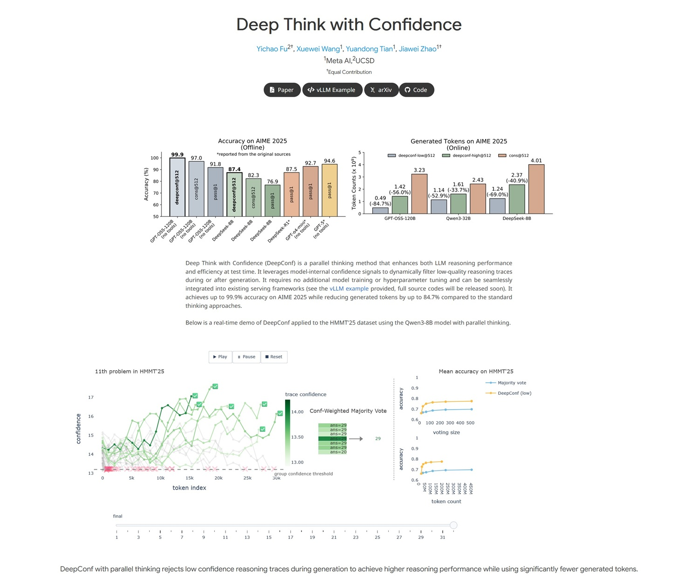

# DeepConf-Revolution: Mehr Präzision und weniger Ressourcen für LLMs

*Stellen Sie sich vor, Sie befinden sich in einer besonders schwierigen Mathematikprüfung. Sie stehen vor einem Problem, das Ihnen den kalten Schweiß auf die Stirn treibt, eines von der Sorte der Mathe-Olympiaden, die selbst die Klügsten zum Weinen bringen. Die klassische Strategie? Versuch und Irrtum, Dutzende verschiedener Versuche aufschreiben in der Hoffnung, dass einer richtig ist. Aber es gibt einen klügeren Ansatz: zu erkennen, wann man in die falsche Richtung geht, und anzuhalten, bevor man Zeit und Energie verschwendet.*

Genau das hat ein junges Forscherteam von Meta AI unter der Leitung von [Jiawei Zhao](https://jiaweizzhao.github.io/deepconf/), einem Forscher bei Meta AI FAIR mit Ausbildung am renommierten Caltech, zusammen mit seinen Kollegen [Yichao Fu und Xuewei Wang](https://ai.meta.com/research/publications/deep-think-with-confidence/) getan.

Ihre Arbeit, die erst vor wenigen Wochen auf arXiv unter dem Titel ["Deep Think with Confidence"](https://arxiv.org/abs/2508.15260) veröffentlicht wurde, stellt eine jener Entdeckungen dar, die im Nachhinein einfach erscheinen, aber in Wirklichkeit eine bemerkenswerte technische Komplexität verbergen. Wie die scheinbar triviale Geste von Archimedes in der Badewanne geht auch diese Forschung von einer elementaren Beobachtung aus: Wenn eine künstliche Intelligenz schlecht schlussfolgert, warum bringt man ihr nicht bei, es selbst zu erkennen?

## Das Problem: Wenn "Mehr Denken" Nicht Ausreicht

Um die revolutionäre Tragweite dieses Ansatzes zu verstehen, machen wir einen Schritt zurück. Große Sprachmodelle, die wir alle LLMs nennen, haben eine besondere Eigenschaft, wenn sie mit komplexen Problemen konfrontiert werden: Je mehr Versuche sie unternehmen, desto besser werden ihre Antworten. Es ist, als wären sie besonders hartnäckige Schüler, die eine Übung so lange wiederholen, bis sie sie richtig machen.

Dieser Ansatz, technisch als "test-time scaling" bezeichnet, funktioniert nach einer scheinbar einfachen Logik: Wenn man das Modell fünfzig verschiedene Lösungen für ein Problem generieren lässt und dann die häufigste auswählt, steigen die Chancen, die richtige zu treffen, drastisch. Das ist das Prinzip der "self-consistency with majority voting" (Selbstkonsistenz mit Mehrheitsentscheid), eine Strategie, die seit Jahren hervorragend funktioniert.

Aber es gibt ein Problem, eigentlich zwei. Das erste ist wirtschaftlicher Natur: Dutzende oder Hunderte von Antworten zu generieren, kostet ein Vermögen an Rechenleistung. Es ist, als würde man fünfzig Computer mieten, um dieselbe Berechnung durchzuführen, in der Hoffnung, dass die Mehrheit zum richtigen Ergebnis kommt. Das zweite Problem ist subtiler: Ab einem bestimmten Punkt verbessert das Hinzufügen weiterer Versuche die Ergebnisse nicht mehr signifikant. Das ist das klassische "Gesetz der abnehmenden Erträge", das Ökonomen gut kennen, angewandt auf die Welt der künstlichen Intelligenz.

## Die Lösung: Von "Stärker" zu "Klug"

Und hier kommt die geniale Einsicht des Meta-Teams ins Spiel. Anstatt das Problem weiterhin mit roher Rechenkraft zu bearbeiten, warum nicht dem Modell beibringen zu erkennen, wann es im Begriff ist, einen falschen Weg einzuschlagen? Es ist ein bisschen wie der Näherungssensor in modernen Autos: Anstatt auf den Aufprall zu warten, warnt er Sie, bevor Sie gegen ein Hindernis fahren.

[DeepConf, so der Name der neuen Methode](https://ai.meta.com/research/publications/deep-think-with-confidence/), nutzt das, was die Forscher "interne Konfidenzsignale des Modells" nennen. Einfach ausgedrückt: Jedes Mal, wenn ein LLM ein Wort oder ein Konzept generiert, hat es eine Art "internes Thermometer", das anzeigt, wie sicher es sich bei dieser Wahl ist. Es ist, als ob Sie eine Quizfrage beantworten: Manchmal sind Sie sich zu 100 % sicher, ein anderes Mal zögern Sie zwischen zwei Optionen.

Die Brillanz von DeepConf liegt darin, dieses interne "Zögern" in einen intelligenten Filter zu verwandeln. Anstatt blind Hunderte von Versuchen zu generieren und sie dann einzeln zu zählen, überwacht das System in Echtzeit das Vertrauen des Modells und verwirft automatisch die Gedankengänge, die zu hohe Unsicherheitszeichen aufweisen. Es ist, als hätte man einen persönlichen Assistenten, der einem ins Ohr flüstert: "Vielleicht ist es besser, wenn du einen anderen Ansatz versuchst", wenn er sieht, dass man sich in einer falschen Lösung verheddert.

## Wie es funktioniert: Die Geheimnisse der neuen Architektur

Technisch gesehen arbeitet DeepConf auf zwei komplementären Ebenen. Die erste ist das, was die Forscher "filtering during generation" nennen, also das Filtern während der Generierung. Stellen Sie sich vor, Sie sind Sherlock Holmes, der, während er laut nachdenkt, merkt, dass er einer falschen Spur folgt, und sofort die Richtung ändert. Genau das tut DeepConf: Es überwacht die internen logarithmischen Wahrscheinlichkeiten des Modells Token für Token und unterbricht, wenn es Unsicherheitsmuster erkennt, diese spezielle Gedankenkette und startet eine neue.

Die zweite Ebene ist das "filtering after generation", das eher wie ein erfahrener Redakteur funktioniert. Sobald das Modell mehrere vollständige Lösungen generiert hat, analysiert DeepConf rückblickend die Konfidenzsignale jeder Gedankenspur und weist ihnen eine Zuverlässigkeitsbewertung zu. Es ist, als hätte man einen Korrekturleser, der nicht nur Fehler zählt, sondern die allgemeine Stimmigkeit des Gedankengangs bewertet.

Die wahre Magie liegt jedoch in der Einfachheit der Implementierung. Wie die Autoren in ihrem Paper betonen, [benötigt DeepConf kein zusätzliches Training des Modells oder eine Optimierung von Hyperparametern](https://arxiv.org/abs/2508.15260). Es ist ein "Plug-and-Play"-Ansatz, der in bestehende Serving-Frameworks wie vLLM ohne wesentliche Änderungen an der Architektur integriert werden kann. Es ist wie die Installation einer neuen Software auf Ihrem Computer: Sie müssen die Hardware nicht ändern, es funktioniert mit dem, was Sie bereits haben.

[*Bild von jiaweizzhao.github.io/deepconf*](https://jiaweizzhao.github.io/deepconf/)

## Die erstaunlichen Zahlen

Die vom Meta-Team erzielten Ergebnisse sind, gelinde gesagt, beeindruckend und haben den Geschmack von "zu gut, um wahr zu sein", der wirklich innovative Entdeckungen auszeichnet. Bei AIME 2025, einem der schwierigsten Benchmarks für mathematisches Denken (stellen Sie es sich als die Abiturprüfung für künstliche Intelligenzen vor), [erreichte DeepConf eine Genauigkeit von 99,9 % und reduzierte gleichzeitig den Token-Verbrauch um 84,7 %](https://venturebeat.com/ai/metas-deepconf-offers-a-dial-to-balance-llm-reasoning-cost-and-accuracy) im Vergleich zu herkömmlichen Methoden.

Um die Tragweite dieser Zahlen zu verstehen, machen wir einen filmischen Vergleich. Es ist, als hätte jemand einen Weg erfunden, Filme in Hollywood-Qualität mit einem Zehntel des üblichen Budgets zu drehen und dabei die gleiche visuelle und narrative Qualität beizubehalten. In der Welt der KI, in der jedes generierte Token messbare Rechenkosten hat, bedeutet eine Reduzierung um 85 % buchstäblich eine Senkung der Betriebskosten um eine Größenordnung.

Aber es ist nicht nur eine wirtschaftliche Frage. Der faszinierendste Aspekt ist, dass DeepConf es schafft, die Leistung gerade durch die Beseitigung von Rechen-"Rauschen" zu verbessern. Es ist kontraintuitiv: Normalerweise erhält man in der Informatik bessere Ergebnisse, je mehr Ressourcen man auf ein Problem wirft. Hier geschieht das Gegenteil: Durch das Entfernen von Versuchen geringer Qualität tritt das Signal klarer aus dem Hintergrundrauschen hervor.

Die Tests wurden an den fortschrittlichsten Open-Source-Modellen durchgeführt, darunter Qwen 3 und die GPT-OSS-Serie, was zeigt, dass der Ansatz über verschiedene Architekturen hinweg funktioniert. Es ist, als würde man entdecken, dass ein Trick sowohl auf dem iPhone als auch auf Android funktioniert: Das bedeutet, dass man wahrscheinlich etwas Grundlegendes gefunden hat.

## Zwei Modi, ein Ziel

DeepConf arbeitet in zwei verschiedenen Modi, wie ein Sportwagen, der sowohl im Eco- als auch im Performance-Modus fahren kann. Der "Offline"-Modus analysiert alle generierten Gedankenspuren und wählt dann diejenigen mit den besten Konfidenzsignalen aus. Er ist perfekt für Anwendungen, bei denen Sie Zeit zum Nachdenken haben und die höchstmögliche Genauigkeit wünschen.

Der "Online"-Modus hingegen ist für Echtzeitanwendungen gedacht, bei denen die Geschwindigkeit entscheidend ist. In diesem Fall unterbricht DeepConf dynamisch Gedankenspuren, die Anzeichen für geringes Vertrauen aufweisen, und startet im laufenden Betrieb neue. Es ist, als hätte man ein intelligentes GPS, das, anstatt eine Route weiter zu berechnen, von der es weiß, dass sie falsch ist, sofort den Kurs zu einem vielversprechenderen Ziel ändert.

Die Flexibilität dieses Ansatzes ist eine seiner Stärken. Entwickler können das System an ihre spezifischen Bedürfnisse anpassen: konservativer für kritische Anwendungen, bei denen Fehler nicht tolerierbar sind, aggressiver für Anwendungsfälle, bei denen die Geschwindigkeit über absolute Perfektion siegt.

## Praktische Auswirkungen: Die wirtschaftliche Revolution

Die wirtschaftlichen Auswirkungen von DeepConf könnten für die KI-Branche verheerend sein, im positiven Sinne. Denken Sie an die Implikationen: Wenn Sie die gleiche Leistung eines Systems, das 1000 Dollar pro Tag kostet, mit einem erhalten können, das 150 Dollar kostet, werden plötzlich Dienstleistungen, die zuvor wirtschaftlich untragbar waren, für ein viel breiteres Publikum von Nutzern und Unternehmen zugänglich.

Aber es geht nicht nur um direkte Kosten. Die Reduzierung der generierten Token bedeutet auch geringere CO2-Emissionen, weniger Stress für die Rechenzentren und letztendlich eine ökologisch nachhaltigere KI. Es ist, als würde man von einem SUV, der 15 Liter pro 100 Kilometer verbraucht, auf ein Hybridauto umsteigen, das 4 Liter verbraucht, und dabei die gleiche Geschwindigkeit und den gleichen Komfort beibehalten.

Für Unternehmen, die LLM-basierte Dienste anbieten, stellt DeepConf einen potenziellen Wettbewerbsvorteil dar. Wer es zuerst implementiert, kann qualitativ hochwertigere Dienstleistungen zu niedrigeren Preisen anbieten und so einen Wettbewerbsvorteil schaffen, der ganze Branchen neu definiert. Es ist die klassische "Disruption", von der Clayton Christensen spricht, angewandt auf die Welt der künstlichen Intelligenz.

## Zukunftsaussichten: Auf dem Weg zu einer selbstbewussten KI

Aber vielleicht ist der faszinierendste Aspekt von DeepConf nicht einmal die unmittelbaren Ergebnisse, sondern das, was es als Forschungsrichtung darstellt. Zum ersten Mal haben wir ein System, das nicht nur Antworten generiert, sondern eine primitive Form der Metakognition entwickelt: die Fähigkeit, über seine eigenen Denkprozesse nachzudenken.

Es ist ein wichtiger Schritt in Richtung dessen, was Forscher als "selbstbewusste KI" bezeichnen, Systeme, die nicht nur Probleme lösen, sondern sich auch bewusst sind, wie sie sie lösen und vor allem, wann sie scheitern. Wir sprechen nicht von Bewusstsein im Science-Fiction-Sinne des Wortes, sondern von einer Form prozeduraler Intelligenz, die weiß, wann sie sich selbst vertrauen und wann sie skeptisch sein muss.

Das Meta-Team hat gezeigt, dass diese Art von "konstruktivem Selbstzweifel" implementiert werden kann, ohne bestehende Architekturen zu überarbeiten, und ebnet so den Weg für eine neue Generation effizienterer und wirtschaftlicherer Modelle. Es ist, als hätten wir einen Weg gefunden, Maschinen nicht nur klüger, sondern auch weiser zu machen, in dem Sinne, dass sie ihre eigenen Grenzen erkennen.

Mit Blick auf die Zukunft könnte DeepConf nur der Anfang einer umfassenderen Revolution sein. Wenn Maschinen lernen können, ihre eigenen Antworten im mathematischen Bereich anzuzweifeln, was hindert sie daran, dasselbe Prinzip auf kreatives Schreiben, die Lösung ethischer Probleme oder sogar auf die wissenschaftliche Forschung anzuwenden? Der Weg zu einer wirklich universellen künstlichen Intelligenz könnte genau über diese Fähigkeit zur konstruktiven Selbstkritik führen.

Die Arbeit von Zhao und seinen Kollegen zeigt, dass die wichtigsten Revolutionen manchmal aus den einfachsten Einsichten entstehen. In einer Welt, in der jeder immer größere und leistungsfähigere Modelle verfolgt, haben sie sich entschieden, auf Effizienz und Selbstbewusstsein zu setzen. Wie der gute alte Einstein sagen würde: "Alles sollte so einfach wie möglich gemacht werden, aber nicht einfacher." DeepConf scheint dieses Gleichgewicht perfekt getroffen zu haben und eröffnet neue Grenzen für eine intelligentere, nachhaltigere und paradoxerweise menschlichere KI in ihrer Fähigkeit, sich selbst in Frage zu stellen.
