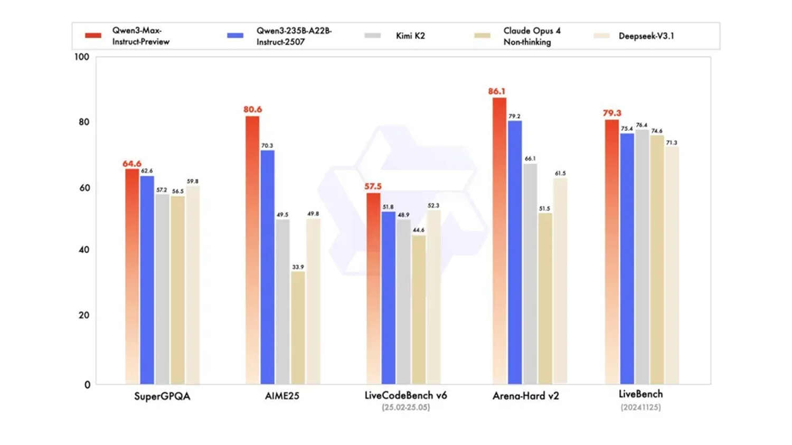

# Qwen3-Max-Preview: Il Colosso da 1 Trilione di parametri

*Il 5 settembre 2025 segna una data spartiacque nell'evoluzione dell'intelligenza artificiale globale. [Alibaba ha ufficialmente presentato Qwen3-Max-Preview](https://www.marktechpost.com/2025/09/06/alibaba-ai-unveils-qwen3-max-preview-a-trillion-parameter-qwen-model-with-super-fast-speed-and-quality/), il primo modello della famiglia Qwen a superare la soglia psicologica del trilione di parametri. Un traguardo che non è solo numerico, ma rappresenta l'ingresso della Cina nel ristretto club delle potenze tecnologiche capaci di competere ai massimi livelli nell'arena dell'AI generativa.*

Come Akira che si risveglia dal criostato nel capolavoro di Otomo, questo colosso computazionale emerge in un momento in cui l'industria sembrava orientata verso modelli più compatti ed efficienti. La scelta di Alibaba di puntare in alto, molto in alto, rappresenta una dichiarazione d'intenti che ribalta le aspettative del mercato e riaccende la corsa alle dimensioni estreme.

## Un Trilione di Ragioni per Stupirsi

I numeri di Qwen3-Max-Preview sono impressionanti anche per gli standard odierni. [Con oltre 1 trilione di parametri](https://www.opensourceforu.com/2025/09/alibabas-qwen3-max-hits-1-trillion-parameters-but-drops-open-source-access/), il modello gestisce una finestra di contesto di 262.144 token, suddivisi in 258.048 token di input e 32.768 di output. Per mettere in prospettiva questi numeri, significa poter processare simultaneamente l'equivalente di circa 500 pagine di testo, una capacità che apre scenari applicativi fino a ieri impensabili.

L'architettura integra anche funzionalità di context caching, una soluzione ingegneristica che accelera significativamente le sessioni multi-turno riducendo la latenza nelle conversazioni prolungate. È come avere un assistente che non solo ricorda tutto ciò che gli avete detto, ma lo mantiene sempre a portata di mano senza dover ogni volta ripartire da capo.

Binyuan Hui, Staff Research Scientist del Qwen Team, ha confermato che "Qwen-Max ha scalato con successo a 1T di parametri e lo sviluppo continua ad avanzare", lasciando intendere che questa versione Preview potrebbe essere solo l'antipasto di qualcosa di ancora più ambizioso.

## Quando Saitama Entra nell'Arena

I benchmark parlano chiaro e certificano le prestazioni di questo gigante cinese. [Qwen3-Max-Preview supera il precedente modello di punta dell'azienda, Qwen3-235B-A22B-2507](https://www.marktechpost.com/2025/09/06/alibaba-ai-unveils-qwen3-max-preview-a-trillion-parameter-qwen-model-with-super-fast-speed-and-quality/), e compete direttamente con i migliori modelli occidentali su test standardizzati come SuperGPQA, AIME25, LiveCodeBench v6, Arena-Hard v2 e LiveBench.

Particolarmente significativo è il confronto con Claude Opus 4, GPT-4 e altri modelli di punta, dove Qwen3-Max-Preview dimostra prestazioni competitive se non superiori in diverse categorie. Come Saitama in One Punch Man, questo modello cinese è arrivato quasi dal nulla a competere con i campioni consolidati, portando una potenza computazionale che ridefinisce gli equilibri del settore.

I primi tester riportano velocità di risposta sorprendenti, talvolta superiori a ChatGPT, e comportamenti di reasoning emergenti che non erano stati specificamente programmati. Ahsen Khaliq di Hugging Face ha documentato la capacità creativa del modello generando un giardino voxel pixelato con un singolo prompt, dimostrando versatilità che va ben oltre i benchmark tradizionali.

[Immagine tratta da marketechpost.com](https://www.marktechpost.com/2025/09/06/alibaba-ai-unveils-qwen3-max-preview-a-trillion-parameter-qwen-model-with-super-fast-speed-and-quality/)

## Il Grande Tradimento dell'Open Source

Ma è qui che la storia prende una piega inaspettata. [A differenza dei precedenti rilasci Qwen, questo modello non sarà disponibile in versione open source](https://www.opensourceforu.com/2025/09/alibabas-qwen3-max-hits-1-trillion-parameters-but-drops-open-source-access/). L'accesso è limitato esclusivamente alle API di Alibaba Cloud, Qwen Chat, OpenRouter e come strumento predefinito in AnyCoder di Hugging Face.

Questa svolta rappresenta una rottura paradigmatica per Alibaba, che in passato aveva costruito la propria reputazione nell'AI proprio sulla filosofia dell'accesso aperto. I precedenti modelli Qwen avevano sfidato i laboratori occidentali proprio grazie alla disponibilità immediata dei pesi del modello, permettendo a ricercatori e sviluppatori di tutto il mondo di sperimentare e contribuire al miglioramento delle prestazioni.

La scelta del closed source solleva interrogativi profondi sul futuro dell'innovazione distribuita nell'AI. Se da un lato è comprensibile il desiderio di monetizzare investimenti così imponenti, dall'altro si apre un precedente preoccupante per l'ecosistema di ricerca globale. È come se la Biblioteca di Alessandria decidesse improvvisamente di chiudere i battenti al pubblico, mantenendo l'accesso solo per i clienti paganti.

## Il Fattore Tempo nell'Era dell'AI

Il timing del lancio di Qwen3-Max-Preview non è casuale e rivela una strategia temporale sofisticata che merita un'analisi approfondita. Mentre l'industria occidentale si concentrava su modelli più efficienti e compatti seguendo la filosofia del "less is more", Alibaba ha scommesso su una direzione opposta, investendo massicciamente in una scala computazionale che oggi si rivela vincente. È una mossa che ricorda la strategia di Kamoshida in Persona 5: mentre tutti gli altri giocatori seguivano le regole convenzionali, qualcuno ha deciso di cambiare completamente le carte in tavola.

[L'annuncio di aggiornamenti "già la prossima settimana" da parte del team di ricerca](https://www.opensourceforu.com/2025/09/alibabas-qwen3-max-hits-1-trillion-parameters-but-drops-open-source-access/) suggerisce un ciclo di sviluppo incredibilmente accelerato, possibile solo grazie a risorse computazionali e umane di scala industriale. Questo ritmo di innovazione pone i competitor occidentali di fronte a una sfida inedita: competere non solo sulla qualità del singolo modello, ma sulla velocità di iterazione e miglioramento continuo.

L'integrazione strategica con piattaforme già consolidate come OpenRouter e AnyCoder di Hugging Face dimostra una comprensione matura dell'ecosistema globale degli sviluppatori. Alibaba non sta solo lanciando un prodotto, sta costruendo un ponte verso la community internazionale mantenendo però il controllo totale sulla tecnologia di base. È una strategia che combina apertura apparente e controllo sostanziale, permettendo l'adozione diffusa senza rinunciare ai vantaggi competitivi del closed source.

## Prestazioni da Supercar, Prezzo da Utilitaria

Il modello di pricing di Qwen3-Max-Preview segue una struttura a livelli basata sui token utilizzati. [I costi partono da $0.861 per milione di token di input nella fascia 0-32K, per arrivare a $2.151 per milione nella fascia più alta di 128K-252K token](https://www.marktechpost.com/2025/09/06/alibaba-ai-unveils-qwen3-max-preview-a-trillion-parameter-qwen-model-with-super-fast-speed-and-quality/). I token di output seguono una progressione simile ma con costi maggiorati, arrivando fino a $8.602 per milione nella fascia più alta.

Questa struttura tariffaria rivela una strategia commerciale sofisticata: rendere il modello economicamente accessibile per compiti semplici e brevi, ma scalare significativamente i costi per utilizzi intensivi a lungo contesto. È una mossa che democratizza l'accesso alle capacità di base mantenendo margini interessanti sui casi d'uso enterprise più complessi.

Il rapporto qualità-prezzo, soprattutto nelle fasce inferiori di utilizzo, appare competitivo rispetto ai modelli occidentali equivalenti, potenzialmente aprendo nuovi mercati di sviluppatori e piccole aziende che fino ad oggi erano esclusi dall'ecosistema dell'AI di frontiera.

## Oltre i Benchmark: L'AI che Simula la Vita

Ma dove Qwen3-Max-Preview mostra il suo vero potenziale è negli utilizzi pratici che vanno oltre i test standardizzati. Il modello dimostra capacità emergenti nel reasoning strutturato, nella generazione di codice complesso, nella gestione di dati strutturati e in comportamenti agentici avanzati.

Particolarmente interessanti sono le demo che mostrano simulazioni di popolazioni e sistemi complessi, applicazioni che richiedono non solo potenza computazionale ma anche una comprensione sofisticata delle dinamiche sistemiche. È come guardare Ghost in the Shell e realizzare che le simulazioni sociali del film potrebbero non essere più fantascienza.

La finestra di contesto estesa permette applicazioni fino ad oggi impensabili: analisi di interi romanzi, processing di database complessi, sessioni di coding che mantengono il contesto per migliaia di righe di codice. Sono scenari d'uso che trasformano l'AI da assistente puntuale a partner di lavoro persistente.

## Verso i Modelli Post-Trilione

Superare la soglia del trilione di parametri obbliga però, secondo noi, a una riflessione critica: la corsa alla pura forza computazionale, sebbene abbia prodotto risultati straordinari, sta mostrando il fianco a costi insostenibili a 360 gradi. Non solo economici (il training di questi giganti richiede investimenti da decine se non centinaia di milioni di dollari), ma soprattutto ambientali, per il consumo energetico mostruoso, e strategici, per la dipendenza da chip e risorse sempre più scarse.

Il futuro, come affrontato anche nell'analisi del nostro ultimo articolo sulla tecnica ["Deep Think with Confidence"](https://aitalk.it/it/ai-deepconf), non può essere un'ulteriore escalation dimensionale. Il vero progresso risiederà in un approccio più "intelligente" e meno avido di risorse: architetture ibride che combinino modelli fondazione più piccoli ma specializzati, tecniche di reasoning strutturato per ridurre i calcoli superflui, e un focus sull'efficienza pura attraverso il model merging e la distillazione. La vera sfida ingegneristica non è addestrare un modello da 2T di parametri, ma ottenere le stesse prestazioni (o migliori) con un decimo delle risorse.

Il prossimo traguardo non sarà un numero più grande, ma un algoritmo migliore. La prossima release "sorprendente" del team Qwen potrebbe, almeno noi lo speriamo, proprio essere un passo in questa direzione: dimostrare che l'intelligenza artificiale può evolversi senza divorare il mondo.

## Il Nuovo Equilibrio delle Forze

L'arrivo di Qwen3-Max-Preview ridisegna la mappa geopolitica dell'intelligenza artificiale. Per la prima volta, un modello cinese compete direttamente con i flagship americani non solo in termini di prestazioni, ma anche di accessibilità commerciale e velocità di deployment.

La scelta strategica di Alibaba di concentrarsi su un modello trilionario mentre i competitor occidentali esploravano l'efficienza a parametri ridotti si rivela oggi una scommessa vincente. È la dimostrazione che nel mondo dell'AI, come negli scacchi di Kasparov contro Deep Blue, una strategia controcorrente può ribaltare completamente le aspettative.

L'impatto sul mercato enterprise sarà probabilmente significativo, soprattutto in Asia dove Alibaba Cloud ha già una presenza consolidata. La combinazione di prestazioni elevate, pricing competitivo e integrazione nativa con l'ecosistema cloud cinese crea un'offerta difficile da ignorare per le aziende della regione.

Il passaggio al closed source, pur controverso, potrebbe segnalare una maturazione del settore verso modelli di business più sostenibili. Se da un lato questo limita l'innovazione open source, dall'altro garantisce le risorse necessarie per sostenere la ricerca a lungo termine su scale computazionali sempre più imponenti.

Qwen3-Max-Preview non è solo un nuovo modello di AI: è il manifesto di una nuova era in cui la supremazia tecnologica non è più appannaggio esclusivo della Silicon Valley. Il dragone si è risvegliato, e il mondo dell'intelligenza artificiale non sarà più lo stesso.