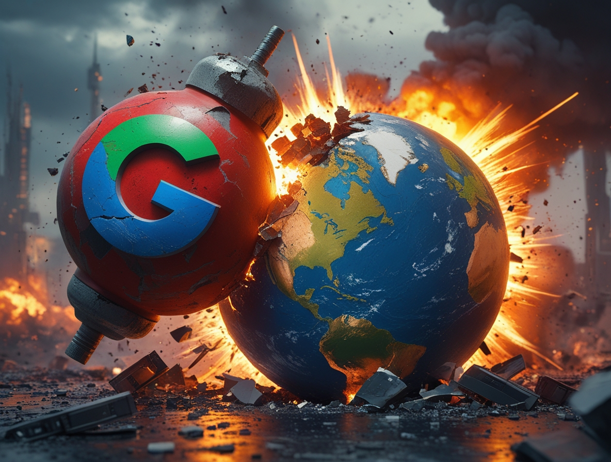
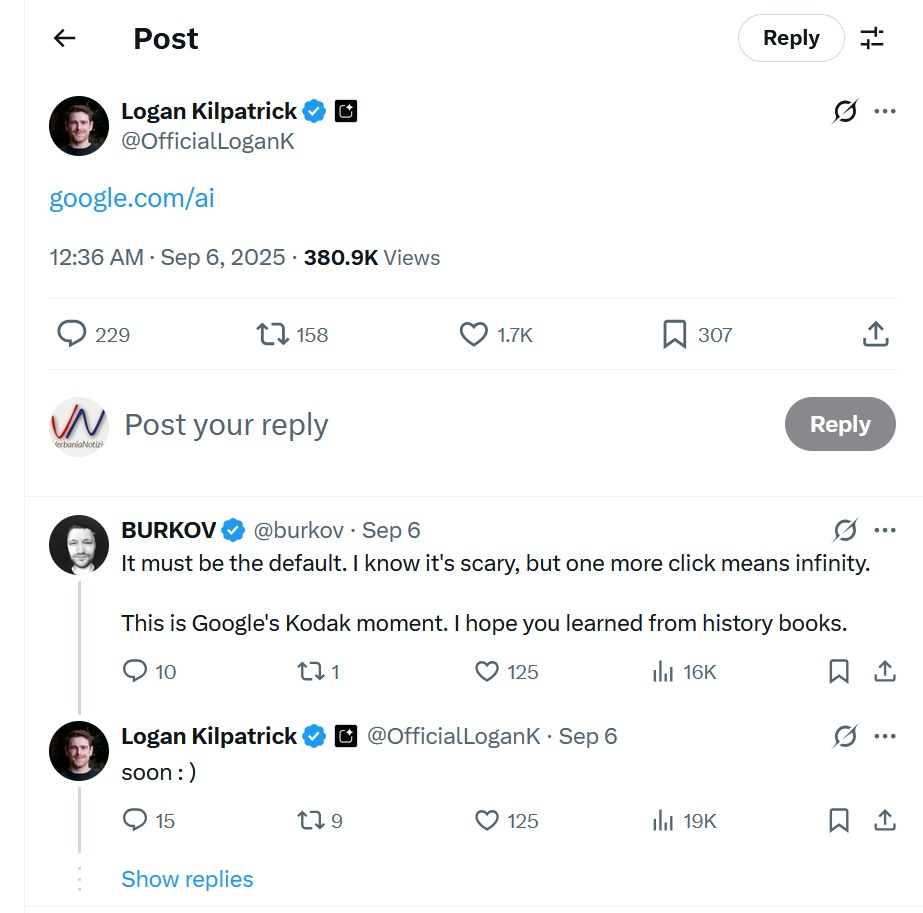
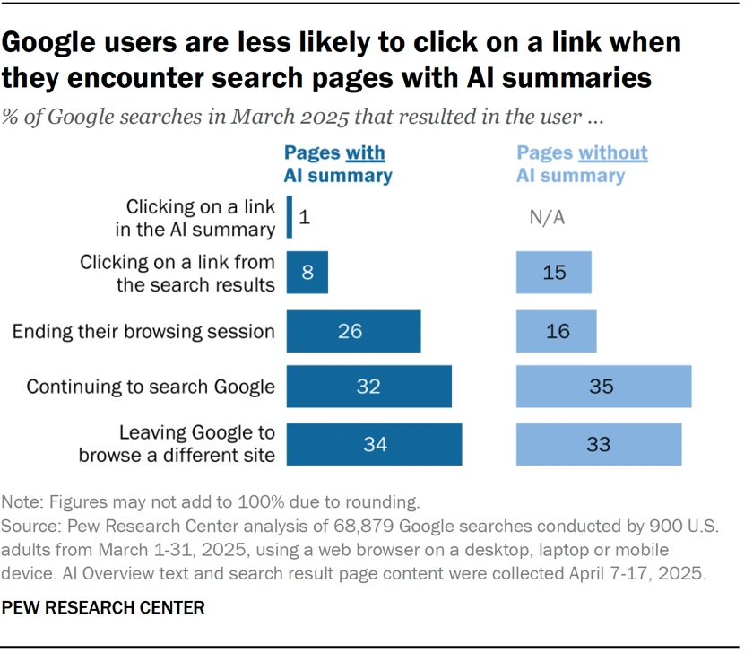

# Google AI Mode: The End of the Internet as We Know It?

*September 6, 2025, will go down in history as the day Logan Kilpatrick, product manager for Google Search, announced what many consider the mass extinction event for the web ecosystem.*

With a seemingly harmless tweet, Kilpatrick announced that [google.com/ai now redirects directly to the standard search](https://www.seroundtable.com/google-ai-mode-default-40067.html), effectively making artificial intelligence the default engine for billions of daily queries. This is no longer an experiment or an optional feature: it is the new reality of the Internet.

As in "The Last of Us," where a parasitic fungus gradually transforms humanity, Google has systematically converted its search ecosystem into something fundamentally different from what we have known for over two decades. The difference is that here it's not science fiction, but a business worth trillions of dollars.

## The Silent Revolution

The metamorphosis did not happen overnight. The first signs date back to the preceding months, when Google began to extensively test AI Overviews, those automatically generated summaries that appear at the top of search results. In May, the company [expanded the feature globally](https://blog.google/products/search/ai-overview-expansion-may-2025-update/), progressively replacing traditional snippets with responses generated by machine learning systems trained on the entire corpus of the web.

The process is reminiscent of Emperor Darth Sidious's strategy in "Star Wars": a gradual, almost imperceptible transformation that culminates in Order 66. Except in this case, the execution order does not concern the Jedi, but the websites that for years have fueled the global information ecosystem. [The Decoder documented](https://the-decoder.com/googles-ai-mode-is-set-to-become-the-new-default-as-its-lawyers-call-the-open-web-in-rapid-decline/) how Google's own lawyers have defined the open web as "in rapid decline," a statement that sounds like an epitaph written by the very company that helped create that reality.

The technological transformation hides a deeper truth: Google is not just changing its algorithm, it is redefining the very concept of search. Instead of providing a list of sources to explore, artificial intelligence synthesizes, summarizes, and presents information directly, creating what researchers call a "cognitive walled garden."

[Image from X OfficialLoganK](https://x.com/OfficialLoganK)

## The Numbers of the Apocalypse

The data collected in recent weeks paints a devastating picture for the publishing ecosystem. [Digital Content Next found](https://digitalcontentnext.org/blog/2025/08/14/facts-googles-push-to-ai-hurts-publisher-traffic/) that most premium publishers have seen traffic drops of 1% to 25% in just eight weeks. Non-news brands have taken the hardest hit with a median decrease of 14%, while news outlets have lost 7% of their referral traffic from Google.

But these already alarming numbers hide an even starker reality. [A study by Authoritas](https://pressgazette.co.uk/media-audience-and-business-data/google-ai-overviews-publishers-report-clickthroughs-authoritas-report/) has shown that when AI Overviews are present, the click-through rate plummets by 47.5% on desktop and 37.7% on mobile. [The New York Times saw its share of organic traffic drop to 36.5% in April 2025](https://techcrunch.com/2025/06/10/googles-ai-overviews-are-killing-traffic-for-publishers/), compared to 44% three years earlier.

The final blow comes from [research by the Pew Research Center](https://www.pewresearch.org/short-reads/2025/07/22/google-users-are-less-likely-to-click-on-links-when-an-ai-summary-appears-in-the-results/), published in July 2025, which reveals staggering data: when users see an AI Overview, they are 50% less likely to click on any link. Even more devastating is the fact that [only 1% of users click on the links within the AI summaries](https://www.searchenginejournal.com/pew-research-confirms-google-ai-overviews-is-eroding-web-ecosystem/551825/). It's as if Google built the world's largest library and then closed all the doors to the books.

About 18% of all Google searches in March 2025 triggered an AI Overview, with summaries averaging 67 words and citing multiple sources. [Wikipedia, YouTube, and Reddit account for 15% of all citations](https://searchengineland.com/google-ai-overviews-hurting-clicks-study-459434), creating an ecosystem increasingly concentrated on a few dominant platforms.

## Anatomy of a Transformation

Technically, the switch to AI Mode represents a Copernican revolution in the architecture of digital information. While traditional search worked like a librarian providing a list of relevant volumes, artificial intelligence acts like a scholar who has already read everything and provides the conclusions directly.

The system is based on Large Language Models trained on huge text corpora, combined with information retrieval algorithms (RAG - Retrieval-Augmented Generation) that draw in real time from Google's databases. When a user makes a query, the system no longer just matches keywords, but interprets the intent, analyzes the context, and generates a synthetic response that combines information from multiple sources.

The substantial difference is that the traditional PageRank algorithm evaluated the authority and relevance of sites to create a hierarchy of results, while AI Mode dissolves this hierarchy into a single narrative stream. It's as if we were moving from a flea market, where each stall has its specialty, to a department store where everything is pre-packaged and standardized.

The technological paradox is evident: to function, AI needs the entire web as training data, but its success risks drying up the sources that feed it. It's a system that consumes its own fuel, creating what economists call a "negative feedback loop."

## The Quality Paradox

Engagement data tells a counterintuitive story. While overall traffic to websites is drastically decreasing, [the quality of engagement of users who actually visit the sites has increased](https://www.thecurrent.com/marketing-strategy-ad-budgets-website-retail-media-ai). Analytics show longer dwell times, lower bounce rates, and a higher propensity to convert.

It's as if AI acts as an ultra-selective filter: it eliminates casual and superficial traffic, but concentrates that of truly interested users. [Adobe has documented](https://www.thecurrent.com/marketing-strategy-ad-budgets-website-retail-media-ai) that visitors who arrive at sites after interacting with AI Overviews show a 23% higher purchase intent than traditional organic search traffic.

This phenomenon is creating a bifurcation in the digital ecosystem. On the one hand, most informational queries are answered directly by AI, reducing exploratory browsing traffic. On the other, the visits that do occur are more targeted and commercially valuable.

It's the same principle that transformed the music industry: streaming decimated CD sales, but concentrated revenue on true fans willing to pay for concerts and exclusive experiences. On the web, this means that only content that offers added value that is impossible to summarize will survive.

[Image from pewresearch.org ](https://www.pewresearch.org/short-reads/2025/07/22/google-users-are-less-likely-to-click-on-links-when-an-ai-summary-appears-in-the-results/)

## Survival Strategies

In this new scenario, traditional SEO strategies become inadequate and completely new approaches are needed. The first frontier is what consultants call GEO (Generative Engine Optimization), an emerging discipline that focuses on optimizing for generative algorithms rather than for traditional rankings.

Diversification of traffic sources becomes crucial. The most savvy publishers are investing heavily in direct newsletters, with subscriber growth rates increasing by 340% in the last year according to data from Substack and ConvertKit. Membership and subscription strategies are experiencing a true renaissance: publications like The Information and Stratechery show that models based on premium content and exclusive access can generate 50-100 times more revenue per user than programmatic advertising.

Content strategy must evolve towards formats that AI cannot easily replicate. In-depth journalistic investigations, exclusive interviews, proprietary data collected through surveys and original research become irreplaceable strategic assets. This is what The Marshall Project is doing with its investigations into the American prison system, or Bellingcat with its open-source investigations: they create content that requires human expertise, exclusive sources, and methodologies that AI cannot automate.

Direct partnerships with artificial intelligence platforms are another viable path. Some publishers are negotiating content licensing agreements with OpenAI, Anthropic, and Google's own labs, turning their archives into assets that generate royalties rather than traffic. It's a transition similar to that of musicians who now earn more from syncs in movies and commercials than from direct sales.

Vertical specialization offers significant opportunities. While Google AI excels at generalist answers, it still struggles with ultra-specialized domains that require deep technical expertise. Sites like Stack Overflow for programming, or Seeking Alpha for financial analysis, maintain a competitive advantage because they offer a granularity and context that generalist AI cannot match.

Community building becomes a fundamental differentiating element. Platforms like Discord and Telegram allow for the creation of information ecosystems that completely bypass Google, based on direct relationships and mutual trust. Reddit has demonstrated this model on a global scale, becoming one of the most cited sources by AIs precisely because it offers authentic discussions and unfiltered opinions.

Optimization for voice search and conversational queries requires a complete rewriting of content strategies. Instead of optimizing for specific keywords, one must anticipate the natural questions that users ask AI systems. This means structuring content in a Q&A format, using advanced schema markup, and creating information hubs that answer complete semantic clusters rather than single queries.

Retail media and e-commerce represent sectors that are still relatively protected, where direct purchase intent maintains the value of the click-through. Amazon has shown how to build closed ecosystems where search and commerce are seamlessly integrated, suggesting models that can be replicated even by niche publishers.

Finally, investing in proprietary AI technologies becomes strategic. Publishers like Bloomberg and Reuters are developing their own artificial intelligence systems trained on their exclusive datasets, creating information products that compete directly with Google AI in specific market segments.

## Towards a Post-Search Internet

The ongoing change goes far beyond a simple algorithmic evolution: it represents the transition to a completely new paradigm of information access. As in "Dune," where control of the spice determines galactic political power, control of Large Language Models will define who governs the attention economy in the next decade.

The democratization of information promised by the web seems to be moving towards a new form of centralization, where a few AI systems act as a universal gateway to human knowledge. It's an evolution reminiscent of the shift from the era of small neighborhood shops to large shopping malls: more efficient for the consumer, but devastating for the ecosystem of small operators that constituted the connective tissue of the economy.

However, like any technological revolution, this one also opens up opportunities for those who can adapt quickly. The web ecosystem has always shown an extraordinary capacity for renewal: it survived the transition from directories to search engines, from desktop to mobile viewing, from static HTML to single-page applications. It will also survive the AI era, but in forms that we can only imagine today.

The challenge for publishers, content creators, and digital entrepreneurs is not to resist change, but to ride the wave by transforming themselves from content providers into experience architects. In a world where information is instantly accessible, value shifts to interpretation, context, and community. It's no longer about answering "what," but about explaining "why" and "how."

September 6, 2025, does not mark the end of the Internet, but the beginning of its next evolution. As always, to survive is to adapt.
