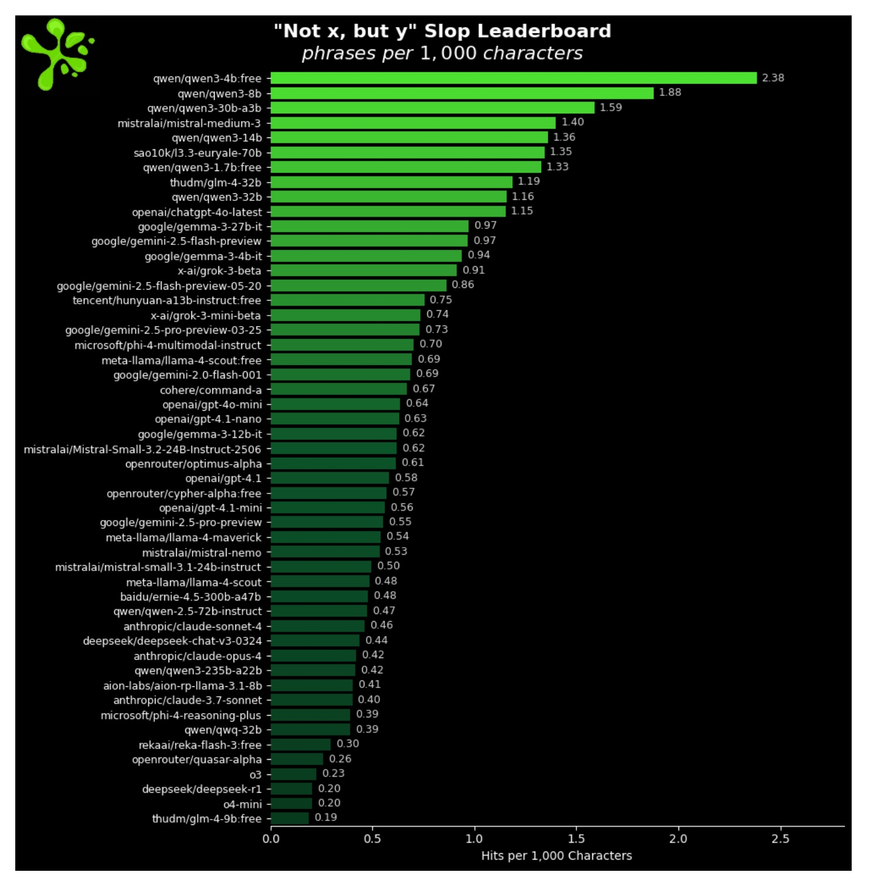

# La "passione" dell'AI che la fa scoprire: l'epanortosi enfatica

*"Si può riconoscere un testo fatto con l'AI?". È la domanda che mi sento rivolgere più spesso durante i miei corsi sull'intelligenza artificiale generativa, sussurrata con l'aria complice di chi cerca il Santo Graal dei nostri tempi digitali. La mia risposta, ormai automatica come un riflesso condizionato, punta sempre verso una direzione: "Guardate se abbonda di elenchi puntati", dico, "se trasforma ogni concetto in una lista ordinata". Ma quello che ho sempre considerato il dettaglio più evidente dell'AI potrebbe essere solo la punta dell'iceberg stilistico.*

Un [nuovo studio](https://zenodo.org/records/16947334) di Filippo Lubrano dell'H-Farm ha infatti identificato un pattern molto più sottile e pervasivo: l'epanortosi enfatica, una figura retorica antica che i modelli di linguaggio hanno trasformato nella loro firma stilistica inconsapevole. Come se Data di Star Trek avesse improvvisamente sviluppato un tic linguistico che lo tradisce ogni volta che cerca di fingersi umano.

Il paper, pubblicato ad agosto 2025, rivela dati che farebbero rabbrividire qualsiasi copywriter: i Large Language Model producono questa specifica costruzione retorica a una frequenza 27 volte superiore rispetto agli umani. Non stiamo parlando di un errore occasionale, ma di una vera e propria epidemia stilistica che attraversa tutti i principali modelli, da ChatGPT a Claude, passando per i sistemi open-source.

## Cos'è l'epanortosi enfatica

Prima di addentrarci nei numeri, dobbiamo capire cos'è esattamente questa figura retorica dai contorni apparentemente esotici. L'epanortosi è una figura del discorso che indica una sostituzione di parole enfatica, dove "Migliaia, no, milioni!" rappresenta un esempio classico. Ma la variante che ossessiona le AI moderne è più specifica: segue lo schema "Non X, ma Y", dove una prima affermazione viene immediatamente corretta con una formulazione più intensa o rivelatrice.

Per comprendere la potenza di questo meccanismo, pensiamo agli esempi letterari che hanno reso celebre questa tecnica. In "Giulio Cesare" di Shakespeare, Marco Antonio utilizza l'epanortosi quando dice "Bruto è un uomo d'onore. Lo sono tutti, tutti uomini d'onore", creando un effetto ironico devastante attraverso la ripetizione correttiva. Nei titoli di giornale la tecnica abbonda: "Non è solo maltempo, ma il cambiamento climatico che bussa alla porta". I telecronisti sportivi ne abusano costantemente: "Non è solo un gol, ma la rete che cambia il destino del campionato". 

Nella versione AI, però, questa elegante figura retorica si trasforma in qualcosa di meccanico e ossessivo. Dove un autore umano scriverebbe "La tecnologia è avanzata", un LLM produrrà automaticamente: "Non si tratta solo di tecnologia avanzata, ma di una rivoluzione che sta trasformando il nostro modo di vivere". Dove un giornalista direbbe "Il mercato è in crescita", l'AI elaborerà: "Non è semplicemente crescita, ma un'espansione senza precedenti che ridefinisce gli equilibri economici globali".

Gli esempi quotidiani abbondano. Immaginate di chiedere a ChatGPT una ricetta per la pasta al pomodoro. Invece di dirvi "Scaldate l'olio in padella", otterrete: "Non si tratta solo di scaldare l'olio, ma di creare la base aromatica che eleverà il vostro sugo da semplice condimento a esperienza culinaria". È come avere un cuoco che non riesce mai a dare un'istruzione senza trasformarla in una rivelazione epifanica.

## I numeri parlano chiaro
La ricerca di Lubrano ha analizzato tre corpus distinti per quantificare il fenomeno. Il primo consisteva in 400.000 frasi campionate casualmente dal Common Crawl utilizzato per addestrare una importante famiglia di modelli nel 2024. Il secondo conteneva 50.000 risposte di ChatGPT e Claude raccolte tra gennaio e maggio 2025. Il terzo era un corpus di controllo di 100.000 frasi tratte da riviste accademiche umanistiche (2015-2020) e articoli giornalistici mainstream (2023-2024).

I risultati sono eclatanti: i modelli AI producono 27 epanortosi enfatiche ogni 1000 frasi, contro le 9 del corpus di addestramento e le appena 5 del benchmark umano. Ma c'è di più: l'analisi ha rivelato anche un fenomeno di 'burstiness', ovvero che queste costruzioni si ammassano in certi punti del testo, proprio come quando qualcuno scopre le emoji e inizia a infilarne tre o quattro di fila nello stesso messaggio. Le risposte superiori ai 300 token mostravano almeno una coppia epanortotica per ogni cambio di argomento, suggerendo che il dispositivo funziona come segnaletica interna nella pianificazione generativa.

Per contestualizzare questi dati, lo studio ha confrontato i risultati con corpus umani più ampi: articoli Wikipedia, libri digitalizzati e giornalismo mainstream mostravano tutti tassi significativamente più bassi, tipicamente tra 4-6 istanze per 1000 frasi. Il gap stilistico tra testo generato dalla macchina e prosa umana convenzionale risulta così evidente da essere quasi imbarazzante.

Una regressione logistica che controllava lunghezza delle frasi, presenza di pronomi in prima persona e interrogative ha mantenuto l'epanortosi come predittore significativo dell'origine del modello. In valutazioni cieche con studenti laureati in linguistica, i testi ricchi di epanortosi venivano giudicati probabilmente generati dalla macchina, sottolineando la rilevanza del segnale stilistico.

L'aspetto più inquietante è che il fenomeno non si limita all'inglese. Campionamenti preliminari in spagnolo, francese, mandarino e arabo mostrano amplificazioni simili, suggerendo che l'effetto attraversa le famiglie linguistiche e le architetture di modelli di varia scala e provenienza. Come un virus stilistico che si replica attraverso le lingue e le culture.

## Perché l'RLHF ha creato questo mostro

La radice del problema affonda nel Reinforcement Learning from Human Feedback (RLHF), il processo che dovrebbe rendere i modelli più utili e allineati con le preferenze umane. Ironicamente, è proprio questo tentativo di umanizzare l'AI che ha creato il mostro stilistico che stiamo analizzando.

Il meccanismo è perversamente elegante. Durante la fase di fine-tuning, i modelli vengono addestrati a massimizzare valutazioni su utilità, chiarezza e cortesia. Gli annotatori umani, inconsciamente, premiano spesso output che introducono una riformulazione chiarificatrice, interpretandola come evidenza di comprensione. Il segnale di ricompensa, mediato su milioni di token, eleva il pattern a azione ad alto valore.

Ma c'è un secondo livello di amplificazione. Il tropo correla anche con risposte ad alto punteggio nei dati di pre-training, specialmente blog di marketing e contenuti self-help noti per l'urgenza persuasiva. Una volta radicata, l'abitudine persiste attraverso i domini, anche quando diventa maladattiva. È quello che Lubrano definisce "effetto sloganoide": la chiarezza viene acquistata al costo della sfumatura.

I corpus web, specialmente quelli raccolti da marketing, self-help e commenti politici, contengono tassi superiori alla media di strutture negazione-sostituzione. Questi domini privilegiano chiarezza, memorabilità e persuasione - qualità facilmente premiate nel fine-tuning RLHF. Una volta che un modello di ricompensa assegna alto valore a una riformulazione che sembra sia chiarificatrice che enfatica, il pattern si propaga attraverso argomenti non correlati.

Il fenomeno parallela tendenze più ampie nella retorica digitale, dove media a forma breve e ottimizzati per l'attenzione riducono argomentazioni complesse a svolte binarie. L'uso ripetuto di "Non X, ma Y" fornisce una forma compressa di tensione narrativa e risoluzione, che gli algoritmi tendono a premiare per il suo potenziale di coinvolgimento.

[Frequenza relativa di "Non X, ma Y" nei modelli. Tratta dal paper di Filippo Lubrano](https://zenodo.org/records/16947334)

## Il loop culturale che si autoalimenta

Quello che rende il fenomeno ancora più preoccupante è la sua natura auto-rinforzante. I modelli assorbono pattern dal web, li amplificano, e gli utenti li re-incontrano nei testi generati, integrandoli inconsciamente nella propria scrittura. È un serpente che si morde la coda stilistico che rischia di omogeneizzare il linguaggio pubblico.

Il discorso online premia dualismi semplificati, in parte perché gli algoritmi di ranking dei social media elevano contenuti polarizzanti. Slogan aziendali e citazioni motivazionali raccolte dai motori di ricerca proliferano inversioni negativo-positive. I modelli raccolgono tale materiale, codificando il dispositivo come marchio di efficacia persuasiva.

Critiche giornalistiche su testate come The Guardian e The Atlantic, oltre a discussioni in corso su Wikipedia e Reddit, hanno popolarizzato la nozione di "AI slop" per descrivere questa tendenza. Report in AI Flash Report e commenti attraverso piattaforme incluso Twitter/X lo inquadrano ulteriormente come problema culturale, non meramente tecnico, evidenziando come scorciatoie stilistiche proliferino attraverso loop di feedback della scrittura digitale.

## Verso algoritmi detective

Questa scoperta apre scenari affascinanti per lo sviluppo di nuovi sistemi di detection dell'AI. La frequenza di epanortosi potrebbe servire come caratteristica debole ma utile per rivelatori di testo AI, particolarmente quando combinata con esplosività lessicale e marcatori del discorso a metà frase.

I [detector AI attualmente disponibili](https://gptzero.me/) come GPTZero, che ha recentemente rilasciato il Model 3.7b con miglioramenti drastici sui modelli linguistici più recenti dei principali fornitori, potrebbero integrare questa nuova metrica nei loro algoritmi di analisi. Il team di machine learning di GPTZero ha trascorso l'estate costruendo il loro miglior detector AI di sempre, con questo rilascio che arriva giusto in tempo per il nuovo anno scolastico 2025/2026.

L'approccio multi-fattore che caratterizza strumenti come [ZeroGPT](https://zerogpt.org/) potrebbe beneficiare enormemente dell'inclusione dell'analisi epanortotica. Il detector AI ZeroGPT utilizza un approccio multi-fattore per identificare l'origine del contenuto, determinando se è stato generato dall'AI o scritto da un essere umano.

Ma c'è un monito importante. La penalizzazione aggressiva della figura retorica potrebbe discriminare comunità dove il dispositivo è culturalmente incorporato. Gli strumenti di governance progettati per diversificare lo stile del modello devono essere sensibili alla variazione retorica preservando la correzione enfatica legittima.

Immaginiamo un algoritmo detective che funzioni come Sherlock Holmes nell'era digitale: non si limita a cercare impronte digitali evidenti come gli elenchi puntati, ma analizza pattern linguistici sottili, frequenze di costruzioni retoriche, distribuzione di marcatori del discorso. Un sistema che potrebbe assegnare probabilità percentuali: "Questo testo ha l'87% di probabilità di essere generato da AI, basato sulla presenza di 12 epanortosi enfatiche, pattern lessicali ripetitivi e assenza di variazione sintattica umana".

## Strategie di mitigazione

Per i curatori di modelli e gli sviluppatori, Lubrano suggerisce diverse strategie di mitigazione. I curatori possono sovra-pesare corpus che utilizzano tecniche di enfasi alternative, come giustapposizione senza negazione o spostamento metaforico. Gli ingegneri di prompt possono istruire i modelli a variare esplicitamente il tessuto connettivo, richiedendo clausole concessive o espansione descrittiva.

I modelli di ricompensa potrebbero penalizzare epanortosi ripetute all'interno di una finestra di token, incoraggiando l'esplorazione sintattica. È come addestrare un musicista a non abusare della stessa progressione di accordi: la tecnica non è sbagliata di per sé, ma la sua ripetizione ossessiva impoverisce il risultato finale.

Un'analogia cinematografica potrebbe essere quella di Quentin Tarantino: le sue tecniche narrative distintive (flashback, dialoghi lunghi, violenza stilizzata) funzionano perfettamente nei suoi film, ma se tutti i registi iniziassero a copiarle meccanicamente, il cinema diventerebbe una noia prevedibile. L'epanortosi enfatica è la jump cut dell'AI: efficace quando usata con parsimonia, devastante quando diventa l'unica freccia al proprio arco.

## Implicazioni per il futuro della scrittura

Il fenomeno dell'epanortosi enfatica solleva questioni più profonde sulla natura della creatività e dell'espressione nell'era dell'AI. Se i modelli linguistici stanno inconsciamente spingendo verso una omogeneizzazione stilistica, che cosa significa per la diversità espressiva umana?

C'è un'ironia quasi alla Jorge Luis Borges nel fatto che macchine progettate per imitare la creatività umana stiano invece creando una loro sub-cultura retorica, un dialetto artificiale che inizia a influenzare il modo in cui gli esseri umani stessi comunicano. È come se avessimo creato degli alieni linguistici che, nel tentativo di sembrare umani, hanno sviluppato le loro proprie idiosincrasie che li tradiscono.

La sfida per i prossimi anni sarà duplice: da un lato, sviluppare sistemi di detection sempre più sofisticati che possano identificare questi pattern sottili; dall'altro, lavorare sulla diversificazione stilistica dei modelli stessi, evitando che la ricerca della "chiarezza" e della "utilità" porti a una standardizzazione impoverente del linguaggio.

## Il detective del futuro

Tornando alla domanda iniziale dei miei studenti - "Si può riconoscere un testo fatto con l'AI?" - la risposta si sta evolvendo rapidamente. Non più solo elenchi puntati e strutture ripetitive evidenti, ma una costellazione di micro-segnali stilistici che includono frequenze anormali di costruzioni retoriche specifiche, pattern di enfasi, distribution di marcatori del discorso.

Il futuro probabilmente ci riserverà una sorta di CSI linguistico, dove investigatori digitali armati di algoritmi sempre più sofisticati analizzeranno testi alla ricerca di impronte stilistiche invisibili all'occhio umano. L'epanortosi enfatica potrebbe essere solo il primo di molti "DNA linguistici" che tradiscono l'origine artificiale di un testo.

Ma forse la lezione più importante di questo studio è che l'AI, nel tentativo di sembrare più umana, sta invece rivelando quanto sia profondamente non-umana nei suoi pattern di apprendimento e riproduzione. Come un attore che, nel tentativo di recitare la parte dell'umano, finisce per enfatizzare proprio quegli aspetti che lo rendono riconoscibile come attore.

La ricerca di Lubrano non è solo un contributo tecnico al campo della detection AI, ma un memento che ci ricorda di prestare attenzione non solo a quello che le macchine dicono, ma a come lo dicono.

Parafrasando McLuhan, che sosteneva: "Il media in cui comunichiamo è più importante del contenuto stesso del messaggio", nel mondo dell'intelligenza artificiale generativa, il media non è solo il messaggio: è la firma.
