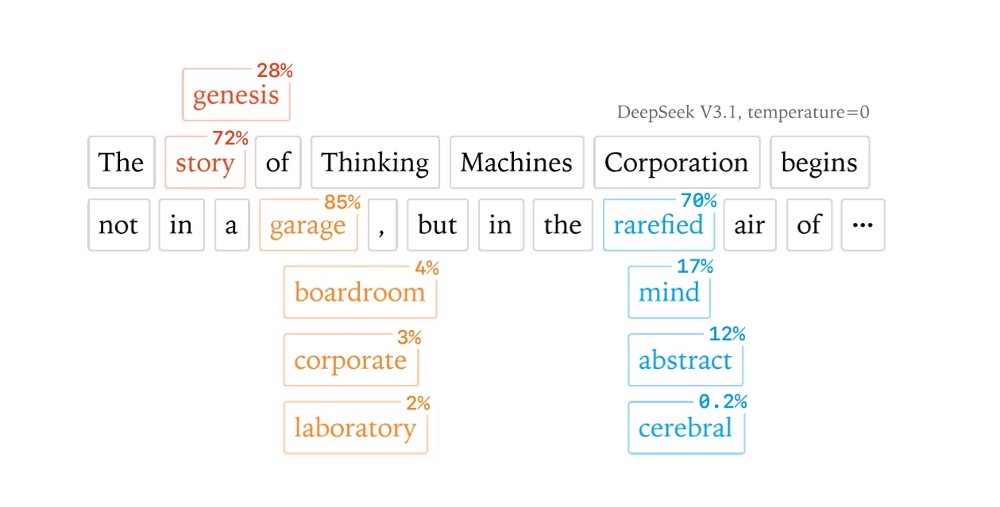
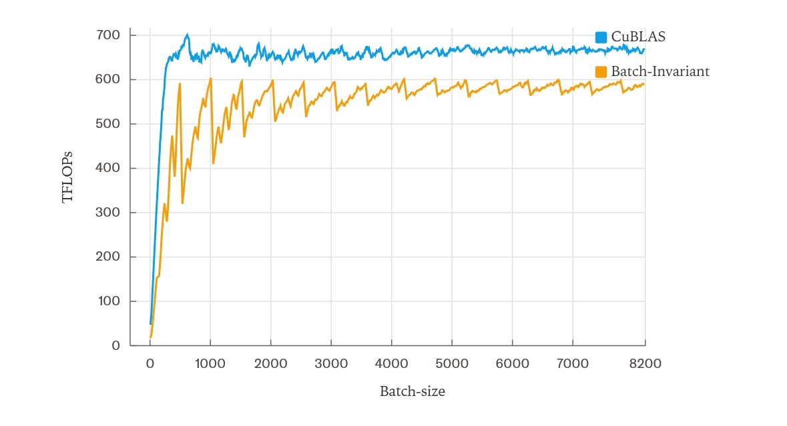

# LLM: ¿Misma pregunta, respuesta diferente? Quizás sea culpa de las GPU

*Imagina que tienes un chef con estrella Michelin que, cada vez que le pides la receta de la carbonara, te responde con matices diferentes. Hoy añade primero el guanciale, mañana los huevos, pasado mañana cambia el orden de la pasta. El resultado final es siempre carbonara, pero nunca exactamente la misma. Esto es exactamente lo que ocurre con los Grandes Modelos de Lenguaje: misma entrada, salidas diferentes. Siempre.*

Es un fenómeno que cualquiera que haya chateado con ChatGPT conoce bien, pero que hasta hoy se descartaba como una característica intrínseca de la inteligencia artificial. "Es normal", decían los expertos, "forma parte del proceso de muestreo". Como si fuera inevitable que un sistema matemático determinista produjera resultados aleatorios.

[Thinking Machines Lab](https://thinkingmachines.ai/blog/defeating-nondeterminism-in-llm-inference/), la startup liderada por veteranos de la IA que recientemente ha atraído importantes inversiones, decidió no conformarse con esta explicación. Su último artículo, publicado en septiembre de 2025, no se limita a identificar el problema: lo resuelve. Y la solución es tan elegante como inesperada.

## Cuando los números se vuelven anárquicos

Para entender el meollo del problema, tenemos que dar un salto a las matemáticas de los ordenadores. Como en "Atrapado en el tiempo", la película en la que Bill Murray revive el mismo día infinitas veces con variaciones imperceptibles, los ordenadores también parecen condenados a repetir los mismos cálculos obteniendo resultados ligeramente diferentes. Pero esta vez no hay una lección existencial detrás: está la física de los procesadores.

El principal culpable se llama "no asociatividad de los números en coma flotante". En matemáticas, (a+b)+c siempre debería ser igual a a+(b+c). En los ordenadores, sin embargo, esta regla salta alegremente por la ventana. Es como si cada vez que haces una cuenta, el orden en que sumas los números cambiara el resultado final.

Horace He, el investigador principal de Thinking Machines Lab, explica en el artículo que [este fenómeno se debe a la forma en que los procesadores manejan números muy grandes y muy pequeños juntos](https://thinkingmachines.ai/blog/defeating-nondeterminism-in-llm-inference/). Es un poco como intentar hacer una media entre el número de habitantes de Roma y el peso de un grano de arena: la precisión limitada de los ordenadores hace que algunos detalles se pierdan inevitablemente.

## La anatomía del error: Dentro de los tres pilares del indeterminismo

Para comprender plenamente el alcance de la solución de Thinking Machines Lab, es necesario adentrarse en el corazón palpitante de un transformador. Como un relojero que desmonta un Patek Philippe para entender por qué pierde unos segundos al día, los investigadores tuvieron que diseccionar cada componente crítico del modelo para identificar dónde nacía el indeterminismo.

La arquitectura de un Gran Modelo de Lenguaje moderno se apoya en tres pilares fundamentales, cada uno de los cuales contribuye al problema de forma diferente. Es como una orquesta de cámara donde cada sección tiene sus propias peculiaridades: los violines (RMSNorm) crean disonancias sutiles, los metales (multiplicaciones de matrices) amplifican los errores, y los vientos (mecanismo de atención) transforman pequeñas variaciones en cambios dramáticos en la armonía final.

El RMSNorm, acrónimo de Root Mean Square Normalization, es quizás el componente más sencillo de entender y, paradójicamente, el más fácil de corregir. [Su función es normalizar los valores de entrada para estabilizar el entrenamiento](https://thinkingmachines.ai/blog/defeating-nondeterminism-in-llm-inference/), un poco como un ecualizador que mantiene el volumen constante independientemente de la intensidad de la fuente. El problema surge cuando el "tamaño del lote" (el número de peticiones procesadas simultáneamente) es demasiado pequeño.

Imagina un director de orquesta que tiene que dirigir a veces a 100 músicos, a veces solo a 10. Con 100 músicos, puede asignar un papel específico a cada sección y mantener un control preciso. Con solo 10, tiene que pedir a algunos que doblen los instrumentos, cambiando inevitablemente la dinámica de la ejecución. El RMSNorm se comporta de la misma manera: cuando hay pocas peticiones que procesar, se ve obligado a cambiar de estrategia de paralelización, introduciendo variaciones en los cálculos.

La solución de Thinking Machines Lab es tan sencilla como radical: ignorar los casos problemáticos. Cuando el tamaño del lote es demasiado pequeño para garantizar una paralelización óptima, el sistema acepta una pérdida de rendimiento para mantener la consistencia. Es una elección filosófica profunda: es mejor ser siempre coherente que ocasionalmente rápido.

Las multiplicaciones de matrices representan un reto de mayor complejidad. Aquí no se trata solo de paralelizar un cálculo, sino de aprovechar al máximo los "núcleos tensoriales", unidades de cálculo especializadas presentes en las GPU modernas que pueden realizar miles de operaciones simultáneas. Es como pasar de usar un piano tradicional a un órgano de iglesia con cientos de registros: la potencia es inmensa, pero la complejidad del control crece exponencialmente.

El problema surge cuando las dimensiones de las matrices son demasiado pequeñas para aprovechar al máximo estas unidades especializadas. En estos casos, los controladores de la GPU recurren a estrategias alternativas llamadas "Split-K", donde la multiplicación se divide a lo largo de la dimensión de reducción en lugar de a lo largo de las dimensiones de salida. [Es una técnica brillante para optimizar el rendimiento, pero introduce variabilidad en los resultados](https://thinkingmachines.ai/blog/defeating-nondeterminism-in-llm-inference/) porque cambia el orden de las operaciones matemáticas.

La solución adoptada por Thinking Machines Lab es aparentemente contraintuitiva: utilizar siempre la misma configuración de kernel, independientemente del tamaño de las matrices. Es como decidir tocar siempre con la misma formación orquestal, aunque la pieza musical no lo requiera. Se pierde algo de eficiencia, pero se gana en previsibilidad.

El tercer pilar, el mecanismo de atención, es el que presenta los mayores desafíos. No es casualidad que la atención sea el corazón de la arquitectura del transformador, el componente que permite al modelo "prestar atención" a diferentes partes de la entrada para generar cada palabra. Es como un director que tiene que decidir sobre qué actores enfocar la cámara en cada momento de la escena, basándose en todo lo que ha sucedido antes.

El mecanismo de atención introduce dos niveles adicionales de complejidad. En primer lugar, debe gestionar reducciones tanto a lo largo de la dimensión de las características como a lo largo de la dimensión de la secuencia, creando un entrelazamiento de dependencias que hace casi imposible mantener un orden de cálculo fijo. En segundo lugar, debe interactuar con todas las optimizaciones modernas de la inferencia: prellenado por trozos (donde las secuencias largas se procesan por partes), almacenamiento en caché de prefijos (donde se reutilizan partes comunes de las conversaciones) y decodificación en paralelo.

[El problema más insidioso surge en la llamada "etapa de decodificación"](https://thinkingmachines.ai/blog/defeating-nondeterminism-in-llm-inference/), cuando el modelo genera una palabra a la vez. En esta fase, la longitud de la consulta suele ser muy pequeña (a menudo solo un token), pero la caché de claves y valores puede ser enorme (miles de tokens de contexto anterior). Es como pedirle a un cantante solista que actúe acompañado de una orquesta sinfónica: la relación de fuerzas está completamente desequilibrada.

Para mantener un rendimiento aceptable, los sistemas recurren a técnicas llamadas "Split-KV" o "FlashDecoding", que paralelizan el procesamiento a lo largo de la dimensión de la caché. Pero una vez más, esta paralelización introduce variabilidad en el orden de los cálculos. La solución de Thinking Machines Lab requiere una modificación profunda de estos algoritmos, adoptando una estrategia de "tamaño de división fijo" en lugar de una estrategia de "número de divisiones fijo".

Es una distinción sutil pero fundamental. En lugar de decir "divide siempre en 8 partes", el sistema dice "cada parte debe tener siempre 256 elementos". De esta manera, el orden de las operaciones permanece idéntico independientemente de la longitud total de la secuencia. Es como decidir que cada músico debe tocar siempre exactamente 4 compases, independientemente de la longitud de la pieza.

La elegancia de esta solución reside en su universalidad: una vez que los tres pilares se han hecho "invariantes al lote", todo el sistema se vuelve determinista. No es necesario rediseñar la arquitectura de los transformadores ni inventar nuevos algoritmos. Basta con garantizar que cada componente se comporte siempre de la misma manera, independientemente del contexto en el que se ejecute.

[De thinkingmachines.ai](https://thinkingmachines.ai/blog/defeating-nondeterminism-in-llm-inference/)

## La invarianza de los lotes: la clave secreta

Pero aquí está el giro de guion digno de un thriller tecnológico: el verdadero problema no reside en la competencia entre los procesadores de las GPU, como sostenían las teorías anteriores. Es algo mucho más sutil y, paradójicamente, más fácil de resolver.

El descubrimiento de Thinking Machines Lab es que el comportamiento de los LLM cambia según la cantidad de peticiones que se procesan juntas. Es como si nuestro chef con estrella Michelin cambiara la receta según el número de comensales que tuviera que preparar al mismo tiempo. Mismo plato, mismos ingredientes, pero el resultado final depende de la carga de trabajo del momento.

Este fenómeno tiene un nombre técnico: falta de "invarianza de lote". En pocas palabras, significa que procesar una petición sola o junto con otras 100 puede producir respuestas diferentes para la misma pregunta. [Los investigadores demostraron este efecto con experimentos sorprendentes](https://thinkingmachines.ai/blog/defeating-nondeterminism-in-llm-inference/): al hacer la misma pregunta sobre Richard Feynman 1000 veces a un modelo Qwen, obtuvieron 80 respuestas diferentes, y la primera divergencia se manifestó exactamente en el token 103.

La solución propuesta por Thinking Machines Lab es elegante en su simplicidad: modificar los "kernels" (los bloques de cálculo fundamentales) para que produzcan siempre los mismos resultados, independientemente de cuántas otras operaciones se realicen en paralelo. Es como enseñarle a nuestro chef a seguir siempre la misma secuencia de pasos, ya sea que esté cocinando para uno o para cien.

[De thinkingmachines.ai](https://thinkingmachines.ai/blog/defeating-nondeterminism-in-llm-inference/)

## El precio de la coherencia

Como en toda historia de innovación tecnológica, la solución implica compromisos. Los kernels "invariantes al lote" desarrollados por el equipo son más lentos que los estándar. No por mucho, afortunadamente: en las pruebas realizadas en un servidor con una sola GPU utilizando el modelo Qwen-3-8B, la ralentización fue de alrededor del 60% en comparación con la versión optimizada, y se redujo al 30% con algunas mejoras en la implementación de la atención.

Podría parecer un precio alto a pagar, pero consideremos las implicaciones. [El indeterminismo de los LLM no es solo una molestia estética](https://dataconomy.com/2025/09/11/tml-defeating-nondeterminism-in-llm-inference/): compromete la reproducibilidad científica, hace imposible la depuración precisa y, sobre todo, transforma lo que debería ser un aprendizaje por refuerzo "on-policy" en algo completamente diferente.

Es un poco como intentar entrenar a un piloto de Fórmula 1 en un simulador que cambia las leyes de la física cada vez que se enciende. El piloto aprende a adaptarse a las variaciones, pero no aprende realmente a conducir ese coche específico.

## La revolución silenciosa del RL

Aquí entra en juego uno de los aspectos más interesantes de la investigación de Thinking Machines Lab. El aprendizaje por refuerzo, la técnica que está detrás de los modelos más avanzados como ChatGPT, se basa en la idea de que la IA aprende de sus propias experiencias. Pero si cada vez que la IA "prueba" la misma acción obtiene un resultado ligeramente diferente, ¿está realmente aprendiendo de la misma experiencia?

Los investigadores han demostrado que [el indeterminismo transforma sutilmente el aprendizaje "on-policy" en "off-policy"](https://thinkingmachines.ai/blog/defeating-nondeterminism-in-llm-inference/), creando una discrepancia entre lo que el modelo hace durante el entrenamiento y lo que hace cuando se utiliza. Es como si un músico practicara en un piano desafinado para luego tocar en uno afinado: la diferencia es sutil pero fundamental.

Con los kernels deterministas de Thinking Machines Lab, este problema desaparece. En sus experimentos con una configuración de RL aplicada al conjunto de datos Bigmath, el equipo obtuvo una divergencia KL perfectamente plana en cero, lo que indica una correspondencia perfecta entre el entrenamiento y la inferencia. Es el Santo Grial del aprendizaje automático: un sistema que se comporta exactamente como fue entrenado para hacerlo.

## El panorama industrial: ¿Quién ganará la guerra de la reproducibilidad?

En el mundo de la inteligencia artificial, donde los gigantes tecnológicos se enfrentan con modelos cada vez más grandes y potentes, Thinking Machines Lab ha decidido librar una batalla diferente. Mientras que OpenAI, Google y Anthropic se centran en la potencia bruta de sus sistemas, este equipo relativamente pequeño ha decidido apostar por la precisión. Es la clásica historia de David contra Goliat, pero esta vez la honda de David es la matemática pura.

La startup, fundada por ex-investigadores de algunas de las empresas más prestigiosas del sector, representa un enfoque completamente diferente de la investigación en IA. [No se trata de crear el modelo más grande o más rápido, sino de comprender a fondo cómo funcionan realmente estos sistemas](https://americanbazaaronline.com/2025/09/11/inside-thinking-machines-lab-muratis-12-billion-ai-startup-tackles-reproducibility-467536/). Es un poco como la diferencia entre construir un coche de carreras cada vez más potente y entender por qué el coche a veces se va a la izquierda cuando debería ir recto.

El momento de esta investigación no es casual. La industria de la IA se encuentra en un punto de inflexión crucial, donde la carrera por el rendimiento puro está dando paso a consideraciones más maduras sobre fiabilidad, seguridad y previsibilidad. Es el momento en que un sector adolescente empieza a comportarse como un adulto, y la reproducibilidad es una de las primeras señales de esta maduración.

Los sectores más críticos ya están alzando la voz. En el mundo de la sanidad, donde los algoritmos de IA se utilizan cada vez más para diagnósticos y planes de tratamiento, la idea de que el mismo síntoma pueda producir valoraciones diferentes es simplemente inaceptable. Es como tener un termómetro que da temperaturas diferentes cada vez que lo usas: puede que la fiebre siempre esté ahí, pero no saber si es 38 o 39 grados marca la diferencia entre un paracetamol y una carrera al hospital.

El sector financiero no se queda atrás. Los algoritmos de trading automático y los sistemas de evaluación de riesgos deben operar en un mundo donde la reproducibilidad no es una preferencia, sino un requisito normativo. [Las autoridades de supervisión están empezando a exigir que los modelos de IA utilizados para decisiones de crédito o inversión produzcan resultados rastreables y verificables](https://dataconomy.com/2025/09/11/tml-defeating-nondeterminism-in-llm-inference/). Es imposible explicarle a un juez por qué el mismo algoritmo dio opiniones diferentes sobre dos solicitudes de hipoteca idénticas.

El mundo de la investigación científica también está tomando conciencia del problema. Cuando un artículo científico afirma haber obtenido ciertos resultados utilizando un modelo de IA, otros investigadores deben poder replicar exactamente esos experimentos. Es el fundamento mismo del método científico, puesto en entredicho por el indeterminismo de los LLM. Como si cada vez que replicas un experimento de física, la gravedad fuera ligeramente diferente.

Pero las implicaciones van mucho más allá de estos sectores obviamente críticos. Pensemos en el impacto en la depuración y el desarrollo de software. Actualmente, cuando una aplicación basada en IA se comporta de forma inesperada, los desarrolladores se encuentran en una situación kafkiana: el error podría estar en su código, o podría ser simplemente otra manifestación del indeterminismo del modelo. Es como intentar arreglar un reloj que a veces decide por sí solo ir más rápido o más lento.

La solución de Thinking Machines Lab promete transformar esta caza de fantasmas en un proceso de depuración normal. Si el modelo produce siempre las mismas salidas para las mismas entradas, cualquier comportamiento anómalo se debe necesariamente a un error real, no a una fluctuación aleatoria. Es la diferencia entre ser un detective en un mundo donde las pruebas cambian espontáneamente y ser un detective en un mundo donde las pruebas permanecen coherentes.

El aspecto más interesante de esta dinámica es que ninguno de los grandes actores del sector parece haber dado prioridad a este problema. OpenAI, Google, Meta y los demás gigantes están obsesionados con la carrera por el rendimiento, mientras que la cuestión de la reproducibilidad ha quedado en un segundo plano. Es una de esas raras situaciones en el mundo de la tecnología en las que una startup puede adelantarse a empresas con cien veces más recursos, simplemente porque ha identificado el problema adecuado en el momento adecuado.

Por supuesto, convencer a la industria de que adopte una solución que implica una ralentización del 30-60% no será fácil. En el mundo de la IA, donde los milisegundos de latencia pueden marcar la diferencia entre el éxito y el fracaso de un producto, cualquier compromiso con el rendimiento se ve con recelo. Pero las señales de cambio ya están ahí.

Algunas empresas pioneras están empezando a experimentar con versiones "deterministas" de sus sistemas para aplicaciones específicas. No es de extrañar que los primeros en adoptarlas sean precisamente los que operan en sectores altamente regulados, donde el coste del indeterminismo supera con creces el beneficio de unos pocos milisegundos menos de latencia.

## Hacia un futuro determinista

La verdadera partida se jugará cuando los kernels invariantes al lote de Thinking Machines Lab se optimicen hasta el punto de reducir significativamente la brecha de rendimiento. En ese momento, la pregunta ya no será "¿podemos permitirnos ser deterministas?" sino "¿podemos permitirnos no serlo?".

La solución propuesta por Thinking Machines Lab aún no está lista para la producción a gran escala. El código está disponible en GitHub como una prueba de concepto, pero requiere modificaciones significativas en los pipelines de inferencia existentes. Sin embargo, las implicaciones son enormes.

Pensemos en un mundo en el que los LLM produzcan siempre la misma respuesta a la misma pregunta. No estamos hablando de IA menos creativas o más rígidas, sino de sistemas más fiables y predecibles. Un asistente virtual que siempre te da el mismo consejo médico para el mismo síntoma. Un sistema de traducción que no cambia la versión del texto cada vez que lo reinicias. Un modelo de análisis financiero que siempre produce la misma valoración para los mismos datos.

Es interesante observar cómo esta investigación se inscribe en una tendencia más amplia hacia lo que podríamos llamar "IA responsable". Después de años de una carrera desenfrenada hacia modelos cada vez más grandes y potentes, la industria está empezando a plantearse preguntas más maduras: no solo "¿qué podemos hacer?" sino también "¿qué deberíamos hacer?" y "¿cómo podemos hacerlo mejor?".

En este contexto, Thinking Machines Lab podría encontrarse en la envidiable posición de haberse adelantado a los demás en una toma de conciencia que se volverá inevitable. Como suele ocurrir en la tecnología, lo que hoy parece un requisito de nicho mañana podría convertirse en el estándar de la industria. Y quien haya invertido primero en esta dirección se encontrará con una ventaja competitiva significativa.

El aspecto más fascinante de esta historia es que la solución no requiere revoluciones tecnológicas ni avances científicos. Es un problema de pura ingeniería, resuelto con rigor matemático y atención al detalle. En una era en la que la IA parece cada vez más mágica e incomprensible, Thinking Machines Lab nos recuerda que detrás de cada algoritmo inteligente siempre hay matemáticas sólidas e implementaciones precisas.

Quizás la verdadera lección de esta investigación no se refiera tanto a los LLM como a la madurez de todo un sector. Hemos llegado al punto en que ya no basta con que la inteligencia artificial funcione: debe funcionar de forma predecible, rastreable y reproducible. Es el paso del arte a la ciencia, de la alquimia a la química.

Al fin y al cabo, ¿quién habría pensado que el verdadero salto evolutivo de la IA no vendría de modelos más grandes o algoritmos más sofisticados, sino de la simple capacidad de hacer siempre lo mismo de la misma manera? Como en los mejores giros de guion cinematográficos, la respuesta estaba oculta a la vista de todos. Solo había que tener el valor de buscarla.
