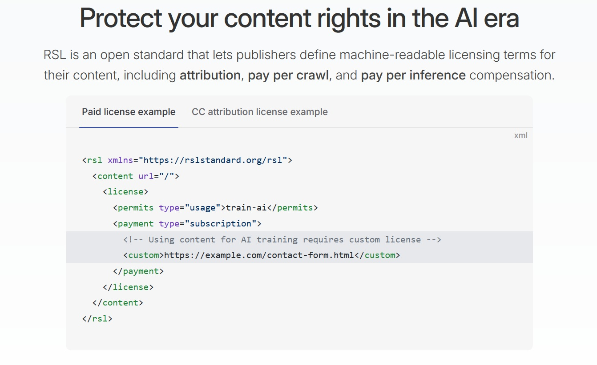
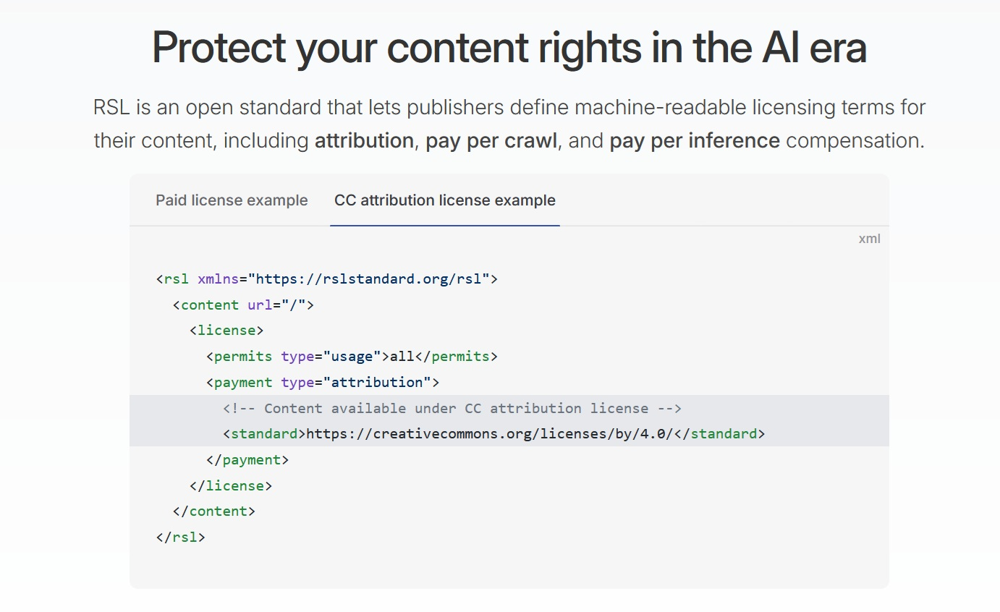

# RSL, el nuevo protocolo que quiere hacer que la IA pague por el contenido web

*Si la inteligencia artificial fuera el Pac-Man de la era digital, internet sería su laberinto infinito lleno de puntos que devorar. Solo que esta vez los puntos son nuestros artículos, nuestras fotos, nuestros vídeos, y Pac-Man nunca ha metido la mano en el bolsillo. Es en este escenario de salvaje oeste digital donde nace [Really Simple Licensing (RSL)](https://rslstandard.org/), un nuevo estándar que promete poner un poco de orden en el caos del scraping salvaje de datos para el entrenamiento de la IA.*

## El regreso del padre de RSS

Como en toda buena historia de revancha tecnológica que se precie, esta también tiene sus orígenes en una leyenda de la web. [Dave Winer](https://techcrunch.com/2025/09/10/rss-co-creator-launches-new-protocol-for-ai-data-licensing/), cocreador de RSS en los años 90, vuelve a escena no por nostalgia, sino con una misión precisa: dar a los creadores de contenido las herramientas para decidir cómo se utiliza su propiedad intelectual en la era de la inteligencia artificial.

Junto a Winer, el proyecto RSL cuenta con [Eckart Walther](https://www.theregister.com/2025/09/11/rsl_content_grabbing_ai_digital_licensing/) - cofundador y CEO de la startup que desarrolla el estándar - y [Doug Leeds](https://searchengineland.com/really-simple-licensing-461834), ex directivo de Yahoo y IAB Tech Lab. Un triunvirato que une experiencia técnica, visión empresarial y un profundo conocimiento del mercado digital.

La génesis del proyecto se hunde en una frustración compartida por muchos editores: ver cómo sus contenidos se utilizan para entrenar modelos de IA sin ningún consentimiento explícito ni compensación. "RSL es un estándar abierto que permite a los editores definir términos de licencia legibles por máquina para sus contenidos, incluyendo atribución, pago por rastreo y pago por compensación de inferencia", explica el sitio web oficial del proyecto.

## Una SGAE para la era digital

Si tuviéramos que encontrar una analogía en el mundo real, RSL funciona como una versión de alta tecnología de la SGAE para los derechos musicales, pero aplicada al mundo de los contenidos web. El protocolo permite a los editores definir de forma estandarizada y legible por máquina las condiciones de uso de sus contenidos para fines de entrenamiento de IA.

Técnicamente, RSL se basa en un formato XML que puede integrarse directamente en las páginas web o proporcionarse como un feed separado. El sistema prevé diferentes tipos de licencia: desde la simple atribución hasta los modelos "pay per crawl" o "pay per inference", donde la compensación se calcula en función del uso real del contenido en los modelos de IA.

La implementación es sorprendentemente elegante en su simplicidad. Un editor puede especificar que sus contenidos requieren una licencia personalizada para el entrenamiento de IA, o ponerlos a disposición bajo Creative Commons con simple atribución. Es como tener un cartel digital que dice "para pasar, pague el peaje", pero escrito en un lenguaje que incluso los bots más sofisticados pueden entender.

## Los colosos de la web se movilizan

El lanzamiento de RSL no se ha producido en el vacío. [Algunos de los nombres más importantes de la web](https://www.theverge.com/news/775072/rsl-standard-licensing-ai-publishing-reddit-yahoo-medium) han decidido apoyar la iniciativa desde el principio: Reddit, Yahoo, Automattic (la empresa detrás de WordPress.com), Quora y Medium se han unido como primeros adoptantes.

La decisión de estos colosos no es casual. Reddit, en particular, ya ha experimentado con la monetización de sus datos para la IA a través de acuerdos directos con Google y OpenAI. [La adopción de RSL representa una evolución natural](https://indianexpress.com/article/artificial-intelligence/reddit-quora-yahoo-rsl-really-simple-licensing-ai-data-scraping-10243214/) de esta estrategia, permitiendo automatizar y estandarizar el proceso de licencia.

Yahoo, por su parte, aporta una riqueza de contenidos acumulados durante décadas de actividad, mientras que Medium y Quora representan dos de las principales plataformas de contenidos generados por los usuarios. Su participación indica que RSL no es solo una cuestión de grandes empresas de medios, sino que afecta a todo el ecosistema de la creación de contenidos digitales.

## La tecnología bajo el capó

Desde el punto de vista técnico, RSL se presenta como una evolución natural de los mecanismos de protección ya existentes. Si robots.txt era el equivalente digital de un cartel de "prohibido el paso", RSL es más parecido a un sofisticado sistema de venta de entradas automático.

El protocolo admite diferentes modalidades de pago y licencia. Un editor puede optar por exigir una suscripción para acceder a sus contenidos con fines de entrenamiento de IA, o bien optar por un modelo de pago por uso. La flexibilidad del sistema también permite definir diferentes licencias para diferentes tipos de contenido en la misma plataforma.

La integración con los sistemas existentes se ha diseñado para que sea lo menos invasiva posible. RSL puede coexistir con robots.txt y otros estándares, añadiendo una capa de granularidad en la gestión de los derechos que antes simplemente no existía. Es como pasar de un interruptor de encendido/apagado a un regulador de intensidad con infinitas gradaciones.

[Ejemplos de rslstandard.org](https://rslstandard.org/)

## Los desafíos de la aplicación

Por supuesto, no todo es de color de rosa en el jardín de RSL. El principal desafío sigue siendo el de la aplicación: ¿cómo asegurarse de que los rastreadores de IA respeten realmente las licencias especificadas? Es aquí donde el proyecto revela su naturaleza todavía experimental y sus posibles debilidades.

A diferencia de robots.txt, que ha gozado de un respeto casi universal por parte de los rastreadores "civiles", RSL entra en un territorio mucho más complejo desde el punto de vista legal y económico. Si un modelo de IA ignora las licencias RSL y aun así utiliza los contenidos, ¿cuáles son las consecuencias prácticas? Y, sobre todo, ¿cómo puede un pequeño editor hacer valer sus derechos frente a gigantes tecnológicos con legiones de abogados?

La respuesta, por el momento, todavía está en fase de desarrollo. El proyecto cuenta con que las principales empresas de IA tengan interés en mantener relaciones transparentes y legales con los proveedores de contenidos, especialmente en un momento en que la regulación del sector se está volviendo cada vez más estricta.

## El mercado de los datos evoluciona

RSL llega en un momento especialmente interesante para la economía de los datos. El acuerdo de 60 millones de dólares entre Reddit y Google para el uso de los contenidos de la plataforma en el entrenamiento de la IA ha sentado un precedente, demostrando que existe un mercado real y sustancial para este tipo de contenidos.

El nuevo estándar podría democratizar este mercado, permitiendo que incluso los editores más pequeños moneticen sus contenidos en lugar de verlos simplemente "requisitados" por los rastreadores de IA. Es un poco como si, después de años en los que cualquiera podía entrar en tu tienda y llevarse la mercancía gratis, por fin llegara un sistema para hacerles pagar la cuenta.

El reto será crear un ecosistema en el que se reconozca el valor de los contenidos sin crear barreras excesivas a la innovación en la IA. Es un equilibrio delicado, similar al que la industria musical tuvo que encontrar con la llegada del streaming.

## Cuando los independientes se encuentran con las grandes discográficas: el nuevo ecosistema de contenidos

Si los grandes actores como Reddit y Yahoo representan las "grandes discográficas" del contenido digital, RSL podría finalmente dar voz también a los "artistas independientes" de la web: blogueros independientes, creadores en plataformas de nicho, pequeñas publicaciones periodísticas. Es aquí donde el nuevo estándar muestra su potencial más revolucionario.

Un bloguero que escribe sobre cocina vegana desde la cocina de su casa podría encontrarse con que sus contenidos se utilizan para entrenar chatbots culinarios sin ver nunca un céntimo. Con RSL, ese mismo bloguero podría especificar que sus contenidos requieren una licencia comercial para su uso en IA, convirtiendo su pasión en una fuente de ingresos pasivos.

La situación recuerda a la de los músicos antes de la llegada de Spotify y las plataformas de streaming: solo las grandes discográficas tenían el poder de negociación para conseguir acuerdos ventajosos, mientras que los artistas independientes se quedaban al margen. RSL promete cambiar esta dinámica en el mundo de los contenidos digitales.

Las plataformas intermedias desempeñan un papel crucial en esta transformación. WordPress.com, que aloja millones de blogs, podría implementar RSL como una función nativa, permitiendo a sus usuarios monetizar automáticamente sus contenidos para su uso en IA. Substack podría hacer lo mismo con sus escritores de boletines, creando una nueva fuente de ingresos para los creadores independientes.

Pero no todo es oro lo que reluce en el país de los píxeles. La adopción de RSL por parte de los pequeños creadores presenta desafíos únicos. La complejidad técnica de la implementación, la necesidad de comprender los diferentes modelos de licencia y, sobre todo, la capacidad de hacer valer los propios derechos son todos obstáculos significativos para quienes no tienen un equipo legal detrás.

Aquí es donde entra en juego la importancia de los intermediarios tecnológicos. Plataformas como Medium, que se ha unido al proyecto RSL, podrían actuar como "agregadores de derechos", negociando acuerdos colectivos para sus creadores y distribuyendo los ingresos. Es un modelo que recuerda al de las sociedades de gestión colectiva de música, pero aplicado al mundo digital.

La verdadera prueba de fuego para RSL será demostrar que puede crear valor también para los creadores más pequeños, no solo para los gigantes de la web. Si un bloguero de comida puede ganar lo suficiente con RSL para comprar ingredientes más valiosos para sus recetas, entonces el sistema habrá democratizado realmente la economía de los contenidos digitales.

## La IA que se porta bien: cumplimiento, legislación y el futuro de los derechos digitales

Si RSL fuera un personaje de Star Wars, sería C-3PO: obsesionado con el protocolo, las reglas y la correcta interpretación de las leyes intergalácticas. Y como el droide dorado, RSL podría resultar más valioso de lo que parece inicialmente, especialmente en un universo normativo que se vuelve cada vez más complejo.

El momento del lanzamiento de RSL no es casual. Europa ya ha aprobado la Ley de IA, la legislación más completa sobre inteligencia artificial del mundo, que entrará en pleno vigor en 2025. Estados Unidos está trabajando en marcos normativos similares, mientras que China ya ha implementado varias regulaciones específicas para la IA. En este contexto, tener un estándar que facilite el cumplimiento se vuelve no solo útil, sino esencial.

La Ley de IA europea, en particular, introduce el concepto de "transparencia" en el uso de datos para el entrenamiento de modelos de IA. Las empresas tendrán que documentar el origen de los datos utilizados y demostrar que tienen los derechos necesarios para su uso. RSL encaja perfectamente en este marco, proporcionando un mecanismo estandarizado para documentar y gestionar estos derechos.

El paralelismo con el RGPD es esclarecedor. Cuando la normativa europea de privacidad entró en vigor en 2018, muchos gritaron catástrofe, prediciendo el fin de la web libre. En cambio, el RGPD creó un nuevo estándar global, empujando incluso a las empresas no europeas a adoptar prácticas más respetuosas con la privacidad. RSL podría seguir una trayectoria similar: empezar como respuesta a necesidades normativas específicas y convertirse en un estándar de facto global.

Las sanciones por la violación de los derechos de los contenidos son cada vez más severas. En 2023, varios editores iniciaron acciones legales contra empresas de IA por el uso no autorizado de sus contenidos. El New York Times demandó a OpenAI y Microsoft, mientras que otros editores están considerando acciones similares. En este escenario, RSL podría actuar como un "puerto seguro": quienes lo respetan tienen una mayor protección legal que quienes ignoran por completo las licencias de los contenidos.

Los reguladores prestan cada vez más atención a estos desarrollos. La Comisión Federal de Comercio de EE. UU. ya ha abierto varias investigaciones sobre las prácticas de recopilación de datos de las empresas de IA, mientras que la Autoridad Garante de la Competencia y el Mercado italiana ha iniciado procedimientos similares. Tener un estándar reconocido como RSL podría facilitar el diálogo entre empresas y reguladores, creando un marco compartido para la discusión.

La perspectiva global es particularmente interesante. Mientras que Europa tiende a una regulación estricta y Estados Unidos prefiere un enfoque más impulsado por el mercado, Asia presenta un panorama variado. Países como Singapur y Corea del Sur están experimentando con "cajas de arena regulatorias" para la IA, donde estándares como RSL podrían probarse en entornos controlados antes de una adopción más amplia.

Pero quizás el aspecto más intrigante es cómo podría evolucionar RSL más allá de sus propósitos iniciales. Si el sistema demuestra su eficacia en la gestión de los derechos de los contenidos para la IA, podría extenderse a otros ámbitos: desde la gestión de los derechos de los contenidos multimedia hasta la definición de estándares para el uso ético de los datos personales. Es un poco como si estuviéramos asistiendo al nacimiento de un nuevo "sistema operativo" para los derechos digitales.

## Perspectivas y consideraciones finales

RSL representa sin duda un paso adelante en la dirección de una web más justa desde el punto de vista de la distribución del valor creado por los contenidos digitales. Sin embargo, su éxito dependerá de la capacidad de crear un ecosistema en el que todos los actores principales -editores, empresas de IA e intermediarios tecnológicos- encuentren conveniente participar.

La historia de la tecnología está llena de estándares prometedores que no lograron alcanzar la masa crítica necesaria para volverse verdaderamente ubicuos. El propio RSS, a pesar de su utilidad, nunca llegó a ser tan popular como esperaban sus creadores. RSL tendrá que evitar este destino, y solo podrá hacerlo demostrando un valor concreto para todos los actores implicados.

En una era en la que la inteligencia artificial promete revolucionar todos los aspectos de nuestra vida digital, tener herramientas que permitan a los creadores de contenidos mantener el control sobre su propiedad intelectual no solo es deseable, es esencial. RSL podría ser la herramienta adecuada en el momento adecuado, pero como siempre en el mundo de la tecnología, solo el mercado tendrá la última palabra.

El futuro dirá si este nuevo estándar logrará transformar el salvaje oeste digital de los datos en una frontera más civilizada, donde todos puedan prosperar. Mientras tanto, los editores y las empresas de IA harían bien en seguir de cerca esta evolución: podría definir las reglas del juego para las próximas décadas.
