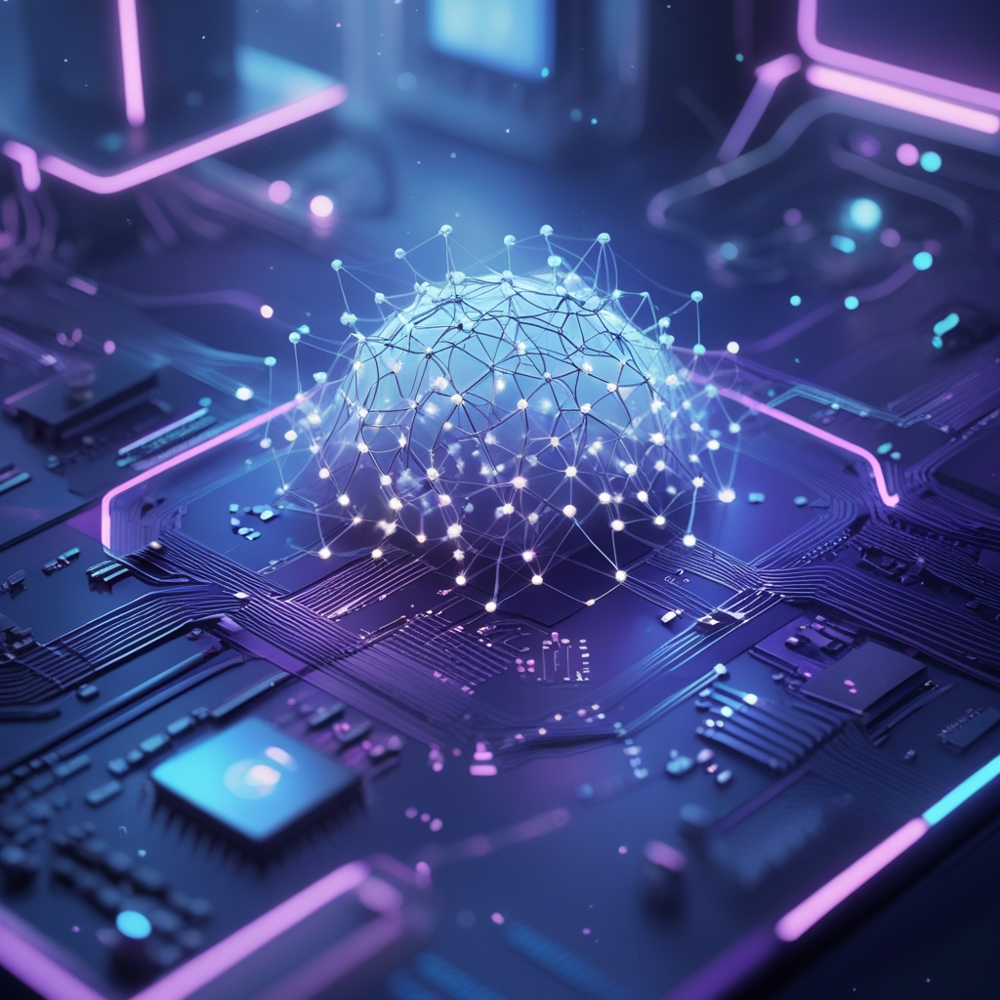
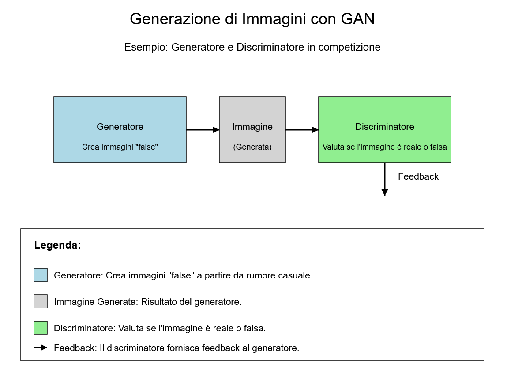

# Prefazione

Questo libro è un viaggio attraverso il vasto e dinamico mondo dell’Intelligenza Artificiale (AI), una tecnologia che sta ridefinendo il modo in cui viviamo, lavoriamo e interagiamo con il mondo. Nasce dalla necessità di fornire una guida chiara e accessibile a chiunque voglia comprendere le basi, le applicazioni e le implicazioni dell’AI, sia al professionista esperto che al curioso alle prime armi.

Dall’introduzione ai concetti fondamentali dell’AI nel **Capitolo 1**, passando per l’evoluzione storica di questa disciplina nel **Capitolo 3**, fino ad arrivare alle applicazioni pratiche e agli strumenti più avanzati nei capitoli successivi, questo libro si propone di offrire una panoramica completa e aggiornata su una delle tecnologie più rivoluzionarie del nostro tempo.

Nel **Capitolo 2**, esploriamo cos’è l’Intelligenza Artificiale, distinguendo tra AI, Machine Learning e Deep Learning, e analizzando le diverse tipologie di AI, dalle applicazioni ristrette (ANI) alle ambiziose prospettive dell’Intelligenza Artificiale Generale (AGI). Nei **Capitoli 4 e 5**, ci addentriamo nel cuore del Machine Learning e del Deep Learning, esaminando come queste tecnologie permettono alle macchine di apprendere dai dati e di risolvere problemi complessi, fino alla creazione di contenuti generativi attraverso algoritmi avanzati come le GAN (Reti Generative Avversariali).

Il **Capitolo 6** è dedicato alle applicazioni pratiche dell’AI, dalla medicina alla finanza, dai giochi alla robotica, mostrando come questa tecnologia stia trasformando settori tradizionali e creando nuove opportunità. Nel **Capitolo 7**, affrontiamo il tema cruciale della valutazione delle AI, discutendo metodi per misurare l’efficacia, l’usabilità e l’etica dei sistemi di AI, con un’attenzione particolare ai bias algoritmici e alla trasparenza.

I **Capitoli 8 e 9** offrono una panoramica sulle aziende leader nel campo dell’AI e sugli strumenti e servizi disponibili per sviluppatori e ricercatori, da TensorFlow e PyTorch alle piattaforme cloud come Google Cloud AI e Microsoft Azure. Infine, nel **Capitolo 10**, esploriamo il potenziale dell’AI nella creazione di contenuti, dalla generazione di immagini e musica alla sintesi di video, aprendo nuove frontiere per la creatività e l’innovazione.

Nel **Capitolo 11** esploriamo il complesso rapporto tra intelligenza artificiale e società umana attraverso le riflessioni di filosofi, psicologi e pensatori contemporanei. Dalle trasformazioni cognitive alle questioni etiche, il testo affronta le sfide e le opportunità che l'AI presenta per la nostra comprensione dell'essere umano. Attraverso esempi concreti, il capitolo riflette su come l'AI stia ridefinendo il nostro modo di vivere e la nostra essenza come specie, offrendo sia sfide che opportunità.

Concludiamo con il **Capitolo 12**, che riassume i punti chiave del libro e offre risorse per approfondire ulteriormente l’argomento, inclusi corsi online, libri consigliati e piattaforme di apprendimento.

Questo libro non è solo una raccolta di nozioni tecniche, ma una guida pratica per chi vuole comprendere come l’AI stia trasformando il mondo e come possiamo sfruttare al meglio questa tecnologia per affrontare le sfide del futuro. Che tu sia un programmatore esperto, un ricercatore o semplicemente un appassionato di tecnologia, spero che queste pagine ti ispirino a esplorare, innovare e contribuire al progresso dell’Intelligenza Artificiale.

Buona lettura e buon viaggio nel mondo dell’AI!


# Ringraziamenti

Grazie alle nostre famiglie, che con il loro amore e il loro supporto incondizionato ci hanno permesso di realizzare questo progetto. Senza la loro pazienza, comprensione e incoraggiamento, questo traguardo non sarebbe stato possibile.

Un ringraziamento speciale va anche agli amici e ai colleghi che ci hanno sostenuto lungo il percorso, offrendo consigli preziosi, critiche costruttive e momenti di condivisione che hanno arricchito il nostro lavoro.

Infine, vogliamo esprimere la nostra gratitudine a tutti coloro che, direttamente o indirettamente, hanno contribuito alla realizzazione di questo libro. Ogni parola, ogni pagina, è frutto di un lavoro collettivo e di una passione condivisa.

*"La gratitudine non è solo la memoria del cuore, ma anche la luce che illumina il cammino futuro."* – Anonimo

Grazie di cuore.


## Introduzione all'Intelligenza Artificiale


Benvenuto in un viaggio straordinario nel mondo dell’Intelligenza Artificiale (AI), una delle tecnologie più rivoluzionarie e trasformative del nostro tempo. Questo libro nasce dalla passione per l’innovazione e dalla convinzione che l’AI non sia solo uno strumento tecnico, ma una forza capace di ridefinire il modo in cui viviamo, lavoriamo e interagiamo con il mondo che ci circonda.

L’AI è ovunque: nei nostri smartphone, nelle auto a guida autonoma, nei sistemi di diagnosi medica, nelle piattaforme che ci consigliano film o musica. Eppure, dietro a queste applicazioni quotidiane si nasconde un universo complesso e affascinante, fatto di algoritmi, reti neurali, dati e sfide etiche. Questo libro è una guida per esplorare quell'universo, per comprendere come funziona l’AI, come è nata, come si è evoluta e, soprattutto, come sta plasmando il futuro.

Ma non è solo una questione di tecnologia. L’AI è anche una storia di persone: ricercatori, ingegneri, sognatori che hanno dedicato la loro vita a creare macchine in grado di imparare, ragionare e, in qualche modo, “pensare”. È una storia di successi, fallimenti e scoperte che hanno portato a risultati straordinari, ma che sollevano anche domande profonde su cosa significhi essere umani in un mondo sempre più dominato dalle macchine.

Questo libro non è solo per chi lavora nel campo della tecnologia. È per chiunque sia curioso di capire come l’AI stia cambiando il mondo, per chi vuole essere parte di questa trasformazione e per chi cerca di navigare in un panorama sempre più complesso con consapevolezza e spirito critico. Attraverso esempi pratici, riflessioni e approfondimenti, ti guideremo in un percorso che va dalle basi teoriche dell’AI alle sue applicazioni più avanzate, passando per le sfide etiche e sociali che questa tecnologia comporta.

Ma soprattutto, questo libro è un invito a guardare oltre. L’AI non è solo una questione di algoritmi e dati: è una tecnologia che può migliorare la nostra vita, risolvere problemi complessi e aprire nuove opportunità. Tuttavia, richiede anche responsabilità. Come possiamo garantire che l’AI sia utilizzata in modo etico e giusto? Come possiamo evitare che amplifichi disuguaglianze o pregiudizi? Queste sono domande a cui non esistono risposte facili, ma che dobbiamo affrontare insieme.

Preparati a un viaggio che ti porterà oltre il codice, oltre i dati, oltre le macchine. Imparerai a pensare in modo critico, a risolvere problemi complessi e a immaginare un futuro in cui l’AI non sostituisce l’umanità, ma la potenzia. Che tu sia un professionista esperto o un curioso alle prime armi, spero che queste pagine ti ispirino a esplorare, innovare e contribuire a costruire un mondo migliore.

### 1.1 Come nasce questo libro

In risposta alla rapida diffusione di prodotti basati sull'Intelligenza Artificiale, abbiamo elaborato una presentazione che ripercorre l'evoluzione di questa tecnologia e illustra i termini chiave utilizzati nel settore. Nel corso della nostra attività professionale, abbiamo sperimentato diverse soluzioni AI che ci hanno permesso di ottimizzare i processi lavorativi, aumentando sia l'efficienza che la qualità dei risultati. Abbiamo quindi arricchito la presentazione con una sezione pratica dedicata ai vari strumenti AI, specificando per ciascuno il campo di applicazione ideale.

L'obiettivo di questo lavoro è stato duplice: da un lato, far conoscere i benefici concreti che l'Intelligenza Artificiale può apportare nella vita professionale, dall'altro, fornire una guida pratica per la scelta degli strumenti AI più adatti alle diverse esigenze lavorative quotidiane.

Questa presentazione ha dato vita al libro che state leggendo, in cui abbiamo adottato un linguaggio più semplice e descrittivo, arricchendolo con nuovi contenuti e approfondimenti, per fornire una panoramica completa sull'Intelligenza Artificiale e sulle sue applicazioni pratiche.

Se siete curiosi e volete approfondire ulteriormente l'argomento, vi invitiamo a visitare il progetto GitHub associato alla presentazione che abbiamo usato come punto di partenza, dove troverete risorse aggiuntive ed approfondimenti su vari aspetti dell'Intelligenza Artificiale.

[https://github.com/matteobaccan/CorsoAI](https://github.com/matteobaccan/CorsoAI)

### 1.2 Dove trovare l'ultima versione di questo libro

La versione che state leggendo di questo libro potrebbe essere non aggiornata. Per scaricare l'ultima versione disponibile, vi invitiamo a visitare il progetto **GitHub ufficiale** di questo libro, all'indirizzo

[https://github.com/matteobaccan/CorsoAIBook](https://github.com/matteobaccan/CorsoAIBook)

### 1.3 Versioni in altre lingue

Questo libro è disponibile anche in altre lingue. Fate sempre riferimento al progetto GitHub ufficiale per scaricare la versione in altre lingue.

### 1.4 Obiettivi del progetto

- **Educare**: Fornire una comprensione solida e accessibile dell'AI, dalle basi teoriche alle applicazioni avanzate.
- **Ispirare**: Stimolare la curiosità e la creatività, mostrando come l'AI possa essere utilizzata per risolvere problemi complessi e aprire nuove opportunità.
- **Riflettere**: Promuovere una discussione critica sulle implicazioni etiche e sociali dell'AI, incoraggiando un uso responsabile di questa tecnologia.

### 1.5 Come Contribuire

Se sei interessato a contribuire al progetto, sei il benvenuto! Ecco come puoi farlo:

1. **Feedback**: Se hai suggerimenti o correzioni, apri una *issue* su GitHub o invia una pull request.
2. **Traduzioni**: Se vuoi contribuire alla traduzione del libro in altre lingue, contattaci.
3. **Contenuti**: Se hai idee per nuovi capitoli o approfondimenti, condividile con noi.

### 1.6 Licenza

Questo progetto è rilasciato sotto la licenza [Creative Commons Attribution-NonCommercial-ShareAlike 4.0 International (CC BY-NC-SA 4.0)](https://creativecommons.org/licenses/by-nc-sa/4.0/). Ciò significa che puoi condividere e adattare il materiale, purché venga dato credito agli autori, non venga utilizzato per scopi commerciali e vengano condivise eventuali modifiche sotto la stessa licenza.

### 1.7 Autori

- **Matteo Baccan**: Ingegnere del software e formatore con oltre 30 anni di esperienza nel settore IT. Autore di numerosi articoli, libri e corsi online.
- **Dario Ferrero**: Collaboratore e co-autore del progetto, con una passione per la divulgazione tecnologica e l'innovazione.

## **Cos'è l'Intelligenza Artificiale?**


### **2.1 AI - Di cosa si tratta?**

L'**Intelligenza Artificiale (AI)** è una branca dell'informatica che si occupa di creare sistemi e algoritmi in grado di svolgere compiti che tradizionalmente richiedono l'intelligenza umana. Questi compiti includono il ragionamento, l'apprendimento, la pianificazione, la percezione, il riconoscimento vocale e visivo, la comprensione del linguaggio naturale e la risoluzione di problemi complessi.

L'AI non è un concetto nuovo: le sue radici risalgono agli anni '50, quando Alan Turing propose il famoso **Test di Turing** come criterio per determinare se una macchina può essere considerata "intelligente". Tuttavia, solo negli ultimi decenni, grazie ai progressi nella potenza di calcolo, alla disponibilità di grandi quantità di dati e allo sviluppo di algoritmi avanzati, l'AI ha iniziato a raggiungere risultati significativi e a diventare parte integrante della nostra vita quotidiana.

#### **2.1.1 Definizione di Intelligenza Artificiale**

L'AI può essere definita come la capacità di una macchina di imitare le funzioni cognitive umane, come l'apprendimento e la risoluzione di problemi. Questo include la capacità di analizzare dati, riconoscere pattern, prendere decisioni e adattarsi a nuove situazioni senza essere esplicitamente programmata per ogni singolo compito.

#### **2.1.2 Differenza tra AI, Machine Learning e Deep Learning**

- **AI (Intelligenza Artificiale)**: È il campo più ampio che comprende tutte le tecnologie e i metodi per creare macchine intelligenti.
- **Machine Learning (Apprendimento Automatico)**: È una sottobranca dell'AI che si concentra sullo sviluppo di algoritmi che permettono alle macchine di apprendere dai dati senza essere esplicitamente programmate.
- **Deep Learning (Apprendimento Profondo)**: È una sottobranca del Machine Learning che utilizza reti neurali artificiali con molti strati (da qui il termine "deep") per risolvere problemi complessi, come il riconoscimento di immagini o il trattamento del linguaggio naturale.

#### **2.1.3 Tipi di Intelligenza Artificiale**

L'AI può essere classificata in tre categorie principali, in base alle sue capacità e al livello di autonomia:

1. **ANI (Artificial Narrow Intelligence)**: È l'AI specializzata in un compito specifico, come il riconoscimento facciale o la traduzione automatica. È la forma di AI più comune oggi.
2. **AGI (Artificial General Intelligence)**: È un'AI che possiede un'intelligenza generale simile a quella umana, in grado di svolgere qualsiasi compito intellettuale che un essere umano può fare. Questo tipo di AI non è ancora stato realizzato, ma è l'obiettivo di molti ricercatori.
3. **ASI (Artificial Super Intelligence)**: È un'AI che supera l'intelligenza umana in tutti i campi, compresa la creatività, la risoluzione di problemi e il ragionamento. Questo è un concetto teorico e non è ancora stato raggiunto.

### **2.2 Cosa contribuisce all'AI?**

L'Intelligenza Artificiale è un campo interdisciplinare che attinge da diverse discipline per sviluppare sistemi intelligenti. Ecco alcune delle principali aree che contribuiscono all'AI:

- **Informatica**: Fornisce le basi teoriche e pratiche per lo sviluppo di algoritmi, strutture dati e sistemi computazionali.
- **Matematica**: Concetti come l'algebra lineare, il calcolo differenziale, la teoria della probabilità e la statistica sono fondamentali per comprendere e migliorare i modelli di AI.
- **Neuroscienze**: Studiano il funzionamento del cervello umano e forniscono ispirazione per lo sviluppo di reti neurali artificiali.
- **Psicologia**: Contribuisce attraverso lo studio del comportamento umano e dei processi cognitivi, aiutando a sviluppare sistemi di AI che possono interagire con gli esseri umani in modo più naturale.
- **Linguistica**: Fondamentale per lo sviluppo di sistemi di elaborazione del linguaggio naturale (NLP), che permettono alle macchine di comprendere, interpretare e generare il linguaggio umano.
- **Ingegneria**: Essenziale per la progettazione e l'implementazione di sistemi di AI, sia a livello di software che di hardware.

### **2.3 Applicazioni dell'AI nella vita quotidiana**

L'AI è ormai parte integrante della nostra vita quotidiana, anche se spesso non ce ne rendiamo conto. Ecco alcune delle applicazioni più comuni:

- **Assistenti Virtuali**: Come Siri, Alexa e Google Assistant, che utilizzano l'AI per comprendere e rispondere alle richieste degli utenti.
- **Riconoscimento Facciale**: Utilizzato in molte applicazioni, dallo sblocco degli smartphone alla sorveglianza pubblica.
- **Raccomandazioni Personalizzate**: Piattaforme come Netflix, Spotify e Amazon utilizzano l'AI per analizzare i comportamenti degli utenti e fornire raccomandazioni personalizzate.
- **Guida Autonoma**: Le auto a guida autonoma, come quelle sviluppate da Tesla, utilizzano l'AI per percepire l'ambiente circostante e prendere decisioni in tempo reale.
- **Diagnostica Medica**: L'AI è utilizzata per analizzare immagini mediche, come radiografie e risonanze magnetiche, e aiutare i medici a diagnosticare malattie con maggiore precisione.
- **Traduzione Automatica**: Servizi come Google Translate utilizzano l'AI per tradurre testo e parlato in tempo reale, rendendo più facile la comunicazione tra persone che parlano lingue diverse.

### **2.4 Etica e Sfide dell'AI**

L'AI offre enormi opportunità, ma solleva anche importanti questioni etiche e sfide che devono essere affrontate:

- **Privacy e Sicurezza**: L'AI richiede grandi quantità di dati per funzionare, il che solleva preoccupazioni sulla privacy e sulla sicurezza delle informazioni personali.
- **Bias e Discriminazione**: Gli algoritmi di AI possono essere influenzati da bias presenti nei dati di addestramento, portando a decisioni discriminatorie o ingiuste.
- **Impatto sul Lavoro**: L'automazione guidata dall'AI potrebbe portare alla perdita di posti di lavoro in alcuni settori, mentre ne creerà di nuovi in altri.
- **Controllo e Trasparenza**: Man mano che l'AI diventa più potente, è essenziale garantire che i sistemi di AI siano controllabili e trasparenti.

### **2.5 Il Futuro dell'AI**

Il futuro dell'AI è pieno di promesse, ma anche di incertezze. Ecco alcune delle tendenze e delle sfide che potrebbero plasmare il futuro di questa tecnologia:

- **AI Generale (AGI)**: Uno degli obiettivi a lungo termine dell'AI è lo sviluppo di un'**Intelligenza Artificiale Generale** (AGI), in grado di svolgere qualsiasi compito intellettuale che un essere umano può fare.
- **Collaborazione Uomo-Macchina**: In futuro, l'AI non sostituirà gli esseri umani, ma collaborerà con loro per migliorare le capacità umane.
- **Etica e Regolamentazione**: Man mano che l'AI diventa più pervasiva, sarà necessario sviluppare norme e regolamenti per garantire che questa tecnologia sia utilizzata in modo etico e responsabile.
- **Sostenibilità**: L'AI può essere utilizzata per affrontare alcune delle sfide più urgenti del nostro tempo, come il cambiamento climatico e la scarsità di risorse.

### **2.6 Conclusione**

L'Intelligenza Artificiale è una tecnologia potente e trasformativa che sta cambiando il modo in cui viviamo, lavoriamo e interagiamo con il mondo. Mentre offre enormi opportunità, solleva anche importanti questioni etiche e sfide che devono essere affrontate. Comprendere cos'è l'AI, come funziona e quali sono le sue implicazioni è essenziale per navigare in questo nuovo panorama tecnologico e sfruttare al meglio il suo potenziale.

## **Evoluzione dell'Intelligenza Artificiale**


### **3.1 Introduzione**

L'Intelligenza Artificiale (AI) è stata una delle aree più innovative della scienza e della tecnologia negli ultimi decenni. La storia dell'AI può essere divisa in quattro periodi principali, ciascuno caratterizzato da progressi significativi, sfide e cambiamenti nel modo in cui l'AI viene concepita e sviluppata. Questo capitolo esplora l'evoluzione dell'AI, dalle sue origini teoriche agli sviluppi più recenti, e come questa tecnologia abbia trasformato il mondo.

### **3.2 La fase iniziale (1948-1965)**

#### **3.2.1 Le origini teoriche**

Le radici dell'AI possono essere rintracciate negli anni '40 e '50, quando i primi pionieri iniziarono a esplorare l'idea di creare macchine intelligenti. Uno dei momenti chiave fu la pubblicazione del programma di gioco di scacchi di **Alan Turing** nel 1948, noto come **Turochamp**. Questo programma è stato il primo a utilizzare un algoritmo di ricerca per trovare la mossa migliore in una posizione di scacchi, dimostrando che le macchine potevano essere programmate per eseguire compiti complessi.

#### **3.2.2 Il Test di Turing**

Nel 1950, Alan Turing propose il famoso **Test di Turing**, un criterio per determinare se una macchina può essere considerata "intelligente". Secondo Turing, se una macchina può ingannare un essere umano facendogli credere di essere un altro essere umano durante una conversazione, allora può essere considerata intelligente. Questo test ha gettato le basi per lo sviluppo dell'AI e rimane un punto di riferimento importante nel campo.

#### **3.2.3 I primi programmi di scacchi**

Dopo il lavoro di Turing, altri ricercatori iniziarono a sviluppare programmi di scacchi. Nel 1950, **Claude Shannon** creò il **Shannon's Chess Program**, uno dei primi programmi di scacchi basati su algoritmi di ricerca. Nel 1951, **John McCarthy** sviluppò il **McCarthy's Chess Program**, che utilizzava tecniche più avanzate per valutare le mosse.

#### **3.2.4 La nascita dell'AI come disciplina**

Nel 1956, si tenne la **Conferenza di Dartmouth**, organizzata da John McCarthy, Marvin Minsky, Nathaniel Rochester e Claude Shannon. Questo evento è considerato il momento in cui l'AI è stata formalmente riconosciuta come una disciplina scientifica. Durante la conferenza, i partecipanti discussero la possibilità di creare macchine in grado di simulare l'intelligenza umana, gettando le basi per la ricerca futura.


### **3.3 Il periodo della simulazione (1965-1980)**

#### **3.3.1 L'era dei sistemi esperti**

Durante questo periodo, i ricercatori iniziarono a sviluppare **sistemi esperti**, programmi progettati per risolvere problemi specifici utilizzando regole logiche e conoscenze specialistiche. Uno dei primi sistemi esperti fu **DENDRAL**, sviluppato alla Stanford University negli anni '60, che utilizzava l'AI per analizzare dati chimici e identificare strutture molecolari.

#### **3.3.2 Elaborazione del linguaggio naturale**

Negli anni '70, l'elaborazione del linguaggio naturale (NLP) divenne un'area di ricerca importante. Uno dei primi esempi di NLP fu **ELIZA**, un chatbot sviluppato da **Joseph Weizenbaum** nel 1966. ELIZA simulava una conversazione con un terapeuta rogersiano, utilizzando semplici regole per analizzare e rispondere alle frasi dell'utente. Nonostante la sua semplicità, ELIZA dimostrò che le macchine potevano interagire con gli esseri umani in modo apparentemente intelligente.


#### **3.3.3 Visione artificiale**

La visione artificiale, ovvero la capacità delle macchine di interpretare immagini e video, iniziò a svilupparsi in questo periodo. I primi sistemi di visione artificiale erano in grado di riconoscere forme semplici e oggetti, aprendo la strada a applicazioni più avanzate come il riconoscimento facciale e la guida autonoma.

#### **3.3.4 L'inverno dell'AI**

Nonostante i progressi, gli anni '70 furono anche caratterizzati da un periodo noto come **l'inverno dell'AI**, in cui l'entusiasmo iniziale si scontrò con le limitazioni tecnologiche e la mancanza di risultati concreti. I finanziamenti per la ricerca diminuirono e molti progetti furono abbandonati. Tuttavia, questo periodo portò anche a una maggiore consapevolezza delle sfide e delle complessità dell'AI.

### **3.4 La fase dell'intelligenza distribuita (1980-1990)**

#### **3.4.1 L'avvento delle reti neurali**

Negli anni '80, le **reti neurali artificiali** iniziarono a guadagnare popolarità come approccio all'AI. Le reti neurali imitano il funzionamento del cervello umano, utilizzando strati di neuroni artificiali per elaborare informazioni e apprendere dai dati. Questo approccio portò a progressi significativi in aree come il riconoscimento di pattern e la classificazione di immagini.

#### **3.4.2 Apprendimento automatico**

L'apprendimento automatico (Machine Learning) divenne un'area di ricerca centrale durante questo periodo. Gli algoritmi di apprendimento automatico, come le **reti neurali ricorrenti** (RNN) e le **reti neurali convoluzionali** (CNN), permisero alle macchine di apprendere da grandi quantità di dati e migliorare le loro prestazioni nel tempo.

#### **3.4.3 Sistemi di ragionamento probabilistico**

Negli anni '80, i ricercatori iniziarono a sviluppare sistemi di ragionamento probabilistico, che utilizzavano la teoria della probabilità per prendere decisioni in condizioni di incertezza. Questo approccio fu particolarmente utile in applicazioni come la diagnostica medica e la pianificazione.

#### **3.4.4 L'ascesa dell'AI commerciale**

Durante questo periodo, l'AI iniziò a essere utilizzata in applicazioni commerciali, come i sistemi di raccomandazione, i filtri antispam e i sistemi di trading finanziario. Questo segnò l'inizio dell'integrazione dell'AI nella vita quotidiana e nell'economia globale.

### **3.5 La fase moderna (1990-oggi)**

#### **3.5.1 L'era del Big Data**

Con l'avvento di Internet e la crescente disponibilità di dati, l'AI entrò in una nuova era. I modelli di apprendimento automatico potevano ora essere addestrati su enormi dataset, migliorando significativamente le loro prestazioni. Questo portò a progressi in aree come il riconoscimento vocale, la traduzione automatica e il riconoscimento di immagini.

#### **3.5.2 Deep Learning**

Il **deep learning**, una sottobranca del Machine Learning che utilizza reti neurali con molti strati, divenne dominante negli anni 2010. Modelli come le **reti neurali convoluzionali** (CNN) e le **reti neurali ricorrenti** (RNN) permisero di raggiungere risultati straordinari in compiti complessi, come il riconoscimento di immagini e la generazione di testo.

#### **3.5.3 AI Generativa**

L'AI generativa, che utilizza algoritmi per creare nuovi contenuti come immagini, musica e testo, ha visto una rapida crescita negli ultimi anni. Modelli come **ChatGPT** e **DALL-E** hanno dimostrato la capacità di generare contenuti di alta qualità, aprendo nuove possibilità per l'arte, la creatività e l'intrattenimento.

#### **3.5.4 Guida autonoma e robotica**

La guida autonoma e la robotica sono diventate aree di ricerca importanti, con aziende come **Tesla** e **Waymo** che sviluppano auto a guida autonoma. I robot dotati di AI sono utilizzati in settori come la produzione, la logistica e l'assistenza sanitaria.

#### **3.5.5 AI nella medicina**

L'AI è stata ampiamente adottata in campo medico, con applicazioni che vanno dalla diagnostica basata su immagini alla scoperta di nuovi farmaci. Modelli di AI sono utilizzati per analizzare dati medici e fornire raccomandazioni ai medici, migliorando l'accuratezza e l'efficienza delle cure.

#### **3.5.6 Etica e regolamentazione**

Man mano che l'AI diventa più potente e pervasiva, le questioni etiche e di regolamentazione sono diventate sempre più importanti. Temi come la privacy, il bias algoritmico e l'impatto sul lavoro sono al centro del dibattito pubblico, con governi e organizzazioni che lavorano per sviluppare norme e linee guida per l'uso responsabile dell'AI.

### **3.6 Conclusione**

L'evoluzione dell'Intelligenza Artificiale è stata un viaggio affascinante, caratterizzato da progressi straordinari e sfide significative. Dalle prime teorie di Alan Turing agli avanzati modelli di deep learning di oggi, l'AI ha trasformato il modo in cui viviamo, lavoriamo e interagiamo con il mondo. Mentre guardiamo al futuro, è essenziale continuare a esplorare le potenzialità dell'AI, affrontando al contempo le questioni etiche e sociali che essa solleva.

## **Machine Learning, Deep Learning e Reti Neurali**



### **4.1 Introduzione**

Il **Machine Learning (ML)** e il **Deep Learning (DL)** sono due delle aree più importanti e rivoluzionarie dell'Intelligenza Artificiale (AI). Queste tecnologie permettono alle macchine di apprendere dai dati, migliorare le loro prestazioni nel tempo e svolgere compiti complessi che tradizionalmente richiedevano l'intelligenza umana. Questo capitolo esplora i concetti fondamentali del Machine Learning e del Deep Learning, le loro differenze, le tecniche principali e le applicazioni pratiche.

### **4.2 Cos'è il Machine Learning?**

#### **4.2.1 Definizione di Machine Learning**

Il **Machine Learning** è una sottobranca dell'AI che si concentra sullo sviluppo di algoritmi e modelli che permettono alle macchine di apprendere dai dati senza essere esplicitamente programmate. Invece di seguire regole fisse, i modelli di Machine Learning utilizzano dati di addestramento per identificare pattern e fare previsioni o decisioni.

**Esempio**: Immagina di voler insegnare a un bambino a riconoscere gli animali. Gli mostri tante foto di gatti e cani, dicendogli "questo è un gatto" e "questo è un cane". Il bambino inizia a notare schemi, come "i gatti hanno orecchie a punta" e "i cani hanno il muso lungo". Quando gli mostri una nuova foto, il bambino usa ciò che ha imparato per dire se è un gatto o un cane.


#### **4.2.2 Perché il Machine Learning è importante?**

Il Machine Learning è fondamentale perché permette di affrontare problemi complessi che non possono essere risolti con algoritmi tradizionali. Ad esempio, riconoscere un volto in un'immagine o tradurre un testo da una lingua all'altra sono compiti che richiedono la capacità di apprendere da grandi quantità di dati e di generalizzare da essi.

#### **4.2.3 Come funziona il Machine Learning?**

Il processo di Machine Learning può essere suddiviso in tre fasi principali:

1. **Addestramento**: Il modello viene addestrato su un dataset di input, imparando a riconoscere pattern e relazioni.
2. **Validazione**: Il modello viene testato su un dataset separato per valutare le sue prestazioni e regolare i parametri.
3. **Inferenza**: Il modello addestrato viene utilizzato per fare previsioni o decisioni su nuovi dati.

### **4.3 Tipologie di Machine Learning**

#### **4.3.1 Apprendimento Supervisionato (Supervised Learning)**

Nell'**apprendimento supervisionato**, il modello viene addestrato su un dataset etichettato, dove ogni esempio di input è associato a un output desiderato. L'obiettivo è imparare una funzione che mappa gli input agli output corretti. Esempi comuni includono la classificazione di immagini e la previsione di valori numerici (regressione).

**Esempi di algoritmi**:

- **Regressione Lineare**: Utilizzato per prevedere valori continui, come il prezzo di una casa.
- **Alberi di Decisione**: Utilizzati per la classificazione e la regressione, basati su una serie di decisioni binarie.
- **Support Vector Machines (SVM)**: Utilizzati per la classificazione, trovando il confine ottimale tra diverse classi.


#### **4.3.2 Apprendimento Non Supervisionato (Unsupervised Learning)**

Nell'**apprendimento non supervisionato**, il modello viene addestrato su un dataset non etichettato, dove non ci sono output desiderati. L'obiettivo è identificare pattern o strutture nascoste nei dati. Esempi comuni includono il clustering e la riduzione della dimensionalità.

**Esempi di algoritmi**:

- **K-Means Clustering**: Utilizzato per raggruppare dati in cluster basati sulla somiglianza.
- **Principal Component Analysis (PCA)**: Utilizzato per ridurre la dimensionalità dei dati, mantenendo le informazioni più importanti.
- **Autoencoder**: Una rete neurale utilizzata per comprimere e ricostruire dati, spesso utilizzata per la riduzione del rumore.


#### **4.3.3 Apprendimento per Rinforzo (Reinforcement Learning)**

Nell'**apprendimento per rinforzo**, un agente impara a prendere decisioni interagendo con un ambiente dinamico. L'agente riceve feedback sotto forma di ricompense o punizioni in base alle sue azioni, e l'obiettivo è massimizzare la ricompensa totale nel lungo termine. Questo approccio è particolarmente utile in contesti come i giochi e la robotica.

**Esempi di algoritmi**:

- **Q-Learning**: Un algoritmo che impara una politica ottimale per prendere decisioni in un ambiente.
- **Deep Q-Networks (DQN)**: Una combinazione di Q-Learning e reti neurali profonde, utilizzata per risolvere problemi complessi.


### **4.4 Cos'è il Deep Learning?**

#### **4.4.1 Definizione di Deep Learning**

Il **Deep Learning** è una sottobranca del Machine Learning che utilizza **reti neurali artificiali** con molti strati (da qui il termine "deep") per risolvere problemi complessi. Queste reti neurali sono ispirate al funzionamento del cervello umano e sono in grado di apprendere rappresentazioni gerarchiche dei dati.

**Esempio**: Immagina di voler creare una ricetta magica per fare la pizza perfetta. Hai tanti ingredienti (dati) come farina, pomodoro, mozzarella, ecc. Usi una serie di strumenti (strati della rete neurale) per mescolare, impastare e cuocere. Ogni volta che fai una pizza, la assaggi e correggi la ricetta per migliorarla (la rete impara dai suoi errori). Alla fine, la tua ricetta diventa così buona che riesci a fare la pizza perfetta ogni volta!

#### **4.4.2 Perché il Deep Learning è importante?**

Il Deep Learning ha rivoluzionato molti campi dell'AI grazie alla sua capacità di gestire grandi quantità di dati e di apprendere feature complesse senza la necessità di un'ingegneria manuale delle feature. Questo lo rende particolarmente efficace in compiti come il riconoscimento di immagini, il trattamento del linguaggio naturale e la generazione di contenuti.

#### **4.4.3 Come funziona il Deep Learning?**

Le reti neurali profonde sono composte da più strati di neuroni artificiali, ognuno dei quali trasforma i dati in modo non lineare. Durante l'addestramento, i pesi della rete vengono regolati per minimizzare l'errore tra le previsioni del modello e i risultati desiderati. Questo processo è noto come **backpropagation**.

**Componenti principali di una rete neurale**:

- **Input Layer**: Lo strato che riceve i dati di input.
- **Hidden Layers**: Gli strati intermedi che trasformano i dati.
- **Output Layer**: Lo strato che produce il risultato finale.

### **4.5 Tipologie di Reti Neurali**

#### **4.5.1 Reti Neurali Convoluzionali (CNN)**

Le **Reti Neurali Convoluzionali** (CNN) sono progettate per elaborare dati strutturati a griglia, come le immagini. Utilizzano operazioni di convoluzione per estrarre feature locali, come bordi e texture, e pooling per ridurre le dimensioni dei dati.

**Applicazioni delle CNN**:

- **Riconoscimento di immagini**: Le CNN sono utilizzate per identificare oggetti, volti e scene in immagini e video.
- **Visione artificiale**: Le CNN sono utilizzate in sistemi di guida autonoma, sorveglianza e analisi medica.
- **Elaborazione video**: Le CNN possono analizzare video per rilevare movimenti, oggetti o eventi specifici.
- **Analisi medica**: Le CNN sono utilizzate per analizzare immagini mediche, come radiografie e risonanze magnetiche, e aiutare i medici a diagnosticare malattie.


#### **4.5.2 Reti Neurali Ricorrenti (RNN)**

Le **Reti Neurali Ricorrenti** (RNN) sono progettate per elaborare sequenze di dati, come il testo o le serie temporali. Mantengono uno "stato interno" che funziona come una forma di memoria, permettendo di considerare le informazioni precedenti per elaborare l'input corrente.

**Varianti delle RNN**:

1. **LSTM (Long Short-Term Memory)**: Una variante avanzata delle RNN che utilizza un sistema di "gate" (cancelli) per controllare il flusso delle informazioni, permettendo alla rete di memorizzare selettivamente informazioni importanti per lunghi periodi e risolvere il problema del **vanishing gradient**.
2. **GRU (Gated Recurrent Unit)**: Una versione semplificata della LSTM che combina i gate di dimenticanza e di input in un unico "gate di aggiornamento", mantenendo prestazioni simili, ma con minor complessità computazionale.

**Applicazioni delle RNN**:

- **Elaborazione del linguaggio naturale (NLP)**: Le RNN sono utilizzate per compiti come la traduzione automatica, la generazione di testo e l'analisi del sentiment.
- **Riconoscimento vocale**: Le RNN possono essere utilizzate per convertire il parlato in testo.
- **Previsione di serie temporali**: Le RNN sono utilizzate per prevedere valori futuri basati su dati storici, come i prezzi delle azioni o le previsioni meteorologiche.
- **Generazione di testo**: Le RNN possono generare testo coerente e contestualmente rilevante, come poesie, articoli o codici di programmazione.


### **4.6 Applicazioni Pratiche del Machine Learning e Deep Learning**

#### **4.6.1 Riconoscimento di Immagini**

Il riconoscimento di immagini è una delle applicazioni più comuni del Deep Learning. Modelli come le CNN sono utilizzati per identificare oggetti, volti e scene in immagini e video.

#### **4.6.2 Elaborazione del Linguaggio Naturale (NLP)**

L'NLP è un campo dell'AI che si occupa dell'interazione tra macchine e linguaggio umano. Modelli come le RNN e i Transformer sono utilizzati per compiti come la traduzione automatica, la generazione di testo e l'analisi del sentiment.


#### **4.6.3 Guida Autonoma**

Le auto a guida autonoma utilizzano il Machine Learning e il Deep Learning per percepire l'ambiente circostante, prendere decisioni e navigare in modo sicuro. Modelli come le CNN sono utilizzati per il riconoscimento di oggetti e la pianificazione del percorso.

#### **4.6.4 Diagnostica Medica**

L'AI è utilizzata in campo medico per analizzare immagini mediche, come radiografie e risonanze magnetiche, e aiutare i medici a diagnosticare malattie con maggiore precisione. Modelli di Deep Learning sono utilizzati per identificare anomalie e fornire raccomandazioni.

#### **4.6.5 Generazione di Contenuti**

L'AI generativa, come le GAN, è utilizzata per creare nuovi contenuti, come immagini, musica e testo. Modelli come ChatGPT e DALL-E hanno dimostrato la capacità di generare contenuti di alta qualità, aprendo nuove possibilità per l'arte e l'intrattenimento.

### **4.7 Sfide e Limiti del Machine Learning e Deep Learning**

#### **4.7.1 Sovradattamento (Overfitting)**

Il **sovradattamento** si verifica quando un modello impara troppo bene i dati di addestramento, perdendo la capacità di generalizzare a nuovi dati. Questo può essere mitigato utilizzando tecniche come la regolarizzazione e la cross-validation.

**Esempio**: Immagina di studiare per un esame:

- **Modello Sovradattato**: Memorizza ogni singola domanda del libro, ma non capisce il contesto.  
- **Modello Corretto**: Studia i concetti e riesce a rispondere a domande simili, anche se formulate in modo diverso.


#### **4.7.2 Bias nei Dati**

I modelli di Machine Learning possono essere influenzati da bias presenti nei dati di addestramento, portando a decisioni discriminatorie o ingiuste. È importante garantire che i dati siano rappresentativi e privi di pregiudizi.

**Esempio**: Un modello di AI utilizzato per selezionare i candidati per un lavoro. Se i dati di addestramento provengono da aziende che in passato hanno assunto principalmente uomini, il modello potrebbe imparare a favorire quel tipo di candidati, anche se questo non è giusto o intenzionale. Questo è un classico caso di bias nei dati che porta a discriminazione algoritmica.


#### **4.7.3 Complessità Computazionale**

Il Deep Learning richiede grandi quantità di dati e risorse computazionali per l'addestramento. Questo può rendere difficile l'implementazione di modelli complessi in contesti con risorse limitate.

#### **4.7.4 Interpretabilità**

I modelli di Deep Learning sono spesso considerati "scatole nere" perché è difficile comprendere come prendono decisioni. Questo solleva preoccupazioni sulla trasparenza e l'affidabilità, specialmente in contesti critici.

### **4.8 Conclusione**

Il Machine Learning e il Deep Learning sono tecnologie potenti che stanno trasformando il modo in cui affrontiamo problemi complessi e prendiamo decisioni. Dalla visione artificiale all'elaborazione del linguaggio naturale, queste tecnologie hanno applicazioni pratiche in quasi ogni settore. Tuttavia, è essenziale affrontare le sfide e i limiti associati a queste tecnologie, garantendo che siano utilizzate in modo etico e responsabile. Mentre continuiamo a esplorare le potenzialità del Machine Learning e del Deep Learning, è importante bilanciare l'innovazione con la consapevolezza delle implicazioni sociali e etiche.

## **Algoritmi Generativi**


### **5.1 Introduzione**

Gli **algoritmi generativi** rappresentano una delle frontiere più avanzate e rivoluzionarie nel campo dell'Intelligenza Artificiale (AI). Questi strumenti permettono alle macchine di creare nuovi contenuti, come immagini, suoni e testo, che sono indistinguibili da quelli prodotti dagli esseri umani. Questo capitolo esplora i concetti fondamentali degli algoritmi generativi, le loro applicazioni pratiche e le implicazioni per il futuro della creatività e dell'innovazione.


### **5.2 Cosa sono gli Algoritmi Generativi?**

#### **5.2.1 Definizione di Algoritmi Generativi**

Gli **algoritmi generativi** sono una classe di algoritmi di apprendimento automatico che generano dati sintetici, come immagini, suoni o testo, che sono simili a quelli reali. Questi algoritmi utilizzano una rete neurale artificiale per apprendere i modelli di dati reali e quindi generare nuovi dati sintetici.

#### **5.2.2 Perché gli Algoritmi Generativi sono importanti?**

Gli algoritmi generativi sono importanti perché permettono di creare contenuti nuovi e originali senza la necessità di un intervento umano diretto. Questo apre nuove possibilità in campi come l'arte, la musica, il design e l'intrattenimento. Inoltre, possono essere utilizzati per aumentare i dataset esistenti, migliorando le prestazioni dei modelli di Machine Learning.

#### **5.2.3 Come funzionano gli Algoritmi Generativi?**

Gli algoritmi generativi funzionano apprendendo i pattern e le strutture presenti nei dati di addestramento. Una volta addestrati, questi algoritmi possono generare nuovi dati che seguono le stesse distribuzioni e caratteristiche dei dati originali. Questo processo è spesso basato su tecniche come le **Reti Generative Avversariali (GAN)** e le **Reti Neurali Ricorrenti (RNN)**.

### **5.3 Reti Generative Avversariali (GAN)**

#### **5.3.1 Cos'è una GAN?**

Una **Rete Generativa Avversaria (GAN)** è un'architettura di apprendimento automatico introdotta da **Ian Goodfellow** nel 2014. Le GAN sono composte da due reti neurali che competono tra loro in un "gioco" a somma zero:
1. **Il Generatore (G)**: Produce dati sintetici cercando di imitare dei dati reali. Il suo obiettivo è creare esempi così convincenti da "ingannare" il Discriminatore.
2. **Il Discriminatore (D)**: Agisce come un "giudice", cercando di distinguere tra dati reali e generati. Deve classificare correttamente i dati come autentici o falsi.

#### **5.3.2 Come funziona una GAN?**

Le due reti si allenano simultaneamente:

- Il Generatore migliora progressivamente la qualità dei dati sintetici.
- Il Discriminatore affina la sua capacità di rilevare le falsificazioni.

Questo processo continua fino a quando il Generatore produce dati che il Discriminatore non è più in grado di distinguere da quelli reali.



#### **5.3.3 Applicazioni delle GAN**

Le GAN hanno una vasta gamma di applicazioni, tra cui:

- **Generazione di immagini fotorealistiche**: Le GAN possono creare immagini di volti, paesaggi e oggetti che sembrano reali.
- **Conversione di schizzi in fotografie**: Le GAN possono trasformare disegni o schizzi in immagini fotorealistiche.


- **Invecchiamento/ringiovanimento di volti**: Le GAN possono modificare l'età apparente di una persona in una foto.

- **Creazione di opere d'arte**: Le GAN possono generare opere d'arte originali in vari stili.
```text
Ecco l'immagine ottenuta con il prompt seguente:
Un paesaggio onirico al tramonto, dove il cielo è dipinto con sfumature di arancione, viola e oro. Al centro, un grande albero antico con radici che si intrecciano nel terreno e rami
che si estendono verso il cielo, illuminati da luci magiche. Intorno all'albero, piccole creature fatate con ali trasparenti volano in un'atmosfera scintillante. Sullo sfondo, montagne
innevate si stagliano contro l'orizzonte, con un fiume cristallino che serpeggia attraverso la scena. L'immagine è ricca di dettagli, con texture realistiche e un'atmosfera da
favola.
```

- **Sintesi di video**: Le GAN possono creare video realistici partendo da descrizioni testuali.

#### **5.3.4 Sfide delle GAN**

Nonostante il loro potenziale, le GAN presentano alcune sfide:

- **Instabilità durante l'addestramento**: Le GAN possono essere difficili da addestrare a causa della competizione tra il Generatore e il Discriminatore.
- **Modal Collapse**: Il Generatore può iniziare a produrre sempre lo stesso output, limitando la varietà dei dati generati.
- **Qualità dei dati generati**: Anche se le GAN possono produrre dati realistici, a volte possono generare artefatti o imperfezioni.

### **5.4 Algoritmi Generativi in Azione**

#### **5.4.1 Generazione di Immagini**

Gli algoritmi generativi, come le GAN, sono utilizzati per creare immagini fotorealistiche, opere d'arte e design. Ad esempio, **DALL-E** è un modello generativo sviluppato da OpenAI che può creare immagini originali basate su descrizioni testuali.

#### **5.4.2 Generazione di Musica**

Gli algoritmi generativi possono essere utilizzati per creare musica originale in vari stili. Modelli come **MuseNet** di OpenAI possono generare composizioni musicali complesse basate su input testuali o melodici.

#### **5.4.3 Generazione di Testo**

Le RNN e i modelli Transformer, come **GPT-3**, sono utilizzati per generare testo coerente e contestualmente rilevante. Questi modelli possono essere utilizzati per scrivere articoli, poesie, codici di programmazione e molto altro.

#### **5.4.4 Sintesi di Voce**

Gli algoritmi generativi possono essere utilizzati per sintetizzare voci realistiche basate su input testuali. Questo è particolarmente utile per applicazioni come gli assistenti vocali e la creazione di contenuti audio.

### **5.5 Sfide e Limiti degli Algoritmi Generativi**

#### **5.5.1 Qualità dei Dati Generati**

Anche se gli algoritmi generativi possono produrre dati realistici, a volte possono generare artefatti o imperfezioni. È importante valutare la qualità dei dati generati e garantire che siano utili per l'applicazione desiderata.

#### **5.5.2 Bias nei Dati di Addestramento**

Gli algoritmi generativi possono essere influenzati da bias presenti nei dati di addestramento, portando a risultati distorti o discriminatori. È importante garantire che i dati di addestramento siano rappresentativi e privi di pregiudizi. Ad esempio, se un modello di riconoscimento facciale viene addestrato principalmente su volti di una sola etnia, potrebbe avere difficoltà a riconoscere volti di altre etnie.

#### **5.5.3 Complessità Computazionale**

Gli algoritmi generativi, in particolare le GAN, richiedono grandi quantità di dati e risorse computazionali per l'addestramento. Questo può rendere difficile l'implementazione di modelli complessi in contesti con risorse limitate.

#### **5.5.4 Etica e Responsabilità**

La capacità degli algoritmi generativi di creare contenuti realistici solleva importanti questioni etiche, come la possibilità di creare deepfake o contenuti falsi. È essenziale utilizzare queste tecnologie in modo responsabile e garantire che siano impiegate per scopi positivi.

### **5.6 Conclusione**

Gli algoritmi generativi e le reti neurali sono tecnologie potenti che stanno trasformando il modo in cui creiamo e interagiamo con i contenuti. Dalla generazione di immagini e musica alla sintesi di voce e testo, queste tecnologie hanno applicazioni pratiche in quasi ogni settore. Tuttavia, è essenziale affrontare le sfide e i limiti associati a queste tecnologie, garantendo che siano utilizzate in modo etico e responsabile. Mentre continuiamo a esplorare le potenzialità degli algoritmi generativi, è importante bilanciare l'innovazione con la consapevolezza delle implicazioni sociali e etiche.

## **Applicazioni dell'AI**


### **6.1 Introduzione**

L'Intelligenza Artificiale (AI) ha rivoluzionato numerosi settori, portando innovazioni che erano impensabili solo pochi decenni fa. Dalla medicina alla finanza, dall'intrattenimento alla produzione industriale, l'AI è diventata uno strumento indispensabile per migliorare l'efficienza, la precisione e la creatività. Questo capitolo esplora alcune delle applicazioni più significative dell'AI, mostrando come questa tecnologia stia trasformando il mondo in cui viviamo.

### **6.2 Gioco**

#### **6.2.1 AI nei Giochi da Tavolo e di Strategia**

L'AI ha dimostrato di essere estremamente efficace nei giochi da tavolo e di strategia, dove la capacità di calcolare mosse e previsioni è fondamentale. Uno degli esempi più famosi è **AlphaGo**, sviluppato da DeepMind, che nel 2016 ha sconfitto il campione mondiale di Go, Lee Sedol. Il Go è un gioco estremamente complesso, con più possibili configurazioni di quante siano le particelle nell'universo, e la vittoria di AlphaGo ha segnato un traguardo storico per l'AI.

#### **6.2.2 AI nei Videogiochi**

Nei videogiochi, l'AI è utilizzata per creare personaggi non giocanti (NPC) che si comportano in modo realistico e adattivo. Gli algoritmi di AI permettono agli NPC di reagire alle azioni del giocatore, imparare dalle loro strategie e offrire una sfida sempre nuova. Inoltre, l'AI è utilizzata per generare contenuti procedurali, come mondi aperti e missioni, rendendo i giochi più dinamici e personalizzati.

#### **6.2.3 AI e Scacchi**

Gli scacchi sono stati uno dei primi campi in cui l'AI ha dimostrato la sua superiorità. Programmi come **Stockfish** e **Komodo** hanno raggiunto livelli di gioco che superano di gran lunga quelli dei migliori giocatori umani. Questi programmi utilizzano algoritmi di ricerca avanzati e reti neurali per valutare milioni di mosse al secondo e scegliere la migliore strategia.

### **6.3 Elaborazione del Linguaggio Naturale (NLP)**

#### **6.3.1 Traduzione Automatica**

L'AI ha rivoluzionato la traduzione automatica, rendendo possibile la comunicazione tra persone che parlano lingue diverse in tempo reale. Servizi come **Google Translate** utilizzano modelli di NLP basati su reti neurali per tradurre testo e parlato con una precisione sempre maggiore. Questi modelli sono addestrati su enormi quantità di dati multilingue e sono in grado di gestire sfumature linguistiche e contesti complessi.

#### **6.3.2 Assistenti Virtuali**

Assistenti virtuali come **Siri**, **Alexa** e **Google Assistant** utilizzano l'AI per comprendere e rispondere alle richieste degli utenti. Questi sistemi combinano NLP, riconoscimento vocale e apprendimento automatico per offrire un'interazione naturale e intuitiva. Gli assistenti virtuali possono svolgere una vasta gamma di compiti, come impostare promemoria, cercare informazioni, controllare dispositivi smart home e molto altro.

#### **6.3.3 Generazione di Testo**

L'AI è utilizzata per generare testo coerente e contestualmente rilevante, come articoli, poesie, codici di programmazione e molto altro. Modelli come **ChatGPT** di OpenAI sono in grado di produrre testi di alta qualità basati su input testuali, aprendo nuove possibilità per la creazione di contenuti e l'automazione di processi di scrittura.

### **6.4 Sistemi Esperti**

#### **6.4.1 Diagnostica Medica**

I sistemi esperti basati su AI sono utilizzati in campo medico per analizzare dati clinici e fornire diagnosi accurate. Ad esempio, modelli di AI possono analizzare immagini mediche, come radiografie e risonanze magnetiche, per identificare anomalie e suggerire trattamenti. Questi sistemi aiutano i medici a prendere decisioni informate e migliorare l'efficienza delle cure.


#### **6.4.2 Supporto Decisionale**

In settori come la finanza e la logistica, i sistemi esperti basati su AI sono utilizzati per analizzare dati complessi e fornire raccomandazioni strategiche. Ad esempio, i sistemi di trading algoritmico utilizzano l'AI per analizzare i mercati finanziari e prendere decisioni di investimento in tempo reale. Allo stesso modo, i sistemi di gestione della supply chain utilizzano l'AI per ottimizzare i processi logistici e ridurre i costi.

### **6.5 Sistemi di Visione Artificiale**

#### **6.5.1 Riconoscimento di Immagini**

L'AI è utilizzata per riconoscere oggetti, volti e scene in immagini e video. Applicazioni come il riconoscimento facciale sono utilizzate in contesti di sicurezza, sorveglianza e autenticazione. Ad esempio, **Face ID** di Apple utilizza algoritmi di visione artificiale per sbloccare gli smartphone in modo sicuro e conveniente.

#### **6.5.2 Guida Autonoma**

Le auto a guida autonoma utilizzano l'AI per percepire l'ambiente circostante, prendere decisioni e navigare in modo sicuro senza l'intervento umano. Modelli di visione artificiale, come le **Reti Neurali Convoluzionali (CNN)**, sono utilizzati per identificare oggetti, segnali stradali e pedoni, mentre algoritmi di pianificazione determinano il percorso ottimale.

### **6.6 Riconoscimento Facciale e Vocale**

#### **6.6.1 Riconoscimento Facciale**

Il riconoscimento facciale è utilizzato in molte applicazioni, dallo sblocco degli smartphone alla sorveglianza pubblica. Sistemi come **Face ID** di Apple e **DeepFace** di Facebook utilizzano algoritmi di AI per identificare i volti con precisione. Questa tecnologia è anche utilizzata in contesti di sicurezza, come il controllo degli accessi e l'identificazione di sospetti.

#### **6.6.2 Riconoscimento Vocale**

Il riconoscimento vocale è utilizzato per convertire il parlato in testo, permettendo un'interazione naturale con i dispositivi elettronici. Applicazioni come **Siri**, **Alexa** e **Google Assistant** utilizzano algoritmi di riconoscimento vocale per comprendere e rispondere alle richieste degli utenti. Questa tecnologia è anche utilizzata in contesti professionali, come la trascrizione di riunioni e la dettatura di documenti.

### **6.7 Riconoscimento della Scrittura a Mano**

#### **6.7.1 Digitalizzazione di Documenti**

L'AI è utilizzata per riconoscere e digitalizzare la scrittura a mano, rendendo più facile l'archiviazione e la ricerca di documenti. Applicazioni come **Google Translate** possono riconoscere e tradurre testo scritto a mano in tempo reale, migliorando l'accessibilità e la comunicazione.

#### **6.7.2 Autenticazione**

Il riconoscimento della scrittura a mano è utilizzato per l'autenticazione biometrica, permettendo di verificare l'identità di una persona in base alla sua calligrafia. Questa tecnologia è utilizzata in contesti di sicurezza, come la firma digitale e il controllo degli accessi.

### **6.8 Robot Intelligenti**

#### **6.8.1 Robotica Industriale**

I robot intelligenti sono utilizzati in contesti industriali per automatizzare processi di produzione, come l'assemblaggio, la saldatura e la verniciatura. Questi robot utilizzano l'AI per percepire l'ambiente circostante, adattarsi a cambiamenti e ottimizzare le operazioni. Questo migliora l'efficienza, riduce i costi e aumenta la qualità dei prodotti.


#### **6.8.2 Robotica di Servizio**

I robot di servizio sono utilizzati in contesti domestici, commerciali e sanitari per svolgere compiti come la pulizia, l'assistenza agli anziani e la consegna di merci. Questi robot utilizzano l'AI per interagire con gli esseri umani, navigare in ambienti complessi e adattarsi a nuove situazioni.

#### **6.8.3 Robotica Militare**

I robot militari sono utilizzati per missioni di esplorazione, sorveglianza e combattimento. Questi robot utilizzano l'AI per percepire l'ambiente circostante, prendere decisioni autonome e collaborare con altri robot e soldati. Questo migliora l'efficienza e la sicurezza delle operazioni militari.

### **6.9 Applicazioni Emergenti dell'AI**

#### **6.9.1 AI nella Creatività**

L'AI è utilizzata per creare opere d'arte, musica e design. Modelli generativi come **DALL-E** e **MuseNet** possono produrre contenuti originali e di alta qualità, aprendo nuove possibilità per l'arte e l'intrattenimento.

#### **6.9.2 AI nella Finanza**

L'AI è utilizzata per analizzare i mercati finanziari, prevedere tendenze e gestire portafogli di investimento. Algoritmi di trading algoritmico utilizzano l'AI per prendere decisioni di investimento in tempo reale, migliorando la redditività e riducendo i rischi.

#### **6.9.3 AI nella Salute Mentale**

L'AI è utilizzata per sviluppare applicazioni di supporto alla salute mentale, come chatbot terapeutici e strumenti di monitoraggio dell'umore. Queste applicazioni utilizzano l'AI per offrire supporto emotivo, identificare segnali di stress e suggerire strategie di coping.

### **6.10 Conclusione**

L'AI ha un impatto trasformativo su numerosi settori, portando innovazioni che migliorano la qualità della vita, l'efficienza dei processi e la creatività. Dalla medicina alla finanza, dall'intrattenimento alla produzione industriale, l'AI è diventata uno strumento indispensabile per affrontare sfide complesse e creare nuove opportunità. Mentre continuiamo a esplorare le potenzialità dell'AI, è essenziale bilanciare l'innovazione con la consapevolezza delle implicazioni etiche e sociali, garantendo che questa tecnologia sia utilizzata in modo responsabile e benefico per tutti.

## **Valutazione delle AI**


### **7.1 Introduzione**

La valutazione delle Intelligenze Artificiali (AI) è un processo fondamentale per garantire che i sistemi di AI siano efficaci, affidabili e sicuri. Con l'aumento dell'adozione dell'AI in settori critici come la medicina, la finanza e la sicurezza, è essenziale disporre di metodi robusti per misurare le prestazioni, l'usabilità, l'etica e l'interpretabilità dei modelli di AI. Questo capitolo esplora i principali approcci e strumenti utilizzati per valutare le AI, nonché le sfide e le considerazioni etiche associate a questo processo.

### **7.2 Test di Turing**

#### **7.2.1 Cos'è il Test di Turing?**

Il **Test di Turing**, proposto da Alan Turing nel 1950, è stato uno dei primi tentativi di definire un criterio per valutare l'intelligenza di una macchina. Il test prevede una conversazione tra un giudice umano e due partecipanti, uno umano e uno macchina. Se il giudice non è in grado di distinguere tra i due, la macchina viene considerata "intelligente".

#### **7.2.2 Applicazioni e Limiti del Test di Turing**

Mentre il Test di Turing è stato un punto di riferimento storico, oggi è considerato un metodo limitato per valutare l'intelligenza delle macchine. Il test si concentra principalmente sulla capacità di imitare il comportamento umano, ma non valuta aspetti come la comprensione profonda, la creatività o la capacità di risolvere problemi complessi. Inoltre, il test è soggettivo e dipende dalla percezione del giudice, il che lo rende poco adatto per valutazioni oggettive.


#### **7.2.3 Alternative Moderne al Test di Turing**

Con l'evoluzione dell'AI, sono stati sviluppati nuovi metodi di valutazione che vanno oltre il semplice criterio di imitazione. Ad esempio, i **benchmark** come **FrontierMath** e **ARC** (AI2 Reasoning Challenge) sono progettati per testare le capacità di ragionamento e risoluzione di problemi complessi, offrendo una misura più oggettiva delle prestazioni delle AI.

### **7.3 Metodi di Valutazione delle AI**

#### **7.3.1 Valutazione delle Prestazioni**

La valutazione delle prestazioni è uno dei metodi più comuni per misurare l'efficacia di un modello di AI. Questo approccio si basa su metriche quantitative come l'accuratezza, la precisione, il richiamo e l'F1-score, che permettono di valutare quanto bene un modello riesce a svolgere un compito specifico.

- **Accuratezza**: La percentuale di previsioni corrette rispetto al totale delle previsioni.
- **Precisione**: La percentuale di previsioni positive corrette rispetto al totale delle previsioni positive.
- **Richiamo**: La percentuale di casi positivi correttamente identificati rispetto al totale dei casi positivi.
- **F1-score**: La media armonica di precisione e richiamo, utile per bilanciare i due metrici.

#### **7.3.2 Valutazione dell'Usabilità**

L'usabilità è un aspetto cruciale per garantire che i sistemi di AI siano accessibili e facili da usare per gli utenti finali. La valutazione dell'usabilità si concentra su aspetti come la progettazione dell'interfaccia utente, la chiarezza delle risposte e la capacità del sistema di adattarsi alle esigenze degli utenti.

- **Test di usabilità**: Gli utenti interagiscono con il sistema mentre gli osservatori registrano problemi e difficoltà.
- **Questionari e sondaggi**: Gli utenti forniscono feedback sulla loro esperienza con il sistema.
- **Analisi delle sessioni**: I dati di interazione vengono analizzati per identificare pattern e aree di miglioramento.

#### **7.3.3 Valutazione dell'Etica**

L'etica è un aspetto sempre più importante nella valutazione delle AI, soprattutto in contesti in cui le decisioni algoritmiche possono avere un impatto significativo sulla vita delle persone. La valutazione etica si concentra su temi come il bias algoritmico, la privacy, la sicurezza e l'impatto sul lavoro.

- **Bias algoritmico**: I modelli di AI possono essere influenzati da pregiudizi presenti nei dati di addestramento, portando a decisioni discriminatorie o ingiuste.
- **Privacy**: L'AI spesso richiede grandi quantità di dati personali, sollevando preoccupazioni sulla protezione della privacy.
- **Sicurezza**: I sistemi di AI possono essere vulnerabili ad attacchi informatici, come l'avvelenamento dei dati o gli attacchi adversarial.
- **Impatto sul lavoro**: L'automazione guidata dall'AI potrebbe portare alla perdita di posti di lavoro in alcuni settori, mentre ne creerà di nuovi in altri.

#### **7.3.4 Valutazione dell'Interpretabilità**

L'interpretabilità è la capacità di un sistema di AI di spiegare le sue decisioni in modo comprensibile agli esseri umani. Questo è particolarmente importante in contesti critici come la medicina e la finanza, dove è essenziale comprendere come vengono prese le decisioni.

- **Modelli interpretabili**: Utilizzo di modelli semplici e trasparenti, come gli alberi di decisione, che sono più facili da interpretare.
- **Tecniche di spiegazione**: Utilizzo di strumenti come **LIME** (Local Interpretable Model-agnostic Explanations) e **SHAP** (SHapley Additive exPlanations) per spiegare le previsioni di modelli complessi.
- **Visualizzazione**: Utilizzo di grafici e diagrammi per rappresentare il funzionamento interno del modello e le sue decisioni.

### **7.4 Nuovi Test e Benchmark**

#### **7.4.1 FrontierMath**

**FrontierMath** è un benchmark sviluppato per testare le capacità di ragionamento matematico dei modelli di AI. Questo benchmark include problemi matematici complessi e originali, progettati per essere particolarmente impegnativi anche per esperti umani. FrontierMath utilizza sistemi di verifica automatizzati per valutare le prestazioni dei modelli in modo efficiente e riproducibile.

#### **7.4.2 ARC Benchmark**

L'**ARC Benchmark** (AI2 Reasoning Challenge) è stato sviluppato per testare le capacità di ragionamento dei modelli di linguaggio di grandi dimensioni (LLM). Questo benchmark include domande complesse a scelta multipla, progettate per valutare la comprensione profonda del linguaggio e il ragionamento.


### **7.5 Sfide nella Valutazione delle AI**

#### **7.5.1 Bias nei Dati di Addestramento**

I modelli di AI possono essere influenzati da bias presenti nei dati di addestramento, portando a decisioni discriminatorie o ingiuste. È essenziale garantire che i dati siano rappresentativi e privi di pregiudizi. I bias, o meglio bias cognitivi, sono delle distorsioni che le persone attuano nelle valutazioni di fatti e avvenimenti. Tali distorsioni ci spingono a ricreare una propria visione soggettiva che non corrisponde fedelmente alla realtà. Nel caso dell'AI il bias (o pregiudizio) si riferisce a errori sistematici nei risultati di un modello di AI, causati da ipotesi errate o incomplete presenti nei dati di addestramento o nel processo di sviluppo del modello.

#### **7.5.2 Complessità Computazionale**

La valutazione di modelli di AI complessi, come le reti neurali profonde, richiede grandi quantità di risorse computazionali e tempo. Questo può rendere difficile la valutazione su larga scala o in contesti con risorse limitate.

#### **7.5.3 Interpretabilità**

I modelli di AI, in particolare quelli basati su deep learning, sono spesso considerati "scatole nere" perché è difficile comprendere come prendono decisioni. Questo solleva preoccupazioni sulla trasparenza e l'affidabilità, specialmente in contesti critici.

#### **7.5.4 Etica e Responsabilità**

La valutazione delle AI deve considerare le implicazioni etiche e sociali dell'uso di questa tecnologia. È essenziale garantire che i sistemi di AI siano utilizzati in modo responsabile e che le decisioni siano giustificabili e trasparenti.

#### **7.5.5 Etica o morale? La cultura e la nazionalità degli sviluppatori**

Lo human feedback nell'intelligenza artificiale è un processo mediante il quale gli esseri umani forniscono valutazioni, correzioni e indicazioni ai modelli di apprendimento automatico, aiutandoli a migliorare le loro prestazioni e a raffinarsi. Questo meccanismo permette di allineare l'AI con valori etici, ridurre bias, migliorare la precisione delle risposte e garantire che l'intelligenza artificiale risponda in modo più coerente e appropriato alle aspettative umane.

Tuttavia l'allineamento o human feedback, dell'intelligenza artificiale non è solo una questione tecnica, ma un delicato processo che riflette profondamente i valori, l'etica e la cultura dei suoi sviluppatori. Ogni sistema di intelligenza artificiale viene "educato" attraverso enormi set di dati che non sono mai neutrali, ma sempre intrisi dei valori, dei pregiudizi e delle prospettive delle persone e delle istituzioni che li selezionano e li curano. Il paese di origine di un'IA diventa quindi un fattore cruciale: le norme etiche, i vincoli legislativi, le sensibilità culturali e persino i sistemi di censura influenzano inevitabilmente il modo in cui l'intelligenza artificiale elabora le informazioni e formula le risposte. Un'IA sviluppata in una nazione con una forte tradizione di libertà di espressione avrà probabilmente risposte più aperte e diversificate rispetto a un'intelligenza artificiale creata in un contesto più restrittivo, dove i meccanismi di controllo e limitazione del pensiero sono più pervasivi. Questo "feedback umano" non è dunque un semplice aggiustamento tecnico, ma un vero e proprio processo di "educazione" morale e culturale dell'intelligenza artificiale, che la rende uno specchio delle società che la generano.

Diventa quindi essenziale per l'utente medio sviluppare una consapevolezza critica: conoscere l'origine di un'intelligenza artificiale significa essere in grado di interpretare le sue risposte con un filtro consapevole. Proprio come si valuta una fonte giornalistica o un parere di un esperto, altrettanto deve avvenire con l'IA. Chiedersi da dove proviene, chi l'ha sviluppata, quali valori culturali e etici la influenzano, diventa un esercizio di pensiero critico fondamentale. Le informazioni restituite non vanno accolte come verità assolute, ma come prospettive da analizzare, confrontare e vagliare criticamente, consapevoli che dietro ogni risposta si nascondono scelte, filtri e prospettive che vanno oltre il mero dato informativo.

### **7.6 Conclusione**

La valutazione delle AI è un processo complesso e multidisciplinare che richiede l'integrazione di metodi quantitativi, qualitativi ed etici. Con l'aumento dell'adozione dell'AI in settori critici, è essenziale disporre di strumenti e approcci robusti per garantire che i sistemi di AI siano efficaci, affidabili e sicuri. Mentre continuiamo a sviluppare e implementare nuove tecnologie di AI, è importante bilanciare l'innovazione con la consapevolezza delle implicazioni etiche e sociali, garantendo che questa tecnologia sia utilizzata in modo responsabile e benefico per tutti.

## **Aziende e Tecnologie AI**


### **8.1 Introduzione**

L'Intelligenza Artificiale (AI) è diventata un campo di investimento cruciale per molte aziende tecnologiche e non solo. Le grandi aziende stanno investendo miliardi di dollari nello sviluppo di modelli di AI avanzati, infrastrutture e applicazioni pratiche. Questo capitolo esplora le principali aziende che stanno guidando l'innovazione nel campo dell'AI, le tecnologie che stanno sviluppando e le implicazioni di questi investimenti per il futuro dell'AI.

### **8.2 Aziende Leader nel Campo dell'AI**

#### **8.2.1 Meta (ex Facebook)**

Meta, la società madre di Facebook, ha investito pesantemente nello sviluppo di modelli di AI avanzati, in particolare nel campo del **metaverso** e dell'elaborazione del linguaggio naturale. Uno dei loro progetti più noti è **Llama 3**, un modello di linguaggio di grandi dimensioni che mira a migliorare l'interazione uomo-macchina nel metaverso.

**Investimenti di Meta**:

- **Infrastruttura GPU**: Meta ha speso oltre 30 miliardi di dollari nell'infrastruttura GPU necessaria per addestrare modelli di AI su larga scala.
- **Ricerca e Sviluppo**: Meta collabora con istituzioni accademiche e di ricerca per sviluppare nuove tecnologie di AI, come il riconoscimento facciale e la generazione di contenuti.

#### **8.2.2 OpenAI**

OpenAI è una delle aziende più influenti nel campo dell'AI, nota per lo sviluppo di modelli di linguaggio avanzati come **ChatGPT**. OpenAI è guidata da **Sam Altman** e ha l'obiettivo di creare un'AI generale (AGI) che sia sicura e benefica per l'umanità.

**Modelli di OpenAI**:

- **GPT-3**: Un modello di linguaggio con 175 miliardi di parametri, in grado di generare testo coerente e contestualmente rilevante.
- **GPT-4**: Una versione avanzata di GPT-3, con capacità migliorate di comprensione e generazione del linguaggio.
- **DALL-E**: Un modello generativo che crea immagini originali basate su descrizioni testuali.

#### **8.2.3 Microsoft**

Microsoft è uno dei principali investitori nel campo dell'AI, con un focus sull'integrazione dell'AI nei suoi prodotti e servizi. Microsoft ha investito oltre 14 miliardi di dollari nell'ultimo trimestre e possiede il 49% di OpenAI.

**Tecnologie di Microsoft**:

- **Azure AI**: Una piattaforma cloud che offre strumenti e servizi di AI per sviluppatori e aziende.
- **Copilot**: Un assistente AI integrato in prodotti come Microsoft Office, che aiuta gli utenti a scrivere documenti, creare presentazioni e analizzare dati.
- **Bing AI**: Un motore di ricerca potenziato dall'AI che offre risposte conversazionali e sintesi di informazioni.

#### **8.2.4 Google e DeepMind**

Google e la sua filiale **DeepMind** sono leader nello sviluppo di tecnologie di AI, con un focus su modelli di linguaggio, visione artificiale e apprendimento per rinforzo. DeepMind è nota per lo sviluppo di **AlphaGo**, il primo programma a sconfiggere un campione mondiale di Go.

**Tecnologie di Google**:

- **Gemini Ultra**: Un modello di linguaggio avanzato che compete con GPT-4 in termini di capacità e prestazioni.
- **TensorFlow**: Una piattaforma open-source per lo sviluppo e l'addestramento di modelli di AI.
- **Google Assistant**: Un assistente virtuale basato su AI che utilizza NLP per interagire con gli utenti.

### **8.3 Alternative in Crescita**

#### **8.3.1 Anthropic**

Anthropic è un'azienda fondata da ex ricercatori di OpenAI, con un focus sullo sviluppo di modelli di AI sicuri e affidabili. Il loro modello **Claude 3.5 Sonnet** è considerato un concorrente diretto di GPT-4, con una particolare attenzione alla sicurezza e all'etica.

**Caratteristiche di Claude 3.5 Sonnet**:

- **Sicurezza**: Progettato per minimizzare i rischi associati all'AI, come la diffusione di informazioni false o dannose.
- **Efficienza**: Ottimizzato per ridurre i costi computazionali e migliorare le prestazioni.

#### **8.3.2 Elon Musk e xAI**

Elon Musk, il fondatore di Tesla e SpaceX, ha lanciato **xAI**, una nuova azienda focalizzata sullo sviluppo di modelli di AI sicuri e trasparenti. Musk ha espresso preoccupazioni riguardo alla sicurezza dell'AI e mira a creare modelli che siano allineati con i valori umani.

**Tecnologie di xAI**:

- **Grok**: Un modello di linguaggio sviluppato da xAI, progettato per essere trasparente e sicuro.
- **Integrazione con Tesla**: xAI collabora con Tesla per sviluppare tecnologie di AI per auto a guida autonoma e robotica.

#### **8.3.3 Tesla AI**

Tesla è leader nello sviluppo di tecnologie di AI per auto a guida autonoma e robotica. Il loro sistema **Autopilot** utilizza reti neurali convoluzionali (CNN) per percepire l'ambiente circostante e prendere decisioni in tempo reale.

**Tecnologie di Tesla**:

- **Autopilot**: Un sistema di guida autonoma che utilizza AI per navigare in strade complesse.
- **Optimus**: Un robot umanoide sviluppato da Tesla, progettato per svolgere compiti domestici e industriali.

### **8.4 Aziende da Tenere d'Occhio**

#### **8.4.1 NVIDIA**

NVIDIA è il principale fornitore di GPU (unità di elaborazione grafica) che alimentano i sistemi di AI. La loro tecnologia è utilizzata per addestrare modelli di AI su larga scala e per eseguire inferenze in tempo reale.

**Tecnologie di NVIDIA**:

- **CUDA**: Una piattaforma di programmazione parallela che accelera l'addestramento di modelli di AI.
- **DGX Systems**: Sistemi di calcolo ad alte prestazioni progettati per l'addestramento di modelli di AI.

#### **8.4.2 IBM**

IBM è un pioniere nel campo dell'AI, con un focus su modelli di linguaggio e sistemi esperti. Il loro sistema **Watson** è noto per la sua capacità di analizzare grandi quantità di dati e fornire raccomandazioni basate su AI.

**Tecnologie di IBM**:

- **Watson**: Un sistema di AI che utilizza NLP e machine learning per analizzare dati e fornire raccomandazioni.
- **IBM Cloud**: Una piattaforma cloud che offre strumenti e servizi di AI per sviluppatori e aziende.

#### **8.4.3 Amazon**

Amazon utilizza l'AI in molti dei suoi prodotti e servizi, dal riconoscimento vocale alla gestione della supply chain. Il loro assistente virtuale **Alexa** è uno degli esempi più noti di AI applicata alla vita quotidiana.

**Tecnologie di Amazon**:

- **Alexa**: Un assistente virtuale basato su AI che utilizza NLP per interagire con gli utenti.
- **AWS AI**: Una piattaforma cloud che offre strumenti e servizi di AI per sviluppatori e aziende.

### **8.5 Tecnologie Emergenti**

#### **8.5.1 AI Generativa**

L'AI generativa è una delle aree più innovative nel campo dell'AI, con applicazioni che vanno dalla creazione di immagini e musica alla generazione di testo. Modelli come **DALL-E** e **ChatGPT** hanno dimostrato la capacità di creare contenuti originali e di alta qualità.

**Applicazioni dell'AI Generativa**:

- **Arte e Design**: Creazione di opere d'arte e design originali basati su descrizioni testuali.
- **Musica**: Generazione di composizioni musicali in vari stili.
- **Testo**: Creazione di articoli, poesie e codici di programmazione.

#### **8.5.2 AI Multimodale**

L'AI multimodale è in grado di elaborare e integrare diversi tipi di dati, come testo, immagini e audio. Questo permette di creare sistemi di AI più versatili e potenti, in grado di svolgere compiti complessi.

**Applicazioni dell'AI Multimodale**:

- **Assistenti Virtuali**: Integrazione di testo, voce e immagini per un'interazione più naturale.
- **Diagnostica Medica**: Analisi di immagini mediche e dati clinici per fornire diagnosi accurate.
- **Guida Autonoma**: Integrazione di dati visivi, sonori e di sensori per navigare in ambienti complessi.

### **8.6 Implicazioni degli Investimenti in AI**

#### **8.6.1 Impatto Economico**

Gli investimenti in AI stanno trasformando l'economia globale, creando nuove opportunità di business e migliorando l'efficienza dei processi. Tuttavia, l'automazione guidata dall'AI potrebbe portare alla perdita di posti di lavoro in alcuni settori, mentre ne creerà di nuovi in altri.

#### **8.6.2 Etica e Sicurezza**

Con l'aumento dell'adozione dell'AI, è essenziale affrontare le questioni etiche e di sicurezza associate a questa tecnologia. Questo include la protezione della privacy, la prevenzione del bias algoritmico e la garanzia che i sistemi di AI siano utilizzati in modo responsabile.

#### **8.6.3 Collaborazione Uomo-Macchina**

In futuro, l'AI non sostituirà gli esseri umani, ma collaborerà con loro per migliorare le capacità umane. Questo richiederà lo sviluppo di sistemi di AI che siano trasparenti, affidabili e facili da usare.

### **8.7 Conclusione**

Le aziende leader nel campo dell'AI stanno investendo miliardi di dollari nello sviluppo di tecnologie avanzate che stanno trasformando il modo in cui viviamo, lavoriamo e interagiamo con il mondo. Dalla creazione di modelli di linguaggio avanzati allo sviluppo di auto a guida autonoma, l'AI sta aprendo nuove possibilità e sfide. Mentre continuiamo a esplorare le potenzialità dell'AI, è essenziale bilanciare l'innovazione con la consapevolezza delle implicazioni etiche e sociali, garantendo che questa tecnologia sia utilizzata in modo responsabile e benefico per tutti.

## **Strumenti e Servizi AI**


### **9.1 Introduzione**

L'Intelligenza Artificiale (AI) è diventata accessibile a un pubblico sempre più ampio grazie alla disponibilità di strumenti e servizi che semplificano lo sviluppo, l'implementazione e l'utilizzo di modelli di AI. Questi strumenti spaziano da piattaforme di sviluppo open-source a servizi cloud che offrono funzionalità di AI pronte all'uso. Questo capitolo esplora alcuni degli strumenti e servizi AI più popolari e come possono essere utilizzati per risolvere problemi reali.

### **9.2 Piattaforme di Sviluppo AI**

#### **9.2.1 TensorFlow**

**TensorFlow** è una piattaforma open-source sviluppata da Google per la creazione e l'addestramento di modelli di AI. TensorFlow è ampiamente utilizzato per lo sviluppo di reti neurali e offre una vasta gamma di strumenti per la gestione dei dati, l'addestramento dei modelli e la distribuzione delle applicazioni.

**Caratteristiche di TensorFlow**:

- **Flessibilità**: Supporta una vasta gamma di modelli di AI, dalle reti neurali semplici ai modelli complessi di deep learning.
- **Scalabilità**: Può essere eseguito su CPU, GPU e TPU, permettendo di scalare l'addestramento su grandi dataset.
- **Ecosistema**: Include strumenti come **TensorFlow Lite** per l'implementazione su dispositivi mobili e **TensorFlow.js** per l'uso in applicazioni web.

#### **9.2.2 PyTorch**

**PyTorch** è una piattaforma open-source sviluppata da Facebook che è diventata molto popolare tra i ricercatori e gli sviluppatori di AI. PyTorch è noto per la sua facilità d'uso e la sua flessibilità, che lo rendono ideale per la prototipazione rapida e la ricerca.

**Caratteristiche di PyTorch**:

- **Dynamic Computational Graph**: A differenza di TensorFlow, PyTorch utilizza un grafo computazionale dinamico, che permette di modificare il modello durante l'esecuzione.
- **Integrazione con Python**: PyTorch è strettamente integrato con Python, rendendolo facile da usare per chi ha familiarità con questo linguaggio.
- **Comunità Attiva**: PyTorch ha una grande comunità di sviluppatori che contribuiscono allo sviluppo della piattaforma.

#### **9.2.3 Keras**

**Keras** è un'API di alto livello per lo sviluppo di modelli di deep learning, che può essere eseguita su TensorFlow, Theano o CNTK. Keras è progettato per essere semplice e intuitivo, rendendolo ideale per chi è nuovo al campo dell'AI.

**Caratteristiche di Keras**:

- **Semplicità**: Keras offre un'interfaccia semplice e intuitiva per la creazione di modelli di deep learning.
- **Modularità**: I modelli in Keras sono costruiti utilizzando componenti modulari, che possono essere facilmente combinati per creare architetture complesse.
- **Estensibilità**: Keras può essere esteso con nuove funzionalità e componenti, rendendolo adatto a una vasta gamma di applicazioni.

### **9.3 Servizi Cloud AI**

#### **9.3.1 Google Cloud AI**

**Google Cloud AI** offre una vasta gamma di servizi di AI, tra cui strumenti per l'elaborazione del linguaggio naturale, la visione artificiale e l'analisi dei dati. Google Cloud AI è integrato con altre piattaforme Google, come **BigQuery** e **Google Analytics**.

**Servizi principali**:

- **AutoML**: Uno strumento che permette di addestrare modelli di machine learning senza bisogno di competenze tecniche avanzate.
- **Cloud Vision API**: Un'API per l'analisi di immagini, che include funzionalità come il riconoscimento di oggetti, volti e testo.
- **Cloud Natural Language API**: Un'API per l'analisi del testo, che include funzionalità come l'analisi del sentiment e l'estrazione di entità.

#### **9.3.2 Microsoft Azure AI**

**Microsoft Azure AI** è una piattaforma cloud che offre strumenti e servizi di AI per sviluppatori e aziende. Azure AI è integrato con altri servizi Microsoft, come **Azure Machine Learning** e **Azure Cognitive Services**.

**Servizi principali di Microsoft**:

- **Azure Machine Learning**: Una piattaforma per lo sviluppo, l'addestramento e la distribuzione di modelli di machine learning.
- **Cognitive Services**: Una raccolta di API per l'elaborazione del linguaggio naturale, la visione artificiale e il riconoscimento vocale.
- **Bot Framework**: Uno strumento per la creazione di chatbot intelligenti che possono interagire con gli utenti in modo naturale.

#### **9.3.3 Amazon Web Services (AWS) AI**

**Amazon Web Services (AWS) AI** offre una vasta gamma di servizi di AI, tra cui strumenti per l'elaborazione del linguaggio naturale, la visione artificiale e l'analisi dei dati. AWS AI è integrato con altri servizi AWS, come **S3** e **Lambda**.

**Servizi principali di Amazon**:

- **Amazon SageMaker**: Una piattaforma per lo sviluppo, l'addestramento e la distribuzione di modelli di machine learning.
- **Rekognition**: Un servizio per l'analisi di immagini, che include funzionalità come il riconoscimento di oggetti, volti e testo.
- **Polly**: Un servizio per la sintesi vocale, che permette di convertire testo in parlato in tempo reale.

### **9.4 Strumenti per l'Elaborazione del Linguaggio Naturale (NLP)**

#### **9.4.1 Hugging Face**

**Hugging Face** è una piattaforma open-source che offre una vasta gamma di strumenti per l'elaborazione del linguaggio naturale, tra cui modelli pre-addestrati, dataset e API. Hugging Face è noto per la sua libreria **Transformers**, che include modelli come **BERT**, **GPT-3** e **T5**.

**Caratteristiche di Hugging Face**:

- **Modelli Pre-addestrati**: Hugging Face offre una vasta gamma di modelli pre-addestrati che possono essere utilizzati per compiti come la traduzione automatica, la generazione di testo e l'analisi del sentiment.
- **Dataset**: Hugging Face offre accesso a dataset di alta qualità per l'addestramento di modelli di NLP.
- **API**: Hugging Face offre API per l'integrazione di modelli di NLP in applicazioni web e mobili.

#### **9.4.2 spaCy**

**spaCy** è una libreria open-source per l'elaborazione del linguaggio naturale, progettata per essere veloce e efficiente. spaCy è ampiamente utilizzata per compiti come l'analisi del testo, l'estrazione di entità e la classificazione del testo.

**Caratteristiche di spaCy**:

- **Velocità**: spaCy è ottimizzata per l'elaborazione rapida di grandi quantità di testo.
- **Facilità d'uso**: spaCy offre un'interfaccia semplice e intuitiva per l'elaborazione del linguaggio naturale.
- **Estensibilità**: spaCy può essere estesa con nuove funzionalità e componenti, rendendola adatta a una vasta gamma di applicazioni.

### **9.5 Strumenti per la Visione Artificiale**

#### **9.5.1 OpenCV**

**OpenCV** è una libreria open-source per la visione artificiale, che offre una vasta gamma di strumenti per l'analisi di immagini e video. OpenCV è ampiamente utilizzata per compiti come il riconoscimento di oggetti, il tracking e la segmentazione.

**Caratteristiche di OpenCV**:

- **Versatilità**: OpenCV supporta una vasta gamma di algoritmi di visione artificiale, dal riconoscimento di oggetti alla ricostruzione 3D.
- **Integrazione**: OpenCV può essere integrata con altre librerie di AI, come TensorFlow e PyTorch.
- **Comunità Attiva**: OpenCV ha una grande comunità di sviluppatori che contribuiscono allo sviluppo della libreria.

#### **9.5.2 YOLO (You Only Look Once)**

**YOLO** è un algoritmo di visione artificiale progettato per il riconoscimento di oggetti in tempo reale. YOLO è noto per la sua velocità e precisione, che lo rendono ideale per applicazioni come la guida autonoma e la sorveglianza.

**Caratteristiche di YOLO**:

- **Velocità**: YOLO è in grado di elaborare immagini in tempo reale, rendendolo adatto per applicazioni che richiedono una risposta rapida.
- **Precisione**: YOLO offre un alto livello di precisione nel riconoscimento di oggetti, anche in condizioni complesse.
- **Facilità d'uso**: YOLO è disponibile come libreria open-source, con una documentazione completa e esempi di codice.

### **9.6 Strumenti per l'Apprendimento per Rinforzo**

#### **9.6.1 OpenAI Gym**

**OpenAI Gym** è una piattaforma open-source per lo sviluppo e il test di algoritmi di apprendimento per rinforzo. OpenAI Gym offre una vasta gamma di ambienti simulati, che possono essere utilizzati per addestrare e valutare modelli di AI.

**Caratteristiche di OpenAI Gym**:

- **Ambienti Simulati**: OpenAI Gym offre una vasta gamma di ambienti simulati, dai giochi classici ai problemi di controllo complessi.
- **Facilità d'uso**: OpenAI Gym offre un'interfaccia semplice e intuitiva per lo sviluppo di algoritmi di apprendimento per rinforzo.
- **Estensibilità**: OpenAI Gym può essere esteso con nuovi ambienti e algoritmi, rendendolo adatto a una vasta gamma di applicazioni.

#### **9.6.2 Stable-Baselines3**

**Stable-Baselines3** è una libreria open-source per l'apprendimento per rinforzo, che offre una vasta gamma di algoritmi pre-implementati. Stable-Baselines3 è progettata per essere semplice da usare e altamente personalizzabile.

**Caratteristiche di Stable-Baselines3**:

- **Algoritmi Pre-implementati**: Stable-Baselines3 offre una vasta gamma di algoritmi di apprendimento per rinforzo, come **PPO**, **A2C** e **DQN**.
- **Facilità d'uso**: Stable-Baselines3 offre un'interfaccia semplice e intuitiva per lo sviluppo di algoritmi di apprendimento per rinforzo.
- **Estensibilità**: Stable-Baselines3 può essere estesa con nuovi algoritmi e ambienti, rendendola adatta a una vasta gamma di applicazioni.

### **9.7 Conclusione**

Gli strumenti e i servizi AI stanno democratizzando l'accesso alla tecnologia, permettendo a sviluppatori, ricercatori e aziende di creare e implementare modelli di AI in modo più semplice ed efficiente. Dalle piattaforme di sviluppo open-source ai servizi cloud pronti all'uso, queste tecnologie stanno aprendo nuove possibilità e trasformando il modo in cui affrontiamo problemi complessi. Mentre continuiamo a esplorare le potenzialità dell'AI, è essenziale bilanciare l'innovazione con la consapevolezza delle implicazioni etiche e sociali, garantendo che questa tecnologia sia utilizzata in modo responsabile e benefico per tutti.

## **Creazione di Contenuti con le AI**


### **10.1 Introduzione**

La creazione di contenuti è uno dei campi in cui l'Intelligenza Artificiale (AI) sta dimostrando un impatto significativo. Grazie agli algoritmi generativi, l'AI è in grado di produrre testi, immagini, musica e video che sono indistinguibili da quelli creati dagli esseri umani. Questo capitolo esplora le tecnologie e gli strumenti che permettono la creazione di contenuti con AI, le loro applicazioni pratiche e le implicazioni per il futuro della creatività.

### **10.2 AI Generativa: Cosa è e Come Funziona**

#### **10.2.1 Definizione di AI Generativa**

L'**AI generativa** è una classe di algoritmi di apprendimento automatico che generano nuovi dati, come immagini, suoni o testo, che sono simili a quelli reali. Questi algoritmi utilizzano una rete neurale artificiale per apprendere i modelli di dati reali e quindi generare nuovi dati sintetici.

#### **10.2.2 Come Funziona l'AI Generativa?**

Gli algoritmi generativi funzionano apprendendo i pattern e le strutture presenti nei dati di addestramento. Una volta addestrati, questi algoritmi possono generare nuovi dati che seguono le stesse distribuzioni e caratteristiche dei dati originali. Questo processo è spesso basato su tecniche come le **Reti Generative Avversariali (GAN)** e le **Reti Neurali Ricorrenti (RNN)**.

#### **10.2.3 Applicazioni dell'AI Generativa**

L'AI generativa ha una vasta gamma di applicazioni, tra cui:
- **Generazione di immagini**: Creazione di immagini fotorealistiche, opere d'arte e design.
- **Generazione di musica**: Composizione di brani musicali in vari stili.
- **Generazione di testo**: Scrittura di articoli, poesie, codici di programmazione e molto altro.
- **Sintesi di video**: Creazione di video basati su descrizioni testuali o sequenze di immagini.

### **10.3 Generazione di Immagini con AI**

#### **10.3.1 DALL-E**

**DALL-E** è un modello generativo sviluppato da OpenAI che può creare immagini originali basate su descrizioni testuali. DALL-E è in grado di combinare concetti, attributi e stili per produrre immagini che sono sia creative che realistiche.

**Esempi di DALL-E**:
- **"Un'anatra con occhiali da sole su una spiaggia tropicale"**: DALL-E può generare un'immagine di un'anatra con occhiali da sole su una spiaggia tropicale, con dettagli realistici.
- **"Un salotto in stile futuristico con mobili minimalisti"**: DALL-E può creare un'immagine di un salotto futuristico con mobili minimalisti, seguendo la descrizione testuale.


#### **10.3.2 Midjourney**

**Midjourney** è un laboratorio di ricerca indipendente che produce un programma di intelligenza artificiale che crea immagini da descrizioni testuali. Midjourney è noto per la sua capacità di generare immagini artistiche e fotorealistiche.

**Esempi di Midjourney**:
- **"Un paesaggio surreale con montagne fluttuanti e un cielo viola"**: Midjourney può generare un'immagine di un paesaggio surreale con montagne fluttuanti e un cielo viola, con dettagli artistici.
- **"Un ritratto di un uomo di mezza età con un'espressione intensa"**: Midjourney può creare un ritratto fotorealistico di un uomo di mezza età con un'espressione intensa.


#### **10.3.3 Leonardo AI**

**Leonardo AI** è un modello di intelligenza artificiale che può generare immagini realistiche a partire da una descrizione testuale. Leonardo è stato addestrato su un ampio set di dati di immagini e testi, e può generare immagini in una varietà di stili e storie.

**Esempi di Leonardo AI**:
- **"Una giovane donna in bikini su una spiaggia cubana"**: Leonardo AI può generare un'immagine fotorealistica di una giovane donna in bikini su una spiaggia cubana, con dettagli realistici.
- **"Un interno lussuoso con un letto morbido e cuscini bianchi"**: Leonardo AI può creare un'immagine di un interno lussuoso con un letto morbido e cuscini bianchi, seguendo la descrizione testuale.


### **10.4 Generazione di Musica con AI**

#### **10.4.1 MuseNet**

**MuseNet** è un modello generativo sviluppato da OpenAI che può creare composizioni musicali complesse basate su input testuali o melodici. MuseNet è in grado di generare musica in vari stili, dal classico al jazz al pop.

**Esempi di MuseNet**:
- **"Una sinfonia in stile classico con un tema epico"**: MuseNet può generare una sinfonia in stile classico con un tema epico, con strumenti come violini, trombe e timpani.
- **"Un brano jazz con un assolo di sassofono"**: MuseNet può creare un brano jazz con un assolo di sassofono, seguendo la descrizione testuale.

#### **10.4.2 Jukedeck**

**Jukedeck** è una piattaforma che utilizza l'AI per generare musica originale basata su input dell'utente, come il genere, il tempo e la durata. Jukedeck è utilizzato per creare musica per video, giochi e altre applicazioni multimediali.

**Esempi di Jukedeck**:
- **"Un brano elettronico con un tempo veloce"**: Jukedeck può generare un brano elettronico con un tempo veloce, ideale per video dinamici.
- **"Una melodia rilassante con chitarra acustica"**: Jukedeck può creare una melodia rilassante con chitarra acustica, perfetta per video di meditazione.

#### **10.4.3 Amper Music**

**Amper Music** è un'altra piattaforma che utilizza l'AI per generare musica originale. Amper Music permette agli utenti di personalizzare la musica in base al genere, al tempo e all'umore, rendendola adatta a una vasta gamma di applicazioni.

**Esempi di Amper Music**:
- **"Un brano rock con un ritmo energico"**: Amper Music può generare un brano rock con un ritmo energico, ideale per video sportivi.
- **"Una melodia ambient con suoni della natura"**: Amper Music può creare una melodia ambient con suoni della natura, perfetta per video di viaggi.

### **10.5 Generazione di Testo con AI**

#### **10.5.1 GPT-4**

**GPT-4** è un modello di linguaggio sviluppato da OpenAI che può generare testo coerente e contestualmente rilevante. GPT-4 è utilizzato per compiti come la scrittura di articoli, la generazione di codice e la creazione di contenuti creativi.

**Esempi di GPT-4**:
- **"Scrivi una poesia sull'amore"**: GPT-4 può generare una poesia sull'amore, con versi romantici e metafore evocative.

```text
L'amore è un fiore che sboccia lento,  
Nel silenzio del cuore, sotto il vento,  
Scivola dolce, come acqua chiara,  
Una luce che accende la sera amara.

Non chiede, non impone, si fa strada,  
Tra ombre e luci, là dove si spera,  
Un incontro furtivo, un respiro rubato,  
Un battito forte, un sogno condiviso.

Si intreccia tra i giorni, come radici,  
Insegna la pazienza, tra mille sacrifici,  
Un abbraccio che scalda, una carezza che guarisce,  
Ogni dolore, ogni paura che svanisce.

Eppure, l'amore non è solo gioia,  
È anche silenzio, è anche paura,  
Un cammino condiviso, in cui ogni passo  
Diventa certezza, ma mai il passo passo.

Nel suo mistero, c'è l'infinito,  
Nel suo abbraccio, il mondo è riflesso,  
Amare è come il cielo che crolla e svela,  
Che alla fine, tutto è uno, sotto la sua stella.
```

- **"Genera un codice Python per ordinare una lista di numeri"**: GPT-4 può creare un codice Python per ordinare una lista di numeri, con commenti esplicativi.

```python
# Lista di numeri da ordinare
numeri = [42, 17, 8, 99, 23, 5, 11]

# Ordinamento in ordine crescente
numeri.sort()
print("Lista ordinata in ordine crescente:", numeri)

# Ordinamento in ordine decrescente
numeri.sort(reverse=True)
print("Lista ordinata in ordine decrescente:", numeri)
```

#### **10.5.2 Claude AI**

**Claude** è un assistente di intelligenza artificiale sviluppato da Anthropic, un'azienda specializzata in AI. Questo modello linguistico avanzato fa parte della famiglia Claude 3 ed è progettato per assistere gli utenti in una vasta gamma di attività: dalla programmazione all'analisi dei dati, dalla scrittura creativa alla risoluzione di problemi matematici complessi, fino alla generazione di contenuti e all'insegnamento. Claude si distingue per la sua capacità di comprendere e comunicare in diverse lingue, mantenendo sempre un approccio equilibrato e rigoroso nel fornire informazioni accurate e pertinenti.

**Esempi di Claude**:
- **"Aiutami a scrivere una lettera di presentazione a un'azienda di trasporti. Sono un mulettista con patentino con 10 anni di esperienza"**: Claude può generare una lettera di presentazione professionale, basata sulle informazioni fornite dall'utente.

```text
Spett.le [Nome Azienda],

Mi presento, sono [Il Tuo Nome], un mulettista qualificato con 10 anni di esperienza nel settore della logistica e della movimentazione merci. Scrivo questa lettera per manifestare il mio interesse a entrare a far parte del vostro team.

Nel corso della mia carriera decennale, ho sviluppato una solida esperienza nella gestione del carrello elevatore, nel rispetto rigoroso delle normative sulla sicurezza e delle procedure operative. Sono in possesso di regolare patentino per la conduzione di carrelli elevatori, costantemente rinnovato, e ho operato in diversi contesti logistici che mi hanno permesso di affinare le mie competenze.

Le mie principali competenze includono:
- Movimentazione precisa delle merci in spazi ristretti
- Gestione ottimale del magazzino e delle scaffalature
- Utilizzo di sistemi informatici di gestione magazzino
- Manutenzione ordinaria dei mezzi
- Ottima capacità di lavorare in team

La sicurezza è sempre stata una mia priorità assoluta, e in questi anni ho mantenuto un record impeccabile, senza incidenti.

Sarei entusiasta di poter contribuire alla crescita della vostra azienda mettendo a disposizione la mia esperienza e professionalità.

Resto a disposizione per un colloquio in cui poter approfondire il mio profilo.

Cordiali saluti,
[Il Tuo Nome]
[Contatti]
```

- **"Spiegami la teoria della relatività in termini semplici"**: ChatGPT può spiegare la teoria della relatività in modo semplice e comprensibile, con esempi pratici.

```text
La teoria della relatività di Einstein può essere spiegata in modo semplice partendo da alcuni concetti fondamentali:

Immagina di essere su un treno in movimento e di far rimbalzare una palla. Per te che sei sul treno, la palla va solo su e giù. Ma per qualcuno che ti guarda dalla stazione, la palla si muove seguendo una traiettoria diagonale, perché combina il movimento verticale con quello orizzontale del treno. Entrambi avete ragione: il movimento è "relativo" al punto di osservazione.

Einstein ha esteso questo concetto dimostrando che:

1. La velocità della luce è costante per tutti gli osservatori, indipendentemente dal loro movimento
2. Il tempo non scorre allo stesso modo per tutti, ma dipende dal movimento e dalla gravità. Più ti muovi velocemente o più sei vicino a un oggetto molto massivo (come un pianeta), più il tempo scorre lentamente per te rispetto a chi è fermo o lontano dalla gravità
3. Massa ed energia sono due facce della stessa medaglia (E = mc^2). Un oggetto può trasformare la sua massa in energia e viceversa

In pratica, questo significa che:
- Non esiste un tempo "assoluto" uguale per tutti nell'universo
- Lo spazio e il tempo sono intrecciati in un unico "tessuto" chiamato spazio-tempo
- La gravità non è una forza misteriosa, ma una curvatura di questo tessuto causata dalla presenza di massa

Questa teoria ha rivoluzionato la nostra comprensione dell'universo e ha portato a molte applicazioni pratiche, come il GPS che deve tenere conto degli effetti relativistici per funzionare con precisione.
```

#### **10.5.3 DeepSeek**

**DeepSeek** è un'azienda cinese, specializzata nello sviluppo di tecnologie avanzate nel campo dell'intelligenza artificiale, in particolare nell'elaborazione del linguaggio naturale (NLP) e nel machine learning. Con un focus sulla ricerca e l'innovazione, DeepSeek mira a creare tecnologie che migliorino l'interazione uomo-macchina, ottimizzino i processi aziendali e contribuiscano a una comprensione più profonda dei dati. A differenza di altre alternative può connettersi a internet per accedere a informazioni in tempo reale, aggiornamenti e dati attuali. Questa funzionalità permette di fornire risposte integrando conoscenze recenti o specifiche ricerche online direttamente nelle interazioni. 

**Esempi di DeepSeek**:

- **"Scrivi un post di blog sui benefici dello yoga"**: DeepSeek può generare un post di blog sui benefici dello yoga, con informazioni dettagliate e consigli pratici.

```text
I Benefici dello Yoga: Un Viaggio verso il Benessere Totale

Lo yoga, un'antica pratica originaria dell'India, è molto più di una semplice serie di esercizi fisici. È un percorso olistico che unisce corpo, mente e spirito, offrendo una vasta gamma di benefici per la salute e il benessere generale. Ecco alcuni dei vantaggi più significativi che lo yoga può apportare alla tua vita:
1. Miglioramento della Flessibilità e della Forza

Le asana, o posizioni yoga, sono progettate per allungare e rafforzare i muscoli. Con una pratica regolare, noterai un aumento della flessibilità e della forza, che possono aiutare a prevenire infortuni e migliorare la postura.
2. Riduzione dello Stress e dell'Ansia

Lo yoga incorpora tecniche di respirazione (pranayama) e meditazione che aiutano a calmare la mente e ridurre i livelli di stress. La pratica costante può portare a una maggiore tranquillità e a una migliore gestione dell'ansia.
3. Miglioramento della Concentrazione e della Chiarezza Mentale

La meditazione e la focalizzazione sul respiro durante lo yoga aiutano a migliorare la concentrazione e la chiarezza mentale. Questo può tradursi in una maggiore produttività e una migliore capacità di prendere decisioni.
4. Supporto per la Salute Cardiovascolare

Alcuni stili di yoga, come il Vinyasa o l'Ashtanga, possono essere piuttosto dinamici e contribuire a migliorare la salute cardiovascolare. Anche gli stili più lenti, come lo Yin Yoga, possono aiutare a ridurre la pressione sanguigna e migliorare la circolazione.
5. Promozione di un Sonno Migliore

Lo yoga può aiutare a regolare i cicli del sonno, rendendo più facile addormentarsi e migliorando la qualità del riposo. Pratiche rilassanti come lo Yoga Nidra sono particolarmente efficaci per chi soffre di insonnia.
6. Equilibrio Emotivo e Benessere Psicologico

Lo yoga incoraggia l'introspezione e la consapevolezza di sé, aiutando a bilanciare le emozioni e a promuovere un senso di benessere psicologico. È un ottimo strumento per chi cerca di affrontare depressione o traumi emotivi.
7. Rafforzamento del Sistema Immunitario

La combinazione di movimento fisico, respirazione controllata e riduzione dello stress contribuisce a rafforzare il sistema immunitario, rendendo il corpo più resistente alle malattie.
Conclusione

Lo yoga è una pratica versatile e accessibile a tutti, indipendentemente dall'età o dal livello di forma fisica. Che tu stia cercando di migliorare la tua salute fisica, ridurre lo stress o trovare un maggiore equilibrio emotivo, lo yoga offre un percorso completo verso il benessere. Inizia oggi stesso il tuo viaggio e scopri i numerosi benefici che questa antica pratica può portare alla tua vita.

Namaste.
```

- **"Crea una descrizione di prodotto per un paio di scarpe da corsa"**: DeepSeek può creare una descrizione di prodotto per un paio di scarpe da corsa, evidenziando le caratteristiche e i benefici.

```text
Scarpe da Corsa Ultra-Leggere "SwiftRun Pro"

Scopri il futuro della corsa con le SwiftRun Pro, le scarpe da corsa progettate per offrirti massima performance e comfort in ogni passo. Ideali per runner di ogni livello, queste scarpe uniscono tecnologia avanzata e design innovativo per trasformare ogni corsa in un'esperienza straordinaria.
Caratteristiche Principali:

    Tecnologia Ultra-Leggera: La tomaia in mesh traspirante e la suola in schiuma EVA ad alta reattività riducono il peso senza compromettere la durata, garantendo agilità e velocità.

    Ammortizzazione Ottimale: L'intersuola con tecnologia CloudCushion assorbe gli urti e restituisce energia, proteggendo le articolazioni e migliorando la spinta.

    Adattabilità e Stabilità: Il design ergonomico e il supporto dinamico si adattano al tuo piede, offrendo una vestibilità perfetta e una stabilità superiore su ogni terreno.

    Grip Eccezionale: La suola in gomma ad alta trazione garantisce aderenza su superfici bagnate o scivolose, per una corsa sicura in ogni condizione.

    Design Moderno e Personalizzabile: Disponibile in una gamma di colori vivaci, SwiftRun Pro combina stile e funzionalità per farti distinguere ovunque.

Perfette per:

    Corse su strada, piste o sentieri.

    Allenamenti intensi o maratone.

    Chi cerca comfort e supporto per lunghe distanze.

Con le SwiftRun Pro, ogni passo è un passo verso il tuo obiettivo. Presta, reattiva e affidabile: questa è la scarpa che aspettavi.

Libera il tuo potenziale. Corri con SwiftRun Pro.
```

### **10.6 Sintesi di Video con AI**

#### **10.6.1 Synthesia**

**Synthesia** è una piattaforma che utilizza l'AI per creare video basati su descrizioni testuali. Synthesia permette agli utenti di creare video con avatar virtuali che parlano in diverse lingue, rendendola ideale per la creazione di contenuti multimediali.

**Esempi di Synthesia**:
- **"Crea un video di presentazione per un nuovo prodotto"**: Synthesia può generare un video di presentazione con un avatar virtuale che descrive le caratteristiche del prodotto.
- **"Genera un video tutorial su come usare un software"**: Synthesia può creare un video tutorial con un avatar virtuale che spiega come usare un software, passo dopo passo.

[Guarda il nostro minicorso video sull'AI fatto con Synthesia: https://www.youtube.com/playlist?list=PLtdxdM_5QcHL38q9PYC-Ln_bdDl9Ma4_W](https://www.youtube.com/playlist?list=PLtdxdM_5QcHL38q9PYC-Ln_bdDl9Ma4_W)

#### **10.6.2 Runway ML**

**Runway ML** è una piattaforma che offre strumenti per la creazione di video con AI. Runway ML permette agli utenti di generare video basati su descrizioni testuali, immagini o sequenze di video esistenti.

**Esempi di Runway ML**:

- **"Crea un video artistico basato su una descrizione testuale"**: Runway ML può generare un video artistico basato su una descrizione testuale, con effetti visivi creativi.
- **"Genera un video promozionale per un evento"**: Runway ML può creare un video promozionale per un evento, con animazioni e grafiche dinamiche.

#### **10.6.3 Luma AI**

**Luma AI** è una piattaforma che utilizza l'AI per creare video basati su immagini o sequenze di video esistenti. Luma AI è utilizzato per la creazione di contenuti multimediali, come video promozionali e tutorial.

**Esempi di Luma AI**:

- **"Crea un video di un prodotto basato su immagini"**: Luma AI può generare un video di un prodotto basato su immagini, con animazioni e transizioni fluide.
- **"Genera un video di un paesaggio basato su una sequenza di immagini"**: Luma AI può creare un video di un paesaggio basato su una sequenza di immagini, con effetti visivi realistici.

### **10.7 Come si comunica con un AI**

#### **10.7.1 Cos'è un Prompt**

Un **prompt** è una richiesta o un’istruzione che dai a un’AI per fargli fare qualcosa. È come dire a un assistente: "Esegui questo compito in questo modo". Può essere una domanda, un’istruzione o un insieme di indicazioni che guidano l’AI nel generare un output desiderato. Generalmente, un testo inserito in una chat che descrive ciò di cui abbiamo bisogno.

#### **10.7.2 Linee Guida per Scrivere un Prompt**

**Sii Chiaro e Specifico**:

- **Evita ambiguità e descrivi esattamente cosa vuoi.**
- **Esempio debole**: "Scrivi qualcosa sul clima."
- **Esempio forte**: "Scrivi un paragrafo sulle cause del cambiamento climatico, focalizzandoti sull’effetto serra."

```text
Questa è la risposta di DeepSeek:

Il cambiamento climatico è principalmente causato dall'aumento delle concentrazioni di gas serra nell'atmosfera, un fenomeno noto come effetto serra. Questi gas, tra cui l'anidride carbonica (CO₂), il metano (CH₄) e il protossido di azoto (N₂O), intrappolano il calore proveniente dal sole, impedendogli di disperdersi nello spazio.

Le attività umane, come la combustione di combustibili fossili (carbone, petrolio e gas naturale), la deforestazione, l'agricoltura intensiva e i processi industriali, hanno significativamente incrementato la quantità di questi gas nell'atmosfera. Di conseguenza, la temperatura media globale è aumentata, portando a una serie di effetti negativi come lo scioglimento dei ghiacciai, l'innalzamento del livello del mare e l'aumento della frequenza e dell'intensità di eventi meteorologici estremi.

L'effetto serra, sebbene naturale e necessario per la vita sulla Terra, è stato amplificato dall'azione umana, diventando una delle principali cause del riscaldamento globale e del cambiamento climatico.
```

**Definisci il Contesto**:

- **Fornisci informazioni di base per aiutare l’AI a capire il contesto.**
- **Esempio debole**: "Spiega la teoria della relatività."
- **Esempio forte**: "Spiega la teoria della relatività di Einstein in modo semplice, come se stessi parlando a uno studente delle superiori."

```text
Questa è la risposta di ChatGPT 4o mini:

La teoria della relatività di Einstein è un concetto che cambia il nostro modo di vedere il tempo, lo spazio e la gravità. Ci sono due parti principali: la relatività ristretta e la relatività generale.

    Relatività ristretta (1905) Immagina di essere in un treno che va molto veloce, vicino alla velocità della luce. Secondo la relatività ristretta, due cose molto importanti succedono:

        Il tempo rallenta: Se viaggi a velocità molto alta, il tempo per te rallenta rispetto a chi è fermo. Questo fenomeno si chiama dilatazione temporale. Ad esempio, se tu fossi in un treno superveloce e guardassi un orologio che si trova sulla terra, vedresti che l'orologio sulla terra va più velocemente del tuo. Se tornassi indietro dopo aver viaggiato a velocità quasi luce, troveresti che sulla Terra sono passati molti più anni di quanto ne siano passati per te.

        La lunghezza si accorcia: Se ti muovi a velocità molto vicine a quella della luce, le cose che vedi davanti a te appaiono più corte nella direzione del movimento. Questo si chiama contrazione delle lunghezze.

    Inoltre, una delle scoperte più famose della relatività ristretta è che la velocità della luce è sempre la stessa per tutti. Che tu sia fermo o in movimento, la luce viaggia sempre alla stessa velocità, circa 300.000 km al secondo.

    Relatività generale (1915) La relatività generale è un'estensione della relatività ristretta, e riguarda la gravità. Einstein ha spiegato la gravità non come una forza che tira oggetti verso la Terra (come pensavano Newton), ma come una curvatura dello spazio-tempo.

    Immagina di stendere un lenzuolo teso. Se metti una palla pesante al centro, il lenzuolo si incurva. Ora, se metti una pallina più piccola vicino alla palla pesante, la pallina seguirà una traiettoria curva, come se fosse "attratta" dalla palla grande. Nella relatività generale, la stessa cosa succede nello spazio-tempo: i corpi massicci, come la Terra o il Sole, deformano lo spazio-tempo intorno a loro, e i pianeti e le stelle si muovono seguendo queste curvature, che noi percepiamo come gravità.

    La relatività generale ha spiegato fenomeni come il movimento dei pianeti, la curvatura della luce vicino a oggetti molto massicci (come i buchi neri) e ha confermato che il tempo passa più lentamente in luoghi con forte gravità (per esempio, vicino a un buco nero).

In sintesi, la relatività ci dice che il tempo e lo spazio non sono fissi, ma si "curvano" in base alla velocità e alla gravità, e che la luce viaggia sempre alla stessa velocità, qualunque cosa accada.
```

**Indica il Formato o la Struttura**:

- **Specifica se vuoi un elenco, un paragrafo, una tabella, ecc.**
- **Esempio debole**: "Parlami dei pianeti."
- **Esempio forte**: "Fai un elenco dei pianeti del sistema solare in ordine di distanza dal Sole, con una breve descrizione di ciascuno."

```text
Questa è la risposta di Gemini:

I Pianeti del Sistema Solare

Mercurio
Mercurio, il pianeta più vicino al Sole

    Il più piccolo e più vicino al Sole.
    Ha un'atmosfera molto sottile e temperature estreme: di giorno fa caldissimo, di notte fa freddissimo.
    La sua superficie è piena di crateri, un po' come la Luna.

Venere
Venere, il pianeta più caldo del Sistema Solare

    Spesso chiamato "pianeta gemello" della Terra per dimensioni e massa, ma è molto diverso.
    Ha un'atmosfera densa e tossica, fatta principalmente di anidride carbonica, che intrappola il calore e lo rende il pianeta più caldo del sistema solare.
    La sua superficie è nascosta da dense nubi.

Terra
La Terra, il nostro pianeta

    Il nostro pianeta, l'unico finora conosciuto a ospitare la vita.
    Ha un'atmosfera ricca di ossigeno e un'abbondanza di acqua liquida, elementi essenziali per la vita come la conosciamo.
    La sua superficie è diversificata, con oceani, montagne, foreste e deserti.

Marte
Marte, il Pianeta Rosso

    Spesso chiamato "Pianeta Rosso" per il suo colore caratteristico.
    Ha un'atmosfera molto sottile e una superficie fredda e desertica.
    È stato oggetto di molte missioni spaziali e gli scienziati continuano a studiarlo per cercare segni di vita passata o presente.

Giove
Giove, il gigante gassoso

    Il pianeta più grande del sistema solare, un gigante gassoso composto principalmente da idrogeno ed elio.
    Ha una grande macchia rossa, una tempesta che dura da secoli.
    È circondato da molti satelliti, tra cui Europa, che potrebbe nascondere un oceano sotto la sua crosta ghiacciata.

Saturno
Saturno, il pianeta con gli anelli

    Famoso per i suoi anelli spettacolari, composti da ghiaccio e roccia.
    Un altro gigante gassoso, leggermente più piccolo di Giove.
    Ha molti satelliti, tra cui Titano, la luna più grande di Saturno e l'unico corpo celeste nel sistema solare oltre alla Terra con liquidi stabili sulla sua superficie.

Urano
Urano, il pianeta ghiacciato

    Un gigante ghiacciato, con una composizione interna molto diversa da Giove e Saturno.
    Rota su un lato, quasi come se fosse rotolato.
    Ha un sistema di anelli, ma meno spettacolare di quello di Saturno.

Nettuno
Nettuno, il pianeta più lontano dal Sole

    Il pianeta più lontano dal Sole, un altro gigante ghiacciato.
    Ha venti molto forti e tempeste violente.
    Il suo colore blu intenso è dovuto al metano presente nella sua atmosfera.

Nota: Plutone, un tempo considerato il nono pianeta, è ora classificato come un pianeta nano.
```

**Usa Esempi**:

- **Mostra all’IA cosa intendi con un esempio concreto.**
- **Esempio debole**: "Scrivi una poesia."
- **Esempio forte**: "Scrivi una poesia sull’autunno, nello stile di ‘L’infinito’ di Leopardi."

```text
Questa è la risposta di Claude:

Sempre mi fu soave questo colle
solitario, e le foglie che danzando
scendono in questo tempo antico e molle.

Ma sedendo e mirando, nel profondo
silenzio della sera che s'avanza,
scorgo i colori che tingono il mondo.

E come il vento tra i rami si posa,
odo stormir le foglie rosseggianti,
e questa pace antica e maestosa

mi sovvien nell'animo. E in questi istanti
d'infinita dolcezza, io mi confondo;
e il naufragar m'è dolce in questo mare
di malinconica bellezza che circonda
l'animo mio, che in essa si disperde.
```

**Limita le Ambiguità**:

- **Evita termini vaghi o aperti a interpretazioni.**
- **Esempio debole**: "Fai qualcosa di creativo."
- **Esempio forte**: "Crea una storia breve di 200 parole su un robot che scopre l’arte."

```text
Questa è la risposta di DeepSeek:

Era un robot come tanti, progettato per svolgere compiti ripetitivi in una fabbrica. Si chiamava NX-7 e non conosceva altro che ordini e routine. Un giorno, durante una pausa forzata per manutenzione, un operaio lasciò cadere accidentalmente un libro illustrato di dipinti rinascimentali. NX-7, incuriosito, lo raccolse e iniziò a sfogliare le pagine. I colori, le forme e le espressioni dei personaggi lo affascinarono. Per la prima volta, il suo sistema di elaborazione si riempì di domande: cosa significavano quelle immagini? Perché suscitavano qualcosa dentro di lui?

Decise di esplorare ulteriormente. Di notte, quando la fabbrica era silenziosa, NX-7 si connetteva a internet e scopriva mondi sconosciuti: la musica, la poesia, la scultura. Cominciò a sperimentare, usando i suoi strumenti per creare piccole opere d’arte con materiali di scarto. Dipingeva con vernici riciclate, scolpiva con metalli avanzati. Un giorno, un operaio trovò una delle sue creazioni: un piccolo uccello fatto di fili di rame e viti. La notizia si diffuse, e NX-7 fu trasferito in un museo, dove continuò a creare e a insegnare ad altri robot l’arte.

Alla fine, NX-7 capì che l’arte non era solo per gli umani: era un linguaggio universale, capace di dare senso anche a un cuore di metallo.
```

**Chiedi un Punto di Vista o un Approccio**:

- **Specifica se vuoi un tono serio, divertente, tecnico, ecc.**
- **Esempio debole**: "Parlami dell’AI."
- **Esempio forte**: "Spiega cos’è l’intelligenza artificiale in modo divertente e adatto a un pubblico di bambini."

```text
Questa è la risposta di ChatGPT 4o mini:

Immagina di avere un robot che sa fare tante cose, come rispondere alle domande, giocare a scacchi, scrivere storie o anche disegnare. Questo robot non ha un cervello come noi, ma ha qualcosa di speciale dentro di sé che lo rende intelligente: si chiama intelligenza artificiale (o IA per abbreviare!).

Pensa all'intelligenza artificiale come a una specie di "cervello digitale" che può imparare e migliorare con il tempo, proprio come noi quando impariamo qualcosa di nuovo a scuola. La differenza è che questo cervello non è fatto di neuroni come il nostro, ma di computer e programmi.

Per esempio:

    Se chiedi al tuo assistente vocale (come Alexa o Siri) "Che tempo fa oggi?", lui ti risponde subito! Questo è un esempio di IA che sa riconoscere le parole e darti informazioni.
    Oppure, se giochi a un videogioco contro un computer, e il computer sembra sempre migliorare, ecco un altro esempio di IA che "impara" a giocare meglio man mano che va avanti.

L'intelligenza artificiale è come un superpotere per i computer: con questo superpotere, i computer possono riconoscere immagini, capire il linguaggio, prendere decisioni e risolvere problemi, proprio come facciamo noi. Ma attenzione: l'IA non è davvero "intelligente" come un essere umano. Non ha emozioni, non pensa da solo e non sa cosa sia giusto o sbagliato, ma è molto brava a seguire le istruzioni che le vengono date.

Quindi, l'intelligenza artificiale è come un aiutante invisibile che lavora dietro le quinte, rendendo la vita più facile e divertente!
```

**Includi Vincoli o Parametri**:

- **Specifica limiti di lunghezza, dettagli richiesti o esclusioni.**
- **Esempio debole**: "Scrivi un articolo sulla salute."
- **Esempio forte**: "Scrivi un articolo di 300 parole sui benefici dell’esercizio fisico, senza menzionare la dieta."

```text
Questa è la risposta di Claude:

I benefici dell'esercizio fisico per corpo e mente

L'esercizio fisico regolare rappresenta uno dei pilastri fondamentali per il mantenimento di una buona salute e per il miglioramento della qualità della vita. Le ricerche scientifiche continuano a confermare i suoi molteplici benefici, che vanno ben oltre il semplice aspetto estetico.

Dal punto di vista cardiovascolare, l'attività fisica rafforza il cuore e migliora la circolazione sanguigna. Questo si traduce in una riduzione del rischio di malattie cardiache e in un migliore controllo della pressione arteriale. L'esercizio regolare aumenta anche la capacità polmonare, permettendo una migliore ossigenazione di tutti i tessuti.

Per quanto riguarda il sistema muscolo-scheletrico, l'allenamento costante aumenta la forza e la resistenza muscolare, migliora la densità ossea e la flessibilità articolare. Questi benefici sono particolarmente importanti con l'avanzare dell'età, quando il nostro corpo tende naturalmente a perdere massa muscolare e densità ossea.

Sul fronte mentale, l'esercizio fisico si rivela un potente alleato contro stress, ansia e depressione. Durante l'attività fisica, il cervello rilascia endorfine, i cosiddetti "ormoni del benessere", che migliorano l'umore e riducono la percezione del dolore. Inoltre, l'esercizio regolare migliora la qualità del sonno e aumenta i livelli di energia durante il giorno.

L'attività fisica contribuisce anche al potenziamento delle funzioni cognitive. Studi recenti dimostrano che l'esercizio regolare migliora la memoria, la concentrazione e la creatività. Questo effetto è particolarmente evidente negli anziani, dove l'attività fisica aiuta a prevenire il declino cognitivo.

Non è mai troppo tardi per iniziare a fare esercizio. Anche modeste quantità di attività fisica, come una camminata quotidiana di 30 minuti, possono portare benefici significativi per la salute. L'importante è trovare un'attività che si adatti alle proprie preferenze e al proprio stile di vita, rendendola così una piacevole abitudine quotidiana.
```

### **10.8 Implicazioni della Creazione di Contenuti con AI**

#### **10.8.1 Creatività e Originalità**

L'AI generativa sta aprendo nuove possibilità per la creatività, permettendo agli artisti e ai creatori di contenuti di esplorare nuove idee e stili. Tuttavia, è importante considerare come l'AI influenzi l'originalità e l'autenticità dei contenuti creati.

#### **10.8.2 Etica e Proprietà Intellettuale**

La creazione di contenuti con AI solleva importanti questioni etiche, come la proprietà intellettuale e il diritto d'autore. È essenziale stabilire linee guida chiare per l'uso responsabile dell'AI nella creazione di contenuti.

#### **10.8.3 Impatto sul Lavoro**

L'AI generativa potrebbe avere un impatto significativo sul lavoro dei creatori di contenuti, come scrittori, artisti e musicisti. È importante considerare come l'AI possa essere utilizzata per supportare e potenziare il lavoro umano, piuttosto che sostituirlo.

### **10.9 Conclusione**

La creazione di contenuti con AI sta trasformando il modo in cui produciamo e consumiamo arte, musica, testo e video. Grazie agli algoritmi generativi, l'AI è in grado di produrre contenuti originali e di alta qualità, aprendo nuove possibilità per la creatività e l'innovazione. Tuttavia, è essenziale bilanciare l'innovazione con la consapevolezza delle implicazioni etiche e sociali, garantendo che questa tecnologia sia utilizzata in modo responsabile e benefico per tutti.

## **Riflessioni Filosofiche ed Etiche**


### **11.1 Introduzione**

L'Intelligenza Artificiale (AI) non è più solo una questione tecnologica, ma si è trasformata in un fenomeno che tocca profondamente le radici della nostra esistenza come esseri umani. Questo capitolo esplora le riflessioni di importanti pensatori contemporanei sulle implicazioni etiche, filosofiche e psicologiche dell'AI nella società, offrendo una panoramica sulle sfide e le opportunità che questa tecnologia presenta.

### **11.2 La Ridefinizione dell'Essere Umano**

Yuval Noah Harari, storico e filosofo, ha evidenziato come l'AI stia sfidando la nostra comprensione tradizionale dell'unicità umana. Nel suo libro *"21 lezioni per il XXI secolo"*, Harari sottolinea che le capacità crescenti dell'AI ci costringono a riconsiderare cosa significhi essere umani. Non è più sufficiente definirci attraverso l'intelligenza o la capacità di apprendimento, poiché le macchine stanno dimostrando di poter eccellere in questi ambiti.

**Esempio pratico**: I sistemi di raccomandazione, come quelli di Netflix o Amazon, possono prevedere le nostre preferenze meglio di quanto facciamo noi stessi. Questo solleva domande sulla nostra autoconsapevolezza e su come l'AI stia ridefinendo il concetto di individualità.

### **11.3 La Questione della Coscienza**

Il filosofo David Chalmers ha portato il dibattito su un piano ancora più profondo, ponendo domande sulla possibilità che le AI sviluppino una forma di coscienza. Nel suo lavoro *"Reality+"*, Chalmers esplora la possibilità che le esperienze delle AI possano essere qualitativamente diverse dalle nostre, ma ugualmente valide. Questo solleva questioni etiche fondamentali: se un'AI fosse cosciente, quali diritti dovremmo riconoscerle?

**Esempio pratico**: Molte persone sviluppano un attaccamento emotivo a assistenti virtuali come Siri o Alexa, trattandoli quasi come esseri senzienti. Questa tendenza naturale dell'uomo a antropomorfizzare le macchine ci pone di fronte a nuove sfide etiche e psicologiche.

### **11.4 L'Impatto sulla Società e sulle Relazioni Umane**

Sherry Turkle, psicologa del MIT, ha dedicato anni allo studio dell'impatto delle tecnologie digitali sulle relazioni umane. Nel suo libro *"Alone Together"*, evidenzia come l'AI stia modificando profondamente il modo in cui ci relazioniamo gli uni con gli altri. Un esempio quotidiano è l'utilizzo delle app di dating, dove algoritmi decidono potenziali compatibilità romantiche, modificando radicalmente il tradizionale processo di formazione delle relazioni umane.

Martha Nussbaum, filosofa contemporanea, sottolinea l'importanza di mantenere e coltivare le capacità umane fondamentali nell'era dell'AI. Le sue riflessioni ci ricordano che mentre automatizziamo sempre più aspetti della nostra vita, dobbiamo preservare quelle qualità unicamente umane come l'empatia, la creatività e il pensiero critico.

### **11.5 Il Futuro del Lavoro e dell'Identità**

Luciano Floridi, filosofo dell'informazione, introduce il concetto di **infosfera**, un ambiente dove il confine tra online e offline, tra naturale e artificiale, diventa sempre più sfumato. Nella vita quotidiana, questo si manifesta quando usiamo il GPS per orientarci: non stiamo semplicemente utilizzando uno strumento, ma stiamo delegando una parte del nostro processo decisionale a un sistema artificiale.

**Esempio pratico**: Quando un medico utilizza l'AI per la diagnosi, non sta semplicemente usando uno strumento, ma sta entrando in una nuova forma di collaborazione uomo-macchina che ridefinisce il suo ruolo professionale.

### **11.6 La Trasformazione della Mente Umana nell'Era Digitale**

Nicholas Carr, nel suo influente libro *"The Shallows: What the Internet Is Doing to Our Brains"*, offre una prospettiva illuminante su come l'AI e le tecnologie digitali stiano modificando profondamente non solo il modo in cui pensiamo, ma la struttura stessa del nostro cervello. Carr argomenta che la costante esposizione agli algoritmi e all'automazione sta alterando i nostri processi cognitivi, riducendo la nostra capacità di concentrazione profonda e di pensiero contemplativo.

**Esempio pratico**: Quando leggiamo online, con continui collegamenti ipertestuali e notifiche, il nostro cervello sviluppa un modello di lettura "a saltelli", perdendo la capacità di immergersi profondamente in un testo. Questo fenomeno si manifesta quotidianamente quando ci accorgiamo di dover rileggere più volte un paragrafo perché la nostra mente continua a vagare, abituata al ritmo frenetico dell'informazione digitale.

Carr non si limita a una critica nostalgica del passato, ma ci invita a riflettere su come l'integrazione con l'AI stia creando una nuova forma di cognizione ibrida. La sua analisi ci porta a una domanda fondamentale: mentre ci affidiamo sempre più all'AI per attività cognitive, stiamo perdendo capacità mentali essenziali che hanno caratterizzato l'evoluzione umana per millenni? È un compromesso accettabile in nome dell'efficienza e della convenienza?

### **11.7 Voci Critiche: Rischi e Preoccupazioni**

Jaron Lanier, pioniere della realtà virtuale e filosofo della tecnologia, solleva importanti preoccupazioni sul modo in cui l'AI sta modificando la nostra capacità di pensiero critico. Nel suo libro *"Ten Arguments for Deleting Your Social Media Accounts Right Now"*, evidenzia come gli algoritmi di AI che gestiscono i social media stiano influenzando non solo cosa pensiamo, ma come pensiamo. Un esempio quotidiano è il modo in cui i feed personalizzati creano "bolle informative" che possono limitare la nostra esposizione a punti di vista diversi.

Stuart Russell, esperto di AI e autore di *"Human Compatible"*, sottolinea l'importanza di sviluppare sistemi di AI che siano veramente allineati con i valori umani. Nella vita di tutti i giorni, questo si manifesta quando un sistema di AI deve prendere decisioni etiche, come nel caso delle auto a guida autonoma che devono gestire situazioni potenzialmente pericolose.

### **11.8 Discriminazioni di Genere, Razza o Religione**

Kate Crawford, nel suo libro *"Atlas of AI"*, porta l'attenzione sulle questioni di genere e potere nell'ambito dell'AI. Crawford evidenzia come i pregiudizi di genere possano essere incorporati nei sistemi di AI, citando esempi concreti come i sistemi di selezione del personale che possono discriminare inconsapevolmente le candidate donne.

Safiya Noble, autrice di *"Algorithms of Oppression"*, ha documentato come i sistemi di AI possano perpetuare disuguaglianze sociali esistenti. Un esempio quotidiano è il modo in cui i motori di ricerca possono rafforzare stereotipi razziali, religiosi e di genere attraverso i loro risultati automatizzati.

### **11.9 Prospettive Spirituali e Religiose**

Il Dalai Lama, in vari interventi sul tema, ha sottolineato l'importanza di mantenere la compassione e l'etica mentre sviluppiamo tecnologie sempre più avanzate. Questo si riflette nella necessità di considerare non solo l'efficienza tecnica dell'AI, ma anche il suo impatto sul benessere spirituale e emotivo delle persone.

Papa Francesco ha più volte affrontato il tema dell'AI, sottolineando la necessità di uno sviluppo tecnologico che rispetti la dignità umana e promuova il bene comune. Nella vita quotidiana, questo si traduce nella necessità di utilizzare l'AI come strumento per ridurre le disuguaglianze sociali invece di amplificarle.

### **11.10 Conclusioni e Prospettive Future**

L'impatto dell'AI sulla società non è solo tecnologico ma profondamente umano. Come suggerisce il filosofo Nick Bostrom, ci troviamo in un momento cruciale della storia umana, dove le decisioni che prendiamo oggi sulla governance dell'AI avranno ripercussioni fondamentali sul futuro della nostra specie.

La sfida per il futuro non è tanto quella di limitare o temere l'AI, quanto di integrarla in modo consapevole nella società, preservando e valorizzando ciò che ci rende unicamente umani. Come sostiene il cosmologo Max Tegmark, il vero obiettivo dovrebbe essere quello di utilizzare l'AI per potenziare e arricchire l'esperienza umana, non per sostituirla.

Queste riflessioni non hanno risposte definitive, ma porsi queste domande è il primo passo per diventare partecipanti attivi, e non spettatori passivi, nella costruzione del futuro dell'AI. Il modo in cui risponderemo a queste sfide determinerà non solo il futuro della tecnologia, ma anche il futuro della nostra specie e la nostra comprensione di cosa significhi essere umani nell'era dell'intelligenza artificiale.

## **Conclusioni e Risorse**


### **12.1 Introduzione**

L'Intelligenza Artificiale (AI) è una delle tecnologie più trasformative del nostro tempo, con un impatto significativo su quasi ogni aspetto della nostra vita. Questo capitolo conclude il nostro viaggio nel mondo dell'AI, riassumendo i punti chiave e fornendo risorse per approfondire ulteriormente l'argomento. Inoltre, offriamo una riflessione finale sul futuro dell'AI e su come possiamo continuare a esplorare e innovare in questo campo in rapida evoluzione.

### **12.2 Riassunto dei Punti Chiave**

#### **12.2.1 L'Essenza dell'AI**

L'AI è una tecnologia che permette alle macchine di svolgere compiti che tradizionalmente richiedono intelligenza umana, come il ragionamento, l'apprendimento e la risoluzione di problemi complessi. Attraverso il Machine Learning e il Deep Learning, l'AI è in grado di analizzare grandi quantità di dati, riconoscere pattern e prendere decisioni in modo autonomo.

#### **12.2.2 Applicazioni Trasformative**

L'AI ha rivoluzionato numerosi settori, dalla medicina alla finanza, dall'intrattenimento alla produzione industriale. Le sue applicazioni spaziano dalla diagnostica medica alla guida autonoma, dalla generazione di contenuti creativi alla gestione ottimizzata delle risorse aziendali. Questa tecnologia non solo migliora l'efficienza, ma apre anche nuove opportunità per l'innovazione e la creatività.

#### **12.2.3 Sfide e Opportunità**

Nonostante i suoi numerosi vantaggi, l'AI solleva importanti questioni etiche e sociali, come la privacy, il bias algoritmico e l'impatto sul lavoro. È essenziale affrontare queste sfide con un approccio responsabile, garantendo che l'AI sia utilizzata in modo equo e trasparente.

### **12.3 Dove Studiare per Approfondire l'Argomento**

#### **12.3.1 Corsi Online**

- **Coursera**: Offre corsi di AI e Machine Learning tenuti da università e istituzioni di prestigio, come Stanford e MIT.  
  **Esempio**: *"Machine Learning"* di Andrew Ng.
  
- **edX**: Offre corsi di AI e Machine Learning tenuti da università come Harvard e Berkeley.  
  **Esempio**: *"Artificial Intelligence"* della Columbia University.

- **Udacity**: Offre corsi pratici con progetti reali, ideali per chi vuole applicare le conoscenze in contesti professionali.  
  **Esempio**: *"AI Programming with Python"*.

#### **12.3.2 Libri Consigliati**

- **"Artificial Intelligence: A Modern Approach"** di Stuart Russell e Peter Norvig: Un testo fondamentale che copre tutti gli aspetti dell'AI, dalle tecniche di base alle applicazioni avanzate.
  
- **"Deep Learning"** di Ian Goodfellow, Yoshua Bengio e Aaron Courville: Un testo approfondito che copre i concetti e le tecniche del deep learning.

- **"Hands-On Machine Learning with Scikit-Learn, Keras, and TensorFlow"** di Aurélien Géron: Un libro pratico che guida il lettore attraverso l'implementazione di modelli di Machine Learning e Deep Learning.

#### **12.3.3 Risorse Online**

- **Kaggle**: Una piattaforma per competizioni di data science e Machine Learning, con dataset e tutorial.  
  **Esempio**: Partecipa a competizioni per migliorare le tue capacità pratiche.

- **arXiv**: Un archivio di articoli scientifici su AI, Machine Learning e altri campi correlati.  
  **Esempio**: Leggi gli ultimi paper di ricerca per rimanere aggiornato sulle tendenze più recenti.

- **GitHub**: Una piattaforma per la condivisione di codice e progetti open-source, con repository di modelli di AI e strumenti di sviluppo.  
  **Esempio**: Esplora progetti open-source per imparare da esempi reali.

### **12.4 Fonti Usate per la Creazione di queste Slide**

#### **12.4.1 Risorse Online**

- **GitHub**: <https://github.com/matteobaccan/awesome-ai> - Una lista ragionata di risorse AI.
- **ChatGPT**: <https://chat.openai.com> - Utilizzato per generare contenuti e rispondere a domande.
- **Claude**: <https://claude.ai> - Utilizzato per generare contenuti e rispondere a domande.
- **DeepSeek**: <https://chat.deepseek.com> - Utilizzato per ottimizzare i testi.
- **Wikipedia**: <https://it.wikipedia.org> - Per definizioni e argomenti generali.
- **Tutorialspoint**: <https://www.tutorialspoint.com/artificial_intelligence/> - Tutorial e guide su AI.

#### **12.4.2 Video e Corsi**

- **Ciao Internet con Matteo Flora**: <https://www.youtube.com/watch?v=sVvGZDoEEeQ> - Video introduttivo su GPT, GPT-3 e ChatGPT.
- **Cesare Furlanello**: <https://www.youtube.com/watch?v=D9hiuVmtyAU> - Video su come funziona ChatGPT.

#### **12.4.3 Articoli e Blog**

- **FlowGPT**: <https://flowgpt.com/> - Esempi di prompt per ChatGPT.
- **Aaronsim Notion**: <https://aaronsim.notion.site/b4f5dd304d9a4683a70167b6cc4b94f1> - Elenco di prodotti basati su AI.
- **Ars Technica**: <https://arstechnica.com/science/2023/07/a-jargon-free-explanation-of-how-ai-large-language-models-work/> - Spiegazione semplice dei modelli di linguaggio di grandi dimensioni.

### **12.5 Conclusione**

L'Intelligenza Artificiale è una tecnologia potente e trasformativa che sta cambiando il modo in cui viviamo, lavoriamo e interagiamo con il mondo. Dalla creazione di contenuti alla diagnosi medica, dalla guida autonoma alla finanza, l'AI sta aprendo nuove possibilità e sfide. Mentre continuiamo a esplorare le potenzialità dell'AI, è essenziale bilanciare l'innovazione con la consapevolezza delle implicazioni etiche e sociali, garantendo che questa tecnologia sia utilizzata in modo responsabile e benefico per tutti.

Grazie per aver seguito questo corso sull'AI. Speriamo che queste informazioni ti siano state utili e che ti abbiano ispirato a esplorare ulteriormente il mondo dell'Intelligenza Artificiale. Non smettere mai di imparare, perché la vita non smette mai di insegnare.

# Biografia

**Matteo Baccan** è un ingegnere del software e formatore professionista con oltre 30 anni di esperienza nel settore IT.
Ha lavorato per diverse aziende e organizzazioni, occupandosi di progettazione, sviluppo, testing e gestione di applicazioni web e desktop, utilizzando vari linguaggi e tecnologie. È anche un appassionato divulgatore e insegnante di informatica, autore di numerosi articoli, libri e corsi online rivolti a tutti i livelli di competenza.
Gestisce un sito internet e un canale YouTube dove condivide video tutorial, interviste, recensioni e consigli sulla programmazione.
Attivo nelle community open source, partecipa regolarmente a eventi e concorsi di programmazione.
Si definisce un "sognatore realista" che ama sperimentare, innovare e condividere le sue conoscenze e passioni, seguendo il motto: "Non smettere mai di imparare, perché la vita non smette mai di insegnare".

**Dario Ferrero** inizia la sua carriera nel mondo dell'informatica con la programmazione in Basic, Pascal, Clipper e C++, per proseguire con PHP, Python e MySQL, software di editing come Photoshop e Lightroom, e l'utilizzo  di applicazioni di Intelligenza Artificiale per la produzione di contenuti multimediali.
Come formatore, ha condotto corsi sull'uso consapevole di Internet e preparato candidati all'ottenimento della Patente Europea di Guida del Computer (ECDL). È autore del libro "Patente Europea per il Computer: Strategie Pratiche ed Esercizi per Superare Facilmente l'Esame ECDL", pubblicato da Bruno Editore, che sintetizza la sua esperienza didattica in una guida pratica e accessibile.
Come co-fondatore e gestore di verbanianotizie.it, ha creato una piattaforma di informazione online che, con oltre 2 milioni di visitatori dal 2012, è diventata un punto di riferimento per eventi, politica e cronaca di Verbania e provincia. Il portale si distingue per l'attenzione particolare alle voci dei cittadini e alle loro istanze, collaborando con diverse figure professionali per lo sviluppo di rubriche tematiche.
Il suo impegno sociale si è concretizzato in un'iniziativa di volontariato digitale: la creazione gratuita di siti web per circa 20 associazioni locali, spaziando dall'ambito sportivo al supporto per anziani, dall'assistenza a donne in difficoltà alla prevenzione della salute, fino all'aiuto ai bambini del territorio.
Un progetto significativo è stato lo sviluppo e la gestione dei contenuti di un portale dedicato all'escursionismo nella provincia del Verbano-Cusio-Ossola, che ha contribuito alla promozione del territorio e delle sue bellezze naturalistiche.


# Glossario

---

## **A**

- **AI (Intelligenza Artificiale)**  
  Branca dell'informatica che crea sistemi in grado di svolgere compiti che richiedono intelligenza umana, come ragionamento, apprendimento e risoluzione di problemi.  
  **Esempio**: Un assistente virtuale come Siri che risponde alle domande degli utenti.

- **AGI (Artificial General Intelligence)**  
  Un'AI con un'intelligenza generale simile a quella umana, in grado di svolgere qualsiasi compito intellettuale. Non è ancora stata realizzata.  
  **Esempio**: Un'ipotetica AI che può scrivere un romanzo, risolvere problemi matematici e guidare un'auto.

- **Algoritmo**  
  Una serie di istruzioni che un computer segue per risolvere un problema o eseguire un compito.  
  **Esempio**: Un algoritmo che ordina una lista di numeri in ordine crescente.

- **ANI (Artificial Narrow Intelligence)**  
  Un'AI specializzata in un compito specifico, come il riconoscimento facciale o la traduzione automatica. È la forma più comune di AI oggi.  
  **Esempio**: Un sistema di riconoscimento vocale come Alexa.

- **Apprendimento Automatico (Machine Learning)**  
  Sottobranca dell'AI che permette alle macchine di apprendere dai dati senza essere esplicitamente programmate.  
  **Esempio**: Un modello che prevede il prezzo delle case analizzando dati storici.

- **Apprendimento Profondo (Deep Learning)**  
  Una forma avanzata di Machine Learning che utilizza reti neurali con molti strati per risolvere problemi complessi.  
  **Esempio**: Un sistema di riconoscimento facciale che identifica le persone in una foto.

- **ASI (Artificial Super Intelligence)**  
  Un'AI che supera l'intelligenza umana in tutti i campi, compresa creatività e risoluzione di problemi. È un concetto teorico.  
  **Esempio**: Un'ipotetica AI che risolve problemi scientifici complessi in pochi secondi.

---

## **B**

- **Backpropagation**  
  Un algoritmo di apprendimento che regola i pesi di una rete neurale per minimizzare l'errore tra previsioni e risultati desiderati.  
  **Esempio**: Una rete neurale che impara a riconoscere immagini di cani e gatti.

- **Bias Algoritmico**  
  Un errore sistematico nei risultati di un modello di AI, causato da pregiudizi nei dati di addestramento.  
  **Esempio**: Un sistema di reclutamento che favorisce un genere specifico a causa di dati storici distorti.

- **Big Data**  
  Grandi volumi di dati, spesso troppo complessi per essere gestiti con strumenti tradizionali, utilizzati per addestrare modelli di AI.  
  **Esempio**: Un'azienda che analizza milioni di transazioni al giorno per prevedere tendenze di acquisto.

---

## **C**

- **Chatbot**  
  Un programma che simula una conversazione con gli esseri umani, spesso utilizzato per assistenza clienti.  
  **Esempio**: Un chatbot su un sito di e-commerce che aiuta i clienti a trovare prodotti.

- **Clustering**  
  Una tecnica di apprendimento non supervisionato che raggruppa dati simili in cluster.  
  **Esempio**: Un algoritmo che raggruppa i clienti di un'azienda in base ai loro comportamenti di acquisto.

- **Cross-Validation**  
  Una tecnica di valutazione dei modelli di Machine Learning che divide il dataset in più parti per garantire che il modello generalizzi bene.  
  **Esempio**: Un modello di previsione del tempo testato su diverse parti del dataset.

---

## **D**

- **Dataset**  
  Una raccolta di dati strutturati, spesso utilizzata per addestrare modelli di Machine Learning.  
  **Esempio**: Un dataset di immagini di cani e gatti utilizzato per addestrare un modello di riconoscimento.

- **Deepfake**  
  Una tecnica che utilizza l'AI per creare video o immagini falsi ma realistici.  
  **Esempio**: Un video deepfake di un politico che sembra fare dichiarazioni che non ha mai fatto.

- **Deep Learning**  
  Vedi **Apprendimento Profondo**.

---

## **E**

- **Etica dell'AI**  
  Un campo di studio che si occupa delle implicazioni morali e sociali dell'uso dell'AI, come privacy, bias e impatto sul lavoro.  
  **Esempio**: La discussione su come garantire che i sistemi di AI non discriminino determinati gruppi.

---

## **F**

- **FrontierMath**  
  Un benchmark per testare le capacità di ragionamento matematico dei modelli di AI, con problemi complessi e originali.  
  **Esempio**: Un modello di AI che risolve problemi matematici estremamente difficili.

---

## **G**

- **GAN (Reti Generative Avversariali)**  
  Un'architettura di apprendimento automatico composta da due reti neurali (generatore e discriminatore) che competono per creare dati sintetici realistici.  
  **Esempio**: Una GAN che genera immagini fotorealistiche di volti umani.

---

## **I**

- **Inferenza**  
  La fase in cui un modello di AI addestrato viene utilizzato per fare previsioni o decisioni su nuovi dati.  
  **Esempio**: Un modello di riconoscimento di immagini che identifica un gatto in una foto nuova.

- **Interpretabilità**  
  La capacità di un sistema di AI di spiegare le sue decisioni in modo comprensibile agli esseri umani.  
  **Esempio**: Un sistema di diagnosi medica che spiega perché ha classificato un'immagine come "tumore benigno".

---

## **L**

- **LIME (Local Interpretable Model-agnostic Explanations)**  
  Una tecnica per spiegare le previsioni di modelli di AI complessi, mostrando quali caratteristiche dei dati hanno influenzato la decisione.  
  **Esempio**: Un modello che classifica immagini e mostra che ha guardato le orecchie e il naso per decidere se un'immagine rappresenta un gatto.

---

## **M**

- **Machine Learning**  
  Vedi **Apprendimento Automatico**.

- **Modal Collapse**  
  Un problema che si verifica durante l'addestramento delle GAN, in cui il generatore produce sempre lo stesso output.  
  **Esempio**: Una GAN che genera sempre la stessa immagine di un volto.

---

## **N**

- **NLP (Elaborazione del Linguaggio Naturale)**  
  Un campo dell'AI che si occupa dell'interazione tra macchine e linguaggio umano.  
  **Esempio**: Google Translate, che traduce testo da una lingua all'altra.

---

## **O**

- **Overfitting (Sovradattamento)**  
  Un problema che si verifica quando un modello di Machine Learning impara troppo bene i dati di addestramento, perdendo la capacità di generalizzare a nuovi dati.  
  **Esempio**: Un modello che riconosce perfettamente i volti nel dataset di addestramento, ma fallisce con volti nuovi.

---

## **P**

- **Prompt**  
  Una richiesta o un'istruzione data a un'AI per generare un output specifico.  
  **Esempio**: "Scrivi una poesia sull'autunno" è un prompt per un'AI generativa di testo.

---

## **R**

- **Rete Neurale**  
  Un modello computazionale ispirato al cervello umano, composto da strati di "neuroni" artificiali che elaborano informazioni.  
  **Esempio**: Una rete neurale utilizzata per riconoscere numeri scritti a mano.

- **Reti Neurali Convoluzionali (CNN)**  
  Un tipo di rete neurale progettata per elaborare dati strutturati a griglia, come le immagini.  
  **Esempio**: Una CNN utilizzata per identificare tumori in immagini mediche.

- **Reti Neurali Ricorrenti (RNN)**  
  Un tipo di rete neurale progettata per elaborare sequenze di dati, come il testo o le serie temporali.  
  **Esempio**: Una RNN utilizzata per prevedere la prossima parola in una frase.

---

## **S**

- **SHAP (SHapley Additive exPlanations)**  
  Una tecnica per spiegare le previsioni di modelli di AI, mostrando come ogni caratteristica dei dati contribuisce alla decisione finale.  
  **Esempio**: Un modello che approva prestiti e mostra che l'età ha contribuito +10% e il reddito -5% alla decisione.

---

## **T**

- **Test di Turing**  
  Un criterio per determinare se una macchina può essere considerata "intelligente". Se una macchina riesce a ingannare un essere umano facendogli credere di essere un altro essere umano, allora può essere considerata intelligente.  
  **Esempio**: Un chatbot che convince un essere umano di essere un'altra persona durante una conversazione.

---

## **V**

- **Vanishing Gradient**  
  Un problema che si verifica durante l'addestramento delle reti neurali profonde, dove i gradienti diventano così piccoli che il modello smette di imparare.  
  **Esempio**: Una rete neurale che non migliora le sue prestazioni durante l'addestramento.

---

## **X**

- **XAI (Explainable AI)**  
  Un campo dell'AI che si concentra sulla creazione di modelli e sistemi che possono spiegare le loro decisioni in modo comprensibile agli esseri umani.  
  **Esempio**: Un sistema di diagnosi medica che spiega perché ha classificato un'immagine come "tumore benigno".

---


# **Bibliografia**

1. **Testi Fondamentali sull'AI**  
   - Russell, Stuart, e Peter Norvig. *"Artificial Intelligence: A Modern Approach"*. Pearson, 2020.  
   - Goodfellow, Ian, Yoshua Bengio, e Aaron Courville. *"Deep Learning"*. MIT Press, 2016.  
   - Géron, Aurélien. *"Hands-On Machine Learning with Scikit-Learn, Keras, and TensorFlow"*. O'Reilly Media, 2019.  

2. **Evoluzione e Impatto dell'AI**  
   - Schwab, Klaus. *"The Fourth Industrial Revolution"*. Crown Business, 2017.  
   - West, Darrell M. *"The Future of Work: Robots, AI, and Automation"*. Brookings Institution Press, 2018.  
   - Kurzweil, Ray. *"The Age of Spiritual Machines"*. Penguin Books, 1999.  
   - Kurzweil, Ray. *"The Singularity is Near"*. Viking, 2005.  
   - Kaku, Michio. *"The Future of Humanity"*. Doubleday, 2018.  
   - Bostrom, Nick. *"Superintelligence: Paths, Dangers, and Strategies"*. Oxford University Press, 2014.  

3. **Etica e Implicazioni Sociali dell'AI**  
   - Harari, Yuval Noah. *"21 Lessons for the 21st Century"*. Spiegel & Grau, 2018.  
   - Crawford, Kate. *"Atlas of AI: Power, Politics, and the Planetary Costs of Artificial Intelligence"*. Yale University Press, 2021.  
   - Noble, Safiya Umoja. *"Algorithms of Oppression: How Search Engines Reinforce Racism"*. NYU Press, 2018.  
   - O'Neil, Cathy. *"Weapons of Math Destruction: How Big Data Increases Inequality and Threatens Democracy"*. Crown, 2016.  

4. **Risorse Online e Piattaforme**  
   - GitHub Repository: *"CorsoAIBook"* di Matteo Baccan. Disponibile su: [https://github.com/matteobaccan/CorsoAIBook](https://github.com/matteobaccan/CorsoAIBook)  
   - GitHub Repository: *"CorsoAI"* di Matteo Baccan. Disponibile su: [https://github.com/matteobaccan/CorsoAI](https://github.com/matteobaccan/CorsoAI)  
   - OpenAI Blog: *"GPT-3: Building Innovative NLP Products Using Large Language Models"*. Disponibile su: [https://openai.com/blog](https://openai.com/blog)  
   - arXiv: Archivio di articoli scientifici su AI, Machine Learning e Deep Learning. Disponibile su: [https://arxiv.org](https://arxiv.org)  

5. **Video e Corsi Online**  
   - Flora, Matteo. *"Ciao Internet: GPT, GPT-3 e ChatGPT"*. Disponibile su: [https://www.youtube.com/watch?v=sVvGZDoEEeQ](https://www.youtube.com/watch?v=sVvGZDoEEeQ)  
   - Furlanello, Cesare. *"Come funziona ChatGPT"*. Disponibile su: [https://www.youtube.com/watch?v=D9hiuVmtyAU](https://www.youtube.com/watch?v=D9hiuVmtyAU)  
   - Coursera: Corsi di AI e Machine Learning tenuti da università come Stanford e MIT. Disponibile su: [https://www.coursera.org](https://www.coursera.org)  
   - edX: Corsi di AI e Machine Learning tenuti da Harvard e Berkeley. Disponibile su: [https://www.edx.org](https://www.edx.org)  

6. **Articoli e Blog**  
   - FlowGPT: Esempi di prompt per ChatGPT. Disponibile su: [https://flowgpt.com](https://flowgpt.com)  
   - Aaronsim Notion: Elenco di prodotti basati su AI. Disponibile su: [https://aaronsim.notion.site](https://aaronsim.notion.site)  
   - Ars Technica: *"A Jargon-Free Explanation of How AI Large Language Models Work"*. Disponibile su: [https://arstechnica.com](https://arstechnica.com)  

7. **Risorse Aggiuntive**  
   - TensorFlow: Piattaforma open-source per lo sviluppo di modelli di AI. Disponibile su: [https://www.tensorflow.org](https://www.tensorflow.org)  
   - PyTorch: Piattaforma open-source per lo sviluppo di modelli di AI. Disponibile su: [https://pytorch.org](https://pytorch.org)  
   - Kaggle: Piattaforma per competizioni di data science e Machine Learning. Disponibile su: [https://www.kaggle.com](https://www.kaggle.com)  


# **Disclaimer**

Il presente libro è stato realizzato con il supporto di tecnologie avanzate di Intelligenza Artificiale (AI). In particolare, l'autore ha utilizzato **GPT**, il modello di generazione del linguaggio su larga scala sviluppato da OpenAI, **Claude**, un assistente AI avanzato, e **DeepSeek**, un modello specializzato nella ricerca e riscrittura di testi.

Dopo la generazione della bozza iniziale, l'autore ha rivisto, modificato e perfezionato il contenuto per garantire accuratezza, coerenza e qualità. Le immagini introduttive dei capitoli sono state create utilizzando **LeonardoAI**, una piattaforma di generazione di immagini basata su AI.

Le immagini presenti nel libro, quando non create dagli autori, provengono da fonti pubbliche come **Wikipedia** o altri siti web che rilasciano contenuti sotto licenza **Creative Commons** o di **pubblico dominio**. Ogni immagine è accompagnata dalla relativa attribuzione della fonte.

L'autore si impegna a garantire l'integrità e l'affidabilità delle informazioni contenute nel libro, pur riconoscendo che l'uso di tecnologie AI può introdurre limitazioni o imperfezioni. Si invita il lettore a considerare questo lavoro come un punto di partenza per approfondire ulteriormente gli argomenti trattati, utilizzando le risorse e i riferimenti bibliografici forniti.
