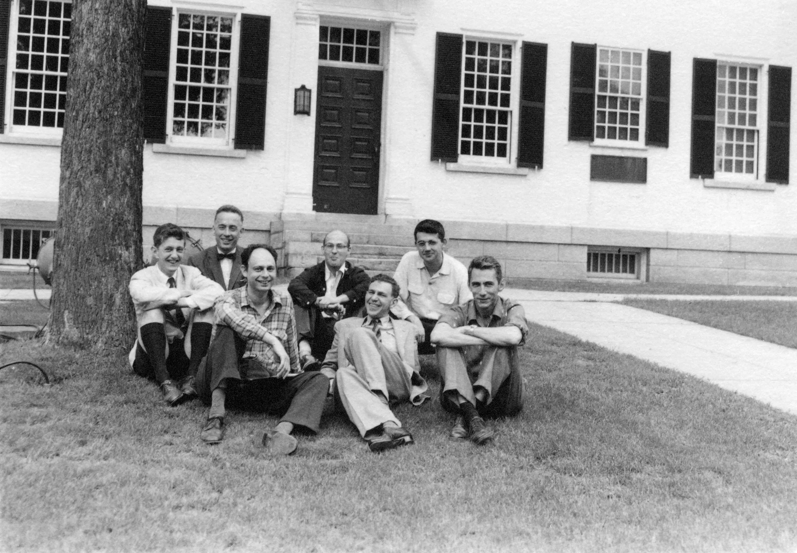

## **Évolution de l'Intelligence Artificielle**

### **3.1 Introduction**

L'Intelligence Artificielle (IA) a été l'un des domaines les plus innovants de la science et de la technologie au cours des dernières décennies. L'histoire de l'IA peut être divisée en quatre périodes principales, chacune caractérisée par des progrès significatifs, des défis et des changements dans la manière dont l'IA est conçue et développée. Ce chapitre explore l'évolution de l'IA, de ses origines théoriques aux développements les plus récents, et comment cette technologie a transformé le monde.

### **3.2 La phase initiale (1948-1965)**

#### **3.2.1 Les origines théoriques**

Les racines de l'IA remontent aux années 1940 et 1950, lorsque les premiers pionniers ont commencé à explorer l'idée de créer des machines intelligentes. L'un des moments clés fut la publication du programme de jeu d'échecs d'**Alan Turing** en 1948, connu sous le nom de **Turochamp**. Ce programme fut le premier à utiliser un algorithme de recherche pour trouver le meilleur coup dans une position d'échecs, démontrant que les machines pouvaient être programmées pour exécuter des tâches complexes.

#### **3.2.2 Le Test de Turing**

En 1950, Alan Turing proposa le célèbre **Test de Turing**, un critère pour déterminer si une machine peut être considérée comme "intelligente". Selon Turing, si une machine peut tromper un être humain en lui faisant croire qu'elle est un autre être humain lors d'une conversation, alors elle peut être considérée comme intelligente. Ce test a jeté les bases du développement de l'IA et reste un point de référence important dans le domaine.

#### **3.2.3 Les premiers programmes d'échecs**

Après le travail de Turing, d'autres chercheurs ont commencé à développer des programmes d'échecs. En 1950, **Claude Shannon** créa le **Shannon's Chess Program**, l'un des premiers programmes d'échecs basés sur des algorithmes de recherche. En 1951, **John McCarthy** développa le **McCarthy's Chess Program**, qui utilisait des techniques plus avancées pour évaluer les coups.

#### **3.2.4 La naissance de l'IA comme discipline**

En 1956, eut lieu la **Conférence de Dartmouth**, organisée par John McCarthy, Marvin Minsky, Nathaniel Rochester et Claude Shannon. Cet événement est considéré comme le moment où l'IA a été formellement reconnue comme une discipline scientifique. Pendant la conférence, les participants ont discuté de la possibilité de créer des machines capables de simuler l'intelligence humaine, jetant les bases de la recherche future.

### **3.3 La période de la simulation (1965-1980)**

#### **3.3.1 L'ère des systèmes experts**

Durant cette période, les chercheurs ont commencé à développer des **systèmes experts**, des programmes conçus pour résoudre des problèmes spécifiques en utilisant des règles logiques et des connaissances spécialisées. L'un des premiers systèmes experts fut **DENDRAL**, développé à l'Université de Stanford dans les années 1960, qui utilisait l'IA pour analyser des données chimiques et identifier des structures moléculaires.

#### **3.3.2 Traitement du langage naturel**

Dans les années 1970, le traitement du langage naturel (NLP) devint un domaine de recherche important. L'un des premiers exemples de NLP fut **ELIZA**, un chatbot développé par **Joseph Weizenbaum** en 1966. ELIZA simulait une conversation avec un thérapeute rogérien, utilisant des règles simples pour analyser et répondre aux phrases de l'utilisateur. Malgré sa simplicité, ELIZA démontra que les machines pouvaient interagir avec les êtres humains de manière apparemment intelligente.

#### **3.3.3 Vision par ordinateur**

La vision par ordinateur, c'est-à-dire la capacité des machines à interpréter des images et des vidéos, commença à se développer à cette époque. Les premiers systèmes de vision par ordinateur étaient capables de reconnaître des formes simples et des objets, ouvrant la voie à des applications plus avancées comme la reconnaissance faciale et la conduite autonome.

#### **3.3.4 L'hiver de l'IA**

Malgré les progrès, les années 1970 furent également caractérisées par une période connue sous le nom de **l'hiver de l'IA**, où l'enthousiasme initial se heurta aux limitations technologiques et au manque de résultats concrets. Les financements pour la recherche diminuèrent et de nombreux projets furent abandonnés. Cependant, cette période conduisit également à une plus grande prise de conscience des défis et des complexités de l'IA.

### **3.4 La phase de l'intelligence distribuée (1980-1990)**

#### **3.4.1 L'avènement des réseaux neuronaux**

Dans les années 1980, les **réseaux neuronaux artificiels** commencèrent à gagner en popularité comme approche de l'IA. Les réseaux neuronaux imitent le fonctionnement du cerveau humain, utilisant des couches de neurones artificiels pour traiter les informations et apprendre à partir des données. Cette approche conduisit à des progrès significatifs dans des domaines tels que la reconnaissance de formes et la classification d'images.

#### **3.4.2 Apprentissage automatique**

L'apprentissage automatique (Machine Learning) devint un domaine de recherche central durant cette période. Les algorithmes d'apprentissage automatique, tels que les **réseaux neuronaux récurrents** (RNN) et les **réseaux neuronaux convolutifs** (CNN), permirent aux machines d'apprendre à partir de grandes quantités de données et d'améliorer leurs performances au fil du temps.

#### **3.4.3 Systèmes de raisonnement probabiliste**

Dans les années 1980, les chercheurs commencèrent à développer des systèmes de raisonnement probabiliste, qui utilisaient la théorie des probabilités pour prendre des décisions dans des conditions d'incertitude. Cette approche fut particulièrement utile dans des applications telles que le diagnostic médical et la planification.

#### **3.4.4 L'essor de l'IA commerciale**

Durant cette période, l'IA commença à être utilisée dans des applications commerciales, telles que les systèmes de recommandation, les filtres anti-spam et les systèmes de trading financier. Cela marqua le début de l'intégration de l'IA dans la vie quotidienne et dans l'économie mondiale.

### **3.5 La phase moderne (1990-aujourd'hui)**

#### **3.5.1 L'ère du Big Data**

Avec l'avènement d'Internet et la disponibilité croissante des données, l'IA entra dans une nouvelle ère. Les modèles d'apprentissage automatique pouvaient désormais être entraînés sur d'énormes ensembles de données, améliorant considérablement leurs performances. Cela conduisit à des progrès dans des domaines tels que la reconnaissance vocale, la traduction automatique et la reconnaissance d'images.

#### **3.5.2 Apprentissage Profond**

L'**apprentissage profond**, une sous-branche de l'apprentissage automatique qui utilise des réseaux neuronaux avec de nombreuses couches, devint dominant dans les années 2010. Des modèles tels que les **réseaux neuronaux convolutifs** (CNN) et les **réseaux neuronaux récurrents** (RNN) permirent d'atteindre des résultats extraordinaires dans des tâches complexes, telles que la reconnaissance d'images et la génération de texte.

#### **3.5.3 IA Générative**

L'IA générative, qui utilise des algorithmes pour créer de nouveaux contenus tels que des images, de la musique et du texte, a connu une croissance rapide ces dernières années. Des modèles tels que **ChatGPT** et **DALL-E** ont démontré la capacité de générer des contenus de haute qualité, ouvrant de nouvelles possibilités pour l'art, la créativité et le divertissement.

#### **3.5.4 Conduite autonome et robotique**

La conduite autonome et la robotique sont devenues des domaines de recherche importants, avec des entreprises telles que **Tesla** et **Waymo** qui développent des voitures à conduite autonome. Les robots dotés d'IA sont utilisés dans des secteurs tels que la production, la logistique et l'assistance médicale.

#### **3.5.5 L'IA en médecine**

L'IA a été largement adoptée dans le domaine médical, avec des applications allant du diagnostic basé sur des images à la découverte de nouveaux médicaments. Des modèles d'IA sont utilisés pour analyser des données médicales et fournir des recommendations aux médecins, améliorant la précision et l'efficacité des soins.

#### **3.5.6 Éthique et réglementation**

À mesure que l'IA devient plus puissante et omniprésente, les questions éthiques et de réglementation sont devenues de plus en plus importantes. Des thèmes tels que la vie privée, les biais algorithmiques et l'impact sur le travail sont au centre du débat public, avec des gouvernements et des organisations qui travaillent à élaborer des normes et des lignes directrices pour une utilisation responsable de l'IA.

### **3.6 Conclusion**

L'évolution de l'Intelligence Artificielle a été un voyage fascinant, caractérisé par des progrès extraordinaires et des défis importants. Des premières théories d'Alan Turing aux modèles avancés d'apprentissage profond d'aujourd'hui, l'IA a transformé notre façon de vivre, de travailler et d'interagir avec le monde. Alors que nous regardons vers l'avenir, il est essentiel de continuer à explorer les potentialités de l'IA, tout en abordant les questions éthiques et sociales qu'elle soulève.
