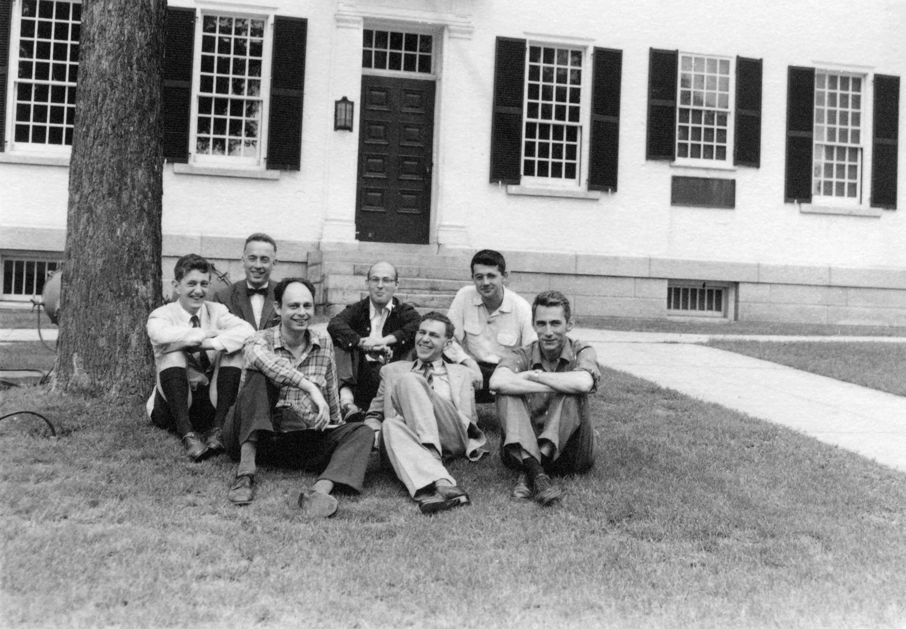

## **Evoluzione dell'Intelligenza Artificiale**

### **3.1 Introduzione**

L'Intelligenza Artificiale (AI) è stata una delle aree più innovative della scienza e della tecnologia negli ultimi decenni. La storia dell'AI può essere divisa in quattro periodi principali, ciascuno caratterizzato da progressi significativi, sfide e cambiamenti nel modo in cui l'AI viene concepita e sviluppata. Questo capitolo esplora l'evoluzione dell'AI, dalle sue origini teoriche agli sviluppi più recenti, e come questa tecnologia abbia trasformato il mondo.

### **3.2 La fase iniziale (1948-1965)**

#### **3.2.1 Le origini teoriche**

Le radici dell'AI possono essere rintracciate negli anni '40 e '50, quando i primi pionieri iniziarono a esplorare l'idea di creare macchine intelligenti. Uno dei momenti chiave fu la pubblicazione del programma di gioco di scacchi di **Alan Turing** nel 1948, noto come **Turochamp**. Questo programma è stato il primo a utilizzare un algoritmo di ricerca per trovare la mossa migliore in una posizione di scacchi, dimostrando che le macchine potevano essere programmate per eseguire compiti complessi.

#### **3.2.2 Il Test di Turing**

Nel 1950, Alan Turing propose il famoso **Test di Turing**, un criterio per determinare se una macchina può essere considerata "intelligente". Secondo Turing, se una macchina può ingannare un essere umano facendogli credere di essere un altro essere umano durante una conversazione, allora può essere considerata intelligente. Questo test ha gettato le basi per lo sviluppo dell'AI e rimane un punto di riferimento importante nel campo.

#### **3.2.3 I primi programmi di scacchi**

Dopo il lavoro di Turing, altri ricercatori iniziarono a sviluppare programmi di scacchi. Nel 1950, **Claude Shannon** creò il **Shannon's Chess Program**, uno dei primi programmi di scacchi basati su algoritmi di ricerca. Nel 1951, **John McCarthy** sviluppò il **McCarthy's Chess Program**, che utilizzava tecniche più avanzate per valutare le mosse.

#### **3.2.4 La nascita dell'AI come disciplina**

Nel 1956, si tenne la **Conferenza di Dartmouth**, organizzata da John McCarthy, Marvin Minsky, Nathaniel Rochester e Claude Shannon. Questo evento è considerato il momento in cui l'AI è stata formalmente riconosciuta come una disciplina scientifica. Durante la conferenza, i partecipanti discussero la possibilità di creare macchine in grado di simulare l'intelligenza umana, gettando le basi per la ricerca futura.

### **3.3 Il periodo della simulazione (1965-1980)**

#### **3.3.1 L'era dei sistemi esperti**

Durante questo periodo, i ricercatori iniziarono a sviluppare **sistemi esperti**, programmi progettati per risolvere problemi specifici utilizzando regole logiche e conoscenze specialistiche. Uno dei primi sistemi esperti fu **DENDRAL**, sviluppato alla Stanford University negli anni '60, che utilizzava l'AI per analizzare dati chimici e identificare strutture molecolari.

#### **3.3.2 Elaborazione del linguaggio naturale**

Negli anni '70, l'elaborazione del linguaggio naturale (NLP) divenne un'area di ricerca importante. Uno dei primi esempi di NLP fu **ELIZA**, un chatbot sviluppato da **Joseph Weizenbaum** nel 1966. ELIZA simulava una conversazione con un terapeuta rogersiano, utilizzando semplici regole per analizzare e rispondere alle frasi dell'utente. Nonostante la sua semplicità, ELIZA dimostrò che le macchine potevano interagire con gli esseri umani in modo apparentemente intelligente.

#### **3.3.3 Visione artificiale**

La visione artificiale, ovvero la capacità delle macchine di interpretare immagini e video, iniziò a svilupparsi in questo periodo. I primi sistemi di visione artificiale erano in grado di riconoscere forme semplici e oggetti, aprendo la strada a applicazioni più avanzate come il riconoscimento facciale e la guida autonoma.

#### **3.3.4 L'inverno dell'AI**

Nonostante i progressi, gli anni '70 furono anche caratterizzati da un periodo noto come **l'inverno dell'AI**, in cui l'entusiasmo iniziale si scontrò con le limitazioni tecnologiche e la mancanza di risultati concreti. I finanziamenti per la ricerca diminuirono e molti progetti furono abbandonati. Tuttavia, questo periodo portò anche a una maggiore consapevolezza delle sfide e delle complessità dell'AI.

### **3.4 La fase dell'intelligenza distribuita (1980-1990)**

#### **3.4.1 L'avvento delle reti neurali**

Negli anni '80, le **reti neurali artificiali** iniziarono a guadagnare popolarità come approccio all'AI. Le reti neurali imitano il funzionamento del cervello umano, utilizzando strati di neuroni artificiali per elaborare informazioni e apprendere dai dati. Questo approccio portò a progressi significativi in aree come il riconoscimento di pattern e la classificazione di immagini.

#### **3.4.2 Apprendimento automatico**

L'apprendimento automatico (Machine Learning) divenne un'area di ricerca centrale durante questo periodo. Gli algoritmi di apprendimento automatico, come le **reti neurali ricorrenti** (RNN) e le **reti neurali convoluzionali** (CNN), permisero alle macchine di apprendere da grandi quantità di dati e migliorare le loro prestazioni nel tempo.

#### **3.4.3 Sistemi di ragionamento probabilistico**

Negli anni '80, i ricercatori iniziarono a sviluppare sistemi di ragionamento probabilistico, che utilizzavano la teoria della probabilità per prendere decisioni in condizioni di incertezza. Questo approccio fu particolarmente utile in applicazioni come la diagnostica medica e la pianificazione.

#### **3.4.4 L'ascesa dell'AI commerciale**

Durante questo periodo, l'AI iniziò a essere utilizzata in applicazioni commerciali, come i sistemi di raccomandazione, i filtri antispam e i sistemi di trading finanziario. Questo segnò l'inizio dell'integrazione dell'AI nella vita quotidiana e nell'economia globale.

### **3.5 La fase moderna (1990-oggi)**

#### **3.5.1 L'era del Big Data**

Con l'avvento di Internet e la crescente disponibilità di dati, l'AI entrò in una nuova era. I modelli di apprendimento automatico potevano ora essere addestrati su enormi dataset, migliorando significativamente le loro prestazioni. Questo portò a progressi in aree come il riconoscimento vocale, la traduzione automatica e il riconoscimento di immagini.

#### **3.5.2 Deep Learning**

Il **deep learning**, una sottobranca del Machine Learning che utilizza reti neurali con molti strati, divenne dominante negli anni 2010. Modelli come le **reti neurali convoluzionali** (CNN) e le **reti neurali ricorrenti** (RNN) permisero di raggiungere risultati straordinari in compiti complessi, come il riconoscimento di immagini e la generazione di testo.

#### **3.5.3 AI Generativa**

L'AI generativa, che utilizza algoritmi per creare nuovi contenuti come immagini, musica e testo, ha visto una rapida crescita negli ultimi anni. Modelli come **ChatGPT** e **DALL-E** hanno dimostrato la capacità di generare contenuti di alta qualità, aprendo nuove possibilità per l'arte, la creatività e l'intrattenimento.

#### **3.5.4 Guida autonoma e robotica**

La guida autonoma e la robotica sono diventate aree di ricerca importanti, con aziende come **Tesla** e **Waymo** che sviluppano auto a guida autonoma. I robot dotati di AI sono utilizzati in settori come la produzione, la logistica e l'assistenza sanitaria.

#### **3.5.5 AI nella medicina**

L'AI è stata ampiamente adottata in campo medico, con applicazioni che vanno dalla diagnostica basata su immagini alla scoperta di nuovi farmaci. Modelli di AI sono utilizzati per analizzare dati medici e fornire raccomandazioni ai medici, migliorando l'accuratezza e l'efficienza delle cure.

#### **3.5.6 Etica e regolamentazione**

Man mano che l'AI diventa più potente e pervasiva, le questioni etiche e di regolamentazione sono diventate sempre più importanti. Temi come la privacy, il bias algoritmico e l'impatto sul lavoro sono al centro del dibattito pubblico, con governi e organizzazioni che lavorano per sviluppare norme e linee guida per l'uso responsabile dell'AI.

### **3.6 Conclusione**

L'evoluzione dell'Intelligenza Artificiale è stata un viaggio affascinante, caratterizzato da progressi straordinari e sfide significative. Dalle prime teorie di Alan Turing agli avanzati modelli di deep learning di oggi, l'AI ha trasformato il modo in cui viviamo, lavoriamo e interagiamo con il mondo. Mentre guardiamo al futuro, è essenziale continuare a esplorare le potenzialità dell'AI, affrontando al contempo le questioni etiche e sociali che essa solleva.
