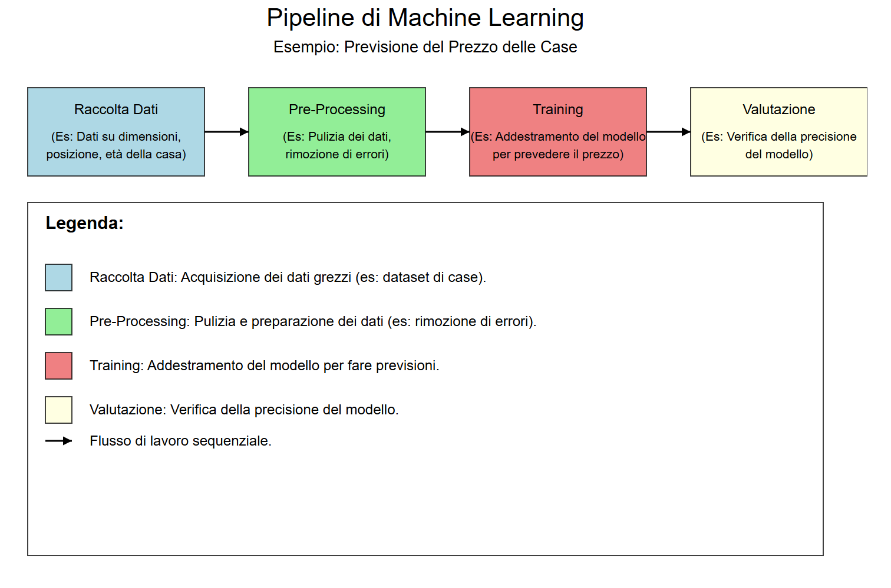
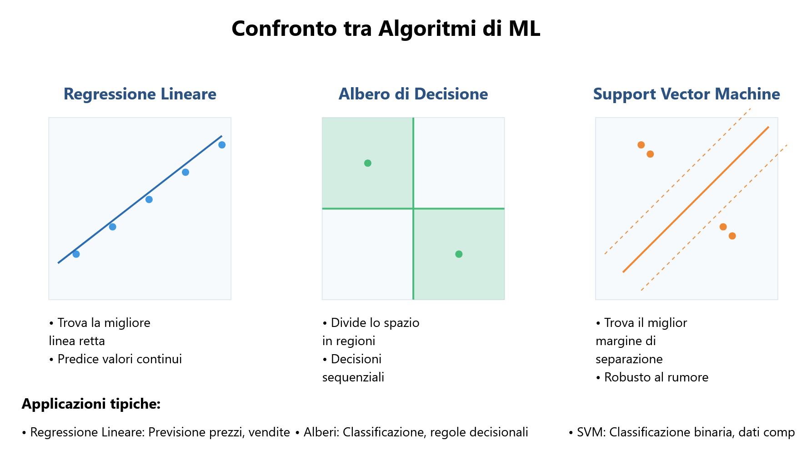
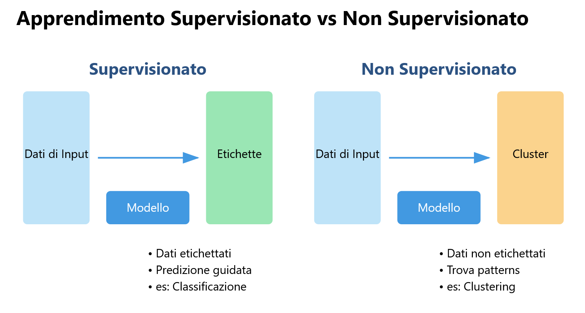
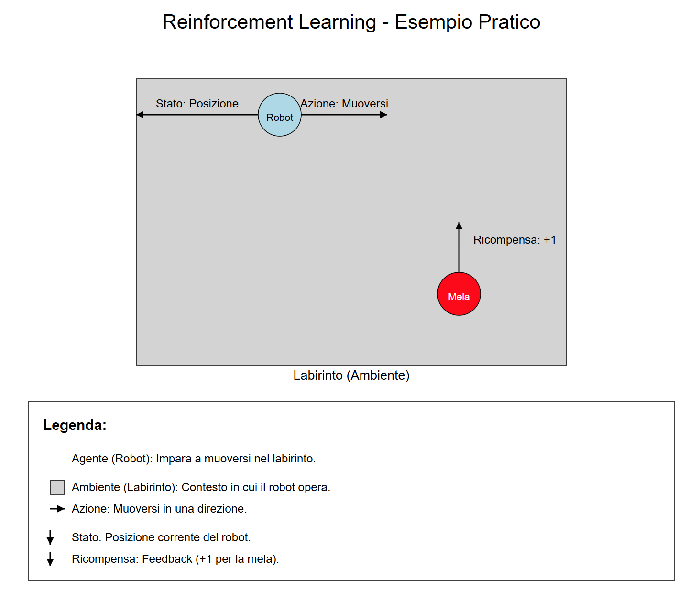
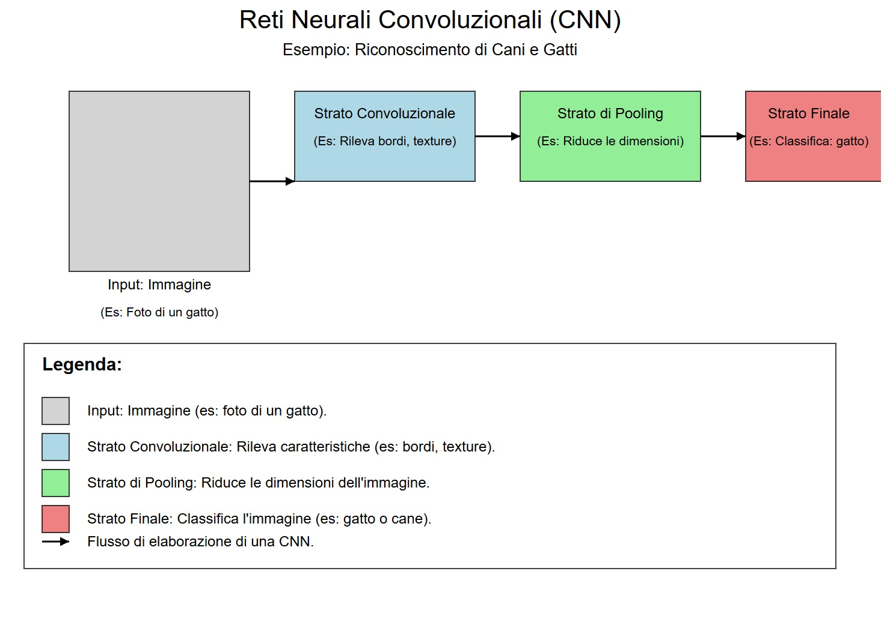
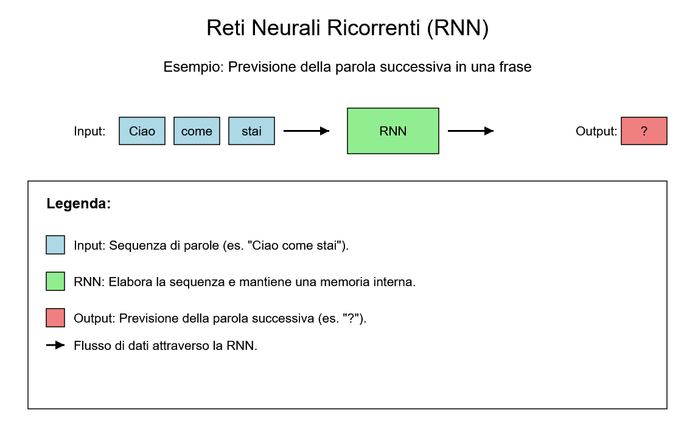
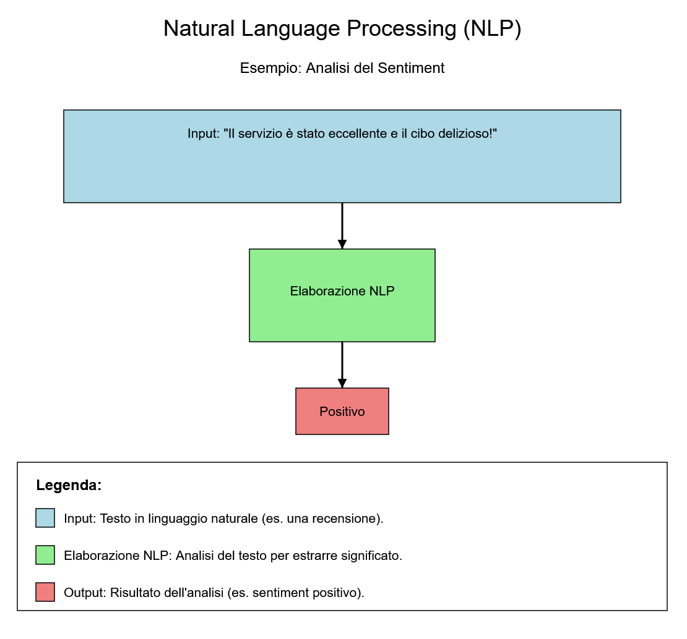
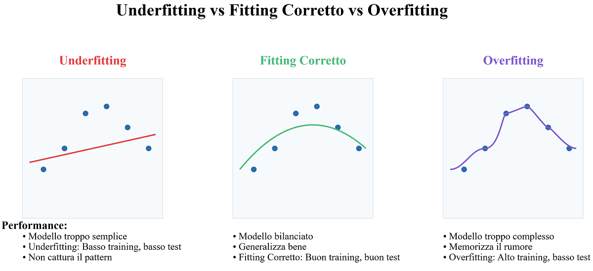
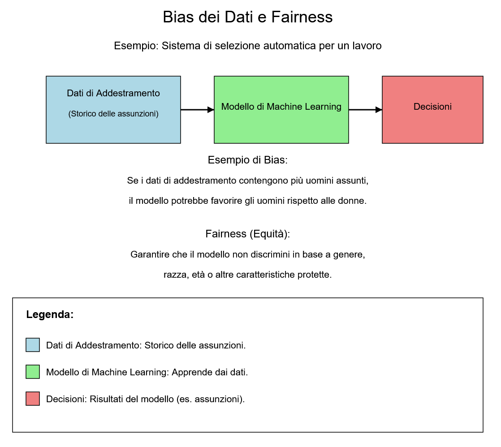

## **Maschinelles Lernen, Deep Learning und Neuronale Netze**

### **4.1 Einleitung**

**Maschinelles Lernen (ML)** und **Deep Learning (DL)** sind zwei der wichtigsten und revolutionärsten Bereiche der Künstlichen Intelligenz (KI). Diese Technologien ermöglichen es Maschinen, aus Daten zu lernen, ihre Leistung im Laufe der Zeit zu verbessern und komplexe Aufgaben auszuführen, die traditionell menschliche Intelligenz erforderten. Dieses Kapitel untersucht die grundlegenden Konzepte des Maschinellen Lernens und Deep Learnings, ihre Unterschiede, die wichtigsten Techniken und praktische Anwendungen.

### **4.2 Was ist Maschinelles Lernen?**

#### **4.2.1 Definition von Maschinellem Lernen**

**Maschinelles Lernen** ist ein Teilbereich der KI, der sich auf die Entwicklung von Algorithmen und Modellen konzentriert, die es Maschinen ermöglichen, aus Daten zu lernen, ohne explizit programmiert zu werden. Anstatt festen Regeln zu folgen, verwenden Modelle des Maschinellen Lernens Trainingsdaten, um Muster zu identifizieren und Vorhersagen oder Entscheidungen zu treffen.

**Beispiel**: Stellen Sie sich vor, Sie möchten einem Kind beibringen, Tiere zu erkennen. Sie zeigen ihm viele Bilder von Katzen und Hunden und sagen ihm: "Das ist eine Katze" und "Das ist ein Hund". Das Kind beginnt, Muster zu bemerken, wie "Katzen haben spitze Ohren" und "Hunde haben eine lange Schnauze". Wenn Sie ihm ein neues Bild zeigen, verwendet das Kind das Gelernte, um zu sagen, ob es eine Katze oder ein Hund ist.

#### **4.2.2 Warum ist Maschinelles Lernen wichtig?**

Maschinelles Lernen ist von grundlegender Bedeutung, da es die Bewältigung komplexer Probleme ermöglicht, die mit traditionellen Algorithmen nicht gelöst werden können. Beispielsweise sind die Erkennung eines Gesichts in einem Bild oder die Übersetzung eines Textes von einer Sprache in eine andere Aufgaben, die die Fähigkeit erfordern, aus großen Datenmengen zu lernen und daraus zu verallgemeinern.

#### **4.2.3 Wie funktioniert Maschinelles Lernen?**

Der Prozess des Maschinellen Lernens lässt sich in drei Hauptphasen unterteilen:

1.  **Training**: Das Modell wird mit einem Eingabedatensatz trainiert und lernt, Muster und Beziehungen zu erkennen.
2.  **Validierung**: Das Modell wird mit einem separaten Datensatz getestet, um seine Leistung zu bewerten und die Parameter anzupassen.
3.  **Inferenz**: Das trainierte Modell wird verwendet, um Vorhersagen oder Entscheidungen über neue Daten zu treffen.

### **4.3 Arten des Maschinellen Lernens**

#### **4.3.1 Überwachtes Lernen (Supervised Learning)**

Beim **überwachten Lernen** wird das Modell mit einem etikettierten Datensatz trainiert, bei dem jedes Eingabebeispiel mit einer gewünschten Ausgabe verknüpft ist. Ziel ist es, eine Funktion zu lernen, die die Eingaben den korrekten Ausgaben zuordnet. Häufige Beispiele sind die Klassifizierung von Bildern und die Vorhersage numerischer Werte (Regression).

**Beispiele für Algorithmen**:

-   **Lineare Regression**: Wird zur Vorhersage kontinuierlicher Werte verwendet, z. B. des Preises eines Hauses.
-   **Entscheidungsbäume**: Werden für Klassifizierung und Regression verwendet und basieren auf einer Reihe binärer Entscheidungen.
-   **Support Vector Machines (SVM)**: Werden für die Klassifizierung verwendet, indem die optimale Grenze zwischen verschiedenen Klassen gefunden wird.

#### **4.3.2 Unüberwachtes Lernen (Unsupervised Learning)**

Beim **unüberwachten Lernen** wird das Modell mit einem nicht etikettierten Datensatz trainiert, bei dem es keine gewünschten Ausgaben gibt. Ziel ist es, verborgene Muster oder Strukturen in den Daten zu identifizieren. Häufige Beispiele sind Clustering und Dimensionsreduktion.

**Beispiele für Algorithmen**:

-   **K-Means-Clustering**: Wird verwendet, um Daten basierend auf Ähnlichkeit in Cluster zu gruppieren.
-   **Hauptkomponentenanalyse (PCA)**: Wird verwendet, um die Dimensionalität von Daten zu reduzieren und gleichzeitig die wichtigsten Informationen beizubehalten.
-   **Autoencoder**: Ein neuronales Netz, das zum Komprimieren und Rekonstruieren von Daten verwendet wird und häufig zur Rauschunterdrückung eingesetzt wird.

#### **4.3.3 Bestärkendes Lernen (Reinforcement Learning)**

Beim **bestärkenden Lernen** lernt ein Agent, Entscheidungen zu treffen, indem er mit einer dynamischen Umgebung interagiert. Der Agent erhält Rückmeldungen in Form von Belohnungen oder Bestrafungen basierend auf seinen Aktionen, und das Ziel ist es, die Gesamtbelohnung langfristig zu maximieren. Dieser Ansatz ist besonders nützlich in Kontexten wie Spielen und Robotik.

**Beispiele für Algorithmen**:

-   **Q-Learning**: Ein Algorithmus, der eine optimale Richtlinie für Entscheidungen in einer Umgebung lernt.
-   **Deep Q-Networks (DQN)**: Eine Kombination aus Q-Learning und tiefen neuronalen Netzen, die zur Lösung komplexer Probleme verwendet wird.

### **4.4 Was ist Deep Learning?**

#### **4.4.1 Definition von Deep Learning**

**Deep Learning** ist ein Teilbereich des Maschinellen Lernens, der **künstliche neuronale Netze** mit vielen Schichten (daher der Begriff "tief") verwendet, um komplexe Probleme zu lösen. Diese neuronalen Netze sind von der Funktionsweise des menschlichen Gehirns inspiriert und können hierarchische Darstellungen von Daten lernen.

**Beispiel**: Stellen Sie sich vor, Sie möchten ein magisches Rezept für die perfekte Pizza erstellen. Sie haben viele Zutaten (Daten) wie Mehl, Tomaten, Mozzarella usw. Sie verwenden eine Reihe von Werkzeugen (Schichten des neuronalen Netzes), um zu mischen, zu kneten und zu backen. Jedes Mal, wenn Sie eine Pizza machen, probieren Sie sie und korrigieren das Rezept, um es zu verbessern (das Netz lernt aus seinen Fehlern). Am Ende wird Ihr Rezept so gut, dass Sie jedes Mal die perfekte Pizza machen können!

#### **4.4.2 Warum ist Deep Learning wichtig?**

Deep Learning hat viele Bereiche der KI revolutioniert, dank seiner Fähigkeit, große Datenmengen zu verarbeiten und komplexe Merkmale ohne manuelle Merkmalskonstruktion zu lernen. Dies macht es besonders effektiv bei Aufgaben wie Bilderkennung, Verarbeitung natürlicher Sprache und Inhaltserstellung.

#### **4.4.3 Wie funktioniert Deep Learning?**

Tiefe neuronale Netze bestehen aus mehreren Schichten künstlicher Neuronen, von denen jede die Daten auf nichtlineare Weise transformiert. Während des Trainings werden die Gewichte des Netzes angepasst, um den Fehler zwischen den Vorhersagen des Modells und den gewünschten Ergebnissen zu minimieren. Dieser Prozess wird als **Backpropagation** bezeichnet.

**Hauptkomponenten eines neuronalen Netzes**:

-   **Eingabeschicht (Input Layer)**: Die Schicht, die die Eingabedaten empfängt.
-   **Versteckte Schichten (Hidden Layers)**: Die Zwischenschichten, die die Daten transformieren.
-   **Ausgabeschicht (Output Layer)**: Die Schicht, die das Endergebnis erzeugt.

### **4.5 Arten von Neuronalen Netzen**

#### **4.5.1 Convolutional Neural Networks (CNN)**

**Convolutional Neural Networks (CNNs)** sind für die Verarbeitung gitterstrukturierter Daten wie Bilder konzipiert. Sie verwenden Faltungsoperationen, um lokale Merkmale wie Kanten und Texturen zu extrahieren, und Pooling, um die Datengröße zu reduzieren.

**Anwendungen von CNNs**:

-   **Bilderkennung**: CNNs werden verwendet, um Objekte, Gesichter und Szenen in Bildern und Videos zu identifizieren.
-   **Maschinelles Sehen**: CNNs werden in Systemen für autonomes Fahren, Überwachung und medizinische Analyse eingesetzt.
-   **Videoverarbeitung**: CNNs können Videos analysieren, um Bewegungen, Objekte oder bestimmte Ereignisse zu erkennen.
-   **Medizinische Analyse**: CNNs werden zur Analyse medizinischer Bilder wie Röntgenaufnahmen und MRTs eingesetzt und helfen Ärzten bei der Diagnose von Krankheiten.

#### **4.5.2 Recurrent Neural Networks (RNN)**

**Recurrent Neural Networks (RNNs)** sind für die Verarbeitung von Datensequenzen wie Text oder Zeitreihen konzipiert. Sie behalten einen "internen Zustand" bei, der als eine Form des Gedächtnisses fungiert und es ermöglicht, frühere Informationen bei der Verarbeitung der aktuellen Eingabe zu berücksichtigen.

**Varianten von RNNs**:

1.  **LSTM (Long Short-Term Memory)**: Eine fortschrittliche Variante von RNNs, die ein System von "Gates" (Toren) verwendet, um den Informationsfluss zu steuern, wodurch das Netz selektiv wichtige Informationen über lange Zeiträume speichern und das Problem des **vanishing gradient** (verschwindenden Gradienten) lösen kann.
2.  **GRU (Gated Recurrent Unit)**: Eine vereinfachte Version der LSTM, die die Vergessens- und Eingabe-Gates zu einem einzigen "Update-Gate" kombiniert und dabei eine ähnliche Leistung bei geringerer Rechenkomplexität beibehält.

**Anwendungen von RNNs**:

-   **Verarbeitung natürlicher Sprache (NLP)**: RNNs werden für Aufgaben wie maschinelle Übersetzung, Textgenerierung und Sentimentanalyse eingesetzt.
-   **Spracherkennung**: RNNs können zur Umwandlung von Sprache in Text verwendet werden.
-   **Zeitreihenprognose**: RNNs werden zur Vorhersage zukünftiger Werte auf der Grundlage historischer Daten verwendet, z. B. Aktienkurse oder Wettervorhersagen.
-   **Textgenerierung**: RNNs können kohärenten und kontextuell relevanten Text generieren, z. B. Gedichte, Artikel oder Programmiercode.

### **4.6 Praktische Anwendungen von Maschinellem Lernen und Deep Learning**

#### **4.6.1 Bilderkennung**

Die Bilderkennung ist eine der häufigsten Anwendungen von Deep Learning. Modelle wie CNNs werden verwendet, um Objekte, Gesichter und Szenen in Bildern und Videos zu identifizieren.

#### **4.6.2 Verarbeitung natürlicher Sprache (NLP)**

NLP ist ein Bereich der KI, der sich mit der Interaktion zwischen Maschinen und menschlicher Sprache befasst. Modelle wie RNNs und Transformer werden für Aufgaben wie maschinelle Übersetzung, Textgenerierung und Sentimentanalyse eingesetzt.

#### **4.6.3 Autonomes Fahren**

Selbstfahrende Autos verwenden Maschinelles Lernen und Deep Learning, um die Umgebung wahrzunehmen, Entscheidungen zu treffen und sicher zu navigieren. Modelle wie CNNs werden für die Objekterkennung und Routenplanung verwendet.

#### **4.6.4 Medizinische Diagnostik**

KI wird im medizinischen Bereich zur Analyse medizinischer Bilder wie Röntgenaufnahmen und MRTs eingesetzt und hilft Ärzten, Krankheiten genauer zu diagnostizieren. Deep-Learning-Modelle werden zur Identifizierung von Anomalien und zur Abgabe von Empfehlungen verwendet.

#### **4.6.5 Inhaltserstellung**

Generative KI, wie GANs, wird zur Erstellung neuer Inhalte wie Bilder, Musik und Text verwendet. Modelle wie ChatGPT und DALL-E haben die Fähigkeit zur Generierung hochwertiger Inhalte bewiesen und eröffnen neue Möglichkeiten für Kunst und Unterhaltung.

### **4.7 Herausforderungen und Grenzen von Maschinellem Lernen und Deep Learning**

#### **4.7.1 Überanpassung (Overfitting)**

**Überanpassung** tritt auf, wenn ein Modell die Trainingsdaten zu gut lernt und die Fähigkeit verliert, auf neue Daten zu verallgemeinern. Dies kann durch Techniken wie Regularisierung und Kreuzvalidierung gemildert werden.

**Beispiel**: Stellen Sie sich vor, Sie lernen für eine Prüfung:

-   **Überangepasstes Modell**: Merkt sich jede einzelne Frage im Buch, versteht aber den Kontext nicht.
-   **Korrektes Modell**: Studiert die Konzepte und kann ähnliche Fragen beantworten, auch wenn sie anders formuliert sind.

#### **4.7.2 Verzerrungen in Daten**

Modelle des Maschinellen Lernens können durch Verzerrungen in den Trainingsdaten beeinflusst werden, was zu diskriminierenden oder unfairen Entscheidungen führen kann. Es ist wichtig sicherzustellen, dass die Daten repräsentativ und frei von Vorurteilen sind.

**Beispiel**: Ein KI-Modell, das zur Auswahl von Bewerbern für eine Stelle verwendet wird. Wenn die Trainingsdaten von Unternehmen stammen, die in der Vergangenheit hauptsächlich Männer eingestellt haben, könnte das Modell lernen, diese Art von Kandidaten zu bevorzugen, auch wenn dies nicht fair oder beabsichtigt ist. Dies ist ein klassischer Fall von Datenverzerrung, die zu algorithmischer Diskriminierung führt.

#### **4.7.3 Rechenkomplexität**

Deep Learning erfordert große Datenmengen und Rechenressourcen für das Training. Dies kann die Implementierung komplexer Modelle in Kontexten mit begrenzten Ressourcen erschweren.

#### **4.7.4 Interpretierbarkeit**

Deep-Learning-Modelle werden oft als "Black Boxes" betrachtet, da es schwierig ist zu verstehen, wie sie Entscheidungen treffen. Dies wirft Bedenken hinsichtlich Transparenz und Zuverlässigkeit auf, insbesondere in kritischen Kontexten.

### **4.8 Schlussfolgerung**

Maschinelles Lernen und Deep Learning sind leistungsstarke Technologien, die die Art und Weise verändern, wie wir komplexe Probleme angehen und Entscheidungen treffen. Von maschinellem Sehen bis zur Verarbeitung natürlicher Sprache haben diese Technologien praktische Anwendungen in nahezu jedem Sektor. Es ist jedoch unerlässlich, die mit diesen Technologien verbundenen Herausforderungen und Grenzen anzugehen und sicherzustellen, dass sie ethisch und verantwortungsvoll eingesetzt werden. Während wir das Potenzial von Maschinellem Lernen und Deep Learning weiter erforschen, ist es wichtig, Innovation mit dem Bewusstsein für soziale und ethische Auswirkungen in Einklang zu bringen.
