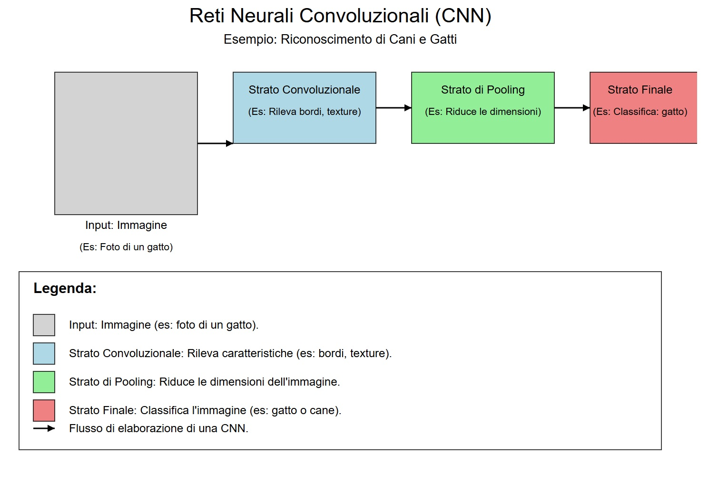
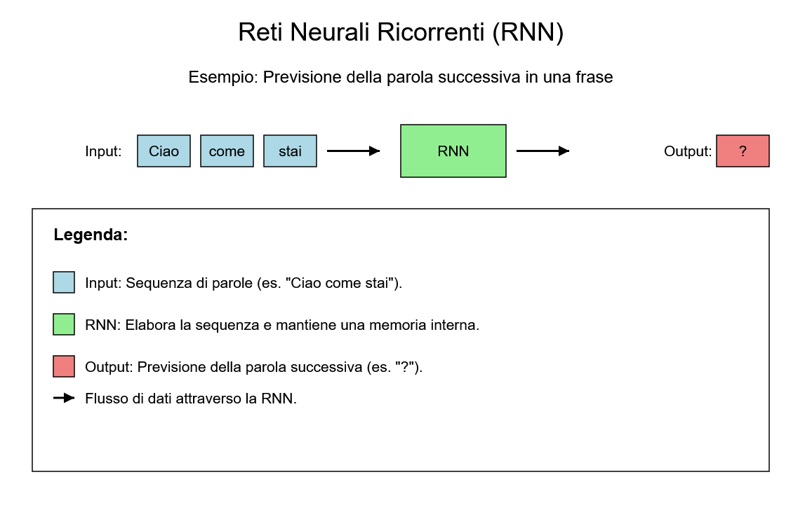
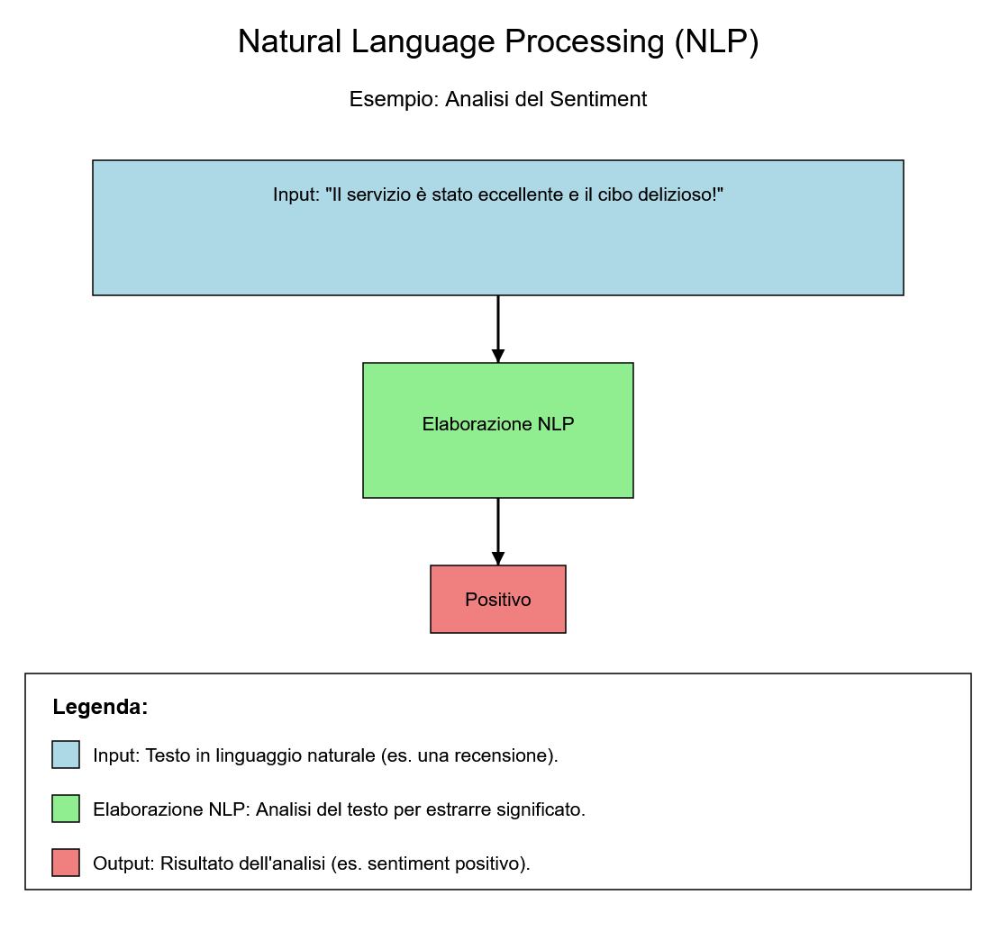

## **Machine Learning, Deep Learning, and Neural Networks**

### **4.1 Introduction**

**Machine Learning (ML)** and **Deep Learning (DL)** are two of the most significant and transformative areas of Artificial Intelligence (AI). These technologies enable machines to learn from data, improve their performance over time, and perform complex tasks that traditionally required human intelligence. This chapter explores the fundamental concepts of Machine Learning and Deep Learning, their differences, key techniques, and practical applications.

### **4.2 What is Machine Learning?**

#### **4.2.1 Definition of Machine Learning**

**Machine Learning** is a subfield of AI focused on developing algorithms and models that allow machines to learn from data without being explicitly programmed. Instead of following fixed rules, Machine Learning models use training data to identify patterns and make predictions or decisions.

**Example**: Imagine teaching a child to recognize animals. You show them many pictures of cats and dogs, telling them "this is a cat" and "this is a dog." The child starts noticing patterns, like "cats have pointy ears" and "dogs have long snouts." When shown a new picture, the child uses what they've learned to say whether it's a cat or a dog.

#### **4.2.2 Why is Machine Learning Important?**

Machine Learning is crucial because it addresses complex problems that cannot be solved with traditional algorithms. For example, recognizing a face in an image or translating text from one language to another requires the ability to learn from large amounts of data and generalize from it.

#### **4.2.3 How Does Machine Learning Work?**

The Machine Learning process can be divided into three main stages:

1. **Training**: The model is trained on an input dataset, learning to recognize patterns and relationships.
2. **Validation**: The model is tested on a separate dataset to evaluate its performance and adjust parameters.
3. **Inference**: The trained model is used to make predictions or decisions on new data.

### **4.3 Types of Machine Learning**

#### **4.3.1 Supervised Learning**

In **supervised learning**, the model is trained on a labeled dataset, where each input example is associated with a desired output. The goal is to learn a function that maps inputs to correct outputs. Common examples include image classification and numerical value prediction (regression).

**Examples of algorithms**:

- **Linear Regression**: Used to predict continuous values, like house prices.
- **Decision Trees**: Used for classification and regression, based on a series of binary decisions.
- **Support Vector Machines (SVM)**: Used for classification, finding the optimal boundary between different classes.

#### **4.3.2 Unsupervised Learning**

In **unsupervised learning**, the model is trained on an unlabeled dataset, where there are no desired outputs. The goal is to identify hidden patterns or structures in the data. Common examples include clustering and dimensionality reduction.

**Examples of algorithms**:

- **K-Means Clustering**: Used to group data into clusters based on similarity.
- **Principal Component Analysis (PCA)**: Used to reduce data dimensionality while retaining the most important information.
- **Autoencoder**: A neural network used to compress and reconstruct data, often used for noise reduction.

#### **4.3.3 Reinforcement Learning**

In **reinforcement learning**, an agent learns to make decisions by interacting with a dynamic environment. The agent receives feedback in the form of rewards or penalties based on its actions, and the goal is to maximize the total reward over time. This approach is particularly useful in contexts like gaming and robotics.

**Examples of algorithms**:

- **Q-Learning**: An algorithm that learns an optimal policy for making decisions in an environment.
- **Deep Q-Networks (DQN)**: A combination of Q-Learning and deep neural networks, used to solve complex problems.

### **4.4 What is Deep Learning?**

#### **4.4.1 Definition of Deep Learning**

**Deep Learning** is a subfield of Machine Learning that uses **artificial neural networks** with many layers (hence the term "deep") to solve complex problems. These neural networks are inspired by the functioning of the human brain and can learn hierarchical representations of data.

**Example**: Imagine creating a magic recipe for the perfect pizza. You have many ingredients (data) like flour, tomato, mozzarella, etc. You use a series of tools (neural network layers) to mix, knead, and bake. Each time you make a pizza, you taste it and adjust the recipe to improve it (the network learns from its mistakes). Eventually, your recipe becomes so good that you can make the perfect pizza every time!

#### **4.4.2 Why is Deep Learning Important?**

Deep Learning has revolutionized many AI fields due to its ability to handle large amounts of data and learn complex features without the need for manual feature engineering. This makes it particularly effective in tasks like image recognition, natural language processing, and content generation.

#### **4.4.3 How Does Deep Learning Work?**

Deep neural networks consist of multiple layers of artificial neurons, each transforming data in a non-linear way. During training, the network's weights are adjusted to minimize the error between the model's predictions and the desired outcomes. This process is known as **backpropagation**.

**Main components of a neural network**:

- **Input Layer**: The layer that receives input data.
- **Hidden Layers**: The intermediate layers that transform data.
- **Output Layer**: The layer that produces the final result.

### **4.5 Types of Neural Networks**

#### **4.5.1 Convolutional Neural Networks (CNN)**

**Convolutional Neural Networks** (CNN) are designed to process grid-structured data, like images. They use convolution operations to extract local features, such as edges and textures, and pooling to reduce data dimensions.

**Applications of CNNs**:

- **Image Recognition**: CNNs are used to identify objects, faces, and scenes in images and videos.
- **Computer Vision**: CNNs are used in autonomous driving systems, surveillance, and medical analysis.
- **Video Processing**: CNNs can analyze videos to detect movements, objects, or specific events.
- **Medical Analysis**: CNNs are used to analyze medical images, like X-rays and MRIs, to help doctors diagnose diseases.

#### **4.5.2 Recurrent Neural Networks (RNN)**

**Recurrent Neural Networks** (RNN) are designed to process sequences of data, like text or time series. They maintain an "internal state" that acts as a form of memory, allowing them to consider previous information when processing current input.

**Variants of RNNs**:

1. **LSTM (Long Short-Term Memory)**: An advanced variant of RNNs that uses a system of "gates" to control the flow of information, allowing the network to selectively remember important information for long periods and solve the **vanishing gradient** problem.
2. **GRU (Gated Recurrent Unit)**: A simplified version of LSTM that combines the forget and input gates into a single "update gate," maintaining similar performance but with less computational complexity.

**Applications of RNNs**:

- **Natural Language Processing (NLP)**: RNNs are used for tasks like automatic translation, text generation, and sentiment analysis.
- **Speech Recognition**: RNNs can be used to convert speech into text.
- **Time Series Prediction**: RNNs are used to predict future values based on historical data, like stock prices or weather forecasts.
- **Text Generation**: RNNs can generate coherent and contextually relevant text, like poems, articles, or programming code.

### **4.6 Practical Applications of Machine Learning and Deep Learning**

#### **4.6.1 Image Recognition**

Image recognition is one of the most common applications of Deep Learning. Models like CNNs are used to identify objects, faces, and scenes in images and videos.

#### **4.6.2 Natural Language Processing (NLP)**

NLP is a field of AI that deals with the interaction between machines and human language. Models like RNNs and Transformers are used for tasks like automatic translation, text generation, and sentiment analysis.

#### **4.6.3 Autonomous Driving**

Autonomous vehicles use Machine Learning and Deep Learning to perceive their surroundings, make decisions, and navigate safely. Models like CNNs are used for object recognition and path planning.

#### **4.6.4 Medical Diagnostics**

AI is used in the medical field to analyze medical images, like X-rays and MRIs, and help doctors diagnose diseases with greater accuracy. Deep Learning models are used to identify anomalies and provide recommendations.

#### **4.6.5 Content Generation**

Generative AI, like GANs, is used to create new content, such as images, music, and text. Models like ChatGPT and DALL-E have demonstrated the ability to generate high-quality content, opening new possibilities for art and entertainment.

### **4.7 Challenges and Limitations of Machine Learning and Deep Learning**

#### **4.7.1 Overfitting**

**Overfitting** occurs when a model learns the training data too well, losing the ability to generalize to new data. This can be mitigated using techniques like regularization and cross-validation.

**Example**: Imagine studying for an exam:

- **Overfitted Model**: Memorizes every single question from the book but doesn't understand the context.
- **Proper Model**: Studies the concepts and can answer similar questions, even if phrased differently.

#### **4.7.2 Data Bias**

Machine Learning models can be influenced by biases present in the training data, leading to discriminatory or unfair decisions. It's important to ensure that data is representative and free from bias.

**Example**: An AI model used to select job candidates. If the training data comes from companies that have historically hired mostly men, the model might learn to favor that type of candidate, even if it's not fair or intentional. This is a classic case of data bias leading to algorithmic discrimination.

#### **4.7.3 Computational Complexity**

Deep Learning requires large amounts of data and computational resources for training. This can make it challenging to implement complex models in resource-limited settings.

#### **4.7.4 Interpretability**

Deep Learning models are often considered "black boxes" because it's difficult to understand how they make decisions. This raises concerns about transparency and reliability, especially in critical contexts.

### **4.8 Conclusion**

Machine Learning and Deep Learning are powerful technologies transforming how we tackle complex problems and make decisions. From computer vision to natural language processing, these technologies have practical applications in nearly every sector. However, it's essential to address the challenges and limitations associated with these technologies, ensuring they are used ethically and responsibly. As we continue to explore the potential of Machine Learning and Deep Learning, it's important to balance innovation with awareness of social and ethical implications.