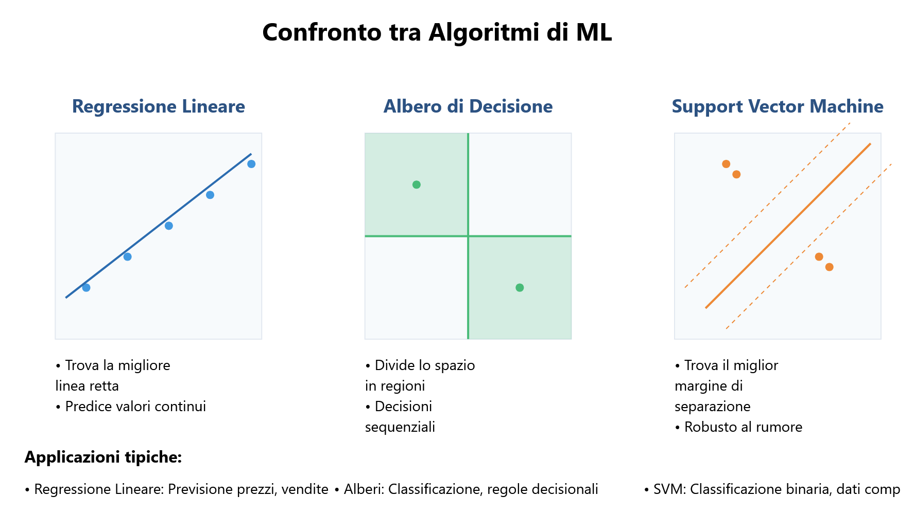
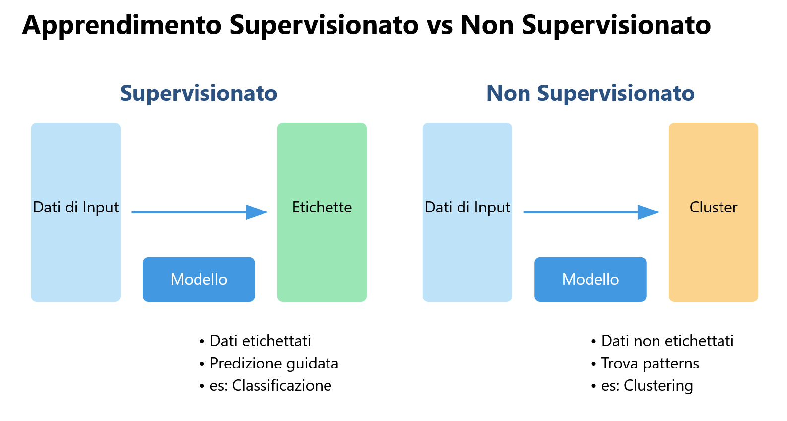
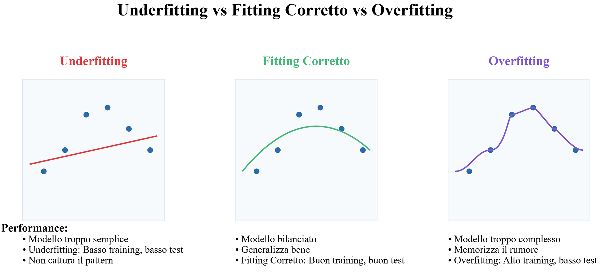

## **Aprendizaje Automático, Aprendizaje Profundo y Redes Neuronales**

### **4.1 Introducción**

El **Aprendizaje Automático (ML)** y el **Aprendizaje Profundo (DL)** son dos de las áreas más importantes y revolucionarias de la Inteligencia Artificial (IA). Estas tecnologías permiten a las máquinas aprender de los datos, mejorar su rendimiento con el tiempo y realizar tareas complejas que tradicionalmente requerían inteligencia humana. Este capítulo explora los conceptos fundamentales del Aprendizaje Automático y el Aprendizaje Profundo, sus diferencias, las técnicas principales y las aplicaciones prácticas.

### **4.2 ¿Qué es el Aprendizaje Automático?**

#### **4.2.1 Definición de Aprendizaje Automático**

El **Aprendizaje Automático** es una subrama de la IA que se centra en el desarrollo de algoritmos y modelos que permiten a las máquinas aprender de los datos sin ser programadas explícitamente. En lugar de seguir reglas fijas, los modelos de Aprendizaje Automático utilizan datos de entrenamiento para identificar patrones y hacer predicciones o tomar decisiones.

**Ejemplo**: Imagina que quieres enseñar a un niño a reconocer animales. Le muestras muchas fotos de gatos y perros, diciéndole "esto es un gato" y "esto es un perro". El niño comienza a notar patrones, como "los gatos tienen orejas puntiagudas" y "los perros tienen el hocico largo". Cuando le muestras una nueva foto, el niño usa lo que ha aprendido para decir si es un gato o un perro.

#### **4.2.2 ¿Por qué es importante el Aprendizaje Automático?**

El Aprendizaje Automático es fundamental porque permite abordar problemas complejos que no pueden resolverse con algoritmos tradicionales. Por ejemplo, reconocer un rostro en una imagen o traducir un texto de un idioma a otro son tareas que requieren la capacidad de aprender de grandes cantidades de datos y generalizar a partir de ellos.

#### **4.2.3 ¿Cómo funciona el Aprendizaje Automático?**

El proceso de Aprendizaje Automático puede dividirse en tres fases principales:

1. **Entrenamiento**: El modelo se entrena con un conjunto de datos de entrada, aprendiendo a reconocer patrones y relaciones.
2. **Validación**: El modelo se prueba con un conjunto de datos separado para evaluar su rendimiento y ajustar los parámetros.
3. **Inferencia**: El modelo entrenado se utiliza para hacer predicciones o tomar decisiones sobre nuevos datos.

### **4.3 Tipos de Aprendizaje Automático**

#### **4.3.1 Aprendizaje Supervisado**

En el **aprendizaje supervisado**, el modelo se entrena con un conjunto de datos etiquetado, donde cada ejemplo de entrada está asociado a una salida deseada. El objetivo es aprender una función que mapee las entradas a las salidas correctas. Ejemplos comunes incluyen la clasificación de imágenes y la predicción de valores numéricos (regresión).

**Ejemplos de algoritmos**:

- **Regresión Lineal**: Utilizado para predecir valores continuos, como el precio de una casa.
- **Árboles de Decisión**: Utilizados para la clasificación y la regresión, basados en una serie de decisiones binarias.
- **Máquinas de Vectores de Soporte (SVM)**: Utilizadas para la clasificación, encontrando el límite óptimo entre diferentes clases.

#### **4.3.2 Aprendizaje No Supervisado**

En el **aprendizaje no supervisado**, el modelo se entrena con un conjunto de datos no etiquetado, donde no hay salidas deseadas. El objetivo es identificar patrones o estructuras ocultas en los datos. Ejemplos comunes incluyen el agrupamiento y la reducción de dimensionalidad.

**Ejemplos de algoritmos**:

- **Clustering K-Means**: Utilizado para agrupar datos en clústeres basados en la similitud.
- **Análisis de Componentes Principales (PCA)**: Utilizado para reducir la dimensionalidad de los datos, manteniendo la información más importante.
- **Autoencoders**: Una red neuronal utilizada para comprimir y reconstruir datos, a menudo utilizada para la reducción de ruido.

#### **4.3.3 Aprendizaje por Refuerzo**

En el **aprendizaje por refuerzo**, un agente aprende a tomar decisiones interactuando con un entorno dinámico. El agente recibe retroalimentación en forma de recompensas o castigos según sus acciones, y el objetivo es maximizar la recompensa total a largo plazo. Este enfoque es particularmente útil en contextos como los juegos y la robótica.

**Ejemplos de algoritmos**:

- **Q-Learning**: Un algoritmo que aprende una política óptima para tomar decisiones en un entorno.
- **Redes Neuronales de Q Profundo (DQN)**: Una combinación de Q-Learning y redes neuronales profundas, utilizada para resolver problemas complejos.

### **4.4 ¿Qué es el Aprendizaje Profundo?**

#### **4.4.1 Definición de Aprendizaje Profundo**

El **Aprendizaje Profundo** es una subrama del Aprendizaje Automático que utiliza **redes neuronales artificiales** con muchos niveles (de ahí el término "profundo") para resolver problemas complejos. Estas redes neuronales están inspiradas en el funcionamiento del cerebro humano y son capaces de aprender representaciones jerárquicas de los datos.

**Ejemplo**: Imagina que quieres crear una receta mágica para hacer la pizza perfecta. Tienes muchos ingredientes (datos) como harina, tomate, mozzarella, etc. Usas una serie de herramientas (capas de la red neuronal) para mezclar, amasar y cocinar. Cada vez que haces una pizza, la pruebas y corriges la receta para mejorarla (la red aprende de sus errores). Al final, tu receta se vuelve tan buena que logras hacer la pizza perfecta cada vez.

#### **4.4.2 ¿Por qué es importante el Aprendizaje Profundo?**

El Aprendizaje Profundo ha revolucionado muchos campos de la IA gracias a su capacidad para manejar grandes cantidades de datos y aprender características complejas sin la necesidad de una ingeniería manual de características. Esto lo hace particularmente efectivo en tareas como el reconocimiento de imágenes, el procesamiento del lenguaje natural y la generación de contenidos.

#### **4.4.3 ¿Cómo funciona el Aprendizaje Profundo?**

Las redes neuronales profundas están compuestas por múltiples capas de neuronas artificiales, cada una de las cuales transforma los datos de manera no lineal. Durante el entrenamiento, los pesos de la red se ajustan para minimizar el error entre las predicciones del modelo y los resultados deseados. Este proceso se conoce como **retropropagación**.

**Componentes principales de una red neuronal**:

- **Capa de Entrada**: La capa que recibe los datos de entrada.
- **Capas Ocultas**: Las capas intermedias que transforman los datos.
- **Capa de Salida**: La capa que produce el resultado final.

### **4.5 Tipos de Redes Neuronales**

#### **4.5.1 Redes Neuronales Convolucionales (CNN)**

Las **Redes Neuronales Convolucionales** (CNN) están diseñadas para procesar datos estructurados en cuadrícula, como las imágenes. Utilizan operaciones de convolución para extraer características locales, como bordes y texturas, y pooling para reducir el tamaño de los datos.

**Aplicaciones de las CNN**:

- **Reconocimiento de imágenes**: Las CNN se utilizan para identificar objetos, rostros y escenas en imágenes y videos.
- **Visión artificial**: Las CNN se utilizan en sistemas de conducción autónoma, vigilancia y análisis médico.
- **Procesamiento de video**: Las CNN pueden analizar videos para detectar movimientos, objetos o eventos específicos.
- **Análisis médico**: Las CNN se utilizan para analizar imágenes médicas, como radiografías y resonancias magnéticas, y ayudar a los médicos a diagnosticar enfermedades.

#### **4.5.2 Redes Neuronales Recurrentes (RNN)**

Las **Redes Neuronales Recurrentes** (RNN) están diseñadas para procesar secuencias de datos, como el texto o las series temporales. Mantienen un "estado interno" que funciona como una forma de memoria, permitiendo considerar la información previa para procesar la entrada actual.

**Variantes de las RNN**:

1. **LSTM (Long Short-Term Memory)**: Una variante avanzada de las RNN que utiliza un sistema de "puertas" para controlar el flujo de información, permitiendo a la red almacenar selectivamente información importante durante largos períodos y resolver el problema del **gradiente que se desvanece**.
2. **GRU (Gated Recurrent Unit)**: Una versión simplificada de la LSTM que combina las puertas de olvido y de entrada en una única "puerta de actualización", manteniendo un rendimiento similar, pero con menor complejidad computacional.

**Aplicaciones de las RNN**:

- **Procesamiento del lenguaje natural (NLP)**: Las RNN se utilizan para tareas como la traducción automática, la generación de texto y el análisis de sentimientos.
- **Reconocimiento de voz**: Las RNN pueden utilizarse para convertir el habla en texto.
- **Predicción de series temporales**: Las RNN se utilizan para predecir valores futuros basados en datos históricos, como los precios de acciones o las previsiones meteorológicas.
- **Generación de texto**: Las RNN pueden generar texto coherente y contextualmente relevante, como poemas, artículos o códigos de programación.

### **4.6 Aplicaciones Prácticas del Aprendizaje Automático y Aprendizaje Profundo**

#### **4.6.1 Reconocimiento de Imágenes**

El reconocimiento de imágenes es una de las aplicaciones más comunes del Aprendizaje Profundo. Modelos como las CNN se utilizan para identificar objetos, rostros y escenas en imágenes y videos.

#### **4.6.2 Procesamiento del Lenguaje Natural (NLP)**

El NLP es un campo de la IA que se ocupa de la interacción entre máquinas y lenguaje humano. Modelos como las RNN y los Transformers se utilizan para tareas como la traducción automática, la generación de texto y el análisis de sentimientos.

#### **4.6.3 Conducción Autónoma**

Los vehículos autónomos utilizan el Aprendizaje Automático y el Aprendizaje Profundo para percibir el entorno, tomar decisiones y navegar de manera segura. Modelos como las CNN se utilizan para el reconocimiento de objetos y la planificación de rutas.

#### **4.6.4 Diagnóstico Médico**

La IA se utiliza en el campo médico para analizar imágenes médicas, como radiografías y resonancias magnéticas, y ayudar a los médicos a diagnosticar enfermedades con mayor precisión. Modelos de Aprendizaje Profundo se utilizan para identificar anomalías y proporcionar recomendaciones.

#### **4.6.5 Generación de Contenidos**

La IA generativa, como las GAN, se utiliza para crear nuevos contenidos, como imágenes, música y texto. Modelos como ChatGPT y DALL-E han demostrado la capacidad de generar contenidos de alta calidad, abriendo nuevas posibilidades para el arte y el entretenimiento.

### **4.7 Desafíos y Límites del Aprendizaje Automático y Aprendizaje Profundo**

#### **4.7.1 Sobreajuste (Overfitting)**

El **sobreajuste** ocurre cuando un modelo aprende demasiado bien los datos de entrenamiento, perdiendo la capacidad de generalizar a nuevos datos. Esto puede mitigarse utilizando técnicas como la regularización y la validación cruzada.

**Ejemplo**: Imagina que estudias para un examen:

- **Modelo Sobreajustado**: Memoriza cada pregunta del libro, pero no entiende el contexto.
- **Modelo Correcto**: Estudia los conceptos y es capaz de responder preguntas similares, incluso si están formuladas de manera diferente.

#### **4.7.2 Sesgo en los Datos**

Los modelos de Aprendizaje Automático pueden verse influenciados por sesgos presentes en los datos de entrenamiento, llevando a decisiones discriminatorias o injustas. Es importante garantizar que los datos sean representativos y estén libres de prejuicios.

**Ejemplo**: Un modelo de IA utilizado para seleccionar candidatos para un trabajo. Si los datos de entrenamiento provienen de empresas que en el pasado han contratado principalmente a hombres, el modelo podría aprender a favorecer a ese tipo de candidatos, incluso si esto no es justo o intencional. Este es un caso clásico de sesgo en los datos que lleva a discriminación algorítmica.

#### **4.7.3 Complejidad Computacional**

El Aprendizaje Profundo requiere grandes cantidades de datos y recursos computacionales para el entrenamiento. Esto puede dificultar la implementación de modelos complejos en contextos con recursos limitados.

#### **4.7.4 Interpretabilidad**

Los modelos de Aprendizaje Profundo a menudo se consideran "cajas negras" porque es difícil comprender cómo toman decisiones. Esto plantea preocupaciones sobre la transparencia y la fiabilidad, especialmente en contextos críticos.

### **4.8 Conclusión**

El Aprendizaje Automático y el Aprendizaje Profundo son tecnologías poderosas que están transformando la forma en que abordamos problemas complejos y tomamos decisiones. Desde la visión artificial hasta el procesamiento del lenguaje natural, estas tecnologías tienen aplicaciones prácticas en casi todos los sectores. Sin embargo, es esencial abordar los desafíos y límites asociados con estas tecnologías, asegurando que se utilicen de manera ética y responsable. Mientras continuamos explorando las potencialidades del Aprendizaje Automático y el Aprendizaje Profundo, es importante equilibrar la innovación con la conciencia de las implicaciones sociales y éticas.