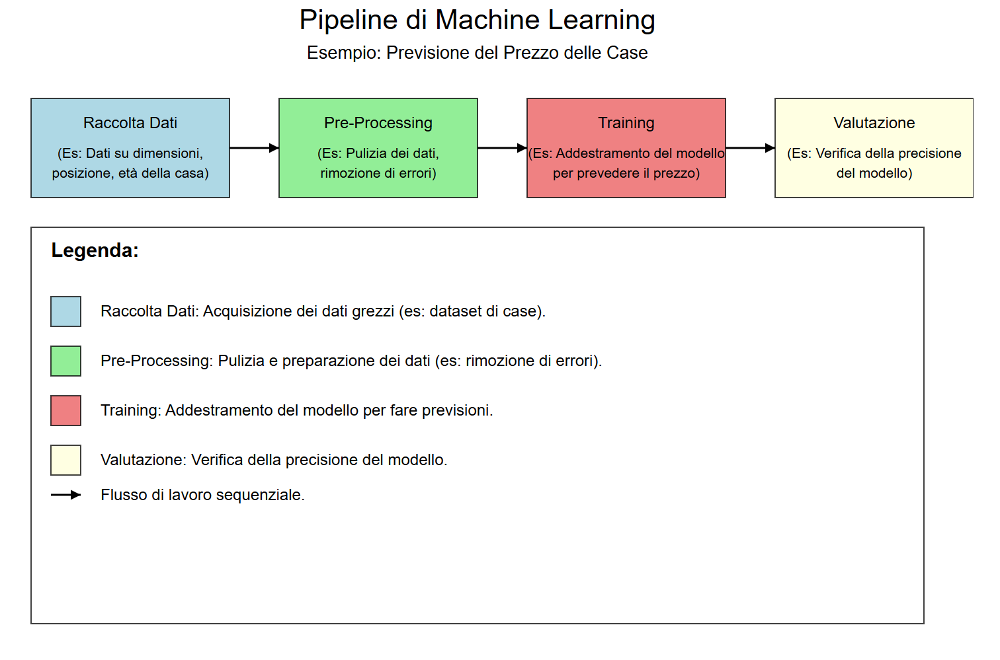

## Machine Learning, Deep Learning e Reti Neurali

### 4.1 Introduzione

Il **Machine Learning** (ML) e il **Deep Learning** (DL) sono due delle aree più importanti e rivoluzionarie dell'Intelligenza Artificiale (AI). Queste tecnologie permettono alle macchine di apprendere dai dati, migliorare le loro prestazioni nel tempo e svolgere compiti complessi che tradizionalmente richiedevano l'intelligenza umana. Questo capitolo esplora i concetti fondamentali del Machine Learning e del Deep Learning, le loro differenze, le tecniche principali e le applicazioni pratiche.

### 4.2 Cos'è il Machine Learning?

#### 4.2.1 Definizione di Machine Learning

Il **Machine Learning** è una sottobranca dell'AI che si concentra sullo sviluppo di algoritmi e modelli che permettono alle macchine di apprendere dai dati senza essere esplicitamente programmate. Invece di seguire regole fisse, i modelli di Machine Learning utilizzano dati di addestramento per identificare pattern e fare previsioni o decisioni.

**Esempio**: Immagina di voler insegnare a un bambino a riconoscere gli animali. Gli mostri tante foto di gatti e cani, dicendogli "questo è un gatto" e "questo è un cane". Il bambino inizia a notare schemi, come "i gatti hanno orecchie a punta" e "i cani hanno il muso lungo". Quando gli mostri una nuova foto, il bambino usa ciò che ha imparato per dire se è un gatto o un cane.

#### 4.2.2 Perché il Machine Learning è importante?

Il Machine Learning è fondamentale perché permette di affrontare problemi complessi che non possono essere risolti con algoritmi tradizionali. Ad esempio, riconoscere un volto in un'immagine o tradurre un testo da una lingua all'altra sono compiti che richiedono la capacità di apprendere da grandi quantità di dati e di generalizzare da essi.

#### 4.2.3 Come funziona il Machine Learning?

Il processo di Machine Learning può essere suddiviso in tre fasi principali:

1. **Addestramento**: Il modello viene addestrato su un dataset di input, imparando a riconoscere pattern e relazioni.
2. **Validazione**: Il modello viene testato su un dataset separato per valutare le sue prestazioni e regolare i parametri.
3. **Inferenza**: Il modello addestrato viene utilizzato per fare previsioni o decisioni su nuovi dati.

### 4.3 Tipologie di Machine Learning

#### 4.3.1 Apprendimento Supervisionato (Supervised Learning)

Nell'**apprendimento supervisionato**, il modello viene addestrato su un dataset etichettato, dove ogni esempio di input è associato a un output desiderato. L'obiettivo è imparare una funzione che mappa gli input agli output corretti. Esempi comuni includono la classificazione di immagini e la previsione di valori numerici (regressione).

**Esempi di algoritmi**:

- **Regressione Lineare**: Utilizzato per prevedere valori continui, come il prezzo di una casa.
- **Alberi di Decisione**: Utilizzati per la classificazione e la regressione, basati su una serie di decisioni binarie.
- **Support Vector Machines (SVM)**: Utilizzati per la classificazione, trovando il confine ottimale tra diverse classi.

  .png)

#### 4.3.2 Apprendimento Non Supervisionato (Unsupervised Learning)

Nell'**apprendimento non supervisionato**, il modello viene addestrato su un dataset non etichettato, dove non ci sono output desiderati. L'obiettivo è identificare pattern o strutture nascoste nei dati. Esempi comuni includono il clustering e la riduzione della dimensionalità.

**Esempi di algoritmi**:

- **K-Means Clustering**: Utilizzato per raggruppare dati in cluster basati sulla somiglianza.Immagina di avere un mucchio di palline di colori diversi. Il K-Means le divide in gruppi in base al colore.
- **Principal Component Analysis (PCA)**: Utilizzato per ridurre la dimensionalità dei dati, mantenendo le informazioni più importanti. Immagina di avere un disegno di una mela fatto con tanti puntini sparsi. La PCA lo trasforma in un disegno più semplice, con meno puntini, ma che sembra ancora una mela.
- **Autoencoder**: Una rete neurale utilizzata per comprimere e ricostruire dati, spesso utilizzata per la riduzione del rumore. Immagina di avere una foto di un gatto. L’autoencoder, la comprime in una versione più piccola (come un’icona), la ricostruisce per farla sembrare di nuovo la foto originale.

#### 4.3.3 Apprendimento per Rinforzo (Reinforcement Learning)

Nell'**apprendimento per rinforzo**, un agente impara a prendere decisioni interagendo con un ambiente dinamico. L'agente riceve feedback sotto forma di ricompense o punizioni in base alle sue azioni, e l'obiettivo è massimizzare la ricompensa totale nel lungo termine. Questo approccio è particolarmente utile in contesti come i giochi e la robotica.

**Esempi di algoritmi**:

- **Q-Learning**: Un algoritmo che impara una politica ottimale per prendere decisioni in un ambiente.
Immagina un robot in un labirinto:
- Il robot prova a muoversi in direzioni casuali.
- Se trova l’uscita, impara che quelle mosse erano buone (Q-Value aumenta).
- Ripete il processo fino a trovare il percorso migliore.
- **Deep Q-Networks (DQN)**: Una combinazione di Q-Learning e reti neurali profonde, utilizzata per risolvere problemi complessi. Immagina un gioco come Pac-Man:
- La DQN guarda lo schermo (stato) e decide dove muoversi (azione).
- Se mangia un fantasma, impara che quella mossa è buona (ricompensa).
- Usa le esperienze passate per migliorare le decisioni future.

### 4.4 Cos'è il Deep Learning?

#### 4.4.1 Definizione di Deep Learning

Il **Deep Learning** è una sottobranca del Machine Learning che utilizza **reti neurali artificiali** con molti strati (da qui il termine "deep") per risolvere problemi complessi. Queste reti neurali sono ispirate al funzionamento del cervello umano e sono in grado di apprendere rappresentazioni gerarchiche dei dati.

**Esempio**: Immagina di voler creare una ricetta magica per fare la pizza perfetta. Hai tanti ingredienti (dati) come farina, pomodoro, mozzarella, ecc. Usi una serie di strumenti (strati della rete neurale) per mescolare, impastare e cuocere. Ogni volta che fai una pizza, la assaggi e correggi la ricetta per migliorarla (la rete impara dai suoi errori). Alla fine, la tua ricetta diventa così buona che riesci a fare la pizza perfetta ogni volta!

#### 4.4.2 Perché il Deep Learning è importante?

Il Deep Learning ha rivoluzionato molti campi dell'AI grazie alla sua capacità di gestire grandi quantità di dati e di apprendere feature complesse senza la necessità di un'ingegneria manuale delle feature. Questo lo rende particolarmente efficace in compiti come il riconoscimento di immagini, il trattamento del linguaggio naturale e la generazione di contenuti.

#### 4.4.3 Come funziona il Deep Learning?

Le reti neurali profonde sono composte da più strati di neuroni artificiali, ognuno dei quali trasforma i dati in modo non lineare. Durante l'addestramento, i pesi della rete vengono regolati per minimizzare l'errore tra le previsioni del modello e i risultati desiderati. Questo processo è noto come **backpropagation**.

**Componenti principali di una rete neurale**:

- **Input Layer**: Lo strato che riceve i dati di input.
- **Hidden Layers**: Gli strati intermedi che trasformano i dati.
- **Output Layer**: Lo strato che produce il risultato finale.

### 4.5 Tipologie di Reti Neurali

#### 4.5.1 Reti Neurali Convoluzionali (CNN)

Le **Reti Neurali Convoluzionali** (CNN) sono progettate per elaborare dati strutturati a griglia, come le immagini. Utilizzano operazioni di convoluzione per estrarre feature locali, come bordi e texture, e pooling per ridurre le dimensioni dei dati.

**Come funziona una CNN?**
Le CNN sono composte da più strati di neuroni artificiali, ognuno dei quali trasforma i dati in modo non lineare. Gli strati di convoluzione applicano filtri (kernel) all'input per estrarre feature locali, mentre gli strati di pooling riducono le dimensioni dei dati, mantenendo le feature più importanti.

**Applicazioni delle CNN**:

- **Riconoscimento di immagini**: Le CNN sono utilizzate per identificare oggetti, volti e scene in immagini e video.
- **Visione artificiale**: Le CNN sono utilizzate in sistemi di guida autonoma, sorveglianza e analisi medica.
- **Elaborazione video**: Le CNN possono analizzare video per rilevare movimenti, oggetti o eventi specifici.
- **Analisi medica**: Le CNN sono utilizzate per analizzare immagini mediche, come radiografie e risonanze magnetiche, e aiutare i medici a diagnosticare malattie.

#### 4.5.2 Reti Neurali Ricorrenti (RNN)

Le **Reti Neurali Ricorrenti** (RNN) sono progettate per elaborare sequenze di dati, come il testo o le serie temporali. Mantengono uno "stato interno" che funziona come una forma di memoria, permettendo di considerare le informazioni precedenti per elaborare l'input corrente.

**Come funziona una RNN?**
Le RNN elaborano i dati sequenziali passo dopo passo, mantenendo uno stato interno che cattura le informazioni rilevanti dai passaggi precedenti. Questo permette alle RNN di gestire input di lunghezza variabile e di mantenere il contesto temporale.

**Varianti delle RNN**:

1. **LSTM (Long Short-Term Memory)**: Una LSTM è una variante avanzata delle RNN che utilizza un sistema di "gate" (cancelli) per controllare il flusso delle informazioni, permettendo alla rete di memorizzare selettivamente informazioni importanti per lunghi periodi e risolvere il problema del **vanishing gradient**, ovvero un problema che si verifica durante l’addestramento delle reti neurali profonde, dove i gradienti diventano così piccoli che il modello smette di imparare.
2. **GRU (Gated Recurrent Unit)**: La GRU è una versione semplificata della LSTM che combina i gate di dimenticanza e di input in un unico "gate di aggiornamento", mantenendo prestazioni simili, ma con minor complessità computazionale.

**Applicazioni delle RNN**:

- **Elaborazione del linguaggio naturale (NLP)**: Le RNN sono utilizzate per compiti come la traduzione automatica, la generazione di testo e l'analisi del sentiment.
- **Riconoscimento vocale**: Le RNN possono essere utilizzate per convertire il parlato in testo.
- **Previsione di serie temporali**: Le RNN sono utilizzate per prevedere valori futuri basati su dati storici, come i prezzi delle azioni o le previsioni meteorologiche.
- **Generazione di testo**: Le RNN possono generare testo coerente e contestualmente rilevante, come poesie, articoli o codici di programmazione.

### 4.6 Applicazioni Pratiche del Machine Learning e Deep Learning

#### 4.6.1 Riconoscimento di Immagini

Il riconoscimento di immagini è una delle applicazioni più comuni del Deep Learning. Modelli come le CNN sono utilizzati per identificare oggetti, volti e scene in immagini e video.

#### 4.6.2 Elaborazione del Linguaggio Naturale (NLP)

L'NLP è un campo dell'AI che si occupa dell'interazione tra macchine e linguaggio umano. Modelli come le RNN e i Transformer sono utilizzati per compiti come la traduzione automatica, la generazione di testo e l'analisi del sentiment.

#### 4.6.3 Guida Autonoma

Le auto a guida autonoma utilizzano il Machine Learning e il Deep Learning per percepire l'ambiente circostante, prendere decisioni e navigare in modo sicuro. Modelli come le CNN sono utilizzati per il riconoscimento di oggetti e la pianificazione del percorso.

#### 4.6.4 Diagnostica Medica

L'AI è utilizzata in campo medico per analizzare immagini mediche, come radiografie e risonanze magnetiche, e aiutare i medici a diagnosticare malattie con maggiore precisione. Modelli di Deep Learning sono utilizzati per identificare anomalie e fornire raccomandazioni.

#### 4.6.5 Generazione di Contenuti

L'AI generativa, come le GAN, è utilizzata per creare nuovi contenuti, come immagini, musica e testo. Modelli come GPT-3 e DALL-E hanno dimostrato la capacità di generare contenuti di alta qualità, aprendo nuove possibilità per l'arte e l'intrattenimento.

### 4.7 Sfide e Limiti del Machine Learning e Deep Learning

#### 4.7.1 Sovradattamento (Overfitting)

Il **sovradattamento** si verifica quando un modello impara troppo bene i dati di addestramento, perdendo la capacità di generalizzare a nuovi dati. Questo può essere mitigato utilizzando tecniche come la regolarizzazione e la cross-validation.
Immagina di studiare per un esame:
    Modello Sovradattato: Memorizza ogni singola domanda del libro, ma non capisce il contesto.
    Modello Corretto: Studia i concetti e riesce a rispondere a domande simili, anche se formulate in modo
diverso

#### 4.7.2 Bias nei Dati

I modelli di Machine Learning possono essere influenzati da bias presenti nei dati di addestramento, portando a decisioni discriminatorie o ingiuste. È importante garantire che i dati siano rappresentativi e privi di pregiudizi. Immagina un modello di AI utilizzato per selezionare i candidati per un lavoro. Se i dati di addestramento provengono da aziende che in passato hanno assunto principalmente uomini, o una determinata etnia o religione, il modello potrebbe imparare a favorire quel tipo di candidati, anche se questo non è giusto o intenzionale. Questo è un classico caso di bias nei dati che porta a discriminazione algoritmica.

#### 4.7.3 Complessità Computazionale

Il Deep Learning richiede grandi quantità di dati e risorse computazionali per l'addestramento. Questo può rendere difficile l'implementazione di modelli complessi in contesti con risorse limitate.

#### 4.7.4 Interpretabilità

I modelli di Deep Learning sono spesso considerati "scatole nere" perché è difficile comprendere come prendono decisioni. Questo solleva preoccupazioni sulla trasparenza e l'affidabilità, specialmente in contesti critici.

### 4.8 Conclusione

Il Machine Learning e il Deep Learning sono tecnologie potenti che stanno trasformando il modo in cui affrontiamo problemi complessi e prendiamo decisioni. Dalla visione artificiale all'elaborazione del linguaggio naturale, queste tecnologie hanno applicazioni pratiche in quasi ogni settore. Tuttavia, è essenziale affrontare le sfide e i limiti associati a queste tecnologie, garantendo che siano utilizzate in modo etico e responsabile. Mentre continuiamo a esplorare le potenzialità del Machine Learning e del Deep Learning, è importante bilanciare l'innovazione con la consapevolezza delle implicazioni sociali e etiche.
