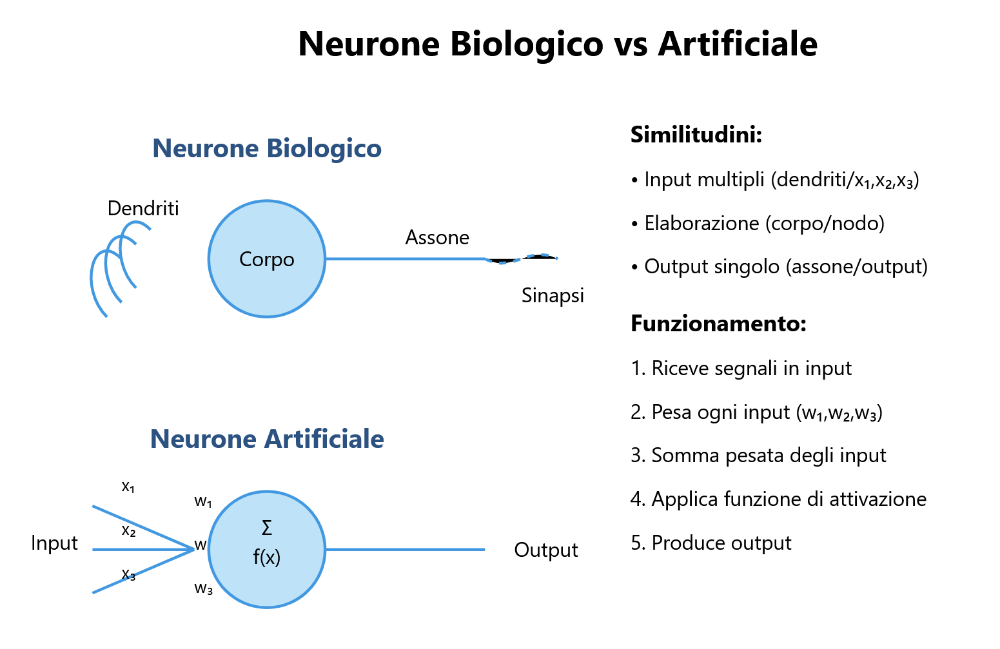
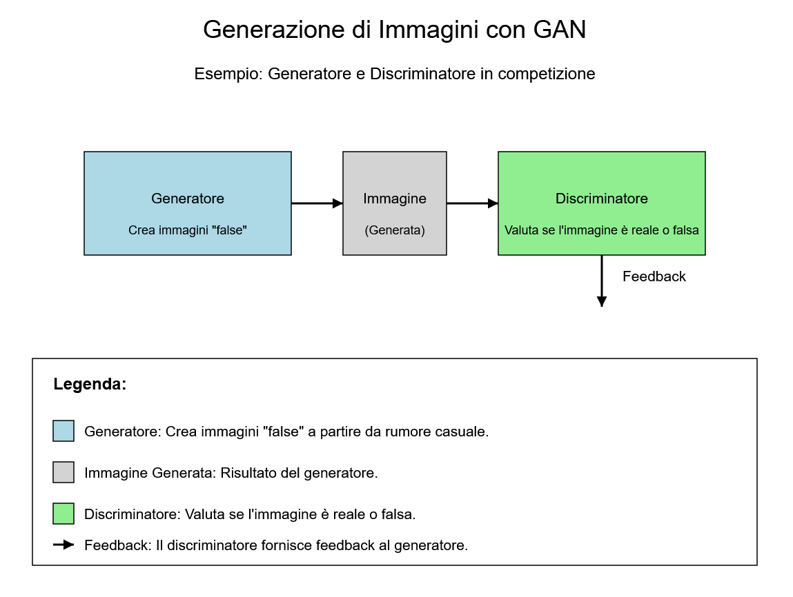
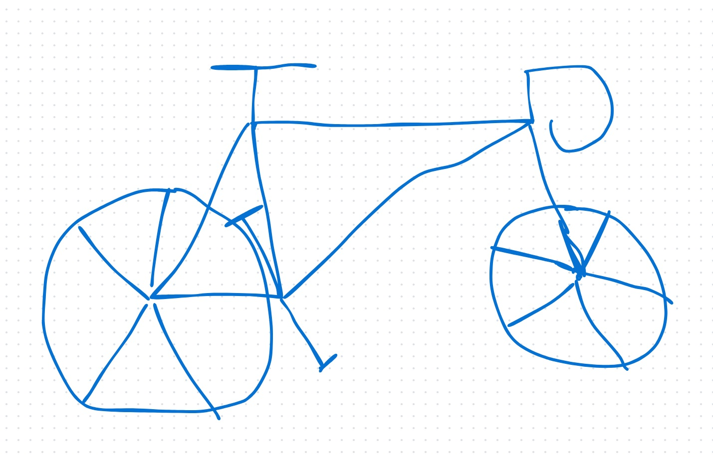
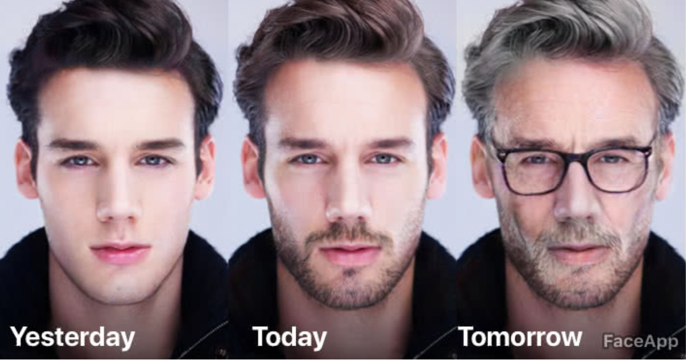
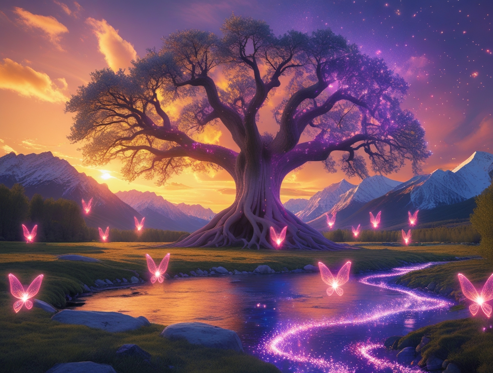

## **Generative Algorithmen**

### **5.1 Einleitung**

**Generative Algorithmen** stellen eine der fortschrittlichsten und revolutionärsten Grenzen im Bereich der Künstlichen Intelligenz (KI) dar. Diese Werkzeuge ermöglichen es Maschinen, neue Inhalte wie Bilder, Töne und Texte zu erstellen, die von denen menschlicher Produktion nicht zu unterscheiden sind. Dieses Kapitel untersucht die grundlegenden Konzepte generativer Algorithmen, ihre praktischen Anwendungen und die Auswirkungen auf die Zukunft von Kreativität und Innovation.


### **5.2 Was sind generative Algorithmen?**

#### **5.2.1 Definition von generativen Algorithmen**

**Generative Algorithmen** sind eine Klasse von Algorithmen des maschinellen Lernens, die synthetische Daten wie Bilder, Töne oder Texte erzeugen, die realen Daten ähneln. Diese Algorithmen verwenden ein künstliches neuronales Netz, um die Muster realer Daten zu lernen und dann neue synthetische Daten zu generieren.

#### **5.2.2 Warum sind generative Algorithmen wichtig?**

Generative Algorithmen sind wichtig, weil sie die Erstellung neuer und origineller Inhalte ohne direkte menschliche Intervention ermöglichen. Dies eröffnet neue Möglichkeiten in Bereichen wie Kunst, Musik, Design und Unterhaltung. Darüber hinaus können sie zur Erweiterung bestehender Datensätze verwendet werden, wodurch die Leistung von Machine-Learning-Modellen verbessert wird.

#### **5.2.3 Wie funktionieren generative Algorithmen?**

Generative Algorithmen funktionieren, indem sie die in den Trainingsdaten vorhandenen Muster und Strukturen lernen. Einmal trainiert, können diese Algorithmen neue Daten generieren, die denselben Verteilungen und Merkmalen wie die Originaldaten folgen. Dieser Prozess basiert oft auf Techniken wie **Generative Adversarial Networks (GANs)** und **Recurrent Neural Networks (RNNs)**.

### **5.3 Generative Adversarial Networks (GANs)**

#### **5.3.1 Was ist ein GAN?**

Ein **Generative Adversarial Network (GAN)** ist eine Architektur des maschinellen Lernens, die 2014 von **Ian Goodfellow** eingeführt wurde. GANs bestehen aus zwei neuronalen Netzen, die in einem Nullsummenspiel miteinander konkurrieren:
1.  **Der Generator (G)**: Erzeugt synthetische Daten und versucht, reale Daten zu imitieren. Sein Ziel ist es, so überzeugende Beispiele zu erstellen, dass sie den Diskriminator "täuschen".
2.  **Der Diskriminator (D)**: Fungiert als "Richter" und versucht, zwischen realen und generierten Daten zu unterscheiden. Er muss die Daten korrekt als authentisch oder gefälscht klassifizieren.

#### **5.3.2 Wie funktioniert ein GAN?**

Die beiden Netze trainieren gleichzeitig:

-   Der Generator verbessert schrittweise die Qualität der synthetischen Daten.
-   Der Diskriminator verfeinert seine Fähigkeit, Fälschungen zu erkennen.

Dieser Prozess setzt sich fort, bis der Generator Daten erzeugt, die der Diskriminator nicht mehr von realen Daten unterscheiden kann.



#### **5.3.3 Anwendungen von GANs**

GANs haben ein breites Anwendungsspektrum, darunter:

-   **Erzeugung fotorealistischer Bilder**: GANs können Bilder von Gesichtern, Landschaften und Objekten erstellen, die echt aussehen.
-   **Umwandlung von Skizzen in Fotografien**: GANs können Zeichnungen oder Skizzen in fotorealistische Bilder umwandeln.


-   **Alterung/Verjüngung von Gesichtern**: GANs können das scheinbare Alter einer Person auf einem Foto verändern.

-   **Erstellung von Kunstwerken**: GANs können originelle Kunstwerke in verschiedenen Stilen generieren.
```text
Hier ist das Bild, das mit folgendem Prompt erhalten wurde:
Eine traumhafte Landschaft bei Sonnenuntergang, bei der der Himmel in Orange-, Violett- und Goldtönen gemalt ist. In der Mitte ein großer alter Baum mit Wurzeln, die sich in den Boden verflechten, und Ästen
die sich zum Himmel erstrecken, beleuchtet von magischen Lichtern. Um den Baum herum fliegen kleine Feenwesen mit durchsichtigen Flügeln in einer funkelnden Atmosphäre. Im Hintergrund erheben sich schneebedeckte
Berge gegen den Horizont, mit einem kristallklaren Fluss, der sich durch die Szene schlängelt. Das Bild ist detailreich, mit realistischen Texturen und einer märchenhaften
Atmosphäre.
```

-   **Videosynthese**: GANs können realistische Videos aus Textbeschreibungen erstellen.

#### **5.3.4 Herausforderungen bei GANs**

Trotz ihres Potenzials weisen GANs einige Herausforderungen auf:

-   **Instabilität während des Trainings**: GANs können aufgrund des Wettbewerbs zwischen Generator und Diskriminator schwer zu trainieren sein.
-   **Modenkollaps (Modal Collapse)**: Der Generator kann beginnen, immer dieselbe Ausgabe zu produzieren, was die Vielfalt der generierten Daten einschränkt.
-   **Qualität der generierten Daten**: Obwohl GANs realistische Daten produzieren können, können sie manchmal Artefakte oder Unvollkommenheiten erzeugen.

### **5.4 Generative Algorithmen in Aktion**

#### **5.4.1 Bilderzeugung**

Generative Algorithmen wie GANs werden zur Erstellung fotorealistischer Bilder, Kunstwerke und Designs verwendet. Beispielsweise ist **DALL-E** ein von OpenAI entwickeltes generatives Modell, das originelle Bilder basierend auf Textbeschreibungen erstellen kann.

#### **5.4.2 Musikerzeugung**

Generative Algorithmen können verwendet werden, um originelle Musik in verschiedenen Stilen zu erstellen. Modelle wie **MuseNet** von OpenAI können komplexe Musikkompositionen basierend auf textuellen oder melodischen Eingaben generieren.

#### **5.4.3 Texterzeugung**

RNNs und Transformer-Modelle wie **GPT-3** werden verwendet, um kohärenten und kontextuell relevanten Text zu generieren. Diese Modelle können zum Schreiben von Artikeln, Gedichten, Programmiercode und vielem mehr verwendet werden.

#### **5.4.4 Sprachsynthese**

Generative Algorithmen können verwendet werden, um realistische Stimmen basierend auf textuellen Eingaben zu synthetisieren. Dies ist besonders nützlich für Anwendungen wie Sprachassistenten und die Erstellung von Audioinhalten.

### **5.5 Herausforderungen und Grenzen generativer Algorithmen**

#### **5.5.1 Qualität der generierten Daten**

Obwohl generative Algorithmen realistische Daten produzieren können, können sie manchmal Artefakte oder Unvollkommenheiten erzeugen. Es ist wichtig, die Qualität der generierten Daten zu bewerten und sicherzustellen, dass sie für die gewünschte Anwendung nützlich sind.

#### **5.5.2 Verzerrungen in den Trainingsdaten**

Generative Algorithmen können durch in den Trainingsdaten vorhandene Verzerrungen beeinflusst werden, was zu verzerrten oder diskriminierenden Ergebnissen führt. Es ist wichtig sicherzustellen, dass die Trainingsdaten repräsentativ und frei von Vorurteilen sind. Wenn beispielsweise ein Gesichtserkennungsmodell hauptsächlich mit Gesichtern einer einzigen ethnischen Zugehörigkeit trainiert wird, kann es Schwierigkeiten haben, Gesichter anderer ethnischer Zugehörigkeiten zu erkennen.

#### **5.5.3 Rechenkomplexität**

Generative Algorithmen, insbesondere GANs, erfordern große Datenmengen und Rechenressourcen für das Training. Dies kann die Implementierung komplexer Modelle in Kontexten mit begrenzten Ressourcen erschweren.

#### **5.5.4 Ethik und Verantwortung**

Die Fähigkeit generativer Algorithmen, realistische Inhalte zu erstellen, wirft wichtige ethische Fragen auf, wie beispielsweise die Möglichkeit, Deepfakes oder gefälschte Inhalte zu erstellen. Es ist unerlässlich, diese Technologien verantwortungsvoll einzusetzen und sicherzustellen, dass sie für positive Zwecke verwendet werden.

### **5.6 Schlussfolgerung**

Generative Algorithmen und neuronale Netze sind leistungsstarke Technologien, die die Art und Weise verändern, wie wir Inhalte erstellen und mit ihnen interagieren. Von der Erzeugung von Bildern und Musik bis hin zur Synthese von Sprache und Text haben diese Technologien praktische Anwendungen in nahezu jedem Sektor. Es ist jedoch unerlässlich, die mit diesen Technologien verbundenen Herausforderungen und Grenzen anzugehen und sicherzustellen, dass sie ethisch und verantwortungsvoll eingesetzt werden. Während wir das Potenzial generativer Algorithmen weiter erforschen, ist es wichtig, Innovation mit dem Bewusstsein für soziale und ethische Auswirkungen in Einklang zu bringen.
