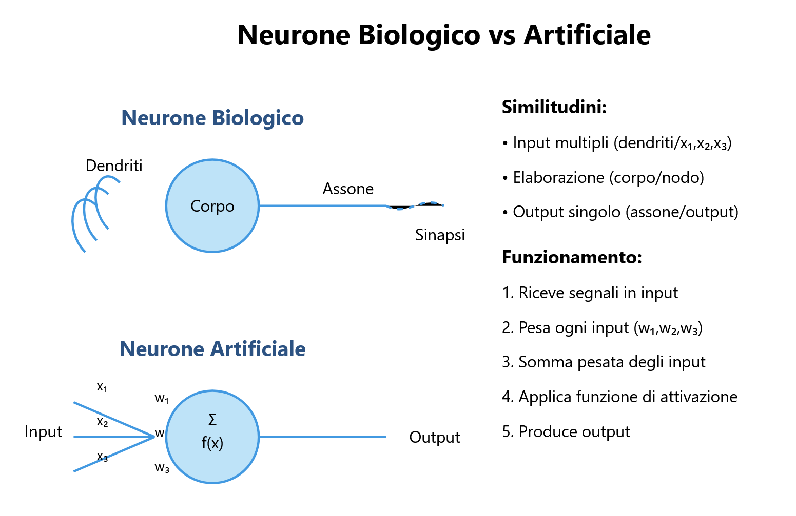
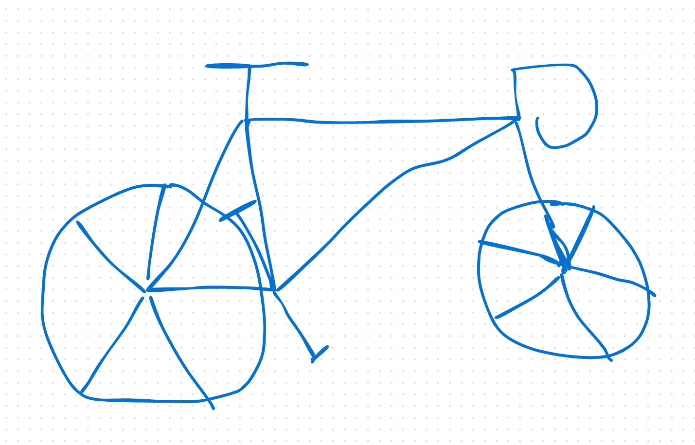
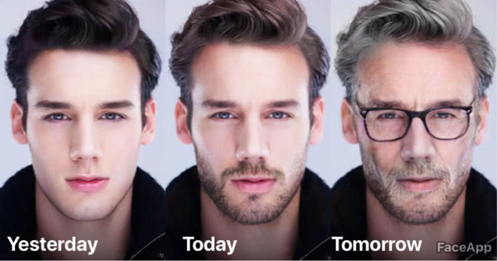
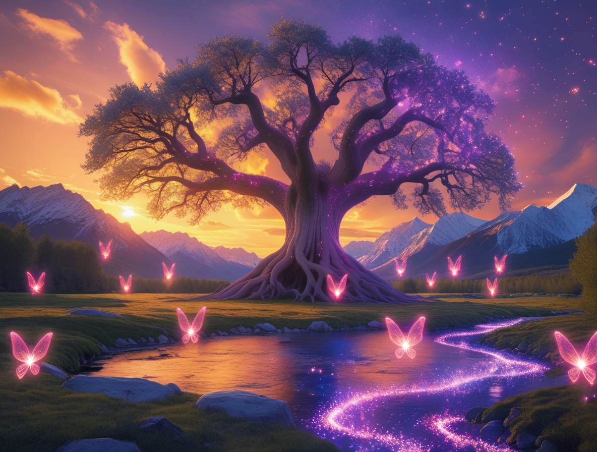

## **Generative Algorithms**

### **5.1 Introduction**

**Generative algorithms** are at the cutting edge of advancements in the field of Artificial Intelligence (AI). These tools enable machines to create new content, such as images, sounds, and text, that are indistinguishable from those produced by humans. This chapter delves into the fundamental concepts of generative algorithms, their practical applications, and their implications for the future of creativity and innovation.


### **5.2 What are Generative Algorithms?**

#### **5.2.1 Definition of Generative Algorithms**

**Generative algorithms** are a class of machine learning algorithms that generate synthetic data, such as images, sounds, or text, which resemble real data. These algorithms use artificial neural networks to learn patterns from real data and then generate new synthetic data.

#### **5.2.2 Why are Generative Algorithms Important?**

Generative algorithms are important because they allow for the creation of new and original content without the need for direct human intervention. This opens up new possibilities in fields such as art, music, design, and entertainment. Additionally, they can be used to augment existing datasets, improving the performance of machine learning models.

#### **5.2.3 How do Generative Algorithms Work?**

Generative algorithms work by learning the patterns and structures present in training data. Once trained, these algorithms can generate new data that follows the same distributions and characteristics as the original data. This process often relies on techniques such as **Generative Adversarial Networks (GANs)** and **Recurrent Neural Networks (RNNs)**.

### **5.3 Generative Adversarial Networks (GANs)**

#### **5.3.1 What is a GAN?**

A **Generative Adversarial Network (GAN)** is a machine learning architecture introduced by **Ian Goodfellow** in 2014. GANs consist of two neural networks that compete against each other in a zero-sum "game":
1. **The Generator (G)**: Produces synthetic data by trying to mimic real data. Its goal is to create examples so convincing that they "fool" the Discriminator.
2. **The Discriminator (D)**: Acts as a "judge," trying to distinguish between real and generated data. It must correctly classify the data as real or fake.

#### **5.3.2 How Does a GAN Work?**

The two networks train simultaneously:

- The Generator progressively improves the quality of the synthetic data.
- The Discriminator refines its ability to detect fakes.

This process continues until the Generator produces data that the Discriminator can no longer distinguish from real data.


#### **5.3.3 Applications of GANs**

GANs have a wide range of applications, including:

- **Photorealistic Image Generation**: GANs can create images of faces, landscapes, and objects that appear real.
- **Sketch-to-Photo Conversion**: GANs can transform drawings or sketches into photorealistic images.


- **Aging/Rejuvenating Faces**: GANs can alter the apparent age of a person in a photo.

- **Art Creation**: GANs can generate original artworks in various styles.
```text
Here is the image obtained with the following prompt:
A dreamlike landscape at sunset, where the sky is painted with shades of orange, purple, and gold. In the center, a large ancient tree with roots intertwining in the ground and branches
reaching towards the sky, illuminated by magical lights. Around the tree, small fairy creatures with transparent wings fly in a sparkling atmosphere. In the background, snow-capped
mountains stand against the horizon, with a crystal-clear river winding through the scene. The image is rich in detail, with realistic textures and a fairy-tale atmosphere.
```

- **Video Synthesis**: GANs can create realistic videos from textual descriptions.

#### **5.3.4 Challenges of GANs**

Despite their potential, GANs present some challenges:

- **Training Instability**: GANs can be difficult to train due to the competition between the Generator and the Discriminator.
- **Mode Collapse**: The Generator may start producing the same output repeatedly, limiting the variety of generated data.
- **Quality of Generated Data**: Although GANs can produce realistic data, they may sometimes generate artifacts or imperfections.

### **5.4 Generative Algorithms in Action**

#### **5.4.1 Image Generation**

Generative algorithms, such as GANs, are used to create photorealistic images, artworks, and designs. For example, **DALL-E** is a generative model developed by OpenAI that can create original images based on textual descriptions.

#### **5.4.2 Music Generation**

Generative algorithms can be used to create original music in various styles. Models like **MuseNet** by OpenAI can generate complex musical compositions based on textual or melodic inputs.

#### **5.4.3 Text Generation**

RNNs and Transformer models, such as **GPT-3**, are used to generate coherent and contextually relevant text. These models can be used to write articles, poems, programming code, and much more.

#### **5.4.4 Voice Synthesis**

Generative algorithms can be used to synthesize realistic voices based on textual input. This is particularly useful for applications like voice assistants and audio content creation.

### **5.5 Challenges and Limitations of Generative Algorithms**

#### **5.5.1 Quality of Generated Data**

Although generative algorithms can produce realistic data, they may sometimes generate artifacts or imperfections. It is important to assess the quality of the generated data and ensure it is useful for the intended application.

#### **5.5.2 Bias in Training Data**

Generative algorithms can be influenced by biases present in the training data, leading to distorted or discriminatory results. It is important to ensure that the training data is representative and free from biases. For example, if a facial recognition model is trained primarily on faces of one ethnicity, it may struggle to recognize faces of other ethnicities.

#### **5.5.3 Computational Complexity**

Generative algorithms, particularly GANs, require large amounts of data and computational resources for training. This can make it challenging to implement complex models in resource-limited environments.

#### **5.5.4 Ethics and Responsibility**

The ability of generative algorithms to create realistic content raises important ethical issues, such as the potential to create deepfakes or false content. It is essential to use these technologies responsibly and ensure they are employed for positive purposes.

### **5.6 Conclusion**

Generative algorithms and neural networks are powerful technologies that are transforming the way we create and interact with content. From image and music generation to voice and text synthesis, these technologies have practical applications in nearly every sector. However, it is essential to address the challenges and limitations associated with these technologies, ensuring they are used ethically and responsibly. As we continue to explore the potential of generative algorithms, it is important to balance innovation with awareness of social and ethical implications.