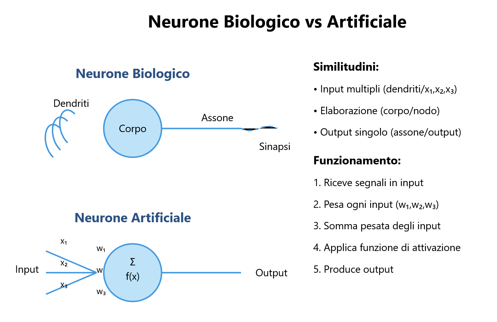
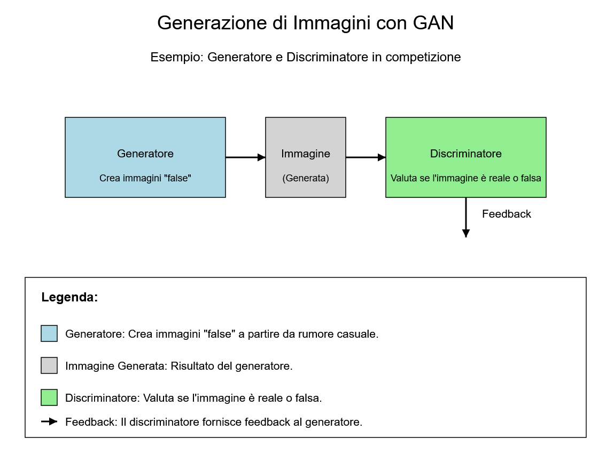
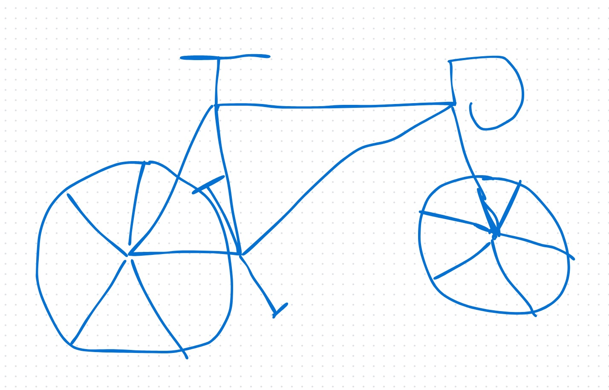
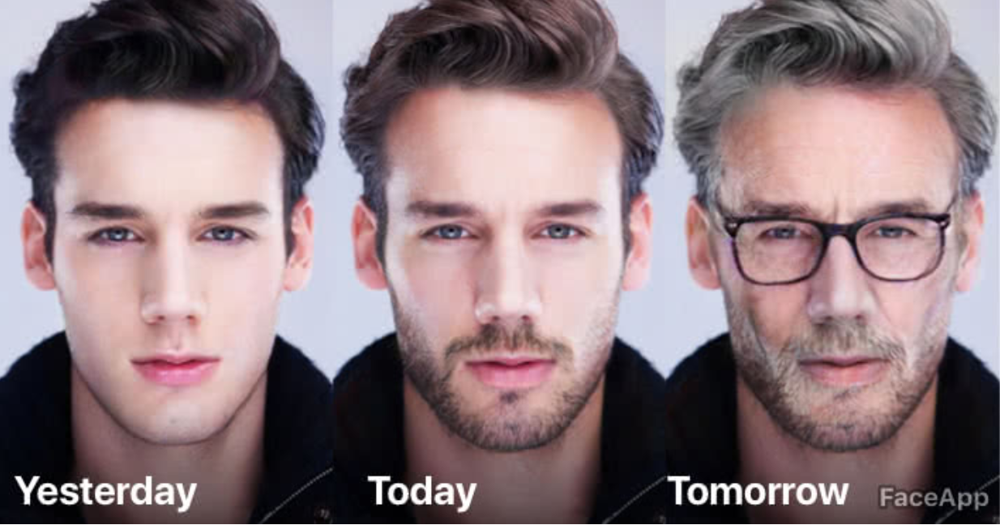

## Algoritmi Generativi

### 5.1 Introduzione

Gli **algoritmi generativi** come le reti neurali sono tra le tecnologie più avanzate e rivoluzionarie nel campo dell'Intelligenza Artificiale (AI). Questi strumenti permettono alle macchine di creare nuovi contenuti, come immagini, suoni e testo, che sono indistinguibili da quelli prodotti dagli esseri umani. Questo capitolo esplora i concetti fondamentali degli algoritmi generativi e le sue  applicazioni pratiche.

### 5.2 Cosa sono gli Algoritmi Generativi?

#### 5.2.1 Definizione di Algoritmi Generativi

Gli **algoritmi generativi** sono una classe di algoritmi di apprendimento automatico che generano dati sintetici, come immagini, suoni o testo, che sono simili a quelli reali. Questi algoritmi utilizzano una rete neurale artificiale per apprendere i modelli di dati reali e quindi generare nuovi dati sintetici.

#### 5.2.2 Perché gli Algoritmi Generativi sono importanti?

Gli algoritmi generativi sono importanti perché permettono di creare contenuti nuovi e originali senza la necessità di un intervento umano diretto. Questo apre nuove possibilità in campi come l'arte, la musica, il design e l'intrattenimento. Inoltre, gli algoritmi generativi possono essere utilizzati per aumentare i dataset esistenti, migliorando le prestazioni dei modelli di Machine Learning.

#### 5.2.3 Come funzionano gli Algoritmi Generativi?

Gli algoritmi generativi funzionano apprendendo i pattern e le strutture presenti nei dati di addestramento. Una volta addestrati, questi algoritmi possono generare nuovi dati che seguono le stesse distribuzioni e caratteristiche dei dati originali. Questo processo è spesso basato su tecniche come le **Reti Generative Avversariali (GAN)** e le **Reti Neurali Ricorrenti (RNN)**.

### 5.3 Reti Generative Avversariali (GAN)

#### 5.3.1 Cos'è una GAN?

Una **Rete Generativa Avversaria (GAN)** è un'architettura di apprendimento automatico introdotta da **Ian Goodfellow** nel 2014. Le GAN sono composte da due reti neurali che competono tra loro in un "gioco" a somma zero:

1. **Il Generatore (G)**: Produce dati sintetici cercando di imitare dei dati reali. Il suo obiettivo è creare esempi così convincenti da "ingannare" il Discriminatore.
2. **Il Discriminatore (D)**: Agisce come un "giudice", cercando di distinguere tra dati reali e generati. Deve classificare correttamente i dati come autentici o falsi.

#### 5.3.2 Come funziona una GAN?

Le due reti si allenano simultaneamente:

- Il Generatore migliora progressivamente la qualità dei dati sintetici.
- Il Discriminatore affina la sua capacità di rilevare le falsificazioni.

Questo processo continua fino a quando il Generatore produce dati che il Discriminatore non è più in grado di distinguere da quelli reali.

#### 5.3.3 Applicazioni delle GAN

Le GAN hanno una vasta gamma di applicazioni, tra cui:
- **Generazione di immagini fotorealistiche**: Le GAN possono creare immagini di volti, paesaggi e oggetti che sembrano reali.
- **Conversione di schizzi in fotografie**: Le GAN possono trasformare disegni o schizzi in immagini fotorealistiche.

- **Invecchiamento/ringiovanimento di volti**: Le GAN possono modificare l'età apparente di una persona in una foto.

- **Creazione di opere d'arte**: Le GAN possono generare opere d'arte originali in vari stili.
- **Sintesi di video**: Le GAN possono creare video realistici partendo da descrizioni testuali.

#### 5.3.4 Sfide delle GAN

Nonostante il loro potenziale, le GAN presentano alcune sfide:
- **Instabilità durante l'addestramento**: Le GAN possono essere difficili da addestrare a causa della competizione tra il Generatore e il Discriminatore.
- **Modal Collapse**: Il Generatore può iniziare a produrre sempre lo stesso output, limitando la varietà dei dati generati.
- **Qualità dei dati generati**: Anche se le GAN possono produrre dati realistici, a volte possono generare artefatti o imperfezioni.

### 5.4 Algoritmi Generativi in Azione

#### 5.4.1 Generazione di Immagini

Gli algoritmi generativi, come le GAN, sono utilizzati per creare immagini fotorealistiche, opere d'arte e design. Ad esempio, **DALL-E** è un modello generativo sviluppato da OpenAI che può creare immagini originali basate su descrizioni testuali.

#### 5.4.2 Generazione di Musica

Gli algoritmi generativi possono essere utilizzati per creare musica originale in vari stili. Modelli come **MuseNet** di OpenAI possono generare composizioni musicali complesse basate su input testuali o melodici.

#### 5.4.3 Generazione di Testo

Le RNN e i modelli Transformer, come **GPT-3**, sono utilizzati per generare testo coerente e contestualmente rilevante. Questi modelli possono essere utilizzati per scrivere articoli, poesie, codici di programmazione e molto altro.

#### 5.4.4 Sintesi di Voce

Gli algoritmi generativi possono essere utilizzati per sintetizzare voci realistiche basate su input testuali. Questo è particolarmente utile per applicazioni come gli assistenti vocali e la creazione di contenuti audio.

### 5.5 Sfide e Limiti degli Algoritmi Generativi

#### 5.5.1 Qualità dei Dati Generati

Anche se gli algoritmi generativi possono produrre dati realistici, a volte possono generare artefatti o imperfezioni. È importante valutare la qualità dei dati generati e garantire che siano utili per l'applicazione desiderata.

#### 5.5.2 Bias nei Dati di Addestramento

Gli algoritmi generativi possono essere influenzati da bias presenti nei dati di addestramento, portando a risultati distorti o discriminatori. È importante garantire che i dati di addestramento siano rappresentativi e privi di pregiudizi. Ad esempio se un modello di riconoscimento facciale viene addestrato principalmente su volti di una sola etnia, potrebbe avere difficoltà a riconoscere volti di altre etnie.

#### 5.5.3 Complessità Computazionale

Gli algoritmi generativi, in particolare le GAN, richiedono grandi quantità di dati e risorse computazionali per l'addestramento. Questo può rendere difficile l'implementazione di modelli complessi in contesti con risorse limitate.

#### 5.5.4 Etica e Responsabilità

La capacità degli algoritmi generativi di creare contenuti realistici solleva importanti questioni etiche, come la possibilità di creare deepfake o contenuti falsi. È essenziale utilizzare queste tecnologie in modo responsabile e garantire che siano impiegate per scopi positivi.

### 5.6 Conclusione

Gli algoritmi generativi e le reti neurali sono tecnologie potenti che stanno trasformando il modo in cui creiamo e interagiamo con i contenuti. Dalla generazione di immagini e musica alla sintesi di voce e testo, queste tecnologie hanno applicazioni pratiche in quasi ogni settore. Tuttavia, è essenziale affrontare le sfide e i limiti associati a queste tecnologie, garantendo che siano utilizzate in modo etico e responsabile. Mentre continuiamo a esplorare le potenzialità degli algoritmi generativi, è importante bilanciare l'innovazione con la consapevolezza delle implicazioni sociali e etiche.
