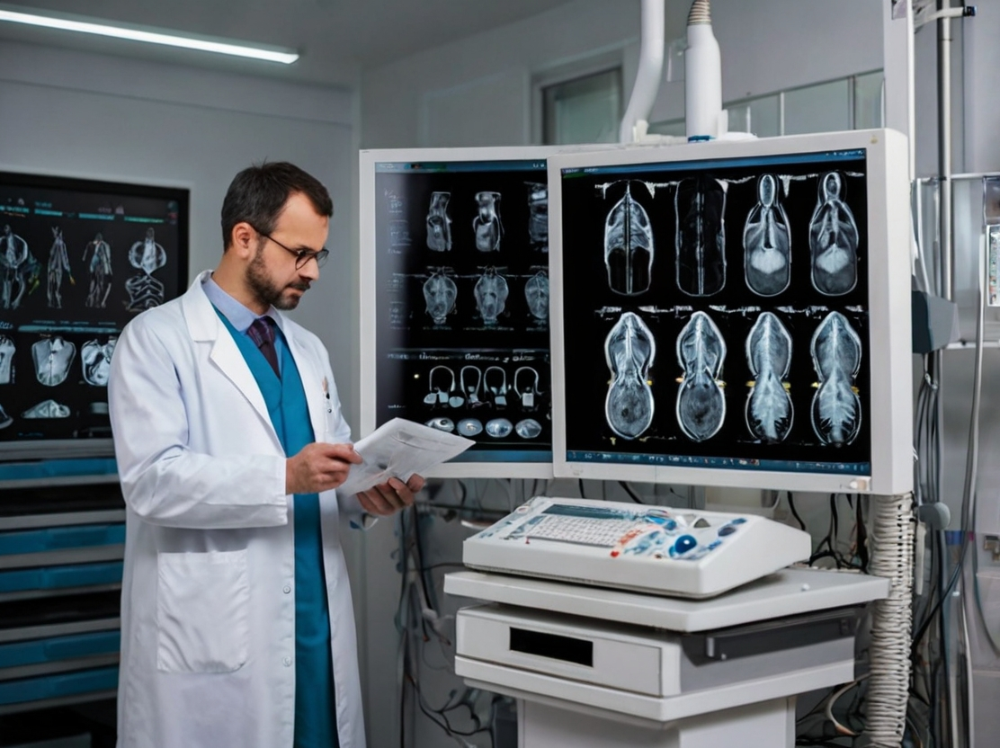
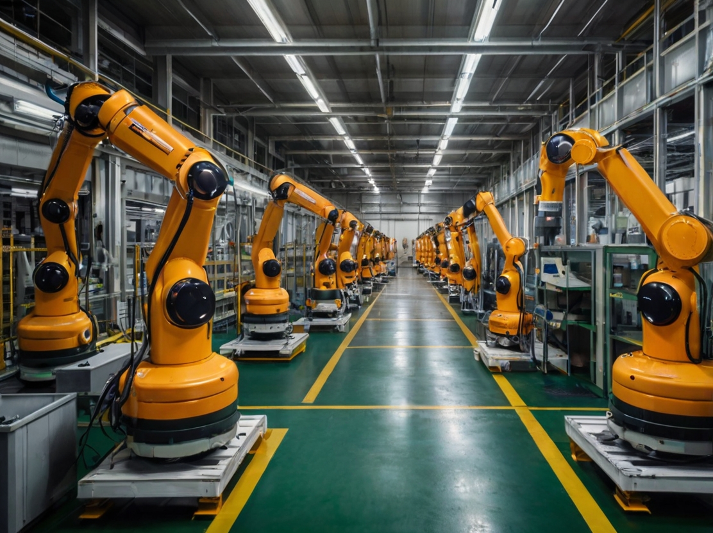

## **Anwendungen der KI**

### **6.1 Einleitung**

Künstliche Intelligenz (KI) hat zahlreiche Sektoren revolutioniert und Innovationen hervorgebracht, die noch vor wenigen Jahrzehnten undenkbar waren. Von der Medizin bis zur Finanzwelt, von der Unterhaltung bis zur industriellen Produktion ist KI zu einem unverzichtbaren Werkzeug geworden, um Effizienz, Präzision und Kreativität zu verbessern. Dieses Kapitel untersucht einige der bedeutendsten Anwendungen der KI und zeigt, wie diese Technologie die Welt, in der wir leben, verändert.

### **6.2 Spiele**

#### **6.2.1 KI in Brett- und Strategiespielen**

KI hat sich in Brett- und Strategiespielen als äußerst effektiv erwiesen, bei denen die Fähigkeit, Züge und Vorhersagen zu berechnen, von grundlegender Bedeutung ist. Eines der berühmtesten Beispiele ist **AlphaGo**, entwickelt von DeepMind, das 2016 den Go-Weltmeister Lee Sedol besiegte. Go ist ein extrem komplexes Spiel mit mehr möglichen Konfigurationen als Partikel im Universum, und der Sieg von AlphaGo markierte einen historischen Meilenstein für die KI.

#### **6.2.2 KI in Videospielen**

In Videospielen wird KI eingesetzt, um nicht spielbare Charaktere (NPCs) zu erstellen, die sich realistisch und anpassungsfähig verhalten. KI-Algorithmen ermöglichen es NPCs, auf die Aktionen des Spielers zu reagieren, aus ihren Strategien zu lernen und immer neue Herausforderungen zu bieten. Darüber hinaus wird KI zur Generierung prozeduraler Inhalte wie offener Welten und Missionen verwendet, wodurch Spiele dynamischer und personalisierter werden.

#### **6.2.3 KI und Schach**

Schach war eines der ersten Gebiete, in denen KI ihre Überlegenheit unter Beweis stellte. Programme wie **Stockfish** und **Komodo** haben Spielstärken erreicht, die die der besten menschlichen Spieler bei weitem übertreffen. Diese Programme verwenden fortschrittliche Suchalgorithmen und neuronale Netze, um Millionen von Zügen pro Sekunde zu bewerten und die beste Strategie auszuwählen.

### **6.3 Verarbeitung natürlicher Sprache (NLP)**

#### **6.3.1 Automatische Übersetzung**

KI hat die automatische Übersetzung revolutioniert und die Kommunikation zwischen Menschen, die verschiedene Sprachen sprechen, in Echtzeit ermöglicht. Dienste wie **Google Translate** verwenden NLP-Modelle, die auf neuronalen Netzen basieren, um Text und Sprache mit immer größerer Genauigkeit zu übersetzen. Diese Modelle werden auf riesigen Mengen mehrsprachiger Daten trainiert und können sprachliche Nuancen und komplexe Kontexte verarbeiten.

#### **6.3.2 Virtuelle Assistenten**

Virtuelle Assistenten wie **Siri**, **Alexa** und **Google Assistant** verwenden KI, um Benutzeranfragen zu verstehen und darauf zu antworten. Diese Systeme kombinieren NLP, Spracherkennung und maschinelles Lernen, um eine natürliche und intuitive Interaktion zu ermöglichen. Virtuelle Assistenten können eine Vielzahl von Aufgaben ausführen, z. B. Erinnerungen einstellen, Informationen suchen, Smart-Home-Geräte steuern und vieles mehr.

#### **6.3.3 Textgenerierung**

KI wird verwendet, um kohärenten und kontextuell relevanten Text wie Artikel, Gedichte, Programmiercode und vieles mehr zu generieren. Modelle wie **ChatGPT** von OpenAI können qualitativ hochwertige Texte basierend auf Texteingaben erstellen und eröffnen neue Möglichkeiten für die Inhaltserstellung und die Automatisierung von Schreibprozessen.

### **6.4 Expertensysteme**

#### **6.4.1 Medizinische Diagnostik**

KI-basierte Expertensysteme werden im medizinischen Bereich zur Analyse klinischer Daten und zur Erstellung genauer Diagnosen eingesetzt. Beispielsweise können KI-Modelle medizinische Bilder wie Röntgenaufnahmen und MRTs analysieren, um Anomalien zu identifizieren und Behandlungen vorzuschlagen. Diese Systeme helfen Ärzten, fundierte Entscheidungen zu treffen und die Effizienz der Versorgung zu verbessern.

#### **6.4.2 Entscheidungsunterstützung**

In Sektoren wie Finanzen und Logistik werden KI-basierte Expertensysteme zur Analyse komplexer Daten und zur Abgabe strategischer Empfehlungen eingesetzt. Beispielsweise verwenden algorithmische Handelssysteme KI, um Finanzmärkte zu analysieren und Anlageentscheidungen in Echtzeit zu treffen. Ebenso verwenden Supply-Chain-Management-Systeme KI, um logistische Prozesse zu optimieren und Kosten zu senken.

### **6.5 Systeme für maschinelles Sehen**

#### **6.5.1 Bilderkennung**

KI wird verwendet, um Objekte, Gesichter und Szenen in Bildern und Videos zu erkennen. Anwendungen wie die Gesichtserkennung werden in Sicherheits-, Überwachungs- und Authentifizierungskontexten eingesetzt. Beispielsweise verwendet **Face ID** von Apple Algorithmen für maschinelles Sehen, um Smartphones sicher und bequem zu entsperren.

#### **6.5.2 Autonomes Fahren**

Selbstfahrende Autos verwenden KI, um die Umgebung wahrzunehmen, Entscheidungen zu treffen und ohne menschliches Eingreifen sicher zu navigieren. Modelle des maschinellen Sehens wie **Convolutional Neural Networks (CNNs)** werden zur Identifizierung von Objekten, Verkehrszeichen und Fußgängern verwendet, während Planungsalgorithmen den optimalen Weg bestimmen.

### **6.6 Gesichts- und Spracherkennung**

#### **6.6.1 Gesichtserkennung**

Gesichtserkennung wird in vielen Anwendungen eingesetzt, vom Entsperren von Smartphones bis zur öffentlichen Überwachung. Systeme wie **Face ID** von Apple und **DeepFace** von Facebook verwenden KI-Algorithmen, um Gesichter präzise zu identifizieren. Diese Technologie wird auch in Sicherheitskontexten wie der Zugangskontrolle und der Identifizierung von Verdächtigen eingesetzt.

#### **6.6.2 Spracherkennung**

Spracherkennung wird verwendet, um Sprache in Text umzuwandeln und eine natürliche Interaktion mit elektronischen Geräten zu ermöglichen. Anwendungen wie **Siri**, **Alexa** und **Google Assistant** verwenden Spracherkennungsalgorithmen, um Benutzeranfragen zu verstehen und darauf zu antworten. Diese Technologie wird auch in beruflichen Kontexten wie der Transkription von Besprechungen und dem Diktieren von Dokumenten eingesetzt.

### **6.7 Handschrifterkennung**

#### **6.7.1 Digitalisierung von Dokumenten**

KI wird verwendet, um Handschriften zu erkennen und zu digitalisieren, was die Archivierung und Suche von Dokumenten erleichtert. Anwendungen wie **Google Translate** können handschriftlichen Text in Echtzeit erkennen und übersetzen, wodurch Zugänglichkeit und Kommunikation verbessert werden.

#### **6.7.2 Authentifizierung**

Handschrifterkennung wird zur biometrischen Authentifizierung verwendet, mit der die Identität einer Person anhand ihrer Handschrift überprüft werden kann. Diese Technologie wird in Sicherheitskontexten wie der digitalen Signatur und der Zugangskontrolle eingesetzt.

### **6.8 Intelligente Roboter**

#### **6.8.1 Industrierobotik**

Intelligente Roboter werden in industriellen Kontexten zur Automatisierung von Produktionsprozessen wie Montage, Schweißen und Lackieren eingesetzt. Diese Roboter verwenden KI, um die Umgebung wahrzunehmen, sich an Veränderungen anzupassen und Abläufe zu optimieren. Dies verbessert die Effizienz, senkt die Kosten und erhöht die Produktqualität.

#### **6.8.2 Servicerobotik**

Serviceroboter werden in häuslichen, gewerblichen und gesundheitlichen Kontexten eingesetzt, um Aufgaben wie Reinigung, Altenpflege und Warenlieferung auszuführen. Diese Roboter verwenden KI, um mit Menschen zu interagieren, in komplexen Umgebungen zu navigieren und sich an neue Situationen anzupassen.

#### **6.8.3 Militärrobotik**

Militärroboter werden für Erkundungs-, Überwachungs- und Kampfeinsätze eingesetzt. Diese Roboter verwenden KI, um die Umgebung wahrzunehmen, autonome Entscheidungen zu treffen und mit anderen Robotern und Soldaten zusammenzuarbeiten. Dies verbessert die Effizienz und Sicherheit militärischer Operationen.

### **6.9 Aufkommende Anwendungen der KI**

#### **6.9.1 KI in der Kreativität**

KI wird verwendet, um Kunstwerke, Musik und Design zu schaffen. Generative Modelle wie **DALL-E** und **MuseNet** können originelle und qualitativ hochwertige Inhalte produzieren und eröffnen neue Möglichkeiten für Kunst und Unterhaltung.

#### **6.9.2 KI im Finanzwesen**

KI wird verwendet, um Finanzmärkte zu analysieren, Trends vorherzusagen und Anlageportfolios zu verwalten. Algorithmische Handelssysteme verwenden KI, um Anlageentscheidungen in Echtzeit zu treffen, die Rentabilität zu verbessern und Risiken zu reduzieren.

#### **6.9.3 KI in der psychischen Gesundheit**

KI wird zur Entwicklung von Anwendungen zur Unterstützung der psychischen Gesundheit eingesetzt, wie z. B. therapeutische Chatbots und Stimmungsüberwachungstools. Diese Anwendungen verwenden KI, um emotionale Unterstützung zu bieten, Stresssignale zu erkennen und Bewältigungsstrategien vorzuschlagen.

### **6.10 Schlussfolgerung**

KI hat einen transformativen Einfluss auf zahlreiche Sektoren und bringt Innovationen hervor, die die Lebensqualität, die Prozesseffizienz und die Kreativität verbessern. Von der Medizin bis zur Finanzwelt, von der Unterhaltung bis zur industriellen Produktion ist KI zu einem unverzichtbaren Werkzeug geworden, um komplexe Herausforderungen anzugehen und neue Möglichkeiten zu schaffen. Während wir das Potenzial der KI weiter erforschen, ist es unerlässlich, Innovation mit dem Bewusstsein für ethische und soziale Auswirkungen in Einklang zu bringen und sicherzustellen, dass diese Technologie verantwortungsvoll und zum Wohle aller eingesetzt wird.
