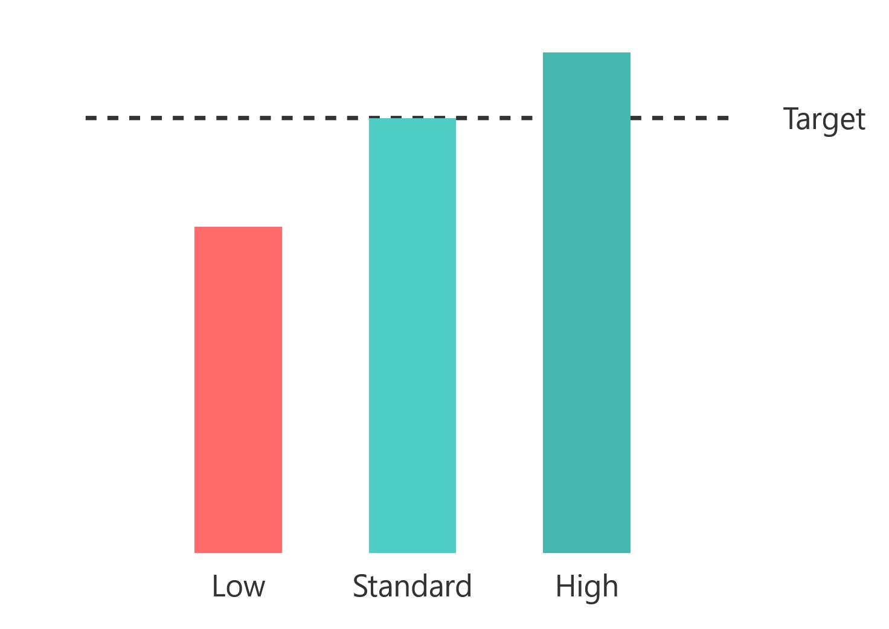

## **Évaluation des IA**

### **7.1 Introduction**

L'évaluation des Intelligences Artificielles (IA) est un processus fondamental pour garantir que les systèmes d'IA sont efficaces, fiables et sûrs. Avec l'adoption croissante de l'IA dans des secteurs critiques tels que la médecine, la finance et la sécurité, il est essentiel de disposer de méthodes robustes pour mesurer les performances, l'utilisabilité, l'éthique et l'interprétabilité des modèles d'IA. Ce chapitre explore les principales approches et outils utilisés pour évaluer les IA, ainsi que les défis et les considérations éthiques associés à ce processus.

### **7.2 Test de Turing**

#### **7.2.1 Qu'est-ce que le Test de Turing ?**

Le **Test de Turing**, proposé par Alan Turing en 1950, a été l'une des premières tentatives de définir un critère pour évaluer l'intelligence d'une machine. Le test prévoit une conversation entre un juge humain et deux participants, un humain et une machine. Si le juge n'est pas capable de distinguer entre les deux, la machine est considérée comme "intelligente".

#### **7.2.2 Applications et Limites du Test de Turing**

Bien que le Test de Turing ait été un point de référence historique, il est aujourd'hui considéré comme une méthode limitée pour évaluer l'intelligence des machines. Le test se concentre principalement sur la capacité à imiter le comportement humain, mais n'évalue pas des aspects tels que la compréhension profonde, la créativité ou la capacité à résoudre des problèmes complexes. De plus, le test est subjectif et dépend de la perception du juge, ce qui le rend peu adapté aux évaluations objectives.

#### **7.2.3 Alternatives Modernes au Test de Turing**

Avec l'évolution de l'IA, de nouvelles méthodes d'évaluation ont été développées qui vont au-delà du simple critère d'imitation. Par exemple, les **benchmarks** tels que **FrontierMath** et **ARC** (AI2 Reasoning Challenge) sont conçus pour tester les capacités de raisonnement et de résolution de problèmes complexes, offrant une mesure plus objective des performances des IA.

### **7.3 Méthodes d'Évaluation des IA**

#### **7.3.1 Évaluation des Performances**

L'évaluation des performances est l'une des méthodes les plus courantes pour mesurer l'efficacité d'un modèle d'IA. Cette approche repose sur des métriques quantitatives telles que l'exactitude, la précision, le rappel et le score F1, qui permettent d'évaluer dans quelle mesure un modèle parvient à accomplir une tâche spécifique.

-   **Exactitude** : Le pourcentage de prédictions correctes par rapport au total des prédictions.
-   **Précision** : Le pourcentage de prédictions positives correctes par rapport au total des prédictions positives.
-   **Rappel** : Le pourcentage de cas positifs correctement identifiés par rapport au total des cas positifs.
-   **Score F1** : La moyenne harmonique de la précision et du rappel, utile pour équilibrer les deux métriques.

#### **7.3.2 Évaluation de l'Utilisabilité**

L'utilisabilité est un aspect crucial pour garantir que les systèmes d'IA sont accessibles et faciles à utiliser pour les utilisateurs finaux. L'évaluation de l'utilisabilité se concentre sur des aspects tels que la conception de l'interface utilisateur, la clarté des réponses et la capacité du système à s'adapter aux besoins des utilisateurs.

-   **Tests d'utilisabilité** : Les utilisateurs interagissent avec le système pendant que les observateurs enregistrent les problèmes et les difficultés.
-   **Questionnaires et sondages** : Les utilisateurs fournissent des commentaires sur leur expérience avec le système.
-   **Analyse des sessions** : Les données d'interaction sont analysées pour identifier les modèles et les domaines d'amélioration.

#### **7.3.3 Évaluation de l'Éthique**

L'éthique est un aspect de plus en plus important dans l'évaluation des IA, en particulier dans les contextes où les décisions algorithmiques peuvent avoir un impact significatif sur la vie des gens. L'évaluation éthique se concentre sur des thèmes tels que les biais algorithmiques, la confidentialité, la sécurité et l'impact sur le travail.

-   **Biais algorithmique** : Les modèles d'IA peuvent être influencés par des préjugés présents dans les données d'entraînement, conduisant à des décisions discriminatoires ou injustes.
-   **Confidentialité** : L'IA nécessite souvent de grandes quantités de données personnelles, soulevant des préoccupations concernant la protection de la vie privée.
-   **Sécurité** : Les systèmes d'IA peuvent être vulnérables aux attaques informatiques, telles que l'empoisonnement des données ou les attaques adverses.
-   **Impact sur le travail** : L'automatisation guidée par l'IA pourrait entraîner la perte d'emplois dans certains secteurs, tout en en créant de nouveaux dans d'autres.

#### **7.3.4 Évaluation de l'Interprétabilité**

L'interprétabilité est la capacité d'un système d'IA à expliquer ses décisions de manière compréhensible pour les êtres humains. Ceci est particulièrement important dans des contextes critiques tels que la médecine et la finance, où il est essentiel de comprendre comment les décisions sont prises.

-   **Modèles interprétables** : Utilisation de modèles simples et transparents, tels que les arbres de décision, qui sont plus faciles à interpréter.
-   **Techniques d'explication** : Utilisation d'outils tels que **LIME** (Local Interpretable Model-agnostic Explanations) et **SHAP** (SHapley Additive exPlanations) pour expliquer les prédictions de modèles complexes.
-   **Visualisation** : Utilisation de graphiques et de diagrammes pour représenter le fonctionnement interne du modèle et ses décisions.

### **7.4 Nouveaux Tests et Benchmarks**

#### **7.4.1 FrontierMath**

**FrontierMath** est un benchmark développé pour tester les capacités de raisonnement mathématique des modèles d'IA. Ce benchmark comprend des problèmes mathématiques complexes et originaux, conçus pour être particulièrement difficiles même pour les experts humains. FrontierMath utilise des systèmes de vérification automatisés pour évaluer les performances des modèles de manière efficace et reproductible.

#### **7.4.2 ARC Benchmark**

L'**ARC Benchmark** (AI2 Reasoning Challenge) a été développé pour tester les capacités de raisonnement des grands modèles de langage (LLM). Ce benchmark comprend des questions complexes à choix multiples, conçues pour évaluer la compréhension profonde du langage et le raisonnement.

### **7.5 Défis dans l'Évaluation des IA**

#### **7.5.1 Biais dans les Données d'Entraînement**

Les modèles d'IA peuvent être influencés par des biais présents dans les données d'entraînement, conduisant à des décisions discriminatoires ou injustes. Il est essentiel de garantir que les données sont représentatives et exemptes de préjugés. Les biais, ou plutôt les biais cognitifs, sont des distorsions que les personnes appliquent dans leurs évaluations des faits et des événements. De telles distorsions nous poussent à recréer notre propre vision subjective qui ne correspond pas fidèlement à la réalité. Dans le cas de l'IA, le biais (ou préjugé) fait référence à des erreurs systématiques dans les résultats d'un modèle d'IA, causées par des hypothèses erronées ou incomplètes présentes dans les données d'entraînement ou dans le processus de développement du modèle.

#### **7.5.2 Complexité Computationnelle**

L'évaluation de modèles d'IA complexes, tels que les réseaux neuronaux profonds, nécessite de grandes quantités de ressources de calcul et de temps. Cela peut rendre difficile l'évaluation à grande échelle ou dans des contextes aux ressources limitées.

#### **7.5.3 Interprétabilité**

Les modèles d'IA, en particulier ceux basés sur l'apprentissage profond, sont souvent considérés comme des "boîtes noires" car il est difficile de comprendre comment ils prennent leurs décisions. Cela soulève des préoccupations concernant la transparence et la fiabilité, en particulier dans les contextes critiques.

#### **7.5.4 Éthique et Responsabilité**

L'évaluation des IA doit tenir compte des implications éthiques et sociales de l'utilisation de cette technologie. Il est essentiel de garantir que les systèmes d'IA sont utilisés de manière responsable et que les décisions sont justifiables et transparentes.

#### **7.5.5 Éthique ou morale ? La culture et la nationalité des développeurs**

Le retour d'information humain dans l'intelligence artificielle est un processus par lequel les êtres humains fournissent des évaluations, des corrections et des indications aux modèles d'apprentissage automatique, les aidant à améliorer leurs performances et à s'affiner. Ce mécanisme permet d'aligner l'IA sur des valeurs éthiques, de réduire les biais, d'améliorer la précision des réponses et de garantir que l'intelligence artificielle réponde de manière plus cohérente et appropriée aux attentes humaines.

Cependant, l'alignement ou le retour d'information humain de l'intelligence artificielle n'est pas seulement une question technique, mais un processus délicat qui reflète profondément les valeurs, l'éthique et la culture de ses développeurs. Chaque système d'intelligence artificielle est "éduqué" à travers d'énormes ensembles de données qui ne sont jamais neutres, mais toujours imprégnés des valeurs, des préjugés et des perspectives des personnes et des institutions qui les sélectionnent et les organisent. Le pays d'origine d'une IA devient donc un facteur crucial : les normes éthiques, les contraintes législatives, les sensibilités culturelles et même les systèmes de censure influencent inévitablement la manière dont l'intelligence artificielle traite les informations et formule les réponses. Une IA développée dans une nation avec une forte tradition de liberté d'expression aura probablement des réponses plus ouvertes et diversifiées qu'une intelligence artificielle créée dans un contexte plus restrictif, où les mécanismes de contrôle et de limitation de la pensée sont plus envahissants. Ce "retour d'information humain" n'est donc pas un simple ajustement technique, mais un véritable processus d'"éducation" morale et culturelle de l'intelligence artificielle, qui en fait un miroir des sociétés qui la génèrent.

Il devient donc essentiel pour l'utilisateur moyen de développer une conscience critique : connaître l'origine d'une intelligence artificielle signifie être capable d'interpréter ses réponses avec un filtre conscient. Tout comme on évalue une source journalistique ou l'avis d'un expert, il en va de même pour l'IA. Se demander d'où elle vient, qui l'a développée, quelles valeurs culturelles et éthiques l'influencent, devient un exercice de pensée critique fondamental. Les informations renvoyées ne doivent pas être accueillies comme des vérités absolues, mais comme des perspectives à analyser, comparer et examiner de manière critique, conscient que derrière chaque réponse se cachent des choix, des filtres et des perspectives qui vont au-delà de la simple donnée informative.

### **7.6 Conclusion**

L'évaluation des IA est un processus complexe et multidisciplinaire qui nécessite l'intégration de méthodes quantitatives, qualitatives et éthiques. Avec l'adoption croissante de l'IA dans des secteurs critiques, il est essentiel de disposer d'outils et d'approches robustes pour garantir que les systèmes d'IA sont efficaces, fiables et sûrs. Alors que nous continuons à développer et à mettre en œuvre de nouvelles technologies d'IA, il est important d'équilibrer l'innovation avec la conscience des implications éthiques et sociales, en garantissant que cette technologie soit utilisée de manière responsable et bénéfique pour tous.
