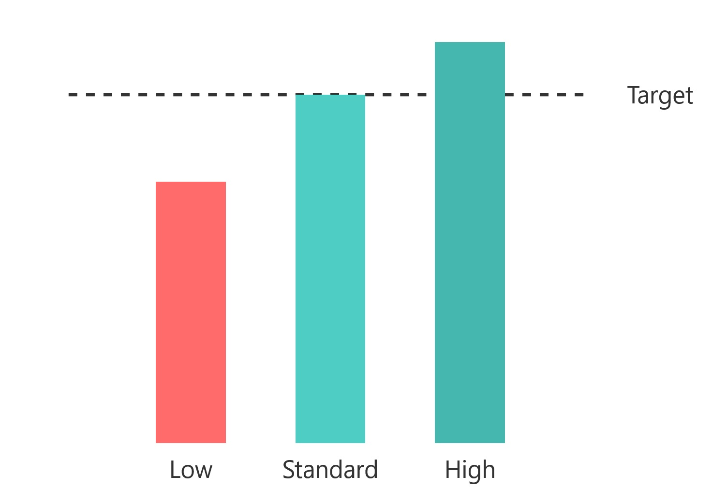

## **Valutazione delle AI**

### **7.1 Introduzione**

La valutazione delle Intelligenze Artificiali (AI) è un processo fondamentale per garantire che i sistemi di AI siano efficaci, affidabili e sicuri. Con l'aumento dell'adozione dell'AI in settori critici come la medicina, la finanza e la sicurezza, è essenziale disporre di metodi robusti per misurare le prestazioni, l'usabilità, l'etica e l'interpretabilità dei modelli di AI. Questo capitolo esplora i principali approcci e strumenti utilizzati per valutare le AI, nonché le sfide e le considerazioni etiche associate a questo processo.

### **7.2 Test di Turing**

#### **7.2.1 Cos'è il Test di Turing?**

Il **Test di Turing**, proposto da Alan Turing nel 1950, è stato uno dei primi tentativi di definire un criterio per valutare l'intelligenza di una macchina. Il test prevede una conversazione tra un giudice umano e due partecipanti, uno umano e uno macchina. Se il giudice non è in grado di distinguere tra i due, la macchina viene considerata "intelligente".

#### **7.2.2 Applicazioni e Limiti del Test di Turing**

Mentre il Test di Turing è stato un punto di riferimento storico, oggi è considerato un metodo limitato per valutare l'intelligenza delle macchine. Il test si concentra principalmente sulla capacità di imitare il comportamento umano, ma non valuta aspetti come la comprensione profonda, la creatività o la capacità di risolvere problemi complessi. Inoltre, il test è soggettivo e dipende dalla percezione del giudice, il che lo rende poco adatto per valutazioni oggettive.

#### **7.2.3 Alternative Moderne al Test di Turing**

Con l'evoluzione dell'AI, sono stati sviluppati nuovi metodi di valutazione che vanno oltre il semplice criterio di imitazione. Ad esempio, i **benchmark** come **FrontierMath** e **ARC** (AI2 Reasoning Challenge) sono progettati per testare le capacità di ragionamento e risoluzione di problemi complessi, offrendo una misura più oggettiva delle prestazioni delle AI.

### **7.3 Metodi di Valutazione delle AI**

#### **7.3.1 Valutazione delle Prestazioni**

La valutazione delle prestazioni è uno dei metodi più comuni per misurare l'efficacia di un modello di AI. Questo approccio si basa su metriche quantitative come l'accuratezza, la precisione, il richiamo e l'F1-score, che permettono di valutare quanto bene un modello riesce a svolgere un compito specifico.

- **Accuratezza**: La percentuale di previsioni corrette rispetto al totale delle previsioni.
- **Precisione**: La percentuale di previsioni positive corrette rispetto al totale delle previsioni positive.
- **Richiamo**: La percentuale di casi positivi correttamente identificati rispetto al totale dei casi positivi.
- **F1-score**: La media armonica di precisione e richiamo, utile per bilanciare i due metrici.

#### **7.3.2 Valutazione dell'Usabilità**

L'usabilità è un aspetto cruciale per garantire che i sistemi di AI siano accessibili e facili da usare per gli utenti finali. La valutazione dell'usabilità si concentra su aspetti come la progettazione dell'interfaccia utente, la chiarezza delle risposte e la capacità del sistema di adattarsi alle esigenze degli utenti.

- **Test di usabilità**: Gli utenti interagiscono con il sistema mentre gli osservatori registrano problemi e difficoltà.
- **Questionari e sondaggi**: Gli utenti forniscono feedback sulla loro esperienza con il sistema.
- **Analisi delle sessioni**: I dati di interazione vengono analizzati per identificare pattern e aree di miglioramento.

#### **7.3.3 Valutazione dell'Etica**

L'etica è un aspetto sempre più importante nella valutazione delle AI, soprattutto in contesti in cui le decisioni algoritmiche possono avere un impatto significativo sulla vita delle persone. La valutazione etica si concentra su temi come il bias algoritmico, la privacy, la sicurezza e l'impatto sul lavoro.

- **Bias algoritmico**: I modelli di AI possono essere influenzati da pregiudizi presenti nei dati di addestramento, portando a decisioni discriminatorie o ingiuste.
- **Privacy**: L'AI spesso richiede grandi quantità di dati personali, sollevando preoccupazioni sulla protezione della privacy.
- **Sicurezza**: I sistemi di AI possono essere vulnerabili ad attacchi informatici, come l'avvelenamento dei dati o gli attacchi adversarial.
- **Impatto sul lavoro**: L'automazione guidata dall'AI potrebbe portare alla perdita di posti di lavoro in alcuni settori, mentre ne creerà di nuovi in altri.

#### **7.3.4 Valutazione dell'Interpretabilità**

L'interpretabilità è la capacità di un sistema di AI di spiegare le sue decisioni in modo comprensibile agli esseri umani. Questo è particolarmente importante in contesti critici come la medicina e la finanza, dove è essenziale comprendere come vengono prese le decisioni.

- **Modelli interpretabili**: Utilizzo di modelli semplici e trasparenti, come gli alberi di decisione, che sono più facili da interpretare.
- **Tecniche di spiegazione**: Utilizzo di strumenti come **LIME** (Local Interpretable Model-agnostic Explanations) e **SHAP** (SHapley Additive exPlanations) per spiegare le previsioni di modelli complessi.
- **Visualizzazione**: Utilizzo di grafici e diagrammi per rappresentare il funzionamento interno del modello e le sue decisioni.

### **7.4 Nuovi Test e Benchmark**

#### **7.4.1 FrontierMath**

**FrontierMath** è un benchmark sviluppato per testare le capacità di ragionamento matematico dei modelli di AI. Questo benchmark include problemi matematici complessi e originali, progettati per essere particolarmente impegnativi anche per esperti umani. FrontierMath utilizza sistemi di verifica automatizzati per valutare le prestazioni dei modelli in modo efficiente e riproducibile.

#### **7.4.2 ARC Benchmark**

L'**ARC Benchmark** (AI2 Reasoning Challenge) è stato sviluppato per testare le capacità di ragionamento dei modelli di linguaggio di grandi dimensioni (LLM). Questo benchmark include domande complesse a scelta multipla, progettate per valutare la comprensione profonda del linguaggio e il ragionamento.

### **7.5 Sfide nella Valutazione delle AI**

#### **7.5.1 Bias nei Dati di Addestramento**

I modelli di AI possono essere influenzati da bias presenti nei dati di addestramento, portando a decisioni discriminatorie o ingiuste. È essenziale garantire che i dati siano rappresentativi e privi di pregiudizi. I bias, o meglio bias cognitivi, sono delle distorsioni che le persone attuano nelle valutazioni di fatti e avvenimenti. Tali distorsioni ci spingono a ricreare una propria visione soggettiva che non corrisponde fedelmente alla realtà. Nel caso dell'AI il bias (o pregiudizio) si riferisce a errori sistematici nei risultati di un modello di AI, causati da ipotesi errate o incomplete presenti nei dati di addestramento o nel processo di sviluppo del modello.

#### **7.5.2 Complessità Computazionale**

La valutazione di modelli di AI complessi, come le reti neurali profonde, richiede grandi quantità di risorse computazionali e tempo. Questo può rendere difficile la valutazione su larga scala o in contesti con risorse limitate.

#### **7.5.3 Interpretabilità**

I modelli di AI, in particolare quelli basati su deep learning, sono spesso considerati "scatole nere" perché è difficile comprendere come prendono decisioni. Questo solleva preoccupazioni sulla trasparenza e l'affidabilità, specialmente in contesti critici.

#### **7.5.4 Etica e Responsabilità**

La valutazione delle AI deve considerare le implicazioni etiche e sociali dell'uso di questa tecnologia. È essenziale garantire che i sistemi di AI siano utilizzati in modo responsabile e che le decisioni siano giustificabili e trasparenti.

#### **7.5.5 Etica o morale? La cultura e la nazionalità degli sviluppatori**

Lo human feedback nell'intelligenza artificiale è un processo mediante il quale gli esseri umani forniscono valutazioni, correzioni e indicazioni ai modelli di apprendimento automatico, aiutandoli a migliorare le loro prestazioni e a raffinarsi. Questo meccanismo permette di allineare l'AI con valori etici, ridurre bias, migliorare la precisione delle risposte e garantire che l'intelligenza artificiale risponda in modo più coerente e appropriato alle aspettative umane.

Tuttavia l'allineamento o human feedback, dell'intelligenza artificiale non è solo una questione tecnica, ma un delicato processo che riflette profondamente i valori, l'etica e la cultura dei suoi sviluppatori. Ogni sistema di intelligenza artificiale viene "educato" attraverso enormi set di dati che non sono mai neutrali, ma sempre intrisi dei valori, dei pregiudizi e delle prospettive delle persone e delle istituzioni che li selezionano e li curano. Il paese di origine di un'IA diventa quindi un fattore cruciale: le norme etiche, i vincoli legislativi, le sensibilità culturali e persino i sistemi di censura influenzano inevitabilmente il modo in cui l'intelligenza artificiale elabora le informazioni e formula le risposte. Un'IA sviluppata in una nazione con una forte tradizione di libertà di espressione avrà probabilmente risposte più aperte e diversificate rispetto a un'intelligenza artificiale creata in un contesto più restrittivo, dove i meccanismi di controllo e limitazione del pensiero sono più pervasivi. Questo "feedback umano" non è dunque un semplice aggiustamento tecnico, ma un vero e proprio processo di "educazione" morale e culturale dell'intelligenza artificiale, che la rende uno specchio delle società che la generano.

Diventa quindi essenziale per l'utente medio sviluppare una consapevolezza critica: conoscere l'origine di un'intelligenza artificiale significa essere in grado di interpretare le sue risposte con un filtro consapevole. Proprio come si valuta una fonte giornalistica o un parere di un esperto, altrettanto deve avvenire con l'IA. Chiedersi da dove proviene, chi l'ha sviluppata, quali valori culturali e etici la influenzano, diventa un esercizio di pensiero critico fondamentale. Le informazioni restituite non vanno accolte come verità assolute, ma come prospettive da analizzare, confrontare e vagliare criticamente, consapevoli che dietro ogni risposta si nascondono scelte, filtri e prospettive che vanno oltre il mero dato informativo.

### **7.6 Conclusione**

La valutazione delle AI è un processo complesso e multidisciplinare che richiede l'integrazione di metodi quantitativi, qualitativi ed etici. Con l'aumento dell'adozione dell'AI in settori critici, è essenziale disporre di strumenti e approcci robusti per garantire che i sistemi di AI siano efficaci, affidabili e sicuri. Mentre continuiamo a sviluppare e implementare nuove tecnologie di AI, è importante bilanciare l'innovazione con la consapevolezza delle implicazioni etiche e sociali, garantendo che questa tecnologia sia utilizzata in modo responsabile e benefico per tutti.
